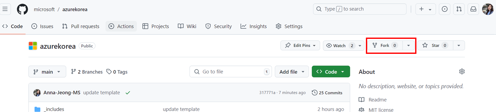
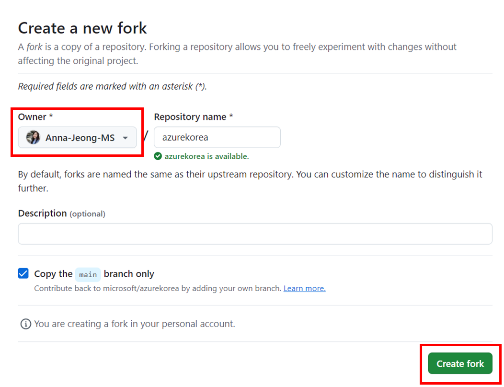
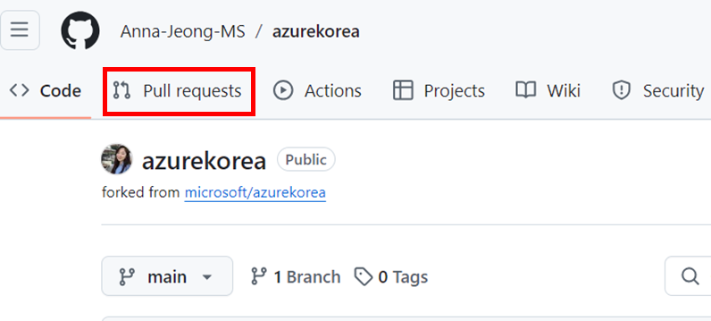
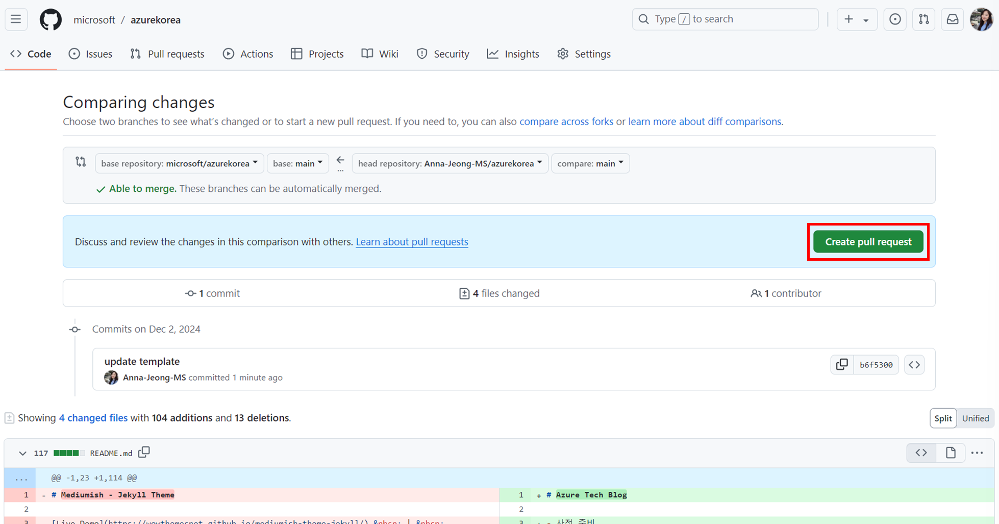

# Azure Tech Blog

- 사전 준비
- 포스트 작성 가이드
- 포스트 업로드

### 사전 준비

**Repository fork**

1. 브라우저에서 [https://github.com/microsoft/azurekorea](https://github.com/microsoft/azurekorea)에 접속한 뒤, 회사 계정으로 GitHub에 로그인합니다.
2. 오른쪽 상단 Fork 버튼을 클릭합니다.
    
    
    
3. Owner에 본인 계정을 선택하고 Create fork 버튼을 클릭합니다.
    
    
    
4. Fork가 완료되면 본인 계정에서 azurekorea Repository를 확인할 수 있습니다. 
5. Code 버튼을 눌러 Clone URL을 복사 후, 로컬 디렉토리에서 아래 명령어를 사용해 Repository를 Clone합니다.
    
    ```bash
    git clone {Clone URL}
    ```
    

### 포스트 작성 가이드

수정할 부분은 아래와 같습니다.

- _posts : 실제 포스트.md 업로드 폴더
- assets/images/profiles : 프로필 사진(필수) 업로드 폴더
- assets/images/thumbnails : 포스트 썸네일(필수) 업로드 폴더
- assets/images/{본인alias} (생성): 포스트 내 이미지 업로드 폴더
- _config.yml : 작성자 정보 등록 파일 (최초 1회)

**작성자 정보 등록**

1. assets/images/profiles 폴더에 본인이 사용할 프로필 이미지를 복사해 줍니다.
2. _config.yml 파일을 열어 authors: 필드 마지막에 아래 내용을 추가해 줍니다.
    
    ```yaml
    {alias}:
        name: {alias}
        display_name: {writer name}
        avatar: 'assets/images/profiles/{profile_image_name}'
        email: {alias}@microsoft.com
        description: {description}
    
    **example**
      annajeong:
        name: annajeong
        display_name: Boram Jeong
        avatar: 'assets/images/profiles/annajeong.jpg'
        email: annajeong@microsoft.com
        description: "Azure Infra Technical Specialist"
    ```
    

**포스트 작성**

1. _posts 폴더에 {yyyy-mm-dd}-{postname}.md 파일을 생성합니다.
2. 최상단에 아래 내용을 작성합니다.
    
    ```yaml
    ---
    layout: post
    title:  "{post title}"
    author: {alias}
    tag: [ {,으로 구분하여 작성} ]
    category: [ Solution / Update / Business 중 선택 1]
    image: assets/images/thumnails/{thumbnail_image_name}
    ---
    ```
    
3. Markdown을 활용해 내용을 작성합니다.
4. 작성이 완료되면 thumbnails로 사용할 이미지를 assets/images/thumbnails에 복사한 뒤, 상단의 image 부분을 수정합니다.

**[링크 첨부]**
1. 아래와 같이 사용합니다.
    ```markdown
    [링크 설명](http://)
    ```
    * 링크 설명에 '|'가 있으면 인식이 안됩니다.

**[이미지 첨부]**

1. assets/images/{alias} 폴더 하위에 images 폴더에 이미지를 업로드합니다.
2. 아래와 같이 사용합니다.
    
    ```markdown
    
    ```
    

**[YouTube 동영상 첨부]**

1. 아래와 같이 사용합니다.
    
    ```markdown
    [](https://youtu.be/{동영상 HASH})
    ```
    

* 이 외의 내용은 Markdown 표준 작성법에 따릅니다.

### 포스트 업로드

1. Repository Clone 받은 폴더로 이동하여 터미널을 켭니다.
2. 아래 명령어를 사용하여 본인 Repository에 변경 내용을 푸시합니다.
    
    ```markdown
    git add .
    git commit -m "commit messgage"
    git push
    ```
    
3. GitHub 포털에 접속하여 본인 Repository로 이동합니다.
4. 상단의 Pull Requests 를 클릭합니다.
    
    

5. New pull request 버튼을 클릭합니다.
6. 변경 내용을 확인한 후 Create pull request 버튼을 클릭합니다.

    