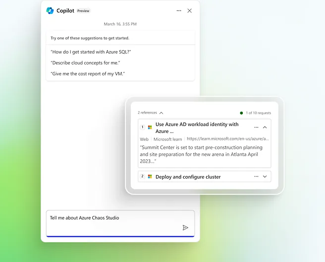

타사 클라우드만을 사용해 봐서 (locked in) 아직 Azure 에 대해 서먹서먹하고 어떻게 활용하는지 portal 에서 부터 너무 달라서 어려움이 있으신가요? 온프렘 환경에 익숙하셔서 아직 클라우드 환경은 어려우신가요?
자, 오늘은 Azure 를 사용하시는 모든 분들께 Azure Architect 한 분을 곁에 24시간 착! 붙여드리려고 왔습니다. 누군가 Architect 비서 한 명이 옆에서 어떤 것을 물어보더아도 친절히 알려준다면 얼마나 든든하시겠어요?
여기, Copliot in Azure 가 있습니다. 

[Microsoft Copilot in Azure-AI Companion and Assistant | Microsoft Azure](https://nam06.safelinks.protection.outlook.com/?url=https%3A%2F%2Fazure.microsoft.com%2Fen-us%2Fproducts%2Fcopilot%3Fmsockid%3D354816183e85639134c002c03fac6293%23Overview&data=05%7C02%7Csrjeon%40microsoft.com%7Cf372a69f0fff4f59817f08dcf7b98817%7C72f988bf86f141af91ab2d7cd011db47%7C1%7C0%7C638657623438138579%7CUnknown%7CTWFpbGZsb3d8eyJFbXB0eU1hcGkiOnRydWUsIlYiOiIwLjAuMDAwMCIsIlAiOiJXaW4zMiIsIkFOIjoiTWFpbCIsIldUIjoyfQ%3D%3D%7C0%7C%7C%7C&sdata=ZZAzd2upL9WCZTy9fRqQCgB1Ct%2BCYdr%2B7nzFUimP8z4%3D&reserved=0)

아주 쉽습니다. Azure portal 에서 Copilot 을 브라우저 안에서 부르시면 됩니다. (현재는 Preview 상태이므로 신청하셔서 사용해 보세요)
이전처럼 포털에 접속하여 브라우저를 하나 이상 더 띄우고 docu, 유투브 등을 키워드와 문장 중심으로 검색하여 가장 알맞은 것을 선택하고, 읽어 보고, 이해한 뒤에 다시 포털로 돌아와서 커맨드나 메뉴를 따라 들어가는 것은….. 이미 옛날 방식이 되어 가는 것이죠.
이제는 여러분들이 생각하고 계신 ‘무엇을 하고 싶은지’를 자연어로 코파일럿에게 물어보시고, 그에 맞는 답을 코파일럿이 답을 해 주면 판단하시고, 포털에서 실행까지 연동시키면 됩니다.
작년 Ignite 행사에서 소개로 나온 영상을 보시면 좀 더 쉽게 이해가 되실 겁니다.

자, 그럼 어떻게 활용하면 될지 사례를 통해 한번 알아 볼까요?
코파일럿과 소통을 잘 하시려면 prompt 를 잘 선택하셔야 합니다.
[Write effective prompts for Microsoft Copilot in Azure | Microsoft Learn](https://nam06.safelinks.protection.outlook.com/?url=https%3A%2F%2Flearn.microsoft.com%2Fen-us%2Fazure%2Fcopilot%2Fwrite-effective-prompts&data=05%7C02%7Csrjeon%40microsoft.com%7Cf372a69f0fff4f59817f08dcf7b98817%7C72f988bf86f141af91ab2d7cd011db47%7C1%7C0%7C638657623438156350%7CUnknown%7CTWFpbGZsb3d8eyJFbXB0eU1hcGkiOnRydWUsIlYiOiIwLjAuMDAwMCIsIlAiOiJXaW4zMiIsIkFOIjoiTWFpbCIsIldUIjoyfQ%3D%3D%7C0%7C%7C%7C&sdata=SDhJxSVAALJMi%2BKXViU%2FoGAxOsA3nm7Xt1qtlNlBFtE%3D&reserved=0)

인공지능과 대화는 내가 하고 싶은 것을 구체적으로 표현할 때 더 똑똑한 답을 내 놓으니까요.
적정 VM 을 추천 받아서 직접 배포 해 볼까요? 아래 prompt 를 사용해 보세요
Help me choose a size for my virtual machine
From [<https://learn.microsoft.com/en-us/azure/copilot/deploy-vms-effectively#choose-the-right-size-for-your-vms>](https://nam06.safelinks.protection.outlook.com/?url=https%3A%2F%2Flearn.microsoft.com%2Fen-us%2Fazure%2Fcopilot%2Fdeploy-vms-effectively%23choose-the-right-size-for-your-vms&data=05%7C02%7Csrjeon%40microsoft.com%7Cf372a69f0fff4f59817f08dcf7b98817%7C72f988bf86f141af91ab2d7cd011db47%7C1%7C0%7C638657623438173412%7CUnknown%7CTWFpbGZsb3d8eyJFbXB0eU1hcGkiOnRydWUsIlYiOiIwLjAuMDAwMCIsIlAiOiJXaW4zMiIsIkFOIjoiTWFpbCIsIldUIjoyfQ%3D%3D%7C0%7C%7C%7C&sdata=%2FFdS9kq5be%2F1AyqhArocGegUw6ioB9YppHmkSuu0ZDY%3D&reserved=0)

App 에서 발생하는 문제를 해결해 볼까요?
“Troubleshoot performance issues with my app”
From [<https://learn.microsoft.com/en-us/azure/copilot/troubleshoot-app-service#sample-prompts>](https://nam06.safelinks.protection.outlook.com/?url=https%3A%2F%2Flearn.microsoft.com%2Fen-us%2Fazure%2Fcopilot%2Ftroubleshoot-app-service%23sample-prompts&data=05%7C02%7Csrjeon%40microsoft.com%7Cf372a69f0fff4f59817f08dcf7b98817%7C72f988bf86f141af91ab2d7cd011db47%7C1%7C0%7C638657623438190299%7CUnknown%7CTWFpbGZsb3d8eyJFbXB0eU1hcGkiOnRydWUsIlYiOiIwLjAuMDAwMCIsIlAiOiJXaW4zMiIsIkFOIjoiTWFpbCIsIldUIjoyfQ%3D%3D%7C0%7C%7C%7C&sdata=A7FmxjJ5zeQRkJJmPWiW4gB%2BbR%2F2hSxUyplO3dP1QDg%3D&reserved=0)
K8S YAML 파일을 한번 만들게 시켜 볼까요?

도대체 7월 8일날 가격이 왜이렇게 올라갔지?
“Why did my cost spike on July 8th?”
From [<https://learn.microsoft.com/en-us/azure/copilot/analyze-cost-management#sample-prompts>](https://nam06.safelinks.protection.outlook.com/?url=https%3A%2F%2Flearn.microsoft.com%2Fen-us%2Fazure%2Fcopilot%2Fanalyze-cost-management%23sample-prompts&data=05%7C02%7Csrjeon%40microsoft.com%7Cf372a69f0fff4f59817f08dcf7b98817%7C72f988bf86f141af91ab2d7cd011db47%7C1%7C0%7C638657623438206865%7CUnknown%7CTWFpbGZsb3d8eyJFbXB0eU1hcGkiOnRydWUsIlYiOiIwLjAuMDAwMCIsIlAiOiJXaW4zMiIsIkFOIjoiTWFpbCIsIldUIjoyfQ%3D%3D%7C0%7C%7C%7C&sdata=7g%2BeWz4OQbh4T54OGtSStR2ChTdYOoRkVRKi%2BT%2B15Wk%3D&reserved=0)
이렇게 여러가지 다양한 prompt 들을 가지고 한번 실험을 해 보세요.
그리고 실제 여러분들이 필요한 작업을 코파일럿과 대화하면서 묻고 배우고 작업을 시켜 보세요.
여러분들이 정확하게만 지시한다면 코파일럿 AI 아키텍트는 생각보다 똑똑하답니다.
이제 자연어로 포털에서 클라우드를 운영하고 구동해 보세요!~
참고 자료:
Copilot in Azure 소개: [Microsoft Copilot in Azure — AI Companion and Assistant | Microsoft Azure](https://nam06.safelinks.protection.outlook.com/?url=https%3A%2F%2Fazure.microsoft.com%2Fen-us%2Fproducts%2Fcopilot%3Fmsockid%3D354816183e85639134c002c03fac6293%23Overview&data=05%7C02%7Csrjeon%40microsoft.com%7Cf372a69f0fff4f59817f08dcf7b98817%7C72f988bf86f141af91ab2d7cd011db47%7C1%7C0%7C638657623438138579%7CUnknown%7CTWFpbGZsb3d8eyJFbXB0eU1hcGkiOnRydWUsIlYiOiIwLjAuMDAwMCIsIlAiOiJXaW4zMiIsIkFOIjoiTWFpbCIsIldUIjoyfQ%3D%3D%7C0%7C%7C%7C&sdata=ZZAzd2upL9WCZTy9fRqQCgB1Ct%2BCYdr%2B7nzFUimP8z4%3D&reserved=0)

프롬프트 예시: [Write effective prompts for Microsoft Copilot in Azure | Microsoft Learn](https://nam06.safelinks.protection.outlook.com/?url=https%3A%2F%2Flearn.microsoft.com%2Fen-us%2Fazure%2Fcopilot%2Fwrite-effective-prompts&data=05%7C02%7Csrjeon%40microsoft.com%7Cf372a69f0fff4f59817f08dcf7b98817%7C72f988bf86f141af91ab2d7cd011db47%7C1%7C0%7C638657623438156350%7CUnknown%7CTWFpbGZsb3d8eyJFbXB0eU1hcGkiOnRydWUsIlYiOiIwLjAuMDAwMCIsIlAiOiJXaW4zMiIsIkFOIjoiTWFpbCIsIldUIjoyfQ%3D%3D%7C0%7C%7C%7C&sdata=SDhJxSVAALJMi%2BKXViU%2FoGAxOsA3nm7Xt1qtlNlBFtE%3D&reserved=0)

