*본 글은 [Azure VMware Solution Availability Design Considerations](https://techcommunity.microsoft.com/t5/azure-migration-and/azure-vmware-solution-availability-design-considerations/ba-p/3682915) 의 많은 내용을 참고하였습니다.*

고객께서 애플리케이션 현대화 전략의 일환으로 수천 개의 VMware vSphere 가상 머신(VM)을 Microsoft Azure로 마이그레이션하고자 하는 계획이 있을 때, 온프레미스 데이터 센터를 종료하고 애플리케이션 VM을 Azure VMware Solution(이하 AVS)으로 신속하게 이전하는 것부터 시작할 수 있습니다.

AVS는 전용 베어메탈 Azure 인프라로 구축된 VMware vSphere 클러스터가 포함된 프라이빗 클라우드를 제공하는 Microsoft의 검증된 1st party Azure 서비스입니다. 이를 통해 고객은 VMware 기술 및 툴에 대한 기존 투자를 활용할 수 있으므로 Azure에서 VMware 기반 워크로드를 개발하고 실행하는 데 집중할 수 있습니다.

이 게시물에서는 일반적인 고객 워크로드 가용성 요구 사항과 AVS 아키텍처 구성 요소를 소개하고, AVS 프라이빗 클라우드의 가용성 디자인 고려 사항에 대해 설명합니다.

우선 고객 워크로드의 일반적인 가용성 요구 사항부터 시작하겠습니다.

***고객 가용성 요구사항***

대부분의 고객은 충족해야 하는 *특정 서비스 수준 계약(SLA)* 요건이 있는 여러 애플리케이션 계층들을 보유하고 있습니다. 이러한 SLA는 일반적으로 플래티넘, 골드, 실버, 브론즈 또는 미션 크리티컬, 비즈니스 크리티컬, 프로덕션, 테스트/개발과 같은 티어링 시스템으로 명명됩니다. 각 SLA별로 충족해야 하는 가용성, 복구 가능성, 성능, 관리 용이성 및 보안 요구 사항이 다릅니다.

가용성 디자인의 경우, 고객은 각 가용성 영역(Availability Zone,이하 AZ)나 리전에 대해 SLA수준을 정의하는 가동시간을 고려해야 합니다.

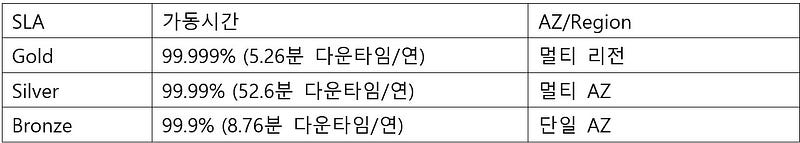

표 1- 가용성에 대한 일반적인 고객 SLA 요구 사항

일반적인 레거시용 비즈니스 크리티컬 애플리케이션의 아키텍쳐 구성요소는 다음과 같습니다.

- 로드 밸런서 계층: 로드 밸런서를 사용하여 웹 계층의 여러 웹 서버에 트래픽을 분산하여 애플리케이션 가용성을 개선합니다.
- 웹 계층: 웹 서버를 사용하여 HTTPS(보안 하이퍼텍스트 전송 프로토콜)를 통해 이루어진 클라이언트 요청을 처리합니다. 로드 밸런서 계층에서 트래픽을 수신하여 애플리케이션 계층으로 전달합니다.
- 애플리케이션 계층: 애플리케이션 서버를 사용하여 통신 프로토콜을 통해 비즈니스 애플리케이션을 제공하는 소프트웨어를 실행합니다. 웹 계층에서 트래픽을 수신하고 데이터베이스 계층을 사용하여 저장된 데이터에 액세스합니다.
- 데이터베이스 계층: 관계형 데이터베이스 관리 서비스(RDMS) 클러스터를 사용하여 데이터를 저장하고 애플리케이션 계층에 데이터베이스 서비스를 제공합니다.

서비스의 가용성 요구 사항에 따라 애플리케이션 구성 요소는 고객 SLA를 충족하기 위해 여러 사이트와 지역에 분산되어 있을 수 있습니다.

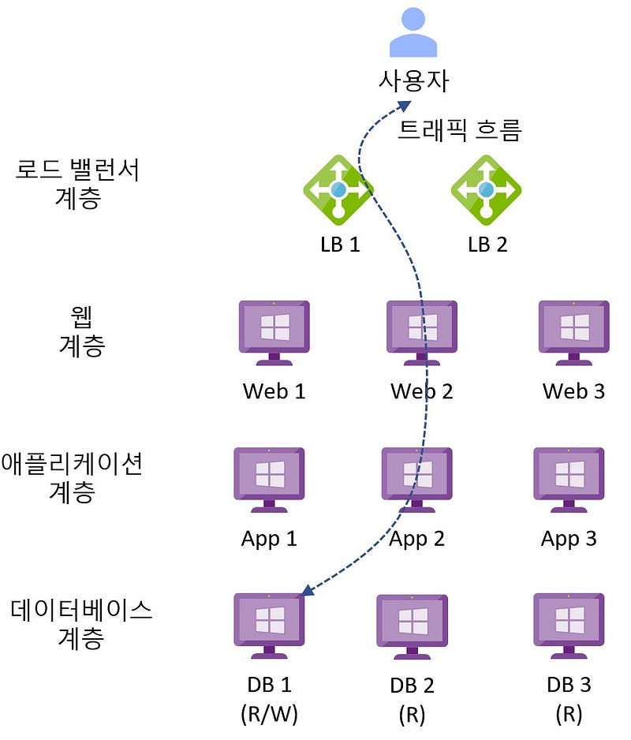

그림 1 — 일반적인 레거시 비즈니스 크리티컬 애플리케이션 아키텍처

다음 섹션에서는 AVS의 아키텍처 구성 요소를 소개합니다.

***아키텍처 구성요소***

아래 다이어그램은 AVS의 아키텍처 구성 요소를 보여줍니다.

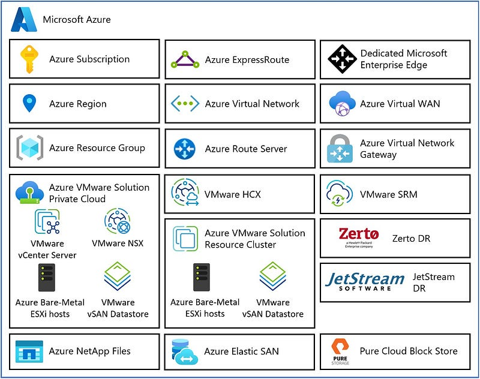

그림 2 — AVS 아키텍처 구성요소

각 AVS 아키텍처 구성 요소는 다음과 같습니다.

- **Azure 구독**: AVS에 대한 접근 제어, 예산 및 할당량 관리를 제공하는 데 사용됩니다.
- **Azure 지역**: 데이터 센터를 AZ로 그룹화한 다음 AZ를 지역으로 그룹화하는 전 세계의 물리적 위치입니다.
- **Azure 리소스 그룹**: Azure 서비스 및 리소스를 논리적 그룹에 배치하는 데 사용되는 자원의 단위 컨테이너.
- **AVS 프라이빗 클라우드**: vCenter Server, NSX 소프트웨어 정의 네트워킹, vSAN 소프트웨어 정의 스토리지, Azure 베어메탈 ESXi 호스트를 포함한 VMware 소프트웨어를 사용하여 컴퓨팅, 네트워킹, 스토리지 리소스등 VMware 전체 스택을 제공합니다. Azure NetApp Files, Azure Elastic SAN, 퓨어 클라우드 블록 스토어도 지원됩니다.  VMware 환경을 Azure로 마이그레이션하거나 새로운 VMware 클라우드를 구축하고자 하는 고객에게 적합합니다.
- **AVS 리소스 클러스터**: AVS Private Cloud의 일부로, 특정 리소스를 할당하는 클러스터입니다. 특정 애플리케이션 또는 작업에 필요한 자원을 할당하고 관리하는 데 중점을 둡니다. vSAN 소프트웨어 정의 스토리지를 포함한 VMware 소프트웨어와 Azure 베어메탈 ESXi 호스트를 사용하여 AVS 프라이빗 클라우드를 확장함으로써 고객 워크로드를 위한 컴퓨팅, 네트워킹, 스토리지 리소스를 제공합니다. Azure NetApp Files, Azure Elastic SAN, 퓨어 클라우드 블록 스토어도 지원됩니다.
- **VMware HCX**: 모빌리티, 마이그레이션, 네트워크 확장 서비스를 제공합니다.
- **VMware Site Recovery**: 재해 복구 자동화 및 VMware vSphere Replication을 통한 스토리지 복제 서비스를 제공합니다. 타사 재해 복구 솔루션인 Zerto DR 및 JetStream DR도 지원됩니다.
- **전용 Microsoft 엔터프라이즈 엣지(D-MSEE)**: Azure 클라우드와 AVS 프라이빗 클라우드 인스턴스 간의 연결을 제공하는 라우터입니다.
- **Azure 가상 네트워크(VNet)**: Azure 서비스 및 리소스를 함께 연결하는 데 사용되는 프라이빗 네트워크.
- **Azure 라우트 서버**: 네트워크 어플라이언스가 Azure 네트워크와 동적 라우팅 정보를 교환할 수 있도록 합니다.
- **Azure 가상 네트워크 게이트웨이**: Azure 서비스 및 리소스를 다른 프라이빗 네트워크에 연결하기 위한 온-프레미스 간 게이트웨이로, IPSec VPN, ExpressRoute 및 VNet-to-VNet을 사용합니다.
- **Azure ExpressRoute**: Azure 데이터 센터와 온-프레미스 또는 코로케이션 인프라 간에 고속 프라이빗 연결을 제공합니다.
- **Azure 가상 WAN(vWAN)**: 네트워킹, 보안 및 라우팅 기능을 하나의 통합된 WAN(광역 네트워크)으로 통합합니다.   다음 섹션에서는 AVS의 가용성 디자인 고려 사항에 대해 설명합니다.

***가용성 디자인 고려사항***

아키텍처 디자인 프로세스는 해결해야 할 비즈니스 문제와 달성해야 할 비즈니스 목표를 파악하고 이를 고객 요구사항, 디자인 제약 조건 및 가정으로 추출합니다. 디자인 제약 조건은 다음 세 가지 범주로 특징 지을 수 있습니다.

- 공간 제약의 법칙 : 데이터 및 애플리케이션 주권, 거버넌스, 규제, 규정 준수 등
- 물리 법칙 : 데이터 및 기계 중력, 네트워크 지연 시간 등
- 경제학의 법칙 : 소유 Vs 임대, 총소유비용(TCO), 투자 수익률(ROI), 자본 지출, 운영 지출, 이자, 세금, 감가상각비, 상각 전 영업이익(EBITDA) 등입니다.   각 디자인 고려 사항은 가용성, 복구 가능성, 성능, 관리 용이성 및 보안 디자인 품질 간의 절충점이 될 것입니다. 바람직한 결과는 고객의 목표로부터 출발하여 최소한의 위험으로 비즈니스 가치를 제공하는 것입니다.

**디자인 고려 사항 1 — Azure 리전 및 AZ**: AVS은 전 세계 30개의 Azure 리전에서 제공됩니다. 지리적 요구 사항을 충족하는 관련 Azure 리전 및 AZ를 선택합니다. 이러한 위치는 일반적으로 디자인 제약 조건에 따라 결정됩니다. 한국 리전에서도 조만간 AVS가 출시될 예정입니다.

**디자인 고려 사항 2 — 배포 토폴로지**: 고객의 가동 시간 SLA 및 지리적 요구 사항에 가장 적합한 AVS 토폴로지를 선택합니다.

AVS는 프라이빗 클라우드당 최대 12개의 클러스터를 지원합니다. 각 클러스터는 클러스터당 최소 3개에서 최대 16개의 호스트를 지원합니다. 각 프라이빗 클라우드는 최대 96개의 호스트를 지원합니다.

VMware vSphere HA는 ESXi 호스트 장애에 대한 보호 기능을 제공하고 VMware vSphere DRS는 분산된 리소스 관리를 제공합니다. VMware vSphere Fault Tolerance는 Azure VMware 솔루션에서 지원되지 않습니다. 이러한 기능은 관리형 서비스의 일부로 사전 구성되며 고객이 변경할 수 없습니다.

VMware vCenter Server, VMware HCX Manager, VMware SRM 및 VMware vSphere Replication Manager는 개별 애플리케이션이며 vSphere HA로 보호됩니다.

VMware NSX Manager는 3개의 통합 어플라이언스로 구성된 클러스터로, 클러스터 내의 동일 호스트에 할당되지 않도록 분산배치됩니다. VMware NSX Edge 클러스터 역시 한쌍의 어플라이언스로 구성된 클러스터이며 동일 호스트에 배치되지 않도록 분산됩니다.

***토폴로지 1 — AVS 프라이빗 클라우드 표준 토폴로지.*** Azure 리전의 단일 AZ 내에 배포되며, 99.9%의 인프라 SLA를 제공합니다.

그림 3 — AVS 프라이빗 클라우드 표준 토폴로지

***토폴로지 2 — 멀티 AZ*** : 단일 Azure 리전상 별도의 AZ에 배치한 AVS 프라이빗 클라우드. VMware HCX는 AZ간에 프라이빗 클라우드를 연결하는 데 사용됩니다. 멀티 AZ 가용성 메커니즘을 제공하려면 애플리케이션 클러스터링이 필요합니다. 고객은 프라이빗 클라우드 간의 대역폭 및 레이턴시 시간이 어플리케이션 클러스터링 솔루션을 만족하는지 확인할 책임이 있습니다. 이 토폴로지는 99.9% 이상의 SLA를 제공하지만, 고객이 사용하는 애플리케이션 클러스터링 솔루션에 따라 달라질 수 있습니다.

AVS는 프로비전할 때 AZ를 선택할 수 없습니다. 각 개별 AZ에 할당량이 있는 별도의 Azure 구독을 사용하면 이 문제를 해결할 수 있습니다. Microsoft에 기술지원 티켓을 요청하여 구독별로 특정 AZ에 AVS 프라이빗 클라우드를 배포하도록 [특별 배치 정책](https://learn.microsoft.com/en-us/azure/azure-vmware/architecture-private-clouds#azure-region-availability-zone-az-to-sku-mapping-table)을 구성할 수 있습니다.

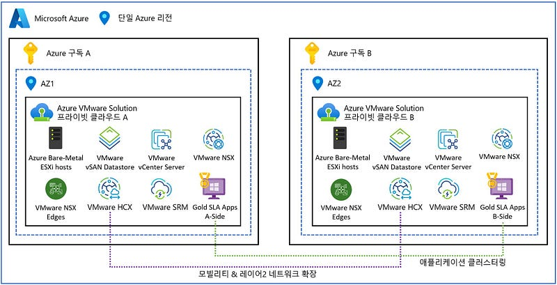

그림 4 — AVS 프라이빗 클라우드 멀티 AZ 토폴로지

***토폴로지 3 — 스트레치***: [AVS 스트레치 클러스터 프라이빗 클라우드](https://learn.microsoft.com/en-us/azure/azure-vmware/deploy-vsan-stretched-clusters)는 단일 Azure 리전내 두개의 AZ에 배포하며, 99.99%의 인프라 SLA를 제공합니다. 세번째 AZ에는 AVS 감시 사이트(AVS witness site)를 배포합니다. 스트레치 클러스터는 정책 기반 동기식 복제를 지원하여 제로 RPO(복구 지점 목표)를 제공합니다.

이 기능은 정식 버전이며 현재 호주 동부, 서유럽, 영국 남부 및 독일 서중앙 Azure 지역에서만 사용할 수 있습니다.

그림 5 — AVS 프라이빗 클라우드 스트레치 클러스터 토폴로지

***토폴로지 4 — 멀티 리전**:* 여러 Azure 리전에 걸쳐있는 AVS 프라이빗 클라우드. VMware HCX는 Azure 리전 간 프라이빗 클라우드를 연결하는 데 사용됩니다. 다중 지역 가용성을 위해 애플리케이션 클러스터링이 필요합니다. 고객은 프라이빗 클라우드 간의 대역폭 및 레이턴시 시간이 어플리케이션 클러스터링 솔루션을 만족하는지 확인할 책임이 있습니다. 이 토폴로지는 99.9% 이상의 SLA를 제공하지만 고객이 사용하는 애플리케이션 클러스터링 솔루션에 따라 달라질 수 있습니다.

하나 또는 두 개의 Azure 리전에서 AVS 스트레치 클러스터를 사용할 수도 있습니다.

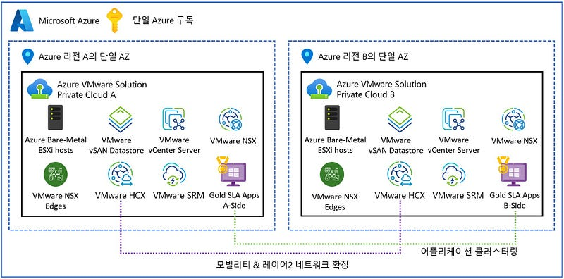

그림 6 — AVS 프라이빗 클라우드 멀티 리전 토폴로지

**디자인 고려 사항 3 — 공유 서비스 또는 별도 서비스 모델**: 관리 및 제어 플레인 클러스터(클러스터-1)는 고객 워크로드 VM과 공유할 수도 있고, 관리 및 제어를 위한 전용 클러스터가 될 수도 있습니다. 여기에는 Active Directory, DNS, DHCP와 같은 고객 엔터프라이즈 서비스가 포함될 수 있습니다. 고객 워크로드 수요를 지원하기 위해 추가 리소스 클러스터를 추가할 수 있습니다.

각 어플리케이션의 SLA에 따라 별도의 클러스터를 사용할 수도 있습니다.

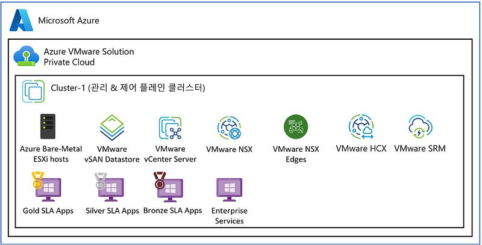

그림 7 — AVS 공유 서비스 모델

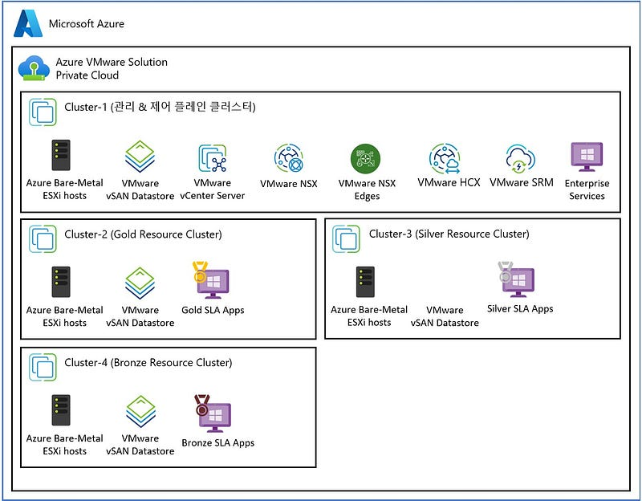

그림 8 — AVS 별도 서비스 모델 Model

**디자인 고려 사항 4 — SKU 유형**: AVS 프라이빗 클라우드 프로비저닝을 위해 [네 가지 SKU 유형](https://learn.microsoft.com/en-us/azure/azure-vmware/introduction)을 선택할 수 있습니다. AV36 SKU는 가장 작은 SKU이며 장애가 발생한 노드의 영향 반경을 최소화하는 데 사용할 수 있습니다. AV36P 및 AV52 SKU는 더 적은 노드로 더 많은 워크로드를 실행하는 데 사용할 수 있으므로 장애가 발생할 경우 그 영향이 커질 수 있습니다.

AV36 SKU는 대부분의 Azure 지역에서 광범위하게 사용 가능하며 AV36P 및 AV52 SKU는 특정 Azure 지역으로 제한됩니다. AVS은 프라이빗 클라우드 내에서 서로 다른 SKU 유형을 혼합하는 것을 지원하지 않습니다(AV64 SKU는 예외). Azure 지역별 AVS SKU 사용 가능 여부는 [여기](https://azure.microsoft.com/en-us/explore/global-infrastructure/products-by-region/?products=azure-vmware)에서 확인할 수 있습니다.

[AV64 SKU](https://learn.microsoft.com/en-us/azure/azure-vmware/introduction#azure-vmware-solution-private-cloud-extension-with-av64-node-size)는 현재 특정 리전에서만 SKU를 혼합해서 배포할 때 사용할 수 있습니다.

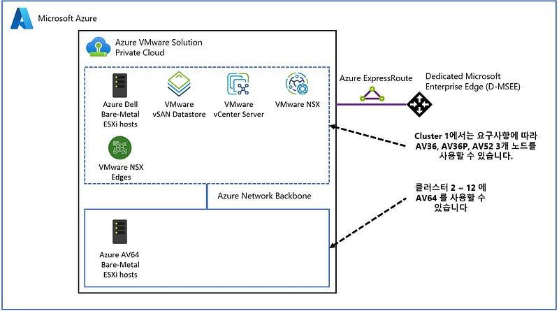

그림 9 — AV64 혼합 SKKU 토폴로지

**디자인 고려 사항 5 — 배치 정책**: 배치 정책은 ESXi 호스트 전반에서 애플리케이션 가용성 계층의 VM을 분리하여 서비스 가용성을 높이는 데 사용됩니다. ESXi 장애가 발생하면 여러 부분으로 구성된 애플리케이션 계층의 한 VM에만 영향을 미치며, 이 VM은 vSphere HA를 통해 다른 ESXi 호스트에서 다시 시작됩니다. 배치 정책은 VM-VM 및 VM-호스트 선호도 및 반 선호도 규칙을 지원합니다. 배치 정책을 적용하기 위해 VM을 마이그레이션하는 작업은 vSphere DRS(Distributed Resource Scheduler)가 담당합니다.

애플리케이션 클러스터의 가용성을 높이기 위해 각 웹, 애플리케이션 및 데이터베이스 서비스 계층에 대한 VM-VM 선호도 방지(Anti-Affinity) 규칙이 포함된 배치 정책을 사용하여 될 수 있는대로 분산할 수 있습니다. 또는 VM-호스트 선호도 규칙을 사용하여 웹, 애플리케이션 및 데이터베이스 구성 요소를 전용 호스트 그룹으로 묶어 세분화할 수 있습니다.

확장 클러스터에 대한 배치 정책은 필요한 경우 VM-Host 선호도 규칙을 사용하여 워크로드를 기본 및 보조 사이트에 고정할 수 있습니다.

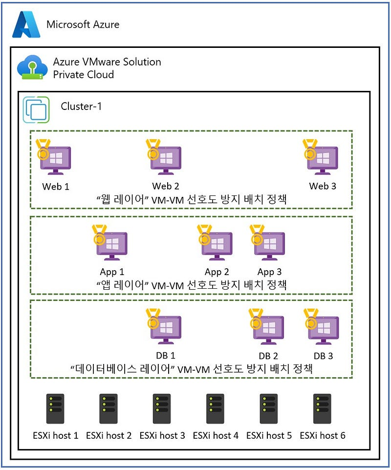

그림 10 — AVS 배치 정책 — VM-VM 선호도 방지 배치 정책

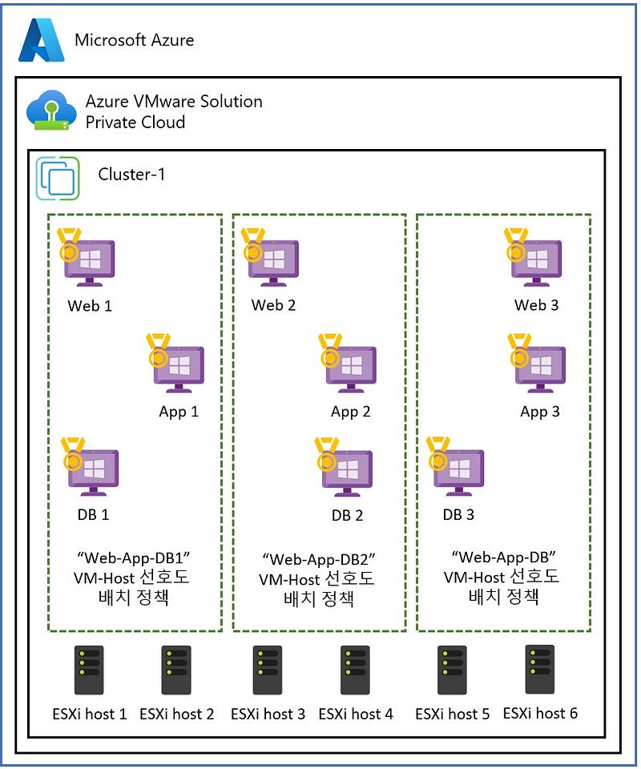

그림 11 — AVS 배치 정책 — — VM-Host 선호도 배치

**디자인 고려 사항 6 — 스토리지 정책**: 표 2에서는 VMware vSAN과 함께 사용할 수 있는 사전 정의된 VM 스토리지 정책을 보여줍니다. 고객 워크로드 SLA에 맞게 정책별로 적절한 독립 디스크 중복 배열(RAID) 및 내결함성 장애(FTT) 설정을 고려해야 합니다. 각 정책에는 가용성, 성능, 용량, 비용 간의 절충점을 고려해야 합니다.

스트레치 클러스터에 대한 스토리지 정책에는 이중 사이트(동기 복제) 지정, 기본 사이트 및 보조 사이트 정책을 고려해야 합니다.

[AVS SLA](https://www.microsoft.com/licensing/docs/view/Service-Level-Agreements-SLA-for-Online-Services?lang=1)를 준수하려면 클러스터에 표준 클러스터의 노드가 6개 이상인 경우 Failure To Tolerance(FTT)=2 스토리지 정책을 사용해야 합니다. 또한 백엔드 vSAN 운영을 위해 최소 25%의 여유 공간을 유지해야 합니다.

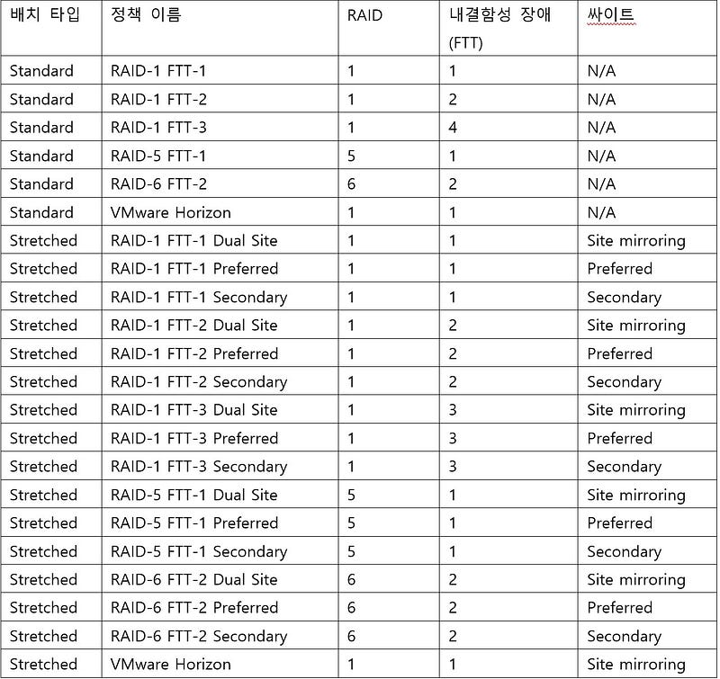

표 2 — VMware vSAN 스토리지 정책

**디자인 고려 사항 7 — 네트워크 연결**: Azure 방화벽 및 타사 네트워크 가상화 어플라이언스를 사용하는 허브-스포크 및 Azure 가상 WAN과 같은 다양한 Azure 가상 네트워킹 토폴로지를 포함하여 IPSec VPN, Azure ExpressRoute 회로를 사용하여 AVS 프라이빗 클라우드를 연결할 수 있습니다.

여러 개의 Azure ExpressRoute 회로를 사용하여 중복 연결을 제공할 수도 있습니다. 또한 VMware HCX는 중복 네트워크 확장 어플라이언스를 지원하여 레이어 2 네트워크 확장을 위한 고가용성을 제공합니다.

자세한 내용은 [AVS 네트워킹 및 상호 연결 개념](https://learn.microsoft.com/en-us/azure/azure-vmware/architecture-networking)을 참조하십시오. AVS 클라우드 채택 프레임워크에는 고려할 수 있는 [네트워크 시나리오 예시](https://learn.microsoft.com/en-us/azure/cloud-adoption-framework/scenarios/azure-vmware/example-architectures)도 있습니다.

***추후 단계***

AVS 마이그레이션을 위한 사이징 견적은 Azure Migrate를 사용하여 평가해야 합니다. 대규모 엔터프라이즈 솔루션의 경우, 최소한의 위험으로 비즈니스 가치를 제공할 수 있도록 솔루션의 크기가 올바르게 조정되었는지 확인하기 위해 Azure, VMware 또는 VMware 파트너의 AVS 아키텍트가 참여해야 합니다. 여기에는 애플리케이션 그룹 간의 매핑을 이해하고 데이터 중력 영역, 애플리케이션 네트워크 트래픽 흐름 및 네트워크 지연 시간 종속성을 파악하기 위한 애플리케이션 종속성 평가도 포함되어야 합니다.

***마무리***

이 게시물에서는 고객 워크로드의 일반적인 가용성 요구 사항, 아키텍처 구성 요소 및 AVS의 가용성 디자인 고려 사항에 대해 자세히 살펴보았습니다. 다음 포스팅에서는 하이 레벨의 디자인을 좀 더 구체화시킬 단계들을 설명합니다.

참고 사이트:

- Homepage: [Azure VMware Solution](https://azure.microsoft.com/en-us/products/azure-vmware/)
- Documentation: [Azure VMware Solution](https://learn.microsoft.com/en-us/azure/azure-vmware/)
- SLA: [SLA for Azure VMware Solution](https://azure.microsoft.com/en-us/support/legal/sla/azure-vmware/v1_1/)
- Azure Regions: [Azure Products by Region](https://azure.microsoft.com/en-us/explore/global-infrastructure/products-by-region/?products=azure-vmware)
- Service Limits: [Azure VMware Solution subscription limits and quotas](https://learn.microsoft.com/en-us/azure/azure-resource-manager/management/azure-subscription-service-limits#azure-vmware-solution-limits)
- Stretched Clusters: [Deploy vSAN stretched clusters](https://learn.microsoft.com/en-us/azure/azure-vmware/deploy-vsan-stretched-clusters)
- SKU types: [Introduction](https://learn.microsoft.com/en-us/azure/azure-vmware/introduction)
- Placement policies: [Create placement policy](https://learn.microsoft.com/en-us/azure/azure-vmware/create-placement-policy)
- Storage policies: [Configure storage policy](https://learn.microsoft.com/en-us/azure/azure-vmware/configure-storage-policy)
- VMware HCX: [Configuration & Best Practices](https://nsx.techzone.vmware.com/resource/hcx-availability-configurations-and-best-practices)
- GitHub repository: [Azure/azure-vmware-solution](https://github.com/Azure/azure-vmware-solution/)
- Well-Architected Framework: [Azure VMware Solution workloads](https://learn.microsoft.com/en-us/azure/well-architected/azure-vmware/)
- Cloud Adoption Framework: [Introduction to the Azure VMware Solution adoption scenario](https://learn.microsoft.com/en-us/azure/cloud-adoption-framework/scenarios/azure-vmware/)
- Network connectivity scenarios: [Enterprise-scale network topology and connectivity for Azure VMware Solution](https://learn.microsoft.com/en-us/azure/cloud-adoption-framework/scenarios/azure-vmware/eslz-network-topology-connectivity)
- Enterprise Scale Landing Zone: [Enterprise-scale for Microsoft Azure VMware Solution](https://learn.microsoft.com/en-us/azure/cloud-adoption-framework/scenarios/azure-vmware/enterprise-scale-landing-zone)
- Enterprise Scale GitHub repository: [Azure/Enterprise-Scale-for-AVS](https://github.com/Azure/Enterprise-Scale-for-AVS)
- Azure CLI: [Azure Command-Line Interface (CLI) Overview](https://learn.microsoft.com/en-us/cli/azure/)
- PowerShell module: [Az.VMware Module](https://learn.microsoft.com/en-us/powershell/module/az.vmware/?view=azps-9.0.1)
- Azure Resource Manager: [Microsoft.AVS/privateClouds](https://learn.microsoft.com/en-us/azure/templates/microsoft.avs/privateclouds?pivots=deployment-language-bicep)
- REST API: [Azure VMware Solution REST API](https://learn.microsoft.com/en-us/rest/api/avs/)
- Terraform provider: [azurerm_vmware_private_cloud Terraform Registry](https://registry.terraform.io/providers/hashicorp/azurerm/latest/docs/resources/vmware_private_cloud)