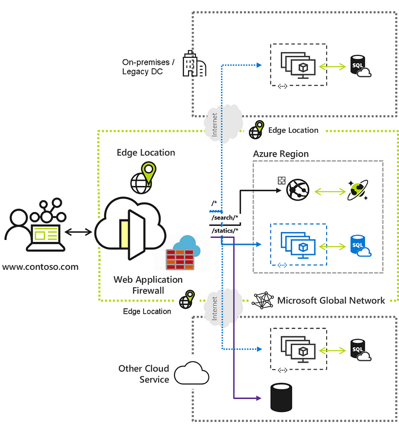
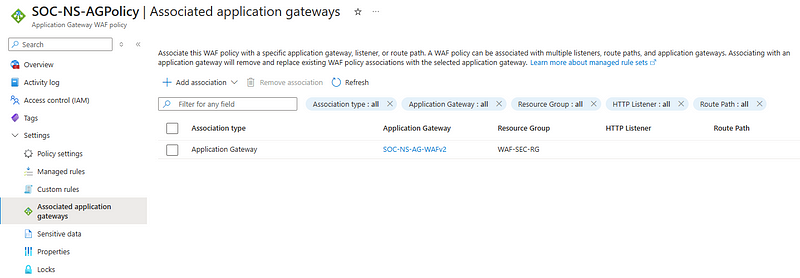
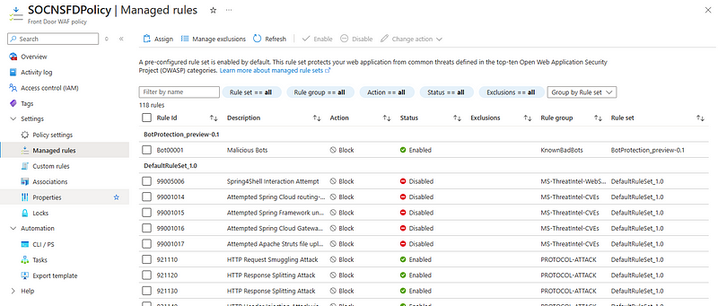
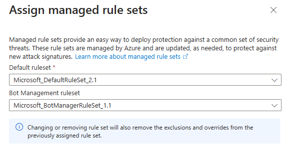
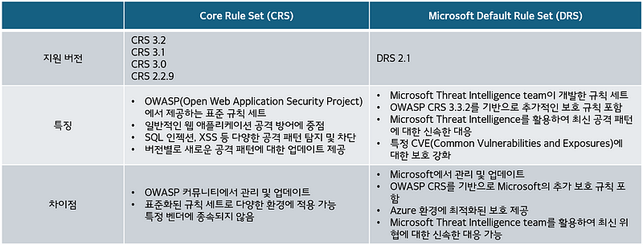
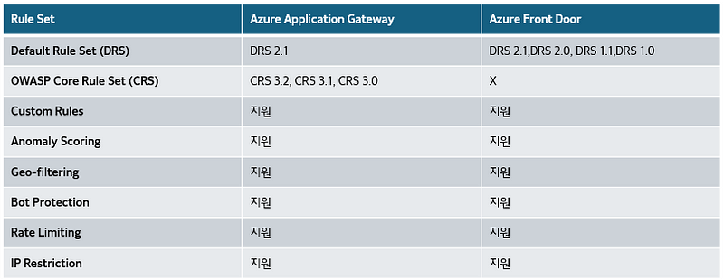
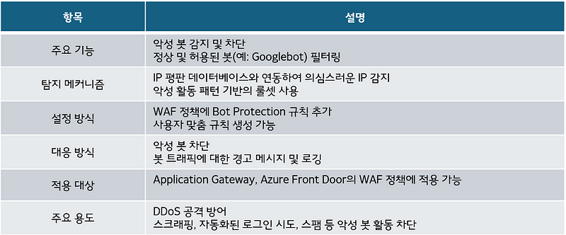
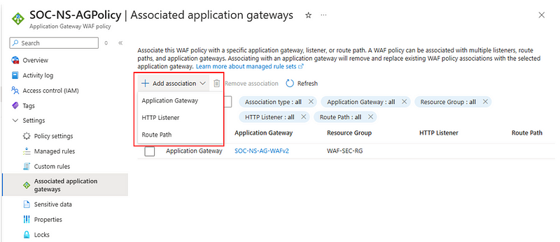
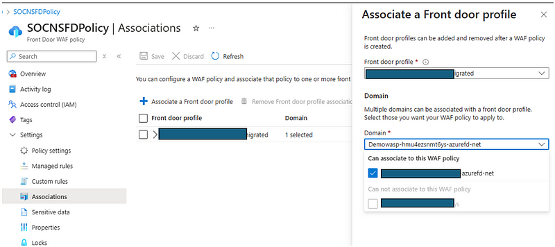

---
layout: post
title:  "Azure Web Application Firewall(Azure WAF)이해하기(1/2)"
author: sanghlee
tag: [ Azure, Azure WAF, Application Gateway, Azure Front Door]
category: [ Solution ]
image: assets/images/thumnails/sanghlee-waf-1.png
--- 

웹 애플리케이션 환경은 다양한 위협에 직면해 있으며, 이러한 위협은 갈수록 정교해지고 있습니다. 특히 웹 애플리케이션은 SQL 인젝션, 크로스 사이트 스크립팅(XSS), 취약한 API 사용 등과 같은 공격을 자주 받습니다.

Azure Web Application Firewall(이하 Azure WAF)은 이러한 공격으로부터 Azure에서 운영되는 웹 애플리케이션을 보호하는 데 필요한 중요한 방어선입니다.

이 블로그에서는 Azure에서 지원되고 있는 Azure WAF에 대한 소개, 권장 사항 및 실제 Demo 환경을 구현해 볼 수 있는 Sample에 대한 소개를 2회로 나누어 설명 드리려고 합니다.

Azure WAF를 설명하기 전에 Azure WAF를 사용할 수 있는 2개의 주요 서비스에 대하여 간략하게 소개해 드리겠습니다.

### **Azure Application Gateway, Azure Front Door 서비스 소개**

**Azure WAF**는 **Azure Application Gateway(이하 Azure AppGw)**와 **Azure Front Door (Azure FD)**두 가지 주요 서비스에서 사용할 수 있으며 Azure AppGw 또는 Azure FD에 Azure WAF Policy를 연결하는 방식으로 구성됩니다.

- **Azure Application Gateway**는 L7 네트워크 계층에서 웹 트래픽을 처리하고 관리하는 서비스입니다. 이를 통해 로드 밸런싱, SSL 종료, URL 기반 라우팅, 다중 사이트 호스팅과 같은 기능을 제공하며, 애플리케이션에 대한 세부적인 보안 제어가 가능합니다.[Azure Application Gateway란? - Microsoft Learn](https://learn.microsoft.com/ko-kr/azure/application-gateway/overview)

- **Azure Front Door**는 글로벌 애플리케이션을 대상으로 한 트래픽 최적화 및 보호를 제공하는 서비스입니다. 전 세계적으로 분산 된 사용자에게 애플리케이션 콘텐츠를 더 빠르고 안전하게 전달하는 데 주로 사용되며, 콘텐츠 배포 네트워크(CDN)와 같은 성능 최적화 기능을 제공합니다. 이와 함께 글로벌 레벨에서 보안 정책을 적용할 수 있습니다.[Azure Front Door - Microsoft Learn](https://learn.microsoft.com/ko-kr/azure/frontdoor/front-door-overview)

### Azure Application Gateway SKU 종류

- **Basic**: 기본적인 로드 밸런싱 기능을 제공하며, WAF 기능은 포함되어 있지 않습니다.
- **Standard**: 고급 로드 밸런싱 기능을 제공하며, SSL 종료 및 URL 기반 라우팅을 지원합니다.
- **Standard_v2**: Standard SKU의 모든 기능을 포함하며, 자동 스케일링, 사용자 정의 규칙 등 추가 기능을 제공합니다.
- **WAF**: WAF 기능이 포함된 Standard SKU로, 웹 애플리케이션 보호를 위한 다양한 규칙을 제공합니다.to
- **WAF_v2**: WAF 기능이 포함된 Standard_v2 SKU로, OWASP Core Rule Set 및 사용자 정의 규칙을 지원합니다.

Application Gateway v1은 2026년 4월 28일에 retire될 예정입니다. 신규 App Gateway 생성 시에는 V2를 선택하여 구성하시기 바랍니다.

[Upgrade to Azure Application Gateway WAF policy - Microsoft Learn](https://learn.microsoft.com/en-us/azure/web-application-firewall/ag/upgrade-ag-waf-policy?tabs=portal#upgrade-application-gateway-v1-to-waf-v2-with-waf-policy)

[Azure Application Gateway v2란? - Microsoft Learn](https://learn.microsoft.com/ko-kr/azure/application-gateway/overview-v2)

### Azure Front Door SKU 종류

- **Standard**  기본적인 글로벌 로드 밸런싱 및 CDN 기능을 제공하는 SKU이며 WAF 기본 기능을 지원합니다.
- **Premium** 고급 기능을 제공하며, 더 많은 사용자 정의 및 보안 기능을 지원하는 SKU입니다.- 모든 Standard 기능 포함하며 고급 WAF 기능을 지원합니다. (정책 관리, 실시간 모니터링, 고급 로그 및 알림 기능이 포함됩니다. 또한, 정책 버전 관리와 같은 추가 기능도 지원)

### Azure WAF 구성 방법

Azure WAF는 몇 단계의 과정으로 구성할 수 있으며, Azure Portal 또는 CLI를 통해 구성할 수 있습니다.

Azure AppGw 또는 Azure Front Door에 WAF를 구성하는 방법은 아래 자습서를 참고하여 구성할 수 있습니다.

[자습서: Azure Portal을 사용하여 웹 애플리케이션 방화벽이 있는 애플리케이션 게이트웨이 만들기 - Microsoft Learn](https://learn.microsoft.com/ko-kr/azure/web-application-firewall/ag/application-gateway-web-application-firewall-portal)

[빠른 시작: Azure Portal을 사용하여 Azure Front Door 만들기 - Microsoft Learn](https://learn.microsoft.com/ko-kr/azure/frontdoor/create-front-door-portal)

[자습서: Azure Front Door에 대한 WAF 정책 만들기 — Azure Portal - Microsoft Learn](https://learn.microsoft.com/ko-kr/azure/web-application-firewall/afds/waf-front-door-create-portal)

Azure WAF는 Azure의 L7 Load Balancer 서비스인 Azure AppGw 또는 Azure Front Door 서비스와 함께 구성이 되며 AppGw, Azure Front Door와는 별도도 WAF Policy를 구성하여 Application Gateway 또는 Azure Front Door에 연결하는 구조로 사용됩니다. 동일한 Azure Subscription에 여러 App Gateway를 사용하고 있다면 하나의 WAF Policy를 여러 AppGw에 Association하여 사용할 수 있습니다.

Azure WAF Policy에서 Azure App Gateway를 연결

즉, Azure WAF를 사용한다면 Azure AppGw 또는 Azure Front Door는 필수 구성 요소로 Azure에 Deploy되어야 하며 Application Gateway 는 WAF v2, Azure Front Door는 Standard 또는 Premium SKU 모두 WAF를 지원합니다. ( Application Gateway를 Standard로 배포하였더라도 WAF v2로 변경이 가능합니다. )

Azure WAF Policy

### Azure WAF Policy

Azure WAF Policy는 애플리케이션을 보호하는 규칙 집합으로 구성됩니다. 정책은 여러 규칙을 포함하며, 이러한 규칙들은 웹 애플리케이션을 위협하는 다양한 공격을 탐지하고 차단할 수 있습니다.

Azure WAF 정책의 핵심 요소는 다음과 같습니다:

- Rule Set: OWASP CRS 또는 Microsoft 관리 규칙 집합 (Microsoft Default Rule Set (DRS))중 하나를 선택하여 기본 보안 규칙을 설정합니다.
- Custom Rules: 특정 IP나 패턴을 기반으로 한 사용자 정의 규칙을 추가할 수 있으며, 트래픽을 세부적으로 관리할 수 있습니다.
- Action Mode: 규칙 위반 시 차단(Prevention)하거나 탐지(Detection) 모드로 설정할 수 있습니다.
- Global, Per-Site, Per-URI 로 구분하여 WAF Policy를 적용할 수 있어 WAF policy 적용 범위를 세분화할 수 있습니다.

### Azure WAF Policy Rule set ( 관리규칙집합 )

Azure WAF에서 지원되고 있는 Rule Set은 OWASP Rule Set 기반의 Core Rule Set(CRS)와 Microsoft Default Rule Set(DRS)를 지원하고 있으며 추가로 Bot Manager Rule Set을 지원합니다. Bot Manager는 WAF Policy 구성 시 CRS, DRS에 추가로 설정합니다. ( 참고로 CRS와 DRS은 동시에 사용하도록 구성할 수는 없습니다. )

Azure AppGw WAF Policy 구성 예

### WAF Policy Rule Set 비교

[CRS and DRS rule groups and rules — Azure Web Application Firewall - Microsoft Learn](https://learn.microsoft.com/en-us/azure/web-application-firewall/ag/application-gateway-crs-rulegroups-rules?tabs=drs21)

위 표의 정리와 같이 DRS와 CRS는 기본적으로는 OWASP Rule Set을 기반으로 하지만 약간의 차이가 있습니다. WAF에 적용할 Rule Set은 위 링크의 Rule Set 상세 설명을 참고하시고 상황에 맞는 적절한 Rule Set을 선택하시기 바랍니다.

Azure WAF Policy는 AppGw와 Front Door에서 사용할 수 있는 Rule Set의 차이가 있습니다. AppGw는 DRS, CRS 중 선택하여 구성이 가능하며 Front Door는 DRS만 지원합니다.

AppGw, Front Door WAF 지원 기능 비교

### Bot Manager

Azure Web Application Firewall(WAF)의 Bot Manager는 웹 애플리케이션을 악성 봇으로 부터 보호하기 위해 제공되는 기능입니다. 이 기능은 사용자 트래픽을 분석하여 악성 봇을 감지하고 차단함으로써, 애플리케이션이 불필요한 리소스 사용을 줄이고 보안을 강화할 수 있도록 돕습니다. Bot Manager는 다양한 감지 규칙과 IP 평판 데이터를 활용해 의심스러운 활동을 탐지하고, 허용된 봇과 악성 봇을 구분하여 처리합니다.

Azure WAF Bot Manager

외부에 서비스되는 웹 어플리케이션은 Bot Manager를 함께 구성하여 보안을 강화하는 것을 권장합니다.

### Policy 구성 방법

위 Azure WAF 구성 방법에서 설명한 WAF Policy 배포가 완료되었다면 AppGw 또는 Front Door에 WAF Policy를 연결합니다.

- **Application Gateway** WAF Policy의 Setting -> Associated application gateways에서 WAF Policy를 연결할 AppGw를 선택합니다.1) Application Gateway : Application Gateway에 적용되는 Global Policy 입니다. 2) HTTP Listner : AppGw의 HTTP Listner에 WAF Rule을 설정할 수 있습니다. AppGw에 Mulit Site를 구성하고 개별 Host 마다 별도의 WAF Policy가 필요한 경우 HTTP Listner에 WAF Policy를 설정하면 개별 Host별로 다른 WAF Policy를 구성할 수 있습니다.3) Route Path : URI별로 정책을 설정할 수 있는 기능이며 AppGw에 Path-based routing을 구성하였다면 구성된 Route Path에 WAF Policy를 설정할 수 있습니다.

[PowerShell을 사용 하 여 사이트별 WAF 정책 구성 — Azure Web Application Firewall - Microsoft Learn](https://learn.microsoft.com/ko-kr/azure/web-application-firewall/ag/per-site-policies)

- **Front Door**Front Door는 AppGw와 달리 Front Door Profile과 구성된 도메인에 WAF Policy를 설정할 수 있습니다. Front Door Standard는 기본적인 WAF Rule만 적용되며 DRS는 사용할 수 없습니다. Front Door에 DRS를 적용하려면 Front Door Premium 을 사용해야 합니다.

Azure WAF Policy는 가장 구체적인 정책이 우선적으로 적용됩니다.

예를 들면 Custom Policy, Route Path Policy, Stie Policy(HTTP Listner), AppGw Policy가 모두 구성되어 있는 경우 Custom Policy -> Route Path Policy -> Site Policy(HTTP Listner) -> AppGw Policy 순으로 정책이 재정의 됩니다.

이번 Azure Web Application Firewall(Azure WAF)이해하기(1/2)에서는 Azure WAF의 구성 방법 및 Policy에 대한 설명까지 1편을 마무리하고 2편에서는 유용한 Custom Rule 소개, Monitoring 가이드, 유용한 WAF Monitoring Workbook, 권장 학습 경로에 대하여 소개 드리도록 하겠습니다.