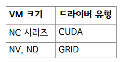

이 글은 원본 문서인 [Windows GPUs for AKS](https://techcommunity.microsoft.com/blog/containers/windows-gpus-for-aks/4089292)를 번역한 내용임을 밝힙니다.

---

AKS의 Windows 노드풀에서 GPU를 지원하는 기능이 Public Preview(**공개 미리 보기)**로 ****공개되었습니다. 이 기능은 고객에게 GPU 컴퓨팅 집약적 워크로드에 대한 선택지를 제공하는 것을 목표로 합니다. GPU 지원 노드가 워크로드에 도움이 되는 몇 가지 예로는 비디오 인코딩, 기계 학습 및 대규모 시뮬레이션이 있습니다. 우리는 이번 릴리스를 통해서 AKS에서 Windows와 Linux 간의 지원 격차를 줄이고자 합니다.

**개요**

GPU 지원이라는 것은 AKS의 Windows 노드 풀이 GPU 워크로드를 지원할 수 있게 하는 것입니다. 이번 릴리스는 모든 AKS Windows SKU 릴리스를 지원합니다. GPU 지원과 관련해서는 NVIDIA의 CUDA 및 GRID 드라이버가 있을 것 입니다만, 현재 아키텍처는 각각의 VM에 대해 특정 GPU 드라이버를 설치합니다.

**GPU 지원을 활성화하기 위한 사전 요구 사항**

워크로드 및 드라이버 호환성은 GPU가 지원되는 Windows 노드를 배포하는 데 필수적입니다. 워크로드가 VM 크기에 설치된 드라이버와 호환되는 지를 우선 확인하세요.

**GPU 설정에 앞서 반드시 확인해야 할 사항들**

- GPU 설정을 위해서는 Kubernetes 버전 1.29.0 이상이 필요합니다.
- 기존 Windows 노드 풀을 GPU로 업데이트하는 것은 지원되지 않습니다.
- AKS 노드 풀의 경우, 최소 크기를 *Standard_NC6s_v3로* 하는 것이 권장됩니다.
- NVv4 시리즈(AMD GPU 기반)는 AKS에서 지원되지 않습니다.

**선택적 구성 옵트아웃**

고객은 다음의 플래그를 사용하여 자동 드라이버 설치를 옵트아웃할 수 있습니다.

**— skip-gpu-driver-install**

**맺음말**

GPU 설정을 시작하려면 [이 링크를 클릭](https://learn.microsoft.com/en-us/azure/aks/use-windows-gpu)하여 단계별 지침을 보여주는 자세한 가이드를 따르시기 바랍니다.

우리는 이 새로운 기능에 대한 여러분의 피드백과 제안을 환영합니다. AKS에서 Windows를 사용해 주셔서 감사합니다. GPU 지원 노드를 즐겁게 사용하시길 바랍니다.

피드백은 [이 링크를 클릭하여](https://techcommunity.microsoft.com/blog/containers/windows-gpus-for-aks/4089292) 원문 링크에 남겨주시면 감사하겠습니다.