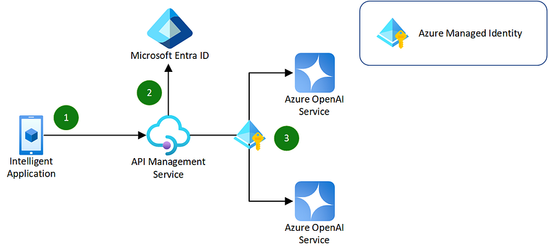

이 글은 원문인 [Azure OpenAI Service Load Balancing with Azure API Management — Code Samples - Microsoft Learn](https://learn.microsoft.com/ko-kr/samples/azure-samples/azure-openai-apim-load-balancing/azure-openai-service-load-balancing-with-azure-api-management/)를 번역한 내용임을 밝힙니다.

---

이번 문서에서는 [Azure API Management](https://learn.microsoft.com/en-us/azure/api-management/api-management-key-concepts)를 사용하여 클라이언트의 요청들을 [Azure OpenAI 서비스의](https://learn.microsoft.com/en-us/azure/ai-services/openai/overview) 여러 인스턴스로 부하 분산하는 방법을 설명합니다.

이 방법은 Azure API Management의 Policy를 사용해서 정적 라운드 로빈(round-robin) 방식의 부하 분산 기술을 사용합니다. 이 방법을 사용하면 다음과 같은 이점이 있습니다.

- 단일 Azure API Management 엔드포인트 뒤에서 다중 Azure OpenAI Service 배포를 지원합니다.
- Azure API Management와 함께 Policy 및 Managed Identity를 사용하여 다중 Azure OpenAI Service 인스턴스 및 그들의 인증 메커니즘을 관리하기 위한 애플리케이션 코드의 복잡성을 제거합니다.
- Azure OpenAI Service 인스턴스 간에 실패한 요청에 대해 Retry 로직을 제공합니다.

이번 문서에서 다루는 각각의 항목에 대한 더 자세한 내용은 다음의 기술 문서들을 참고하기 바랍니다.

- [Azure API Management의 Policy 이해](https://learn.microsoft.com/en-us/azure/api-management/api-management-howto-policies)
- [Azure API Management의 Policy에서의 오류 처리](https://learn.microsoft.com/en-us/azure/api-management/api-management-error-handling-policies)
- [Azure OpenAI Service에 Managed ID를 구성하는 방법](https://learn.microsoft.com/en-us/azure/ai-services/openai/how-to/managed-identity)

### 구성 흐름

다음의 다이어그램은 이번 문서에서 사용하는 구성의 간단한 흐름을 보여줍니다.

1. 사용자는 Azure OpenAI API 사양을 사용하여 구성 및 배포된 Azure API Management API에 요청을 보냅니다.
- API Management API는 정적 라운드 로빈 부하 분산 기술을 사용하여 Azure OpenAI Service 인스턴스 중 하나로 요청을 라우팅하는 policy가 적용되어 있습니다.

2. bearer 토큰은 Azure API Management 인스턴스와 연결된 Managed Identity를 사용하여 생성되며, API Management 인스턴스는 Azure OpenAI Service 인스턴스에 할당된 Cognitive Services OpenAI User 역할(role)을 갖습니다

3. 헤더 및 본문을 포함한 원래의 사용자 요청은 bearer 토큰이 포함된 Authorization 헤더와 함께, 선택된 Azure OpenAI Service 인스턴스로 전달됩니다.

요청이 실패하면 Policy(정책)은 두 번째의 Azure OpenAI Service 인스턴스로 요청을 재시도하고 요청이 성공하거나 최대 3번의 시도에 도달할 때까지 라운드 로빈 방식으로 시도를 반복합니다.

### 구성 요소

- [Azure OpenAI Service](https://learn.microsoft.com/en-us/azure/ai-services/openai/overview) : REST API를 노출하는 OpenAI GPT 모델 용 관리되는 서비스
- [Azure API Management](https://learn.microsoft.com/en-us/azure/api-management/api-management-key-concepts) : 백엔드 Azure OpenAI Service 인스턴스에 대한 게이트웨이를 제공하는 관리되는 서비스
- [Azure Managed Identity](https://learn.microsoft.com/en-us/entra/identity/managed-identities-azure-resources/overview) : Azure OpenAI에 대해 인증하기 위한 Azure API Management의 사용자 정의 Managed ID
- [Azure Bicep](https://learn.microsoft.com/en-us/azure/azure-resource-manager/bicep/overview?tabs=bicep) : Azure 리소스에 대한 반복 가능한 인프라 배포(IaC)를 만드는 데 사용하는 기술

### 시작

Azure API Management를 사용하여 인프라를 배포하고 부하 분산을 테스트하려면 다음을 수행해야 합니다.

### 필수 구성 요소

- 최신 [.NET SDK](https://dotnet.microsoft.com/download)를 설치합니다.
- [PowerShell Core](https://learn.microsoft.com/en-us/powershell/scripting/install/installing-powershell)를 설치합니다.
- [Azure CLI](https://learn.microsoft.com/en-us/cli/azure/install-azure-cli)를 설치합니다.
- [Visual Studio Code](https://code.visualstudio.com/)를 설치하고 [Polyglot Notebooks 확장](https://marketplace.visualstudio.com/items?itemName=ms-dotnettools.dotnet-interactive-vscode)을 추가로 설치합니다.
- [Azure OpenAI 서비스에 대한 접근권한을 신청](https://learn.microsoft.com/en-us/azure/ai-services/openai/overview#how-do-i-get-access-to-azure-openai)합니다(Azure OpenAI는 엑세스 신청을 하여 승인을 받아야 서비스 생성이 가능합니다).

### 샘플 Notebook 실행

[Sample.ipynb](https://github.com/azure-samples/azure-openai-apim-load-balancing/blob/main/Sample.ipynb) Notebook 링크를 클릭하면 열리는 노트북 파일에는 여러분이 이번 문서에서 설명한 데모를 직접 수행해 볼 수 있는 단계들이 코드로 제공되고 있습니다. 즉, Azure Bicep을 사용하여 인프라를 배포하고, 배포된 Azure API Management API에 요청을 보내서, 뒷 단에 존재하는 두 개의 Azure OpenAI Service 인스턴스로 부하 분산을 테스트하는 모든 단계가 포함되어 있습니다.

> 메모: 이번 예제에서는
> 
> 
> [*Azure CLI*](https://learn.microsoft.com/en-us/cli/azure/install-azure-cli)
> 
> *를 사용하여*
> 
> [*main.bicep*](https://github.com/azure-samples/azure-openai-apim-load-balancing/blob/main/infra/main.bicep)
> 
> *파일을 통해 인프라를 배포하고 PowerShell 명령을 사용하여 배포된 API를 테스트합니다.*
> 

노트북은 다음과 같은 여러 부분으로 나누어져 있습니다.

1. Azure에 로그인하고 기본 구독을 설정합니다.
2. Azure Bicep을 사용하여 Azure 리소스를 배포합니다.
3. Azure API Management를 사용하여 부하 분산을 테스트합니다.
4. Azure 리소스를 삭제합니다.

각각의 단계는 Notebook에 설명되어 있으며, 추가 정보 및 관련 기술 문서도 함께 기입되어 있으니 참고하시기 바랍니다.