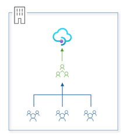
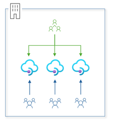
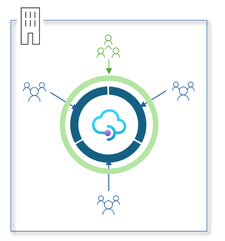

이 글은 원문인 [Announcing General Availability of Workspaces in Azure API Management](https://techcommunity.microsoft.com/blog/integrationsonazureblog/announcing-general-availability-of-workspaces-in-azure-api-management/4210796)를 번역한 내용임을 밝힙니다.*

---

Azure API Management의 Workspaces 기능이 GA(General Availivility, 공식 지원)되었습니다. Workspaces를 활용한다면, 여러분의 조직은 페더레이트(federated) 접근 방식을 사용하여 API를 더욱 생산적이고 안전하며 안정적으로 관리할 수 있습니다.

### 자율성 및 생산성 향상

Workspaces는 API 팀에 새로운 차원의 자율성을 제공하여 API Management 서비스 내에서 API를 더 빠르고, 신뢰할 수 있게, 그리고 안전하고, 생산적으로 생성, 관리 및 게시할 수 있게 합니다. Workspaces는 격리된 관리 액세스 및 API 런타임을 제공하여, API 팀의 역량을 강화하는 동시에 API 플랫폼 팀이 중앙 모니터링, API 정책 및 규정 준수 적용, 통합 개발자 포털을 통한 검색용 API 게시에 대한 감독을 유지할 수 있도록 합니다.

### 격리된 관리 액세스 및 API 런타임

Workspaces은 API Management 서비스 내의 “폴더”와 같은 기능을 합니다. 각 Workspaces에는 API, 제품, 구독, 명명된 값(named value)및 관련 리소스가 포함되어 있습니다. Workspaces 안의 리소스에 대한 접근 제어는 Microsoft Entra 계정에 할당할 수 있는 빌트인 역할 또는 사용자 지정 역할을 사용하여 Azure의 RBAC(역할 기반 액세스 제어)를 통해 관리됩니다.

이제 Workspaces은 Workspaces API 게이트웨이와의 연결을 통해 API 런타임 격리를 제공하며, 담당 팀이 게이트웨이 및 해당 구성을 관리할 수 있게 합니다. 분리된 런타임은 게이트웨이 리소스 부족 또는 사이버 보안 이슈와 같은 오류가 개별 Workspaces 내에서만 영향을 미치도록 하며, 조직의 다른 API에는 영향을 주지 않게 합니다. 더불어, 런타임 격리를 통해서 이슈들과 플랫폼 사용을 Workspaces에 귀속시킬 수 있습니다.

[API Management에서 Workspaces을 만드는 방법은 이 링크를 참고하세요](https://aka.ms/apimdocs/workspaces/create)

Workspaces에는 API 팀이 관리하는 API, 제품 및 관련 리소스가 포함됩니다. API 런타임은 연관된 Workspaces 게이트웨이에서 제공됩니다. 개발자 포털, 모든 API 정책, 로그 및 메트릭은 Workspaces에 걸쳐서 적용될 수 있습니다.

### 독립적인 Deployment 수명 주기

각 Workspaces은 일반적으로 자체적인 배포 수명 주기를 가집니다. [APIOps toolkit release 6.0.2](https://github.com/Azure/apiops/releases)에서는 다양한 환경을 나타내는 API 관리 서비스 전반에 걸쳐 Workspaces의 자동화된 배포를 지원하는 기능이 도입되었습니다. 추가적으로 [management API version 2023–09–01-preview](https://learn.microsoft.com/rest/api/apimanagement/operation-groups?view=rest-apimanagement-2023-09-01-preview)를 사용하면 Workspaces을 프로그래밍 방식으로 관리할 수 있습니다.

### Workspaces과 페더레이트된 API 관리

Workspaces는 Azure API Management에서 API를 관리하는 페더레이션 모델에 대한 최고 수준의 지원을 제공하며, 기존의 중앙 집중식 및 사일로(Silo) 모델을 보완합니다.

### 중앙 집중식 모델

중앙 집중식 모델의 경우, 조직은 관리 액세스 또는 API 런타임을 격리하지 않고 여러 API 팀 간에 공유되는 단일 API Management 서비스를 사용합니다. 이 방식은 API 거버넌스 및 검색을 간소화하지만, 더 많은 API 팀이 온보딩됨에 따라 플랫폼 팀에 병목 현상을 일으킬 수 있습니다. 또한, 런타임 문제 또는 잘못된 구성으로 인해 플랫폼 전체가 중단될 수 있으며 API 게이트웨이가 단일 장애 지점(SPOF, single point of failure)이 될 수 있습니다.

### 사일로화된 모델

사일로화된 API 관리 모델의 경우, 각각의 API 팀은 자체 API Management 서비스를 소유하고 운영합니다. 이 방식은 중앙 집중식 모델과는 달리 관리 액세스 및 API 런타임에 대한 완전한 격리를 제공할 수 있지만, 서비스의 내부 확장을 야기하게 되어 인프라의 유지 관리가 어려워지고 비용이 증가하며, 또한 파편화를 일으킬 수 있고, 비효율적인 API 거버넌스 및 검색을 발생시킬 수 있습니다.

### Workspaces을 사용하는 페더레이트된 모델

Workspaces를 사용할 경우, 조직은 API Management에 대한 페더레이트된(federated) 접근 방식을 채택하여 중앙 집중식 모델과 사일로된 모델의 이점을 모두 확보할 수 있습니다. Workspaces를 통해 API 팀은 수명 주기 전반에 걸쳐 API를 독립적이고 효과적이며 효율적으로 관리할 수 있고, 플랫폼 팀은 Workspaces 전반에 걸쳐 API에 대한 런타임 정책(Policy)을 적용하고, 플랫폼 로그 및 메트릭(출시 예정)을 중앙 집중화하고, 게이트웨이 비용을 조직 내 팀에 전가하여 과금을 구현하고, 통합 개발자 포털을 통해 API 검색 및 온보딩을 용이하게 할 수 있습니다.

### 추후 개선 사항

Workspaces은 전체 API 런타임의 격리를 요구하는 팀과 그 팀이 속한 조직에서 API 관리를 페더레이션하기 위한 최선의 방안이 될 것입니다. 그렇기에, 우리는 Workspaces에 대한 다음과 같은 새로운 기능 및 개선 사항을 제공하기 위해서 적극적으로 노력할 예정입니다.

- **공유 게이트웨이:** Workspaces 간의 완전한 런타임 격리가 필요하지 않은 경우, 다중 Workspaces을 공유 게이트웨이와 연결하여 플랫폼 비용을 최적화합니다
- **Managed Identity 지원:** Workspaces 내에서 User-Assinged Managed Identity를 사용하여 인증할 수 있습니다
- **지역별 가용성:** 더 많은 지역에서 API Management 서비스의 Workspaces 기능을 사용 가능하게 합니다
- **더 빠른 프로비저닝:** 수 분 안에 Workspaces 게이트웨이 생성하기
- **향상된 모니터링:** Azure Monitor 로그 및 메트릭으로 Application Insights 원격분석 보완하기

### 지금 바로 사용해 보세요

Workspaces은 API 팀을 위해서 관리 액세스 및 API 런타임을 격리하고 API 거버넌스 및 검색을 중앙 집중화하여 생산성을 높이고 API Management로 관리되는 API의 안정성과 보안을 개선합니다. [Workspaces을 시작해 보고 싶다면 이 링크를 클릭하시면 관련 문서로 이동합니다](https://aka.ms/apimdocs/workspaces).