Azure Static Web Apps(SWA)에서 기본 설정을 변경하는 작업이 종종 필요하곤 합니다. 예를 들면, 요구 사항에 따라서 헤더를 수정하는 경우가 이에 해당합니다. 설정은 staticwebapp.config.json 파일을 통해 변경할 수 있지만, 배치 (즉, 위치)는 특정 컨텍스트(예: 프레임워크가 없거나, 사전 빌드된 프레임워크 또는 배포 중에 빌드되는 프레임워크)에 따라 달라집니다.

이번 자습서에서는 Azure DevOps 및 GitHub Actions와 같이 유명한 CI/CD 도구들을 구성하는 방법과 함께, 다양한 시나리오에서 staticwebapp.config.json을 배치하는 방법을 설명합니다. Access-Control-Allow-Origin 응답 헤더를 검증 예로 사용하여 구성이 올바르게 작동하는지 확인하게 됩니다.

### 목차

- 프레임워크가 없는 SWA
- 미리 빌드된 프레임워크 SWA (MkDocs를 예제로 사용)
- 배포 중에 빌드되는 프레임워크 (React를 예제로 사용)
- Azure DevOps와 GitHub Actions의 환경 변수
- 참조

### 프레임워크가 없는 SWA

아래의 예제에서는 GitHub for CD/CD를 사용합니다. 디렉터리 구조와 구성은 다음과 같습니다.


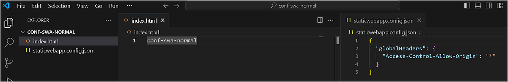

이 튜토리얼에서는 아래와 같이 Access-Control-Allow-Origin 헤더를 사용자 정의하고 있습니다.

```
{
  "globalHeaders": {
    "Access-Control-Allow-Origin": "*"
  }
}
```

작업 디렉터리는 프로젝트의 루트(/)로 설정되어 있습니다. SWA를 생성할 때, App Location은 /로 지정해야 합니다.

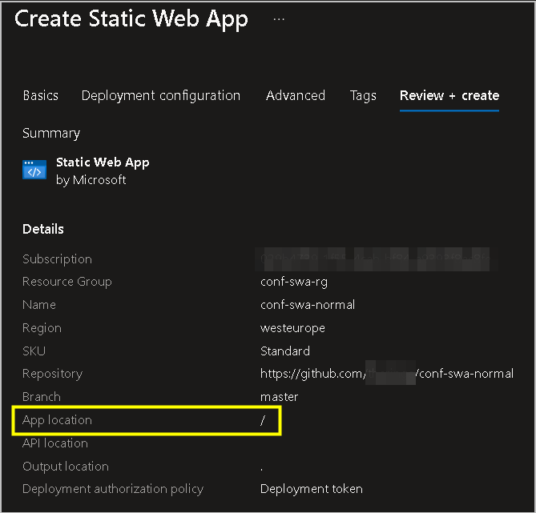

생성이 완료되더라도, GitHub Actions 워크플로가 완료될 때까지 기다려야 합니다. 배포가 완료되면, 모든 요청에 대한 응답 헤더에서 사용자 정의된 Access-Control-Allow-Origin 헤더를 볼 수 있습니다.

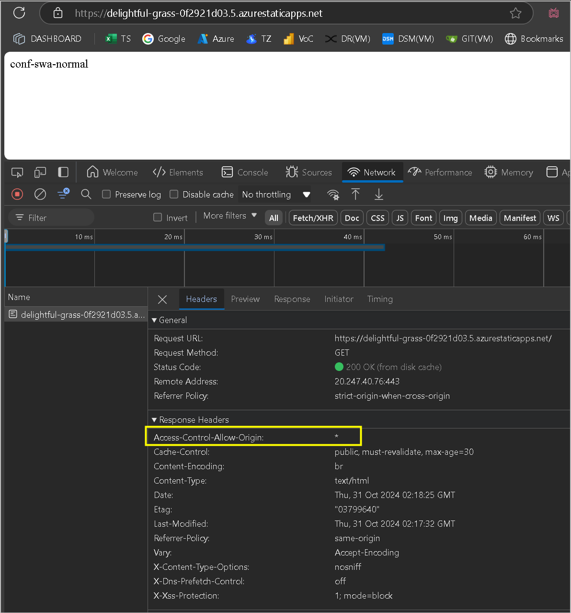

이 방법은 매우 간단하기 하지만, 대부분은 일반적으로 프레임워크를 사용하고 있습니다. 다음에는 사용자 정의 구성을 다양한 프레임워크에 적용하는 방법에 대해서 설명합니다.

### 미리 빌드된 프레임워크 SWA (MkDocs를 예제로 사용)

일부 프로젝트는 로컬에서 빌드하거나 컴파일한 다음, 미리 빌드된 리소스를 SWA에 배포하는 것을 선호합니다. 프레임워크에 따라서 고유한 디렉터리 구조를 가지므로, App location을 조정하여 SWA가 어디서 구성 파일을 읽어야 하는지를 지정해주어야 합니다. 이번 예제에서는 MkDocs를 프레임워크로 사용하게 됩니다. 구성 프로세는 다음과 같이 동작하게 됩니다:

프로젝트 루트에 staticwebapp.config.json 파일을 두도록 합니다. 프로젝트를 빌드하고 나면, 예제의 컴파일 출력물은 my-project/site에 위치하게 됩니다.

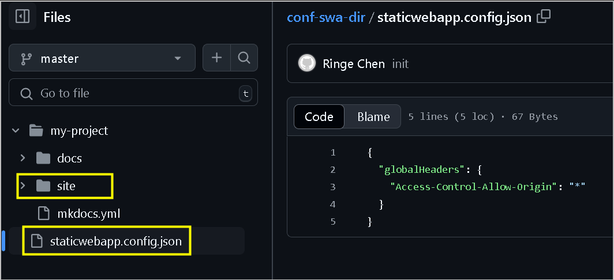

SWA를 생성할 땐, App Location을 my-project/site로 지정합니다.

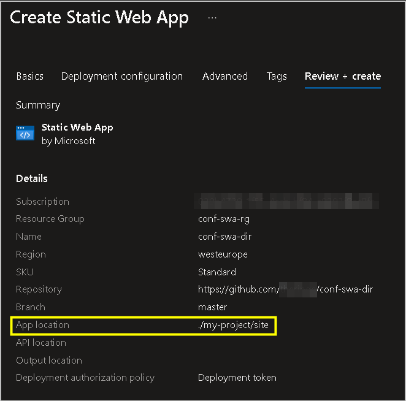

배포가 완료되면, 응답 헤더를 확인하도록 합니다. 사용자 지정 Access-Control-Allow-Origin 헤더가 보이지 않으면, 구성 파일의 위치가 잘못 지정된 것이 원인입니다.

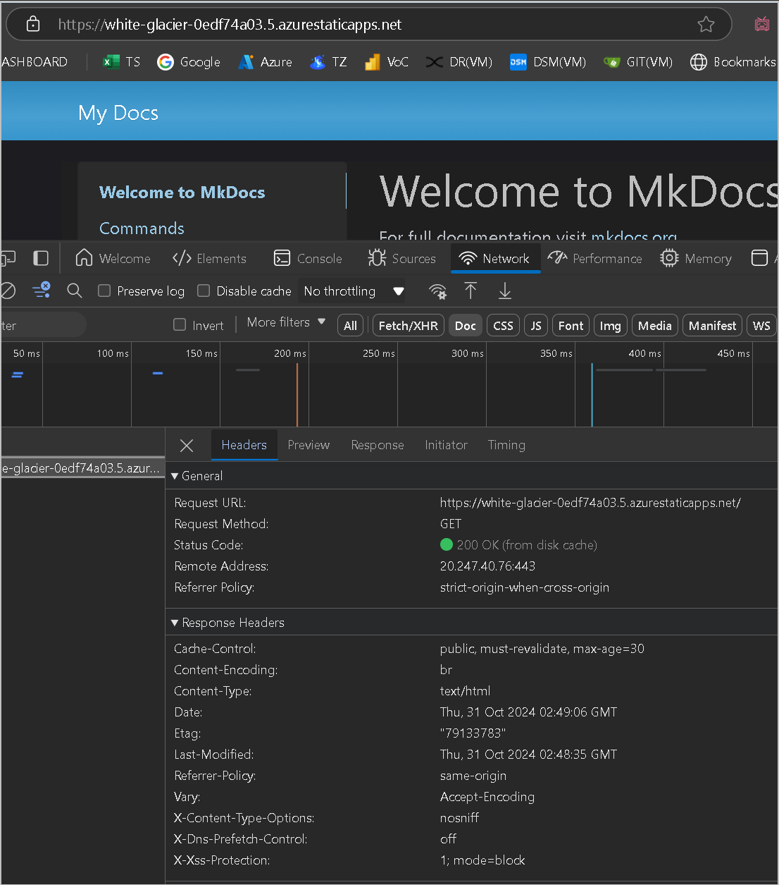

staticwebapp.config.json 파일을 my-project/site로 옮기도록 합니다.

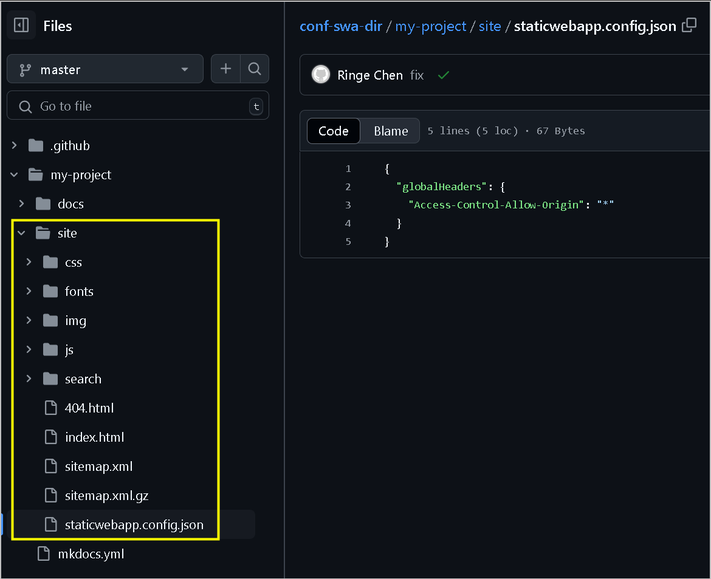

그런 다음 GitHub Actions를 통해 재배포합니다. 재배포 후 Access-Control-Allow-Origin 헤더가 응답 헤더에 나타나야 합니다.

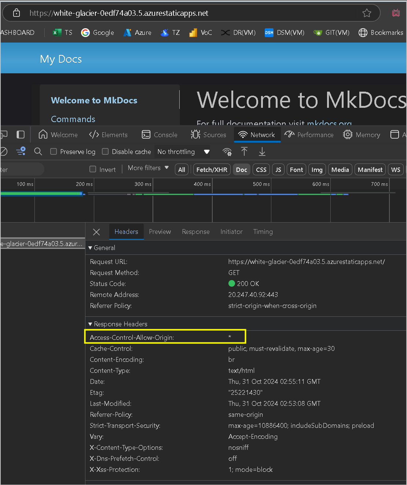

### 배포 중에 빌드되는 프레임워크 (React를 예제로 사용)

일부 프로젝트는 CI/CD 프로세스 중에 동적으로 빌드되어 해당 단계에서만 빌드 폴더를 만듭니다. 이 경우 컴파일된 폴더 경로를 미리 정의하고 구성 파일을 동적으로 복사해야 합니다.

React의 경우, 컴파일이 완료되고 나면 빌드 폴더 이름은 build로 만들어지게 됩니다. staticwebapp.config.json 파일은 프로젝트 루트에 두고, App location은 build로 설정합니다.

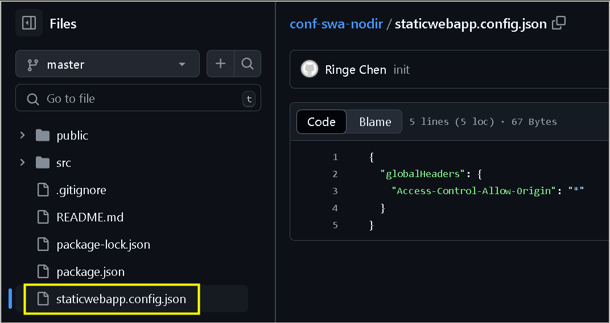

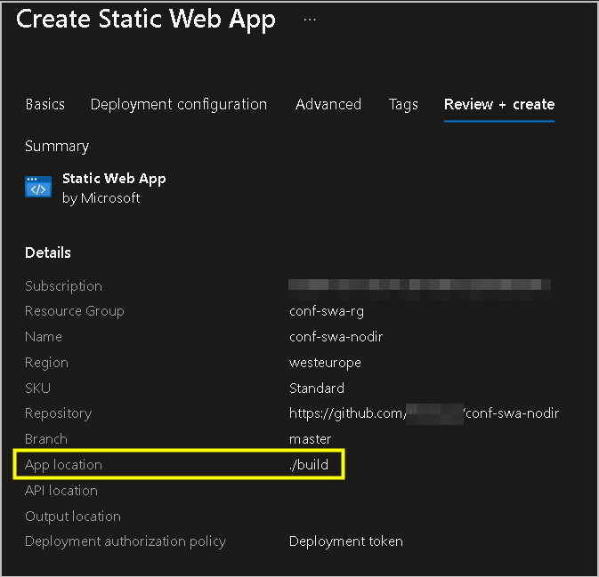

배포 중에, GitHub Actions에서 빌드 디렉터리가 누락되었다는 오류를 표시할 수도 있습니다.

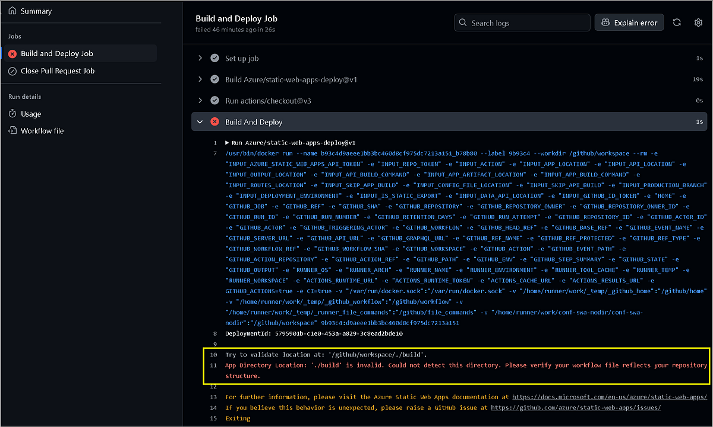

해당 오류는 예상된 이슈로, CI/CD 워크플로를 다음과 같이 수정하면 문제를 해결할 수 있습니다.

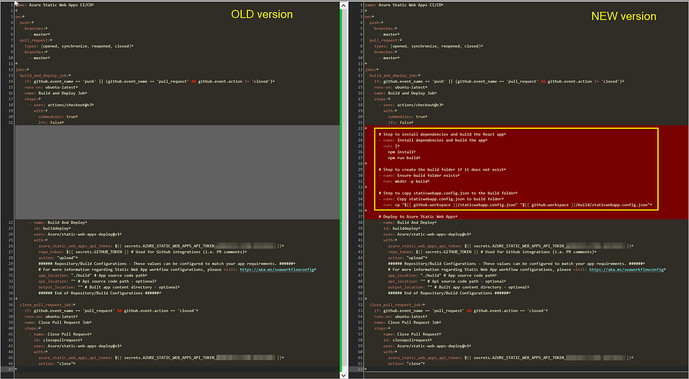

.github/workflows 디렉터리에, 다음 단계들을 워크플로 (yml) 파일에 추가합니다:

```
# Step to install dependencies and build the React app
      - name: Install dependencies and build the app
        run: |
          npm install
          npm run build
```

```
      # Step to create the build folder if it does not exist
      - name: Ensure build folder exists
        run: mkdir -p build
```

```
      # Step to copy staticwebapp.config.json to the build folder
      - name: Copy staticwebapp.config.json to build folder
        run: cp "${{ github.workspace }}/staticwebapp.config.json" "${{ github.workspace }}/build/staticwebapp.config.json"
```

위의 단계에서는 종속성을 설치하고 React 앱을 빌드하고, build 폴더가 있는지 확인한 다음, 프로젝트 루트에서 대상 디렉토리로 staticwebapp.config.json을 복사합니다.

워크플로를 업데이트하고 다시 배포하면 구성이 성공적으로 적용된 것을 볼 수 있습니다.

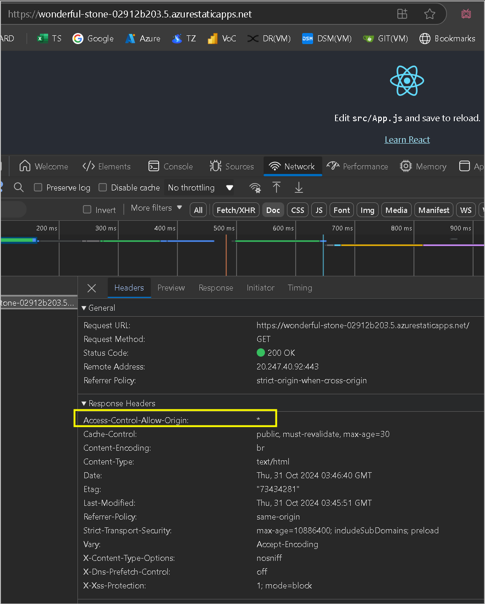

### Azure DevOps와 GitHub Actions의 환경 변수

위의 예에는 github.workspace변수가포함되어있으며,이는GitHubActions에서프로젝트의루트디렉토리를가리킵니다.AzureDevOps를사용하는경우해당변수를*github*.*workspace*변수가포함되어있으며,이는*GitHubActions*에서프로젝트의루트디렉토리를가리킵니다.*AzureDevOps*를사용하는경우해당변수를(System.DefaultWorkingDirectory)로 변경해야 합니다.

### 참조

[Configure Azure Static Web Apps - Microsoft Learn](https://learn.microsoft.com/en-us/azure/static-web-apps/configuration)

[Deploy Mkdocs page on Azure Web App — Microsoft Community Hub](https://techcommunity.microsoft.com/t5/apps-on-azure-blog/deploy-mkdocs-page-on-azure-web-app/ba-p/4272895)

[Accessing contextual information about workflow runs — GitHub Docs](https://docs.github.com/en/actions/writing-workflows/choosing-what-your-workflow-does/accessing-contextual-information-about-workflow-runs#example-usage-of-the-runner-context)

[Predefined variables — Azure Pipelines - Microsoft Learn](https://learn.microsoft.com/en-us/azure/devops/pipelines/build/variables?view=azure-devops&tabs=yaml)

- 2024년 10월 31일 업데이트 됨.
- 2024년 11월 12일 번역 함. (by [JYSEONG(MSFT)](https://techcommunity.microsoft.com/users/ji%20yong%20seong/219866) / [GitHub](https://github.com/jiyongseong))