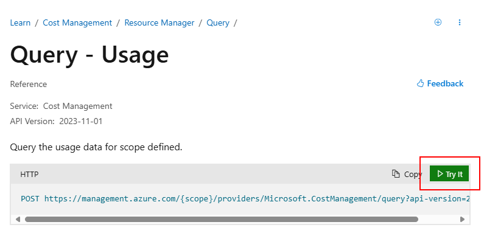
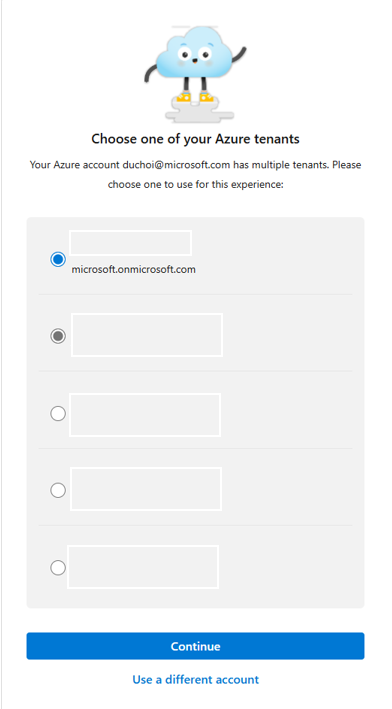
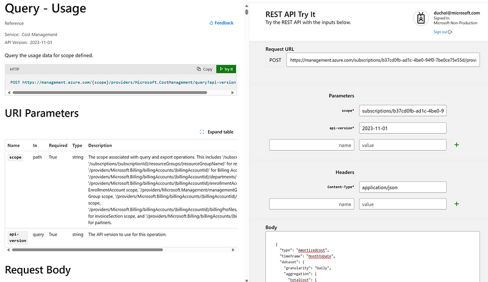
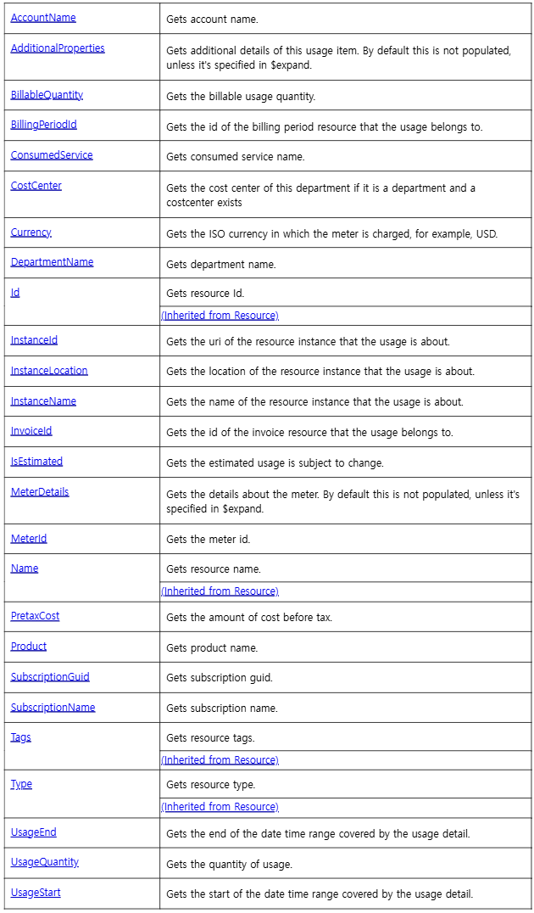
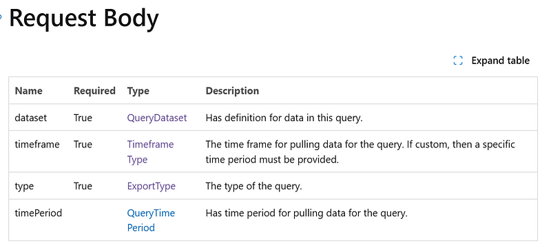
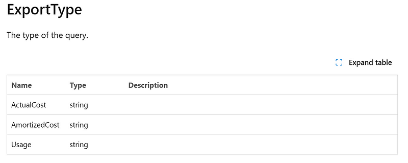

Azure를 계속 사용 하다보면, 결국은 사용 비용에 대해서 관리 해야 하는 시기가 도래 하게 됩니다. Azure에서는 이를 위해 Cost Management 라는 서비스를 제공 하고 있고, Cost analysis를 메뉴를 통해 Metric 형태로 쉽게 볼 수 있고, Excel 형태의 Export도 지원하고 있습니다.

하지만, 좀 더 Advanced 한 비용관리를 하기 위해서는 Rest API를 통한 Query를 사용하시게 되실 것입니다.

오늘은 아주 쉽게 Rest API를 실행하여 비용을 Query하고 테스트하는 방법을 알려드리도록 하겠습니다.

https://learn.microsoft.com/en-us/rest/api/cost-management/query/usage?view=rest-cost-management-2023-11-01&tabs=HTTP 를 참고 하면

Usage / ActualCost / AmortizedCost를 Query 해 볼 수 있습니다.

Query — Usage 항목에 POST 형태의 Query의 샘플을 제공 하고 있는데, 여기서 Try It을 누르시게 되면 Browser에서 직접 Query를 실행 해 볼 수 있습니다.



계정 확인 요청이 있고, 계정을 확인합니다.


사용 계정 확인 요청

멀티 테넌트를 사용하고 있다면, Query할 테넌트도 선택 합니다.



테넌트 확인

테넌트 선택을 변경 할 필요가 있을 경우에는, Broswer를 완전히 나갔다가 다시 들어오시면 Sign-In 부터 다시 시작 됩니다.



Rest API Query 테스트 화면

Query를 사용할 때 다음의 컬럼을 Body에 사용할 수 있습니다.



Body 컬럼 설명

해당 내용을 참고하여 Subscription 에 대해서 AmortizedCost를 Query 해보았습니다.

Request URI

POST:

```
https://management.azure.com/subscriptions/{사용하시는 구독(Subscriptions) ID}/providers/Microsoft.CostManagement/query?api-version=2023-11-01
```

```
BODY:
{
  "type": "AmortizedCost",
  "timeframe": "MonthToDate",
  "dataset": {
    "granularity": "Daily",
    "aggregation": {
      "totalCost": {
        "name": "PreTaxCost",
        "function": "Sum"
      }
    },
    "grouping": [
      {
        "type": "Dimension",
        "name": "ResourceGroup"
      }
    ]
  }
}
```

Query를 실행 해보면, 일자 별로 리소스 그룹이 Grouping 되어 합산된 금액을 볼 수 있습니다.


Query 에 대한 응답

문서를 좀 더 확인 해 보면, Request Body의 Properties를 볼 수 있는데, 그 중 ExportType을 확인해 보면



어떤 형태의 응답을 받을지 설정 할 수 있습니다. 여기서 AmortizedCost로 Request를 하시게 되면, ActualCost / AmortizedCost / Usage 를 선택 할 수 있습니다.


다음번에는 Azure Portal 에서 제공하고 있는 API Playground (preview)를 사용하여 Rest API로 Query 후, 응답을 Excel 형태로 Export 받는 방법을 알아보도록 하겠습니다.