MkDocs는 프로젝트 문서를 생성하는 데 목적을 둔 간단한 정적 사이트 생성기입니다. 문서 소스 파일은 Markdown으로 작성되고, 하나의 YAML 구성 파일로 구성됩니다.

이번 자습서에서는 Mkdocs 프로젝트를 동적으로 또는 정적으로 호스팅하는 방법을 살펴보게 됩니다. 필요에 따라서, 프로젝트를 게시하는 방법은 두 가지 중에서 선택이 가능하며, 각 접근 방식으로 상호 독립적입니다.

### 목차

- 개발 환경에서의 동적 호스팅
- 개발 환경에서의 정적 호스팅
- 동적 방법: Python 웹 앱 사용
- 정적 방법: Node 웹 앱 사용
- 정적 방법: 정적 웹 앱 사용
- 참조

### 개발 환경에서의 동적 호스팅

### 단계 1:

VS Code에서 빈 폴더를 엽니다. 터미널을 시작하고 다음 명령을 입력하여 Python 가상 환경을 만들고, 현재 세션을 해당 가상 환경으로 전환합니다.


Windows

```
python -m venv .venv
.\.venv\Scripts\Activate.ps1
```

Linux

```
python -m venv .venv
source .venv/Scripts/activate
```

### 단계 2:

다음 명령을 입력하여 Mkdocs 프로젝트를 생성(예를 들면, my-proejct)하고, 프로젝트 디렉터리로 전환한 다음, 프로젝트를 시작합니다. 브라우저에서 [[http://127.0.0.1:8000](http://127.0.0.1:8000/)](http://127.0.0.1:8000로 이동하면, 프로젝트 페이지에 접근할 수 있습니다.

```
pip install mkdocs
mkdocs new my-project
cd my-project
mkdocs serve
```

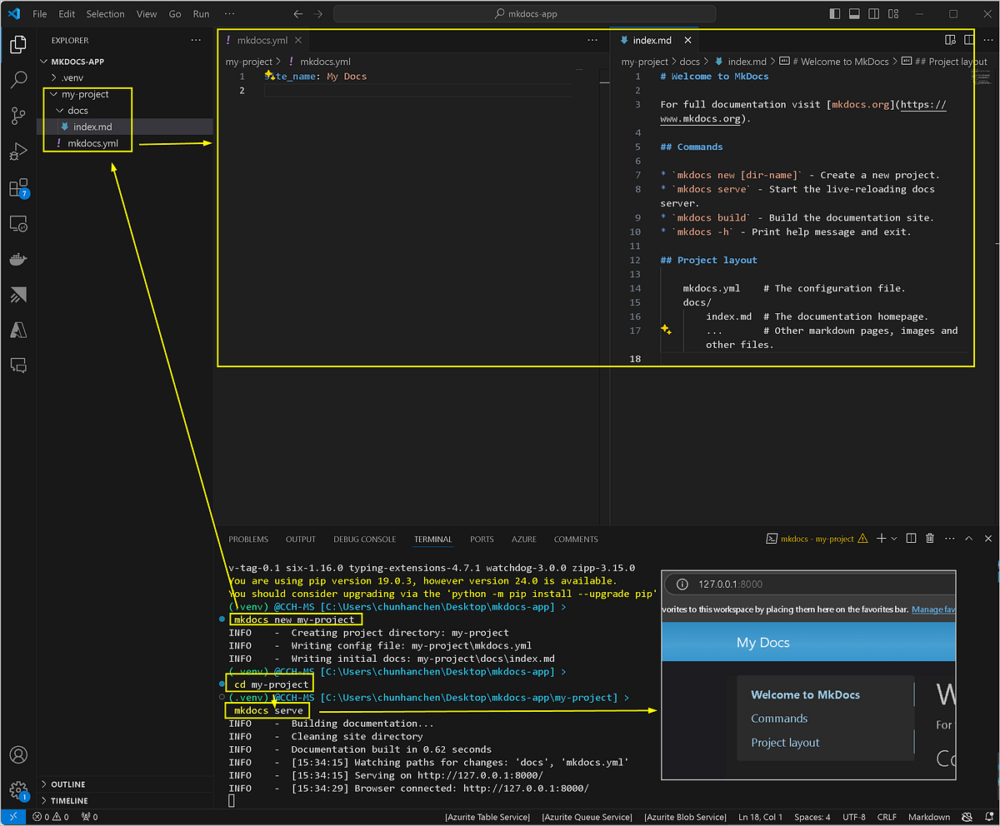

### 개발 환경에서의 정적 호스팅

### 단계 1:

개발 환경에서 프로젝트를 만들면,페이지들은 Python과 Mkdocs 패키지를 이용하여 랜더링되어야 합니다. 다음의 명령을 실행하면 해당 페이지들을 정적 HTML로 만들수 있습니다. 이렇게 만들어진 파일들은 Azure Static Website 또는 Azure Web App과 같은 정적 웹사이트 호스팅 서비스에 배포할 수 있습니다. 프로젝트가 빌드되면, 새로 만든 사이트 하위 폴더에서 해당 정적 웹 페이지를 찾을 수 있습니다. 브라우저에서 index.html을 열어 프로젝트 페이지를 볼 수 있습니다.

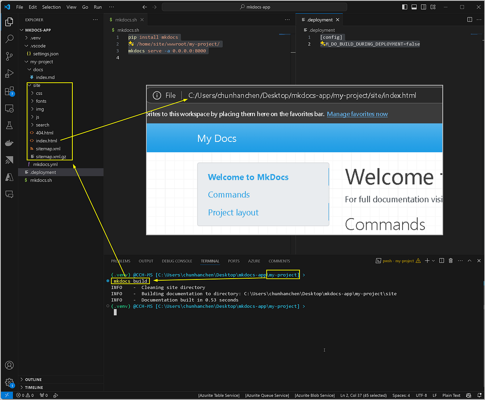

```
mkdocs build
```

### 동적 방법: Python 웹 앱 사용

### 단계 1:

Azure에서 Linux Python Web App을 생성합니다.

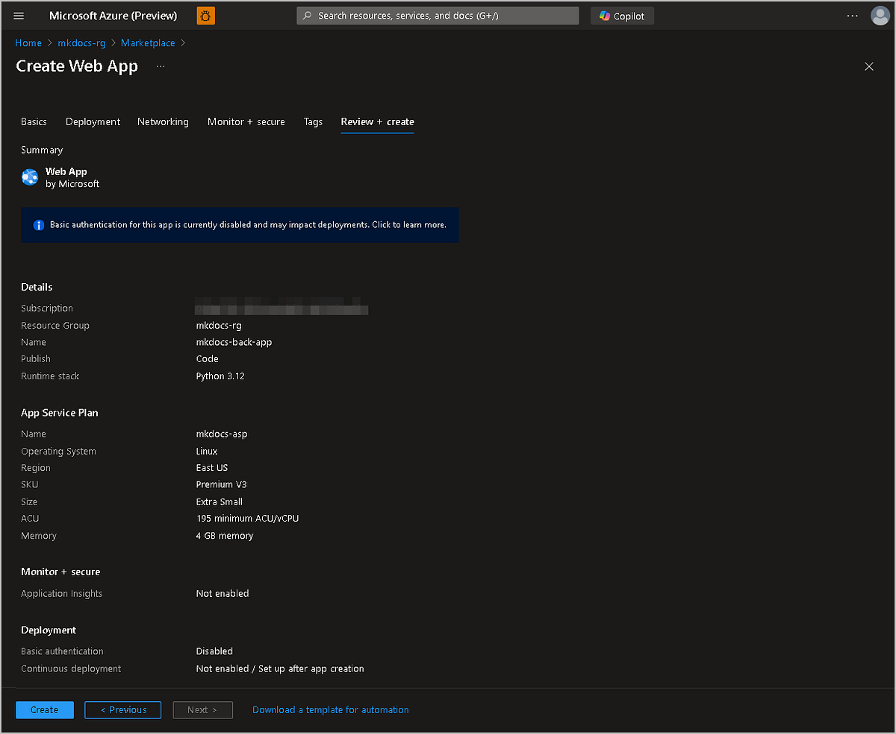

### 단계 2:

VSCode를 사용하여 “mkdocs.sh”와 “.deployment”라는 두 파일을 프로젝트의 루트 디렉토리에 추가합니다.

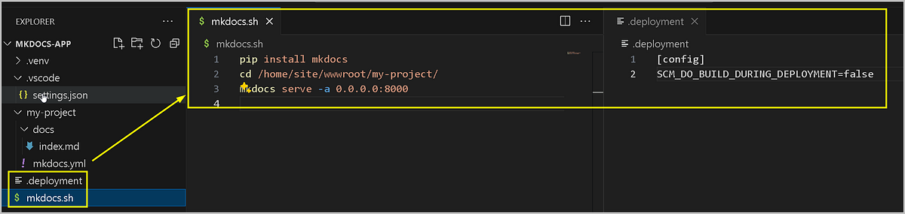

mkdocs.sh

```
pip install mkdocs
cd /home/site/wwwroot/my-project/
mkdocs serve -a 0.0.0.0:8000
```

.deployment

```
[config]
SCM_DO_BUILD_DURING_DEPLOYMENT=false
```

### 단계 3:

VSCode를 사용하여 방금 만든 Python 앱에 프로젝트의 루트 디렉토리를 배포합니다.

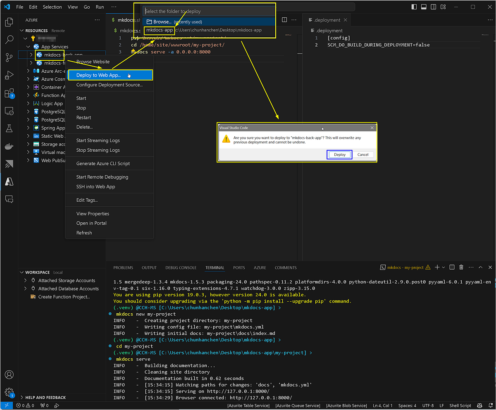

### 단계 4:

Azure에서 Python 앱을 찾아 다음과 같이 시작 명령을 수정한 다음, 앱을 다시 시작합니다

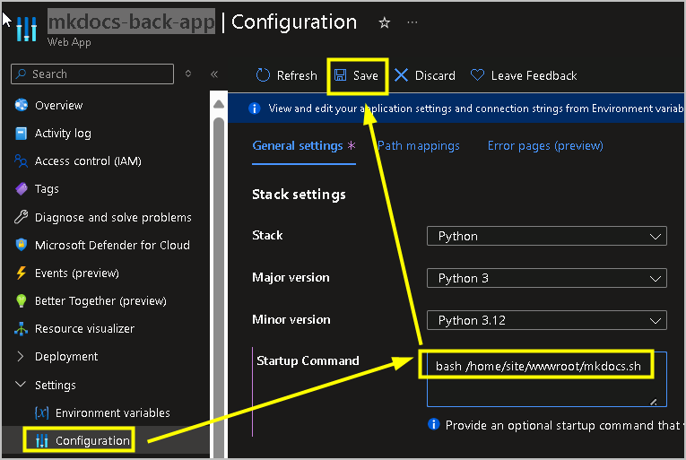

```
bash /home/site/wwwroot/mkdocs.sh
```

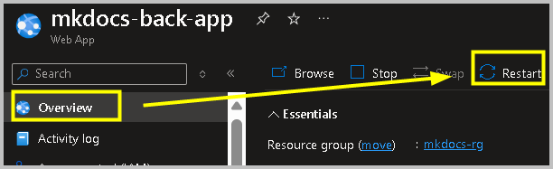

### 단계 5:

프로젝트가 정상적으로 동작하는지 확인합니다.

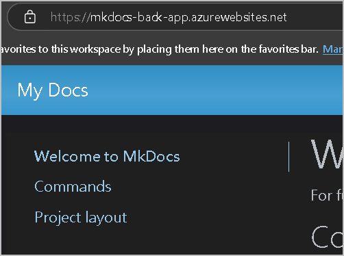

### 정적 방법: Node 웹 앱 사용

### 단계 1:

Azure에서 Linux Node Web App을 생성합니다.

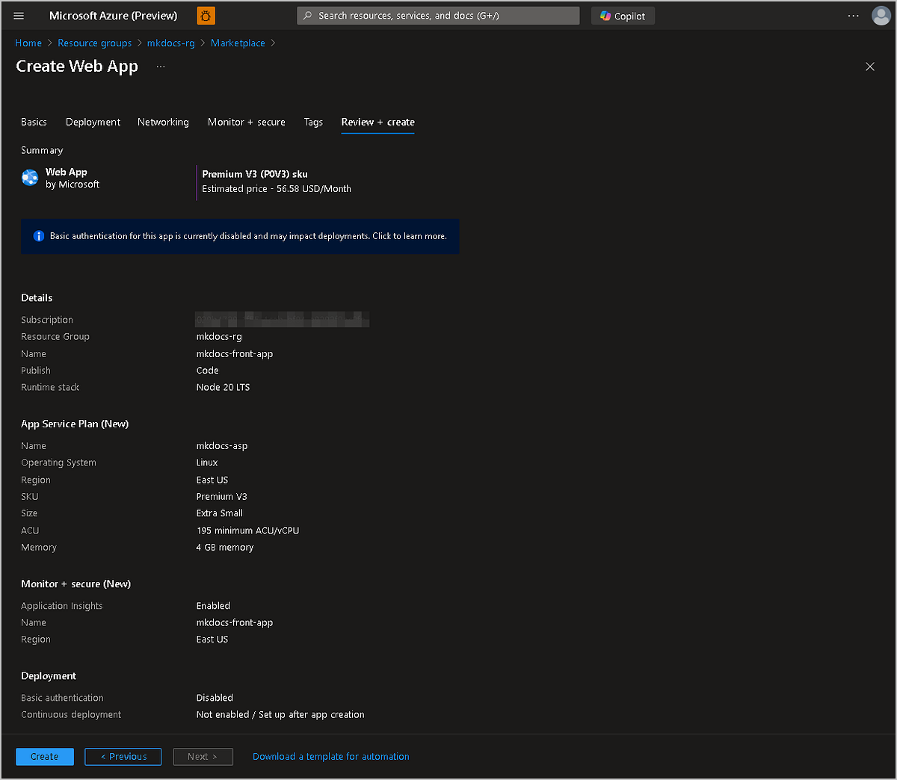

### 단계 2:

프로젝트의 Mkdocs 하위 폴더에서 사이트 폴더를 찾아 그 안에 .deployment 파일을 추가합니다.


.deployment

```
[config]
SCM_DO_BUILD_DURING_DEPLOYMENT=false
```

### 단계 3:

VSCode를 사용하여 방금 만든 Node 앱에 프로젝트의 “site” 하위 디렉토리를 배포합니다.

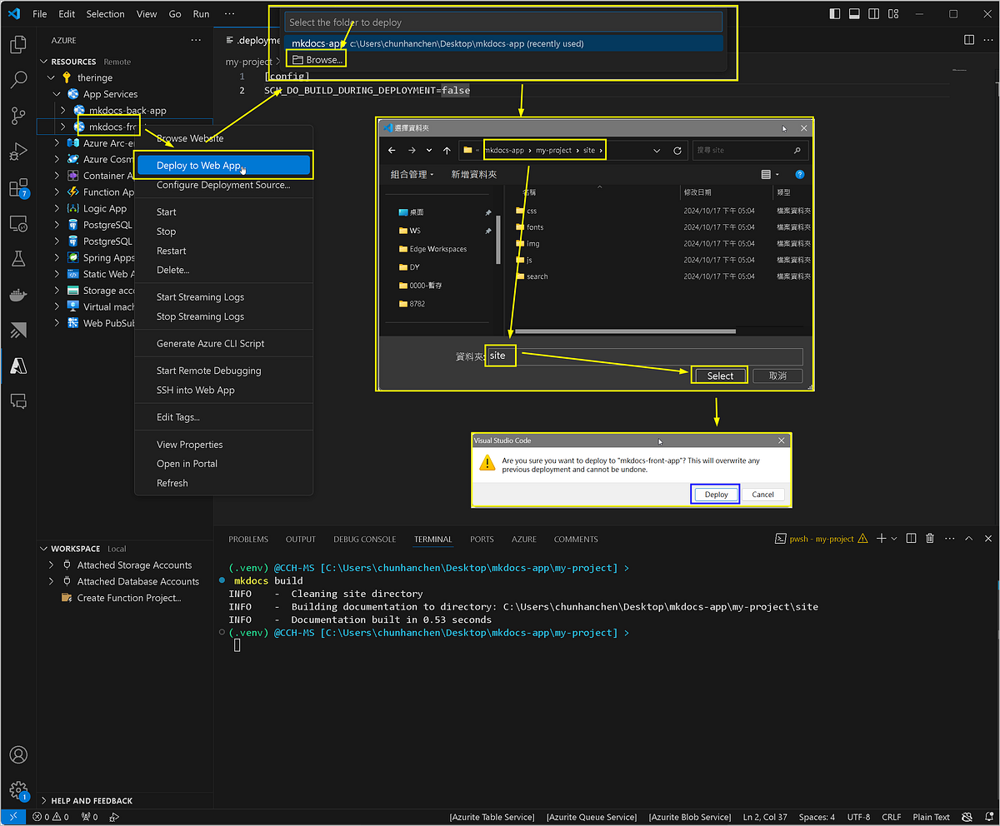

### 단계 4:

Azure에서 Node 앱을 찾고 시작 명령을 수정한 다음 앱을 다시 시작합니다.

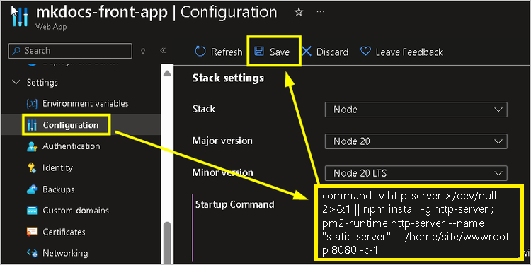

```
command -v http-server >/dev/null 2>&1 || npm install -g http-server ; pm2-runtime http-server --name "static-server" -- /home/site/wwwroot -p 8080 -c-1
```

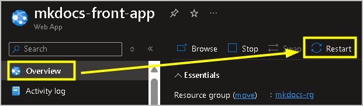

### 단계 5:

프로젝트가 제대로 실행되는지 확인합니다.

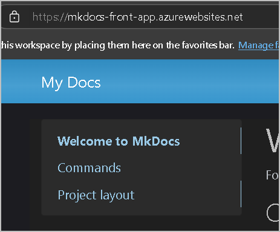

### 정적 방법: 정적 웹 앱 사용

### 단계 0:

전체 프로젝트 폴더에 대한 GitHub 저장소를 만들 수 있습니다(예를 들어, 저는 mkdocs-app이라고 이름을 지정했습니다). 또는 필요에 따라 “site” 하위 디렉토리만 업로드하도록 선택할 수 있습니다. 이번 예제에서는 전체 프로젝트 폴더를 사용합니다.

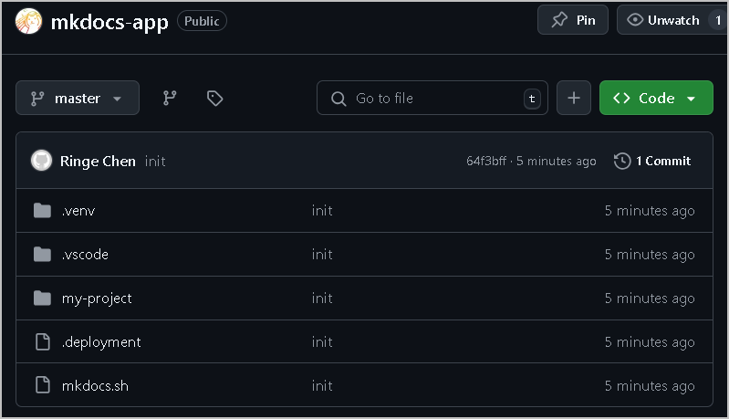

### 단계 1:

Azure에서 Static Web App을 생성하고, 프로젝트의 GitHub repository와 관련된 브랜치를 지정합니다. 또한, 다음과 같이 App location/output location을 설정해야 하며, “mkdocs project”의 이름을 지정해야 합니다(예를 들면, my-project).

```
./my-project/site
```

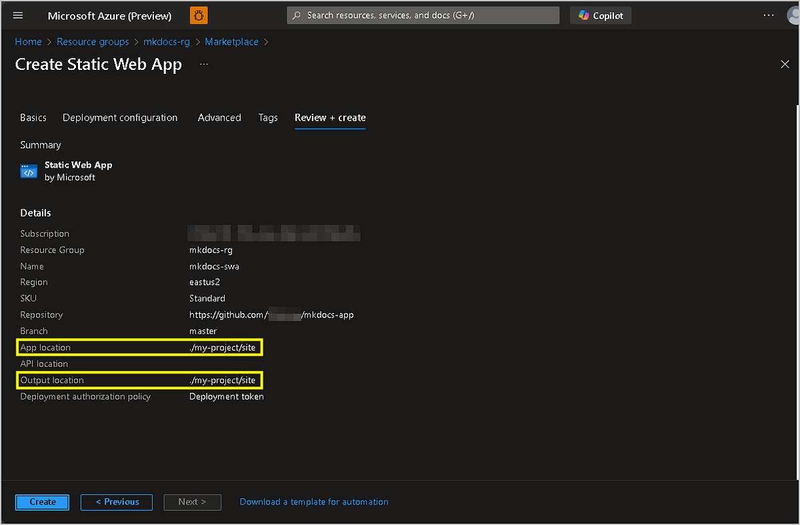

### 단계 2:

SWA가 생성되면 GitHub 저장소에서 배포 상태를 확인할 수 있습니다. 배포가 완료되면 실제 페이지를 볼 수 있습니다.

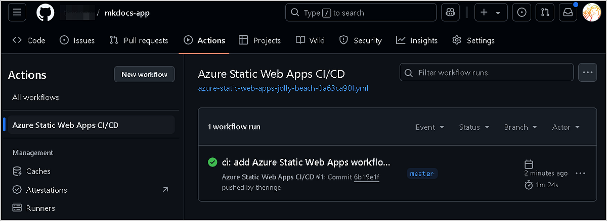

### 단계 3:

프로젝트가 제대로 수행되는지 확인합니다.

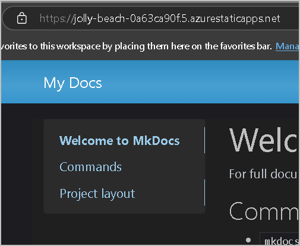

### 참조

[MkDocs](https://www.mkdocs.org/)

[Azure Linux Web App and http server — Microsoft Community Hub](https://techcommunity.microsoft.com/t5/apps-on-azure-blog/azure-linux-web-app-and-http-server/ba-p/4224475)

[Quickstart: Build your first static web app - Microsoft Learn](https://learn.microsoft.com/en-us/azure/static-web-apps/get-started-portal?tabs=vanilla-javascript&pivots=github)

- 2024년 11월 12일 업데이트 됨.
- 2024년 11월 12일 번역 함. (by [JYSEONG(MSFT)](https://techcommunity.microsoft.com/users/ji%20yong%20seong/219866) / [GitHub](https://github.com/jiyongseong))