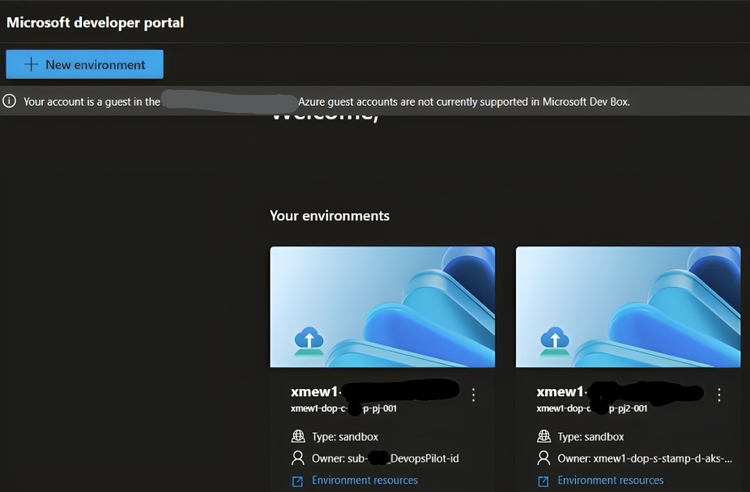
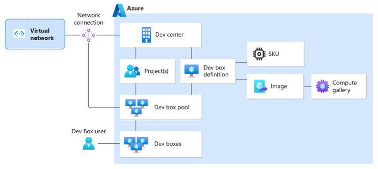
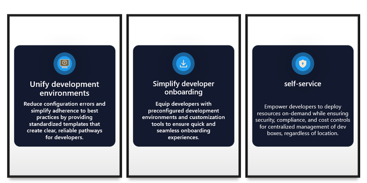
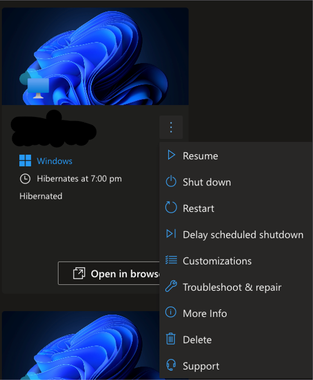
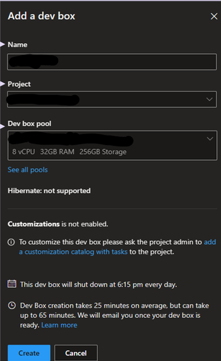

---

이 글은 원문인 [Harnessing Microsoft Dev Box and Azure Deployment Environments](https://techcommunity.microsoft.com/blog/azureinfrastructureblog/harnessing-microsoft-dev-box-and-azure-deployment-environments/4135781)를 번역한 내용임을 밝힙니다.

---

### Azure에서 배포 환경 간소화

응용 프로그램을 효율적이고 효과적으로 배포하려면 잘 구성된 배포 환경을 구성하는 것이 필수적입니다. 개발, 테스트, 스테이징, 그 밖의 어떤 환경이든지 간에 체계적인 접근 방식을 도입하면 전체 프로세스를 간소화하고 생산성을 높일 수 있습니다. 이번 문서에서는 개발자 센터에서 Dev Box 구성에 이르기까지 Azure에서 배포 환경을 구성하는 프로세스를 소개하여, 원활하고 구조화된 워크플로우를 활용할 수 있게 합니다.

### 개발자 센터(Dev Center)

- **중앙 집중식 저장소:** 개발자 센터는 다양한 개발 프로젝트를 위한 중앙 집중식 리포지토리 역할을 합니다.
- **균일한 구성:** 개발 팀이 액세스할 수 있는 사용 가능한 환경 유형에 대한 카탈로그, 응용 프로그램 템플릿 및 사양을 포함하여, 프로젝트에 대한 균일한 구성을 설정합니다.
- **플랫폼 엔지니어에 의한 관리:** 플랫폼 엔지니어링 팀은 개발 센터를 감독하여 외부 카탈로그의 통합, 프로젝트 시작 및 팀 액세스 프로비저닝을 용이하게 합니다.
- **코드형 인프라(IaC):** 카탈로그를 통해 Infrastructure as Code 템플릿을 관리하여 프로젝트 전반에 걸쳐 접근성을 보장합니다.
- **환경 유형 구성:** 환경 유형을 구성하여 개발 팀에 허용되는 환경 구성을 정의합니다.

### Azure 배포 환경(Azure Deployment Environments)

- Azure 배포 환경은 개발 팀을 위한 게임 체인저로, 응용 프로그램(Application) 인프라를 설정하는 간소화된 방법을 제공합니다.
- Azure 배포 환경은 템플릿에 깔끔하게 패키지된, 미리 정의된 인프라 리소스로 구성됩니다.
- 개발자는 이를 활용하여 그들의 Azure 구독에 이러한 템플릿을 신속하게 배포하여 시간과 노력을 절약할 수 있습니다.
- 개발자는 인프라 구성에 대한 부담 없이 코딩에만 집중할 수 있습니다.
- 플랫폼 엔지니어는 접근 제어 및 거버넌스를 담당하며, 보안과 규정을 준수하도록 합니다.

[사용 시나리오](https://learn.microsoft.com/en-us/azure/deployment-environments/overview-what-is-azure-deployment-environments#:~:text=Deployment%20Environments.-,Usage%20scenarios,-Common%20scenarios%20for) — Azure Deployment Environment에 대한 일반적인 시나리오는 링크를 클릭해서 확인하시기 바랍니다.


*이미지 출처: [링크](https://learn.microsoft.com/en-us/azure/deployment-environments/concept-environments-key-concepts). 자세한 설명은 링크를 참조하십시오.*

Azure 배포 환경을 배포하는 데 필요한 일련의 작업에는 다음 단계들 포함됩니다.

**개발자 센터 구축**

1. 개발자 센터 만들기: 상세한 이름을 입력하며, 이전에 생성한 리소스 그룹 안에 만듭니다.
2. 환경 템플릿 및 권한을 효과적으로 관리하기 위해 시스템 할당 ID(system-assigned identity)를 사용하도록 설정합니다.

**Key Vault 구성 및 GitHub 토큰 저장**

1. GitHub에서 토큰 생성: 필요한 범위로 토큰을 생성하고, [토큰을 생성합니다](https://docs.github.com/en/authentication/keeping-your-account-and-data-secure/managing-your-personal-access-tokens#creating-a-personal-access-token-classic)(자세한 방법은 링크 클릭).
2. Keyvault 만들기: Azure Portal에서 리소스 그룹 안에 Keyvault를 만듭니다.
3. Keyvault에서 액세스 정책 구성: 리포지토리와의 매끄러운 통합을 위해 개발자 센터에서 저장된 토큰을 읽을 수 있도록 허용합니다.

**개발자 센터에 카탈로그 추가**

1. 개발자 센터로 이동하여, “카탈로그” 블레이드에서 새 “카탈로그”를 추가합니다.
2. 세부 정보 지정: Git clone URI 및 기타 필요한 세부 정보를 입력합니다.
3. 카탈로그 항목 동기화: 저장소의 항목을 동기화하여 배포에 손쉽게 사용할 수 있도록 합니다.

**ID 구성**

1. 환경을 만들 수 있도록 하려면, 개발자 센터가 구독에 대한 권한이 필요합니다. 개발자 센터에 ID를 연결한 다음, 해당 ID에 필요한 권한을 할당합니다.
2. 시스템 할당 관리 ID 또는 사용자 할당 관리 ID를 연결합니다.

> 접근 권한 : 개발자 센터 ID는 리소스를 생성하기 위해서 최소한 Contributor 이상의 권한을 부여받아야 하며, 리소스 간에 권한을 할당하기 위해서 User Access Administrator 권한을 할당 받아야만 합니다.
> 

**환경 유형(Environment Types) 설정**

1. 환경을 효과적으로 분류합니다(예: “샌드박스”, “개발”, “테스트”, “스테이징”).
2. 특정 요구 사항에 따라 각 환경 유형에 대한 설정을 사용자 지정합니다.

**Azure 배포 환경 프로젝트(Deployment Environments Project) 만들기**

1. 개발자 센터 내에서 환경 유형을 연결할 수 있는 프로젝트를 만듭니다.
2. 팀 수준의 설정 및 접근을 관리하려면 Project가 필요합니다.

**프로젝트 환경 유형(**Project environment type) **만들기**

1. 프로젝트 환경 유형은 개발자 센터에 구성된 환경 유형의 하위 집합입니다.
2. 이를 통해 특정 개발 팀이 만들 수 있는 환경 유형을 미리 정의할 수 있습니다.

**환경 생성을 위한 개발자 포털**

1. [개발자 포털](https://devportal.microsoft.com/) 접근: 링크를 클릭하여 로그인하고 포털을 활용하여 새 환경을 만듭니다.
2. 카탈로그 항목 선택: 사용 가능한 카탈로그 항목 중에서 선택합니다.
3. 진행률 모니터링: 환경 생성 진행률을 모니터링하고 필요에 따라 환경을 관리합니다.



```
Example shell Script to deploy ADE using CLI commands
This script is provided as an example for setting up Azure Dev Center projects and development environments.
Usage:
You are encouraged to review and modify the script based on your specific environment.
Prerequisites:
Before starting the Azure Dev Center deployment, ensure you have the following key resources:
1.Resource Group (RG)
2.Azure Dev Center
3.Catalog
4.A linked catalog and synced to your code repository
```

```
#!/bin/bash

# Copyright (C) Microsoft Corporation.

# Exit immediately if a command fails
set -e

# Fail if an unset variable is used
set -u

#declare command variables & functions
command=""
command_output=""
command_status=0

function clear_command_variables() {
    command=""
    command_output=""
    command_status=0
}

function execute_command_exit_on_failure() {
    local cmd=$1
    eval "$cmd"
    command_status=$?
    if [ $command_status -ne 0 ]; then
        echo "Error: Command failed with status $command_status"
        exit $command_status
    fi
}
#endregion declare command variables & functions

#region Declare Constants
DEV_CENTER_CATALOG_NAME="catalog name in dev center"
ENVIRONMENT_DEFINITION_NAME="defname" # Folder name where IaC template and environment file are hosted
ENVIRONMENT_TYPE="sandbox"
PROJECT_ADMIN_ID=$(az account get-access-token --query "accessToken" -o tsv | jq -R -r 'split(".") | .[1] | @base64d | fromjson | .oid')
echo "Object ID of the service principal or managed identity: $PROJECT_ADMIN_ID"
DEPLOYMENT_ENVIRONMENTS_USER="id of user"
PROJECT="name of the project"
description="This is my first project"
TARGET_SUBSCRIPTION_ID="id of subscription"
MANAGED_ID="Dev center's user managed identity"
RESOURCE_GROUP="RG name"
DEV_CENTER_NAME="Dev center name"
ENVIRONMENT_NAME="name of an environment"
KEY_VAULT_NAME="Keyvault name"
#endregion Declare Constants

#region Install Azure Dev Center extension
echo "Installing the Azure Dev Center extension"
clear_command_variables
command="az extension add --name devcenter --upgrade"
execute_command_exit_on_failure "$command"
echo "Extension installation complete!"
#endregion Install Azure Dev Center extension

#region Get Role Id for the Subscription Owner
echo "Getting Role Id for the Subscription Owner"
clear_command_variables
command="az role definition list -n \"Owner\" --scope \"/subscriptions/$TARGET_SUBSCRIPTION_ID\" --query [].name -o tsv"
owner_role_id=""
execute_command_exit_on_failure "$command"
owner_role_id=$(eval "$command")
echo "Got Subscription Owner Role ID: $owner_role_id"
#endregion Get Role Id for the Subscription Owner

#region Get Dev Center ID
echo "Getting Azure Dev Center Resource ID"
clear_command_variables
command="az devcenter admin devcenter show -n \"$DEV_CENTER_NAME\" --query id -o tsv"
dev_center_id=""
execute_command_exit_on_failure "$command"
dev_center_id=$(eval "$command")
echo "Got Azure Dev Center Resource ID: $dev_center_id"
#endregion Get Dev Center ID

#region Get Managed Identity ID, Object ID
echo "Getting Managed Identity Resource ID"
clear_command_variables
command="az identity show --name \"$MANAGED_ID\" --resource-group \"$RESOURCE_GROUP\" --query id -o tsv"
managed_identity_id=""
execute_command_exit_on_failure "$command"
managed_identity_id=$(eval "$command")
echo "Got Managed Identity Resource ID: $managed_identity_id"

echo "Getting Managed Identity Object ID"
clear_command_variables
command="az resource show --ids \"$managed_identity_id\" --query properties.principalId -o tsv"
managed_identity_object_id=""
execute_command_exit_on_failure "$command"
managed_identity_object_id=$(eval "$command")
echo "Got Managed Identity Object ID: $managed_identity_object_id"
#endregion Get Managed Identity ID, Object ID

#region Create Project in Dev Center
echo "Creating Project in Azure Dev Center"
clear_command_variables
command="az devcenter admin project create -n \"$PROJECT\" --description \"$description\" --dev-center-id \"$dev_center_id\""
execute_command_exit_on_failure "$command"
echo "Project created successfully!"
#endregion Create Project in Dev Center

#region Assign Roles to Managed Identity
echo "Assigning Contributor role to the Managed Identity Object ID on the subscription"
clear_command_variables
command="az role assignment create --role \"Contributor\" --assignee-object-id \"$managed_identity_object_id\" --scope \"/subscriptions/$TARGET_SUBSCRIPTION_ID\""
execute_command_exit_on_failure "$command"
echo "Assigned Contributor role to the Managed Identity Object ID on the subscription"

echo "Assigning User Access Administrator role to the Managed Identity Object ID on the subscription"
clear_command_variables
command="az role assignment create --role \"User Access Administrator\" --assignee-object-id \"$managed_identity_object_id\" --scope \"/subscriptions/$TARGET_SUBSCRIPTION_ID\""
execute_command_exit_on_failure "$command"
echo "Assigned User Access Administrator role to the Managed Identity Object ID on the subscription"
#endregion Assign Roles to Managed Identity

#region Create Environment Type for the Project
echo "Creating Project Environment Type"
clear_command_variables
command="az devcenter admin project-environment-type create -n \"$ENVIRONMENT_TYPE\" --project \"$PROJECT\" --identity-type \"SystemAssigned\" --roles \"{\\\"$owner_role_id\\\":{}}\" --deployment-target-id \"/subscriptions/$TARGET_SUBSCRIPTION_ID\" --status Enabled --query 'identity.principalId' --output tsv"
project_environment_type_object_id=""
execute_command_exit_on_failure "$command"
project_environment_type_object_id=$(eval "$command")
echo "Created Project Environment Type with Object ID: $project_environment_type_object_id"

echo "Assigning Contributor role to the Project Environment Type Object ID on the subscription"
clear_command_variables
command="az role assignment create --role \"Contributor\" --assignee-object-id $project_environment_type_object_id --scope \"/subscriptions/$TARGET_SUBSCRIPTION_ID\""
execute_command_exit_on_failure "$command"
echo "Assigned Contributor role to the Project Environment Type Object ID"
#endregion Create Environment Type for the Project

#region Assign Key Vault Secrets Officer Role
echo "Assigning Key Vault Secrets Officer role to the Project Environment Type Object ID on the keyvault"
clear_command_variables
command="az role assignment create --role \"Key Vault Secrets Officer\" --assignee-object-id $project_environment_type_object_id --scope \"/subscriptions/$TARGET_SUBSCRIPTION_ID/resourceGroups/$RESOURCE_GROUP/providers/Microsoft.KeyVault/vaults/$KEY_VAULT_NAME\""
execute_command_exit_on_failure "$command"
echo "Assigned Key Vault Secrets Officer role to the Project Environment Type Object ID on the keyvault"
#endregion Assign Key Vault Secrets Officer Role

#region Assign Dev Center Project Admin and Deployment Environments User Roles
echo "Assigning Dev Center Project Admin role to $PROJECT_ADMIN_ID"
clear_command_variables
command="az role assignment create --assignee \"$PROJECT_ADMIN_ID\" --role \"DevCenter Project Admin\" --scope \"/subscriptions/$TARGET_SUBSCRIPTION_ID\""
execute_command_exit_on_failure "$command"
echo "Assigned Dev Center Project Admin role to $PROJECT_ADMIN_ID"

echo "Assigning Deployment Environments User role to $DEPLOYMENT_ENVIRONMENTS_USER"
clear_command_variables
command="az role assignment create --assignee \"$DEPLOYMENT_ENVIRONMENTS_USER\" --role \"Deployment Environments User\" --scope \"/subscriptions/$TARGET_SUBSCRIPTION_ID\""
execute_command_exit_on_failure "$command"
echo "Assigned Deployment Environments User role to $DEPLOYMENT_ENVIRONMENTS_USER"
#endregion Assign Dev Center Project Admin and Deployment Environments User Roles

#region Create Dev Environment
echo "Creating Dev Environment"
clear_command_variables
command="az devcenter dev environment create --environment-name \"$ENVIRONMENT_NAME\" --environment-type \"$ENVIRONMENT_TYPE\" --dev-center-name \"$DEV_CENTER_NAME\" --project-name \"$PROJECT\" --catalog-name \"$DEV_CENTER_CATALOG_NAME\" --environment-definition-name \"$ENVIRONMENT_DEFINITION_NAME\""
execute_command_exit_on_failure "$command"
echo "Created Dev Environment: $ENVIRONMENT_NAME"
#endregion Create Dev Environment
```

### **Dev Box**

- **셀프 서비스 클라우드 워크스테이션**: Microsoft Dev Box를 사용하면 개발자가 Dev Box라는 클라우드 기반 워크스테이션에 쉽게 접근할 수 있습니다.
- **사용자 지정 구성**: 프로젝트별 도구, 소스 코드 및 사전 빌드된 이진 파일(binary)로 Dev Box를 구성할 수 있으므로 개발자가 신속하게 작업을 시작할 수 있습니다.
- **이미지 옵션**: 개발자는 사용자 지정 이미지를 만들거나 Azure Marketplace에서 미리 구성된 이미지를 활용할 수 있으며, 그러한 이미지에는 Visual Studio가 미리 설치되어 있을 수 있습니다.
- **다양한 사용**: 개발자는 원격 데스크톱 클라이언트 또는 웹 브라우저를 통해 액세스할 수 있으며, 일상적인 작업들에 여러가지의 Dev Box를 섞어 사용할 수 있습니다.
- **조직 역할**: Dev Box 서비스는 3가지 주요 조직 역할 즉, 플랫폼 엔지니어, 개발 팀 리더, 개발자를 지원하도록 설계되어 원활한 공동 작업과 효율적인 워크플로우를 용이하게 합니다.

[사용 시나리오](https://learn.microsoft.com/en-us/azure/dev-box/overview-what-is-microsoft-dev-box#:~:text=the%20development%20team.-,Scenarios%20for%20Microsoft%20Dev%20Box,-Organizations%20can%20use) — Microsoft Dev Box에 대한 일반적인 시나리오는 링크를 클릭해서 확인하시기 바랍니다.

### 전제 조건:

1. **Dev 센터 만들기**: 프로젝트 관리 및 환경 설정을 위한 중앙 허브 역할을 하는 Dev 센터를 만듭니다.
2. **프로젝트 설정**: Dev Box는 특정 프로젝트와 연결되므로, Dev 센터 하위에 프로젝트가 만들어졌는지 확인합니다.
3. **개발자 포털 접근**: Dev Box를 만들려는 사용자는 개발자 포털에 대한 접근 권한이 있어야 합니다. 프로젝트에서 사용자에게 “DevCenter Dev Box User” 역할을 할당하여 접근 권한을 부여합니다.
4. **네트워크 구성**: Dev Box를 만들기 전에 Dev Box에 대한 네트워크 연결을 설정할 수 있도록, 가상 네트워크(VNet)과 서브넷이 이미 준비되어 있는지 확인합니다.
5. **사용자 지정 이미지 준비**: 사용자 지정 이미지를 배포하려는 경우, 이미지가 준비되어 있고 컴퓨트 갤러리에서 사용할 수 있는지 확인합니다. 사용자 지정 이미지를 Dev 센터와 연결하여 배포를 용이하게 합니다.

> 참고: Microsoft Dev Box는 직장 및 학교 계정만 지원합니다. 게스트 계정과 개인 계정은 지원되지 않습니다.
> 



*이미지 출처: [링크](https://learn.microsoft.com/en-us/azure/dev-box/concept-dev-box-architecture). 자세한 설명은 제공된 링크를 참조하십시오.*



Microsoft Dev Box를 활용하여 플랫폼 엔지니어링 강화

**Dev Box 정의 만들기**

1. Dev 센터 리소스로 이동: 새 Dev Box 정의를 만듭니다.
2. 필요한 세부 정보 입력 : 이름, 이미지, 컴퓨트, 스토리지 등을 입력하여 Dev Box를 정의합니다.

**Dev Box 풀 및 네트워크 연결**

1. Dev Box 풀은 지정된 네트워크 연결을 통해 Dev Box의 위치를 정의합니다.

2. Dev Box를 다음의 네트워크 중 하나를 배포할 수 있습니다.

- Microsoft 호스팅 네트워크로
- 여러분이 관리하는 네트워크로

3. Dev Box Pool 생성: 풀 이름, Dev Box 정의, 네트워크 연결, 작성자 권한, 자동 중지 설정 등과 같은 세부 정보를 지정합니다.

4. 표준화된 접근: 개발자가 개발 요구 사항에 맞게 표준화된 Dev Box에 접근할 수 있도록 합니다.

**환경 테스트 및 정리**

1. 테스트 환경 설정: [개발자 포털](https://devportal.microsoft.com/)을 활용하여 철저하게 테스트합니다.
2. 기능 확인: Dev Box를 만들고 기능을 확인합니다.
3. 비용 최소화: 불필요한 환경이나 Dev Box를 삭제하여 비용을 최소화합니다.





```
Example shell Script to deploy resources before creating dev box in dev box portal
This script is provided as an example for setting up Dev Box definition and Dev center pool.
You are encouraged to review and modify the script based on your specific environment.
Prerequisites:
Before starting the Dev box, ensure you have the following key resources:
1.Resource Group
2.Azure Dev Center
3.Dev Center project
4.Vnet and subnet
```

```
#!/bin/bash
# Copyright (C) Microsoft Corporation.

# Exit immediately if a command fails
set -e

# Fail if an unset variable is used
set -u

echo "Setting the variables"

#region Set the variables
RESOURCE_GROUP=""
DEV_CENTER_NAME=""
PROJECT=""
DEVBOX_DEF_NAME=""
VNET_NAME=""
DEV_CENTER_NETWORK_CONNECTION_NAME=""
NETWORK_CONNECTION_RG_NAME=""
DEV_CENTER_POOL_NAME=""
Subnet=""
attached_network_name=""
compute_gallery_name=""
osstoragetype=""
devbox_image_name=""
size=""
tier=""
compute=""
family=""
capacity=""
target_subscription_id=""
azure_region=""
#endregion Set the variables

#region Install Azure Dev Center extension
echo "Installing the Azure Dev Center extension"

commandInstallDevCenterExt="az extension add --name devcenter --upgrade"
commandInstallDevCenterExt_output=""
commandInstallDevCenterExt_status=0
execute_command_with_status_code "$commandInstallDevCenterExt" commandInstallDevCenterExt_output commandInstallDevCenterExt_status

if [ $commandInstallDevCenterExt_status -ne 0 ]; then
  echo "Failed to install the Azure Dev Center extension."
  echo_output_dictionary_to_output_file
  exit 0
fi

echo "Extension installation complete!"
#endregion Install Azure Dev Center extension

#region Create Dev Box definition
echo "Creating Dev Box definition"

commandCreateDevboxDef="az devcenter admin devbox-definition create \
  --dev-center $DEV_CENTER_NAME \
  --devbox-definition-name $DEVBOX_DEF_NAME \
  --image-reference \"{\\\"id\\\": \\\"/subscriptions/$target_subscription_id/resourceGroups/$RESOURCE_GROUP/providers/Microsoft.DevCenter/devcenters/$DEV_CENTER_NAME/galleries/$compute_gallery_name/images/$devbox_image_name\\\"}\" \
  --os-storage-type $osstoragetype \
  --resource-group $RESOURCE_GROUP \
  --sku \"{\\\"capacity\\\": $capacity, \\\"family\\\": \\\"$family\\\", \\\"name\\\": \\\"$compute\\\", \\\"size\\\": \\\"$size\\\", \\\"tier\\\": \\\"$tier\\\"}\" \
  --hibernate-support \"Disabled\" \
  --location \"$azure_region\""

commandCreateDevboxDef_output=""
commandCreateDevboxDef_status=0
execute_command_with_status_code "$commandCreateDevboxDef" commandCreateDevboxDef_output commandCreateDevboxDef_status

if [ $commandCreateDevboxDef_status -ne 0 ]; then
  echo "Failed to create Dev Box definition."
  echo_output_dictionary_to_output_file
  exit 0
fi

echo "Dev Box definition created successfully."
#endregion Create Dev Box definition

#region Get subnet ID
echo "Getting subnet ID"

commandGetSubnetId="az network vnet subnet show --name $Subnet --vnet-name $VNET_NAME --resource-group $RESOURCE_GROUP --query id --output tsv"
commandGetSubnetId_output=""
commandGetSubnetId_status=0
execute_command_with_status_code "$commandGetSubnetId" commandGetSubnetId_output commandGetSubnetId_status

if [ $commandGetSubnetId_status -ne 0 ]; then
  echo "Failed to get subnet ID."
  echo_output_dictionary_to_output_file
  exit 0
fi

echo "Got subnet ID: $commandGetSubnetId_output"
#endregion Get subnet ID

#region Create Azure Dev Center Network Connection
echo "Creating Azure Dev Center Network Connection"

commandCreateNetworkConnection="az devcenter admin network-connection create \
  --domain-join-type \"AzureADJoin\" \
  --name \"$DEV_CENTER_NETWORK_CONNECTION_NAME\" \
  --resource-group $RESOURCE_GROUP \
  --subnet-id \"$commandGetSubnetId_output\" \
  --location \"$azure_region\" \
  --networking-resource-group-name \"$NETWORK_CONNECTION_RG_NAME\""

commandCreateNetworkConnection_output=""
commandCreateNetworkConnection_status=0
execute_command_with_status_code "$commandCreateNetworkConnection" commandCreateNetworkConnection_output commandCreateNetworkConnection_status

if [ $commandCreateNetworkConnection_status -ne 0 ]; then
  echo "Failed to create Azure Dev Center Network Connection."
  echo_output_dictionary_to_output_file
  exit 0
fi

echo "Azure Dev Center Network Connection created successfully."
#endregion Create Azure Dev Center Network Connection

#region Get Network Connection ID
echo "Getting Network Connection ID"

commandGetNetworkConnectionId="az devcenter admin network-connection show --name \"$DEV_CENTER_NETWORK_CONNECTION_NAME\" --resource-group $RESOURCE_GROUP --query id --output tsv"
commandGetNetworkConnectionId_output=""
commandGetNetworkConnectionId_status=0
if [ $commandGetNetworkConnectionId_status -ne 0 ]; then
  echo "Failed to get Network Connection ID."
  echo_output_dictionary_to_output_file
  exit 0
fi

echo "Got Network Connection ID: $commandGetNetworkConnectionId_output"
#endregion Get Network Connection ID

#region Create Dev Center Attached Network
echo "Creating Azure Dev Center attached network"

commandCreateAttachedNetwork="az devcenter admin attached-network create \
  --attached-network-connection-name $attached_network_name \
  --network-connection-id \"/subscriptions/$target_subscription_id/resourceGroups/$RESOURCE_GROUP/providers/Microsoft.DevCenter/networkConnections/$DEV_CENTER_NETWORK_CONNECTION_NAME\" \
  --resource-group $RESOURCE_GROUP \
  --dev-center $DEV_CENTER_NAME"

commandCreateAttachedNetwork_output=""
commandCreateAttachedNetwork_status=0
execute_command_with_status_code "$commandCreateAttachedNetwork" commandCreateAttachedNetwork_output commandCreateAttachedNetwork_status

if [ $commandCreateAttachedNetwork_status -ne 0 ]; then
  echo "Failed to create Azure Dev Center attached network."
  echo_output_dictionary_to_output_file
  exit 0
fi

echo "Created Azure Dev Center attached network successfully."
#endregion Create Dev Center Attached Network

#region Create Dev Center Pool
echo "Creating Azure Dev Center pool"

commandCreatePool="az devcenter admin pool create \
  --devbox-definition-name \"$DEVBOX_DEF_NAME\" \
  --local-administrator \"Enabled\" \
  --name \"$DEV_CENTER_POOL_NAME\" \
  --project \"$PROJECT\" \
  --resource-group \"$RESOURCE_GROUP\" \
  --location \"$azure_region\" \
  --network-connection-name \"$attached_network_name\" \
  --single-sign-on-status \"Enabled\""

commandCreatePool_output=""
commandCreatePool_status=0
execute_command_with_status_code "$commandCreatePool" commandCreatePool_output commandCreatePool_status

if [ $commandCreatePool_status -ne 0 ]; then
  echo "Failed to create Azure Dev Center pool."
  echo_output_dictionary_to_output_file
  exit 0
fi

echo "Azure Dev Center Pool created successfully."
#endregion Create Dev Center Pool

echo_output_dictionary_to_output_file
```

### 참고 문서 링크들

[Learn how to create a Dev Center](https://learn.microsoft.com/en-us/azure/dev-box/quickstart-configure-dev-box-service#create-a-dev-center:~:text=resource%20provider.-,Create%20a%20dev%20center,-To%20get%20started)

[Guide to creating a catalog](https://learn.microsoft.com/en-us/azure/deployment-environments/how-to-configure-catalog?tabs=DevOpsRepoMSI)

[Instructions for creating environment types](https://learn.microsoft.com/en-us/azure/deployment-environments/how-to-configure-devcenter-environment-types)

[Steps to create a project](https://github.com/MicrosoftDocs/azure-docs/blob/main/articles/deployment-environments/quickstart-create-and-configure-devcenter.md#:~:text=to%20deploy%20environments.-,Create%20a%20project,-In%20Azure%20Deployment)

[How to create a project environment type](https://github.com/MicrosoftDocs/azure-docs/blob/main/articles/deployment-environments/quickstart-create-and-configure-devcenter.md#:~:text=Create%20a%20project%20environment%20type)

[Guide for creating a Dev Box definition](https://learn.microsoft.com/en-us/azure/dev-box/quickstart-configure-dev-box-service#create-a-dev-box-definition:~:text=ignore%20this%20message.-,Create%20a%20dev%20box%20definition,-Next%2C%20you%20create)

[Instructions for setting up a network connection](https://learn.microsoft.com/en-us/azure/dev-box/how-to-configure-network-connections?tabs=AzureADJoin#:~:text=join%20deployment.-,Create%20a%20network%20connection,-Microsoft%20Entra%20join)

[Steps for creating a Dev Box pool](https://learn.microsoft.com/en-us/azure/dev-box/quickstart-configure-dev-box-service#create-a-dev-box-definition:~:text=Select%20Create.-,Create%20a%20dev%20box%20pool,-Now%20that%20you)

