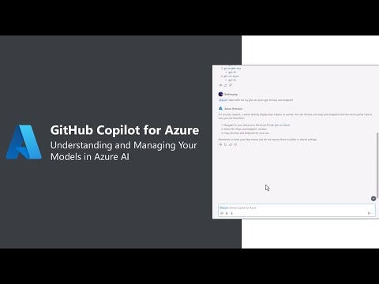
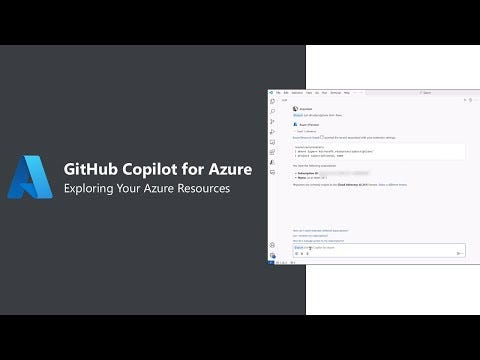
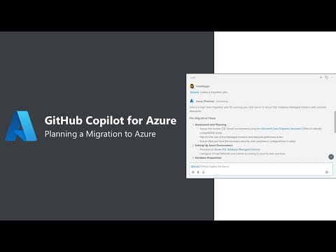
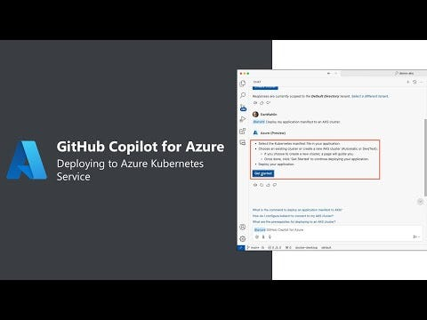

이 포스팅은 [AmyBoyd](https://techcommunity.microsoft.com/users/amyboyd/386246) 님의 [GitHub Copilot for Azure: 6 Must-Try Features](https://techcommunity.microsoft.com/blog/azuredevcommunityblog/github-copilot-for-azure-6-must-try-features/4283126) 글을 참고하여 한국 개발자들도 이해하기 쉽도록 작성하였습니다.

---

개발자로서 우리는 워크플로우를 간소화하고 생산성을 높이는 도구를 끊임없이 찾고 있습니다.

… 현재 Public Preview인 **[GitHub Copilot for Azure]**(https://aka.ms/GetGitHubCopilotForAzure)를 사용해보시기 바랍니다!

[Visual Studio Code](https://code.visualstudio.com/)의 [GitHub Copilot Chat](https://marketplace.visualstudio.com/items?itemName=GitHub.copilot-chat)과 완벽하게 통합되는 새로운 도구입니다. 이 블로그에서는 GitHub Copilot for Azure의 6가지 꼭 시도해봐야 할 기능을 소개합니다.

- **GitHub Copilot for Azure란? :** Azure 클라우드를 사용하는데 있어서 도움을 주는 개인 비서라고 생각하면 됩니다.
- **문제점 해결 :** 통상은 인프라와 서비스를 관리하기 위해서 IDE와 Azure 포털을 오가는데, GitHub Copilot for Azure를 이용하면 IDE만 사용하면 됩니다.
- **문제점 해결 :** 인터넷 브라우저의 탭을 열어서 서비스에 대한 설명 문서, 명령어 등을 찾을 필요 없이, IDE에서 바로 확인이 가능합니다.
- **사용 방법 :** GitHub Copilot Chat에서 ‘@azure’에게 질문하세요.

이 블로그에서는, GitHub Copilot for Azure의 6가지 핵심 기능에 대해서 살펴보고, 이를 통해서 개발 환경 향상과 클라우드 프로젝트를 최적화하는 방법에 대해서 살펴보게 됩니다. Azure 서비스 검색부터 AI 모델 쿼리 및 마이그레이션 검색에 이르기까지, 아래의 기능들을 이용하면 더 적은 노력으로 더 많은 것을 달성할 수 있습니다.

### Azure용 GitHub Copilot 1번 기능 — Azure 서비스 및 AI 템플릿 검색

개발자 Dan은 컨테이너를 Azure에 배포하고 싶지만, 어떻게 시작해야 할지 모르고 있습니다. Visual Studio Code에서 GitHub Copilot for Azure를 이용하면, 컨테이너를 위한 Azure 서비스를 선택하는 과정을 안내 받을 수 있으며, 예제 솔루션을 배포하는 데 사용할 수 있는 명령들도 제공 받을 수 있으며, Dan의 솔루션에 통합할 수 있는 Azure AI 기능이 포함된 예제도 제공 받을 수 있습니다.

아래 비디오에서는 Dan이 사용한 프롬프트와 GitHub Copilot for Azure가 응답한 내용을 확인할 수 있습니다.

### Azure용 GitHub Copilot 2번 기능 — 컨텍스트를 사용하여 Azure에 배포

April은 VS Code에서 Django 앱을 개발하여 Azure에 배포할 생각입니다. GitHub Copilot for Azure를 이용하여, 도움이 될만한 문서를 찾았습니다. 그 다음, 확장 프로그램에 코드 컨텍스트와 프롬프트를 입력하였고, 확장 프로그램은 Azure에 프로젝트를 배포하는데 필요한 터미널 명령들과 코드 변경 사항들을 제공합니다.

아래 영상에서 April이 사용한 프롬프트와 GitHub Copilot for Azure가 반환한 응답을 확인할 수 있습니다.

### Azure용 GitHub Copilot 3번 기능 — Azure AI에서 모델 이해 및 관리

AI 엔지니어인 Bethany는 팀과 함께 Azure에서 최신 AI 모델을 사용하려고 합니다. 사용 가능한 모든 Azure AI 서비스들을 검토하였고, 개발 및 테스트에서 재사용할 수 있도록 팀 구독에 GPT-4o 모델이 배포되어 있는지 확인하고, 새로운 GPT-40 mini 모델을 배포하고자 합니다.

아래 영상에서 Bethany가 사용한 프롬프트와 GitHub Copilot for Azure가 반환한 응답을 확인할 수 있습니다.

### Azure용 GitHub Copilot 4번 기능 — Azure 리소스 탐색

Azure 관리자인 Amy는 팀의 구독을 관리하고 있습니다. Amy는 GitHub Copilot for Azure를 이용하여 자연어 쿼리를 통해서 접근 가능한 구독과 배포된 리소스 그룹을 확인하고 있습니다. Azure Resource Graph 쿼리가 바로 또는 향후에 참조용으로 사용할 수 있음을 확인하였습니다.

아래 영상에서 Amy가 사용한 프롬프트와 GitHub Copilot for Azure가 반환한 응답을 확인할 수 있습니다.

### Azure용 GitHub Copilot 5번 기능 — Azure로의 마이그레이션 계획

클라우드 엔지니어인 Gwen은 HIPAA 규정 준수를 우선하고, 다운타임을 최소화하면서, 온프레미스에 있는 SQL Server 환경을 클라우드로 마이그레이션 해야 합니다. GitHub Copilot for Azure는 적합한 Azure 서비스와 Azure Database Migration Service와 같은 도구 등을 제안해 줍니다. 또한, 링크와 설명서가 포함된 마이그레이션 계획도 작성하여 줍니다. 배포 이후, 확장 프로그램은 배포된 인스턴스의 세부 정보도 제공하여 줍니다.

아래 영상에서 Gwen이 사용한 프롬프트와 GitHub Copilot for Azure가 반환한 응답을 확인할 수 있습니다.

### Azure용 GitHub Copilot 6번 기능 — Azure Kubernetes Service에 배포

Dan은 컨테이너화 된 애플리케이션을 Azure Kubernetes Service에 배포해야 하지만 클러스터를 만드는 방법도 파악하고 있어야 합니다. S Code에서 GitHub Copilot for Azure 및 Azure Kubernetes Services 확장을 사용하면 편집기를 벗어나지 않고도 새 클러스터를 만들 수 있습니다. 클러스터가 생성되면 GitHub Copilot for Azure를 사용하여 app manifest 를 배포할 수 있습니다.

아래 영상에서 Dan이 사용한 프롬프트와 GitHub Copilot for Azure가 반환한 응답을 확인할 수 있습니다.

지금까지 GitHub Copilot for Azure의 필수 기능들에 대해서 살펴보았습니다. 이제 여러 분의 의견을 듣고자 합니다. VS Code 마켓플레이스에서 확장 프로그램을 다운로드하여 사용해 보시기 바랍니다.

https://aka.ms/GetGitHubCopilotForAzure

Azure용 GitHub Copilot 확장 기능에 대해 자세히 알아보려면 [VS Code용 GitHub Copilot for Azure 소개: Azure 워크플로 간소화](https://techcommunity.microsoft.com/t5/microsoft-developer-community/streamline-your-azure-workflow-introducing-github-copilot-for/ba-p/4276989) 블로그 게시물을 확인하세요.

- 2024년 10월 31일 업데이트 됨.
- 2024년 11월 11일 번역 함. (by [JYSEONG(MSFT)](https://techcommunity.microsoft.com/users/ji%20yong%20seong/219866) / [GitHub](https://github.com/jiyongseong))