Argo CD는 Kubernetes에서 사용할 수 있는 선언적 GitOps CD 도구로, Kubernetes 매니페스트를 이용하여 어플리케이션의 상태를 정의하고 자동으로 클러스터와 동기화를 지원합니다. Argo CD는 웹 UI와 CLI를 통하여 배포를 모니터링하고 관리할 수 있는 기능을 제공합니다.

Azure에 Argo CD를 설치하려면, 다음과 같은 필수 구성 요소들이 필요합니다.

- 사용 가능한 Azure 계정과 Azure 구독
- 최소 2개 노드와 RBAC가 활성화된 Azure Kubernetes Service(AKS) 클러스터
- 로컬 머신에 Azure CLI 및 kubectl 명령줄 도구가 설치되어 있어야 함
- 로컬 머신에 Helm 패키지 관리자가 설치되어 있어야 함

설치 과정은 다음과 같습니다:

1. 다음 화면의 설정으로 AKS 클러스터를 생성합니다 -

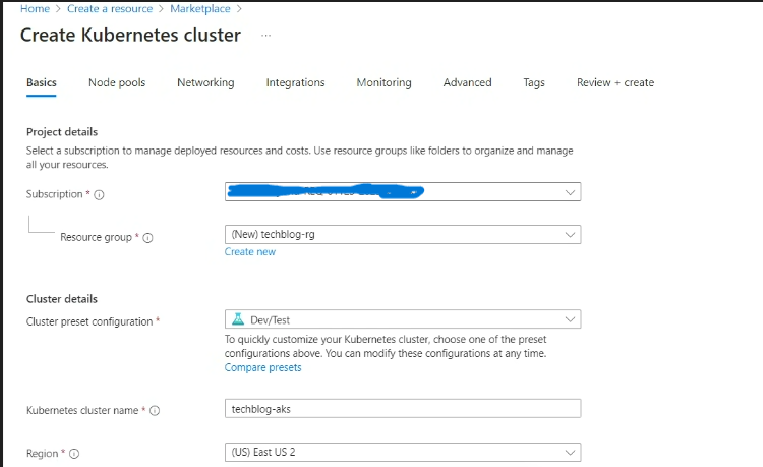

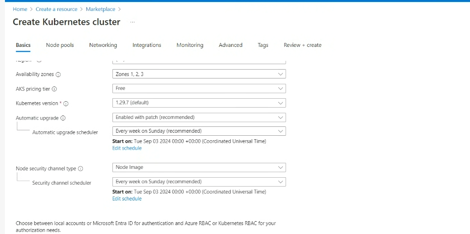

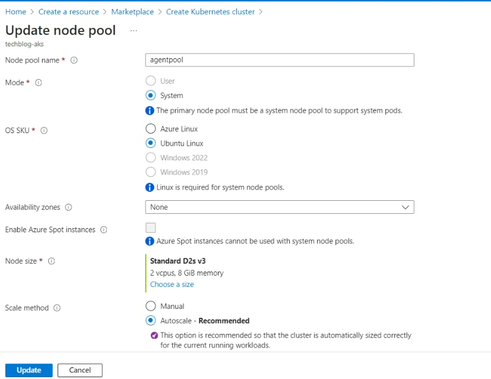

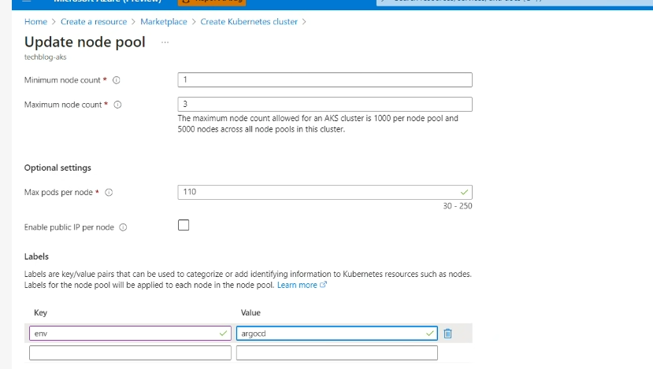

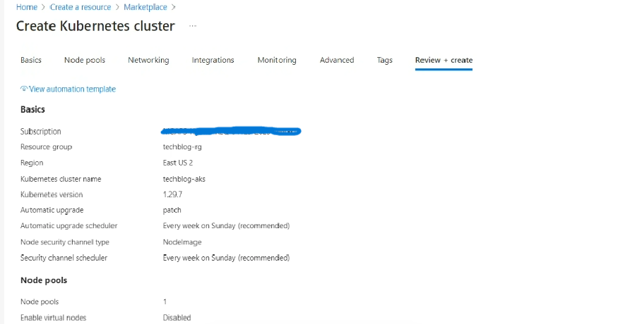

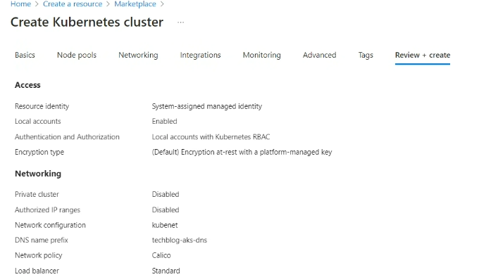

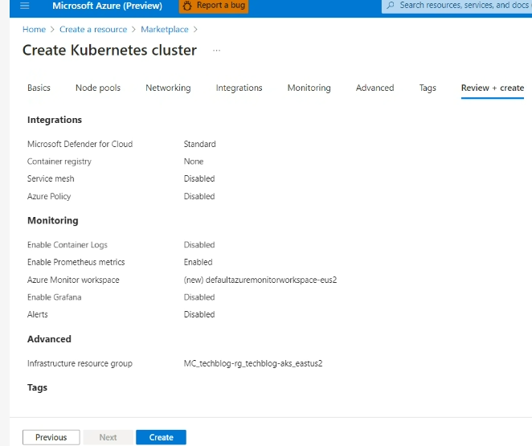

2.아래의 명령을 이용하여 앞서 생성한 AKS 클러스터가 있는 구독으로 로그인합니다.

```
Az account set –subscription <subscription-id>
```

3. 클러스터에 ArgoCD를 설치합니다. Kubernetes 네임스페이스(namespace)는 클러스터 내의 Pods, Services, Deployments에 대한 범위를 제공합니다. K8s의 네임스페이스는 한 네임스페이스에서 작업하는 사용자로 하여금 다른 네임스페이스의 내용은 볼 수 없도록 해줍니다. Kubernetes 클러스터에서 네임스페이스는 리소스를 분할하고 워크로드를 격리할 수 있도록 해주어, 물리적 클러스터 내에서 가상 클러스터처럼 동작할 수 있도록 해줍니다. 이를 통하여 여러 팀이나 프로젝트가 독립적으로 동작할 수 있도록 해줍니다.

클러스터 내부에 Argo CD는 다음의 순서에 따라서 설치할 수 있습니다:

3–1. Argo CD를 위한 네임스페이스를 생성합니다:

```
kubectl create namespace argocd
```

3–2. 생성한 네임스페이스에 Argo CD를 설치합니다:

```
kubectl apply -n argocd -f [URL]
```

```
URL àhttps://raw.githubusercontent.com/argoproj/argo-cd/stable/manifests/install.yaml
```

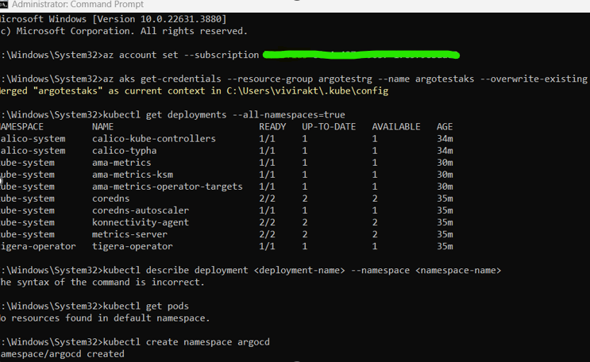

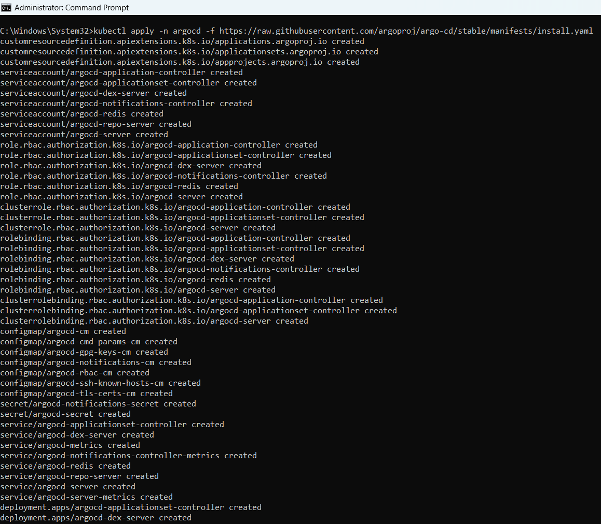

3–3. Argo CD가 생성되고 나면, 다음의 명령을 이용하여 pods의 상태를 확인합니다.

```
kubectl get pods -n argocd
```

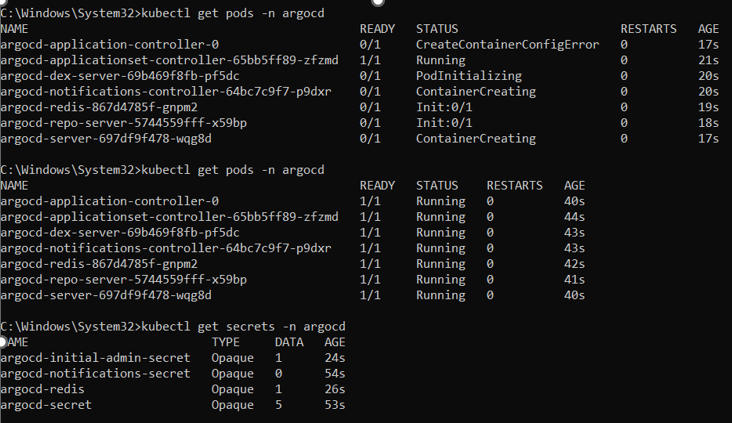

Argo CD는 Git 리포지토리의 변경 사항이 있는지 모니터링을 하게 됩니다. 변경 사항이 감지되면, Argo CD는 자동으로 GitOps 도구를 업데이트 하게 됩니다. 변경 사항은 Kubernetes 클러스터에 반영됩니다.

Argo CD 플랫폼에 로그인 하는 방법은 다음과 같습니다:

1. 다음의 명령을 이용하여 secrets을 가져옵니다:

```
kubectl get secrets -n argocd
```

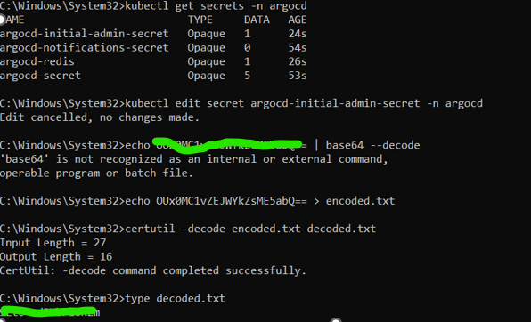

1. secret은 pod가 서비스에 접근하기 위해서 사용하는 자격 증명과 같은 민감한 정보를 저장하는 개체입니다.

```
kubectl edit secret argocd-initial-admin-secret -n argocd
```

1. argocd-initial-admin-secret 파일에서 비밀번호를 확인합니다.
2. 비밀번호를 복호화 합니다.

```
echo <secret> | base64 -d
```

Base64는 이진 데이터를 ASCII 텍스트 형식으로 변환하거나 또는 반대로 변환하는 데 사용되는 인코딩 및 디코딩 기술입니다.

1. admin 비밀번호를 이용하여 Argo CD UI로 접근합니다.
2. Service 정보를 확인합니다.

```
kubectl get svc -n argocd
```

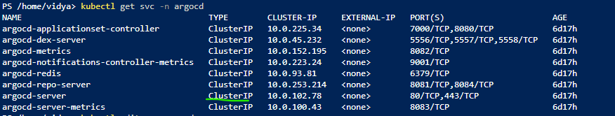

Service는 Pods의 논리적 집합이면서, 이에 접근하기 위한 정책을 나타내는 추상화 개체를 의미합니다. 각 Pod는 고유한 IP 주소를 가지고 있으며, Service 없이는 클러스터 외부로 노출되지 않습니다.

Argo CD 서버 service를 편집합니다:

```
kubectl edit svc argocd-server -n argocd
```

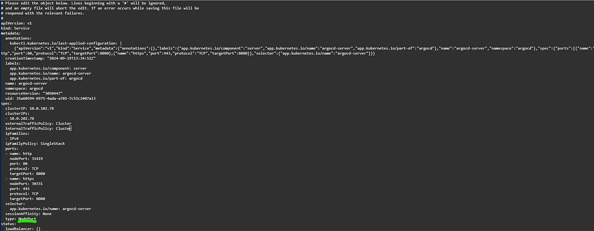

- **ClusterIP** : 동일 Kubernetes 클러스터 내에서 Pod 간의 통신에 사용됩니다.
- **NodePort와 LoadBalancer Service들** : 클러스터 내부의 어플리케이션과 클러스터 외부의 클라이언트 간의 통신에 사용됨.
1. 변경 사항을 저장하고, 서비스 명령을 다시 실행합니다:

```
kubectl get svc -n argocd
```

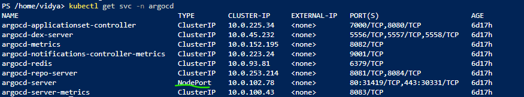

NodePort가 변경되었습니다. 3. NodePort IP 주소를 확인합니다:

```
kubectl get nodes -o wide
```

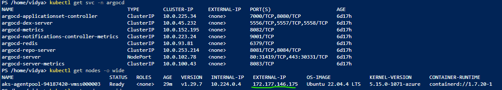

1. NodePort 외부 IP 주소를 확인합니다.
- **IP 주소** : 171.177.146.175
- **Port 번호**: 31419
1. 171.177.146.175:31419로 접근해도 제대로 동작하지 않는다면, Azure Network Security Group에서 port를 허용해야 합니다.
- VMSS → Instances → Networking → Add inbound rules → Add Port로 이동

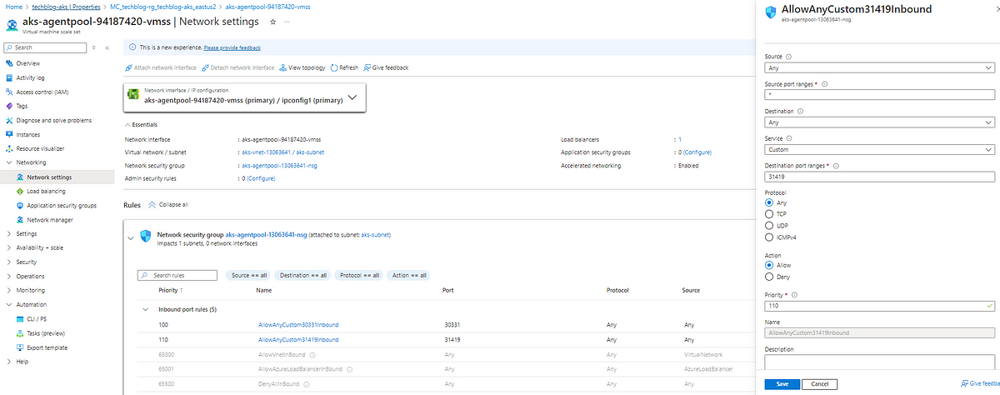


자세한 내용은 https://argo-cd.readthedocs.io/en/stable/getting_started/ 사이트를 참고 하시기 바랍니다.

- 2024년 10월 17일 업데이트 됨.
- 2024년 11월 13일 번역 함. (by [JYSEONG(MSFT)](https://techcommunity.microsoft.com/users/ji%20yong%20seong/219866) / [GitHub](https://github.com/jiyongseong))