---
layout: post
title:  "VS Code를 활용하여 Azure API 호출하기"
author: kyungbinoh
tag: [ Azure, Azure API ]
category: [ Solution ]
image: assets/images/thumnails/call-azure-api.webp
--- 
안녕하세요.

Azure의 리소스는 다양한 방법으로 관리할 수 있는데요, 오늘은 REST API 를 활용하여 Azure 리소스를 조회하는 방법을 알아보려고 합니다. 마이크로소프트의 Identity 도구인 Entra 를 활용하여 Service Principal 을 생성하고 활용하는 방법도 함께 공부해보겠습니다.

오늘 활용할 도구는 Microsoft의 Visual Studio Code 입니다! VS Code 용 REST 클라이언트를 활용하여 .https 파일이나 .rest 파일에서 HTTP 호출을 정의할 수 있습니다. 오늘은 VS Code 내에서 변수를 사용하여 API 호출을 해x보겠습니다.

> * 준비물
> 
> - Azure Subscription (구독)
> - Visual Studio Code (링크에서 다운 가능 — https://code.visualstudio.com/)

Azure 리소스를 REST API 로 호출하기 위해서는 아래의 4가지 정보를 사전에 수집해야 합니다.

> Azure의 구독 (Subscription) ID
> 
> 해당 구독의 Tenant ID
> 
> 이후에 등록할 Application의 Client ID
> 
> Client 의 Secret


1. **Azure의 구독 ID 확인**

Azure 포털 내에서 검색창에 구독 (혹은 Subscription) 을 검색하여 선택하면 아래와 같은 화면이 보입니다. 캡쳐 내에 검은색으로 색칠한 ‘subscription ID’ 에서 우리의 구독 ID를 확인할 수 있습니다.

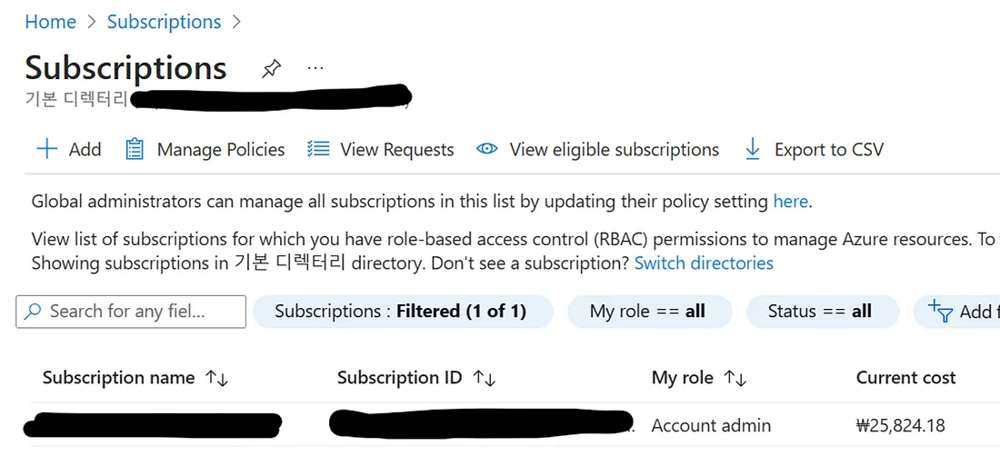

**2. Tenant ID 확인**

Tenant도 마찬가지입니다. 포털의 검색 창에서 Tenant를 검색해보시면 ‘Tenant Properties’ 라고 하는 메뉴를 확인할 수 있으며, 선택하면 아래의 화면에서 우리의 Tenant ID를 확인할 수 있습니다.

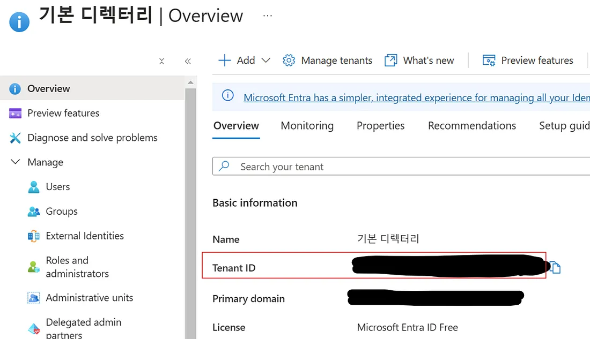

**3. Application의 Client ID**

다음은 서비스 주체 (Service Principal)을 만들고 Azure 의 구독에 권한을 부여해야 합니다.

Entra ID 메뉴로 들어가면 아래 스크린샷과 같이 왼쪽 blade에 App Registration이 있습니다. Application을 만들어서 서비스 주체로 Azure 구독에 접근 권한을 주겠습니다.

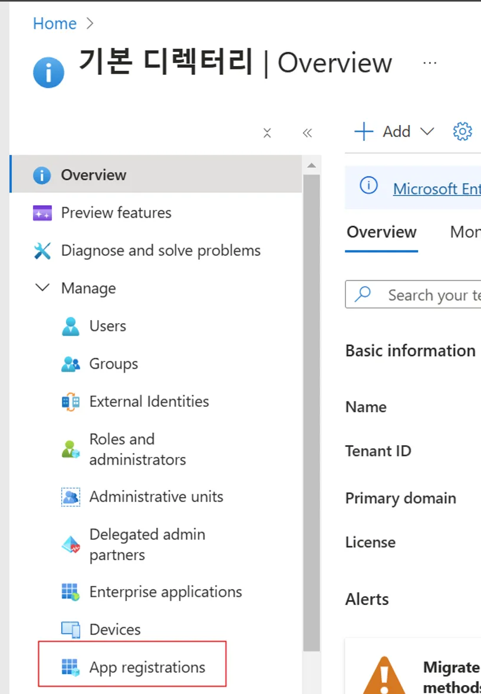

아래와 같이 새로운 앱을 등록해보겠습니다.

저는 ‘REST API APPLICATION’ 이라는 이름으로 생성했습니다. App의 이름은 편하신 대로 설정하셔도 됩니다.

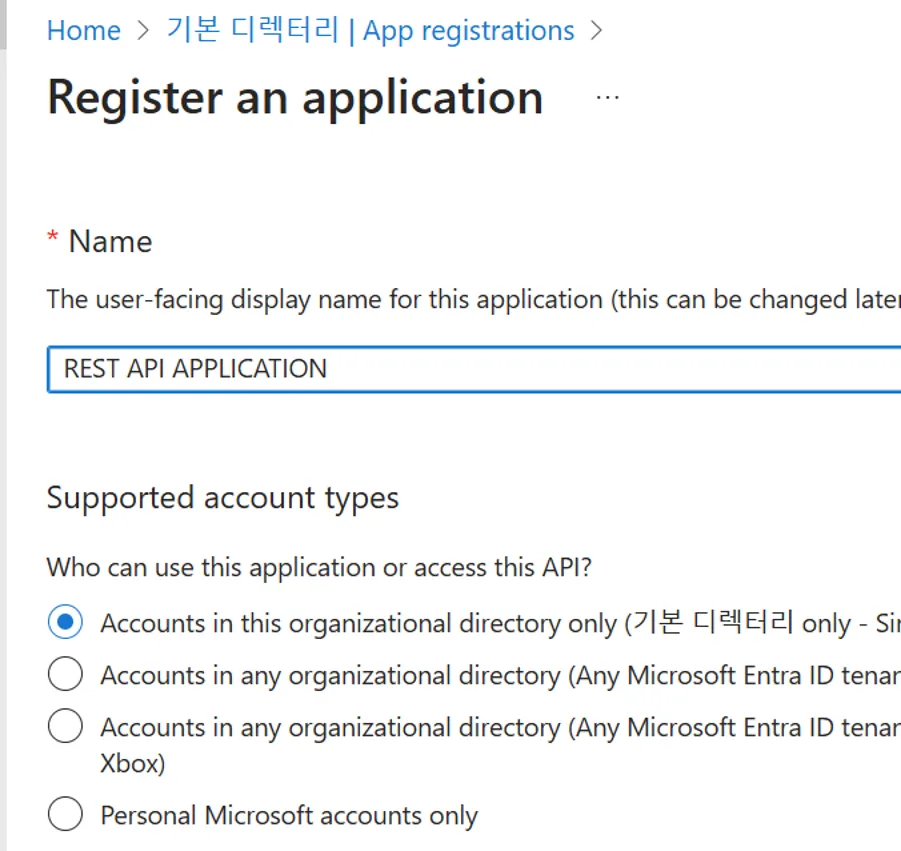

앱이 등록되면 아래와 같이 Application (Client) ID 가 확인됩니다.

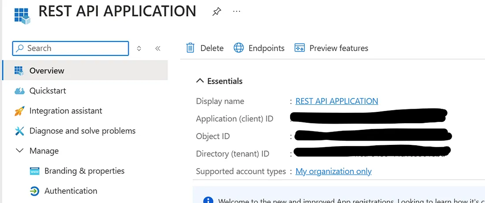

**4. Client의 Secret**

등록한 앱의 Secret Key를 만들어보겠습니다. 좀 전에 등록한 Application의 Blade 메뉴에서 Certificates & Secrets를 누릅니다.

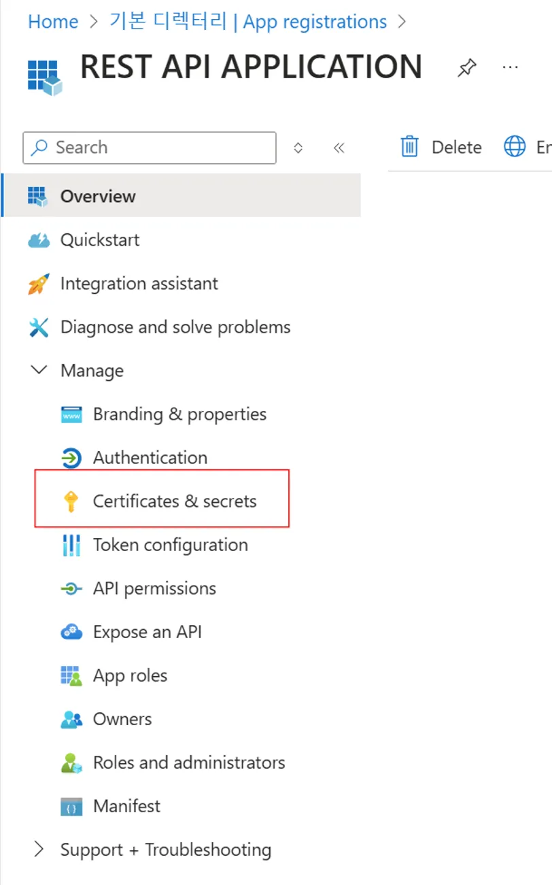

New client secret을 누르면 해당 Application의 새로운 client secret을 만들 수 있습니다.

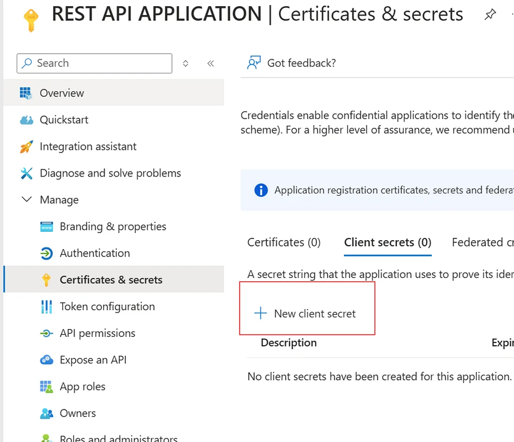

생성을 마치면 아래와 같이 Secret ID와 Value가 확인됩니다.

참고로 해당 Value는 생성 시에만 확인이 가능하고 이후에는 확인이 불가 하니 꼭 메모장 같은 곳에 Paste 해두세요!

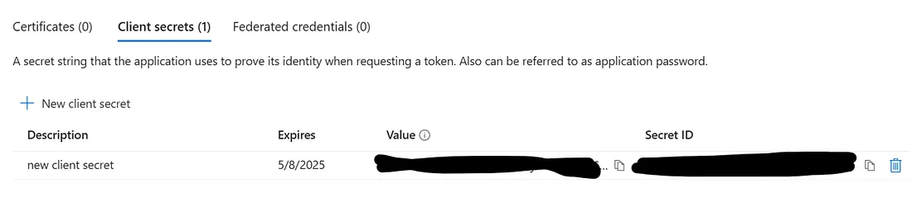

이제 Azure 리소스를 REST API 로 호출하기 위한 4개의 정보를 모두 확인했습니다.

1. *Azure의 구독 (Subscription) ID*
2. *해당 구독의 Tenant ID*
3. *이후에 등록할 Application의 Client ID*
4. *Client 의 Secret*

다음 단계로 좀 전에 만든 Application이 Azure 구독에 대한 정보를 끌고 올 수 있도록 권한을 부여하겠습니다.

Azure Portal에서 구독 (Subscription)을 검색하여 선택한 후 아래와 같이 왼쪽 Blade 메뉴에서 Access Control (IAM)을 선택합니다.

아래 화면에서 Add를 누르고 Role Assignment를 진행합니다.

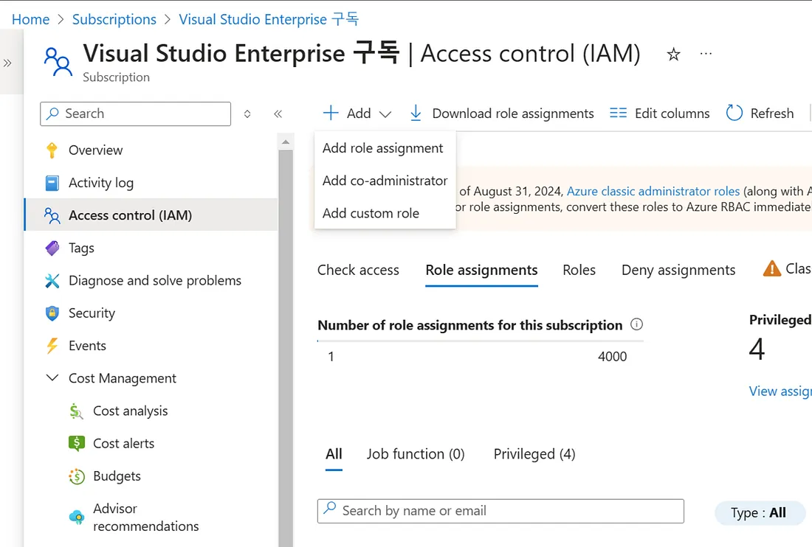

좀 전에 등록한 Application을 우리의 구독의 Contributor로 등록하여 구독에 접근 권한을 제공하겠습니다.

아래의 화면에서 1) Assign access to ‘User, group, or service principal), 2) Select Members를 선택합니다.

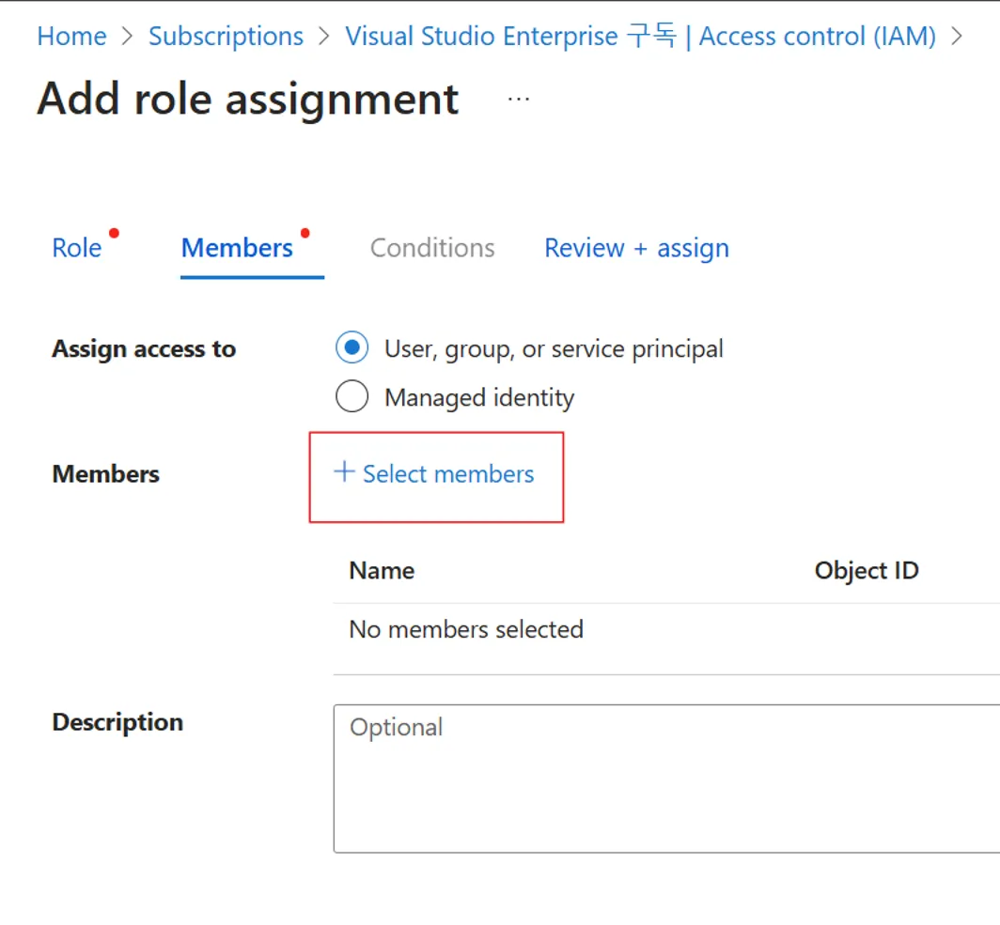

Member에서 좀 전에 생성한 REST API APPLICATION을 검색하여 선택합니다. 리스트에 바로 보이지는 않고 검색해야 확인할 수 있습니다.

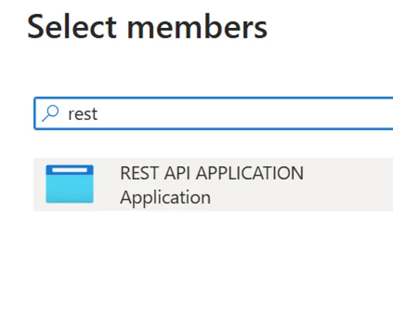

APP을 선택하고 나면 권한으로는 ‘Privileged administrator roles’ 중에서 Contributor (기여자) 를 선택하겠습니다.

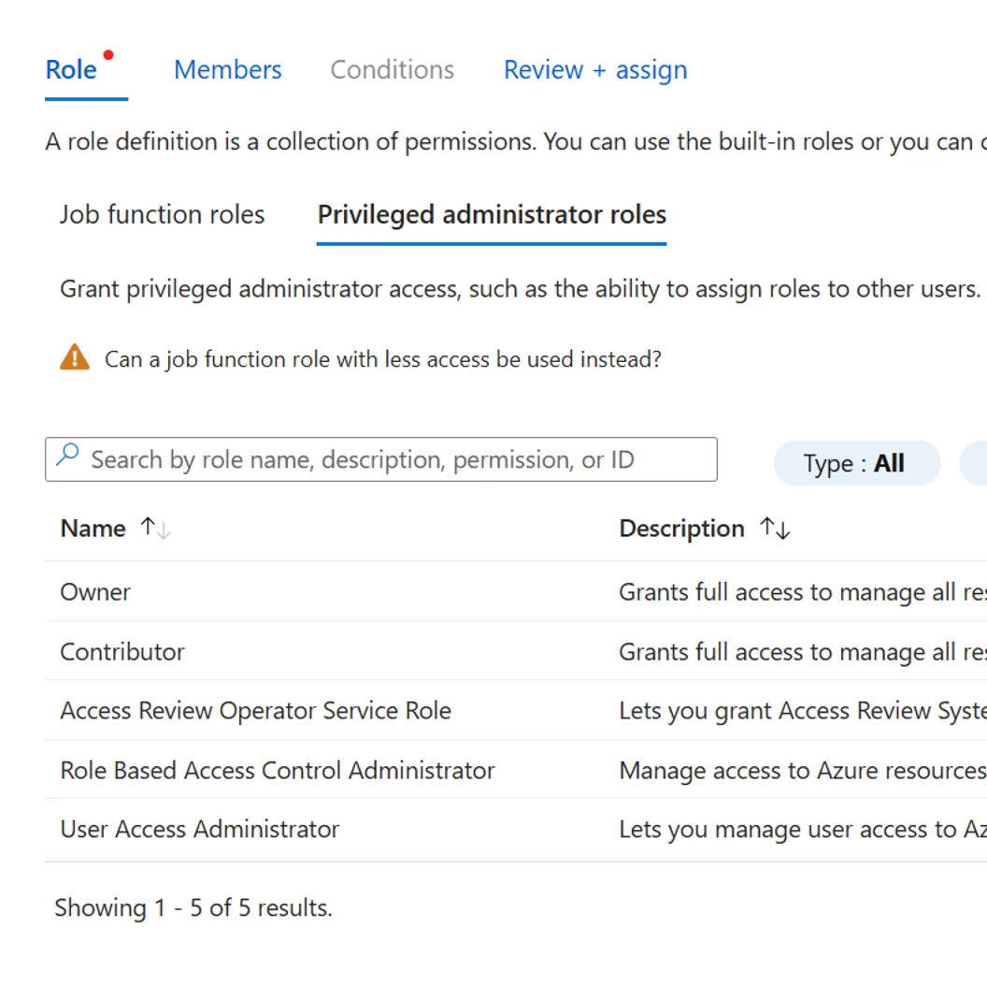

아래와 같이 되면 성공입니다.

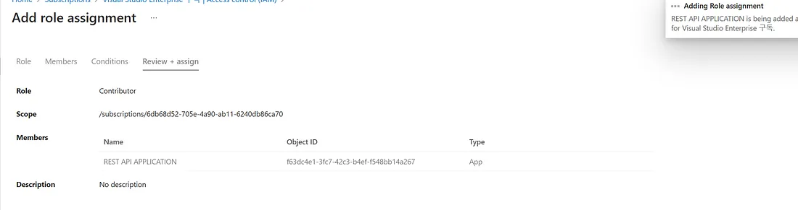

우리의 대상 구독에 Contributor (기여자)로 신규 생성한 application이 등록되어 있는 것을 확인할 수 있습니다.

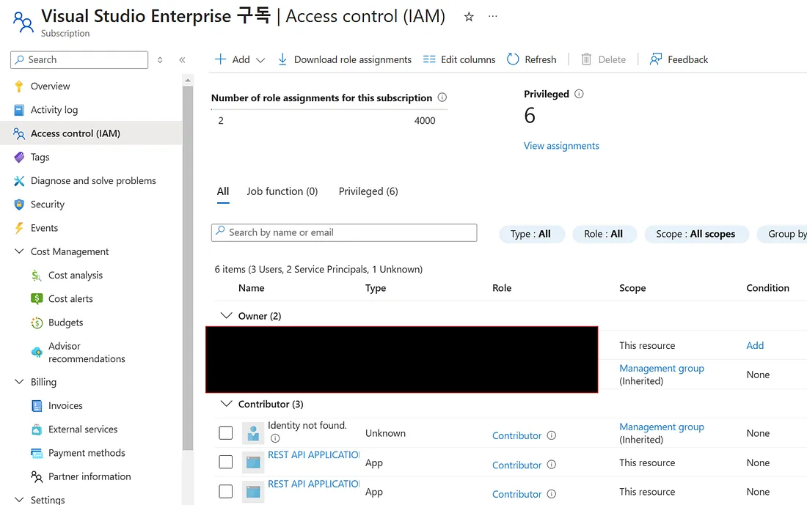

이제 필요한 준비를 마쳤습니다. 다음 단계로 Visual Studio Code (아래 VS Code) 에서 Access Token을 요청해보겠습니다.

VS Code에서 확장자가 .http 혹은 .rest 인 파일을 생성해줍니다.

그리고 우리가 리소스 확인을 위해 준비한 4개의 정보 (Azure의 구독 (Subscription) ID, 해당 구독의 Tenant ID, Application의 Client ID, Client 의 Secret) 를 .env 파일에 변수로 등록해두겠습니다.

.env 파일에는 아래의 4개를 작성하여 저장합니다.

> AZURE_SUBSCRIPTION_ID=”구독 ID”
> 
> 
> *AZURE_TENANT_ID=”Tenant ID”*
> 
> *AZURE_CLIENT_ID”=”Application의 Client ID”*
> 
> *AZURE_CLIENT_SECRET=”Client Secret”*
> 

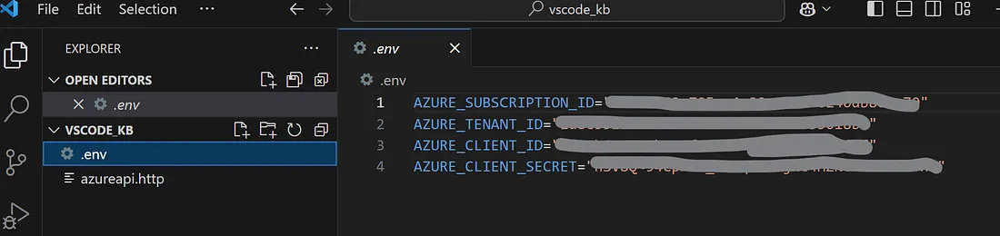

다시 ‘.http’ 혹은 ‘.rest’ 파일로 돌아와 아래와 같이 Access Token을 요청해보겠습니다. ‘.env’ 파일에서 변수에 액세스하기 위한 {{$dotenv %FOO}} 구문을 활용하면 아래와 같이 작성할 수 있습니다.

```
### API를 활용하여 Access Token을 받아보겠습니다
# @name getToken
POST https://login.microsoftonline.com/{{$dotenv %AZURE_TENANT_ID}}/oauth2/token
Content-Type: application/x-www-form-urlencoded

grant_type=client_credentials
&resource=https://management.azure.com/
&client_id={{$dotenv %AZURE_CLIENT_ID}}
&client_secret={{$dotenv %AZURE_CLIENT_SECRET}}
```

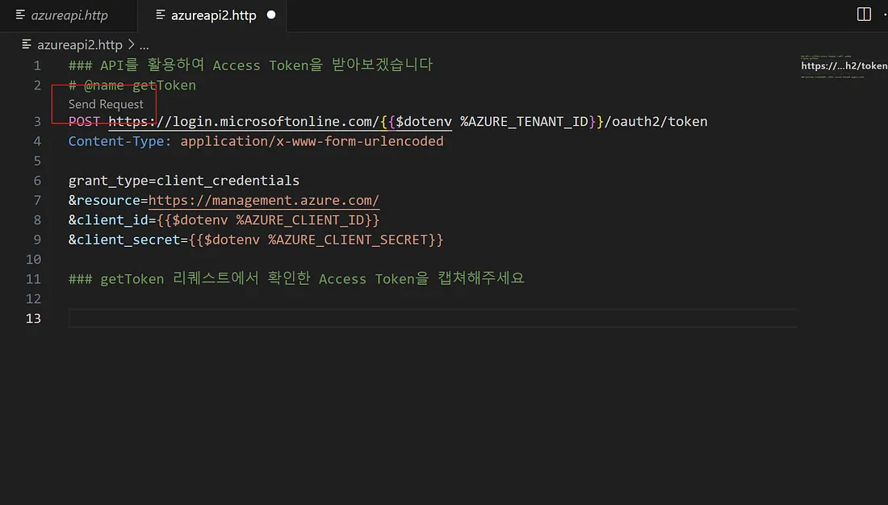

위의 스크린샷 처럼 POST문 위에 ‘Send Request’ 옵션이 보이면 선택합니다. 잘 작동하였다면 Access Token이 포함된 응답이 팝업으로 표시됩니다. 이 Token 정보는 나중에 다른 요청에서 활용할 수 있게끔 authToken을 저장해둡니다.

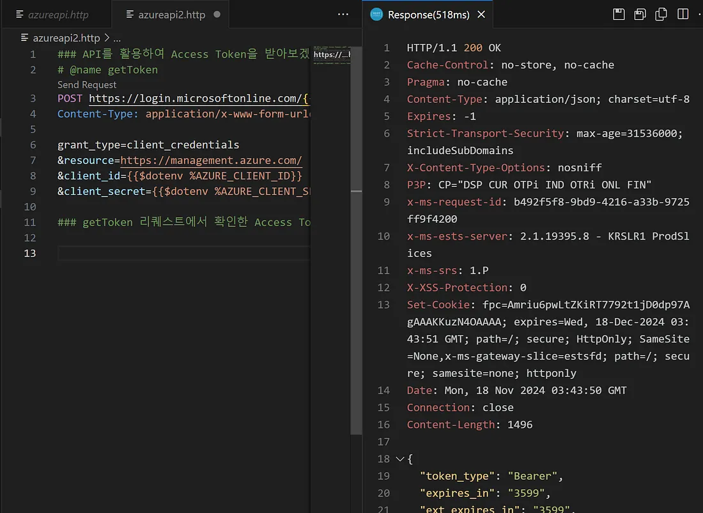

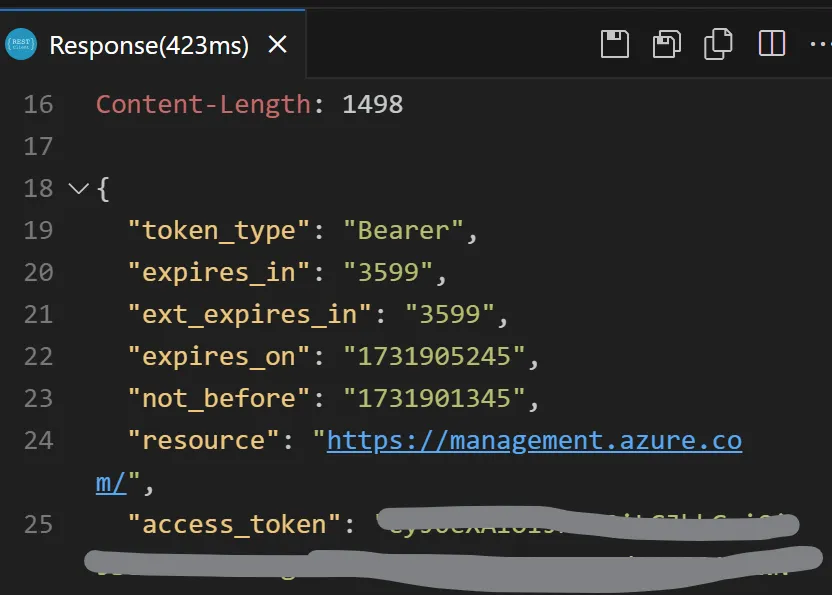

아래와 같이 @authToken = 뒤에 저장해둔 token 정보를 붙여 넣습니다.

```
### getToken 리퀘스트에서 확인한 Access Token을 붙여넣기 합니다.
@authToken =
```

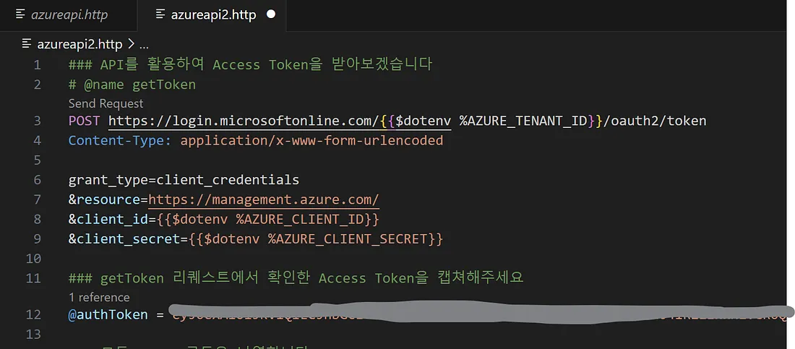

Access Token까지 확인하였으니 이제 Azure 구독에 대하여 API를 활용하여 호출이 가능합니다.

예를 들어 모든 리소스 그룹을 나열하려면 위의 코드 뒤에 다음을 붙여 넣습니다.

참고: [Subscriptions — List — REST API (Azure Subscription) - Microsoft Learn](https://learn.microsoft.com/en-us/rest/api/subscription/subscriptions/list?view=rest-subscription-2021-10-01&tabs=HTTP)

```
### 모든 Azure 구독을 나열합니다
GET https://management.azure.com/subscriptions/{{$dotenv %AZURE_SUBSCRIPTION_ID}}/resources?api-version=2021–04–01
Authorization: Bearer {{authToken}}
```

정상적으로 호출되었다면 아래와 같이 Response로 200 OK가 나오며, 아래에 구독 내의 리소스 정보를 확인할 수 있습니다.

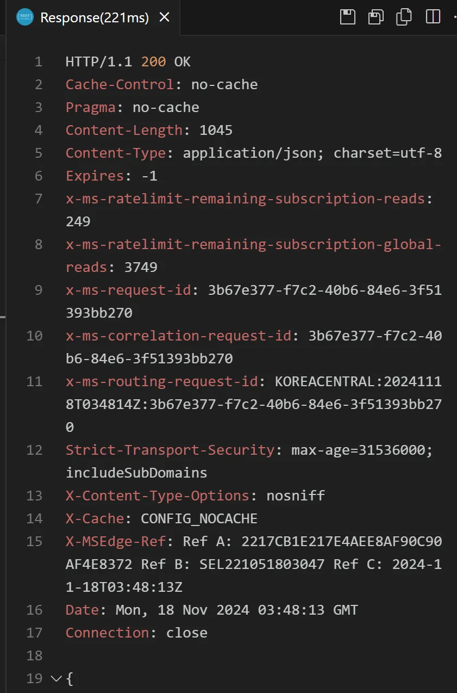

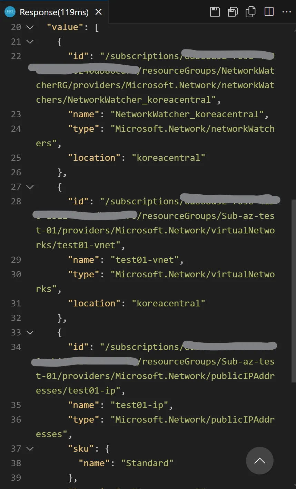

실제 Portal에서 확인한 정보와 비교하면 동일한 것을 알 수 있습니다!

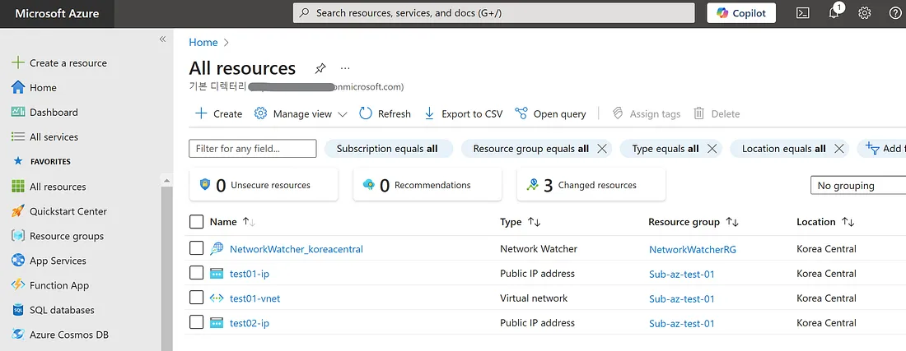

그럼 지금까지, Azure API를 호출을 위한 서비스 주체 (Service Principal) 등록과 토큰 요청 방법을 알아봤습니다!

