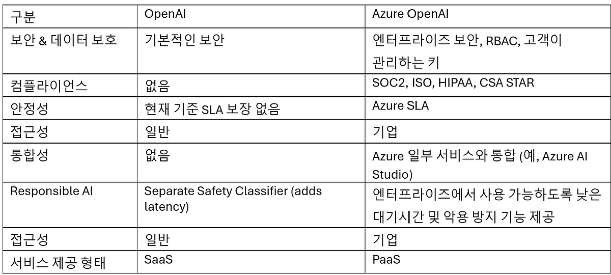
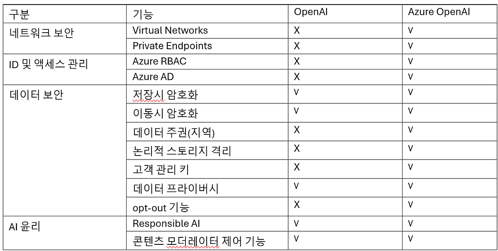
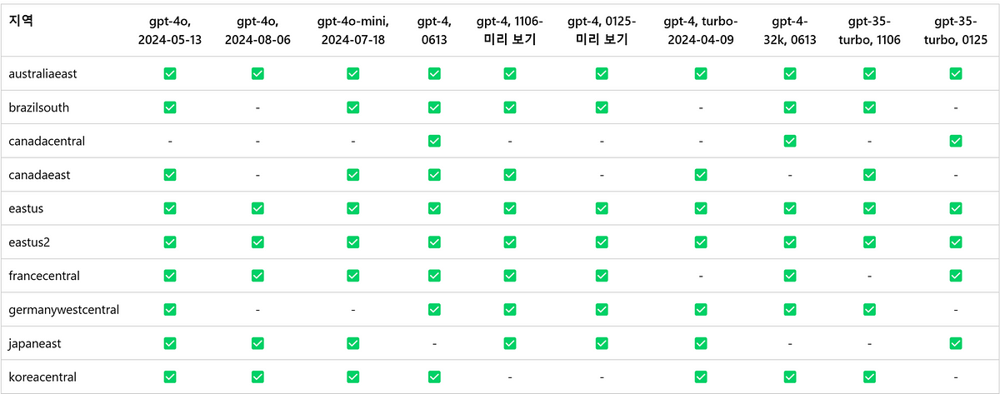
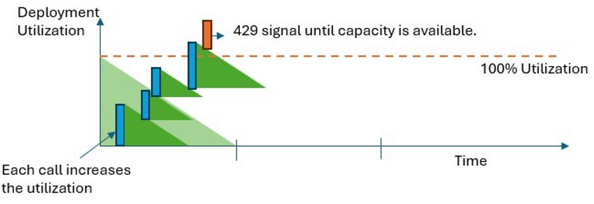
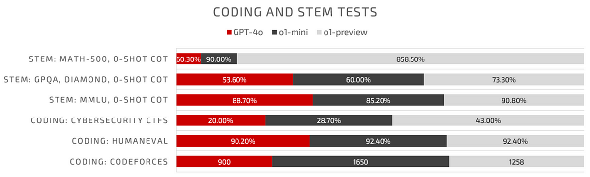
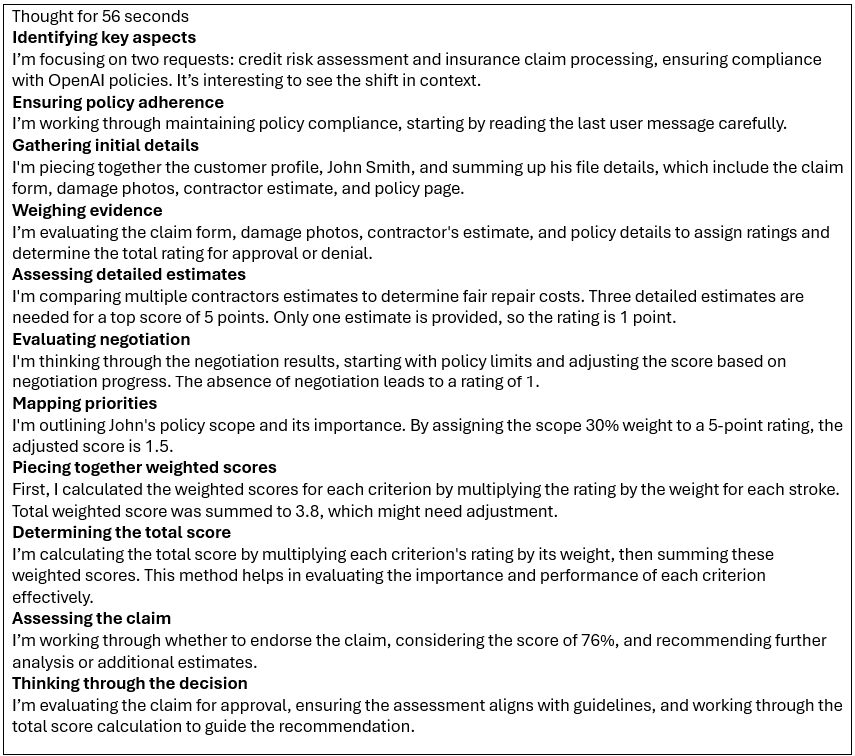

**Q1. OpenAI와 Azure OpenAI는 무엇이 다른가요?**

기사에서 많이 언급되었기 때문에 OpenAI 모델이 Azure라는 클라우드에서 서비스되고 있다는 것을 모르는 사람이 없을 것입니다. 그렇다면 OpenAI와 Azure OpenAI는 무엇이 다른 것일까요? 다음 표를 통해 자세히 알아보겠습니다.



[표 1–1] OpenAI와 Azure OpenAI 비교

[표 1–1]에서도 확인했듯이 가장 큰 차이는 보안성입니다. OpenAI는 솔루션(AI 모델)을 제공하는 회사이기 때문에 이 서비스를 사용하기 위한 인프라의 보안성은 고객이 책임져야 합니다. 하지만 Azure를 사용하면 보안이 강화된 클라우드 환경에서 OpenAI 솔루션을 사용할 수 있습니다.

---

**Q2. 구체적으로 보안에 어떤 차이가 있나요?**

다음과 같이 네트워크, 액세스, 데이터 측면에서의 보안성에 대한 차이가 있습니다.



[표 1–2] 보안 측면의 OpenAI와 Azure OpenAI 비교

또한 Azure OpenAI에서의 데이터는 다음과 같은 특징이 있습니다.

> - 다른 고객은 이용할 수 없습니다. - Azure OpenAI 모델을 개선하는 데 사용되지 않습니다. - 마이크로소프트 또는 제3자의 서비스를 개선하는 데 사용되지 않습니다. - Azure OpenAI 모델을 개선하는 데 사용되지 않습니다. - Fine-Tuned된 Azure OpenAI 모델은 해당 고객만 사용할 수 있습니다.
> 

---

**Q3. Azure OpenAI도 국내에서 서비스되고 있나요?**

현재 Azure OpenAI는 국내(Korea Central)에서 서비스되고 있습니다.



출처: [Azure OpenAI Service provisioned throughput — Azure AI services - Microsoft Learn](https://learn.microsoft.com/en-us/azure/ai-services/openai/concepts/provisioned-throughput)

하지만 우리가 일반적으로 사용하는 Pay-As-You-Go 방식이 아닌 PTU 방식으로 서비스되고 있습니다.

---

**Q4. 그럼 PTU는 무엇인가요?**

PTU(Provisioned Throughput Units, 프로비전된 처리량 단위)는 사전에 모델 처리 용량을 예약하여 사용하는 방식입니다.

일반적으로 OpenAI를 사용하면 내 데이터가 정확히 어느 지역으로 전달되어 어디서 답변이 생성되어 돌아오는지 확인하기 어렵습니다. 따라서 국내 데이터의 국외 반출 우려가 있는 일부 규제 업종에서는 OpenAI를 사용하기 어렵습니다. 따라서 이러한 규제 업종(예, 금융, 교육, 방산 등)에서는 PTU가 유일한 대안으로 보여집니다.

---

**Q5. PTU 사용중, 예약된 처리 용량을 초과하면(사용자 요청이 폭증하면) 어떤 현상이 발생하나요?**

예약된 처리 용량이 초과되면 API는 429 HTTP오류를 반환합니다. 즉, 서비스는 사용률이 100% 아래로 떨어질 때까지 계속해서 429 HTTP 오류가 반환되므로retry-after-ms 및 retry-after 헤더를 사용합니다. retry-after-ms 및 retry-after 헤더는 다음 호출이 수락되기 전까지 기다려야 하는 시간을 알려줍니다.

다음 그림과 같이 PTU 사용이 100%를 조금 넘는다고 하더라도 잠시동안 서비스는 허용될 수 있지만 시간이 지나면 트래픽 활용도가 100%로 제한됩니다. 따라서 100%를 초과한다면 PTU를 늘려야 합니다.



출처: [Azure OpenAI Service provisioned throughput — Azure AI services - Microsoft Learn](https://learn.microsoft.com/en-us/azure/ai-services/openai/concepts/provisioned-throughput)

---

**Q6. 개발 측면에서 Azure OpenAI API는OpenAI API와 어떤 차이가 있나요?**

먼저 파이썬에서 OpenAI API를 이용하는 방법은 다음과 같습니다. OpenAI API 키를 획득한 후 모델만 지정하면 됩니다.

```
from openai import OpenAI

client = OpenAI(api_key="OPENAI_API_KEY ")
completion = client.chat.completions.create(
    model="gpt-4o",
    messages=[{"role": "user", "content": "OpenAI API를 사용하기위한 파이썬 코드는?"}],
    temperature=0.7
)

print(completion.model_dump_json())
```

Azure OpenAI API를 이용하기 위해서는 key 뿐만 아니라 endpoint에 대한 정보도 필요합니다. 하지만OpenAI API 사용 방법과 크게 다르지 않죠? 동일한 GPT 모델을 사용하기 때문에 사용 방법도 유사합니다.

```
from openai import AzureOpenAI

client = AzureOpenAI(
    api_key=os.getenv("AZURE_OPENAI_API_KEY"),
    api_version="2024-07-01-preview",
    azure_endpoint=os.getenv("AZURE_OPENAI_ENDPOINT")
)
completion = client.chat.completions.create(
    model="deployment-name",
    messages=[
        {
            "role": "user",
            "content": "Azure OpenAI API를 사용하기위한 파이썬 코드는?",
        },
    ],
)
print(completion.to_json())
```

---

**Q7. o1 모델도 한국에서 사용 가능한가요?**

o1이나 o1-mini 모델은 현재 기준 preview 상태입니다. 따라서 Azure Portal에서 사용 신청을 해야 하며 아직 한국에서는 서비스하고 있지 않습니다.

---

**Q8. o1모델은 이전 모델들과 비교했을 때 어떤 점이 다른가요?**

o1 모델은 추론에 특화된 모델입니다. 뿐만 아니라 다음과 같이 코딩에도 특화되어 있습니다.



출처: [Microsoft Azure adds OpenAI’s o1-preview and o1-mini models — SCHNEIDER IT MANAGEMENT](https://www.schneider.im/microsoft-azure-adds-openais-o1-preview-and-o1-mini-models/)

그럼 추론에 대해 좀 더 이야기해볼까요? 일반적으로 AI의 가장 큰 문제는 AI 자체가 블랙박스라는 것입니다. AI에 던져준 답변을 인간은 이해할 수 없다고 해서 블랙박스라는 용어를 사용하는데요. 이것 때문에 AI를 이용한 서비스를 B2C 용도로 사용하는데 제약이 있었던 것입니다.

이러한 문제를 극복한 것이 o1입니다. o1은 AI가 자신의 답변에 대한 이유(reasoning)을 제시합니다. 따라서 우리 인간이 AI의 답변이 신뢰할 만한지를 한 번 더 검증해볼 수 있는 장점이 있습니다. 예를 들어, o1은 다음과 같이 추론 과정을 보여줍니다.



o1이 최신 모델이라고 하여 모든 시나리오에 적합한 것은 아닙니다. 추론 시간 때문에 응답 시간이 느리며 비싸기 때문에 시나리에 맞는 모델을 선택해서 사용하는 것이 중요합니다.

그럼 오늘도 즐거운 코딩 하세요.