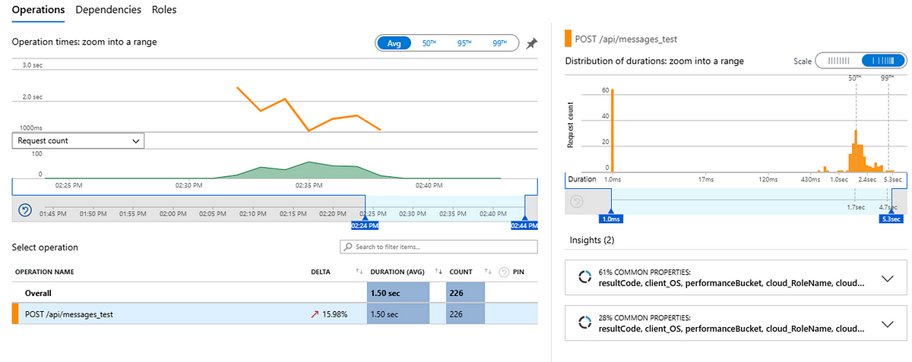
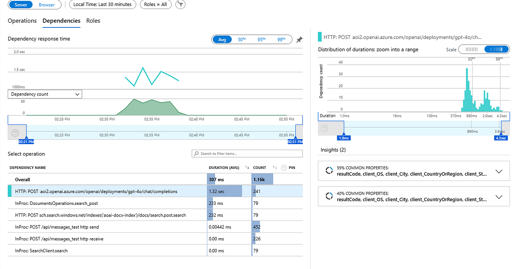
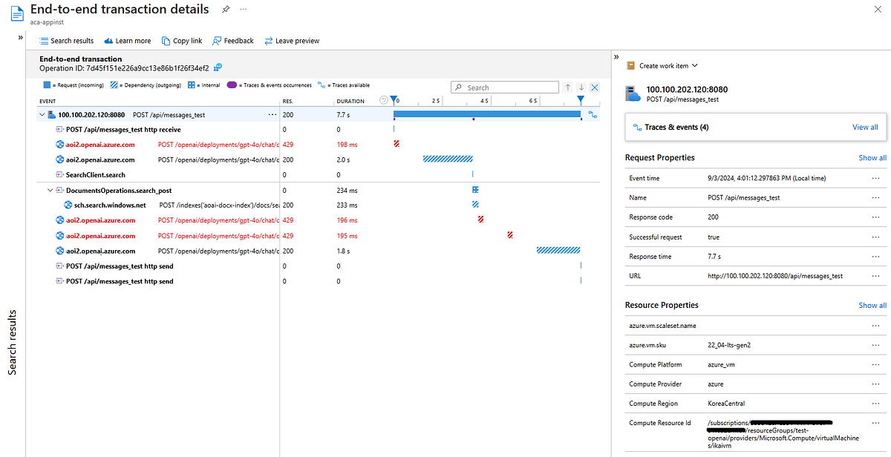

이전 블로그에서는 생성형 AI 앱 성능 관리의 중요성과 부하 테스트 및 성능 확인을 통해 성능을 관리하는 방법에 대해 다루었습니다. 부하 테스트를 통해 전반적인 앱 성능과 특정 부하에서 성능 저하 현상을 확인할 수 있지만, 구체적인 원인을 파악하기 어렵다고 언급했습니다. 앱 내부의 성능 저하 원인을 분석하고 대응하기 위해서는 End-to-end 트레이스를 지원하는 APM (Application Performance Monitoring) 솔루션이 필요하다고 설명했습니다.

### Azure Application Insight

이번에는 부하 테스트와 함께 사용할 때 효과적인 Azure의 대표적인 APM 솔루션인 Azure Application Insight를 이용하여 성능 저하의 원인 분석 방법에 대해 알아보겠습니다. 간략하게 Azure Application Insights를 소개하면, Microsoft Azure에서 기본 제공되는 관리형 APM 서비스로, 개발자가 애플리케이션의 로그, 메트릭, 요청, 응답 시간 등을 수집하고 다양한 분석 도구로 활용하여 문제를 파악하고 해결할 수 있게 합니다. 이를 통해 애플리케이션의 가용성, 성능 및 사용자 경험을 향상시킬 수 있습니다.


Application Insight의 Application Map 메뉴를 통해 시각화된 RAG 기반 생성형 AI앱의 응답 및 Dependency 호출 현황

이번에 소개할 End-to-end 트레이스 이외에도 Application Insights의 아래와 같은 다양한 기능은 제공하니 참고하시기 바랍니다.

- **자동화된 성능 모니터링**: 애플리케이션의 성능 및 사용성을 실시간으로 모니터링
- **로그 및 메트릭 수집**: 애플리케이션의 로그, 메트릭, 요청 및 응답 시간 등을 수집
- **문제 진단**: 성능 문제를 신속하게 파악하고 진단
- **사용자 동작 분석**: 사용자 상호작용 및 행동을 분석하여 사용자 경험을 개선
- **다양한 플랫폼 지원**: 다양한 언어 및 플랫폼을 지원하여 광범위한 애플리케이션 모니터링
- **알림 및 경고**: 특정 조건이 충족되면 알림을 보내는 경고 시스템을 제공
- **통합 대시보드**: 직관적인 대시보드를 통해 모든 메트릭과 로그를 한 곳에서 관리
- **확장성 및 통합**: Azure의 다른 서비스들과 통합하여 확장성과 기능성을 향상

과거에는 자체 수집 기술을 통해 .NET 애플리케이션 외의 다양한 애플리케이션 플랫폼에서 모니터링 정보를 수집하는 데 제약이 있었습니다. 그러나 이제는 [OpenTelemetry](https://opentelemetry.io/) 기반 데이터 수집을 지원함으로써, Python 및 JavaScript(Node.js)를 포함한 모든 애플리케이션 플랫폼의 모니터링 로그 수집과 분석이 가능해졌습니다.

참고로, Application Insight를 활용하여 앱의 성능을 모니터링하기 위해서는, 다음과 같은 코드(파이썬 예시)를 애플리케이션에 SDK와 함께 연동해 주시기 바랍니다. 보다 상세한 사항은 [링크](https://learn.microsoft.com/ko-kr/azure/azure-monitor/app/opentelemetry-enable?tabs=python)를 참고하시기 바랍니다.

```
# Import the `configure_azure_monitor()` function from the
# `azure.monitor.opentelemetry` package.
from azure.monitor.opentelemetry import configure_azure_monitor

# Import the tracing api from the `opentelemetry` package.
from opentelemetry import trace

# Configure OpenTelemetry to use Azure Monitor with the
# APPLICATIONINSIGHTS_CONNECTION_STRING environment variable.
configure_azure_monitor()
```

파이선 앱의 경우 일반적으로 Flask, FastAPI, OpenAi 등의 다양한 파이선 라이브러리를 사용하기 때문에 Java 및 .NET 앱과 달리 해당하는 파이선 라이브러리의 대응하는 [OpenTelemetry 수집 라이브러리](https://pypi.org/search/?q=opentelemetry-instrumentation-)와 연동 코드가 추가적으로 필요하니 참고하시기 바랍니다.

### 앱 성능 저하성능 확인

Application Insight를 준비하면 수집된 모니터링 데이터를 통해 애플리케이션의 현황과 문제점을 확인할 수 있습니다. 예를 들어, 애플리케이션 성능 저하를 파악하려면 Application Insight의 좌측 성능(Performance) 메뉴에서 전반적인 애플리케이션 성능(예: 응답 시간)을 확인할 수 있습니다. 이뿐만 아니라, 해당 애플리케이션이 의존하는 각각의 서비스 호출(예: AI Search 및 OpenAI)의 평균 응답 시간도 추가로 확인할 수 있습니다.



앱의 응답 성능 화면



의존 서비스의 응답 성능 화면

평균 응답시간 외에도 성능을 백분위수로 분석할 수 있으며, 응답 속도가 느린 특이 샘플에 대해 세부 성능을 심층적으로 분석할 수 있습니다. 특정 성능 이슈가 있는 샘플을 선택하면 애플리케이션의 End-to-end 분산 트레이스를 확인할 수 있어 보다 심층적인 분석이 가능합니다.

평균 응답 속도(1.5초)보다 느린 샘플(7.7초)에 대해 분석한 결과, 해당 호출에서 3번의 Azure OpenAI 엔드포인트 429(Throttling) 오류가 발생한 것이 확인되었습니다. 높은 부하 요청 시 간헐적으로 Throttling 현상이 발생하였으며, OpenAI SDK 내부에서 다수의 호출 재시도로 인해 전반적인 응답 지연이 발생하는 것을 확인할 수 있었습니다. 이러한 호출 재시도는 OpenAI SDK 내부에서 발생하여 앱에서는 쉽게 확인하기 어려웠던 부분입니다.



End-to-end 서비스 호출 트레이스 현황

앱에서는 429 오류가 간헐적으로 발생한 반면, Azure OpenAI 백앤드 모니터에서는 다수의 재시도로 인해 많은 429 오류가 발생하는 원인을 확인할 수 있었습니다. 이로 인해 응답 시간이 느려지는 현상을 정확히 판단할 수 있었습니다. 이는 앱의 CPU 또는 메모리 부족 문제보다는 Azure OpenAI의 TPM(Token-per-Minute) 한계로 인한 것으로 나타났습니다. 따라서 앱의 인스턴스 수를 늘리는 것보다는 해당 부하에 맞게 Azure OpenAI의 TPM을 늘리거나 불필요한 토큰 사용을 줄이는 방법으로 성능을 개선할 수 있습니다.

### 맺으며…

이번에는 Azure의 대표적인 APM 솔루션인 Azure Application Insight를 이용하여 성능 저하의 원인 분석 방법을 소개했습니다. 심층적인 성능 분석을 통해 앱 전반의 응답 성능 저하의 원인을 찾고 해결할 수 있을 뿐만 아니라, 앱 현황 모니터링 및 이슈에 대한 분석이 가능합니다. 타 성능 모니터링 솔루션과 비교하여 사용 및 운영 관리가 쉽고 비용이 저렴하기 때문에 생성형 AI 서비스를 개발하시는 개발자 및 운영자분들에게 사용을 적극 추천드립니다.