이 포스팅은 [Adam Saxton](https://blog.fabric.microsoft.com/en-us/blog/author/Adam%20Saxton)님의 [Fabric November 2024 Feature Summary](https://blog.fabric.microsoft.com/en-us/blog/fabric-november-2024-feature-summary) 글을 한글로 번역한 글입니다.

---

1. Unified Data platform Fabric 기능 (1/4): 인증, Copilot과 AI, 리포팅
2. [Unified Data platform Fabric 기능 (2/4): 모델링, 개발자+API, 시각화, 플랫폼](/azurekorea/udp-fabric-function2)
3. [Unified Data platform Fabric 기능 (3/4): OneLake, 미러링, 데이터베이스, 데이터 웨어하우스, 데이터 엔지니어링, 데이터 사이언스](/azurekorea/udp-fabric-function3)
4. [Unified Data platform Fabric 기능 (4/4): 실시간 인텔리전스, 데이터 팩토리](/azurekorea/udp-fabric-function4)

---

**Microsoft Fabric 2024년 11월 업데이트에 오신 것을 환영합니다!**

이번 달에 여러분의 경험과 생산성을 향상시키기 위해 고안된 여러 가지 새로운 기능과 개선 사항을 소개하게 되어 기쁩니다. Power BI 모바일 앱의 Copilot 도입부터 새로운 패브릭 데이터베이스(Fabric Databases)에 이르기까지 모두를 위한 것들이 있습니다. 데이터 분석을 간소화하고, 보고 기능을 개선하거나, 혁신적인 최신 정보를 얻고자 하는 경우라면 이번 업데이트를 통해 모든 것을 해결할 수 있습니다.

더 자세한 내용은 Arun의 블로그 게시물 [Accelerate app innovation with an AI-powered data platform - Microsoft Fabric 블로그](https://www.microsoft.com/en-us/microsoft-fabric/blog/2024/11/19/accelerate-app-innovation-with-an-ai-powered-data-platform/)를 참고해 주세요.

---

**Fabric에서 SQL 데이터베이스를 가장 먼저 사용하는 사람이 되세요.**

Fabric의 SQL 데이터베이스에 대한 이 시리즈에서는 Fabric이 트랜잭션과 분석 워크로드를 모두 결합하여 진정한 통합 데이터 플랫폼을 만드는 방법을 배웁니다. 또한 개발자가 클라우드 인증과 암호화가 기본적으로 보호되는 안정적이고 확장성이 뛰어난 애플리케이션을 구축하는 방법도 배우게 됩니다. 12월 3일부터 데이터베이스 전문가와 함께 하는 6개의 세션에 참여하여 시작하는 것이 얼마나 쉬운지 확인하십시오. 세션은 실시간 및 온디맨드로 제공됩니다. 세션을 보고 [시리즈에 등록하세요](https://aka.ms/SQLonFabric/LearnTogether?ocid=fabricdb_fabmonthlyroundup_blog_azdata).

**목차**

- 인증 (Certification)
- Copilot과 AI (Copilot and AI)
- 리포팅 (Reporting)

### **인증 (**Certification)

**Microsoft Fabric 인증을 무료로 받으세요!**

Microsoft Certified: Fabric Analytics Engineer Associate 인증을 획득하여 경력을 빠르게 쌓으세요. 한정된 기간 동안 자격을 갖춘 Fabric Community 회원에게 5,000개의 무료 DP-600 시험 바우처를 제공할 예정입니다. 연말까지 시험을 완료하고 인증된 전문가 대열에 합류하세요. [인증](https://aka.ms/iamready/dp600?ocid=iamready_fabric_blog_azdata)을 받을 수 있는 이 기회를 놓치지 마시기 바랍니다.

**데이터 엔지니어를 위한 최신 패브릭 인증 살펴보기**

데이터 엔지니어를 위한 새로운 인증을 발표하게 되어 기쁩니다. 새로운 [Microsoft Certified: Fabric Data Engineer Associate 인증](https://learn.microsoft.com/credentials/certifications/fabric-data-engineer-associate/?wt.mc_id=fabric_blog_azdata)은 Fabric에서 데이터 수집, 변환, 관리, 모니터링 및 성능 최적화에 대한 기술을 입증하는 데 도움이 됩니다. 이 인증을 획득하려면 [Exam DP-700: Implementing Data Engineering Solutions Using Microsoft Fabric](https://learn.microsoft.com/credentials/certifications/exams/dp-700/?wt.mc_id=fabric_blog_azdata) (현재 베타 버전)에 합격하세요.

---

### **Copilot과 AI** (Copilot and AI)

**Power BI 모바일 앱 Copilot (Preview)**

**Power BI 모바일 앱 Copilot 미리 보기(Preview)** 발표하게 되어 기쁩니다! 이 새로운 기능은 AI의 힘을 손끝으로 직접 가져와 이동 중에도 모바일 경험을 향상시켜 데이터를 빠르고 간단하게 살펴볼 수 있는 방법을 제공합니다.

Power BI 모바일 앱의 Copilot을 사용하면 더 이상 데이터를 직접 분석할 필요가 없습니다. Copilot은 언제 어디서나 정보에 입각한 결정을 내릴 수 있도록 보고서 요약과 통찰력을 제공합니다. 영업 관리자가 탭 한 번으로 최신 판매 보고서의 핵심 요약을 손쉽게 가져오거나 유지 보수 기술자가 공장 현장에서 실시간 기계 성능 통찰력을 얻는 것을 상상해 보십시오.

모바일 앱에서 Copilot 사용을 시작하려면 보고서 헤더에 있는 Copilot 버튼 ([Power BI의 Copilot 요구 사항](https://learn.microsoft.com/power-bi/create-reports/copilot-introduction#copilot-requirements))를 탭하고 요약을 가져올지 또는 인사이트를 살펴볼지 선택하기만 하면 됩니다. Copilot은 귀하의 요청에 따라 응답을 제공합니다. 그런 다음 응답을 복사하여 공유하거나 하단의 제안 중에서 선택하여 Copilot과 계속 상호 작용할 수 있습니다. 이러한 제안은 응답을 조정하거나 새 요청을 만드는 데 도움이 될 수 있습니다.

**Power BI 모바일 앱 Copilot**에 대한 자세한 내용은 ****전체 [블로그 게시물](https://powerbi.microsoft.com/blog/introducing-copilot-in-power-bi-mobile-apps-preview/)을 확인하세요.

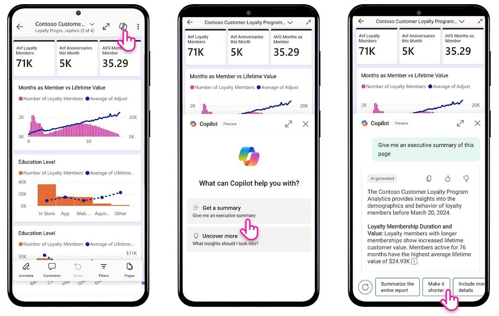

**구독의 Copilot 요약 (Preview)**

전자 메일의 Power BI 보고서 이미지에서 인사이트를 추출하거나 Power BI 보고서의 요약을 빠르게 소화해야 하나요? Power BI 보고서에 대한 Copilot 요약을 구독하세요. 이 기능은 표준 구독과 [Copilot 가능 용량(Capacity)](https://learn.microsoft.com/power-bi/create-reports/copilot-enable-power-bi#use-copilot-for-power-bi-in-the-service)의 보고서에서 사용할 수 있습니다.

[Power BI와 Fabric에서 Copilot을 사용하는 방법에 대해 자세히 알아보세요](https://learn.microsoft.com/power-bi/create-reports/copilot-introduction#before-you-start-using-copilot).

구독하는 Power BI 보고서에 대한 copilot 요약을 위해 다음과 같이 설정하세요.

1. 관심 있는 Power BI 보고서의 리본에서 ‘구독’ 옵션을 선택합니다.

    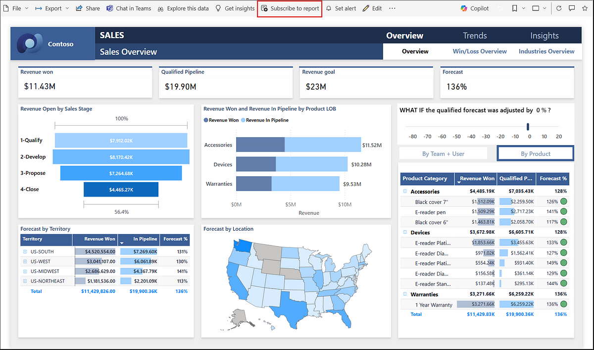

2. ‘표준 구독’을 선택합니다.

    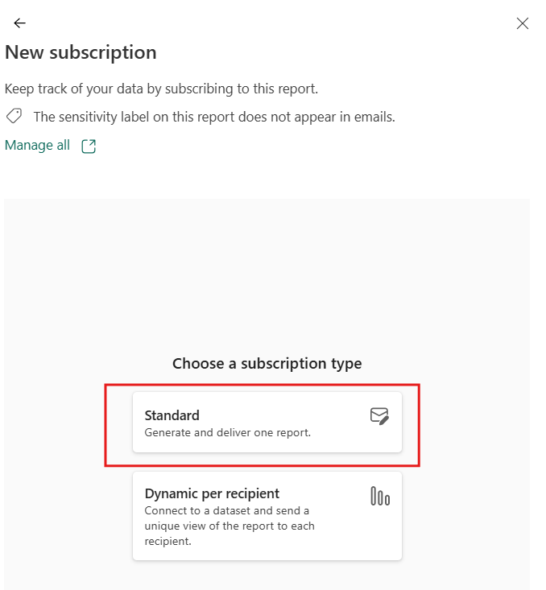

3. 보고서를 구독 합니다.

    [보고서 구독 만들기에 대해 자세히 알아보세요.](https://learn.microsoft.com/power-bi/collaborate-share/end-user-subscribe?tabs=creator)

    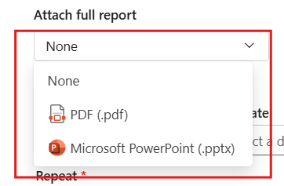

4. 구독에서 제공하는 이메일에 Copilot 요약을 추가합니다. 자격이 있는 경우 구독은 기본적으로 Copilot 요약을 받게 됩니다.

    [구독에 대한 Copilot 요약 설정에 대해 자세히 알아보세요](https://learn.microsoft.com/power-bi/create-reports/copilot-summaries-in-subscriptions).

    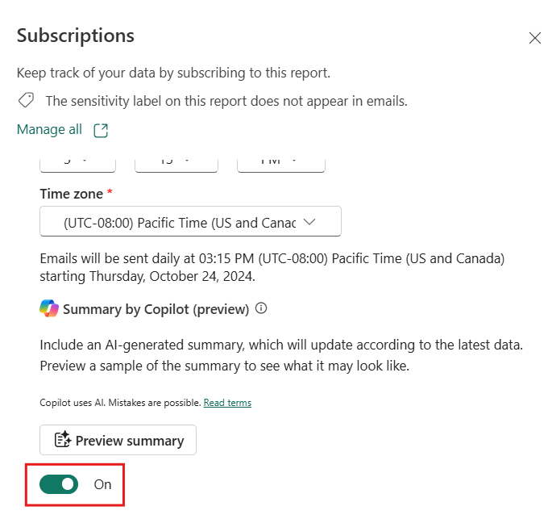

5. ‘요약 미리보기’를 통해 요약이 어떻게 생겼는지 샘플을 볼 수 있습니다.

    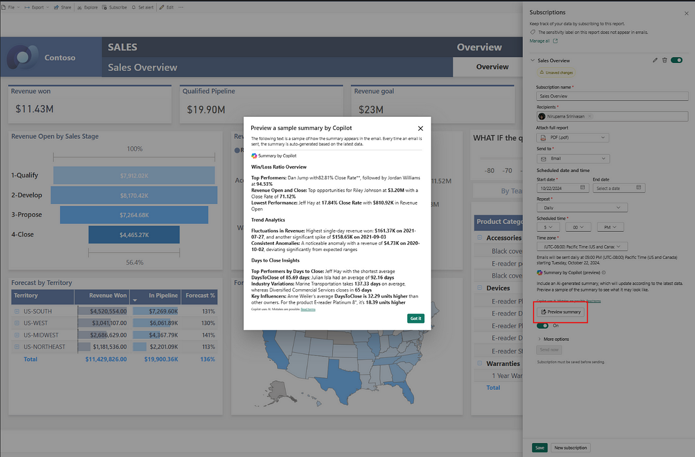

6. 구독을 저장한 후 '지금 보내기'를 선택하여 구독을 테스트합니다.

**참고:** '지금 보내기'는 Copilot 요약이 포함된 이메일을 모든 수신자에게 전달합니다.

이메일 샘플:

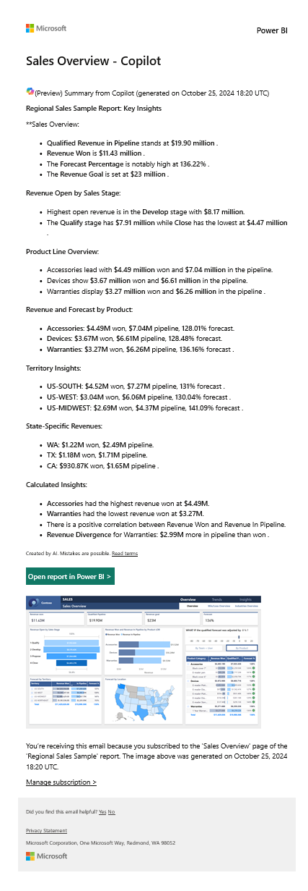

[설명서에서 Copilot 구독](https://learn.microsoft.com/power-bi/create-reports/copilot-summaries-in-subscriptions) [요약에 대해 자세히 알아보세요.](https://learn.microsoft.com/power-bi/create-reports/copilot-summaries-in-subscriptions)

이 기능은 향후 몇 주에 걸쳐 점진적으로 출시될 예정이며 Gov 클라우드에서는 사용할 수 없습니다.

**Copilot 및 AI 데모**

---

### 리포팅 (Reporting)

**Azure Map 시각적 개체의 경로 계층(Path Layer)**

이번 달에는 지리공간 분석을 다음 단계인 경로 계층(Path Layer)으로 끌어올리는 Azure Map 시각적 개체에 대한 새로운 기능을 소개합니다. 경로 계층은 사용자에게 여러 지점 간의 지리적 연결을 시각화 할 수 있는 기능을 제공합니다. 물류 관리나 네트워크 트래픽 분석, 전 세계적 자산을 배송 추적 할 때 , 이 기능을 사용하면 여러 지리적 지점 간의 연결을 직관적이고 대화형 방식으로 시각화 할 수 있습니다.

경로 계층은 다음과 같은 몇 가지 주요 시나리오에 이상적입니다.

**네트워크 분석**: 통신과 같은 산업의 경우 경로 계층을 사용하여 복잡한 네트워크 연결을 매핑할 수 있습니다. 비효율성 식별과, 데이터 흐름 모니터링, 중요한 인프라를 강화하는 데 도움이 됩니다.

**비행 경로 분석**: 항공사는 경로 계층을 활용하여 비행 경로를 시각화하고 분석하여 항공 교통 관리를 개선할 수 있습니다. 새로운 노선 기회를 식별하고 기존 노선을 최적화하여 전반적인 승객 경험을 향상시키는 데 도움이 됩니다.

시작하려면 도시 이름 또는 위도 및 경도와 같은 지오코딩 된 위치 필드(geocoded location field)를 사용하여 각 포인트의 위치를 추가합니다. 그런 다음 경로 ID 필드 웰(field well)에 필드를 추가하여 경로를 구분하고 포인트 순서 필드 웰을 통해 연결 순서를 표시합니다.

예를 들어 각 지점에 대한 위치의 위도와 경도와 함께 두 선박의 경로를 보여주는 지도, 각 선박에 대한 고유 식별자가 있는 경로 필드, 각 위치에 대한 타임스탬프를 생성하여 지점이 올바른 순서로 연결되어 있는지 확인할 수 있습니다.

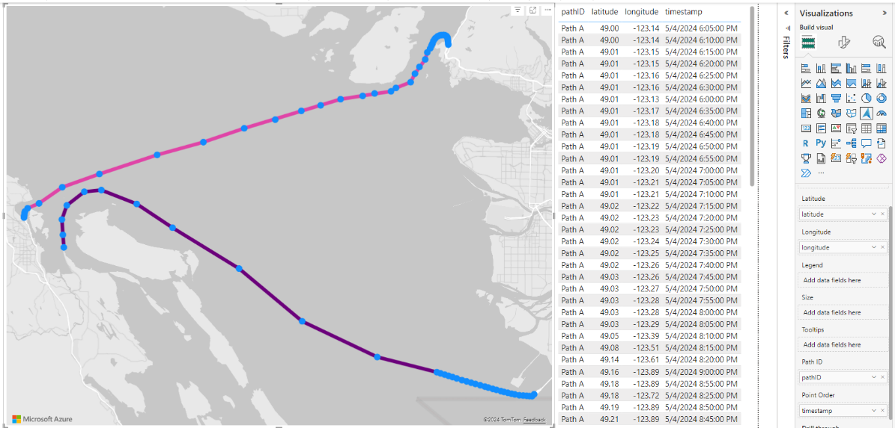

선의 색상, 투명도, 너비를 조절하고 각 포인트의 말풍선 마커(bubble markers)를 꺼서 시각적 형식을 지정할 수도 있습니다. 말풍선 레이어(bubble layer)를 끄면 마우스오버 시 포인터 위치에서 가장 가까운 지점을 보여주는 버블만 표시됩니다. 경로도 대화형이므로 마우스오버 시 도구 설명이 표시되고 선의 점을 클릭하여 다른 시각적 요소를 교차 강조 표시할 수 있습니다.

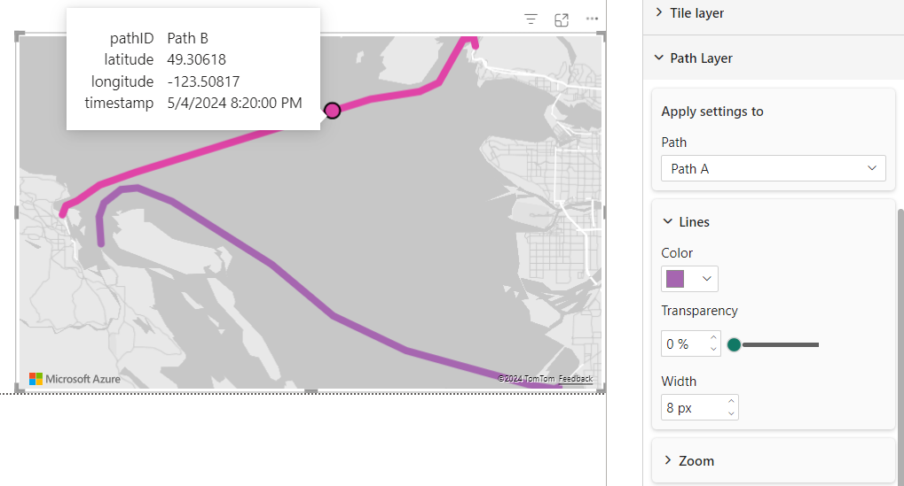

이 새로운 레이어에서 주의해야 할 몇 가지 고유한 동작이 있습니다. 첫째, 경로 레이어와 함께 드릴 계층 구조를 사용하는 경우, 경로의 포인트가 더 높은 드릴 수준에서 집계되므로 비주얼이 자동으로 가장 낮은 수준까지 드릴다운되고 드릴업이 허용되지 않습니다. 다음으로, 여러 경로의 일부인 위치가 있는 경우 해당 위치에 대한 말풍선이 서로 위에 표시됩니다. 아래의 말풍선을 클릭하길 원할 경우, 해당 경로와 연결된 선에 마우스를 가져가면 해당 선이 위로 떠서 선택할 수 있습니다. 마지막으로 범례를 추가하여 경로를 더 세분화할 수 있는데, 이 경우 주어진 경로 ID의 각 범례 값에 대해 고유한 줄이 만들어집니다.

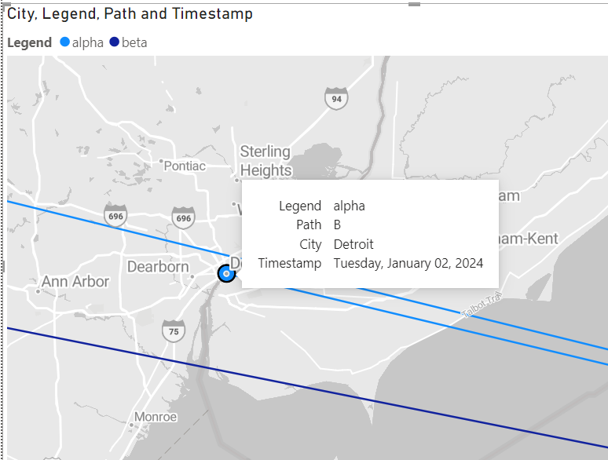

고려해야 할 추가 사항: 현재 경로 계층은 주로 말풍선 계층과 함께 작동합니다. 맵에 경로를 추가하면 filled, cluster bubbles, heat map, 3D column layers가 모두 비활성화된 것을 볼 수 있습니다. 또한 경로 레이어를 참조 레이어와 함께 사용할 수 있지만 참조 레이어는 정적입니다. 현재 데이터 바운드 참조 레이어를 경로 레이어와 혼합하는 것은 지원되지 않습니다.

경로 계층은 여전히 모든 지역에 활발하게 배포되고 있습니다. 테넌트(Tenant)가 있는 지역에 따라 주말 동안 Power BI 서비스에 경로 계층이 표시되지 않을 수 있습니다. 발행 후 보고서를 반드시 확인하고, 레이어가 보이지 않으면 일주일 이내에 접근할 수 있어야 합니다.

이 [새로운 경로 레이어](https://learn.microsoft.com/azure/azure-maps/power-bi-visual-add-path-layer)로 무엇을 만들 수 있을지 기대됩니다. 한 번 사용해보시고 다음에 어떤 기능을 보고 싶은지 알려주세요!

**시각적 계산 (Preview)**

시각적 계산(Visual calculations)에 대한 작업은 평소와 같이 계속되며 이번 달에는 요청이 많은 항목인 내보내기 지원을 추가합니다! 이제 하나 이상의 시각적 계산 또는 숨겨진 필드를 포함하는 시각적 개체에서 데이터를 내보낼 수 있습니다.

데이터를 내보내는 경우, 기본 데이터를 내보내지 않는 한 시각적 개체의 숨겨진 필드는 내보내기에 포함되지 않습니다. 시각적 계산은 시각적 개체에만 존재하므로 기본 데이터의 일부가 아니기 때문에 기본 데이터를 내보낼 때를 제외하고는 시각적 계산의 결과가 항상 내보내기에 포함됩니다.

[설명서에서 시각적 계산에 대해 자세히 알아보세요](https://learn.microsoft.com/power-bi/transform-model/desktop-visual-calculations-overview).

**Activator와 Real-Time Intelligence를 통한 ‘Set Alert’ (Generally Available)**

지난 [12월](https://powerbi.microsoft.com/blog/power-bi-december-2023-feature-summary/#post-25451-_Toc152674241) Microsoft Fabric의 일부인 Real-Time Intelligence Activator를 사용하여 Power BI 보고서 내에서 경고 기능의 미리 보기를 발표했습니다. 이제 이 기능이 정식 출시(Generally Available, GA) 된다는 소식을 발표하게 되어 기쁩니다!

정식 출시가 되면, 다음을 수행할 수 있습니다.

- 비즈니스 개체를 모니터링하여 중요한 지표를 파악하세요. 개별 패키지, 가구, 냉장고 등과 같은 주요 비즈니스 개체를 실시간으로 추적하고 분석하여 정보에 입각한 의사결정을 내리는 데 필요한 인사이트를 확보할 수 있습니다. 비즈니스 개체의 개별 인스턴스가 판매량, 재고 수준 또는 고객 상호 작용에 미치는 영향을 파악하는 등 모니터링 시스템은 세부적인 인사이트를 제공하여 세분화된 수준의 비즈니스 환경 변화에 선제적으로 대응할 수 있도록 도와줍니다.
- 고급 데이터 필터링과 모니터링 기능을 통해 데이터에 대한 비즈니스 규칙을 생성할 수 있는 잠재력을 최대한 활용하세요. 이 업데이트는 데이터 필터링, 요약, 범위 지정을 위한 다양한 옵션을 제공하기에 특정 요구 사항에 맞게 분석을 조정할 수 있습니다. 데이터 값이 변경되거나, 특정 임계값 초과, 지정된 기간 내에 새 데이터가 도착하지 않는 경우를 추적하기 위해 복잡한 조건을 설정할 수 있습니다.
- 이메일과 Teams 메시지의 미리보기를 확인하여 보내기를 누르기 전에 커뮤니케이션이 완벽한지 확인하세요. 이렇게 하면 수신자에게 표시되는 대로 정확하게 메시지의 미리보기를 볼 수 있습니다. 콘텐츠를 검토하고, 서식을 확인하고, 명확성을 보장하기 위해 필요한 조정을 수행합니다. 이 기능을 사용하면 Data Activator가 의도한 대로 보인다는 것을 알고 사용자를 대신하여 메시지를 보내도록 자신 있게 할 수 있습니다.
- 데이터 스트림에 들어오는 모든 새로운 이벤트와 함께 자동으로 트리거되는 규칙을 설정합니다. 알림을 보내야 하거나 워크플로를 시작해야 하는 경우 이 기능을 사용하면 프로세스가 항상 최신 상태로 유지되고 응답할 수 있습니다.
- 기능이 무엇이며 어떤 역할을 하는지 명확하게 알 수 있도록 기능의 이름을 변경했습니다. Reflex를 보는 데 익숙하다면 이제 **Activator**라고 불립니다. 따라서 규칙과 작업을 설정하기 위해 만드는 항목은 **Activator** 입니다.
- 또한 용량 사용량 보고를 활성화하여 용량 사용량과 향후 요금을 더 잘 이해할 수 있도록 했습니다. 청구는 이벤트 보존에 사용되는 스토리지와 컴퓨팅 리소스(실행 중인 규칙 수, 초당 수집된 이벤트 수, 규칙 평가 및 활성화)를 기반으로 합니다.

Activator 미터와 청구에 대한 자세한 내용은 곧 제공될 자세한 RTI 청구 블로그 게시물을 계속 지켜봐 주십시오.

블로그를 통해 정식 출시 업데이트에 대해 [자세히 알아볼 수 있습니다](https://aka.ms/realtimeblog) . 저희는 계속해서 기능을 개선하고 있으며 귀하의 피드백을 듣고 싶습니다. [아이디어나 제안](https://aka.ms/realtimeideas)을 공유해 주세요.

**새 카드 시각적 개체에 대한 여러 작은(small multiples) 항목 (Preview)**

이번 달 업데이트에 익숙한 기능과 업데이트는 모두 유지하면서 고급 기능과 향상된 사용자 경험을 추가한 새로운 버전으로 카드의 비주얼을 개선하였습니다.

이 새로운 기능은 현재 새로운 카드 시각적 개체와 함께 미리 보기로 제공되므로 기능을 경험할 수 있는 좋은 기회를 제공합니다.

**여러 개의 작은(small multiples)**카드 타일은 그리드 형식으로 함께 표시되는 일련의 유사한 카드 타일로, 각각 서로 다른 데이터 범주 또는 차원을 나타내므로 여러 필드에서 쉽게 OKR을 비교하고 분석할 수 있습니다.

새로 추가된 이 기능은 데이터 구성, 시각적 명확성 및 성능을 향상시켜 데이터를 보다 쉽게 분석하고 효과적으로 표시할 수 있도록 합니다. 시도하려면 **옵션 및 설정** > **옵션** > **미리 보기 기능** > **새 카드 시각적 개체** 로 이동하여 사용하도록 설정되어 있는지 확인 합니다.

새로운 **Small multiples** 기능의 또 다른 장점은 다음을 포함하여 제공하는 광범위한 사용자 정의입니다.

- **여러 개의 작은 항목 레이아웃:** 단일 열, 단일 행 또는 그리드 중에서 선택하고 표시되는 여러 개의 작은 항목, 행 또는 열의 수를 사용자 지정합니다.
- **고급 서식 옵션:** 글꼴 스타일, 색상 코딩 및 조건부 서식과 같은 향상된 기능.
- **테두리 및 격자선:** 활성화되면 테두리 및 격자선에 대한 개별 컨트롤을 사용하여 스타일, 너비, 색상과 투명도를 사용자 지정 할 수 있습니다.
- **오버플로 스타일**: 옵션에는 연속 스크롤 또는 페이지 매김이 포함되어 시각적 공간을 압도하지 않고 여러 카드를 원활하게 탐색할 수 있습니다.
- **헤더:** 가로 또는 세로 방향, 위쪽 또는 왼쪽 위치, 사용자 지정 가능한 정렬, 글꼴, 색상, 투명도, 패딩, 배경색 또는 이미지 중에서 선택합니다.

여러 개의 작은 항목이 있는 카드 시각적 개체를 만들려면 먼저 **시각화** 창의 **빌드 시각적 개체** 탭에 있는 시각적 개체 갤러리에서 **카드(신규)** 아이콘을 선택한 다음, 데이터 모델에서 일부 데이터 필드를 선택하여 데이터 필드 웰에 추가합니다.

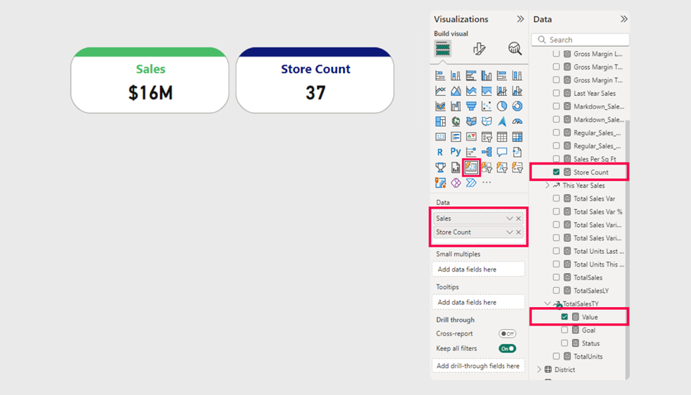

Small multiples를 사용하여 카드를 분류하려면 데이터 모델에서 데이터 필드를 선택하고 **Small multiples** 데이터 필드 웰에 추가합니다.

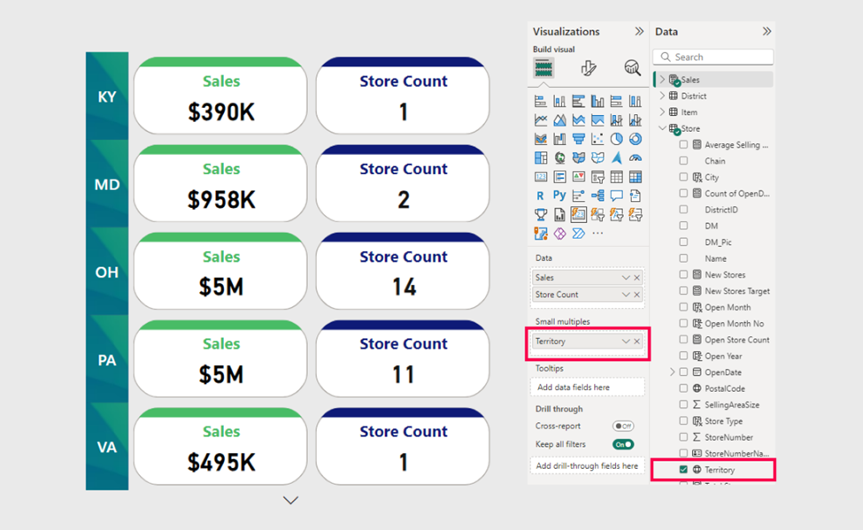

이 새로운 기능은 레이아웃, 고급 서식 옵션, 조건부 서식, 테두리와 눈금선, 오버플로 스타일과 사용자 지정 가능한 헤더와 같은 광범위한 사용자 지정 옵션을 제공합니다.

Power BI의 카드 시각적 개체에 대한 Small multiples 항목은 데이터 구성, 시각적 명확성과 성능을 크게 향상시키는 또 다른 향상된 기능을 제공합니다.

Core Visuals 팀은 계속해서 새로운 기능과 더 큰 기능을 추가하고 있으며 기능을 개선하기 위해 최선을 다하고 있습니다. 이 새로운 기능을 살펴보고 카드 시각적 기능을 계속 개선함에 따라 아래 의견 섹션에서 피드백을 공유해 주시기 바랍니다.

자세한 내용은 [LinkedIn의 Core Visuals 블로그](https://www.linkedin.com/company/pbicorevisuals/posts/)를 방문해 보세요.

**새 시각적 개체 - 텍스트 슬라이서(text slicer) (Preview)**

이제 핵심 시각적 개체 갤러리에서 사용할 수 있는 새로운 텍스트 슬라이서(text slicer)를 소개합니다.

이번 달에는 Power BI에 새로운 텍스트 슬라이서가 도착하여 사용자와 조직 모두에게 새로운 가능성을 제공합니다.

**옵션 및 설정 > 옵션 > 미리 보기 기능 >** **텍스트 슬라이서** 시각적 개체로 이동하여 새 **텍스트 슬라이서**를 ****사용하도록 설정하고 ****Power BI를 다시 시작합니다.

텍스트 슬라이서는 사용자가 지정된 데이터 필드를 대상으로 필터 역할을 하는 특정 텍스트를 입력할 수 있도록 하여 작동합니다. 슬라이서의 입력 상자에 원하는 텍스트를 입력하면 슬라이서는 데이터 세트의 범위를 효과적으로 좁혀 입력한 텍스트가 포함된 관련 정보만 표시합니다. 이 기능은 효율적인 데이터 분석 및 표시를 위해 빠르고 정확한 필터링이 필수적인 대규모 데이터 세트를 처리하는 데 특히 유용합니다.

텍스트 슬라이서 시각적 개체를 만들려면 **시각화(Visualizations)** 창의 **시각화 만들기(Build visual)**탭에 있는 비주얼 갤러리에서 **텍스트 슬라이서** 아이콘을 선택합니다. 그러면 보고서 캔버스에 시각적 시각적 자리 표시자가 추가됩니다.

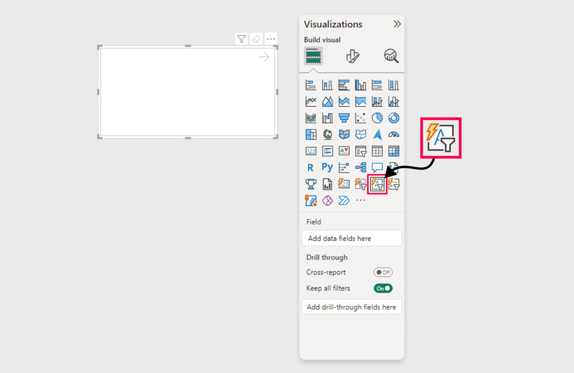

데이터 세트를 필터링하려면 데이터 모델의 텍스트 필드를 **필드** 웰에 추가하여 텍스트 슬라이서의 기능을 설정하여 사용자 입력을 기반으로 데이터 세트를 필터링할 수 있도록 합니다. 슬라이서의 입력 상자에 텍스트를 추가하거나, 적용 아이콘을 선택하거나, Enter 키를 누르기만 하면 슬라이서가 데이터 세트를 즉시 필터링하여 시각적 개체에 결과를 표시합니다.

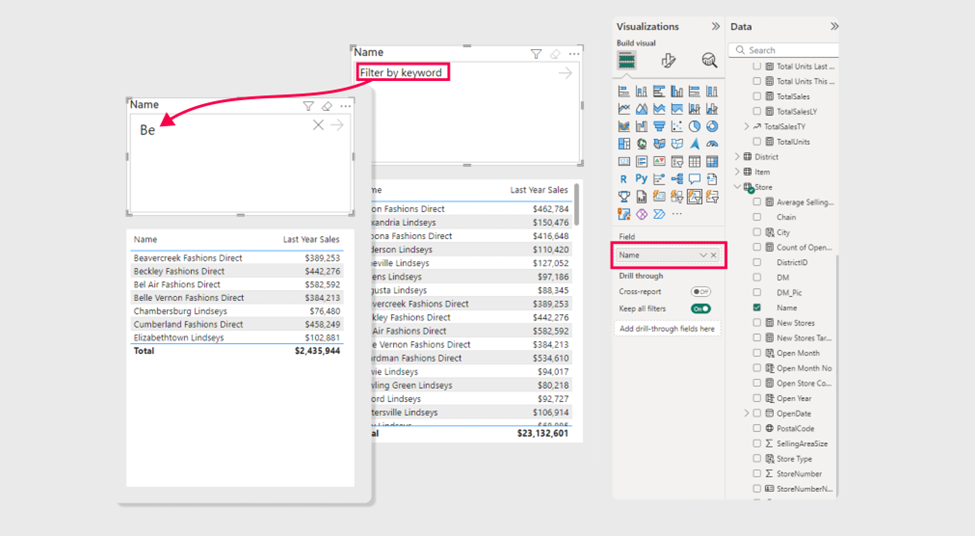

여기에서 볼 수 있듯이 새 텍스트 슬라이서는 Power BI에 강력하고 사용자 지정 가능한 필터링 도구를 도입합니다.

- **향상된 사용자 환경:** 텍스트 슬라이서는 사용자에게 입력을 필터링하는 간단하고 효율적인 방법을 제공합니다.
- **타의 추종을 불허하는 사용자 정의:** 사용자가 자신의 필요와 선호도에 맞게 필터 경험을 조정할 수 있는 다양한 옵션을 제공합니다.

Core Visuals 팀은 기능을 지속적으로 개선하기 위해 최선을 다하고 있습니다. 우리는 우리의 능력을 발전시키기 위해 최선을 다하고 있으며 귀하의 피드백을 매우 소중하게 생각합니다. 아래 의견 섹션에서 이 기능에 대한 통찰력을 공유해 주십시오.

자세한 내용은 [LinkedIn의 Core Visuals 블로그](https://www.linkedin.com/company/pbicorevisuals/posts/)를 방문해 보세요.

**리포팅 데모**

