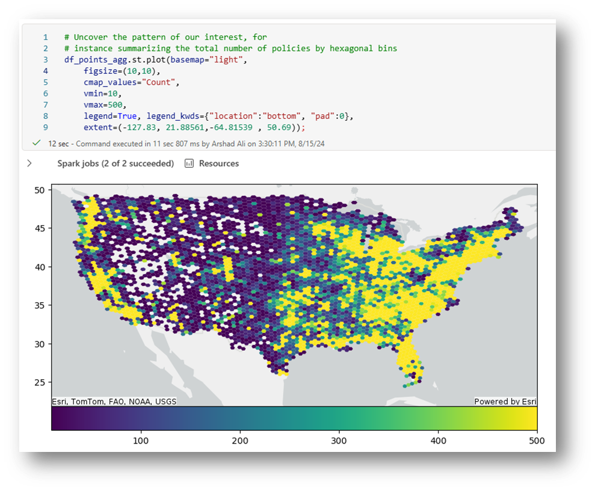
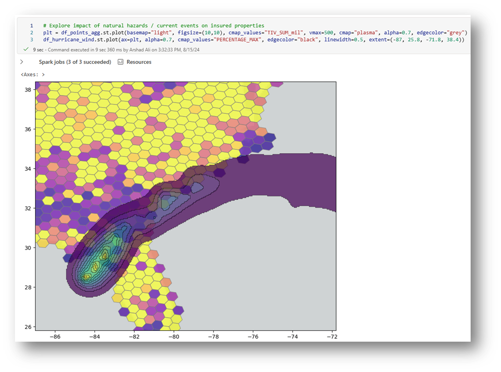
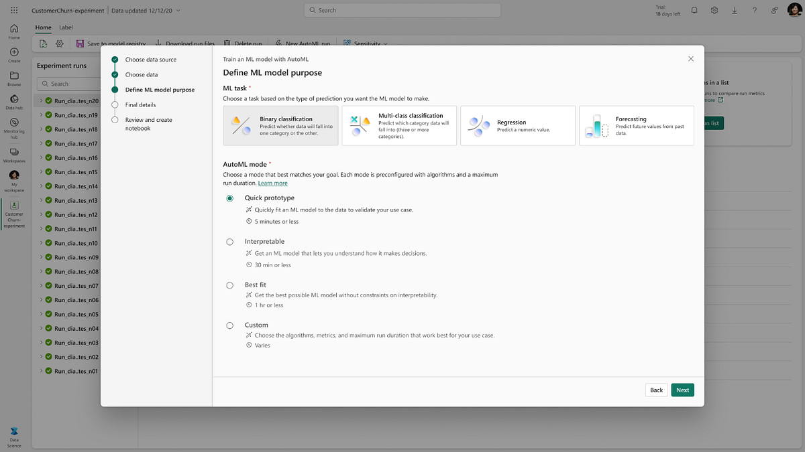
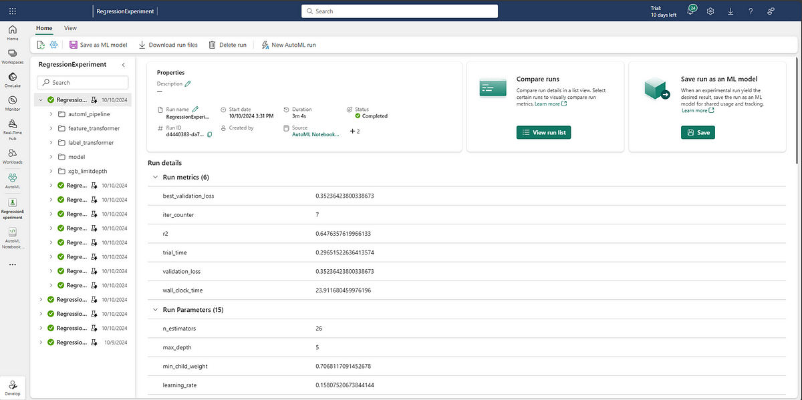

이 포스팅은 [Adam Saxton](https://blog.fabric.microsoft.com/en-us/blog/author/Adam%20Saxton)님의 [Fabric November 2024 Feature Summary](https://blog.fabric.microsoft.com/en-us/blog/fabric-november-2024-feature-summary) 글을 한글로 번역한 글입니다.

---

1. [Unified Data platform Fabric 기능 (1/4): 인증, Copilot과 AI, 리포팅](/azurekorea/udp-fabric-function1)
2. [Unified Data platform Fabric 기능 (2/4): 모델링, 개발자+API, 시각화, 플랫폼](/azurekorea/udp-fabric-function2)
3. Unified Data platform Fabric 기능 (3/4): OneLake, 미러링, 데이터베이스, 데이터 웨어하우스, 데이터 엔지니어링, 데이터 사이언스
4. [Unified Data platform Fabric 기능 (4/4): 실시간 인텔리전스, 데이터 팩토리](/azurekorea/udp-fabric-function4)

---

**목차**

- OneLake
- 미러링 (Mirroring)
- 데이터베이스 (Databases)
- 데이터 웨어하우스 (Data Warehouse)
- 데이터 엔지니어링 (Data Engineering)
- 데이터 사이언스 (Data Science)

---

### OneLake

**외부 데이터 공유(External data sharing) 정식 출시(GA)**

올해 초에 발표된 외부 데이터 공유 기능(External data shinarng)이 이제 정식으로 제공 됩니다. 외부 데이터 공유를 사용하면 테넌트 경계를 넘어 OneLake 테이블과 폴더를 공유할 수 있습니다. 현재 릴리즈에는 각 공유에 레이크하우스의 단일 폴더 또는 테이블이 포함될 수 있습니다. 향후 릴리즈에서는 단일 공유의 여러 폴더와 테이블 뿐만 아니라 웨어하우스와 이벤트하우스 공유에 대한 지원이 추가됩니다.

자세한 내용은 [설명서](https://learn.microsoft.com/fabric/governance/external-data-sharing-overview)를 확인하세요.

---

### **미러링** (Mirroring)

**오픈 미러링(Open Mirroring) 소개**

새로운 미러링 기능인 오픈 미러링(Open Mirroring)을 소개합니다. Microsoft Fabric을 만들 때 확장 가능하고, 사용자 지정 가능하며, 개방형으로 플랫폼을 설계했습니다. 이를 염두에 두고 현재 평가판으로 제공되는 오픈 미러링은 모든 애플리케이션 또는 데이터 제공업체가 최소한의 노력으로 데이터 자산을 OneLake로 직접 가져올 수 있도록 하여 패브릭의 확장성을 향상시키는 강력한 기능입니다.

오픈 미러링은 데이터 제공자와 애플리케이션이 패브릭 내의 미러링 된 데이터베이스에 변경 데이터를 직접 쓸 수 있도록 함으로써, 복잡한 데이터 변경사항의 처리를 단순화하여 모든 미러링 된 데이터가 지속적으로 최신 상태로 유지되고 분석할 준비가 되도록 합니다.

패브릭 내에서 데이터 처리 및 분석 기능을 확장하려는 사용자를 위해 오픈 미러링은 OneLake 내에서 데이터가 동기화되고, 액세스할 수 있고, 분석 준비가 된 상태로 유지되도록 하는 유연하고 강력한 솔루션을 제공합니다.

Striim, OCI Golden Gate, MongoDB와 같은 패브릭 파트너는 이미 오픈 미러링과 통합할 수 있는 기능을 갖추고 있으며, 곧 DataStax 통합이 예정되어 있습니다. 이를 통해 모든 조직은 더 광범위한 도구 에코시스템을 활용하여 패브릭 환경 내에서 데이터 처리와 분석을 강화할 수 있습니다.

패브릭의 [Introducing Open Mirroring in Microsoft Fabric](https://aka.ms/mirroring/intro-open-mirroring) 블로그 게시물에서 오픈 미러링에 대해 자세히 알아보세요.

**Fabric Databese Mirroring Public Rest API 정식 출시(GA)**

패브릭 데이터베이스 미러링 공용 REST API(Fabric Databese Mirroring Public Rest API)의 정식 출를 공지합니다. 이제 사용자는 Microsoft 패브릭 REST API를 활용하여 CRUDLE 작업을 수행할 수 있습니다.

- **Create** 패브릭 워크스페이스에 새 미러링된 데이터베이스를 생성 합니다.
- **Read** 기존 미러된 데이터베이스를 읽어 항목의 정의를 가져옵니다.
- **Update** 정의에 대한 변경 내용으로 미러된 데이터베이스를 업데이트합니다.
- **Delete** 기존 미러된 데이터베이스를 삭제하여 작업 영역을 정리합니다.
- **List** 작업 영역의 모든 미러된 데이터베이스를 나열하여 워크스페이스에서 사용 가능한 모든 미러링 된 데이터베이스를 가져옵니다.

미러링 된 데이터베이스 ID로 미러링 된 데이터베이스와 해당 테이블의 미러링 상태에 대한 추가 상태도 가져올 수 있습니다. 또한 공용 REST API를 사용하여 기존 미러링 된 데이터베이스를 시작 및 중지할 수도 있습니다.

자세한 내용은 [미러링 된 데이터베이스 REST API](https://learn.microsoft.com/fabric/database/mirrored-database/mirrored-database-rest-api)를 참조하세요.

**Azure SQL Database에 대한 미러링**

이제 Azure SQL Database에 대한 미러링이 정식 출시 되었습니다. 미러링은 거의 실시간으로 데이터 동기화를 통해 Azure SQL 데이터베이스에서 패브릭OneLake로 스냅샷과 증분 데이터 변경 사항을 복제하는 간단하고 무료이며, 마찰 없는 방법입니다.

정식 출에서는 다음과 같은 새로운 기능을 사용할 수 있습니다.

1. 미러링이 활성 상태일 때 소스데이터베이스의 테이블 Truncate 지원
2. 데이터 웨어하우스와 레이크하우스 환경의 스키마 계층 구조와 열 매핑과 관련된 문제를 해결합니다.

자세한 내용은 [Azure SQL Database용 패브릭 미러링의 정식 출시 발표를 참조하세요](https://aka.ms/mirroring-sqldb-ga).

**Azure SQL Managed Instance에 대한 미러링 소개 (Preview)**

이제 Azure SQL Managed Instance에 대한 미러링 미리 보기(Preview)를 사용할 수 있습니다. 미러링은 거의 실시간으로 데이터 동기화를 통해 Azure SQL Managed Instance에서 패브릭 OneLake로 스냅샷과 증분 데이터 변경 사항을 복제하는 간단하고 무료이며 마찰 없는 방법입니다.

패브릭 미러링은 분석 시나리오의 주제인 운영 데이터베이스에 대한 통찰력을 가능하게 하는 ETL 프로세스를 설정하기 위한 프로젝트 실행에 대한 훌륭한 대안을 제공합니다.

몇 단계만 거치면 패브릭 미러링을 설정할 수 있으며, 미러링 할 테이블을 선택하면 데이터 흐름이 시작됩니다. 미러링 되는 테이블을 변경하려면 몇 번의 클릭만으로 변경할 수 있습니다. 언제든지 모든 미러 테이블의 복제 상태를 쉽게 확인할 수 있습니다. 이 모든 설정, 관리와 모니터링은 패브릭 UI에 직접 통합됩니다.

미러링 전에는 데이터 복제를 위한 추가 도구와 ETL을 설정, 구성, 모니터링, 유지 관리할 전문 인력이 필요했으며, 이는 단지 복제를 계속 진행하기 위한 것이었습니다. 복제를 변경하려면 다시 대기열에 대기하고 ETL 전문가가 파이프라인을 수정할 때까지 기다려야 했습니다.

Microsoft 패브릭에서 Azure SQL Managed Instance 미러링의 새롭고 흥미로운 기능에 대해 자세히 알아보려면 [블로그](https://aka.ms/sqlmi-mirroring-blog)를 참조하세요.

---

### **데이터베이스** (Databases)

**패브릭 SQL 데이터베이스 소개 (Preview)**

SQL 데이터베이스는 이제 Microsoft 패브릭 공개 미리 보기(Public Preview)에서 네이티브 솔루션으로 사용할 수 있으며 새 데이터베이스 워크로드에 포함된 첫 번째 데이터베이스 제품입니다. 이 새로운 오퍼링은 패브릭 플랫폼과 원활하게 통합되며 CU(Capacity units) 모델을 통한 통합 청구를 포함합니다. 소규모 또는 대규모 분석 프로젝트에서 작업하는 경우 Microsoft 패브릭에서 데이터베이스 지원이 필요하다는 피드백을 받았습니다.

패브릭 데이터베이스가 추가됨에 따라 Microsoft 패브릭을 분석 플랫폼에서 데이터 플랫폼으로 발전시키고 있습니다. 이제 Fabric은 운영 데이터베이스 지원, 분석 스토리지, 이동 중인 데이터에 대한 실시간 인텔리전스, 최고 수준의 시각화 등 Gen AI 앱에 필요한 모든 것을 갖추고 있습니다. 이번 주에는 Fabric SQL Database 및 Azure SQL Database의 새로운 벡터 유형 및 함수의 미리 보기(Preview)도 발표하여 AI 앱을 훨씬 더 간단하게 빌드할 수 있도록 했습니다. LangChain, Semantic Kernel 등과 같은 프레임워크와 쉽게 통합할 수 있는 방법에 대한 샘플도 제공합니다.

지금 바로 패브릭에서 SQL 데이터베이스를 시작할 수 있습니다. 자세한 내용은 [패브릭 SQL 데이터베이스 미리보기 발표](https://aka.ms/announcingsqlfabric)를 참조하십시오.

---

### **데이터 웨어하우스** (Data Warehouse)

**콜드 쿼리(Cold query) 성능 향상**

콜드 캐시(Cold cache)를 사용하여 쿼리를 실행하면 몇 가지 문제가 발생합니다. 데이터가 캐시 되지 않은 경우 OneLake에서 데이터를 가져와 쿼리 처리를 위해 parquet 파일 형식 구조에서 메모리 내 구조로 트랜스코딩 해야 합니다. 이 프로세스는 시간이 많이 걸리고 전체 성능에 영향을 줄 수 있습니다.

최신 개선 사항을 통해 스토리지에서 데이터를 가져오는 것과 트랜스코딩 프로세스를 모두 최적화하여 평균 콜드 쿼리 오버헤드가 40% 감소하는 것을 관찰했습니다.

**패브릭 데이터 웨어하우스에 대한 서비스 주체(Service principal) 지원**

패드빅 데이터 웨어하우스를 인증하고 관리하는 방법을 크게 개선했습니다: [SPN(service principal)](https://learn.microsoft.com/entra/identity-platform/app-objects-and-service-principals?tabs=browser) 지원 도입. 이 새로운 기능을 통해 개발자와 관리자는 프로세스를 자동화하고, 운영을 간소화하며, 데이터 워크플로의 보안을 강화할 수 있습니다.

이전에 레이크 하우스와 이벤트 하우스를 비롯한 다양한 패브릭 항목에 대한 Service principal을 시작했습니다. 이제 이 지원은 패브릭 데이터 웨어하우스로 확장되어 사용자 ID에 의존할 필요 없이 안전하고 확장 가능한 방식으로 웨어하우스 솔루션을 더 쉽게 연결, 관리, 배치 할 수 있습니다.

이 기능은 다음과 같은 이점을 제공합니다.

- **자동화 친화적인 API 접근:** 이제 ****Service principal을 사용하여 Fabric [REST API](https://learn.microsoft.com/rest/api/fabric/warehouse/items)를 통해 웨어하우스 항목을 생성, 업데이트, 읽기 및 삭제할 수 있습니다
- **클라이언트 도구와의 원활한 통합**: SSMS(SQL Server Management Studio)와 같은 도구를 사용하여 Service principal을 통해 패브릭 데이터 웨어하우스에 연결하고 COPY INTO와 같은 TSQL 기능을 실행할 수 있습니다.
- **세분화된 접근 제어**: GRANT와 같은 T-SQL 명령을 사용하여 세분화된 수준의 액세스를 제공하는 기능으로, 관리자는 Service principal에 특정 권한을 할당하여 SPN이 액세스할 수 있는 데이터와 작업을 정확하게 제어할 수 있습니다.
- **향상된 DevOps와 CI/CD 통합**: 개발자는 Service principal을 사용하여 DevOps 및 CI/CD(지속적인 통합/지속적인 배포) 파이프라인에서 데이터 웨어하우스 리소스의 배포와 관리를 자동화하여 데이터 솔루션의 빠르고 안정적인 제공을 보장할 수 있습니다.

---

### **데이터 엔지니어링** (Data Engineering)

**노트북 디스플레이 차트(notebook display chart)업그레이드**

새롭게 개선된 차트 보기는 노트북 디스플레이의 최신 개선 사항입니다. 이 업데이트는 패브릭 노트북에 내장된 시각화 도구를 활용하여, 데이터를 시각화하기 위한 보다 직관적이고 강력한 경험을 제공하도록 설계되었습니다.

**주요 특징들:**

- **다중 차트 보기:** 이제 하나의 display() 출력 위젯에 최대 5개의 차트를 추가 할 수 있으며, 서로 다른 열을 기반으로 여러 차트를 만들고 차트를 쉽게 비교할 수 있습니다!
- **리치 차트(rich chart)추천:** 새 차트를 만들거나 추천 버튼을 클릭할 때 차트 제안을 받고, 리치 차트 템플릿과 요약된 제목과 키-값 쌍에 대한 통찰력 있는 추천을 쉽게 시작할 수 있습니다.
- **고급 차트 편집:** 차트를 추가, 이름 변경, 삭제하고 차트 옵션을 구성할 수 있습니다. 이번 업그레이드에서는 차트 제목과 부제, 범례, 테마, 레이블 등 많은 새로운 구성이 제공됩니다. 모든 구성은 즉시 저장됩니다.
- **글로벌 구성:** 사용자 지정 범위를 쉽게 필터링하고 데이터에 적용할 수 있습니다. 이러한 설정은 표와 차트 모두에 적용됩니다.
- **대화형 도구 모음:** 차트 위로 마우스를 가져가면 확대, 축소, 확대/축소 선택, 재설정, 이동 등 차트를 탐색할 수 있는 도구 모음에 접근 할 수 있습니다. 도구 모음 설정은 저장되지 않기에 임시로 조정할 수 있습니다.

**향상된 차트 보기의 이점:**

- 향상된 데이터 시각화: 새로운 차트 보기는 데이터를 시각화하는 보다 동적인 대화형 방법을 제공하여, 추세와 인사이트를 더 쉽게 식별할 수 있도록 합니다.
- 사용자 친화적인 인터페이스: 향상된 기능은 원활한 경험을 제공하여, 표와 차트 보기 간에 쉽게 전환할 수 있습니다.
- 사용자 지정 옵션: 차트 옵션을 구성하고 전역 설정을 적용할 수 있는 기능을 통해, 특정 요구 사항에 맞게 시각화를 조정할 수 있습니다.
- 새로운 UX 프레임워크를 기반으로 더 많은 고급 차트 유형을 점진적으로 추가할 예정이니 계속 지켜봐 주세요!

**시작하기:**

향상된 차트 보기에 액세스하려면 패브릭 노트북을 열고 display(df) 문을 실행하기만 하면 됩니다. 레거시 UX가 표시되는 경우 스위치를 사용하여 새 UX로 이동합니다.

**GraphQL용 패브릭 API가 흥미로운 새 기능과 함께 정식 출시(GA) 됩니다.**

GraphQL용 Microsoft 패브릭 API가 정식 출되어 패브릭에서 강력하고 유연하며, 효율적인 데이터 액세스 API를 제공하는 데 있어 중요한 이정표가 되었습니다.

지난 달에 제공된 중요한 기능(Service Principals 지원과 API 편집기에서 코드 생성) 외에도, 이 릴리즈에서는 경험을 개선하고 패브릭에서 GraphQL API로 달성할 수 있는 가능성을 확장하여, 비즈니스 애플리케이션에서 패브릭 데이터의 기능을 더 쉽게 활용할 수 있도록 하는 것을 목표로 하는 몇 가지 새로운 기능을 도입합니다.

- **새 데이터 소스:** 원활한 데이터 접근을 위한 Azure SQL 및 패브릭 SQL DB(Preview) 통합.
- **연결 및 저장된 자격 증명을 사용하여 데이터 소스 접근**: 보안이 강화되고 접근 관리가 간소화 됩니다.
- **로깅 및 모니터링 대시보드:** API 활동에 대한 시각적 통찰력과 더 나은 성능 모니터링과 문제 해결을 위한 자세한 로깅.
- **CI/CD 지원:** 일관되고 자동화된 배포를 위한 Git 통합과 배포 파이프라인.

이러한 흥미로운 새 기능에 대한 자세한 내용은 [정식 출시 발표 블로그](https://blog.fabric.microsoft.com/en-US/blog/announcing-the-general-availability-of-microsoft-fabric-api-for-graphql-with-exciting-new-features/)에서 확인할 수 있습니다.

**Esri의 ArcGIS GeoAnalytics와 패브릭 Spark 통합 (Preview)**

Esri는 주로 주력 소프트웨어인 ArcGIS를 통해 공간 정보 시스템(GIS) 기술, 로케이션 인텔리전스, 매핑 분야의 글로벌 시장 리더로 인정받고 있습니다. Esri는 기업, 정부, 커뮤니티가 공간 분석 및 위치 인사이트를 통해 세계에서 가장 시급한 문제를 해결할 수 있도록 지원합니다.

Microsoft와 Esri는 패브릭에 공간 분석을 통합하기 위해 협력했으며, 곧 미리 보기(Preview)가 출시될 예정입니다. Esri와의 협업을 통해 Microsoft 패브릭 Spark 노트북과 Spark 작업 정의(데이터 엔지니어링 및 데이터 과학 환경 모두)에 최첨단 시각적 공간 분석을 도입할 것입니다.

통합 제품 환경을 통해 Spark 개발자 또는 데이터 사이언티스트는 별도의 설치와 구성 없이 다양한 사용 사례에서 데이터의 변환, 보강, 패턴/추세 분석을 위해 ArcGIS 기능을 기본적으로 사용하여 패브릭 Spark 내에서 GeoAnalytics 기능 및 도구를 실행할 수 있습니다.

다음은 ArcGIS 공간 함수를 사용 데이터를 변환하여, 관심 패턴을 파악하는 예제입니다(예: 보험에 가입한 부동산의 총 보험증권 수를 육각형 구간으로 요약).

다음은 허리케인급 바람의 확률이 포함된 데이터 세트를 가져와 보험에 가입된 자산과 공간적으로 결합하여, 자연 재해 또는 현재 사건이 보험에 가입된 자산에 미치는 영향을 이해하는 또 다른 예입니다.

공간 조인은 보험에 가입된 부동산을 풍속 확률과 연결하며, 이를 통해 각 부동산에 대해 허리케인급 바람의 가능성을 알 수 있고, 예측 모델을 실행하여 잠재적인 보험 청구를 평가할 수 있습니다.

Microsoft 패브릭 Spark 내의 ArcGIS GeoAnalytics 통합에 대한 자세한 내용은 [설명서](https://aka.ms/fabricsparkesri)를 참조하세요.

**Jar 라이브러리는 이제 패브릭 환경에서 지원됩니다.**

JAR(Java Archive) 파일은 Java 에코시스템에서 사용되는 인기 있는 패키징 형식입니다. 이를 통해 개발자는 Java 클래스 파일, 메타데이터, 리소스와 같은 여러 파일을 배포를 위해 압축된 단일 아카이브로 번들로 묶을 수 있습니다. JAR 파일은 모든 것을 쉽게 공유하고 관리할 수 있는 하나의 파일로 통합하여 Java 애플리케이션과 라이브러리의 배포 및 실행을 단순화합니다.

이전에는 JAR 파일을 패브릭에 통합하려면 노트북 내에서 인라인 명령이 필요했습니다. 이 접근 방식은 기능적이지만 재현성 문제를 제기했습니다. 이제 JAR 파일을 사용자 정의 라이브러리로 환경에 업로드할 수 있습니다. 이러한 사용자 지정 라이브러리는 환경에 연결된 노트북과 Spark 작업에서 효과적입니다. 패브릭 환경 내에서 JAR 파일을 수용하면, 개발과 배치 프로세스를 간소화하여 애플리케이션의 전반적인 효율성과 확장성을 향상시킬 수 있습니다.

**Delta 테이블 이름의 공백과 특수 문자 지원**

이제 Microsoft 패브릭의 Delta 테이블 이름에 공백과 특수 문자를 지원할 수 있습니다!

이는 패브릭 고객이 요청하는 매우 바람직한 개선 사항입니다. 이제 모든 패브릭 경험에서 공백, 특수 문자, 자연어 인코딩을 사용하여 Delta 테이블의 이름을 지정할 수 있습니다. Spark, 레이크 하우스, 노트북, 웨어하우스, Power BI, Shortcut 만들기, 메타데이터 검색 등 모든 것이 작동합니다. 일부 제한 사항이 적용되며 [설명서](https://learn.microsoft.com/fabric/get-started/delta-lake-interoperability)에서 자세한 내용을 알아보세요. 이 기능은 앞으로 몇 주 동안 전 세계 모든 패브릭 지역에서 사용할 수 있습니다.

**데이터 엔지니어링 데모**

---

### **데이터 사이언스** (Data Science)

**로우 코드 AutoML 소개**

AutoML(Automated Machine Learning)은 기계 학습 모델을 개발하는 데 시간이 많이 걸리고 복잡한 작업을 자동화하는 프로세스입니다. 데이터 사전 처리, 기능 엔지니어링, 모델 선택, 하이퍼 파라미터 튜닝을 처리하여 워크플로를 단순화하고 사용자가 결과 해석과 의사 결정에 집중할 수 있도록 합니다.

분석가와 데이터 사이언티스트가 빠르게 머신 러닝 모델 프로토타입을 만들고, 쉽게 구축할 수 있도록 설계된 패브릭의 새로운 로우 코드 AutoML 사용자 경험을 소개합니다. 이 혁신적인 인터페이스는 회귀, 예측, 분류, 다중 클래스 분류를 포함한 다양한 작업을 지원합니다.

AutoML 사용자 환경을 시작하는 것은 매우 간단합니다. 사용자는 기존 실험, 모델 또는 노트북으로 시작할 수 있습니다. 레이크하우스에서 관련 파일이나 테이블을 선택하고 원하는 ML 작업을 지정하기만 하면 됩니다. 더 많은 제어를 원하는 사람들을 위해 선택적 구성을 사용할 수 있습니다. 병렬 처리 모드를 선택하여 한 번에 하나의 Spark 기반 모델을 학습시킬지 혹은 Spark 클러스터의 모든 노드에 분산하여 Pandas를 사용하여 평가판을 병렬화 할지 결정할 수 있습니다. 또한 auto-features 설정을 통해 모델 학습에 유용한 기능을 생성할 수 있습니다.

AutoML 환경의 주요 기능 중 하나는 MLflow와의 통합입니다. 생성된 모든 모델은 MLflow 및 기존 실험 항목을 사용하여 추적 됩니다. 이를 통해 사용자는 메트릭, 매개변수, 모델 유형, 모델 파일과 같은 모든 세부 정보를 모니터링할 수 있기에, AutoML 평가판에서 생성된 여러 모델을 쉽게 비교할 수 있습니다.

패브릭의 자동화된 Machine Learning에 대해 [자세히 알아보세요](https://aka.ms/fabric-automl).

**데이터 사이언스 데모**

