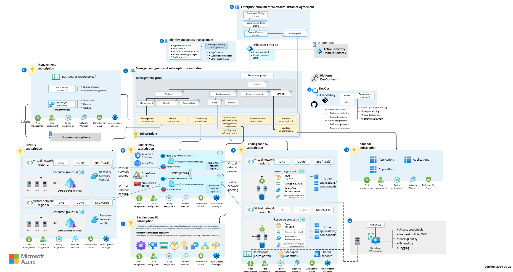

클라우드 인프라를 구축하고 관리하는 데 있어, Landing Zone이라는 용어를 들어본 적이 있으신가요? 이 개념은 단순한 클라우드 환경 설정을 넘어, 기업의 디지털 전환을 가속화하고 최적화하는 데 핵심적인 역할을 합니다. 그렇다면, Azure Landing Zone이란 과연 무엇일까요? 그리고 왜 많은 기업들이 Landing Zone을 디자인 하는 데 집중하고 있을까요? 이 블로그 포스팅을 통해 Azure Landing Zone이 무엇인지에 대해 말씀드리고, Landing Zone의 8가지 설계 항목에 대해 설명을 드리고자 합니다.

Azure Landing Zone은 Azure billing and Microsoft Entra tenant / Identity and Access Management / Network topology and connectivity / Resource organization / Security / Management / Governance / Platform automation and DevOps 8가지 설계 항목을 고려하여 디자인 한 Azure 클라우드 환경입니다.

Azure Landing Zone은 마이크로소프트에서 제공하는 Cloud Adoption Framework라는 문서에서 Ready 단계에 포함된 가이드 입니다. Cloud Adoption Framework는 기업에서 클라우드를 도입하는데 참고하실 수 있는 교과서 같은 문서입니다. 초기 도입 단계부터 고려해야 할 사항, 여러 모범 사례, 설계할 분야 등이 포함돼 있습니다.

링크 : [Landing Zone](https://learn.microsoft.com/en-us/azure/cloud-adoption-framework/ready/landing-zone/)  

**Q : 그래서 Azure에서 Landing Zone을 설계하기 위해 어떤 제품을 쓰면 되나요?**

**A : Azure에서는 Landing Zone을 타사와 달리 제품으로 제공하지 않습니다. Landing Zone은 Azure 도입 시 설계해야 하는 8개의 분야를 다룬 개념입니다.**

  

위의 답변대로 Azure에서는 Landing Zone을 제품으로 지원하지 않습니다. Azure는 identity를 중앙에서 관리할 수 있는 Microsoft Entra ID(구 Azure Active Directory)라는 중앙화된 계정 관리 플랫폼을 이미 지원하고 있기 때문에 사실 굳이 제품으로써 Landing Zone을 지원 할 필요가 없기 때문입니다.

(사실 Azure Blueprints라는 제품이 있습니다. Blueprints에 Landing Zone 설계 내용을 모두 포함시켜서 배포하실 수 있지만, 이 많은 내용을 하나의 템플릿에 담아 배포하기에는 복잡성이 높아서 일반적으로 많이 채택하시는 방법은 아닙니다)

그럼에도 불구하고 많은 엔터프라이즈 고객이 정형화된 제품 혹은 템플릿을 통해 설계를 하고싶어 하시는데요, 이 때 Azure Landing Zone Accelerator라는 Azure 템플릿을 통해 배포하실 수 있습니다. 만약 찾고 있는 내용과 비슷하다면 Azure Landing Zone Accelerator를 통해 배포하실 수 있고, Accelerator보다는 조금 더 요구사항에 맞는 환경대로 배포하고 싶으시다면 8개의 설계 분야를 확인하고 각 분야마다 설계를 진행하실 수 있습니다. 각 설계 분야를 확인하기 위해 Accelerator 템플릿을 확인하는 것도 좋은 방법입니다.

링크 : [CAF](https://learn.microsoft.com/en-us/azure/cloud-adoption-framework/ready/landing-zone/#platform-landing-zone-accelerator)

Azure Landing Zone은 플랫폼으로써의 역할을 다 할 수 있어야 하고, 또한 미래에 배포될 애플리케이션에 필요한 환경을 제공할 수 있어야 합니다. 당장 배포될 애플리케이션에 대해서만 맞춤으로 랜딩존 환경을 설계하다 보면, 추후에 확장성에 문제가 생길 수 있습니다. 그렇기 때문에 배포될 애플리케이션에 대해 충분한 리소스를 공급해줄 수 있는 플랫폼으로써 동작할 수 있도록 하는데 집중해서 설계해야 합니다.

각 설계 항목은 아래와 같이 8개 분야가 있습니다. 당연히 Azure에 애플리케이션을 배포하기 전 아래 항목 모두 설계하신 후 배포할 것을 권장하지만, 각 사용자의 환경에 따라 간혹 급한대로 네트워크 연결성 먼저 확보하고 추후 고도화를 통해 Landing Zone을 설계하는 경우도 종종 있음을 참고로 말씀 드립니다. 또한 각 설계 항목마다 포함하는 내용이 많아서 문서에 있는 모든 내용을 해당 포스트로 옮겨놓지는 않았습니다. 자세한 내용이 필요하시면 언제든 공식 문서를 먼저 참고해 주세요.

링크 : [landing zone building blocks](https://learn.microsoft.com/en-us/azure/cloud-adoption-framework/ready/landing-zone/)  

1.  Azure billing and Microsoft Entra tenant
    1.  기존에 사용하고 있던 M365테넌트가 있다면, 테넌트를 통합할지 아니면 Azure 테넌트와 분리해서 운영할지 고려할 수 있습니다.
    2.  Identity의 access management를 설계하는 분야가 아닌, 어느 테넌트에서 identity를 관리할 것인지 결정해야 합니다.
    3.  Azure의 여러 구독(EA / CSP / PAYG) 중 어느 구독을 사용할지 설계하셔야 합니다. 구독은 하나의 테넌트에만 포함될 수 있으며, 한 테넌트 내 여러 구독을 섞어서 사용하실 수 있습니다.
2.  Identity and Access Management
    1.  각 identity 마다 어느 범위에 대해, 어느 액션까지 허용할지 설계해야 합니다.
    2.  Azure에서는 주로 RBAC(Role Based Access Control)이라는 단어를 많이 사용합니다.
    3.  예를 들어 중앙 운영팀 내 일부 인원은 Owner(소유자) 권한을 갖고, 네트워크 팀은 Network Contributor 권한을 부여하는 식으로 운영할 수 있습니다.
    4.  Azure 포털에서 70개가 넘는 built-in 롤을 지원하고 있으며, 원하는 롤을 찾을 수 없을 경우 커스텀 롤도 사용할 수 있습니다.

3.  Network topology and connectivity
    1.  온프레미스 환경과 Azure 환경간 하이브리드 네트워크 구성 계획이라면, 클라우드에서 사용할 IP 대역대를 먼저 할당받아야 합니다.
    2.  Azure 환경 내에는 일반적으로 중앙 관리를 위해 hub and spoke 구조로 구성합니다.
        1.  hub virtual network에서는 공용으로 사용할 수 있는 shared resource를 배포하고 (Azure Bastion, Firewall, VPN Gateway, ER Gateway, etc.)
        2.  spoke virtual network에서는 각 워크로드에 해당하는 리소스를 배포합니다 (데이터 분석 플랫폼, BI, SAP, etc.)
    3.  DNS 구성, 네트워크 보안 구성, PaaS 리소스의 경우 private endpoint 구성, DMZ 구성, traffic inspection, traffic encryption 등에 대한 요구사항을 파악하고 설계할 수 있습니다
4.  Resource organization
    1.  Microsoft Entra ID - Management Group(관리 그룹, 선택사항) - Subscription(구독) - Resource Group(리소스 그룹) - Resource(리소스) 구조를 설계합니다
    2.  현재 기업의 구조와 비즈니스 상황에 맞게 설계해야 합니다
    3.  예시 아키텍쳐에서 보여주는 Management Group 및 Subscription 부분을 참고하실 수 있습니다
    4.  Resource organization의 구조가 중요한 이유는 각 level별로 Azure Policy와 RBAC의 적용 단위가 되기 때문입니다. 예시 아키텍쳐에서 Connectivity 관리 그룹이 있는데요, 예를 들어 네트워크 팀에게 Connectivity 관리 그룹 레벨로 Network Contributor 권한을 준다면, Connectivity 관리 그룹에 포함된 모든 구독, 리소스 그룹, 리소스에 대해 Network Contributor 권한을 갖게 됩니다.
5.  Security
    1.  Microsoft cloud security benchmark라는 Azure Policy initiative를 참고할 수 있습니다.
    2.  여러 보안 솔루션에 대한 도입을 검토합니다(Microsoft Sentinel, Microsoft Defender for Cloud, Azure Firewall, Azure WAF, etc.)
    3.  보안 알림 및 보안 로그 보관 주기 설정
    4.  그 외에도 인터넷 트래픽에 대한 보안, 내부 트래픽에 대한 보안 및 2번 항목에서 검토했던 Identity and Access Management에서 설계했던 내용에 대해 검토할 수 있습니다.
6.  Management
    1.  운영시에 사용하는 툴을 정의하고 운영 최적화를 하는데 중점으로 설계해야 합니다.
    2.  특히 백업에 대한 요건 및 재해복구에 대한 요건이 있을 경우 Management 분야에서 설계를 진행할 수 있습니다.
7.  Governance
    1.  Governance 항목 설계시 대개 많은 시간이 소요됩니다. Azure Policy를 통해 거버넌스를 설계하기 때문인데요, 온프렘 환경과 달리 클라우드 환경에서는 모든 액션을 막고 승인 결재를 통해 환경을 설정하기 보다, 어느 정도 유연성은 제공하면서 보안이나 운영상의 이유로 허용되지 않는 액션은 금지하는 가드레일 정책을 가져가도록 설정하실 수 있습니다.
    2.  명확한 요구사항이 있다면 요구사항에 맞춰 Azure Policy를 적용하실 수 있고, 요구사항이 없을 경우 Azure 포털에서 Policy initiative를 확인하시면 ISO 27001을 참고하실 수 있습니다. 물론 ISO 27001 내에도 정말 많은 수의 Azure Policy가 포함돼 있지만 처음부터 설계를 해야 하는 입장이라면 참고하실 수 있는 좋은 리소스입니다.
8.  
9.  Platform automation and DevOps
    1.  애플리케이션 배포 및 관리를 자동화하기 위해 지속적 통합 및 지속적 배포(Continuous Integration and Continuous Deployment, CI/CD) 파이프라인을 구축합니다. Azure DevOps, GitHub Actions 또는 기타 도구를 사용하여 이 과정을 자동화합니다.
    2.  인프라를 코드로 관리(Infrastructure as Code, IaC)하기 위해 Azure Resource Manager 템플릿, Terraform, Ansible 등을 사용하여 인프라 배포와 구성을 자동화합니다. 이를 통해 일관성 있는 환경을 유지하고, 반복 가능한 배포를 가능하게 합니다.
    3.  애플리케이션 및 인프라의 상태를 지속적으로 모니터링하고 로그를 수집하기 위해 Azure Monitor, Azure Log Analytics, Application Insights 등을 설정합니다. 이를 통해 문제를 신속하게 감지하고 대응할 수 있습니다.