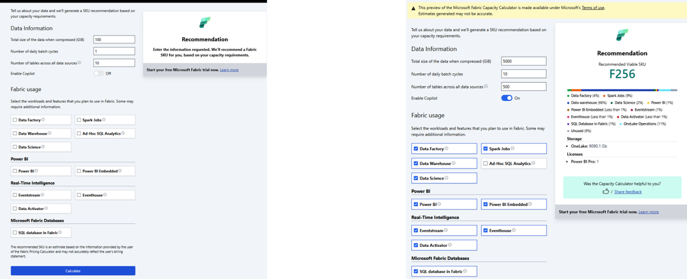

이 포스팅은 [Jonathan Garriss](hhttps://blog.fabric.microsoft.com/en-us/blog/author/Jonathan%20Garriss)님의 [Announcing New Recruitment for the Private Preview of Microsoft Fabric SKU Estimator
](https://blog.fabric.microsoft.com/en-us/blog/announcing-new-recruitment-for-the-private-preview-of-microsoft-fabric-sku-estimator) 글을 한글로 번역한 글입니다.

---

## 용량(Capacity) 계획과 최적화를 위한 고급 도구

유럽 패브릭 커뮤니티 컨퍼런스에서 처음 발표한 Microsoft Fabric Capacity Calculator를 발전시킨 Microsoft Fabric SKU Estimator의 비공개 미리 보기(private preview)를 공개하게 되어 기쁘게 생각합니다. 
많은 관심과 귀중한 피드백을 통해 이 강력한 도구를 더욱 개선하고 향상시킬 수 있었습니다.

## Microsoft Fabric SKU Estimator란 무엇인가요?

Microsoft Fabric SKU Estimator는 고객과 파트너가 용량 요구 사항을 정확하게 예측하고 필요에 맞는 적절한 SKU를 식별할 수 있도록 설계되었습니다. 
이 도구는 단순한 계산을 넘어 Data Factory, Data Warehouse, Data Engineering, Data Science, Power BI, Real-Time intelligence와 [Ignite 2024에서 소개된 새로운 Fabric Databases](https://aka.ms/Fabric-Databases-PuPr)와 같은 다양한 패브릭 워크로드에 대한 포괄적인 분석을 제공합니다.

## 주요 기능 및 개선 사항

초기 비공개 미리 보기에서 얻은 광범위한 피드백을 바탕으로 사용자의 다양한 요구 사항을 더 잘 충족할 수 있도록 Microsoft Fabric SKU Estimator를 파인튜닝 하였습니다. 
개선된 기능은, 더 정확한 용량 계산, 향상된 사용자 환경, 도구의 기능을 더 쉽게 탐색하고 이해할 수 있는 간소화된 인터페이스가 포함됩니다. 
또한, 워크로드별 사용량과 사용 가능한 여유 용량에 대한 자세한 분석이 포함되어 사용자가 리소스 할당과 최적화 기회를 더 명확하게 파악할 수 있습니다.

Microsoft Fabric SKU Estimator는 사용자가 필요한 용량을 예측하는데 도움이 되도록 다음 워크로드에 대한 포괄적인 분석을 제공합니다. 이러한 워크로드에는 다음이 포함됩니다:

**1. Data Engineering**
- Apache Spark를 사용한 원시 데이터 변환, 처리를 위한 대량 데이터 파이프라인.

**2. Data Factory**
- 데이터 이동 오케스트레이션, 수집, 관리.
- Dataflow gne2를 사용한 로우코드 변환.
- Azure Data Lake, Blob Storage, SQL 기반 소스 등과 같은 다양한 데이터 소스와의 통합.

**3. Data Warehouse**
- 전용 풀(dedicated pool), 온디맨드 쿼리 처리를 포함한 쿼리와 분석을 위한 대규모 병렬 처리(MPP) 아키텍처 기반의 확장 가능한 클라우드 데이터 웨어하우스

**4. Data Science**
- AI, 머신 러닝 모델 구축, 학습과 배포 기능

**5. OneLake**
- 빅데이터 워크로드를 위한 보안과 성능 최적화를 갖춘 계층적 관리형 SaaS 데이터 레이크

**6. Power BI와 Power BI Enbedded**
- 복잡한 대시보드, 대화형 보고서, 대규모 데이터 집합을 지원하는 데이터 시각화와 리포팅 기능

**7. Real-time intelligence**
- 높은 처리량과 짧은 지연 시간 워크로드를 지원하는 실시간 데이터 처리와 분석

**8. Microsoft Fabric Dataases**
- Microsoft Fabric 에코시스템 내에서 데이터 관리, 통합, 분석을 단순화하도록 설계된 통합되고 확장 가능한 데이터 솔루션

이러한 워크로드는 모두 Microsoft Fabric SKU Estimator에 포함되어 있어, 사용자는 데이터 요구 사항, 사용 패턴과 워크로드 조합에 따라 필요한 리소스를 정확하게 추정할 수 있습니다. 
이 도구를 통해 사용자는 정보에 입각한 결정을 내리고 인프라를 최적화 할 수 있습니다.

## 새로운 기능: Real-Tiem Intelligence와 Fabric의 데이터베이스 (이전 비공개 미리보기에서 현재까지)

이번 최신 업데이트에서는 Real-Time Intelligence(GA)와 Fabric의 데이터베이스(공개 미리보기)와 같은 새로운 워크로드를 도입했습니다. 
이러한 추가 기능은 Ignite 2024에서 처음 발표되었으며, 사용자가 용량 계획에 실시간 데이터 처리와 고급 데이터베이스 관리를 통합할 수 있도록 합니다. 
이 업데이트는 Microsoft Fabric을 개선하고 성장하고 진화하는 고객의 요구 사항을 해결하는 솔루션을 제공하려는 지속적인 노력을 반영합니다.

## 비공개 미리보기(private prewview) 참여 방법

현재 Microsoft Fabric SKU Estimator의 비공개 미리 보기를 신청 받고 있습니다. 
고객과 파트너가 이 도구에 미리 액세스하여 최종 릴리스에 반영될 피드백을 제공할 수 있는 좋은 기회입니다. 
등록하려면 다음 양식을 작성하여 주세요: [https://forms.office.com/r/vsnvtkNPJ3](https://forms.office.com/r/vsnvtkNPJ3) 

첫 번째 비공개 미리 보기에 등록한 고객과 파트너는 다시 등록하고 양식을 제출해야 이 비공개 미리 보기에 참여할 수 있습니다.

### 참여하기

모든 관심 있는 당사자가 이 비공개 미리보기에 참여하기를 권장합니다. 
여러분의 인사이트와 피드백은 여러분의 요구를 충족하고 기대치를 뛰어넘는 도구를 제공하는 데 매우 중요합니다. 
비공개 미리 보기에 참여하면, 혁신의 최전선에 서서 최첨단 기능을 가장 먼저 체험할 수 있습니다.
 
## 결론
Microsoft Fabric SKU Estimator는 최신 워크로드를 충족하는 향상된 정확도와 새로운 기능을 제공하는 용량 계획 도구의 중요한 발전을 나타냅니다. 
이러한 진화를 여러분과 공유하게 되어 기쁘게 생각하며, 비공개 미리 보기에 여러분의 많은 참여를 기대합니다. 
여러분과 함께 이 도구를 개선하고 완성하여 모든 사용자에게 비교할 수 없는 가치를 제공할 수 있도록 노력하겠습니다.

Microsoft 패브릭 도구에 대한 지속적인 지원과 관심에 감사 드립니다.