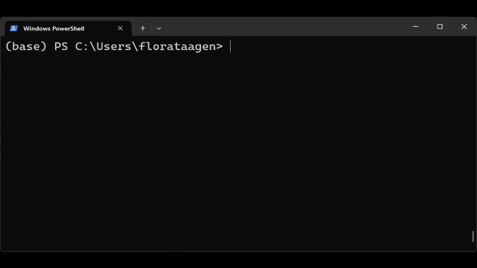

### 작성자 : [FloraTaagen](https://techcommunity.microsoft.com/users/florataagen/2623154)
### 원본 : [Azure Linux 3.0 now in preview on Azure Kubernetes Service v1.31](https://techcommunity.microsoft.com/blog/linuxandopensourceblog/azure-linux-3-0-now-in-preview-on-azure-kubernetes-service-v1-31/4287229)

Azure Kubernetes Service (AKS)의 차세대 Azure Linux 컨테이너 호스트인 Azure Linux 3.0이 AKS [version 1.31](https://kubernetes.io/blog/2024/08/13/kubernetes-v1-31-release/)에서 미리 보기로 제공됩니다. Azure Linux는 대략 3년 주기로 주요 구성 요소를 업그레이드하여 새로운 운영 체제 버전을 출시하게 됩니다. Azure Linux 3.0은 향상된 패키지 가용성과 버전, 커널 업데이트, 개선된 성능/보안/도구/개발자 경험 등을 제공합니다.

Azure Linux 2.0에서 3.0으로 업그레이드된 주요 구성 요소는 다음과 같습니다.


|**요소**|**Azure Linux 3.0**|**Azure Linux 2.0**|**릴리즈 노트**|
|---|---|---|---|
|Linux Kernel|v6.6 (최신 LTS)|v5.15(이전 LTS)|[Linux 6.6](https://kernelnewbies.org/Linux_6.6)|
|Containerd|v1.7.13, 안정화되면 v2.0도 제공할 예정|1.6.26|[Containerd 릴리즈](https://github.com/containerd/containerd/releases)|
|SystemD|v255|v250|[Systemd 릴리즈](https://github.com/systemd/systemd/releases)|
|OpenSSL|v3.3.0|v1.1.1k|[OpenSSl 3.3](https://www.openssl.org/news/openssl-3.3-notes.html)|

Azure Linux 3.0의 주요 기능 및 업데이트에 대한 자세한 내용은 [3.0 GitHub 릴리스 노트](https://github.com/microsoft/azurelinux/releases/tag/3.0.20240727-3.0)를 참고 하시기 바랍니다.

## Azure Linux 3.0 미리 보기 사용하기

AKS 버전 1.31에서 Azure Linux 3.0(미리보기)을 시작하려면, Azure 구독에서 Azure Linux 3.0 미리 보기 기능 플래그를 등록해야 합니다. 등록은 다음의 az cli 명령을 실행하면 가능합니다.

```
az feature register --namespace Microsoft.ContainerService --name AzureLinuxV3Preview
```

다음의 az cli 명령을 이용하여 등록 상태를 확인할 수 있습니다. *(등록됨으로 표시되기까지 수 분이 소요됩니다.)*

```
az feature show --namespace Microsoft.ContainerService --name AzureLinuxV3Preview
```



등록이 완료되면, '--os-sku=AzureLinux' 옵션으로 생성된 AKS 버전 1.31 클러스터 또는 노드 풀은 Azure Linux 3.0을 기본적으로 사용하게 됩니다.

Azure Linux 3.0 클러스터 또는 노드 풀은 다음의 방법을 이용하여 배포가 가능합니다:
- [CLI](https://learn.microsoft.com/en-us/azure/azure-linux/quickstart-azure-cli)
- [PowerShell](https://learn.microsoft.com/en-us/azure/azure-linux/quickstart-azure-powershell)
- [Terraform](https://learn.microsoft.com/en-us/azure/azure-linux/quickstart-terraform)
- [ARM](https://learn.microsoft.com/en-us/azure/azure-linux/quickstart-azure-resource-manager-template)

Azure Linux 3.0 미리보기를 시작하는 방법에 대한 자세한 방법에 대해서는 [다음의 문서](https://learn.microsoft.com/en-us/azure/azure-linux/how-to-enable-azure-linux-3)를 참고하세요.

## 고려 사항

- Azure Linux 3.0 Preview는 AKS 버전 1.31에서만 지원되고, AKS 버전 1.30 이하에서는 지원되지 않습니다. AKS 버전 1.30 이하에서 Azure Linux 3.0 Preview 기능 플래그를 등록하면 신규 AKS 클러스터와 노드 풀은 Azure Linux 2.0을 사용하게 됩니다.
- 미리 보기 기간 동안, Azure Linux 2.0을 실행하는 기존 클러스터 또는 노드 풀을 3.0으로 업그레이드할 수 없습니다. Azure Linux 3.0 미리 보기를 사용하려면, 새 노드 풀 또는 클러스터를 만들어야 합니다.
- 마지막으로, 미리 보기 기간 동안 Azure Linux 3.0에 대한 지원은 v20241025 릴리즈로 한정됩니다. 지역별 최신 버전 정보에 대해서는 [AKS Release Tracker](https://releases.aks.azure.com/webpage/index.html)를 참고하시기 바랍니다.

## Azure Linux 팀과 소통하는 방법:
미리 보기 기간 동안의 여러 분의 통찰과 피드백은 Azure Linux 팀에게는 매우 귀중한 정보이며, Azure Linux 3.0이 운영계 워크로드에 사용될 수 있도록 하는데 큰 도움이 됩니다. Azure Linux와 관련된 업데이트, 피드백, 기능 요청 방법은 다음과 같습니다. 

- Azure Linunx [GitHub Issues](https://github.com/microsoft/CBL-Mariner/issues)를 통하여 질문과 피드백 제출
- Azure Linux 사용자가 모여서 질문하고, 학습 내용을 공유하고, 업데이트를 받을 수 있는 공개 커뮤니티 콜을 2개월마다 실시합니다. 11월 21일 오전 8시 PST에 열리는 다음 커뮤니티 콜에 참여하세요: [여기](https://learn.microsoft.com/en-us/azure/azure-linux/support-help#stay-connected-with-azure-linux)
- 파트너 지원과 관련된 질문은 [AzureLinuxISV@microsoft.com](mailto:AzureLinuxISV@microsoft.com)로 문의하시기 바랍니다.

## 다음 단계:
미리보기 기간 동안 수집된 피드백을 통합하여 AKS 버전 1.32에서 Azure Linux 3.0의 GA를 준비할 계획입니다.

- 2024년 11월 6일 업데이트 됨.
- 2024년 12월 10일 번역 함. (by [JYSEONG(MSFT)](https://techcommunity.microsoft.com/users/ji%20yong%20seong/219866) / [GitHub](https://github.com/jiyongseong))