*본 글은* [Azure VMware Solution Recoverability Design Considerations](https://techcommunity.microsoft.com/t5/azure-migration-and/azure-vmware-solution-recoverability-design-considerations/ba-p/3746509) *의 많은 내용을 참고하였습니다.*

글로벌 기업이 애플리케이션 현대화 전략의 일환으로 수천 개의 VMware vSphere 가상 머신(VM)을 Microsoft Azure로 마이그레이션하려고 합니다. 첫 번째 단계는 온프레미스 데이터 센터를 종료하고 현대화 전략의 첫 번째 단계를 위한 스테이징 영역으로 레거시 애플리케이션 VM을 Azure VMware Solution(이하 AVS)으로 신속하게 이전하는 것입니다. AVS는 어떤 모습일까요?

[AVS](https://azure.microsoft.com/ko-kr/products/azure-vmware/)는 전용 베어메탈 Azure 인프라로 구축된 VMware vSphere 클러스터가 포함된 프라이빗 클라우드를 제공하는 Microsoft의 검증된 퍼스트 파티 Azure 서비스입니다. 이를 통해 고객은 VMware 기술 및 툴에 대한 기존 투자를 활용할 수 있으므로 Azure에서 VMware 기반 워크로드를 개발하고 실행하는 데 집중할 수 있습니다.

이 게시물에서는 일반적인 고객 워크로드 복구 가능성 요구 사항을 소개하고, AVS 아키텍처 구성 요소를 설명하며, AVS 프라이빗 클라우드의 복구 가능성 설계 고려 사항에 대해 설명합니다.

다음 섹션에서는 고객 워크로드의 일반적인 복구 가능성 요구 사항을 소개합니다.

***고객 비즈니스 연속성 요구사항***

일반적인 고객은 충족해야 하는 특정 서비스 수준 계약(SLA) 요건이 있는 여러 애플리케이션 티어를 보유하고 있습니다. 이러한 SLA는 일반적으로 플래티넘, 골드, 실버, 브론즈 또는 미션 크리티컬, 비즈니스 크리티컬, 프로덕션, 테스트/개발과 같은 티어링 시스템으로 명명됩니다. 각 SLA에는 충족해야 하는 가용성, 복구 가능성, 성능, 관리 용이성 및 보안 요구 사항이 다릅니다.

비즈니스 연속성을 고려한 설계의 경우, 고객은 일반적으로 복구 지점 목표(RPO), 복구 시간 목표(RTO), 업무 복구 시간(WRT), 최대 허용 다운타임(MTD) 및 각 SLA 수준을 정의하는 재해 복구 사이트 요구 사항과 함께 가동 시간 비율 요구 사항을 갖게 됩니다. 이는 일반적으로 고객의 비즈니스 연속성 계획(BCP)에 문서화되어 있습니다. 예를 들어

| SLA | 가동시간 | **RPO** | **RTO** | **WRT** | **MTD** | **DR Site** |
| --- | --- | --- | --- | --- | --- | --- |
| Gold | 99.999% (5.26분 다운타임/연) | 5분 | 3분 | 2분 | 5분 | 예 |
| Silver | 99.99% (52.6분 다운타임/연) | 1시간 | 20분 | 10분 | 30분 | 예 |
| Bronze | 99.9% (8.76분 다운타임/연) | 4시간 | 6 시간 | 2 시간 | 8 시간 | 아니오 |

표 1 – 비즈니스 연속성에 대한 일반적인 고객 SLA 요구 사항

표 1의 비즈니스 연속성 개념의 정의는 다음과 같습니다:

- 복구 지점 목표(Recovery Point Objective, RPO): 장애 발생 후 복원된 데이터의 최대 보존 기간을 정의합니다.
- 복구 시간 목표(Recovery Time Objective, RTO): 서비스를 복원하는 데 걸리는 최대 시간을 정의합니다.
- 작업 복구 시간(Work Recovery Time, WRT): 복구된 서비스를 온라인 상태로 전환하여 고객에게 다시 서비스를 제공하기 시작하는 데 걸리는 시간을 정의합니다.
- 최대 허용 다운타임(Maximum Tolerable Down time, MTD): 재해 복구 사이트에서 재해로부터 복구하여 비즈니스 서비스를 다시 시작하는 데 필요한 총 시간으로, RTO와 WRT의 합계입니다. 이 값은 연도별 SLA의 다운타임 값에 맞아야 합니다.

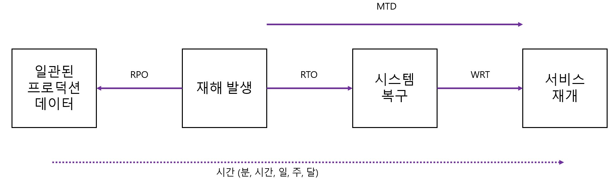

그림 1 – 복구 가능성 개념

일반적인 레거시용 비즈니스 크리티컬 애플리케이션의 아키텍처 구성요소는 다음과 같습니다.

- 로드 밸런서 계층: 로드 밸런서를 사용하여 웹 계층의 여러 웹 서버에 트래픽을 분산하여 애플리케이션 가용성을 개선합니다.
- 웹 계층: 웹 서버를 사용하여 HTTPS(보안 하이퍼텍스트 전송 프로토콜)를 통해 이루어진 클라이언트 요청을 처리합니다. 로드 밸런서 계층에서 트래픽을 수신하여 애플리케이션 계층으로 전달합니다.
- 애플리케이션 계층: 애플리케이션 서버를 사용하여 통신 프로토콜을 통해 비즈니스 애플리케이션을 제공하는 소프트웨어를 실행합니다. 웹 계층에서 트래픽을 수신하고 데이터베이스 계층을 사용하여 저장된 데이터에 액세스합니다.
- 데이터베이스 계층: 관계형 데이터베이스 관리 서비스(RDMS) 클러스터를 사용하여 데이터를 저장하고 애플리케이션 계층에 데이터베이스 서비스를 제공합니다.

각 서비스의 복구 가능성 요구 사항에 따라 재해 복구 보호 메커니즘은 수동 런북과 재해 복구 자동화 솔루션, 그리고 고객 SLA를 충족하기 위해 여러 리전에 연결된 복제 및 클러스터링 메커니즘을 혼합하여 사용할 수 있습니다.

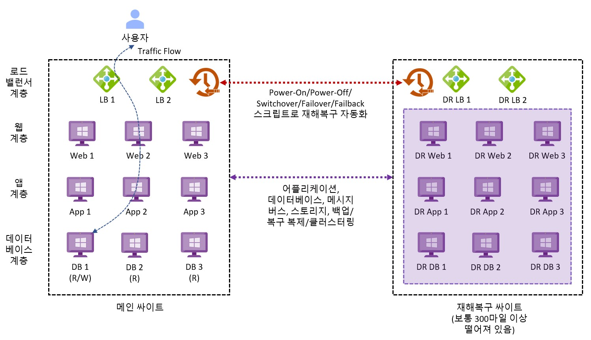

그림 2 - 일반적인 레거시 비즈니스 크리티컬 애플리케이션 아키텍처

다음 섹션에서는 AVS의 아키텍처 구성 요소를 소개합니다.

***아키텍처 구성요소***

아래 다이어그램은 AVS의 아키텍처 구성 요소를 보여줍니다.

그림 3 – AVS 아키텍처 구성요소

각 AVS 아키텍처 구성 요소는 다음과 같습니다.

- **Azure 구독**: AVS에 대한 접근 제어, 예산 및 할당량 관리를 제공하는 데 사용됩니다.
- **Azure 지역**: 데이터 센터를 AZ로 그룹화한 다음 AZ를 지역으로 그룹화하는 전 세계의 물리적 위치입니다.
- **Azure 리소스 그룹**: Azure 서비스 및 리소스를 논리적 그룹에 배치하는 데 사용되는 자원의 단위 컨테이너.
- **AVS 프라이빗 클라우드**: vCenter Server, NSX 소프트웨어 정의 네트워킹, vSAN 소프트웨어 정의 스토리지, Azure 베어메탈 ESXi 호스트를 포함한 VMware 소프트웨어를 사용하여 컴퓨팅, 네트워킹, 스토리지 리소스 등 VMware 전체 스택을 제공합니다. Azure NetApp Files, Azure Elastic SAN, 퓨어 클라우드 블록 스토어도 지원됩니다. VMware 환경을 Azure로 마이그레이션하거나 새로운 VMware 클라우드를 구축하고자 하는 고객에게 적합합니다.
- **AVS 리소스 클러스터**: AVS Private Cloud의 일부로, 특정 리소스를 할당하는 클러스터입니다. 특정 애플리케이션 또는 작업에 필요한 자원을 할당하고 관리하는 데 중점을 둡니다.vSAN 소프트웨어 정의 스토리지를 포함한 VMware 소프트웨어와 Azure 베어메탈 ESXi 호스트를 사용하여 AVS 프라이빗 클라우드를 확장함으로써 고객 워크로드를 위한 컴퓨팅, 네트워킹, 스토리지 리소스를 제공합니다. Azure NetApp Files, Azure Elastic SAN, 퓨어 클라우드 블록 스토어도 지원됩니다.
- **VMware HCX**: 모빌리티, 마이그레이션, 네트워크 확장 서비스를 제공합니다.
- **VMware 사이트 복구**: 재해 복구 자동화 및 VMware vSphere Replication을 통한 스토리지 복제 서비스를 제공합니다. 타사 재해 복구 솔루션인 Zerto DR 및 JetStream DR도 지원됩니다.
- **전용 Microsoft 엔터프라이즈 엣지(D-MSEE)**: Azure 클라우드와 AVS 프라이빗 클라우드 인스턴스 간의 연결을 제공하는 라우터입니다.
- **Azure 가상 네트워크(VNet)**: Azure 서비스 및 리소스를 함께 연결하는 데 사용되는 프라이빗 네트워크.
- **Azure 라우트 서버**: 네트워크 어플라이언스가 Azure 네트워크와 동적 라우팅 정보를 교환할 수 있도록 합니다.
- **Azure 가상 네트워크 게이트웨이**: Azure 서비스 및 리소스를 다른 프라이빗 네트워크에 연결하기 위한 온-프레미스 간 게이트웨이로, IPSec VPN, ExpressRoute 및 VNet-to-VNet을 사용합니다.
- **Azure ExpressRoute**: Azure 데이터 센터와 온-프레미스 또는 코로케이션 인프라 간에 고속 프라이빗 연결을 제공합니다.
- **Azure 가상 WAN(vWAN)**: 네트워킹, 보안 및 라우팅 기능을 하나의 통합된 WAN(광역 네트워크)으로 통합합니다.

다음 섹션에서는 AVS의 비즈니스 연속성 디자인 고려 사항에 대해 설명합니다.

***비즈니스 연속성 디자인 고려사항***

아키텍처 디자인 프로세스는 해결해야 할 비즈니스 문제와 달성해야 할 비즈니스 목표를 파악하고 이를 고객 요구 사항, 설계 제약 조건 및 가정으로 추출합니다. 디자인 제약 조건은 다음 세 가지 범주로 특징 지을 수 있습니다:- 공간 제약의 법칙: 데이터 및 애플리케이션 주권, 거버넌스, 규제, 규정 준수 등 - 물리 법칙 : 데이터 및 기계 중력, 네트워크 지연 시간 등 - 경제학의 법칙 : 소유 Vs 임대, 총소유비용(TCO), 투자 수익률(ROI), 자본 지출, 운영 지출, 이자, 세금, 감가상각비, 상각 전 영업이익(EBITDA) 등입니다.

각 디자인 고려 사항은 가용성, 비즈니스 연속성, 성능, 관리 용이성 및 보안 디자인 품질 간의 절충점이 될 것입니다. 바람직한 결과는 고객의 목표로부터 출발하여 최소한의 위험으로 비즈니스 가치를 제공하는 것입니다.

**디자인 고려 사항 1 - Azure 리전**: AVS는 전 세계 30개 Azure 리전에서 제공됩니다(미국 정부에는 2개의 추가 Azure 리전이 있음). 지리적 요구 사항을 충족하는 관련 Azure 지역을 선택하십시오. 이러한 위치는 일반적으로 설계 제약 조건과 재해 복구 사이트가 기본 사이트와 떨어져 있어야 하는 필수 거리에 따라 결정됩니다. 기본 사이트는 온-프레미스, 코로케이션 또는 퍼블릭 클라우드에 위치할 수 있습니다.

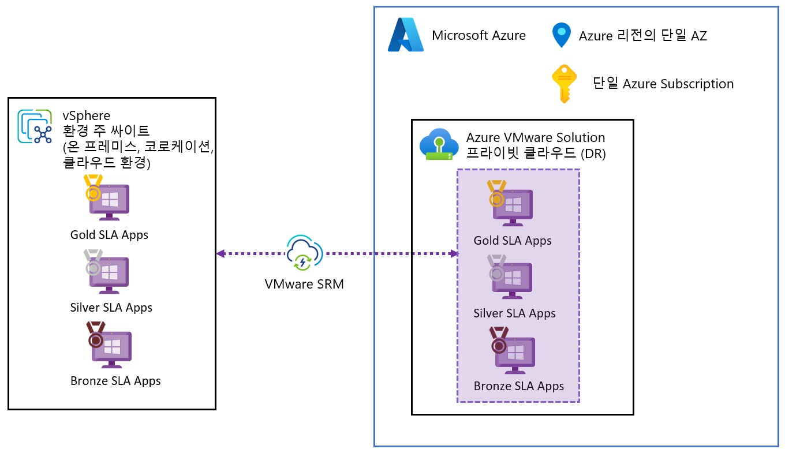

그림 4 – 재해 복구를 위한 AVS 리전

**디자인 고려 사항 2 - 배포 토폴로지**: SLA의 가동 시간 및 지리적 요구 사항에 가장 적합한 AVS 재해 복구 포드 토폴로지를 선택합니다. 대규모 배포의 경우 비용 효율성을 위해 각 SLA 전용 재해 복구 포드(프라이빗 클라우드)를 별도로 사용하는 것이 좋을 수 있습니다.

관리 및 제어 플레인 클러스터(클러스터-1)는 고객 워크로드 VM과 공유하거나 Active Directory, DNS 및 DHCP와 같은 고객 엔터프라이즈 서비스를 포함한 관리 및 제어 전용 클러스터가 될 수 있습니다. 고객 워크로드 수요를 지원하기 위해 추가 리소스 클러스터를 추가할 수 있습니다. 여기에는 각 고객 SLA에 대해 별도의 클러스터를 사용하는 옵션도 포함됩니다.

재해 복구 설계의 모범 사례는 각 보호된 사이트가 재해 복구 Azure 리전에서 일치하는 프라이빗 클라우드를 갖는 포드 아키텍처를 따르는 것입니다. 운영 간소화를 위해 복잡한 메시 토폴로지는 피해야 합니다.

필요한 워크로드 서비스 수준 협약 값은 적절한 복구 지점 목표(RPO) 및 복구 시간 목표(RTO)에 매핑 되어야 하며, 이해하기 쉬운 명명 규칙을 사용해야 합니다. 예를 들어 골드, 실버 및 브론즈 또는 티어 1, 티어 2 및 티어 3이 있습니다. 각 파드는 운영의 단순성을 위해 SLA 기능으로 지정해야 합니다. 소규모의 경우, 프라이빗 클라우드가 아닌 클러스터별로 포드 개념을 사용할 수 있습니다.

재해 복구 포드는 정상 상태에서 필요한 복제된 스토리지 용량을 지원하도록 프로비저닝됩니다. 재해가 선언되면 필요한 컴퓨팅 리소스가 프라이빗 클라우드에 추가됩니다. 이 과정은 [Auto-Scale function with Azure Automation Accounts and PowerShell Runbooks](https://github.com/Azure/azure-vmware-solution/tree/main/avs-autoscale) 을 사용하여 자동화하도록 구성할 수 있습니다.

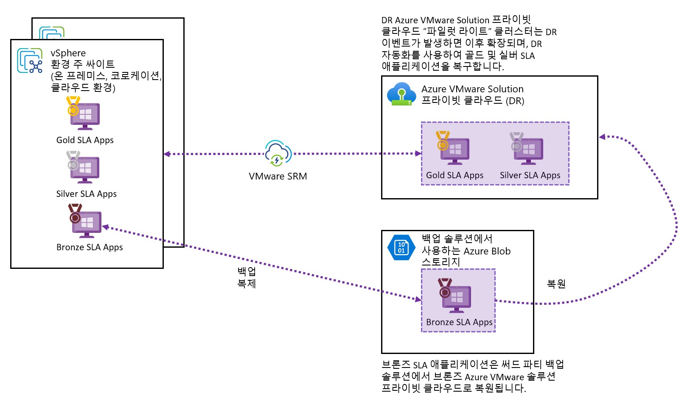

그림 5 – AVS DR 공유 서비스

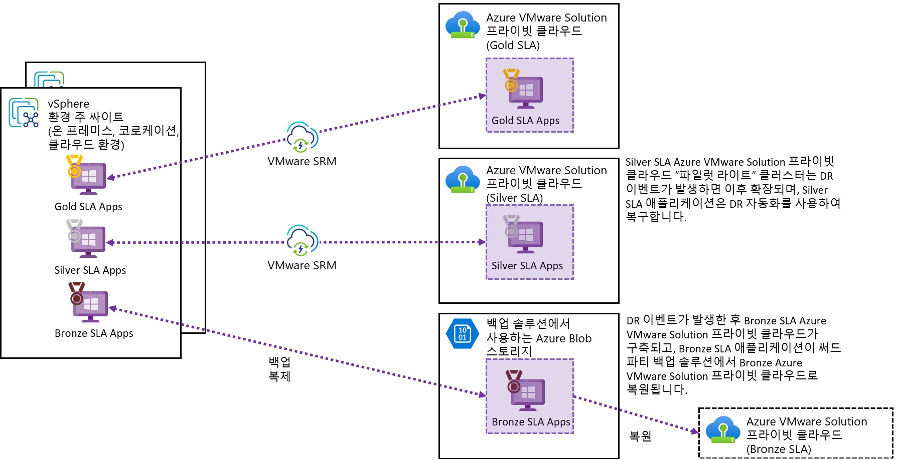

그림 6 – AVS 전용 DR 파드

**디자인 고려 사항 3 - 재해 복구 솔루션**: AVS는 다음과 같은 퍼스트 파티 및 타사 재해 복구 솔루션을 지원합니다. 복구 가능성 및 비용 효율성 요구 사항에 따라 아래 표 2에서 최적의 솔루션을 선택할 수 있습니다.

비용 효율성을 위해 일일 스냅샷을 재해 복구 사이트에 백업 복제하거나 VMware HCX(솔루션 4)의 재해 복구 복제 기능을 사용하여 최상의 노력 RPO 및 RTO를 충족할 수 있습니다.

이러한 솔루션이 실행 가능하지 않은 경우 애플리케이션, 데이터베이스 또는 메시지 버스 클러스터링을 옵션으로 고려할 수도 있습니다.

| **Solution** | **RPO** | **RTO** | **DR Automation** |
| --- | --- | --- | --- |
| 1. VMware Site Recovery | 5min – 24hr | Minutes | Yes, with Protection Groups & Recovery Plans |
| 2. Zerto DR | Seconds | Minutes | Yes, with Virtual Protection Groups (VPGs) |
| 3. JetStream Software DR | Seconds | Minutes | Yes, with Protection Domains, Runbooks & Runbook Groups |
| 4. VMware HCX | 5min – 24hr | Hours | No, manual process only |

| **솔루션** | **RPO** | **RTO** | **DR 자동화** |
| --- | --- | --- | --- |
| 1. VMware Site Recovery | 5분 – 24시간 | 수 분 | 있음. Protection Groups & Recovery Plans 사용 |
| 2. Zerto DR | 수 초 | 수 분 | 있음. Virtual Protection Groups (VPGs) 사용 |
| 3. JetStream Software DR | 수 초 | 수 분 | 있음. Protection Domains, Runbooks & Runbook Groups 사용 |
| 4. VMware HCX | 5분 – 24시 | 수 시 | 없음. 수작업만 적용 |

 표 2 – 재해복구 벤더별 제품

참고: [Azure Site Recovery를 사용하여 AVS를 보호할 수 있지만](https://learn.microsoft.com/ko-kr/azure/site-recovery/avs-tutorial-prepare-azure?context=%2Fazure%2Fazure-vmware%2Fcontext%2Fcontext), 여기서는 온-프레미스 VMware vSphere 솔루션을 보호하는 방법을 설명하기 때문에 여기에 나열되지 않았습니다.

*솔루션 1* - [VMware Site Recovery](https://learn.microsoft.com/ko-kr/azure/azure-vmware/disaster-recovery-using-vmware-site-recovery-manager)는 VMware SRM 가상 어플라이언스, VMware vSphere 복제 및 VMware vSAN을 통해 5분~24시간의 RPO로 재해 복구 자동화를 지원합니다. 현재 Azure NetApp Files와 함께 VMware Site Recovery를 사용하는 것은 지원되지 않습니다. VMware Site Recovery를 사용하여 솔루션을 설계할 때는 이러한 [AVS 제한 사항](https://learn.microsoft.com/ko-kr/azure/azure-resource-manager/management/azure-subscription-service-limits#azure-vmware-solution-limits)을 고려해야 합니다.

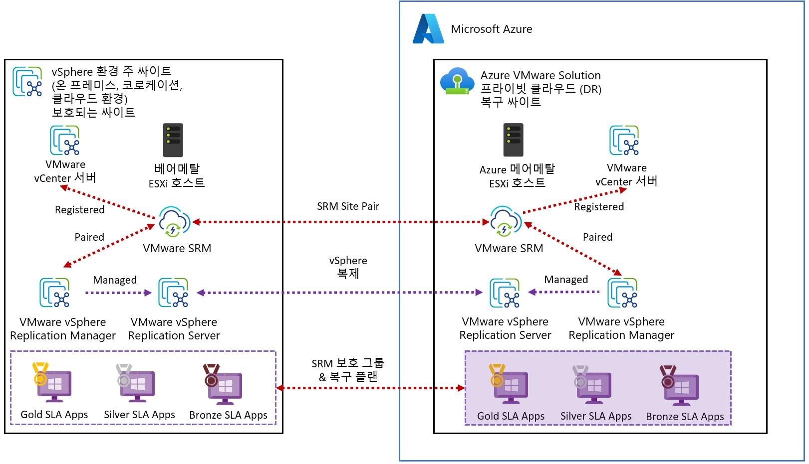

그림 7 – VMware Site Recovery Manager를 사용한 AVS

*솔루션 2* - [Zerto Disaster Recovery](https://learn.microsoft.com/ko-kr/azure/azure-vmware/deploy-zerto-disaster-recovery)는 연속 복제를 사용하여 초 단위의 RPO로 재해 복구 자동화를 지원하는 Zerto Virtual Manager(ZVM), Zerto Virtual Replication Appliance(ZVRA) 및 VMware vSAN을 지원합니다. Zerto Disaster Recovery로 솔루션을 설계할 때는 이 [Zerto 아키텍처 가이드](https://www.zerto.com/wp-content/uploads/2020/02/Zerto-Architecture-Guide.pdf)를 고려해야 합니다.

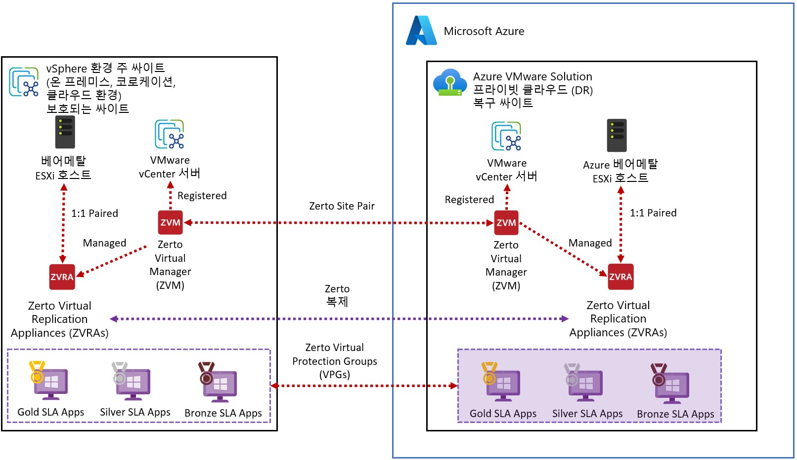

그림 8 – Zerto Disaster Recovery를 사용한 AVS

*솔루션 3* – [JetStream 소프트웨어 재해 복구](https://learn.microsoft.com/ko-kr/azure/azure-vmware/deploy-disaster-recovery-using-jetstream)는 JetStream 매니저 가상 어플라이언스(MSA), JetStream DR 가상 어플라이언스(DRVA) 및 VMware vSAN과 함께 연속 복제를 사용하여 초 단위의 RPO로 재해 복구 자동화를 지원합니다. JetStream 소프트웨어 재해 복구로 솔루션을 설계할 때는 이러한 [JetStream 소프트웨어 리소스를 고려](https://jetstreamsoft.com/product-portfolio/jetstream-dr/)해야 합니다.

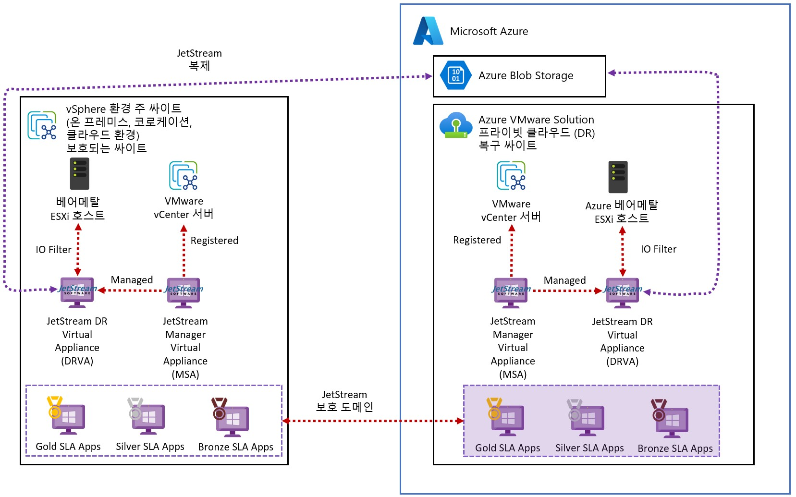

그림 9 – JetStream Software Disaster Recovery를 사용한 AVS

*솔루션 4* - *VMware HCX Disaster Recovery는* VMware HCX Manager, VMware vSphere Replication 및 VMware vSAN에서 5분~24시간의 RPO로 수동 재해 복구를 지원합니다. VMware HCX를 사용하여 솔루션을 설계할 때는 이러한 [AVS 제한 사항을 고려해야 합니다.](https://learn.microsoft.com/ko-kr/azure/azure-resource-manager/management/azure-subscription-service-limits#azure-vmware-solution-limits)

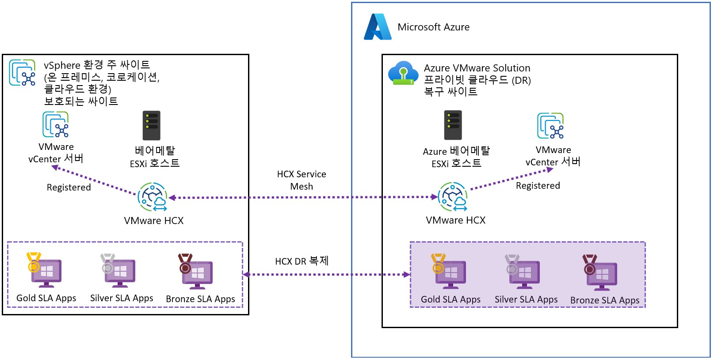

그림 10 –VMware HCX Disaster Recovery를 사용한 AVS

**디자인 고려 사항 4 - SKU 유형:** AVS 프라이빗 클라우드 프로비저닝을 위해 세 가지 SKU 유형을 선택할 수 있습니다. 재해 복구 사이트에서는 비용 효율성을 위해 최소한의 스토리지 리소스로 파일럿 소규모 클러스터를 구축하기 위해 더 작은 AV36 SKU를 사용할 수 있으며, 기본 사이트에서는 더 크고 더 비싼 AV36P 및 AV52 SKU를 사용할 수 있습니다.

AV36 SKU는 대부분의 Azure 지역에서 광범위하게 사용 가능하며 AV36P 및 AV52 SKU는 특정 Azure 지역으로 제한됩니다. AVS는 프라이빗 클라우드 내에서 서로 다른 SKU 유형을 혼합하는 것을 지원하지 않습니다(AV64 SKU는 예외). [Azure 지역별 AVS SKU 사용 가능 여부는 여기에서 확인할 수 있습니다.](https://azure.microsoft.com/ko-kr/explore/global-infrastructure/products-by-region/?products=azure-vmware)

[AV64 SKU](https://learn.microsoft.com/ko-kr/azure/azure-vmware/introduction#azure-vmware-solution-private-cloud-extension-with-av64-node-size)는 현재 특정 지역에서만 혼합 SKU 배포에 사용할 수 있습니다.

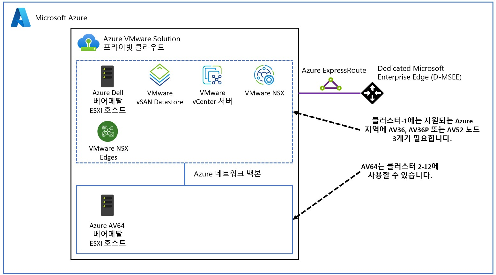

그림 11 – AV64 혼합 SKU 토폴로지

**디자인 고려 사항 5 - 런북 애플리케이션 그룹:** 애플리케이션 종속성 평가가 완료되면 이 데이터를 사용하여 런북 애플리케이션 그룹을 생성하여 재해 발생 시 애플리케이션 SLA를 충족할 수 있도록 합니다. 애플리케이션 종속성 평가가 불완전한 경우 애플리케이션 아키텍처 팀과 IT 운영팀의 프로세스 지식을 사용하여 런북 애플리케이션 그룹을 처음부터 설계할 수 있습니다. 이 아이디어는 각 애플리케이션이 런북 아키텍처와 작업 순서를 사용하여 애플리케이션을 완전하고 일관되게 복구할 수 있는 런북에 캡처하는 것입니다.

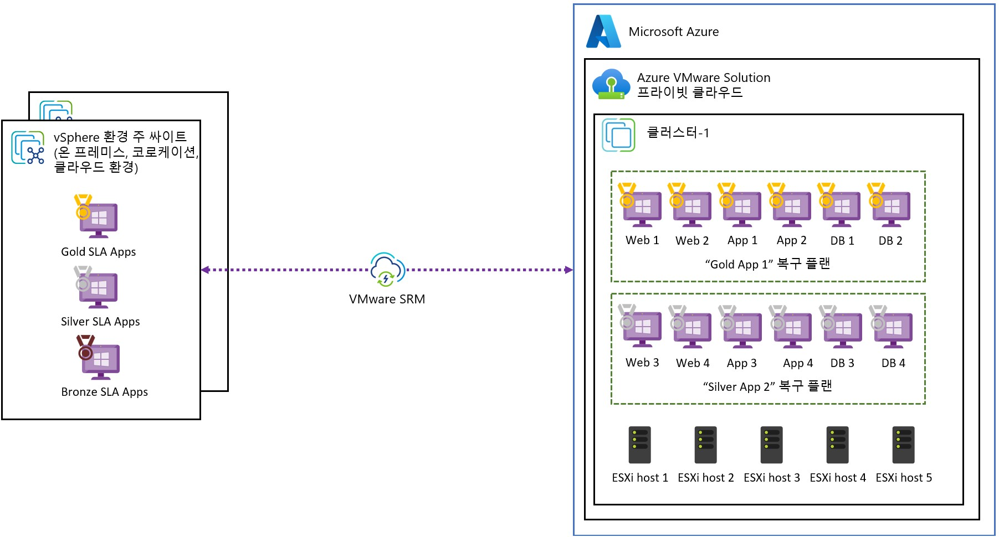

그림 12 – VMware Site Recovery 어플리케이션 복구 플랜

**디자인 고려 사항 6- 스토리지 정책:** 표 3은 VMware vSAN과 함께 사용할 수 있는 사전 정의된 VM 스토리지 정책입니다. 고객 워크로드 SLA에 맞게 정책별 적절한 독립 디스크 중복 배열(RAID) 및 내결함성 장애(FTT) 설정을 고려해야 합니다. 각 정책에는 가용성, 성능, 용량 및 비용 간의 절충점을 고려해야 합니다.

표준 클러스터에 노드가 6개 이상인 경우, AVS SLA를 준수하려면 클러스터에 FTT=2 스토리지 정책을 사용해야 합니다. 또한 백엔드 vSAN 작업을 위해 최소 25%의 여유 공간을 유지해야 합니다.

| **배포 타입** | **정책 이름** | **RAID** | **Failures to Tolerate (FTT)** | **Site** |
| --- | --- | --- | --- | --- |
| Standard | RAID-1 FTT-1 | 1 | 1 | N/A |
| Standard | RAID-1 FTT-2 | 1 | 2 | N/A |
| Standard | RAID-1 FTT-3 | 1 | 3 | N/A |
| Standard | RAID-5 FTT-1 | 5 | 1 | N/A |
| Standard | RAID-6 FTT-2 | 6 | 2 | N/A |
| Standard | VMware Horizon | 1 | 1 | N/A |

표 3 – VMware vSAN 스토리지 정책

**디자인 고려 사항 7 - 네트워크 연결:** Azure 방화벽 및 타사 네트워크 가상화 어플라이언스를 사용하는 허브 스포크 및 가상 WAN과 같은 다양한 Azure 가상 네트워킹 토폴로지를 포함하여 IPSec VPN 및 Azure ExpressRoute 회로를 사용하여 AVS 프라이빗 클라우드를 연결할 수 있습니다. 자세한 내용은 [AVS 네트워킹 및 상호 연결 개념](https://learn.microsoft.com/ko-kr/azure/azure-vmware/concepts-networking) 을 참조하세요. AVS 클라우드 채택 프레임워크에는 [고려할 수 있는 네트워크 시나리오 예시도](https://learn.microsoft.com/ko-kr/azure/cloud-adoption-framework/scenarios/azure-vmware/example-architectures) 있습니다 [.](https://learn.microsoft.com/en-us/azure/cloud-adoption-framework/scenarios/azure-vmware/example-architectures)

**디자인 고려 사항 8 - 계층 2 네트워크 확장:** VMware HCX를 사용하여 사이트 간에 동일한 IP 주소 스키마를 유지하기 위한 레이어 2 네트워크 확장 기능을 제공할 수 있습니다.

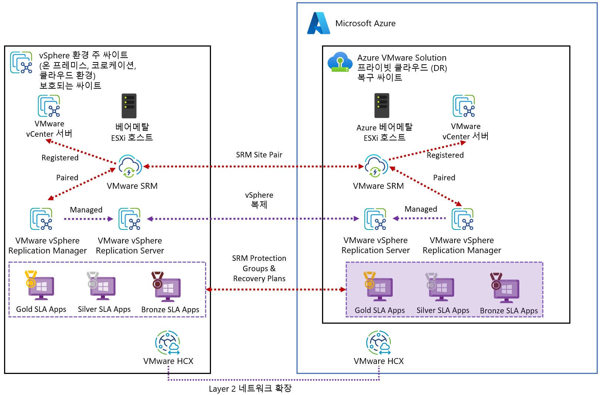

그림 13 – VMware Site Recovery를 통한 VMware HCX 레이어 2 네트워크 확장

**디자인 고려 사항 9 - 패턴 방지:** 복구 가능성 디자인에 다음과 같은 안티 패턴을 사용하지 않는 게 좋습니다.

*안티 패턴 1 - 스트레치 클러스터:* AVS 스트레치 클러스터는 RPO 0 요구 사항을 충족하는 유일한 옵션입니다. 스트레치 클러스터는 이중 가용 영역(AZ)에서 실행되는 관리 및 제어 플레인을 위한 단일 장애 도메인이므로 재해 복구가 아닌 가용성 솔루션으로 간주된다는 점을 기억하세요. GA된 AVS 확장 클러스터는 현재 VMware Site Recovery 애드온을 지원하지 않습니다.

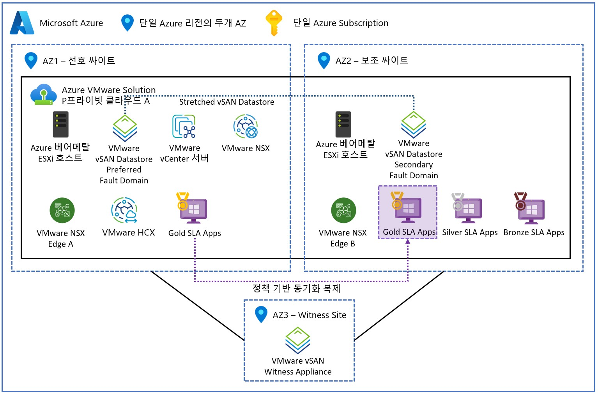

그림 14 – 확장된 클러스터를 갖춘 AVS 프라이빗 클라우드

*안티-패턴 2 - 랜섬웨어 보호:* 재해 복구 자동화 솔루션은 랜섬웨어 공격에 대한 보호 기능을 제공하지 않습니다. 랜섬웨어 보호를 위해서는 격리된 보안 영역에서 일련의 데이터 복원을 필터링하여 특정 시점의 복사본에 랜섬웨어가 없는지 검증하는 추가 보안 기능이 필요합니다. 이 프로세스는 수개월이 걸릴 수 있으며 수개월 또는 수년이 지난 데이터 백업에 액세스해야 합니다. 랜섬웨어 공격자의 금전 요구는 오랜 정찰의 결과일 뿐입니다. 항상 모든 시스템에 활성 보안 취약점과 스파이웨어 에이전트가 있는지 확인해야 합니다.

재해 복구 자동화는 시스템에 랜섬웨어가 존재하지 않으며 데이터 손상이 재해 복구 사이트에 복제되지 않았다고 가정합니다. 하지만 일부 재해 복구 자동화 공급업체는 솔루션의 일부로 활용할 수 있는 랜섬웨어 보호 기능을 제공합니다.

다음 섹션에서는 이 높은 수준의 디자인 견적을 검증된 세부 디자인으로 발전시키기 위해 수행해야 할 다음 단계에 대해 설명합니다.

***추후 단계***

AVS 사이징 견적은 Azure Migrate를 사용하여 평가해야 합니다. 전략적 및 주요 고객을 위한 대규모 엔터프라이즈 솔루션의 경우, 최소한의 위험으로 비즈니스 가치를 제공할 수 있도록 솔루션의 크기가 올바르게 설정되었는지 확인하기 위해 Azure, VMware 또는 신뢰할 수 있는 VMware 파트너의 AVS 설계자가 참여해야 합니다. 여기에는 애플리케이션 그룹 간의 매핑을 이해하고 데이터 중력 영역, 애플리케이션 네트워크 트래픽 흐름 및 네트워크 지연 시간 종속성을 식별하기 위한 애플리케이션 종속성 평가도 포함되어야 합니다.

***마무리***

이 게시물에서는 고객 워크로드의 일반적인 복구 가능성 요구 사항, 아키텍처 구성 요소 및 AVS의 복구 가능성 설계 고려 사항에 대해 자세히 살펴보았습니다. 또한 AVS 설계를 계속하기 위한 다음 단계에 대해서도 논의했습니다.

***참고 싸이트:***

- Homepage: [Azure VMware Solution](https://azure.microsoft.com/en-us/products/azure-vmware/)
- Documentation: [Azure VMware Solution](https://learn.microsoft.com/en-us/azure/azure-vmware/)
- SLA: [SLA for Azure VMware Solution](https://azure.microsoft.com/en-us/support/legal/sla/azure-vmware/v1_1/)
- Azure Regions: [Azure Products by Region](https://azure.microsoft.com/en-us/explore/global-infrastructure/products-by-region/?products=azure-vmware)
- Service Limits: [Azure VMware Solution subscription limits and quotas](https://learn.microsoft.com/en-us/azure/azure-resource-manager/management/azure-subscription-service-limits#azure-vmware-solution-limits)
- VMware Site Recovery: [Deploy disaster recovery with VMware Site Recovery Manager](https://learn.microsoft.com/en-us/azure/azure-vmware/disaster-recovery-using-vmware-site-recovery-manager)
- Zerto DR: [Deploy Zerto disaster recovery on Azure VMware Solution](https://learn.microsoft.com/en-us/azure/azure-vmware/deploy-zerto-disaster-recovery)
- Zerto DR: [Architecture Guide](https://www.zerto.com/wp-content/uploads/2020/02/Zerto-Architecture-Guide.pdf)
- JetStream Software DR: [Deploy disaster recovery using JetStream DR](https://learn.microsoft.com/en-us/azure/azure-vmware/deploy-disaster-recovery-using-jetstream)
- VMware HCX DR: [Deploy disaster recovery using VMware HCX](https://learn.microsoft.com/en-us/azure/azure-vmware/deploy-disaster-recovery-using-vmware-hcx)
- Stretched Clusters (Public Preview): [Deploy vSAN stretched clusters](https://learn.microsoft.com/en-us/azure/azure-vmware/deploy-vsan-stretched-clusters)
- SKU types: [Introduction](https://learn.microsoft.com/en-us/azure/azure-vmware/introduction)
- Storage policies: [Configure storage policy](https://learn.microsoft.com/en-us/azure/azure-vmware/configure-storage-policy)
- GitHub repository: [Azure/azure-vmware-solution](https://github.com/Azure/azure-vmware-solution/)
- Well-Architected Framework: [Azure VMware Solution workloads](https://learn.microsoft.com/en-us/azure/well-architected/azure-vmware/)
- Cloud Adoption Framework: [Introduction to the Azure VMware Solution adoption scenario](https://learn.microsoft.com/en-us/azure/cloud-adoption-framework/scenarios/azure-vmware/)
- Network connectivity scenarios: [Enterprise-scale network topology and connectivity for Azure VMware Solution](https://learn.microsoft.com/en-us/azure/cloud-adoption-framework/scenarios/azure-vmware/eslz-network-topology-connectivity)
- Enterprise Scale Landing Zone: [Enterprise-scale for Microsoft Azure VMware Solution](https://learn.microsoft.com/en-us/azure/cloud-adoption-framework/scenarios/azure-vmware/enterprise-scale-landing-zone)
- Enterprise Scale GitHub repository: [Azure/Enterprise-Scale-for-AVS](https://github.com/Azure/Enterprise-Scale-for-AVS)
- Azure CLI: [Azure Command-Line Interface (CLI) Overview](https://learn.microsoft.com/en-us/cli/azure/)
- PowerShell module: [Az.VMware Module](https://learn.microsoft.com/en-us/powershell/module/az.vmware/?view=azps-9.0.1)
- Azure Resource Manager: [Microsoft.AVS/privateClouds](https://learn.microsoft.com/en-us/azure/templates/microsoft.avs/privateclouds?pivots=deployment-language-bicep)
- REST API: [Azure VMware Solution REST API](https://learn.microsoft.com/en-us/rest/api/avs/)
- Terraform provider: [azurerm_vmware_private_cloud Terraform Registry](https://registry.terraform.io/providers/hashicorp/azurerm/latest/docs/resources/vmware_private_cloud)
