*본 글은* [Azure VMware Solution Performance Design Considerations](https://techcommunity.microsoft.com/blog/azuremigrationblog/azure-vmware-solution-performance-design-considerations/3903291) *의 많은 내용을 참고하였습니다.*

고객께서 애플리케이션 현대화 전략의 일환으로 수천 개의 VMware vSphere 가상 머신(VM)을 Microsoft Azure로 마이그레이션하고자 하는 계획이 있을 때, 온프레미스 데이터 센터를 종료하고 애플리케이션 VM을 Azure VMware Solution(이하 AVS)으로 신속하게 이전하는 것부터 시작할 수 있습니다.

[AVS](https://azure.microsoft.com/ko-kr/products/azure-vmware/)는 전용 베어메탈 Azure 인프라로 구축된 VMware vSphere 클러스터가 포함된 프라이빗 클라우드를 제공하는 Microsoft의 검증된 퍼스트 파티 Azure 서비스입니다. 이를 통해 고객은 VMware 기술 및 툴에 대한 기존 투자를 활용할 수 있으므로 Azure에서 VMware 기반 워크로드를 개발하고 실행하는 데 집중할 수 있습니다.

이 게시물에서는 일반적인 고객 워크로드 성능 요구 사항을 소개하고, AVS 아키텍처 구성 요소를 설명하고, AVS 프라이빗 클라우드의 성능 설계 고려 사항에 대해 설명합니다.

우선 고객 워크로드의 일반적인 성능 요구 사항부터 시작하겠습니다.

***고객 성능 요구사항***

대부분의 고객은 충족해야 하는 특정 서비스 수준 계약(SLA) 요건이 있는 여러 애플리케이션 계층들을 보유하고 있습니다. 이러한 SLA는 일반적으로 플래티넘, 골드, 실버, 브론즈 또는 미션 크리티컬, 비즈니스 크리티컬, 프로덕션, 테스트/개발과 같은 티어링 시스템으로 명명됩니다. 각 SLA별로 충족해야 하는 가용성, 복구 가능성, 성능, 관리 용이성 및 보안 요구 사항이 다릅니다.

성능 설계 품질을 위해 고객은 일반적으로 CPU, RAM, 스토리지 및 네트워크 요구 사항이 있습니다. 이는 일반적으로 각 애플리케이션에 대해 문서화한 후 각 SLA에 대한 총 성능 요구 사항으로 집계합니다. 예를 들어

| **SLA Name** | **CPU** | **RAM** | **스토리지** | **네트워크** |
| --- | --- | --- | --- | --- |
| Gold | Low vCPU:pCore ratio (<1 to 2),
Low VM to Host ratio (1-8) | No RAM oversubscription (<=1) | High Throughput or High IOPS (for a particular I/O size), Low Latency | High Throughput, Low Latency |
| Silver | Medium vCPU:pCore ratio (3 to 10),
Medium VM to Host ratio (9-15) | Medium RAM oversubscription ratio (1.1-1.4) | Medium Latency | Medium Latency |
| Bronze | High vCPU:pCore ratio (10-15), High VM to Host ratio (16+) | High RAM oversubscription ratio (1.5-2.5) | High Latency | High Latency |

표 1 – 성능에 대한 일반적인 고객 SLA 요구 사항

표 1에 소개된 성능 개념은 각 항목에서 여러가지 요소를 가지고 있습니다.

- CPU: CPU 모델 및 속도(레거시 단일 스레드 애플리케이션의 경우 중요할 수 있음), 코어 수, vCPU 대 물리적 코어 비율, CPU 준비 시간.
- 메모리: 랜덤 액세스 메모리 크기, 입출력(I/O) 속도 및 지연 시간, 초과 구독 비율.
- 스토리지: 용량, 초당 읽기/쓰기 입출력(I/O) 크기, 읽기/쓰기 처리량, 읽기/쓰기 입출력 지연 시간.
- 네트워크: 네트워크: 입/출력 속도, 네트워크 지연 시간(왕복 시간).

일반적인 레거시용 비즈니스 크리티컬 애플리케이션의 아키텍쳐 구성요소는 다음과 같습니다.

- 로드 밸런서 계층: 로드 밸런서를 사용하여 웹 계층의 여러 웹 서버에 트래픽을 분산하여 애플리케이션 가용성을 개선합니다.
- 웹 계층: 웹 서버를 사용하여 HTTPS(보안 하이퍼텍스트 전송 프로토콜)를 통해 이루어진 클라이언트 요청을 처리합니다. 로드 밸런서 계층에서 트래픽을 수신하여 애플리케이션 계층으로 전달합니다.
- 애플리케이션 계층: 애플리케이션 서버를 사용하여 통신 프로토콜을 통해 비즈니스 애플리케이션을 제공하는 소프트웨어를 실행합니다. 웹 계층에서 트래픽을 수신하고 데이터베이스 계층을 사용하여 저장된 데이터에 액세스합니다.
- 데이터베이스 계층: 관계형 데이터베이스 관리 서비스(RDMS) 클러스터를 사용하여 데이터를 저장하고 애플리케이션 계층에 데이터베이스 서비스를 제공합니다.

이 애플리케이션은 OLTP 또는 OLAP으로 분류할 수도 있으며,각각 다음과 같은 특징을 가집니다:

- 온라인 트랜잭션 처리(Online Transaction Processing : OLTP)는 동시에 발생하는 여러 트랜잭션을 실행하는 데이터 처리의 한 유형입니다. 예를 들어 온라인 뱅킹, 온라인 쇼핑, 문자 메시지 전송 등이 이에 해당합니다. OLTP 시스템은 소량의 데이터를 읽고 쓰면서 지연 시간에 민감하고 CPU 요구 사항이 고르지 않은 성능 프로필을 갖는 경향이 있습니다.
- 온라인 분석 처리(Online Analytical Processing : OLAP)는 대규모 비즈니스 데이터베이스를 구성하고 복잡한 분석을 지원하는 기술입니다. 트랜잭션 시스템(OLTP)에 부정적인 영향을 미치지 않고 복잡한 분석 쿼리를 수행하는 데 사용할 수 있습니다. 예를 들어 데이터 웨어하우스 시스템, 비즈니스 성과 분석 또는 마케팅 분석이 여기에 해당합니다. OLAP 시스템은 지연 시간이 길고, 레코드 처리를 위해 많은 양의 스토리지가 필요하며, CPU, RAM 및 스토리지 처리량이 안정된 상태의 성능 프로필을 갖는 경향이 있습니다.

각 서비스의 성능 요구 사항에 따라 인프라 설계는 비용 효율성과 함께 다양한 성능 SLA를 충족하는 데 사용되는 기술을 혼합하여 구성할 수 있습니다.

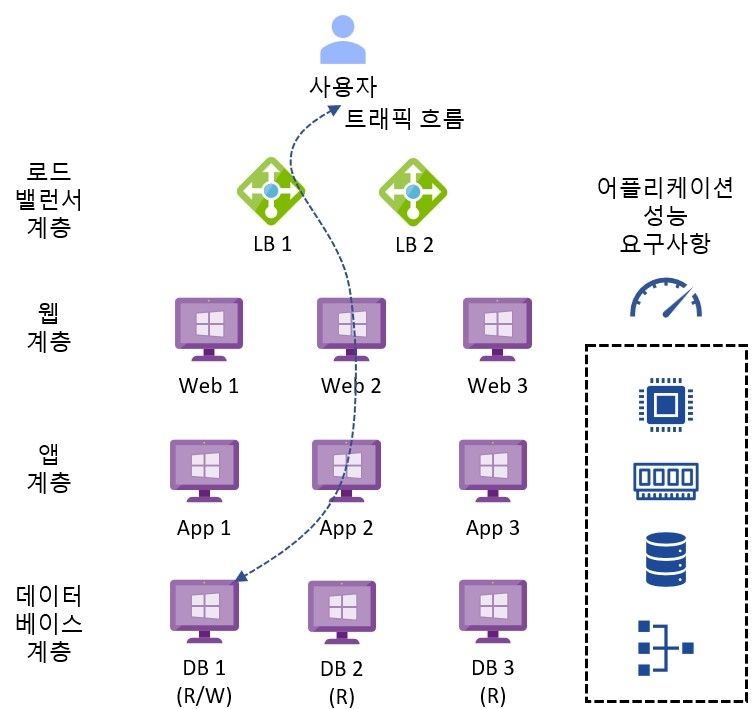

그림 1 – 일반적인 레거시 비즈니스 크리티컬 애플리케이션 아키텍처

다음 섹션에서는 AVS의 아키텍처 구성 요소를 소개합니다.

***아키텍처 구성요소***

아래 다이어그램은 AVS의 아키텍처 구성 요소를 보여줍니다.

그림 2 – AVS 아키텍처 구성요소

각 AVS 아키텍처 구성 요소는 다음과 같습니다.

- **Azure 구독**: AVS에 대한 접근 제어, 예산 및 할당량 관리를 제공하는 데 사용됩니다.
- **Azure 지역**: 데이터 센터를 AZ로 그룹화한 다음 AZ를 지역으로 그룹화하는 전 세계의 물리적 위치입니다.
- **Azure 리소스 그룹**: Azure 서비스 및 리소스를 논리적 그룹에 배치하는 데 사용되는 자원의 단위 컨테이너.
- **AVS 프라이빗 클라우드**: vCenter Server, NSX 소프트웨어 정의 네트워킹, vSAN 소프트웨어 정의 스토리지, Azure 베어메탈 ESXi 호스트를 포함한 VMware 소프트웨어를 사용하여 컴퓨팅, 네트워킹, 스토리지 리소스등 VMware 전체 스택을 제공합니다. Azure NetApp Files, Azure Elastic SAN, 퓨어 클라우드 블록 스토어도 지원됩니다. VMware 환경을 Azure로 마이그레이션하거나 새로운 VMware 클라우드를 구축하고자 하는 고객에게 적합합니다.
- **AVS 리소스 클러스터**: AVS Private Cloud의 일부로, 특정 리소스를 할당하는 클러스터입니다. 특정 애플리케이션 또는 작업에 필요한 자원을 할당하고 관리하는 데 중점을 둡니다.vSAN 소프트웨어 정의 스토리지를 포함한 VMware 소프트웨어와 Azure 베어메탈 ESXi 호스트를 사용하여 AVS 프라이빗 클라우드를 확장함으로써 고객 워크로드를 위한 컴퓨팅, 네트워킹, 스토리지 리소스를 제공합니다. Azure NetApp Files, Azure Elastic SAN, 퓨어 클라우드 블록 스토어도 지원됩니다.
- **VMware HCX**: 모빌리티, 마이그레이션, 네트워크 확장 서비스를 제공합니다.
- **VMware 사이트 복구**: 재해 복구 자동화 및 VMware vSphere Replication을 통한 스토리지 복제 서비스를 제공합니다. 타사 재해 복구 솔루션인 Zerto DR 및 JetStream DR도 지원됩니다.
- **전용 Microsoft 엔터프라이즈 엣지(D-MSEE)**: Azure 클라우드와 AVS 프라이빗 클라우드 인스턴스 간의 연결을 제공하는 라우터입니다.
- **Azure 가상 네트워크(VNet)**: Azure 서비스 및 리소스를 함께 연결하는 데 사용되는 프라이빗 네트워크.
- **Azure 라우트 서버**: 네트워크 어플라이언스가 Azure 네트워크와 동적 라우팅 정보를 교환할 수 있도록 합니다.
- **Azure 가상 네트워크 게이트웨이**: Azure 서비스 및 리소스를 다른 프라이빗 네트워크에 연결하기 위한 온-프레미스 간 게이트웨이로, IPSec VPN, ExpressRoute 및 VNet-to-VNet을 사용합니다.
- **Azure ExpressRoute**: Azure 데이터 센터와 온-프레미스 또는 코로케이션 인프라 간에 고속 프라이빗 연결을 제공합니다.
- **Azure 가상 WAN(vWAN)**: 네트워킹, 보안 및 라우팅 기능을 하나의 통합된 WAN(광역 네트워크)으로 통합합니다. 다음 섹션에서는 AVS의 가용성 디자인 고려 사항에 대해 설명합니다.

***성능 디자인 고려사항***

아키텍처 디자인 프로세스는 해결해야 할 비즈니스 문제와 달성해야 할 비즈니스 목표를 파악하고 이를 고객 요구사항, 디자인 제약 조건 및 가정으로 추출합니다. 디자인 제약 조건은 다음 세 가지 범주로 특징 지을 수 있습니다:

- 공간 제약의 법칙 : 데이터 및 애플리케이션 주권, 거버넌스, 규제, 규정 준수 등 물리 법칙 : 데이터 및 기계 중력, 네트워크 지연 시간 등 경제학의 법칙 : 소유 Vs 임대, 총소유비용(TCO), 투자 수익률(ROI), 자본 지출, 운영 지출, 이자, 세금, 감가상각비, 상각 전 영업이익(EBITDA) 등입니다.

각 디자인 고려 사항은 가용성, 비즈니스 연속성, 성능, 관리 용이성 및 보안 디자인 품질 간의 절충점이 될 것입니다. 바람직한 결과는 고객의 목표로부터 출발하여 최소한의 위험으로 비즈니스 가치를 제공하는 것입니다.

**디자인 고려 사항 1 - Azure 리전**: AVS는 전 세계 [30개 Azure 리전에서 제공됩니다](https://azure.microsoft.com/ko-kr/explore/global-infrastructure/products-by-region/?products=azure-vmware) (미국 정부에는 2개의 Azure 리전이 추가됨). 지리적 요구 사항을 충족하는 관련 Azure 지역을 선택하십시오. 이러한 지역은 일반적으로 설계 제약 조건과 AVS에 종속되는 필수 Azure 서비스에 따라 결정됩니다.

처리량을 최대화하고 네트워크 지연 시간을 최소화하려면 AVS와 써드파티 백업/복구 및 Azure NetApp Files 볼륨과 같은 종속 Azure 서비스를 Azure 리전의 동일한 가용 영역(Availability Zone)에 배치해야 합니다.

안타깝게도 Azure VMware 솔루션에는 Azure 서비스를 동일한 가용 영역에 자동으로 배포할 수 있는 배치 정책 그룹 기능이 없습니다. Microsoft에 티켓을 열어 Azure VMware 솔루션 프라이빗 클라우드를 특정 AZ에 배포하는 [특별 배치 정책을](https://learn.microsoft.com/ko-kr/azure/azure-vmware/concepts-private-clouds-clusters#azure-region-availability-zone-az-to-sku-mapping-table) 구성하여 Azure 서비스가 최대한 가깝게 배치되도록 할 수 있습니다.

또한 서비스를 사용하는 원격 사용자 및 애플리케이션과 Azure 리전의 근접성, 네트워크 대기 시간 및 처리량에 대해 고려해야 합니다.

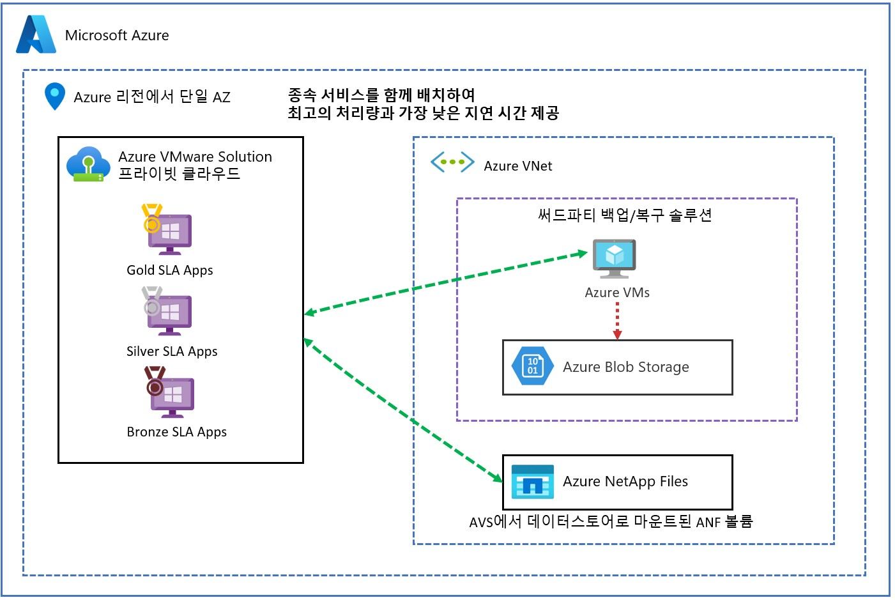

그림 3 – 성능을 위한 AVS 가용 영역 배치

**디자인 고려 사항 2 - SKU 유형:** 표 2에는 AVS 프라이빗 클라우드를 프로비저닝하기 위해 선택할 수 있는 세 가지 SKU 유형이 나와 있습니다. 워크로드 성능 요구 사항에 따라 AV36 및 AV36P 노드는 범용 컴퓨팅에 사용할 수 있고 AV52 노드는 컴퓨팅 집약적이고 스토리지 사용량이 많은 워크로드에 사용할 수 있습니다.

AV36 SKU는 대부분의 Azure 지역에서 광범위하게 사용 가능하며 AV36P 및 AV52 SKU는 특정 Azure 지역으로 제한됩니다. AVS는 프라이빗 클라우드 내에서 서로 다른 SKU 유형을 혼합하는 것을 지원하지 않습니다(AV64 SKU는 예외). [Azure 지역별 Azure VMware Solution SKU 사용 가능 여부는 여기에서 확인할 수 있습니다.](https://azure.microsoft.com/ko-kr/explore/global-infrastructure/products-by-region/?products=azure-vmware)

AV64 SKU는 현재 특정 지역에서만 혼합 SKU 배포에 사용할 수 있습니다.

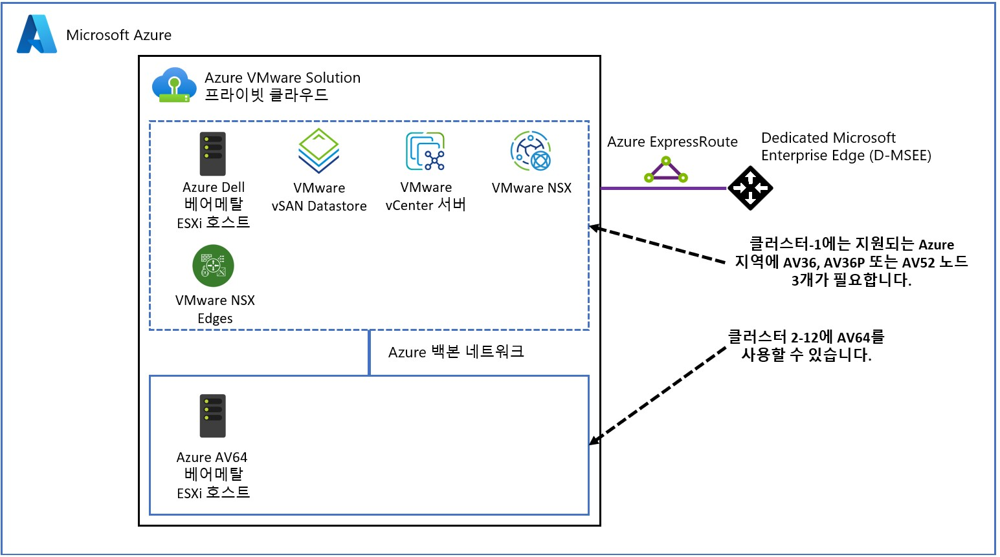

그림 4 – AV64 혼합 SKU 토폴로지

현재 AVS에는 GPU 하드웨어를 지원하는 SKU가 없습니다.

Azure VMware 솔루션은 기본적으로 자동 확장을 지원하지 않지만, 대신 이 [자동 확장 기능](https://techcommunity.microsoft.com/t5/azure-migration-and/azure-vmware-solution-auto-scale/ba-p/3690186)을 사용할 수 있습니다.

자세한 내용은 [SKU 유형](https://learn.microsoft.com/ko-kr/azure/azure-vmware/introduction#hosts-clusters-and-private-clouds) 을 참조하십시오.

| **SKU 타입** | **용도** | **CPU (Cores/GHz)** | **RAM (GB)** | **vSAN Cache Tier (TB, raw)** | **vSAN Capacity Tier (TB, raw)** | **Network Interface Cards** |
| --- | --- | --- | --- | --- | --- | --- |
| AV36 | General Purpose Compute | Dual Intel Xeon Gold 6140 CPUs (Skylake microarchitecture) with 18 cores/CPU @ 2.3 GHz, Total 36 physical cores (72 logical cores with hyperthreading) | 576 | 3.2 (NVMe) | 15.20 (SSD) | 4x 25 Gb/s NICs (2 for management & control plane, 2 for customer traffic) |
| AV36P | General Purpose Compute | Dual Intel Xeon Gold 6240 CPUs (Cascade Lake microarchitecture) with 18 cores/CPU @ 2.6 GHz / 3.9 GHz Turbo, Total 36 physical cores (72 logical cores with hyperthreading) | 768 | 1.5 (Intel Cache) | 19.20 (NVMe) | 4x 25 Gb/s NICs (2 for management & control plane, 2 for customer traffic) |
| AV52 | Compute/Storage heavy workloads | Dual Intel Xeon Platinum 8270 CPUs (Cascade Lake microarchitecture) with 26 cores/CPU @ 2.7 GHz / 4.0 GHz Turbo, Total 52 physical cores (104 logical cores with hyperthreading) | 1,536 | 1.5 (Intel Cache) | 38.40 (NVMe) | 4x 25 Gb/s NICs (2 for management & control plane, 2 for customer traffic) |
| AV64 | General Purpose Compute | Dual Intel Xeon Platinum 8370C CPUs (Ice Lake microarchitecture) with 32 cores/CPU @ 2.8 GHz / 3.5 GHz Turbo, Total 64 physical cores (128 logical cores with hyperthreading) | 1,024 | 3.84 (NVMe) | 15.36 (NVMe) | 1x 100 Gb/s |

표 2 – AVS SKU

**디자인 고려 사항 3 - 배포 토폴로지:** SLA의 성능 요구 사항에 가장 적합한 AVS 토폴로지를 선택합니다. 매우 큰 규모의 배포의 경우 최적의 성능을 위해 각 SLA 전용 프라이빗 클라우드를 별도로 사용하는 것이 좋을 수 있습니다.

AVS는 프라이빗 클라우드당 최대 12개의 클러스터를 지원합니다. 각 클러스터는 클러스터당 최소 3개에서 최대 16개의 호스트를 지원합니다. 각 프라이빗 클라우드는 최대 96개의 호스트를 지원합니다.

VMware vCenter Server, VMware HCX Manager, VMware SRM 및 VMware vSphere Replication Manager는 클러스터-1에서 실행되는 개별 애플리케이션입니다.

VMware NSX Manager는 클러스터의 호스트에 분산하기 위해 3개의 통합 어플라이언스로 구성된 클러스터이며 VM-VM 선호도 방지 배치 정책을 사용하고 있습니다. VMware NSX Edge 클러스터는 한 쌍의 어플라이언스이며 VM-VM 선호도 방지 배치 정책을 사용하고 있습니다.

모든 North쪽 아웃바운드 고객 트래픽은 NSX Edge 클러스터를 통과합니다. 모든 vSAN 스토리지 트래픽은 관리 및 제어 플레인의 일부인 관리 vSphere Distributed Switch의 VLAN 지원 포트 그룹을 통과합니다.

관리 및 제어 플레인 클러스터(클러스터-1)는 고객 워크로드 VM과 공유하거나 Active Directory, DNS 및 DHCP와 같은 고객 엔터프라이즈 서비스를 포함한 관리 및 제어 전용 클러스터가 될 수 있습니다. 고객 수요를 지원하기 위해 추가 리소스 클러스터를 추가할 수 있습니다. 여기에는 각 고객 SLA에 대해 전용 클러스터를 사용하는 옵션도 포함됩니다.

*토폴로지 1 - 혼합:* AVS 프라이빗 클라우드의 각 클러스터에서 혼합 SLA 워크로드를 실행합니다.

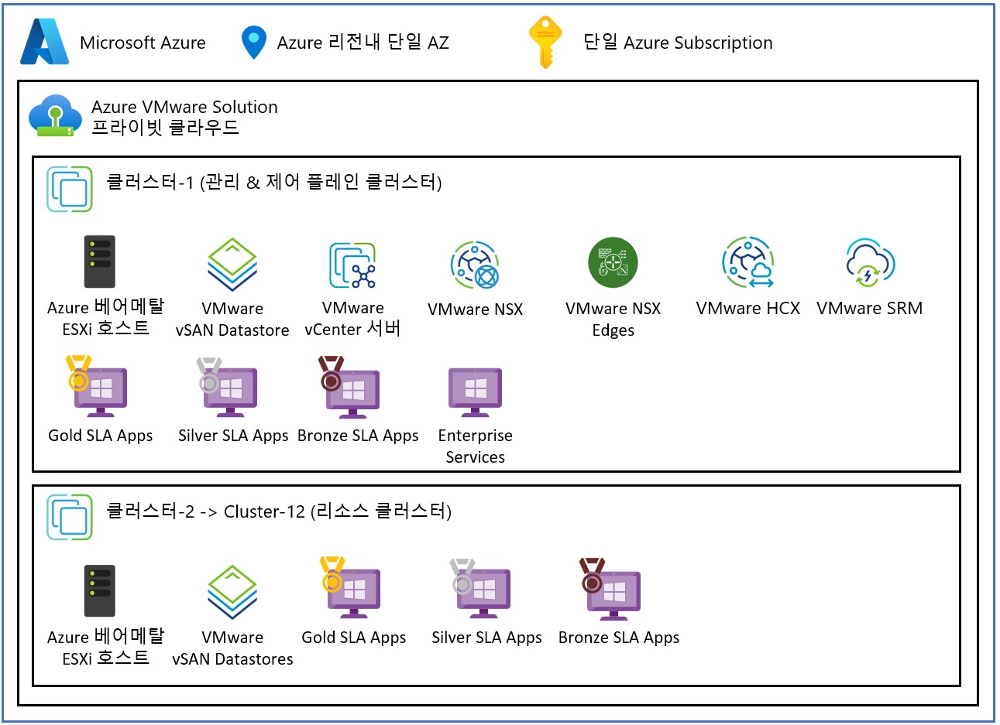

그림 5 – AVS 혼합 워크로드 토폴로지 Topology

*토폴로지 2 - 전용 클러스터:* AVS 프라이빗 클라우드에서 각 SLA에 대해 별도의 클러스터를 사용합니다.

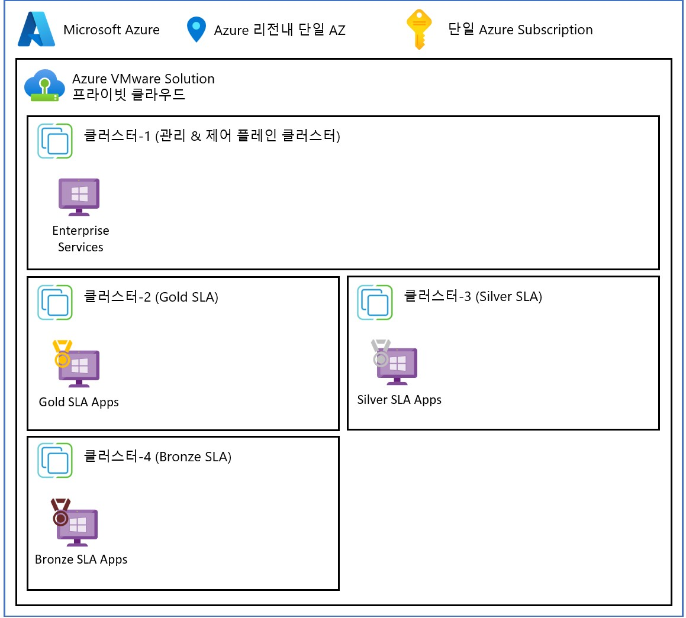

그림 6 – AVS 전용 클러스터 토폴로지

*토폴로지 3 - 전용 프라이빗 클라우드:* 최적의 성능을 위해 각 SLA에 대해 전용 AVS 프라이빗 클라우드를 사용합니다.   

그림 7 – AVS 전용 프라이빗 클라우드 인스턴스 토폴로지

**디자인 고려 사항 4 - 네트워크 연결:** Azure 방화벽 및 타사 네트워크 가상화 어플라이언스를 사용하는 허브 스포크 및 Azure 가상 WAN과 같은 다양한 Azure 가상 네트워킹 토폴로지, 그리고 IPSec VPN 및 Azure ExpressRoute 회로를 사용하여 AVS 프라이빗 클라우드를 연결할 수 있습니다. NSX를 통한 Azure 공용 IP 연결도 사용할 수 있습니다.

성능 관점에서 Azure Virtual WAN 및 IPSec VPN 대신 Azure ExpressRoute 및 AVS Interconnect를 사용해야 합니다. 다음 디자인 고려 사항 5 ~ 9에서는 네트워크 성능 설계에 대해 자세히 설명합니다.

자세한 내용은 [AVS 네트워킹 및 상호 연결 개념](https://learn.microsoft.com/ko-kr/azure/azure-vmware/concepts-networking) 을 참조하십시오. AVS 클라우드 채택 프레임워크에는 [고려할 수 있는 네트워크 시나리오 예시](https://learn.microsoft.com/ko-kr/azure/cloud-adoption-framework/scenarios/azure-vmware/example-architectures)도 있습니다

**디자인 고려 사항 5 - Azure VNet 연결:** 처리량을 극대화하고 지연 시간을 최소화하기 위해 AVS 프라이빗 클라우드를 Azure VNet에 연결할 때 FastPath를 사용합니다.

AVS와 Azure 네이티브 서비스 간의 성능을 극대화하려면 연결을 생성할 때 빠른 경로 기능을 사용하려면 Ultra 성능 또는 ErGw3AZ SKU가 있는 VNet 게이트웨이가 필요합니다. FastPath는 VNet에 대한 데이터 경로 성능을 개선하도록 설계되었습니다. FastPath를 활성화하면 네트워크 트래픽이 게이트웨이를 우회하여 VNet의 가상 머신으로 직접 전송되므로 처리량이 10Gbps 이상 향상됩니다.

자세한 내용은 [Azure ExpressRoute FastPath](https://learn.microsoft.com/ko-kr/azure/expressroute/about-fastpath) 를 참조하세요.

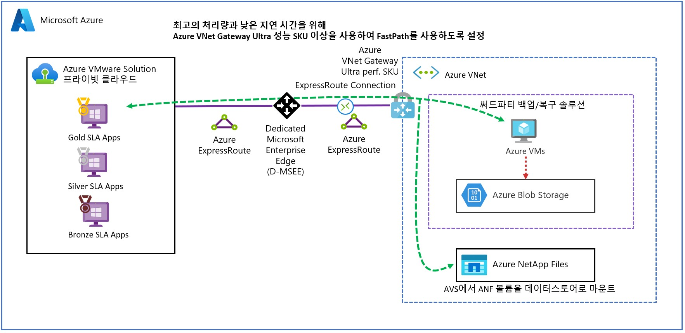

그림 8 – FastPath를 사용하여 VNet 게이트웨이에 연결된 AVS

**디자인 고려 사항 6 - 리전 내 연결:** 최고의 처리량과 가장 낮은 지연 시간을 위해 동일한 Azure 리전에서 AVS 프라이빗 클라우드를 함께 연결하는 데 AVS Interconnect를 사용합니다.

다른 Azure 구독 또는 Azure 리소스 그룹에서 AVS 프라이빗 클라우드를 선택할 수 있지만, 동일한 Azure 지역에 있어야 한다는 유일한 제약 조건이 있습니다. 프라이빗 클라우드 인스턴스당 최대 10개의 프라이빗 클라우드를 연결할 수 있습니다.

자세한 내용은 [AVS 인터커넥트](https://learn.microsoft.com/ko-kr/azure/azure-vmware/connect-multiple-private-clouds-same-region) 를 참조하세요.

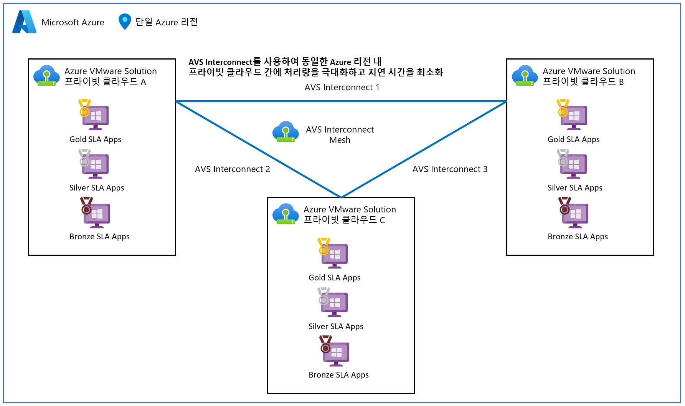

그림 9 – AVS 인터커넥트를 사용한 AVS

**디자인 고려 사항 7 - 지역 간/온프레미스 연결:** 서로 다른 Azure 리전 또는 온프레미스 vSphere 환경에 있는 AVS 프라이빗 클라우드를 연결할 때,  최고의 처리량과 가장 짧은 지연 시간을 위해 ExpressRoute Global Reach를 사용하세요.

자세한 내용은 [Azure VMware 솔루션 네트워크 설계 고려 사항을](https://learn.microsoft.com/ko-kr/azure/azure-vmware/concepts-network-design-considerations) 참조하십시오.

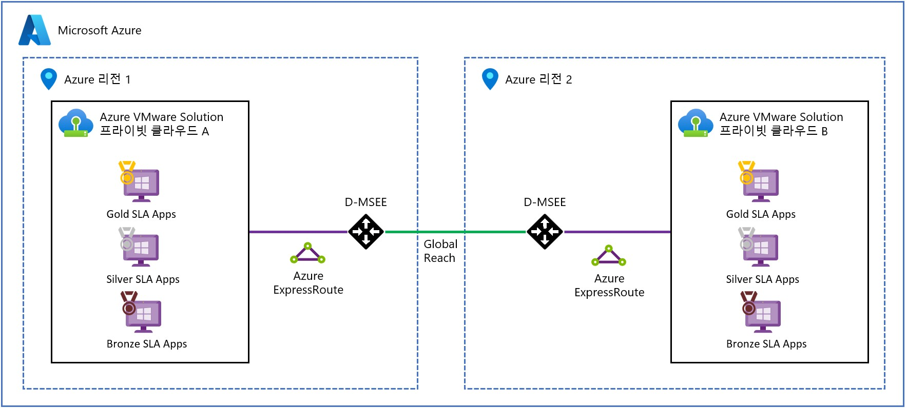

그림 10 - ExpressRoute Global Reach를 사용한 AVS

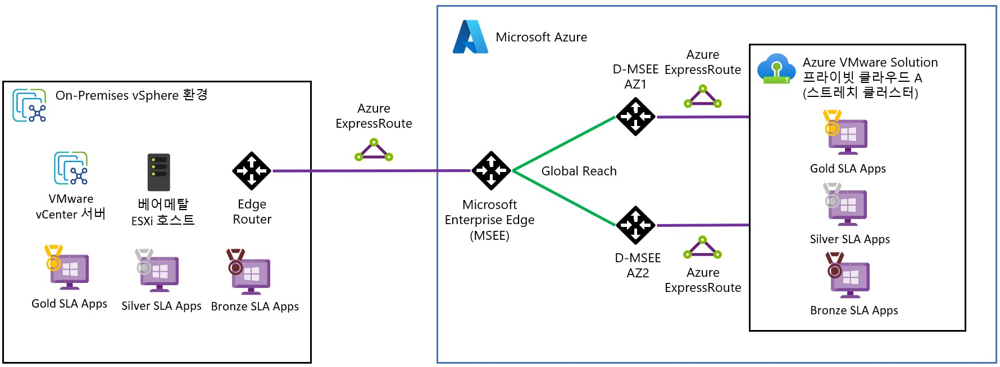

그림 11 – 온프레미스 vSphere 인프라를 연결하기 위해 ExpressRoute Global Reach를 사용한 AVS

**디자인 고려 사항 8 - 호스트 연결:** NSX Multi-Edge를 사용하여 Azure VMware Solution 프라이빗 클라우드에서 North/South 트래픽의 처리량을 늘립니다.

이 구성은 노드가 4개 이상인 관리 클러스터(클러스터 -1)에 사용할 수 있습니다. 추가 에지 VM이 에지 클러스터에 추가되고 ESXi 호스트 간에 25Gbps 업링크를 통해 전달할 수 있는 트래픽의 양이 증가합니다. 이 기능은 SR을 열어 구성해야 합니다.

자세한 내용은 [Azure VMware 솔루션 네트워크 설계 고려 사항을](https://learn.microsoft.com/ko-kr/azure/azure-vmware/concepts-network-design-considerations) 참조하십시오.

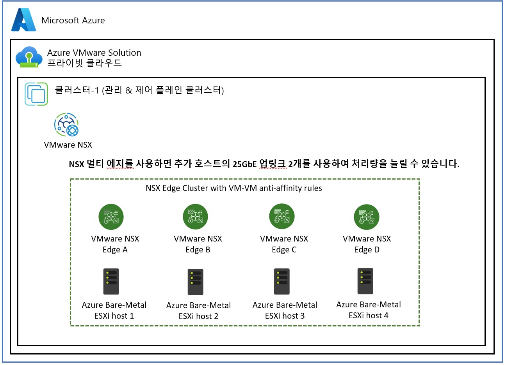

그림 12 – NSX를 사용한 AVS 멀티 에지

**디자인 고려 사항 9 - 인터넷 연결**: AVS 프라이빗 클라우드에 직접 고속 인터넷 액세스가 필요한 경우 NSX Edge에서 공용 IP를 사용합니다.

이를 통해 Azure 소유의 공용 IPv4 주소 범위를 NSX Edge로 직접 가져와서 사용할 수 있습니다. 프라이빗 클라우드를 보호하려면 네트워크 가상 어플라이언스(NVA)에서 이 공용 범위를 구성해야 합니다.

자세한 내용은 [인터넷 연결 설계 고려 사항](https://learn.microsoft.com/ko-kr/azure/azure-vmware/concepts-design-public-internet-access)을 참조하세요.

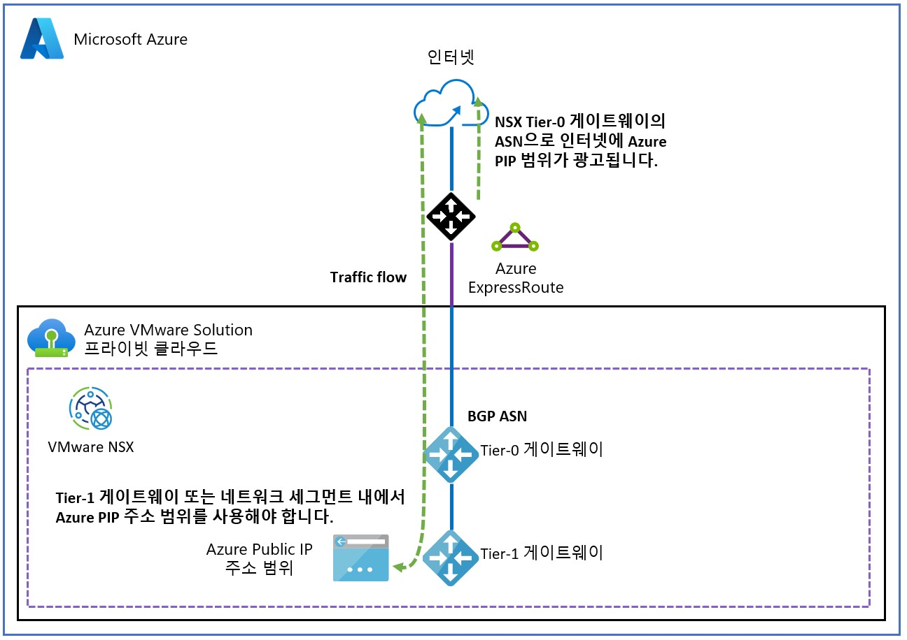

그림 13 – NSX를 사용하는 AVS 퍼블릭 IP 주소

**디자인 고려 사항 10 - VM 최적화**: VM 하드웨어 튜닝 및 리소스 풀을 사용하여 워크로드에 최고의 성능을 제공하세요.

VMware vSphere 가상 머신 하드웨어는 필요한 성능에 맞게 최적화되어야 합니다:

- vNUMA optimization for CPU and RAM
- Shares
- Reservations & Limits
- Latency Sensitive setting
- Paravirtual network & storage adapters
- Multiple SCSI controllers
- Spread vDisks across SCSI controllers

리소스 풀을 사용하여 혼합 클러스터에서 실행 중인 각 SLA에 대해 CPU 및 RAM QoS 정책을 적용할 수 있습니다.

자세한 내용은 [성능 모범 사례](https://www.vmware.com/content/dam/digitalmarketing/vmware/en/pdf/techpaper/performance/vsphere-esxi-vcenter-server-70-performance-best-practices.pdf)를 참조하세요.

**디자인 고려 사항 11 - 배치 정책**: 배치 정책은 ESXi 호스트 전반의 애플리케이션 가용성 계층에서 VM을 분리하여 서비스 성능을 향상시키는 데 사용할 수 있습니다. 이를 통해 워크로드를 특정 호스트에 고정하여 CPU 및 RAM 리소스에 대해 독점적으로 사용하도록 할 수 있습니다. 배치 정책은 VM-VM 및 VM-호스트 선호도 및 반 선호도 규칙을 지원합니다. 배치 정책을 적용하기 위한 VM 마이그레이션은 vSphere DRS(Distributed Resource Scheduler)가 담당합니다.

자세한 내용은 [배치 정책](https://learn.microsoft.com/ko-kr/azure/azure-vmware/create-placement-policy)을 참조하세요.

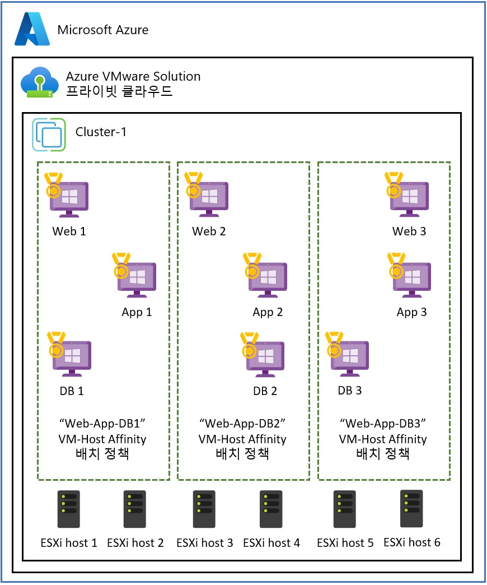

그림 14 – AVS 배치 정책

**디자인 고려 사항 12 - 외부 데이터스토어**: 퍼스트 파티 또는 타사 스토리지 솔루션을 사용하여 VMware vSAN의 낮은 SLA 워크로드를 별도의 스토리지 계층으로 오프로드합니다.   

AVS는 가상 머신 스토리지를 VMware vSAN에서 오프로드하기 위해 Azure NetApp 파일을 네트워크 파일 시스템(NFS) 데이터스토어로 연결할 수 있도록 지원합니다. 이를 통해 VMware vSAN 데이터스토어를 골드 SLA 가상 머신 전용으로 사용할 수 있습니다.

AVS는 또한 Azure Elastic SAN 및 퓨어 클라우드 블록 스토어를 연결된 iSCSI 데이터스토어로 사용할 수 있도록 지원합니다.

자세한 내용은 [Azure NetApp 파일 데이터스토어](https://learn.microsoft.com/ko-kr/azure/azure-vmware/attach-azure-netapp-files-to-azure-vmware-solution-hosts?tabs=azure-portal)를 참조하세요.

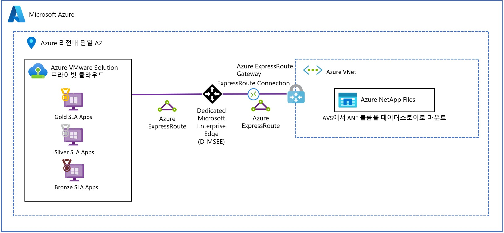

그림 15 – AVS 외부 데이터스토어(Azure NetApp 파일 포함) 

**디자인 고려 사항 13 - 스토리지 정책**: 표 3에는 VMware vSAN과 함께 사용할 수 있는 사전 정의된 VM 스토리지 정책이 나열되어 있습니다. 고객 워크로드 SLA에 맞게 정책별 적절한 독립 디스크 중복 배열(RAID) 및 내결함성 장애(FTT) 설정을 고려해야 합니다. 각 정책에는 가용성, 성능, 용량 및 비용 간의 절충점을 고려해야 합니다.    

엔터프라이즈 워크로드를 위한 최고 성능의 VM 스토리지 정책은 RAID-1 정책입니다.

표준 클러스터에 노드가 6개 이상인 경우, Azure VMware 솔루션 SLA를 준수하려면 클러스터에 FTT=2 스토리지 정책을 사용해야 합니다. 또한 백엔드 vSAN 작업을 위해 최소 25%의 여유 공간을 유지해야 합니다. 

자세한 내용은 [스토리지 정책 구성](https://learn.microsoft.com/ko-kr/azure/azure-vmware/configure-storage-policy)을 참조하세요.

| **Deployment Type** | **Policy Name** | **RAID** | **Failures to Tolerate (FTT)** | **Site** |
| --- | --- | --- | --- | --- |
| Standard | RAID-1 FTT-1 | 1 | 1 | N/A |
| Standard | RAID-1 FTT-2 | 1 | 2 | N/A |
| Standard | RAID-1 FTT-3 | 1 | 3 | N/A |
| Standard | RAID-5 FTT-1 | 5 | 1 | N/A |
| Standard | RAID-6 FTT-2 | 6 | 2 | N/A |
| Standard | VMware Horizon | 1 | 1 | N/A |

표 3 – VMware vSAN 스토리지 정책

**디자인 고려 사항 14 - 이동성**: 처리량과 성능을 개선하기 위해 VMware HCX를 조정할 수 있습니다.

  실행 명령을 통해 VMware HCX Manager의 크기를 늘릴 수 있습니다. 네트워크 확장(NE) 인스턴스 수를 늘려 포트 그룹을 인스턴스 간에 분산하여 L2E(계층 2 확장) 성능을 향상시킬 수 있습니다. 또한 각 개별 워크로드 클러스터에 대한 전용 서비스 메시와 함께 전용 모빌리티 클러스터를 설정하여 모빌리티 성능을 향상시킬 수 있습니다. Azure VMware 솔루션은 [프라이빗 클라우드당 최대 10개의 서비스 메시를 지원](https://learn.microsoft.com/ko-kr/azure/azure-resource-manager/management/azure-subscription-service-limits#azure-vmware-solution-limits)하며, 이는 [/22 관리 IP 스키마를 할당](https://learn.microsoft.com/ko-kr/azure/azure-vmware/tutorial-network-checklist#routing-and-subnet-considerations)하기 때문입니다.   

 [애플리케이션 경로 복원력 및 TCP 흐름 조절](https://blogs.vmware.com/cloud/2020/01/16/traffic-engineering-hcx-enterprise/)도 모빌리티 성능을 개선하기 위해 활성화할 수 있는 옵션입니다. TCP 플로우 컨디셔닝은 네트워크 확장 경로를 통과하는 트래픽의 세그먼트 크기를 동적으로 최적화합니다. 애플리케이션 경로 복원력 기술은 소스 및 대상 업링크 IP 쌍 사이에 여러 FOU(Foo-Over-UDP) 터널을 생성하여 성능, 복원력 및 경로 다양성을 개선합니다.

 자세한 내용은 [VMware HCX 모범 사례](https://nsx.techzone.vmware.com/resource/hcx-availability-configurations-and-best-practices)를 참조하십시오.

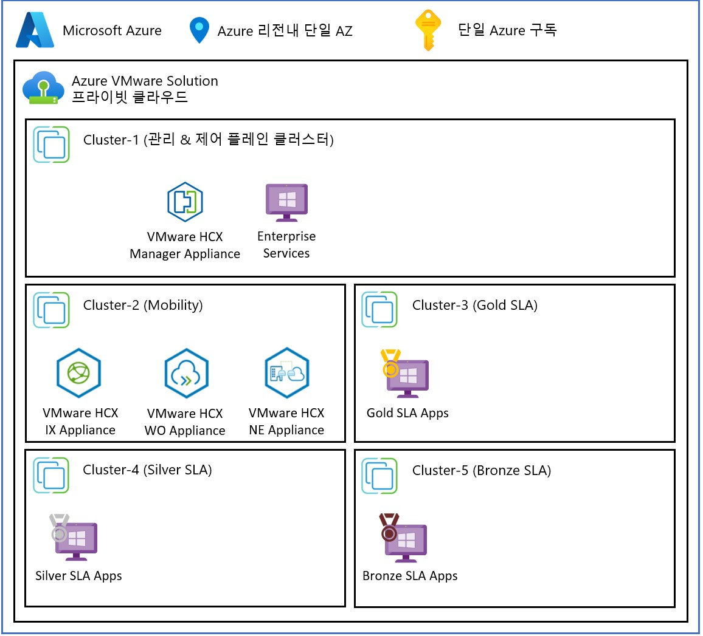

그림 16 – 전용 모빌리티 클러스터가 있는 VMware HCX 

 **디자인 고려 사항 15 - 안티 패턴**: 성능 디자인에 이러한 안티 패턴을 사용하지 않도록 하세요.

  안티 패턴 1 - 스트레치 클러스터*: AVS 스트레치 클러스터는 주로 멀티 AZ 또는 복구 지점 목표 0 요구 사항을 충족하는 데 사용해야 합니다. 스트레치 클러스터를 사용하는 경우 사이트 미러링 스토리지 정책을 사용하는 모든 동기식 쓰기에 대해 쓰기 처리량 및 쓰기 지연 시간이 영향을 받습니다.   

 자세한 내용은 [스트레치 클러스터](https://learn.microsoft.com/ko-kr/azure/azure-vmware/deploy-vsan-stretched-clusters)를 참조하세요.

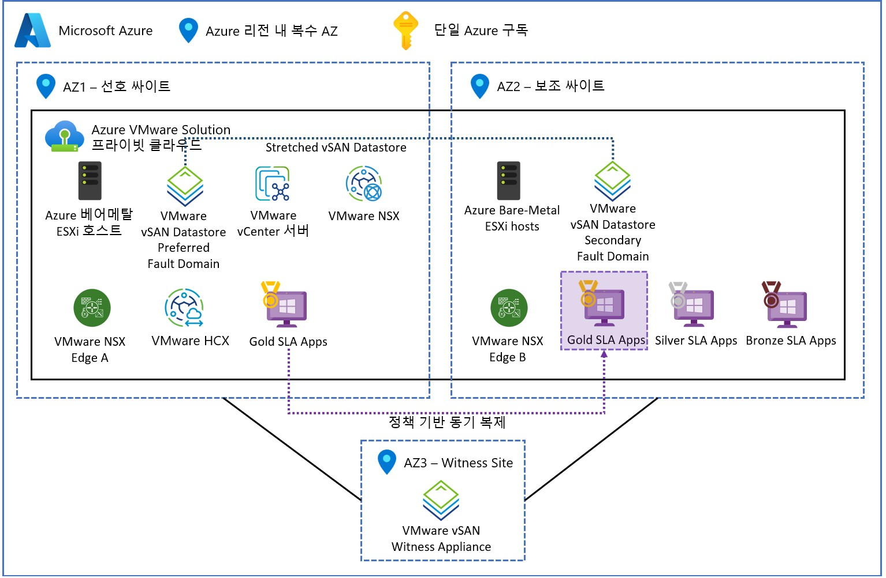

그림 17 – 스트레치 클러스터를 사용한 AVS 프라이빗 클라우드

***추후 단계***

AVS 마이그레이션을 위한 사이징 견적은 [Azure Migrate](https://learn.microsoft.com/ko-kr/azure/migrate/how-to-create-azure-vmware-solution-assessment?context=%2Fazure%2Fazure-vmware%2Fcontext%2Fcontext)를 사용하여 평가해야 합니다. 대규모 엔터프라이즈 솔루션의 경우, 최소한의 위험으로 비즈니스 가치를 제공할 수 있도록 솔루션의 크기가 올바르게 조정되었는지 확인하기 위해 Azure, VMware 또는 VMware 파트너의 AVS 아키텍트가 참여해야 합니다. 여기에는 애플리케이션 그룹 간의 매핑을 이해하고 데이터 중력 영역, 애플리케이션 네트워크 트래픽 흐름 및 네트워크 지연 시간 종속성을 파악하기 위한 애플리케이션 종속성 평가도 포함되어야 합니다.

***마무리***

이 게시물에서는 고객 워크로드의 일반적인 성능 요구 사항, 아키텍처 구성 요소 및 AVS의 성능 설계 고려 사항을 자세히 살펴봤습니다. 또한 AVS 설계를 계속하기 위한 다음 단계에 대해서도 논의했습니다.

참고 사이트:

- Homepage: [Azure VMware Solution](https://azure.microsoft.com/en-us/products/azure-vmware/)
- Documentation: [Azure VMware Solution](https://learn.microsoft.com/en-us/azure/azure-vmware/)
- SLA: [SLA for Azure VMware Solution](https://azure.microsoft.com/en-us/support/legal/sla/azure-vmware/v1_1/)
- Azure Regions: [Azure Products by Region](https://azure.microsoft.com/en-us/explore/global-infrastructure/products-by-region/?products=azure-vmware)
- Service Limits: [Azure VMware Solution subscription limits and quotas](https://learn.microsoft.com/en-us/azure/azure-resource-manager/management/azure-subscription-service-limits#azure-vmware-solution-limits)
- SKU types: [Introduction](https://learn.microsoft.com/en-us/azure/azure-vmware/introduction)
- Storage policies: [Configure storage policy](https://learn.microsoft.com/en-us/azure/azure-vmware/configure-storage-policy)
- VMware HCX: [Configuration & Best Practices](https://nsx.techzone.vmware.com/resource/hcx-availability-configurations-and-best-practices)
- GitHub repository: [Azure/azure-vmware-solution](https://github.com/Azure/azure-vmware-solution/)
- Well-Architected Framework: [Azure VMware Solution workloads](https://learn.microsoft.com/en-us/azure/well-architected/azure-vmware/)
- Cloud Adoption Framework: [Introduction to the Azure VMware Solution adoption scenario](https://learn.microsoft.com/en-us/azure/cloud-adoption-framework/scenarios/azure-vmware/)
- Network connectivity scenarios: [Enterprise-scale network topology and connectivity for Azure VMware Solution](https://learn.microsoft.com/en-us/azure/cloud-adoption-framework/scenarios/azure-vmware/eslz-network-topology-connectivity)
- Enterprise Scale Landing Zone: [Enterprise-scale for Microsoft Azure VMware Solution](https://learn.microsoft.com/en-us/azure/cloud-adoption-framework/scenarios/azure-vmware/enterprise-scale-landing-zone)
- Enterprise Scale GitHub repository: [Azure/Enterprise-Scale-for-AVS](https://github.com/Azure/Enterprise-Scale-for-AVS)
- Azure CLI: [Azure Command-Line Interface (CLI) Overview](https://learn.microsoft.com/en-us/cli/azure/)
- PowerShell module: [Az.VMware Module](https://learn.microsoft.com/en-us/powershell/module/az.vmware/?view=azps-9.0.1)
- Azure Resource Manager: [Microsoft.AVS/privateClouds](https://learn.microsoft.com/en-us/azure/templates/microsoft.avs/privateclouds?pivots=deployment-language-bicep)
- REST API: [Azure VMware Solution REST API](https://learn.microsoft.com/en-us/rest/api/avs/)
- Terraform provider: [azurerm_vmware_private_cloud Terraform Registry](https://registry.terraform.io/providers/hashicorp/azurerm/latest/docs/resources/vmware_private_cloud)
