*본 글은* [Azure VMware Solution Security Design Considerations](https://techcommunity.microsoft.com/t5/azure-migration-and/azure-vmware-solution-security-design-considerations/ba-p/4050496) *의 많은 내용을 참고하였습니다.*

한 글로벌 기업이 애플리케이션 현대화 전략의 일환으로 수천 개의 VMware vSphere 가상 머신(VM)을 Microsoft Azure로 마이그레이션하려고 합니다. 첫 번째 단계는 온프레미스 데이터 센터를 종료하고 현대화 전략의 첫 번째 단계를 위한 스테이징 영역으로 레거시 애플리케이션 VM을 Azure VMware Solution(이하 AVS)으로 신속하게 이전하는 것입니다. AVS는 어떤 모습일까요?

[AVS](https://azure.microsoft.com/ko-kr/products/azure-vmware/)는 전용 베어메탈 Azure 인프라로 구축된 VMware vSphere 클러스터가 포함된 프라이빗 클라우드를 제공하는 Microsoft의 검증된 퍼스트 파티 Azure 서비스입니다. 이를 통해 고객은 VMware 기술 및 툴에 대한 기존 투자를 활용할 수 있으므로 Azure에서 VMware 기반 워크로드를 개발하고 실행하는 데 집중할 수 있습니다.

이 게시물에서는 일반적인 고객 워크로드 보안 요구 사항을 소개하고, AVS 아키텍처 구성 요소를 설명하고, 제로 트러스트 보안 모델을 설명하고, AVS 프라이빗 클라우드의 보안 설계 고려 사항에 대해 설명합니다.

우선 고객 워크로드의 일반적인 보안 요구 사항부터 시작하겠습니다.

***고객 보안 요구사항***

일반적인 고객은 충족해야 하는 특정 서비스 수준 계약(SLA) 요건이 있는 여러 애플리케이션 티어를 보유하고 있습니다. 이러한 SLA는 일반적으로 플래티넘, 골드, 실버, 브론즈 또는 미션 크리티컬, 비즈니스 크리티컬, 프로덕션, 테스트/개발과 같은 티어링 시스템으로 명명됩니다. 각 SLA에는 충족해야 하는 가용성, 복구 가능성, 성능, 관리 용이성 및 보안 요구 사항이 다릅니다.

보안 설계 품질과 관련하여 고객은 일반적으로 거버넌스, 규제 및 규정 준수 요구 사항을 갖게 됩니다. 이는 일반적으로 각 애플리케이션에 대해 문서화된 다음 각 SLA 또는 비즈니스 부문에 대한 정보 보안 정책 요구 사항으로 통합됩니다. 

| **비즈니스 분야** | **거버넌스, 규제 및 규정 준수** |
| --- | --- |
| 금융 | [ISO/IEC 27001:2022](https://www.iso.org/standard/27001), [GLBA](https://www.ftc.gov/business-guidance/privacy-security/gramm-leach-bliley-act), [PCI DSS 4.0](https://www.pcisecuritystandards.org/standards/pci-dss/) |
| 미합중국 정부 | [NIST Cybersecurity Framework](https://www.nist.gov/cyberframework), [FISMA](https://www.cisa.gov/topics/cyber-threats-and-advisories/federal-information-security-modernization-act), [FedRAMP](https://www.fedramp.gov/program-basics/) |
| 헬스케어 | [ISO/IEC 27001:2022](https://www.iso.org/standard/27001), [HIPAA](https://www.hhs.gov/hipaa/for-professionals/privacy/laws-regulations/index.html), [PCI DSS 4.0](https://www.pcisecuritystandards.org/standards/pci-dss/) |

표 1 – 정보 보안에 대한 일반적인 고객 요구 사항

표 1에 소개된 보안 개념의 정의는 다음과 같습니다:

- 거버넌스: IT 조직 또는 시스템 내에서 의사 결정을 내리고 시행하는 프로세스. 여기에는 비즈니스 목표 및 전략에 따라 IT의 기능을 안내하는 의사 결정, 규칙 설정 및 시행 메커니즘이 포함됩니다.
- 규정(Regulatory): 민감한 정보의 수집, 저장, 처리 및 공유에 적용되는 일련의 법률, 규정 및 지침입니다. 이러한 규정은 조직이 민감한 정보를 무단 액세스, 사용, 공개 및 파기로부터 보호하기 위해 마련되었습니다. 이러한 규정의 준수는 의무사항이며 이를 위반할 경우 법적 처벌, 벌금 및 평판 손상을 초래할 수 있습니다.
- 규정 준수(Compliance): IT 조직 또는 시스템에 적용되는 규칙, 규정 및 표준을 따르는 행위 또는 프로세스를 말합니다. 또한 변화하는 요구 사항이나 수요에 적응하는 IT 시스템의 능력을 의미할 수도 있습니다.

일반적인 레거시용 비즈니스 크리티컬 애플리케이션의 아키텍쳐 구성요소는 다음과 같습니다.

- 로드 밸런서 계층: 로드 밸런서를 사용하여 웹 계층의 여러 웹 서버에 트래픽을 분산하여 애플리케이션 가용성을 개선합니다.
- 웹 계층: 웹 서버를 사용하여 HTTPS(보안 하이퍼텍스트 전송 프로토콜)를 통해 이루어진 클라이언트 요청을 처리합니다. 로드 밸런서 계층에서 트래픽을 수신하여 애플리케이션 계층으로 전달합니다.
- 애플리케이션 계층: 애플리케이션 서버를 사용하여 통신 프로토콜을 통해 비즈니스 애플리케이션을 제공하는 소프트웨어를 실행합니다. 웹 계층에서 트래픽을 수신하고 데이터베이스 계층을 사용하여 저장된 데이터에 액세스합니다.
- 데이터베이스 계층: 관계형 데이터베이스 관리 서비스(RDMS) 클러스터를 사용하여 데이터를 저장하고 애플리케이션 계층에 데이터베이스 서비스를 제공합니다.

각 서비스의 보안 요구 사항에 따라 인프라 설계는 다양한 보안 정책을 비용 효율적으로 충족하는 데 사용되는 기술을 혼합하여 구성할 수 있습니다.

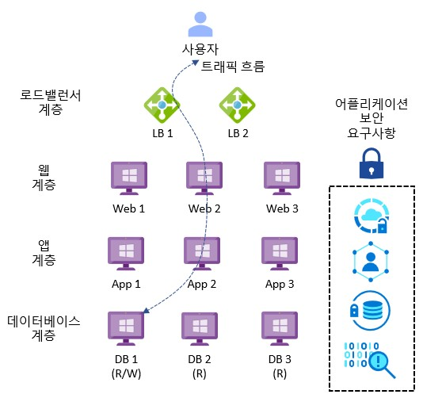

그림 1 – 일반적인 레거시 비즈니스 크리티컬 애플리케이션 아키텍처

다음 섹션에서는 AVS의 아키텍처 구성 요소를 소개합니다.

***아키텍처 구성요소***

아래 다이어그램은 AVS의 아키텍처 구성 요소를 보여줍니다.

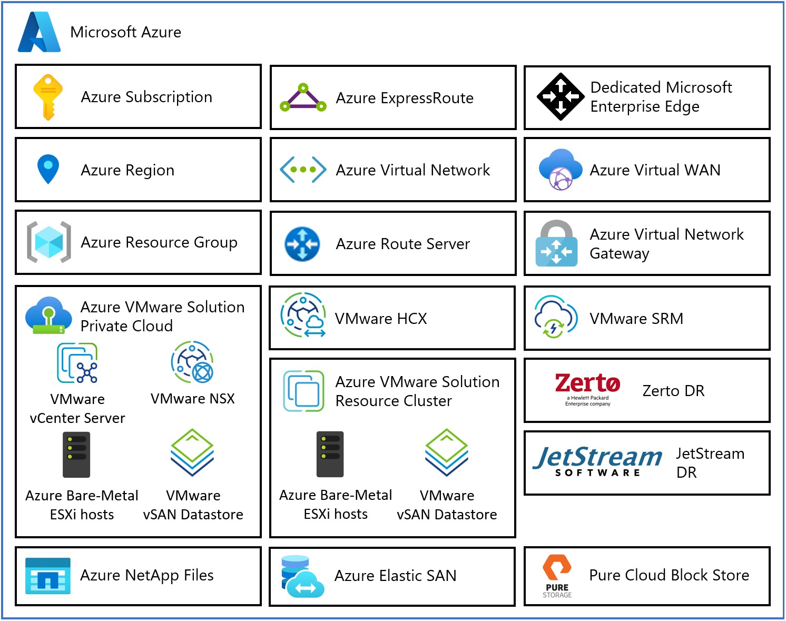

그림 2 – AVS 아키텍처 구성요소

각 AVS 아키텍처 구성 요소는 다음과 같습니다.

- **Azure 구독**: AVS에 대한 접근 제어, 예산 및 할당량 관리를 제공하는 데 사용됩니다. **Azure 지역**: 데이터 센터를 AZ로 그룹화한 다음 AZ를 지역으로 그룹화하는 전 세계의 물리적 위치입니다. **Azure 리소스 그룹**: Azure 서비스 및 리소스를 논리적 그룹에 배치하는 데 사용되는 자원의 단위 컨테이너. **AVS 프라이빗 클라우드**: vCenter Server, NSX 소프트웨어 정의 네트워킹, vSAN 소프트웨어 정의 스토리지, Azure 베어메탈 ESXi 호스트를 포함한 VMware 소프트웨어를 사용하여 컴퓨팅, 네트워킹, 스토리지 리소스등 VMware 전체 스택을 제공합니다. Azure NetApp Files, Azure Elastic SAN, 퓨어 클라우드 블록 스토어도 지원됩니다. VMware 환경을 Azure로 마이그레이션하거나 새로운 VMware 클라우드를 구축하고자 하는 고객에게 적합합니다. **AVS 리소스 클러스터**: AVS Private Cloud의 일부로, 특정 리소스를 할당하는 클러스터입니다. 특정 애플리케이션 또는 작업에 필요한 자원을 할당하고 관리하는 데 중점을 둡니다.vSAN 소프트웨어 정의 스토리지를 포함한 VMware 소프트웨어와 Azure 베어메탈 ESXi 호스트를 사용하여 AVS 프라이빗 클라우드를 확장함으로써 고객 워크로드를 위한 컴퓨팅, 네트워킹, 스토리지 리소스를 제공합니다. Azure NetApp Files, Azure Elastic SAN, 퓨어 클라우드 블록 스토어도 지원됩니다. **VMware HCX**: 모빌리티, 마이그레이션, 네트워크 확장 서비스를 제공합니다. **VMware 사이트 복구**: 재해 복구 자동화 및 VMware vSphere Replication을 통한 스토리지 복제 서비스를 제공합니다. 타사 재해 복구 솔루션인 Zerto DR 및 JetStream DR도 지원됩니다. **전용 Microsoft 엔터프라이즈 엣지(D-MSEE)**: Azure 클라우드와 AVS 프라이빗 클라우드 인스턴스 간의 연결을 제공하는 라우터입니다. **Azure 가상 네트워크(VNet)**: Azure 서비스 및 리소스를 함께 연결하는 데 사용되는 프라이빗 네트워크. **Azure 라우트 서버**: 네트워크 어플라이언스가 Azure 네트워크와 동적 라우팅 정보를 교환할 수 있도록 합니다. **Azure 가상 네트워크 게이트웨이**: Azure 서비스 및 리소스를 다른 프라이빗 네트워크에 연결하기 위한 온-프레미스 간 게이트웨이로, IPSec VPN, ExpressRoute 및 VNet-to-VNet을 사용합니다. **Azure ExpressRoute**: Azure 데이터 센터와 온-프레미스 또는 코로케이션 인프라 간에 고속 프라이빗 연결을 제공합니다. **Azure 가상 WAN(vWAN)**: 네트워킹, 보안 및 라우팅 기능을 하나의 통합된 WAN(광역 네트워크)으로 통합합니다.

다음 섹션에서는 Azure 클라우드 리소스를 보호하기 위한 프레임워크로 사용해야 하는 제로 트러스트 보안 모델을 소개합니다.

***제로 트러스트 보안 모델***

제로 트러스트에 대한 총체적인 접근 방식은 ID, 엔드포인트, 네트워크, 데이터, 앱, 인프라를 포함한 전체 디지털 자산으로 확장되어야 합니다. 제로 트러스트 아키텍처는 포괄적인 엔드투엔드 전략의 역할을 하며 모든 요소의 통합이 필요합니다.

제로 트러스트 보안의 기본은 ID입니다. 개인 또는 기업 엔드포인트에서 규정을 준수하는 디바이스로 연결하고, 제로 트러스트 원칙인 명시적 인증, 최소 권한 액세스, 위반 가정에 기반한 정책에 따라 액세스를 요청하는 강력한 인증이 필요합니다.

제로 트러스트 정책은 통합된 정책 시행이며 요청을 가로채서 정책 구성에 따라 6가지 기본 요소의 신호를 모두 명시적으로 확인하며 최소 권한 액세스를 시행합니다. 신호에는 사용자의 역할, 위치, 디바이스 규정 준수, 데이터 민감도, 애플리케이션 민감도가 포함됩니다. 원격 측정 및 상태 정보 외에도 위협 방어의 위험 평가가 정책 엔진에 제공되어 실시간으로 위협에 자동으로 대응합니다. 정책은 액세스 시점에 적용되며 세션 내내 지속적으로 평가됩니다.

이 정책은 정책 최적화를 통해 더욱 강화됩니다. 거버넌스와 규정 준수는 강력한 제로 트러스트 구현에 매우 중요합니다. 보안 태세 평가와 생산성 최적화는 서비스 및 시스템 전반의 원격 측정을 측정하는 데 필요합니다.

원격 측정 및 분석이 위협 방어 시스템에 다시 입력됩니다. 위협 인텔리전스로 강화된 대량의 원격 측정 및 분석은 수동으로 조사하거나 자동화할 수 있는 고품질 위험 평가를 생성합니다. 공격은 클라우드 속도로 발생하며, 사람이 충분히 빠르게 대응하거나 모든 위험을 선별할 수 없기 때문에 방어 시스템도 클라우드 속도로 작동해야 합니다. 위험 평가는 실시간 자동화된 위협 보호를 위해 정책 엔진에 제공되며, 필요한 경우 추가 수동 조사를 수행합니다.

공용 또는 사설 네트워크에 대한 액세스가 허용되기 전에 제로 트러스트 정책에서 트래픽 필터링 및 세그먼테이션이 평가 및 시행에 적용됩니다.

이메일, 문서, 구조화된 데이터에 데이터 분류, 라벨링, 암호화를 적용해야 합니다. 앱에 대한 액세스는 SaaS든 온프레미스든 상관없이 적응형이어야 합니다. 런타임 제어는 서버리스, 컨테이너, IaaS, PaaS 및 내부 사이트와 JIT(Just-In-Time) 및 버전 제어가 활성화된 인프라에 적용됩니다.

마지막으로 네트워크, 데이터, 앱, 인프라의 원격 측정, 분석, 평가가 정책 최적화 및 위협 방지 시스템에 다시 입력되어 피드백됩니다.

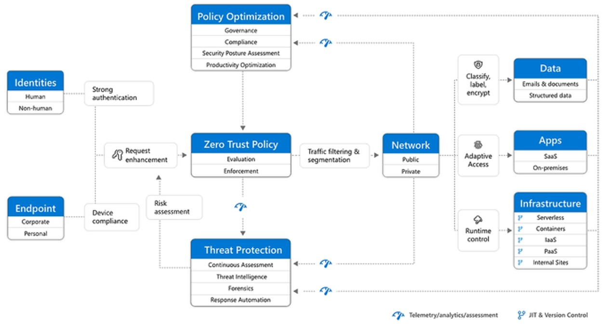

그림 3 – 제로 트러스트 보안 모델

많은 레거시 모놀리식 애플리케이션 스택이 기존의 심층 방어 보안 모델을 사용할 수 있지만, 여기서는 제로 트러스트 보안 모델을 도입하여 고려했습니다.

자세한 내용은 [Microsoft 보안 채택 프레임워크](https://learn.microsoft.com/ko-kr/security/ciso-workshop/adoption) 및 [Microsoft 사이버 보안 참조 아키텍처](https://learn.microsoft.com/ko-kr/security/cybersecurity-reference-architecture/mcra)를 참조하세요.

다음 섹션에서는 AVS의 보안 설계 고려 사항에 대해 설명합니다.

***보안 디자인 고려사항***

아키텍처 디자인 프로세스는 해결해야 할 비즈니스 문제와 달성해야 할 비즈니스 목표를 파악하고 이를 고객 요구사항, 디자인 제약 조건 및 가정으로 추출합니다. 디자인 제약 조건은 다음 세 가지 범주로 특징 지을 수 있습니다:

- 공간 제약의 법칙 : 데이터 및 애플리케이션 주권, 거버넌스, 규제, 규정 준수 등 물리 법칙 : 데이터 및 기계 중력, 네트워크 지연 시간 등 경제학의 법칙 : 소유 Vs 임대, 총소유비용(TCO), 투자 수익률(ROI), 자본 지출, 운영 지출, 이자, 세금, 감가상각비, 상각 전 영업이익(EBITDA) 등입니다.

각 디자인 고려 사항은 가용성, 비즈니스 연속성, 성능, 관리 용이성 및 보안 디자인 품질 간의 절충점이 될 것입니다. 바람직한 결과는 고객의 목표로부터 출발하여 최소한의 위험으로 비즈니스 가치를 제공하는 것입니다.

**설계 고려 사항 1 - 거버넌스, 규정 및 규정 준수:** [Microsoft 클라우드 서비스가 데이터를 보호하는 방법](https://servicetrust.microsoft.com/)과 이러한 인증, 규정 및 표준을 통해 조직의 클라우드 데이터 보안 및 규정 준수를 관리하는 방법에 대해 알아보세요. 또한 보고서, 백서, 아티팩트 및 산업/지역 리소스도 포함되어 있습니다.

또한 [Microsoft 클라우드 보안 벤치마크](https://learn.microsoft.com/ko-kr/security/benchmark/azure/introduction)를 사용하여 고객이 Azure 인프라를 보호할 때 겪는 일반적인 문제를 해결할 수 있습니다.

자세한 내용은 [Azure VMware 솔루션의 보안, 거버넌스 및 규정 준수 분야](https://learn.microsoft.com/ko-kr/azure/cloud-adoption-framework/scenarios/azure-vmware/eslz-security-governance-and-compliance)를 참조하세요.

**설계 고려 사항 2 - Azure 지역:** 거버넌스, 규정 및 규정 준수 요구 사항을 충족하는 관련 Azure 지역을 선택합니다. AVS는 [전 세계 30개 Azure 리전에서 사용](https://azure.microsoft.com/ko-kr/explore/global-infrastructure/products-by-region/?products=azure-vmware)할 수 있습니다. AVS는 두 개의 Azure Government 지역에서도 사용할 수 있으며 FedRAMP HIGH 인증 범위에서 사용할 수 있습니다. Azure Government의 AVS는 현재 DoD IL4/IL5에 대한 승인을 대기 중입니다.

**설계 고려 사항 3 - ID 및 액세스 관리:** 역할 기반 액세스 제어를 사용하여 AVS에 대한 보안 액세스를 제공하세요.

Microsoft Entra 권한 있는 ID 관리를 사용하여 Azure 포털 및 제어 창 작업에 대한 시간 제한 액세스를 허용하세요. 권한 있는 ID 관리 감사 기록을 사용하여 높은 권한의 계정이 수행하는 작업을 추적하세요.

자세한 내용은 [Azure VMware 솔루션 워크로드에 대한 보안 고려 사항](https://learn.microsoft.com/ko-kr/azure/well-architected/azure-vmware/security) 및 [엔터프라이즈급 ID 및 액세스 관리](https://learn.microsoft.com/ko-kr/azure/cloud-adoption-framework/scenarios/azure-vmware/eslz-identity-and-access-management)를 참조하세요.

**설계 고려 사항 4 - LDAPS 통합:** AVS에 대한 외부 ID 소스를 선택합니다.

vCenter Server 및 NSX Manager의 로컬 클라우드 관리자 사용자 계정은 프라이빗 클라우드의 “깨진 유리” 시나리오를 위한 비상 액세스 계정으로 사용해야 합니다. 일상적인 관리 활동이나 다른 서비스와의 통합을 위해 사용해서는 안 됩니다. 외부 ID 소스를 사용하여 관리자와 운영자에게 AVS에 대한 액세스 권한을 부여하세요. 이렇게 하면 AVS에 액세스할 때 회사 자격 증명을 사용할 수 있습니다.

자세한 내용은 [ID 및 액세스](https://learn.microsoft.com/ko-kr/azure/azure-vmware/concepts-identity)를 참조하세요. [Azure VMware 솔루션 내에서 LDAPS를 구성](https://techcommunity.microsoft.com/t5/fasttrack-for-azure/configure-ldaps-within-azure-vmware-solution/ba-p/3725759)하는 자세한 절차도 제공합니다.

**설계 고려 사항 5 - SIEM 로깅:** 플랫폼 로그 및 메트릭을 SIEM(보안 정보 및 이벤트 관리) 솔루션으로 스트리밍하려면 AVS 진단 설정을 선택합니다.

AVS는 로깅 대상으로 Azure Log Analytics, Azure Event Hub 및 Azure Blob Storage를 지원합니다. 로그 스트림에는 다음이 포함됩니다:

- vCenter Server logs
- ESXi logs
- vSAN logs
- NSX Manager logs
- NSX Data Center Distributed Firewall logs
- NSX Data Center Gateway Firewall logs
- NSX Data Center Edge Appliance logs

AVS는 현재 고객 Syslog 서버로의 Syslog포워딩을 지원하지 않지만, 대안으로 사용할 수 있는 [Syslog 포워딩 기능](https://techcommunity.microsoft.com/t5/azure-migration-and/azure-vmware-solution-syslog-forwarder/ba-p/3698210)이 있습니다.

자세한 내용은 [Azure VMware 솔루션에 대한 VMware syslog 구성](https://learn.microsoft.com/ko-kr/azure/azure-vmware/configure-vmware-syslogs)을 참조하십시오.

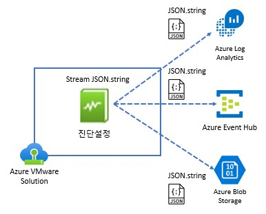

그림 4 – AVS 로깅 옵션

**설계 고려 사항 6 - VMware vSAN 암호화:** 고객 관리 키를 사용하여 AVS vSAN 암호화 프로세스를 강화합니다.

고객 관리 키를 사용하면 AVS의 암호화된 vSAN 데이터를 제어할 수 있습니다. Azure Key Vault를 사용하여 고객 관리 키를 생성하고 키 관리 프로세스를 중앙 집중화할 수 있습니다.

자세한 내용은 [Azure VMware Solution에서 저장 데이터에 대한 고객 관리 키 암호화 구성](https://learn.microsoft.com/ko-kr/azure/azure-vmware/configure-customer-managed-keys?tabs=azure-portal)을 참조하십시오.

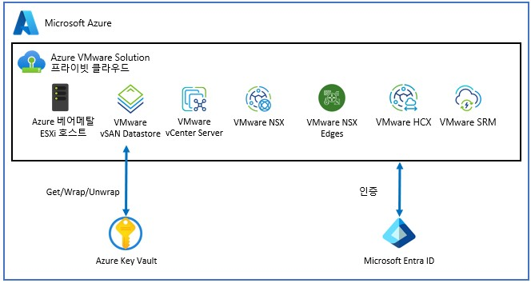

그림 5 – AVS에서 고객 관리 키

**설계 고려 사항 7 - VM 보안:** 가상 머신의 보안을 강화하려면 AVS와 함께 Trusted Launch를 사용하세요.

Trusted Launch는 보안 부팅, vTPM(가상 신뢰할 수 있는 플랫폼 모듈) 및 VBS(가상화 기반 보안)로 구성되어 최신 사이버 위협에 대한 강력한 방어 기능을 제공합니다. 신뢰할 수 있는 실행은 Windows 11 호환성을 위한 필수 요건입니다.

자세한 내용은 [Azure VMware 솔루션 가상 머신에 대한 Trusted Launch](https://techcommunity.microsoft.com/t5/azure-migration-and/trusted-launch-for-azure-vmware-solution-virtual-machines/ba-p/3929945)를 참조하십시오.

**설계 고려 사항 8 - 방화벽 배치:** 트래픽 흐름 요구 사항을 충족하기 위해 신뢰 영역 토폴로지를 포함하여 AVS 또는 Azure 기본 서비스 내에서 네트워크 보안 방화벽의 배치 위치를 선택합니다.

신뢰 영역은 해당 영역 내의 디바이스 및 사용자에게 할당된 신뢰 수준에 따라 네트워크를 여러 영역으로 세분화하는 개념을 말합니다. 이는 제로 트러스트 보안 모델의 일부로 사용되며, 리소스에 대한 액세스 권한이 필요 시 부여되고 지속적인 인증 및 권한 부여를 통해 엄격하게 시행됩니다.

트래픽 흐름은 네트워크에서 서로 다른 신뢰 영역 간의 데이터 이동을 의미합니다. 트래픽 흐름을 이해하는 것은 네트워크 설계, 용량 계획 및 정보 보안에 중요합니다.

AVS의 경우, 신뢰 영역은 AVS 프라이빗 클라우드, Azure 네이티브 서비스, 인터넷 및 기타 Azure 이외의 위치를 고려해야 합니다.

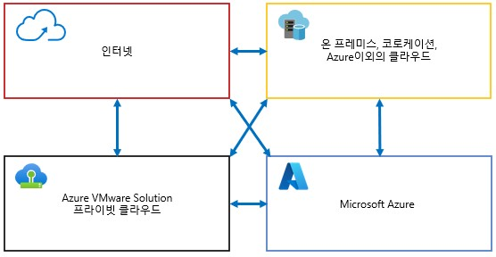

그림 6 – 신뢰 영역

Azure 클라우드 채택 프레임워크에는 AVS와 다른 Azure 리소스, 온프레미스 및 인터넷 간의 네트워크 트래픽을 보호하고 관리하는 다양한 방법을 설명하는 네 가지 옵션이 있습니다:

1. 옵션 1: 기본 경로 전파가 포함된 보안 가상 WAN 허브를 사용하여 모든 트래픽을 Azure 방화벽 또는 타사 보안 공급자를 통해 라우팅합니다.
2. 옵션 2: Azure 가상 네트워크의 네트워크 가상 어플라이언스를 사용하여 모든 네트워크 트래픽을 검사하고 방화벽 규칙 또는 정책을 적용합니다.
3. 옵션 3: NSX 또는 NVA를 사용하거나 사용하지 않고 AVS에서 다른 대상으로의 아웃바운드 트래픽을 제어하기 위해 AVS에서 트래픽 송출됩니다.
4. 옵션 4: Azure Route Server가 있는 허브 가상 네트워크에서 타사 방화벽 솔루션을 사용하여 AVS와 방화벽 어플라이언스 간에 동적 라우팅을 사용하도록 설정합니다.

각 옵션에는 요구 사항과 선호도에 따라 고유한 장점과 장단점이 있습니다.

또한 호스트 기반 엔드포인트 솔루션의 선택적 사용을 포함하여 남북 및 동서 트래픽을 보호하는 데 사용할 수 있는 VMware NSX 기능도 있습니다.

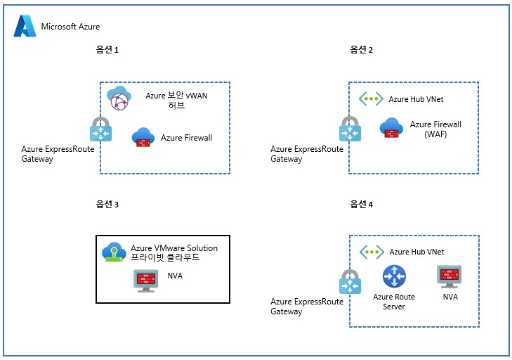

그림 7 – Azure Firewall 과 타사 NVA 옵션

*옵션 1 - 보안 가상 WAN 허브:* 기본 경로 전파가 있는 보안 가상 WAN 허브를 사용하여 모든 트래픽을 Azure 방화벽 또는 타사 보안 공급자를 통해 라우팅합니다.

이 솔루션은 온프레미스 필터링에는 작동하지 않으며 Global Reach는 가상 WAN 허브를 우회합니다.

자세한 내용은 [Azure 클라우드 채택 프레임워크](https://learn.microsoft.com/ko-kr/azure/cloud-adoption-framework/scenarios/azure-vmware/example-architectures#secured-virtual-wan-hub-with-default-route-propagation)를 참조하세요.

그림 8 – 옵션 1: 보안 Virtual WAN hub

*옵션 2 - 모든 트래픽에 대한 타사 방화벽:* Azure 가상 네트워크에서 네트워크 가상 어플라이언스를 사용하여 모든 네트워크 트래픽을 검사하고 방화벽 규칙 또는 정책을 적용합니다.

기존 NVA를 사용하고 허브 가상 네트워크에서 모든 트래픽 검사를 중앙 집중화하려는 경우 이 옵션을 선택하세요.

자세한 내용은 [Azure 클라우드 채택 프레임워크](https://learn.microsoft.com/ko-kr/azure/cloud-adoption-framework/scenarios/azure-vmware/example-architectures#network-virtual-appliance-in-azure-virtual-network-to-inspect-all-network-traffic)를 참조하세요.

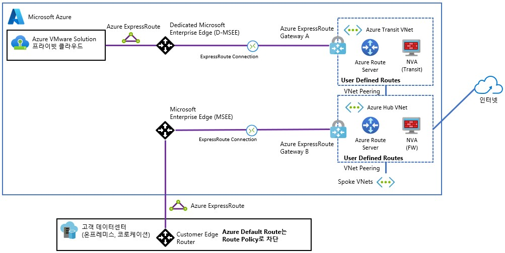

그림 9 –옵션 2: 모든 트래픽에 대한 타사 방화벽

아래 다이어그램은 시나리오 2를 구축하는 데 FortiNet FortiGate NVA를 사용하는 방법에 대한 예시를 제공합니다.

자세한 내용은 [Azure 라우팅 및 네트워크 인터페이스](https://docs.fortinet.com/document/fortigate-public-cloud/7.4.0/azure-administration-guide/609353/azure-routing-and-network-interfaces)를 참조하세요.

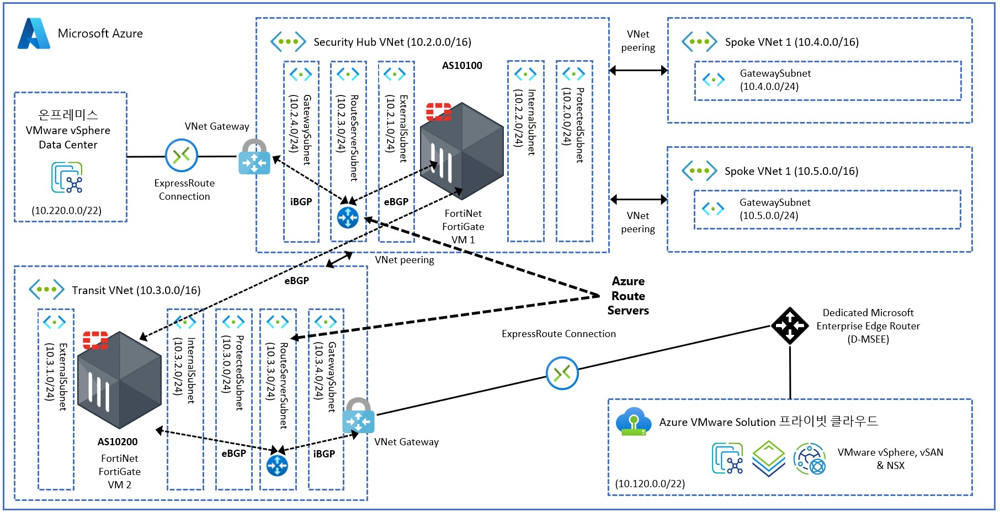

그림 10 – 포티넷 포티게이트 NVA를 사용한 옵션 2의 설계 예시

*옵션 3 - AVS 에서 트래픽 송출:* NSX 또는 NVA를 사용하거나 사용하지 않고 AVS에서 다른 대상으로의 아웃바운드 트래픽을 제어하기 위해 AVS에서 트래픽 송출

둘 이상의 AVS 프라이빗 클라우드에서 트래픽을 검사해야 하는 경우 이 옵션을 선택합니다. 이 옵션을 사용하면 NSX 기본 기능을 사용할 수 있습니다. 또한 이 옵션을 계층 0 및 계층 1 게이트웨이 간에 AVS에서 실행되는 NVA와 결합할 수도 있습니다.

자세한 내용은 [Azure 클라우드 채택 프레임워크](https://learn.microsoft.com/ko-kr/azure/cloud-adoption-framework/scenarios/azure-vmware/example-architectures#egress-from-azure-vmware-solution-with-or-without-nsx-t-or-nva)를 참조하세요.

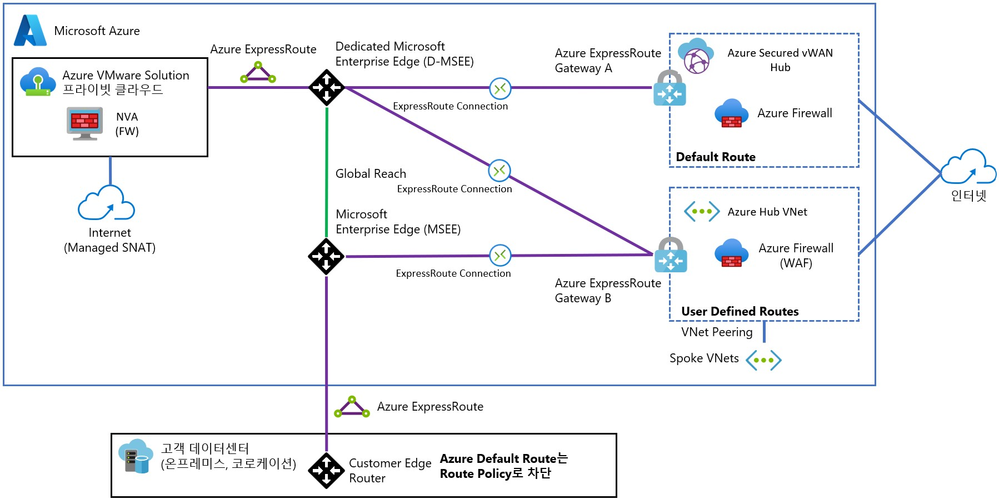

그림 11 – Option 3: AVS에서 트래픽 송출

*옵션 4 - 인터넷 트래픽을 위한 타사 방화벽:* Azure 라우트 서버가 있는 허브 가상 네트워크에서 타사 방화벽 솔루션을 사용하여 AVS와 방화벽 어플라이언스 간에 동적 라우팅을 사용하도록 설정합니다.

이 옵션을 선택하면 Azure 허브 가상 네트워크의 NVA에서 AVS로 기본 경로를 알립니다.

자세한 내용은 [Azure 클라우드 채택 프레임워크](https://learn.microsoft.com/ko-kr/azure/cloud-adoption-framework/scenarios/azure-vmware/example-architectures#third-party-firewall-solutions-in-a-hub-virtual-network-with-azure-route-servers)를 참조하세요.

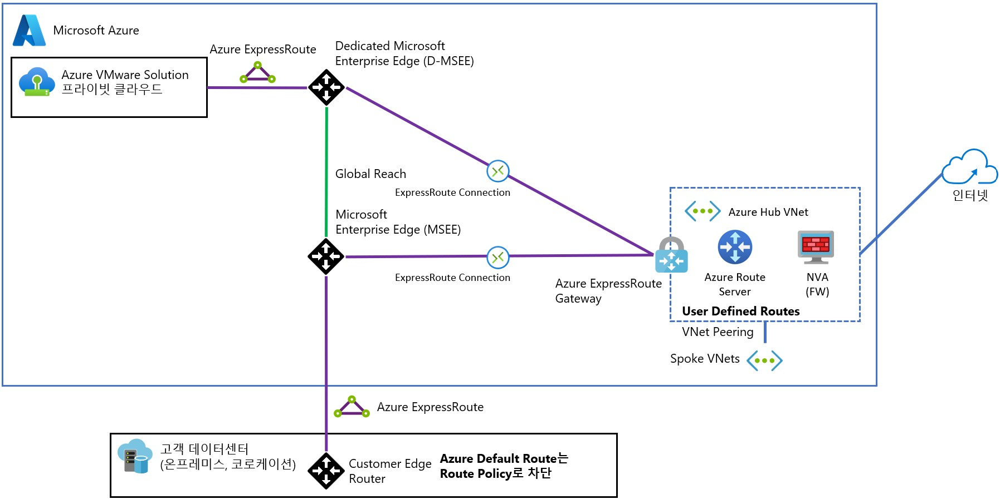

Figure 12 – 옵션 4: 인터넷 트래픽에 타사 방화벽 사용

*옵션 5 - NSX 게이트웨이:* NSX Gateway를 사용하여 남-북 네트워크 트래픽을 보호합니다.

NSX에서 계층 0 및 계층 1 게이트웨이의 네트워크 필터링 기능을 사용하여 남-북 트래픽 필터링을 제공할 수 있습니다.

자세한 내용은 [Azure VMware 솔루션 네트워크 보안](https://learn.microsoft.com/ko-kr/azure/cloud-adoption-framework/scenarios/azure-vmware/eslz-network-topology-connectivity#network-security)을 참조하십시오.

그림 13 – 남-북 트래픽을 위한 VMware NSX 게이트웨이 방화벽 정책

*옵션 6 - DFW를 사용한 마이크로 세분화:* NSX Distributed Firewall을 사용하여 동-서 네트워크 트래픽을 보호합니다.

NSX에서 분산 방화벽을 사용하여 트래픽 흐름의 동-서 마이크로 세분화를 제공할 수 있습니다.

자세한 내용은 [Azure VMware 솔루션 네트워크 보안](https://learn.microsoft.com/ko-kr/azure/cloud-adoption-framework/scenarios/azure-vmware/eslz-network-topology-connectivity#network-security)을 참조하십시오.

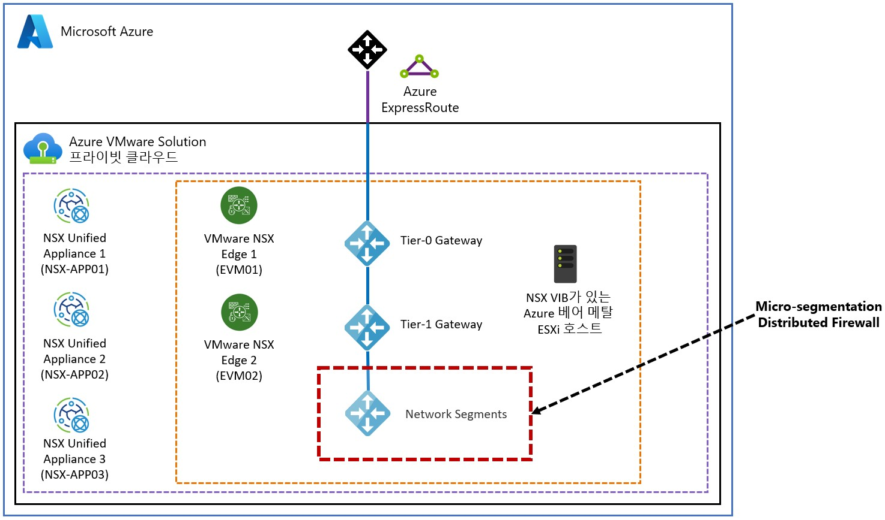

그림 14 – 동-서 트래픽을 위한 VMware NSX Micro-segmentation (DFW)

*옵션 7 - 클라우드용 Microsoft Defender:* 클라우드용 Microsoft Defender 또는 타사 호스트 기반 보안 솔루션을 사용하여 게스트 운영 체제에서 트래픽을 보호할 수 있습니다.

클라우드용 Microsoft Defender는 AVS 및 온프레미스 VM에서 고급 위협 보호를 제공합니다. 이 제품은 AVS VM의 취약성을 평가하고 필요에 따라 경고를 발생시킵니다. 이러한 보안 경고는 해결을 위해 Azure Monitor로 전달될 수 있습니다. 클라우드용 Microsoft Defender에서 보안 정책을 정의할 수 있습니다.

자세한 내용은 [클라우드용 Microsoft Defender와 Azure VMware 솔루션 통합을](https://learn.microsoft.com/ko-kr/azure/azure-vmware/azure-security-integration) 참조하세요.

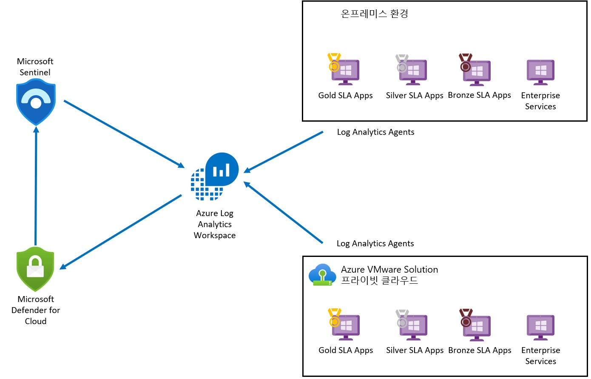

그림 15 – Microsoft Defender for Cloud와 Azure VMware Solution

**설계 고려 사항 9 - 인터넷 액세스:** 각 프라이빗 클라우드 인스턴스 내에서 구성할 수 있는 AVS에는 세 가지 옵션이 있습니다. 이러한 옵션은 설계 고려 사항 8의 방화벽 시나리오와도 겹칩니다.

*옵션 1 - 인터넷 사용 안 함:* Azure 기본 네트워킹을 사용하여 인터넷 액세스를 제공합니다.

Azure에서 기본 경로를 생성하여 AVS 프라이빗 클라우드 또는 온프레미스로 전송하는 방법에는 여러 가지가 있습니다. 옵션은 다음과 같습니다:

- 가상 WAN 허브의 Azure 방화벽.
- 가상 WAN 허브 스포크 가상 네트워크의 타사 네트워크 가상 어플라이언스.
- Azure 라우트 서버를 사용하는 네이티브 Azure 가상 네트워크의 타사 네트워크 가상 어플라이언스.
- 온-프레미스의 기본 경로가 글로벌 도달을 통해 AVS로 전송됩니다.

자세한 내용은 [인터넷 연결 설계 고려 사항](https://learn.microsoft.com/ko-kr/azure/azure-vmware/concepts-design-public-internet-access) 을 참조하십시오.

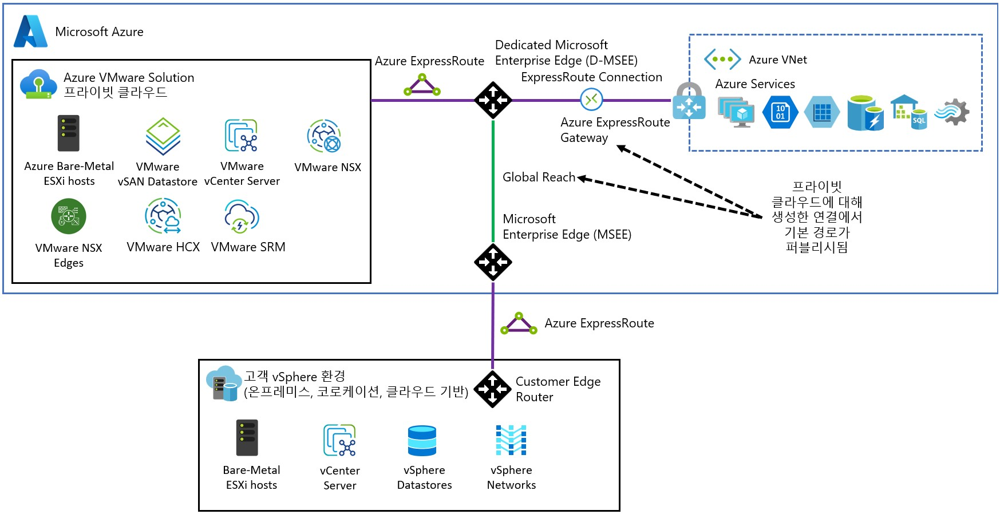

그림 16 – 인터넷을 사용하지 않는 AVS

*옵션 2 - 관리형 SNAT:* 관리형 SNAT 서비스는 AVS 프라이빗 클라우드에서 아웃바운드 인터넷 액세스를 위한 간단한 방법을 제공합니다.

Managed SNAT의 기능은 다음과 같습니다:

- 간편한 사용.
- SNAT 규칙에 대한 제어 없이 SNAT 서비스에 도달하는 모든 소스가 허용됩니다.
- 연결 로그에 대한 가시성이 없습니다.
- 최대 128,000개의 동시 아웃바운드 연결을 지원하기 위해 2개의 공인 IP를 사용하여 로테이션합니다.
- 인바운드 DNAT 기능은 사용할 수 없습니다.

자세한 내용은 [인터넷 연결 설계 고려 사항](https://learn.microsoft.com/ko-kr/azure/azure-vmware/concepts-design-public-internet-access) 을 참조하세요.

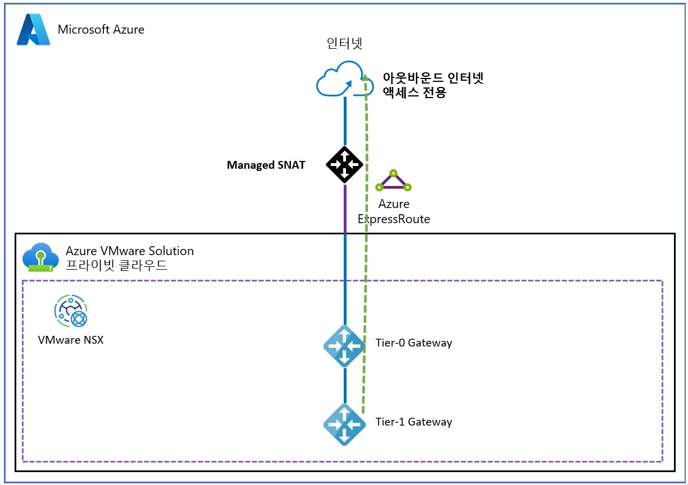

그림 17 – AVS 관리형 SNAT 인터넷 접속

*옵션 3 - 공용 IP 주소:* 할당된 Azure 공용 IPv4 주소를 NSX Edge에서 직접 사용합니다.

공용 IP를 사용하면 AVS 프라이빗 클라우드에서 필요에 따라 NSX의 공용 네트워크 주소를 직접 사용하고 적용할 수 있습니다. 이러한 주소는 다음 유형의 연결에 사용됩니다:

- 아웃바운드 SNAT
- 인바운드 DNAT
- VMware NSX 고급 로드 밸런서 및 기타 타사 네트워크 가상 어플라이언스를 사용한 부하 분산
- 워크로드 VM 인터페이스에 직접 연결된 애플리케이션.

또한 이 옵션을 사용하면 타사 네트워크 가상 기기에서 공용 주소를 구성하여 AVS 프라이빗 클라우드 내에 DMZ를 생성할 수 있습니다. Azure 공용 IP 주소는 고객 소유이며 Microsoft에서 적극적으로 스캔하지 않습니다. 인터넷 연결을 완전히 보호하려면 클라우드용 Microsoft Defender 또는 적절한 타사 솔루션을 사용해야 합니다. 이러한 옵션은 설계 고려 사항 8을 참고하세요.

자세한 내용은 [인터넷 연결 설계 고려 사항](https://learn.microsoft.com/ko-kr/azure/azure-vmware/concepts-design-public-internet-access) 을 참조하세요.

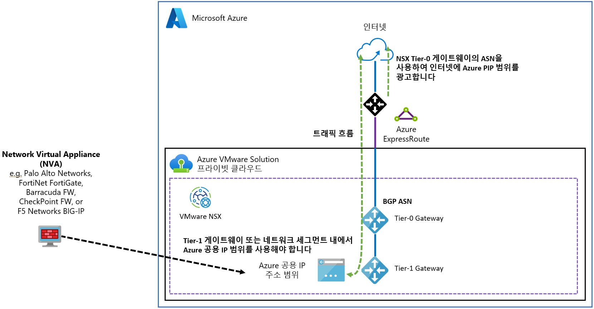

그림 18 – Azure VMware Solution VMware NSX 공용 IP 주소

타사 NVA와 함께 “T1 샌드위치”를 사용하면 VMware vSphere 가상 머신 하드웨어의 vNIC 10개 제한을 초과하여 확장할 수 있습니다. 그 결과 NVA로 보호할 수 있는 네트워크 수가 증가합니다. 그림 19에서 T1 샌드위치 토폴로지와 함께 CheckPoint NVA를 사용하는 예를 보여줍니다.

그림 19 – CheckPoint를 사용한 VMware NSX T1 Gateway 샌드위치

***추후 단계***

AVS 마이그레이션을 위한 사이징 견적은 [Azure Migrate](https://learn.microsoft.com/ko-kr/azure/migrate/how-to-create-azure-vmware-solution-assessment?context=%2Fazure%2Fazure-vmware%2Fcontext%2Fcontext)를 사용하여 평가해야 합니다. 대규모 엔터프라이즈 솔루션의 경우, 최소한의 위험으로 비즈니스 가치를 제공할 수 있도록 솔루션의 크기가 올바르게 조정되었는지 확인하기 위해 Azure, VMware 또는 VMware 파트너의 AVS 아키텍트가 참여해야 합니다. 여기에는 애플리케이션 그룹 간의 매핑을 이해하고 데이터 중력 영역, 애플리케이션 네트워크 트래픽 흐름 및 네트워크 지연 시간 종속성을 파악하기 위한 애플리케이션 종속성 평가도 포함되어야 합니다.

***마무리***

이 게시물에서는 고객 워크로드의 일반적인 보안 요구 사항, 아키텍처 구성 요소, 제로 트러스트 보안 모델 및 AVS의 보안 설계 고려 사항에 대해 자세히 살펴보았습니다. 또한 AVS 설계를 계속하기 위한 다음 단계에 대해서도 논의했습니다.

참고 사이트:

- Homepage: [Azure VMware Solution](https://azure.microsoft.com/en-us/products/azure-vmware/)
- Documentation: [Azure VMware Solution](https://learn.microsoft.com/en-us/azure/azure-vmware/)
- SLA: [SLA for Azure VMware Solution](https://azure.microsoft.com/en-us/support/legal/sla/azure-vmware/v1_1/)
- Azure Regions: [Azure Products by Region](https://azure.microsoft.com/en-us/explore/global-infrastructure/products-by-region/?products=azure-vmware)
- Security Fundamentals: [Azure security fundamentals](https://learn.microsoft.com/en-us/azure/security/fundamentals/)
- Zero Trust Model: [Zero Trust Model - Modern Security Architecture](https://www.microsoft.com/en/security/business/zero-trust)
- Zero Trust Security Framework: [Zero Trust security in Azure](https://learn.microsoft.com/en-us/azure/security/fundamentals/zero-trust)
- Microsoft Cybersecurity: [Microsoft Cybersecurity Reference Architectures](https://learn.microsoft.com/en-us/security/cybersecurity-reference-architecture/mcra)
- Adoption Framework: [Microsoft Security Adoption Framework](https://learn.microsoft.com/en-us/security/ciso-workshop/adoption)
- Microsoft cloud: [Learn how Microsoft cloud services protect your data](https://servicetrust.microsoft.com/)
- Benchmark: [Microsoft cloud security benchmark](https://learn.microsoft.com/en-us/security/benchmark/azure/introduction)
- Azure VMware Solution: [Security, governance, and compliance disciplines](https://learn.microsoft.com/en-us/azure/cloud-adoption-framework/scenarios/azure-vmware/eslz-security-governance-and-compliance)
- Vulnerabilities: [Concepts - How Azure VMware Solution Addresses Vulnerabilities](https://learn.microsoft.com/en-us/azure/azure-vmware/concepts-vulnerability-management)
- Security Recommendations: [Concepts - Security recommendations for Azure VMware Solution](https://learn.microsoft.com/en-us/azure/azure-vmware/concepts-security-recommendations)
- Security Baseline: [Azure security baseline for Azure VMware Solution](https://learn.microsoft.com/en-us/security/benchmark/azure/baselines/azure-vmware-solution-security-baseline?toc=%2Fazure%2Fazure-vmware%2Ftoc.json)
- Defense in Depth: [Microsoft Azure's defense in depth approach to cloud vulnerabilities](https://azure.microsoft.com/en-us/blog/microsoft-azures-defense-in-depth-approach-to-cloud-vulnerabilities/)
- Azure Compliance: [Azure compliance documentation](https://learn.microsoft.com/en-us/azure/compliance/)
- WAF: [Security considerations for Azure VMware Solution workloads](https://learn.microsoft.com/en-us/azure/well-architected/azure-vmware/security)
- Identity & Access Management: [Enterprise-scale identity and access management](https://learn.microsoft.com/en-us/azure/cloud-adoption-framework/scenarios/azure-vmware/eslz-identity-and-access-management)
- Configure LDAPS: [Configure LDAPS within Azure VMware Solution](https://techcommunity.microsoft.com/t5/fasttrack-for-azure/configure-ldaps-within-azure-vmware-solution/ba-p/3725759)
- Syslog: [Configure VMware syslogs for Azure VMware Solution](https://learn.microsoft.com/en-us/azure/azure-vmware/configure-vmware-syslogs)
- Syslog Forwarding: [Syslog Forwarding function](https://techcommunity.microsoft.com/t5/azure-migration-and/azure-vmware-solution-syslog-forwarder/ba-p/3698210)
- Customer-managed keys: [Configure customer-managed key encryption at rest](https://learn.microsoft.com/en-us/azure/azure-vmware/configure-customer-managed-keys?tabs=azure-portal)
- Trusted Launch: [Trusted Launch for Azure VMware Solution virtual machines](https://techcommunity.microsoft.com/t5/azure-migration-and/trusted-launch-for-azure-vmware-solution-virtual-machines/ba-p/3929945)
- Network connectivity scenarios: [Enterprise-scale network topology and connectivity for Azure VMware Solution](https://learn.microsoft.com/en-us/azure/cloud-adoption-framework/scenarios/azure-vmware/eslz-network-topology-connectivity)
- Network Security: [Azure VMware Solution Network Security](https://learn.microsoft.com/en-us/azure/cloud-adoption-framework/scenarios/azure-vmware/eslz-network-topology-connectivity#network-security)
- Defender for Cloud: [Integrate Microsoft Defender for Cloud with Azure VMware Solution](https://learn.microsoft.com/en-us/azure/azure-vmware/azure-security-integration)
- Internet Connectivity: [Internet connectivity design considerations](https://learn.microsoft.com/en-us/azure/azure-vmware/concepts-design-public-internet-access)
- Service Limits: [Azure VMware Solution subscription limits and quotas](https://learn.microsoft.com/en-us/azure/azure-resource-manager/management/azure-subscription-service-limits#azure-vmware-solution-limits)
- GitHub repository: [Azure/azure-vmware-solution](https://github.com/Azure/azure-vmware-solution/)
- Well-Architected Framework: [Azure VMware Solution workloads](https://learn.microsoft.com/en-us/azure/well-architected/azure-vmware/)
- Cloud Adoption Framework: [Introduction to the Azure VMware Solution adoption scenario](https://learn.microsoft.com/en-us/azure/cloud-adoption-framework/scenarios/azure-vmware/)
- Enterprise Scale Landing Zone: [Enterprise-scale for Microsoft Azure VMware Solution](https://learn.microsoft.com/en-us/azure/cloud-adoption-framework/scenarios/azure-vmware/enterprise-scale-landing-zone)
- Enterprise Scale GitHub repository: [Azure/Enterprise-Scale-for-AVS](https://github.com/Azure/Enterprise-Scale-for-AVS)
- Azure CLI: [Azure Command-Line Interface (CLI) Overview](https://learn.microsoft.com/en-us/cli/azure/)
- PowerShell module: [Az.VMware Module](https://learn.microsoft.com/en-us/powershell/module/az.vmware/?view=azps-9.0.1)
- Azure Resource Manager: [Microsoft.AVS/privateClouds](https://learn.microsoft.com/en-us/azure/templates/microsoft.avs/privateclouds?pivots=deployment-language-bicep)
- REST API: [Azure VMware Solution REST API](https://learn.microsoft.com/en-us/rest/api/avs/)
- Terraform provider: [azurerm_vmware_private_cloud Terraform Registry](https://registry.terraform.io/providers/hashicorp/azurerm/latest/docs/resources/vmware_private_cloud)
