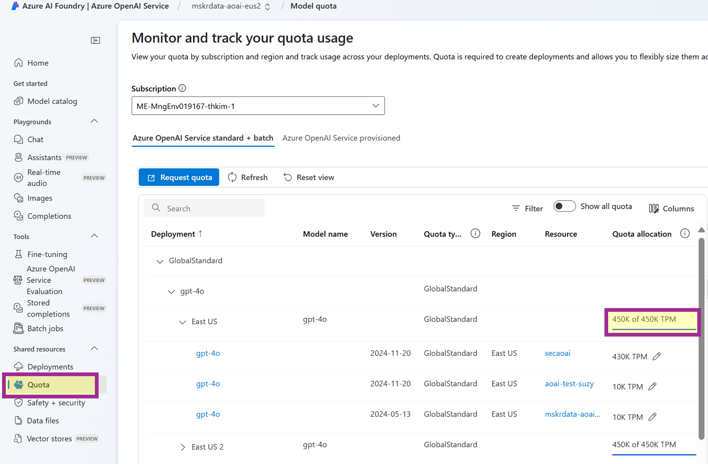

# RAG 기본 파이프라인 구현: Smart Resume Matching with Azure SQL Database

## Overview

### RAG

RAG(Retrieval-Augmented Generation)은 외부 데이터 검색을 통해 LLM의 응답을 보완하는 방법입니다. 일반적인 LLM은 학습 데이터 내에서만 답변을 생성하지만, RAG를 통해 추가적인 검색 과정을 거쳐 최신 데이터, 맥락에 적합한 데이터를 활용할 수 있게 됩니다.

파인 튜닝(Fine Tuning)과 비교하자면, 파인 튜닝은 LLM을 특정한 도메인의 데이터로 재학습해 모델을 개선하는 방법입니다. RAG는 모델 재학습의 필요 없이 실시간으로 새로운 데이터를 활용한다는 차이점을 가집니다.

RAG는 여러 시나리오로 구현 및 활용될 수 있습니다. 본 블로그에서는 그 중 리크루팅 과정에서의 Smart Resume Matching을 구현하며 기본적인 RAG 파이프라인을 이해하고자 합니다.

### RAG Use Case: Smart Resume Matching

기업의 채용 과정에서는 수많은 지원자 중 적합한 후보를 찾는 데 많은 시간과 비용이 소요됩니다. 이를 해결하기 위해 Microsoft를 비롯한 여러 기업들은 **AI 기반 Smart Resume Matching** 시스템을 도입하고 있습니다. 이는 AI가 지원서의 내용을 분석하고, 요구 사항과의 유사도를 평가하여 적합한 지원자를 추천하는 방식입니다.

본 글은 *Microsoft Dev Blog의 Smart Resume Matching ([Document RAG with Azure SQL DB & Document Intelligence](https://devblogs.microsoft.com/azure-sql/smart-resume-matching-with-azure-sql-db-document-intelligence/))*을 기반으로, **Azure SQL Database를 활용한 RAG**를 다룹니다. 또한 기존의 내용에 더해, **Azure OpenAI를 사용해 Sample Data**를 준비하는 과정과 **API Management를 통한 트래픽 관리** 방법까지 함께 살펴보겠습니다.

### RAG 기본 파이프라인

전반적인 흐름은 아래와 같습니다.

1. API Management 설정
2. Resume PDF Sample Data 생성 (Azure OpenAI)
3. PDF Chunking (Azure Document Intelligence)
4. Embedding 생성 (Azure OpenAI)
5. Vector 저장 및 Similarity 검색 (Azure SQL Database)
6. RAG 기반 답변 생성 (Azure OpenAI)

사용한 전체 코드는 *RAG_with_Resumes.ipynb ([RAG with Resumes Jupyter Notebook](https://github.com/suzyvaque/microsoft-azure-tutorials/blob/main/RAG-SQLDB-Resumes/RAG_with_Resumes.ipynb))*에서 확인 가능하며, 실행 시에는 *레포지터리 ([Repo for RAG SQLDB Resumes](https://github.com/suzyvaque/microsoft-azure-tutorials/tree/main/RAG-SQLDB-Resumes))* 전체를 Clone하는 방법이 편리합니다.

### Prerequisites

1. **Azure Subscription**
2. **Azure Resources**: 배포해야 하는 리소스 목록은 다음과 같습니다.

    i. ***Azure OpenAI** ([Azure OpenAI 리소스 만들기](https://learn.microsoft.com/ko-kr/azure/ai-services/openai/how-to/create-resource?pivots=web-portal))* — **Chat Completion** 모델과 **Embedding** 모델이 필요하며, ****APIM 사용을 위해 **각 모델을 최소 2개 이상의 Region에 동일한 이름으로 배포**해야 합니다.
    
    ii. ***API Management** ([APIM Manual Setup](https://github.com/azure-samples/openai-apim-lb/blob/main/docs/manual-setup.md)) —* 한국어 가이드는 본 블로그의 APIM 설정 항목을 참고하세요.
    
    iii. ***Document Intelligence** ([문서 인텔리전스 리소스 만들기](https://learn.microsoft.com/ko-kr/azure/ai-services/document-intelligence/how-to-guides/create-document-intelligence-resource?view=doc-intel-4.0.0))*
    
    iv. ***Azure SQL Database** ([Azure SQL Database 리소스 만들기](https://learn.microsoft.com/ko-kr/azure/azure-sql/database/free-offer?view=azuresql#create-a-database))*

3. **.env 파일**: 앞서 배포한 리소스의 Endpoint와 API Key 정보를 작성해야 합니다. 노트북 내의 셀을 실행해 작성 가능합니다.
4. **Jupyter Notebook**: 코드 테스트는 Azure Machine Learning Notebook을 기준으로 합니다.
5. **Python**: 코드 테스트는 3.10.11 버전을 기준으로 합니다.
 
&#160;
 
## 0️⃣ 트래픽 관리를 위한 준비 (Azure API Management)

*APIM 배포 및 Policy 설정을 위한 레퍼런스 ([APIM Manual Setup](https://github.com/azure-samples/openai-apim-lb/blob/main/docs/manual-setup.md))*

Azure의 PaaS형 리소스를 배포하면 해당 리소스를 호출할 수 있는 Endpoint가 생성됩니다. 이때 각 리소스의 사용 Quota가 설정되어 있어, 초과 호출 시 **HTTP 429 (Too Many Requests) 오류**가 발생할 수 있습니다.

예를 들어 Azure OpenAI는 **TPM(Tokens Per Minute)**이 제한되어 있습니다. 따라서 Azure OpenAI API를 짧은 시간 내에 반복적으로 호출한다면, 허용된 토큰 사용량을 초과해 HTTP 429 오류가 발생해 원하는 결과를 얻지 못할 가능성이 있습니다.

이를 해결하기 위해 Azure API Management(APIM)를 활용할 수 있습니다. APIM에 Policy를 등록하면, 특정 리소스를 통한 요청 처리 실패 시 다른 리소스로 요청 대상을 전환하는 Failover, 트래픽을 여러 인스턴스에 분산하는 Load Balancing을 수행할 수 있습니다. 이를 통해 **RAG 파이프라인에서 API 호출 안정성을 향상하고 일정한 성능을 유지**할 수 있습니다.

### Step 1. APIM 사용을 위한 Azure OpenAI 모델 배포

모델 배포의 절차는 *가이드 ([Azure AI Foundry에서 Azure OpenAI 모델 배포](https://learn.microsoft.com/ko-kr/azure/ai-studio/how-to/deploy-models-openai#deploy-an-azure-openai-model-from-your-project))*에서 확인할 수 있습니다. 이때 APIM 사용을 위해서는 모델의 Location과 Deployment Name에 주의해야 합니다.

1. Resource Location
    
    
    Azure OpenAI 모델의 **Quota는 TPM(Tokens Per Minute)** 단위로 정의되며, **Subscription 및 Region마다 할당**됩니다.

    
    
    예를 들어 위의 화면에서, GPT-4o의 총 Quota가 East US에 450K TPM 주어져 있습니다. 이는 East US에 위치한 3개의 Azure OpenAI 리소스에서 각각 430K, 10K, 10K TPM으로 분배되어 사용될 수 있습니다. 이처럼 특정 Region 내에서 **TPM이 초과되면 추가적인 API 호출이 차단**될 수 있으므로, **다른 Region에 추가 배포하는 것이 효율적**입니다.

    이후 단계에서 **Chat Completion과 Embedding 모델**을 사용할 때, **각 모델을 최소 2개 이상의 Region에 분산 배포**하는 것이 중요합니다. 예를 들어 다음과 같은 설정이 가능합니다.

    - **GPT-4o 모델을 East US와 East US 2에 각각 1개씩 배포** → East US의 Quota가 초과되어 Chat Completion 요청이 실패하면, APIM을 통해 자동으로 East US 2의 Quota를 사용하도록 Retry 가능
    - **Text-Embedding-Ada-002 모델을 East US와 East US 2에 각각 1개씩 배포** → 특정 Region에서 Embedding 요청이 과부하되면 다른 Region의 리소스를 활용 가능
 
&#160;
 
2. Deployment Name
    
    
    이때 APIM을 통해 동일한 모델의 서로 다른 Deployment를 호출하고자 한다면, **Deployment 간 이름을 동일하게 설정해야 합니다.**
    
    - **East US**에서 ****gpt-4o 모델을 배포할 때 배포명을 “4o-for-apim”으로 지정했다면, **East US 2**에서도 **동일한 “4o-for-apim” 배포명을 사용**해야 합니다.
    - 마찬가지로, Switzerland North에서 Embedding-Ada-002 모델을 “emb-for-apim”으로 배포했다면,  East US 2에서도  “emb-for-apim”로 동일하게 배포해야 합니다.
    
    이러한 설정을 통해 APIM에서 모델을 Region에 따라 자동으로 호출할 수 있어, 트래픽 관리가 더욱 원활해집니다.
    
 
&#160;
 
### Step 2. APIM 권한 부여: RBAC

APIM은 Response Code나 Traffic에 따라 여러 Backend를 호출하기 때문에, 각 Backend에 접근할 수 있는 권한이 필요합니다. 예를 들어, APIM의 Managed Indentity에 직접 Role을 지정하고 RBAC(Role Based Access Control) 기반 인증을 하는 방법이 존재합니다.
 
&#160;
 
1. Azure API Management 리소스를 생성할 때, Managed Identity의 Status를 체크합니다.
.png)
 
&#160;
 
2. 앞서 배포한 Azure OpenAI 리소스에 대한 APIM의 접근 권한을 부여하기 위해, 각 Azure OpenAI 리소스마다 다음 과정을 수행합니다.
    
        
    &#160;
    
    2-1. Azure OpenAI 리소스의 IAM 접속
    
    .png)
    
    2-2. Cognitive Services OpenAI User Role 선택
    
    .png)
    
    2-3. Assign Access to Managed Identity → Select Members에서 APIM 선택
    
    .png)
    
 
&#160;
 
### Step 3. (Optional) APIM 권한 부여: Key Authentication

앞서 사용한 RBAC을 통한 권한 부여 방식 외에도, 사용하는 Azure OpenAI의 API Key를 등록하는 방법도 존재합니다. 앞선 단계를 수행했다면 현 단계는 생략해도 괜찮습니다.
 
&#160;
 
1. APIM 리소스에서 **Named Values**를 추가합니다.
    
    .png)
    
    보안 상, **Key Vault에 Azure OpenAI의 API Key를 등록**해두고, Key Vault 타입으로 Named Values를 추가하는 방법이 권장됩니다. 사용할 Azure OpenAI API마다 아래의 과정을 반복해야 합니다.
        
    &#160;
    
    1-1. Key Vault에 Azure OpenAI의 API Key를 등록합니다.
    
    .png)
    
    .png)
        
    &#160;
    
    1-2. APIM에 Named Value를 Key Vault 타입으로 지정해, 앞서 설정한 Secret을 선택합니다.
    
    .png)
     
    &#160;
    
2. APIM 리소스에서 Backends를 추가합니다.
    
    
    .png)
    
    Runtime URL은 Backend URL에 /openai 를 Suffix로 추가한 형태여야 합니다. Header에는 Named Values에 등록해둔 Key를 선택합니다.
    
    .png)
    
 
&#160;
 
### Step 4. APIM OpenAPI 등록 및 Inbound Policy 설정

1. Azure OpenAI 버전에 맞는 *inference.json 파일 ([Rest API Specs for Azure OpenAI](https://github.com/Azure/azure-rest-api-specs/tree/main/specification/cognitiveservices/data-plane/AzureOpenAI/inference))*을 찾아 다운로드합니다.
    
    
2. 다운로드받은 inference.json 파일의 Default Endpoint를 자신이 사용할 Endpoint로 업데이트합니다.
        
        
    &#160;
    
3. APIM 리소스에서 APIs를 선택해 Azure OpenAPI를 생성합니다.
    
    .png)
    
    3-1. Azure OpenAPI specification으로 inference.json을 업로드합니다.
    
    3-2. API URL의 suffix로 openai 를 반드시 입력해야 합니다.
    
    .png)
     
    &#160;
    
4. Design Tab을 선택해 Inbound Processing Policy를 수정합니다.
    
    .png)
    
    Policy로 사용할 수 있는 *XML 파일 ([Azure OpenAI APIM Policy](https://github.com/Azure-Samples/openai-apim-lb/blob/main/apim-policy.xml))*에서 추가되는 Backend URL과 Priority를 수정해 Inbound Processing Policy로 사용합니다.
    
    .png)
    
    **만약 앞선 권한 부여의 단계에서 Step 2의 RBAC을 위한 설정 대신 Step 3의 Key Authentication을 위한 설정을 완료했다면, Step 3에서 APIM에 등록해둔 Backend ID를 사용하도록 로직을 업데이트해야 합니다. (e.g., Azure OpenAI의 Endpoint 전체를 지정하는 대신 \<set-backend-service backend-id="your backend name of Azure OpenAI" /> 와 같이 설정)*
     
    &#160;
    
5. APIM Subscription을 생성해 API로 앞선 단계에서 생성한 Azure OpenAPI를 선택합니다.
    
    .png)
    
 
&#160;
 
### Step 5. APIM Test

*APIM 테스트 ([APIM_Test.ipynb](https://github.com/suzyvaque/microsoft-azure-tutorials/blob/main/RAG-SQLDB-Resumes/APIM_Test.ipynb))* 수행 후 로그를 확인해보면, 실행 도중 Backend URL이 변경되는 현상을 확인할 수 있습니다.

디폴트 Backend에서 HTTP 429(Too Many Requests) 등의 오류 코드가 리턴될 경우, APIM이 자동으로 예비 Backend로 요청을 재전달하고, 예비 Backend에서 요청이 정상적으로 처리되면 최종적으로 HTTP 200(Success)이 리턴된 것입니다. 이러한 Failover 메커니즘을 통해 Quota 초과로 인한 요청 실패를 최소화할 수 있습니다.

.png)
 
&#160;
 
## 1️⃣ Sample Data 생성 (Azure OpenAI)

Sample Data를 직접 생성하기 위해 Azure OpenAI의 Chat Completion 모델을 사용할 수 있습니다.

### Step 1. Azure OpenAI Client 설정

APIM에 저장된 **Backend Endpoint를 활용하여 배포된 모델을 호출**할 수 있습니다.

이때 Chat Completion 모델을 호출하려면 **배포명**을 전달해야 하며, 해당 요청이 **Completion 기능**을 수행하는 것임을 지정해야 합니다. 이를 통해 APIM이 적절한 Backend로 요청을 전달할 수 있습니다.

.png)

### Step 2. 텍스트 생성 및 데이터 저장

Chat Completion 모델 API 호출 시에는 시스템 메세지 또는 유저 쿼리를 전달해야 합니다. 일반적으로 시스템 메세지는 모델 역할 설정, 답변 생성의 맥락 정의, 응답 형식 지정과 같은 내용을 전달합니다. 시스템 메세지 자체에 대한 별도의 토큰 제한은 없지만, API 호출 시 유저 쿼리와 함께 전달되므로 전체 토큰 사용량에 포함됩니다. 따라서 긴 시스템 메세지를 설정할 경우, 이후 토큰 제한을 초과하지 않도록 주의해야 합니다.

Sample Data 생성을 위해서는 별도의 쿼리 없이 시스템 역할만을 지정해주겠습니다.

.png)

받은 답변은 reportlab 라이브러리를 사용해 PDF 형식으로 변환 후 저장합니다.
 
&#160;
 
## 2️⃣ 텍스트 추출 & Chunking (Azure Document Intelligence)

**Azure AI Services의 Document Intelligence**를 이용해 PDF에서 텍스트를 추출할 수 있습니다.

텍스트 추출 결과를 시각적으로 확인하고 싶다면 **Document Intelligence Studio**를 활용할 수 있습니다. 예를 들어, 아래 화면에서는 PDF 텍스트의 내용을 Key-Value 쌍 형태로 확인할 수 있습니다. 이처럼 Document Intelligence 서비스를 통해 문서의 구조를 분석하고 필요한 텍스트를 추출할 수 있습니다.

.png)

### Step 1. Document Intelligence Client 설정

배포한 Document Intelligence 리소스의 Endpoint와 키 값을 사용해 클라이언트를 설정합니다.

.png)

### Step 2. Model 선택 및 텍스트 추출

Document Intelligence는 여러 ***prebuilt 모델** ([Prebuilt Models in Azure Document Intelligence](https://learn.microsoft.com/en-us/azure/ai-services/document-intelligence/overview?view=doc-intel-4.0.0#models-and-development-options))*을 제공하기 때문에 직접 모델을 훈련시킬 필요 없이, 모델 종류를 선택해 바로 텍스트 분석을 시작할 수 있습니다.

그 중 **prebuilt-layout 모델**을 사용해 이력서를 읽을 것입니다. prebuilt-layout 모델은 텍스트와 레이아웃 정보를 함께 읽는 데에 적합합니다.

.png)

### Step 3. Chunking

추출된 텍스트는 이후 **Azure OpenAI의 Embedding 모델의 입력**으로 사용됩니다.

이때 Embedding 크기 초과를 방지하기 위해, 더 작은 단위(Chunk)로 나누는 것이 권장됩니다. 이 과정을 **Chunking**이라 합니다. 아래 코드는  tiktoken 라이브러리를 사용하여 하나의 Chunk를 500개 토큰으로 제한하는 예제입니다.

.png)

따라서 하나의 PDF 파일에서 추출된 텍스트는 1개 이상의 Chunk로 분할됩니다.

.png)

***+Chunking을 하면서도 기존의 의미 유지를 보장하고 싶다면?***

Document Intelligence도 자체적인 Chunking 기능을 제공하는데, 이는 의미 정보를 고려한 *Semantic Chunking ([Azure Document Intelligence Supported Chunking](https://learn.microsoft.com/en-us/azure/ai-services/document-intelligence/concept/retrieval-augmented-generation?view=doc-intel-4.0.0#introduction))*이기 때문에, 텍스트를 분할하면서도 기존 맥락을 최대한 유지할 수 있다는 장점이 있습니다. 의미 관계의 정확한 분석이 중요한 작업을 수행할 때에는 **Document Intelligence의 Semantic Chunking**을 사용할 수 있을 것입니다.
 
&#160;
 
## 3️⃣ Embedding (Azure OpenAI)

이제 추출된 텍스트를 처리 가능한 숫자(**Vector**)로 변환해야 합니다. 기존의 의미 관계를 반영해 텍스트를 Vector로 변환하는 이 작업을 **Embedding**이라 합니다. Embedding을 수행하기 위해 **Azure OpenAI의 Embedding 모델**을 사용할 수 있습니다.

### Step 1. Azure OpenAI Client 설정

APIM에 저장된 Backend Endpoint를 사용해 Embedding 모델을 호출할 수 있습니다. 모델을 호출할 때는 **배포명**을 전달해야 하며, 해당 요청이 Embedding **기능**을 수행하는 것임을 지정해야 합니다.

.png)

**모델이 수행할 기능의 명칭과 기능 요청 시 전달해야 하는 파라미터는 API 버전별로 다를 수 있습니다. 정확한 호출 방식을 확인하려면 Azure REST-API Specs ([REST API Specs for Azure OpenAI](https://github.com/Azure/azure-rest-api-specs/tree/main/specification/cognitiveservices/data-plane/AzureOpenAI/inference/preview))의 버전별 문서를 참고하는 것이 정확합니다.*

### Step 2. Vector Embedding

입력으로 문자열 혹은 문자열 배열이 주어지면, 각 토큰이 Embedding되어 Vector로 변환됩니다.

.png)

.png)
 
&#160;
 
## 4️⃣ Vector 저장 & 검색 (Azure SQL Database)

Azure SQL Database는 ***Vector 데이터 타입** ([Azure SQL DB Supported Vectors](https://learn.microsoft.com/en-us/sql/relational-databases/vectors/vectors-sql-server?view=azuresqldb-current))*을 지원하며, Vector 데이터를 다루기 위한 여러 ***빌트인 Vector 연산 함수**([Azure SQL Server Vector Functions](https://learn.microsoft.com/en-us/sql/t-sql/functions/vector-functions-transact-sql?view=azuresqldb-current))*를 제공합니다. 예를 들어, VECTOR_DISTANCE 함수를 사용하면 두 Vector 간 코사인 유사도를 계산하고 쿼리와 가장 관련성이 높은 데이터를 찾을 수 있습니다.

### Prerequisite

Azure SQL Database를 사용하기에 앞서 Open Database Connectivity (ODBC) 드라이버를 설치해야 합니다. 드라이버 인식이 되지 않는 상태라면, 터미널에서 다음 명령어를 실행합니다.

```python
sudo apt-get update
sudo apt-get install -y unixodbc unixodbc-dev odbcinst odbcinst1debian2
curl https://packages.microsoft.com/keys/microsoft.asc | sudo apt-key add -
sudo add-apt-repository "$(wget -qO- https://packages.microsoft.com/config/ubuntu/$(lsb_release -rs)/prod.list)"
sudo apt-get update
sudo apt-get install -y msodbcsql17

ls /opt/microsoft/msodbcsql17/lib64/
!echo -e "[ODBC Driver 17 for SQL Server]\nDescription=Microsoft ODBC Driver 17 for SQL Server\nDriver=/opt/microsoft/msodbcsql17/lib64/libmsodbcsql-17.9.so.1.1" | sudo tee -a /etc/odbcinst.ini

odbcinst -q -d
# should now see ODBC Driver 17 for SQL Server
```

혹은 *Azure SQL Server Management Studio(SSMS) ([SSMS 다운로드](https://learn.microsoft.com/ko-kr/sql/ssms/download-sql-server-management-studio-ssms?view=sql-server-ver16))*를 사용하는 방법도 존재합니다.

### Step 1. Azure SQL Database Connection 설정

드라이버 설치가 완료됐다면, Azure SQL Database에 접근할 수 있습니다.

.png)

### Step 2. Azure SQL Database에 Embedding 저장

Embedding된 데이터를 **Azure SQL Database**에 Vector 형식으로 저장합니다. 이를 위해 SQL 쿼리를 작성하고 앞서 연결된 Database에서 실행합니다.

.png)

### Step 3. Vector Search 준비

검색어가 주어지면 Azure SQL Database에 **저장된 Vector와 코사인 유사도를 계산**하고, 유사도가 높은 결과를 반환하는 함수를 정의합니다. 이 함수는 RAG의 핵심으로, **답변 보강(Augmentation)**을 위한 검색을 수행하는 방법이 됩니다.

.png)
 
&#160;
 
## 5️⃣ 답변 생성 (Azure OpenAI)

### Step 1. Azure OpenAI Client 설정

APIM에 저장된 Backend Endpoint를 사용해 Chat Completion 모델을 호출합니다. Chat Completion 모델의 배포명을 전달하고, 해당 요청이 모델의 Completion 기능을 수행하는 것임을 지정해야 합니다.

.png)

### Step 2. Vector Search 결과를 이용해 답변 생성 (RAG)

앞서 정의한 Vector Search 함수를 이용해 검색어와 유사도가 높은 결과를 가져옵니다.

.png)

모델 호출 시 검색된 데이터를 함께 전달해, 보다 정확한 답변이 생성되도록 합니다.

.png)

### Step 3. 답변 확인

특정 검색어에 대해 얻은 답변을 확인해보면, Vector Search를 통해 얻은 지원자 정보와 함께, Chat Completion 모델이 추천 이유, 코멘트, 인터뷰 팁 등을 추가로 생성해 응답을 제공합니다.

.png)
 
&#160;
 
## Wrap-Up

이번 블로그에서는 Azure의 서비스를 사용해 Smart Resume Matching을 구현하는 과정을 살펴봤습니다.

- Azure APIM을 통한 파이프라인 실행 안정성 강화
- Azure Document Intelligence로 이력서 텍스트 추출
- Azure OpenAI로 Vector 변환
- Azure SQL Database에 Vector 저장
- Azure SQL Database의 빌트인 Vector 연산을 통한 Vector Search 수행
- Azure OpenAI로 Vector Search 기반 최종 지원자 추천

이렇게 기본 RAG 파이프라인을 구축할 수 있었습니다.