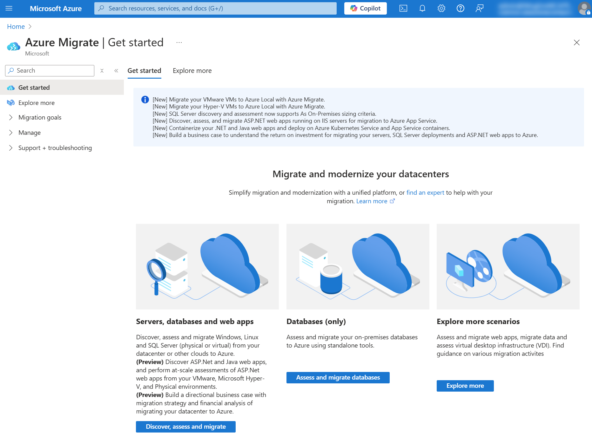
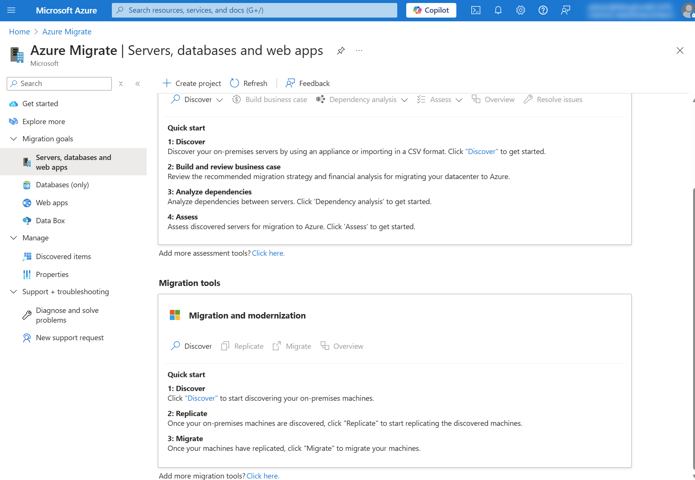

본 블로그는 **On-Premise VMware 워크로드를 Azure VMware Solution으로 마이그레이션하는 과정**에 대한 내용을 담고 있습니다. 그리고 VMware HCX 구성에 대해서도 함께 다루고 있습니다.  

1. [AVS](#avs)
2. [Migration with VMware HCX](#migration-with-vmware-hcx)
3. [Wrap-Up](#wrap-up)

&#160;
 
## AVS

**AVS(Azure VMware Solution)**는 VMware 기반 엔터프라이즈 워크로드를 Azure 환경에서 네이티브하게 실행할 수 있도록 지원하는 **관리형 가상화 솔루션**을 말합니다. AVS는 Microsoft 차원에서 관리되기 때문에 성능, 가용성, 보안 및 컴플라이언스를 보장합니다. 

*AVS 관리에서의 Microsoft/고객/서드파티 솔루션의 책임 범위*

위 그림에서 확인할 수 있듯이, AVS 관리의 대부분을 Microsoft가 책임지고 있기 때문에 고객은 운영 및 관리에 대한 부담을 최소화 할 수 있습니다. 

*Azure VMware Solution 프라이빗 클라우드 환경*

AVS는 표준 VMware 제품인 vCenter Server, vSphere 등을 활용하기 때문에, 기존 워크로드 구성 그대로 마이그레이션이 가능합니다. 이렇게 운영 및 사용 환경이 일관적으로 유지되기 때문에, 운영 관리자와 실무자 모두 기존 VMware 경험을 토대로 바로 AVS를 활용할 수 있습니다. (단, 배포 및 관리를 위해서는 VMware 인터페이스가 아닌 **Azure Portal**을 활용해야 합니다.)

그리고 AVS는 Microsoft의 first-party 솔루션이기 때문에 AVS 상의 VMware 리소스를 Azure Portal로 관리할 수 있고, 다양한 Azure native 서비스와 통합하여 사용할 수도 있습니다. 

AVS와 함께 사용할 수 있는 대표적인 Azure native 서비스에는 Microsoft Defender for Cloud와 Log Analytics가 있습니다.
- **Microsoft Defender for Cloud**: Microsoft Defender for Cloud는 인프라를 위한 통합 보안 관리 서비스로, 지능형 위협 방지 시스템을 제공합니다.
- **Log Analytics**: Log Analytics는 Azure Monitor를 통해 발생하는 로그 데이터를 수집하고 분석하는 모니터링 솔루션입니다.

뿐만 아니라, Microsoft를 단일 창구로 하여 AVS 개발 및 운영에 대한 지원을 받을 수 있습니다. 

아쉽게도 지금까지는 한국 리전에서 Azure VMware Solution이 지원되지 않았습니다. 하지만 다가오는 4월에 AV48이 Korea Central 리전에 도입될 예정이며, 이를 통해 더 많은 한국 고객들이 손쉽게 Azure 환경에 온보딩 할 수 있을 것으로 기대됩니다. 

4월에 도입되는 AV48 스펙을 소개합니다. 

| SKU | AV48 |
| :------: | :------: |
| CPU | Intel Xeon Gold 6442Y - 2.6GHz (3.3GHz with Turbo) |
| Core | 48Cores |
| RAM | 1TB |
| Capacity | 25.6TB (running under vSAN ESA) |

&#160;

## Migration with VMware HCX

VMware HCX를 활용한 마이그레이션에 대해 알아보기에 앞서, 일반적인 마이그레이션 과정에 대해 살펴보겠습니다.

*일반적인 마이그레이션 과정* 

1️⃣ **Decide** 
    Decide 단계에서는 마이그레이션 여부를 결정합니다. 이를 위해, 마이그레이션 대상이 될 워크로드의 구성 및 성능에 대해 분석합니다. 마이그레이션에 드는 비용 및 마이그레이션 이후에 절감될 비용 등을 비교분석하여 의사결정에 활용합니다.

2️⃣ **Plan** 
    Plan 단계에서는 구체적인 마이그레이션 계획을 수립합니다. Azure Migrate에서 제공하는 평가 도구로 워크로드를 평가하고, 그 결과를 토대로 리소스 별 마이그레이션 우선순위를 설정하는 등의 방식으로 계획을 세우게 됩니다. 

3️⃣ **Execute** 
    Execute 단계에서는 워크로드의 migration 작업을 수행합니다. 실제 운영 환경에서의 작업을 진행하기 전에, 미리 테스트를 진행하여 전반적인 프로세스를 익히는 것이 좋습니다. 프로덕션 환경으로의 migration 시, 작업으로 인한 서비스 중단 시간을 최소화 해야 합니다. 

&#160;

### Assessment with Azure Migrate

위에서 소개해드린 대로, Azure로 마이그레이션할 것인지 결정하기 위해서는 근거 데이터가 필요합니다. 우리는 Azure Migrate를 통해 마이그레이션 대상 워크로드에 대해 분석하고, 그 결과를 토대로 평가를 진행합니다. 

주로 아래 사항에 대해 평가합니다. 
1. **Cost Estimation** 
    On-Premise 환경에서의 비용과, Azure 환경으로 이관할 경우의 예상 비용을 비교합니다. 특히 Azure 환경으로 이관하면, 사용량 기반으로 비용이 부과되기 때문에 장기적으로는 비용이 절약된다는 점을 고려해야 합니다. 
2. **Performance Analysis** 
    현재 On-Premise 워크로드의 성능 및 리소스 사용량을 분석합니다. 이때 snapshot 형태로 데이터를 수집하는 것이 아니라, 일정 기간동안 수집된 데이터를 기반으로 패턴을 분석하게 됩니다. 따라서, 데이터 수집을 위한 기간 확보가 필요합니다. 
3. **Dependency Analysis** 
    현재 On-Premise 워크로드 내 VM 간 트래픽 분석을 통해, 리소스 간 dependency를 파악합니다. dependency 분석을 통해, 함께 이관해야 하는 리소스들을 그룹화 할 수 있습니다. 그리고 리소스 별 사용량을 파악함으로써, 사용되지 않는 리소스는 마이그레이션 대상에서 제외할 수도 있습니다. 

위에서 소개한 Azure Migrate는 On-Premise 워크로드를 Azure로 이관하는 과정에서 활용되는 평가 도구입니다. Azure Migrate 솔루션을 활용하기 위해서는, 반드시 기존 On-Premise 워크로드에서 발생하는 로그 데이터를 Azure로 전달할 수 있도록 권한 설정이 되어있어야 합니다.

*Azure Portal > Azure Migrate*

전달된 데이터는 Azure Migrate 영역 내 **Assessment tools**에서 확인할 수 있습니다. 검색된 서버 개수, 서버 별 OS 등의 정보가 표시됩니다.   

&#160;

### Azure VMware Solution Setup

이제는 본격적으로 **VMware HCX를 활용한 마이그레이션** 과정에 대해 다뤄보겠습니다. 먼저 Azure VMware Solution을 배포하고, AVS 프라이빗 클라우드와 Azure가 연결될 수 있도록 구성해야 합니다. 그리고 원활한 구성을 위해서는, 반드시 **Contributor** 이상의 권한을 가져야 합니다. 

AVS를 배포하기 위해서는 resource provider를 등록해야 합니다. Azure Portal에 접속하여 **Microsoft.AVS**를 resource provider로 등록합니다. 

*Azure Portal > Subscriptions > resource providers*

그리고 Azure VMware Solution을 배포한 후, AVS 상에서 프라이빗 클라우드를 생성합니다. 

*Azure Portal > AVS > private cloud*

프라이빗 클라우드는 public access가 불가하기 때문에 반드시 private network를 통해 접근해야 합니다. 

아래 4가지 방법으로 AVS 프라이빗 클라우드에 접근할 수 있습니다.
- ExpressRoute Global Reach
- Azure VNet peering 설정
- VPN 연결
- Azure Bastion 리소스를 통해 vCenter Server 접근

그리고 ExpressRoute Global Reach를 활용하거나 VPN 연결 등을 통해서 On-Premise VMware 워크로드와 AVS를 연결할 수 있습니다. 

이렇게 구성을 마치면, On-Premise VMware 워크로드와 AVS, Azure가 서로 연결됩니다. 

&#160;

### VMware HCX Setup

**VMware HCX(VMware Hybrid Cloud Extension)**는 간소화된 VM 마이그레이션을 지원하는 솔루션입니다. On-Premise VMware 워크로드가 Azure 환경으로 마이그레이션 될 때, VMware HCX의 vMotion 기술이 활용됩니다. vMotion 기술로 live migration 시의 서비스 중단 시간을 최소화 할 수 있습니다.  

VMware HCX를 활용한 마이그레이션에는 3가지 유형이 있습니다. 

| 유형 | 대상 VM |
| :------: | :------: |
| live migration | 서비스 중단 시간을 최소화 해야 하는 프로덕션 VM |
| cold migration | 이관이 필요한 개발 및 테스트 용 VM  |
| bulk migration | 정해진 일정에 따라 이관되어야 하는 대량의 VM |

 

먼저, VMware HCX를 사용하기 위해서는 On-Premise 환경에 VMware HCX를 배포해야 합니다. VMware HCX가 배포되어야, 기존 On-Premise 환경의 VM을 복제하여 Azure로 이관할 수 있습니다. 

*Azure Portal > AVS > Add-ons*

Azure Portal 상에서 **Enable and Deploy**를 클릭하여 간단하게 VMware HCX를 배포할 수 있습니다. 

 

*Azure Portal > AVS > Add-ons*

정상적으로 배포가 완료되면, **Migration Using HCX** 영역이 위와 같이 바뀝니다. 이 화면에서 VMware HCX에 대한 구성이 가능하고, VMware HCX Connector를 활성화 하기 위한 키를 발급 받을 수 있습니다. 

 

*vCenter Server*

그리고 VMware HCX 포털에서 다운로드 받은 VMware HCX Connector 파일을 On-Premise 환경에 배포합니다. vCenter Server 상에서 배포를 진행할 수 있습니다. 

배포가 완료되면, vCenter 상에서 VMware HCX Connector를 수동으로 가동시켜야 합니다. VMware HCX Connector 활성화를 위해서는, 위에서 발급 받았던 키를 사용하면 됩니다. 

 

*On-Premise 환경에 배포된 VMware HCX*

&#160;

### Migration

이제 본격적으로 **On-Premise VM을 AVS로 마이그레이션 하는 과정**에 대해 소개하겠습니다. 

Windows 및 Linux VM에 대해서만 마이그레이션이 지원되며, 마이그레이션 진행 중에 수동으로 snapshot을 생성하거나 다른 백업 솔루션을 동시에 사용하게 되면, 마이그레이션 작업이 중단될 수도 있다는 점 참고 부탁드립니다. 

 

*VMware HCX Connector > Migration*

On-Premise 환경의 VMware HCX Connector 대시보드에서, 마이그레이션 작업을 수행할 수 있습니다. Tracking 영역에서는 이전 마이그레이션에 대한 내용을 확인할 수 있습니다. 

 

*마이그레이션 설정*

위 화면에서, 네트워크에 대한 각종 설정을 진행하고 마이그레이션 할 VM을 선택할 수 있습니다. 설정 완료 후, **GO**를 클릭하여 마이그레이션 작업을 시작할 수 있습니다. 

 

*마이그레이션 완료*

Status 영역을 통해 마이그레이션 작업이 성공적으로 완료되었는지를 확인할 수 있습니다. 

&#160;

## Wrap-Up

지금까지 Azure VMware Solution과 VMware HCX를 구성하고, 이를 활용하여 On-Premise VMware 워크로드를 AVS로 마이그레이션 하는 과정 전반에 대해 살펴봤습니다. 

VMware HCX를 활용하면, 복잡한 마이그레이션 과정을 간소화 할 수 있으니, 본 블로그를 참고하여 On-Premise 워크로드를 Azure 환경으로 간편하게 마이그레이션 하시기를 바랍니다. 🙇‍♀️

&#160;

## References
* [What is Azure VMware Solution?](https://learn.microsoft.com/en-us/azure/azure-vmware/introduction)
* [Azure VMware Solution expands SKUs](https://blogs.vmware.com/vmware-japan/2025/03/avs-riupdates.html)
* [Start here to migrate from VMware to Azure](https://learn.microsoft.com/en-us/azure/migrate/vmware/start-here-vmware)
* [Discover servers running in a VMware environment with Azure Migrate](https://learn.microsoft.com/en-us/azure/migrate/vmware/tutorial-discover-vmware)
* [Azure VMware Solution private cloud and cluster concepts](https://learn.microsoft.com/en-us/azure/azure-vmware/architecture-private-clouds)
* [Deploy and configure Azure VMware Solution](https://learn.microsoft.com/en-us/azure/azure-vmware/deploy-azure-vmware-solution?tabs=azure-portal)
* [Install and activate VMware HCX in Azure VMware Solution](https://learn.microsoft.com/en-us/azure/azure-vmware/install-vmware-hcx)
* [Prepare to migrate VMware resources to Azure by deploying Azure VMware Solution](https://learn.microsoft.com/en-us/training/modules/deploy-azure-vmware-solution/)
* [Migrate VMware vSphere resources from on-premises to Azure VMware Solution](https://learn.microsoft.com/en-us/training/modules/migrate-vmware-workloads-on-premises-azure-vmware-solution/l)

