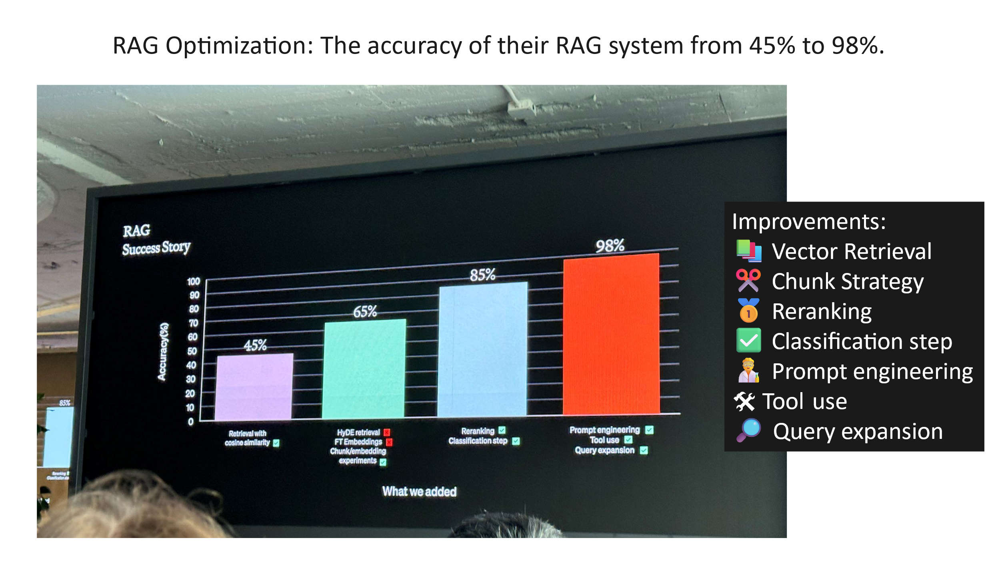
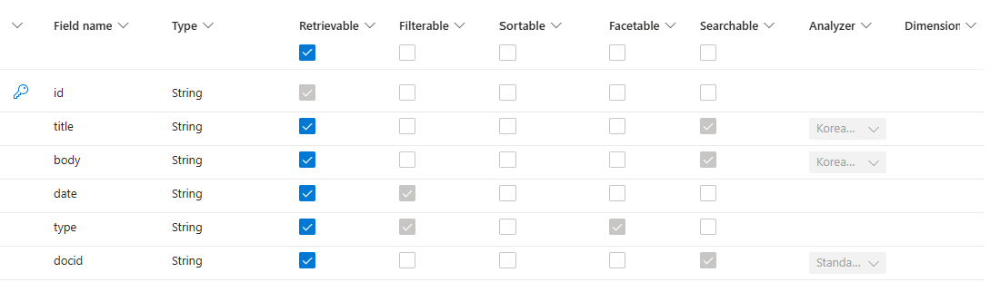
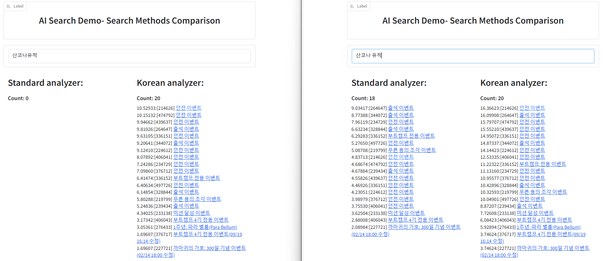
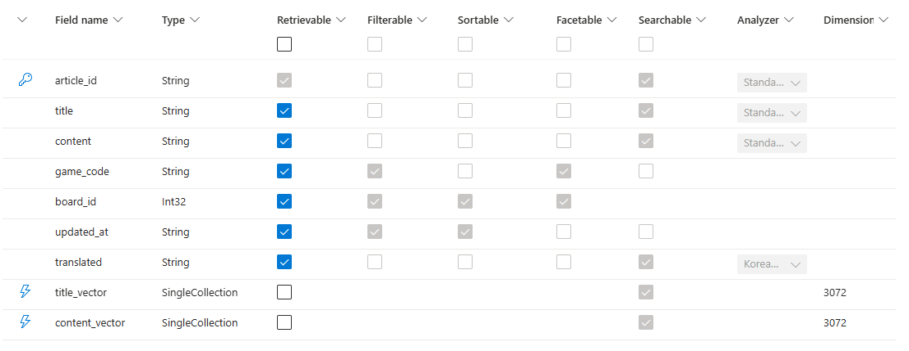
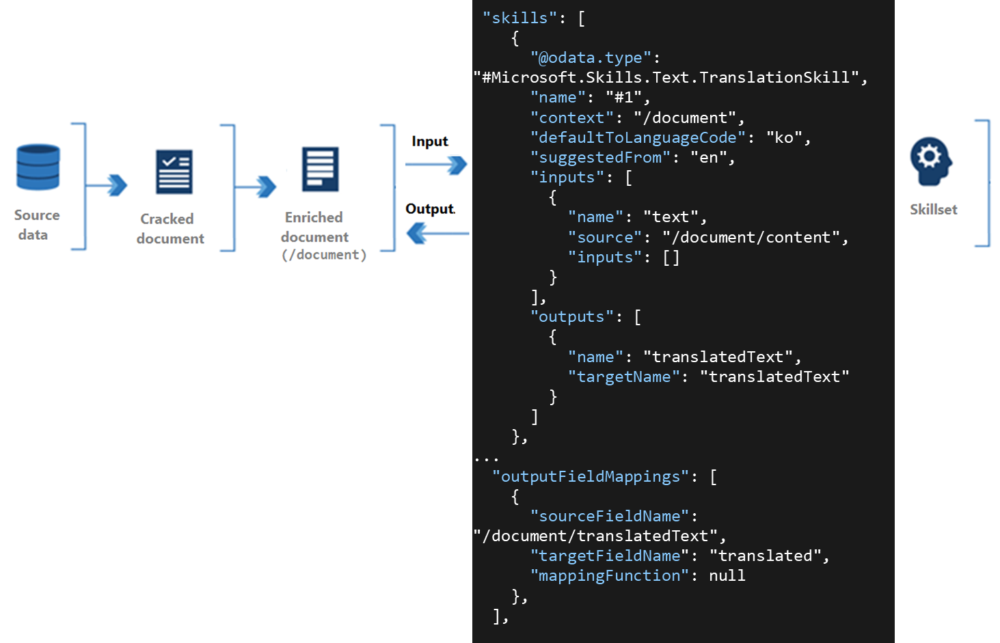

## 생성형 AI 앱에서 검색 도구의 중요성

생성형 AI 앱에서는 사용자가 필요로 하는 정보에 빠르게 접근할 수 있도록 지원하는 검색 기능이 매우 중요하며, 생성형 AI 앱에서 많이 사용되는 RAG(Retrieval-Augmented Generation) 패턴에서는 검색은 핵심적인 역할을 합니다. RAG 패턴은 AI 모델이 문장을 생성할 때, 관련 정보를 검색해 그 정보를 바탕으로 더 정확하고 유용한 답변을 생성하는 방식입니다. 예를 들어, 사용자가 특정 정보나 지식을 요청했을 때, AI 모델은 먼저 검색 도구 또는 서비스에서 관련 문서를 검색한 후, 그 문서를 기반으로 사용자가 필요로 하는 답변을 생성합니다. 이는 AI가 더 정교하고 신뢰할 수 있는 답변을 제공하는 데 도움을 주며, 정보의 정확성과 신속성을 모두 만족시킬 수 있는 방법입니다.

특히, 생성형 AI 앱에서 사용되는 검색 도구 또는 서비스들은 백터 검색을 통해 기존의 키워드 검색과 같이 단순히 키워드 일치 여부를 확인하는 것이 아니라, 문맥과 의미를 고려하여 보다 정확한 검색 결과를 제공합니다.

기존 키워드 검색은 특정 단어나 구문의 일치 여부에만 초점을 맞추기 때문에, 사용자가 입력한 키워드와 일치하지 않는 유사한 개념이나 표현을 찾는 데 한계가 있습니다. 예를 들어, \"고양이 먹이\"를 검색할 때 \"고양이 사료\"라는 표현이 포함된 문서를 찾지 못할 수 있습니다.

## 백터 검색의 한계와 최적화 방안

백터 검색은 문서와 질의 또는 검색어를 수치화된 벡터로 표현하여, 두 벡터 간의 유사도를 계산합니다. 이는 사용자가 입력한 문장이나 단어의 의미를 파악하여 유사한 의미를 가진 문서들을 효과적으로 찾아줄 수 있지만, 백터 검색만으로는 실제 생성형 AI 앱을 프로덕션 서비스로 사용하는 데에는 한계가 있습니다.

OpenAI의 2023 DevDay 행사에서 발표된 내용을 참고하면 백터 검색(Retrieval with cosine similarity)만 적용한 경우 RAG 시스템의 정확도가 45% 수준밖에 되지 않았으며, 여러 최적화 방안을 적용하여 정확도를 98%까지 끌어 올릴 수 있었다고 합니다.

검색 최적화를 위한 방안으로 리랭킹을 주목할 필요가 있습니다. 리랭킹은 검색 결과에서 관련성이 높은 항목을 상위에 배치하여 사용자가 보다 만족스러운 결과를 얻을 수 있도록 돕는 과정으로, 특히 벡터와 키워드를 혼합하는 하이브리드 검색 및 멀티 필드(타이틀, 콘텐츠 등) 검색을 사용할 때 중요한 요소입니다.

## 생성형 AI 앱의 품질을 높이는 Azure AI Search 만의 검색 향상 기능

Azure AI Search는 Full-text 검색을 지원하는 PaaS형 Search 서비스로 시작, OCR 및 AI 스킬을 지원하는 Cognitive Search로 발전, 생성형 AI 시대에 보다 최적화된 AI Search 서비스로 진화되었습니다. 다시 말하면, 검색 서비스의 기본기가 제대로 갖춰진 서비스로 벡터 검색을 지원하는 데이터베이스 기반의 서비스와 기능적 및 성능적 차이가 큽니다. RAG 패턴이 적용된 생성형 AI 앱의 품질을 보다 더 높일 수 있는 Azure AI Search 만의 검색 품질 향상 기능 3가지를 알아보도록 하겠습니다.

### 1. 언어별 분석기 적용, 특히 한글 문서에 한글 분석기 적용

기술 문서를 다루는 일부 생성형 AI 앱의 유스 케이스 경우 백터 검색보다 키워드 검색이 더 나은 검색 결과를 제공한다고 언급되지만, 한글 문서에서 텍스트 또는 키워드 검색을 적용 시  Azure AI Search의 한글 검색 성능이 매우 좋지 못하다는 이야기를 듣곤 합니다. 이는 텍스트 검색에서 사용되는BM25 알고리즘 보다는 검색 인덱스 필드의 언어 분석기의 설정 이슈일지도 모릅니다. 다시 말하면, 한글 검색에 대응되는 한글 분석기(analyzer 또는 형태소 분석기)로 설정이 되었는지 확인할 필요가 있습니다.

Azure AI Search에서 Analyzer 설정을 포함한 Index 구성 화면

기본 표준 분석기는 언어 중립적으로 다국어를 지원한다고 하지만 한글과 같은 복잡한 언어에 대해서는 검색 성능이 매우 떨어집니다. 아래는 한글 뛰어 쓰기(__"산코나유적"__ vs. __"산코나 유적"__)에 따라 표준 분석기와 한글 분석기의 검색 결과 비교이며, 한글 분석기를 적용한 경우 뛰어 쓰기와 무관하게 동일한 검색 결과를 보여주는 것을 확인할 수 있습니다.

참고로, 형태소 분석기는 텍스트를 가장 작은 의미 단위인 형태소로 나누고, 이러한 형태소들의 품사 정보를 분석하는 도구입니다. 한글 형태소 분석기는 한글 텍스트를 분석할 때 매우 중요합니다. 한글은 조사와 어미 변화가 많고, 단어 사이의 띄어쓰기가 일관되지 않을 수 있기 때문에 형태소 분석을 통해 정확한 의미 단위로 나누는 것이 필수적입니다. 이를 통해 검색 시스템은 사용자가 입력한 쿼리의 정확한 의미를 파악하고, 보다 관련성 높은 검색 결과를 제공할 수 있습니다. 예를 들어, __"나는 학교에 갑니다"__ 라는 문장을 형태소 분석기로 분석하면, __나(명사)__ / __는 (주격 조사)__ / __학교(명사)__ / __에(부사격 조사)__ / __가(동사어간)__ / __ㅂ니다(동사 어미)__ 로 구분됩니다.

### 2. 다국어 문서의 경우 번역 필드 사용, Indexer에서 Skillset을 활용하여 번역 자동화

백터 검색을 사용하면 원문이 한글이 아닌 경우에도 한글로 검색이 가능하지만 검색의 정확도가 높지 않을 수 있습니다. 이때 외국어 원문을 한글로 번역하여 검색에 활용하면 검색 정확도를 더 높일 수 있습니다. 문서에 대한 번역을 따로 할 수도 있지만, Azure AI Search에서 활용할 수 있는 Cognitive AI의 번역(translation) 스킬을 사용하면 문서가 인덱싱 될 때 번역도 함께 진행되고 검색에 사용할 수 있습니다.

예를 들어 영어 원문 문서 필드 __"content"__ 에 대해서 한글 번역 필드 __"translated"__ 를 구성하고자 한다면, 아래와 index와 같이 구성할 수 있습니다. 이때 각 문서의 언어 분석기는 해당언어에 대응되는 분석기를 사용합니다.

그리고, 번역을 위한 번역 스킬을 추가합니다. Azure AI Search에서 백터 검색을 위한 indexer를 구성하였다면 이미 문서 분할과 임베딩(embedding) Skillset을 사용하고 있고, 여기에 추가로 번역 스킬을 추가한다고 보면 됩니다.

번역 스킬 적용 방법에 대한 자세한 내용은 문서를 참조하시기 바랍니다. 참고로 번역 스킬은 비용이 청구되는 스킬로 추가적인 설정이 요구됩니다.

### 3. AI 리랭킹 점수로 검색 결과 필터링

Azure AI Search는 업계 최고의 검색 성능을 자랑하며, 검색 결과 또는 리랭킹이 만들어지는 방식 및 리랭킹 점수에 대한 이해가 필요합니다. 아래는 멀티 필드의 텍스트 및 백터 검색의 결과가 최종적으로 만들어지는 과정을 설명한 다이어그램입니다.

[리랭킹 점수 흐름 다이어그램](https://learn.microsoft.com/ko-kr/azure/search/hybrid-search-ranking#diagram-of-a-search-scoring-workflow)

즉, 여러 검색 필드의 텍스트/키워드 및 백터 검색 결과를 조합하여 더 관련성 있는 검색 결과를 얻을 수 있습니다. 참고로, Azure AI Search는 RAG에 좀더 튜닝된 L2 ranker 알고리즘으로 기존 벤치마킹 점수보다 +22pt 더 높은 성능을 얻을 수 있다고 합니다.

또한, AI로 조정된 리랭킹 점수는 일반적인 리랭킹 검색 점수와 달리 아래와 같은 의미 있는 점수로 검색 결과를 필터링하기 용이 합니다.

<table>
<tr>
<th>점수</th>
<th>의미</th>
</tr>
<tr>
<td>4.0</td>
<td>이 문서는 관련성이 높으며 질문에 대해 완전한 답변을 제공하지만, 질문과 관련이 없는 추가 텍스트가 포함될 수 있습니다.</td>
</tr>
<tr>
<td>3.0</td>
<td>문서는 관련이 있지만 완성할 수 있는 세부 정보가 부족합니다.</td>
</tr>
<tr>
<td>2.0</td>
<td>문서는 다소 관련이 있습니다. 질문에 부분적으로 답변하거나 질문의 일부 측면만 다룹니다.</td>
</tr>
<tr>
<td>1.0</td>
<td>이 문서는 질문과 관련이 있으며, 그 중 일부만 답변합니다.</td>
</tr>
<tr>
<td>0.0</td>
<td>문서는 관련이 없습니다.</td>
</tr>
</table>

[리랭킹 점수 의미](https://learn.microsoft.com/ko-kr/azure/search/semantic-search-overview?form=MG0AV3#how-ranking-is-scored)

## 맺으며

최근 한 고객은 한국 및 글로벌 서비스 게시판의 검색 품질을 손쉽게 높일 수 있는 방안이 필요했습니다. Azure AI Search와 앞서 소개한 검색 향상 방안으로 검색 기능을 적용하여 빠르게 한글 검색의 문제를 해결했고, 다국어를 사용하는 글로벌 검색 게시판에 백터 검색과 함께 자동 번역 필드를 추가하여 다국어 검색의 품질을 더 높일 수 있었습니다. 또한, 향상된 검색 성능을 바탕으로 차별화된 생성형 AI 서비스를 기획 중에 있습니다.

Azure AI Search는 이번에 소개된 세 가지 핵심 기능 외에도, 검색 속도 향상 및 스토리지/비용 절감을 위한 추가 기능들을 제공합니다. 신규 기능 및 자세한 내용은 [Azure AI Search 문서](https://learn.microsoft.com/ko-kr/azure/search/whats-new)를 참고해 주시기 바랍니다.
