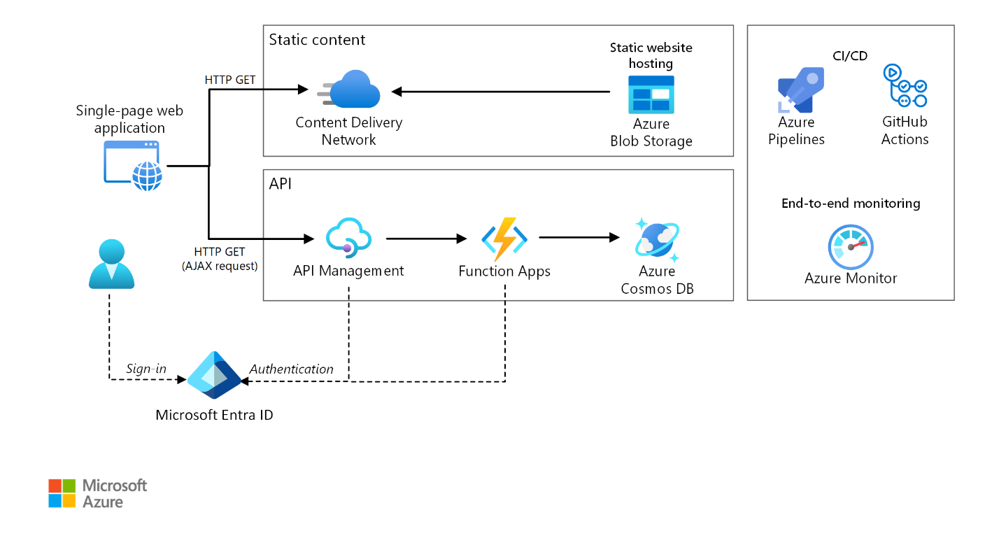
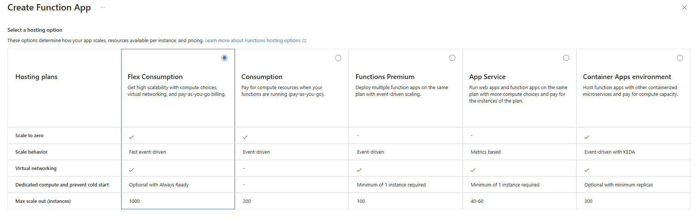
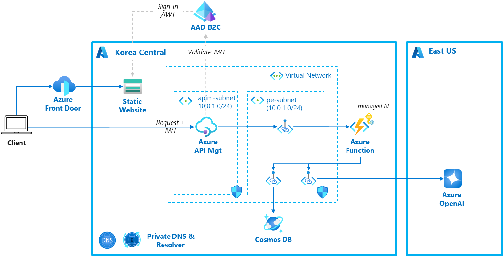
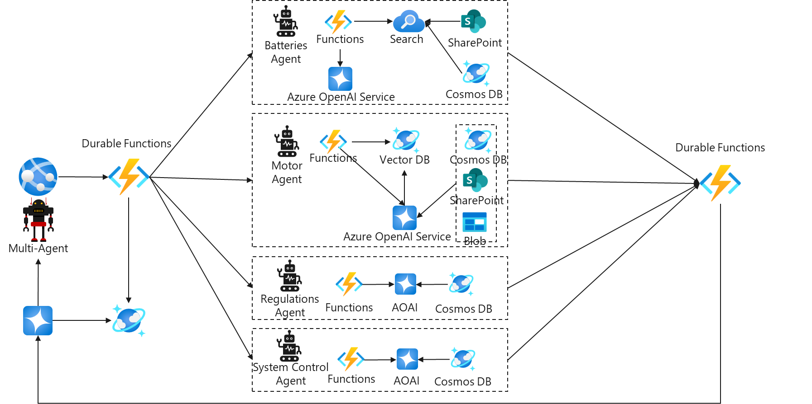

## 서버리스 아키텍처란?

서버리스(Serverless) 컴퓨팅은 개발자가 서버를 직접 관리하지 않고 애플리케이션 개발에만 집중할 수 있도록 하는 클라우드 컴퓨팅의 진보된 서버 인프라 관리 방식입니다. 이는 PaaS(Platform as a Service)에서 더욱 발전된 형태로, 서버리스 컴퓨팅의 대표적인 사례로는 AWS Lambda, Microsoft Azure Functions, Google Cloud Functions 등이 있습니다. 서버리스 아키텍처에서는 전통적인 서버 기반 아키텍처와 달리 클라우드 제공업체가 서버의 프로비저닝, 유지 관리 및 확장을 자동으로 처리합니다.

### 앱 개발자들이 서버리스 아키텍처를 선호하는 이유

서버 용량 및 비용과 같은 관리 운영에 신경 쓰지 않고 애플리케이션 개발에만 집중할 수 있게 해주는 서버리스 아키텍처는 다음과 같은 장점들로 인해 많은 클라우드 기반 앱 개발자들에게 선호되는 아키텍처 패턴입니다.

1. __자동 확장성__: 서버리스 아키텍처는 트래픽 증가에 따라 자동으로 확장되며, 필요할 때만 리소스를 사용하므로 효율적입니다.

2. __비용 절감__: 사용한 만큼만 비용을 지불하는 종량제 모델로, 초기 투자 비용이 낮고 유휴 리소스에 대한 비용이 발생하지 않습니다.

3. __빠른 배포 및 업데이트__: 서버리스 환경에서는 개별 함수 단위로 배포가 가능하여, 전체 애플리케이션을 재배포할 필요 없이 빠르게 업데이트를 진행할 수 있습니다.

4. __개발자 생산성 향상__: 인프라 관리에 신경 쓸 필요 없이 비즈니스 로직에 집중할 수 있어, 개발 속도가 빨라지고 시장에 더 빠르게 출시할 수 있습니다.

5. __유연성__: 다양한 언어와 플랫폼을 지원하여 개발자들이 선택의 폭이 넓습니다.

## Azure 서버리스 아키텍처의 주요 구성 요소

[Azure 서버리스 아키텍처 예](https://learn.microsoft.com/en-us/azure/architecture/web-apps/serverless/architectures/web-app)

Azure 서버리스 아키텍처는 다양한 서비스 컴포넌트로 구성될 수 있으며, 주요 서비스 컴포넌트는 아래와 같습니다.

- __Azure API Management__ 는 API를 게시, 보호, 변환, 관리 및 모니터링할 수 있는 플랫폼입니다. 이를 통해 개발자는 API를 쉽게 관리하고, 보안 정책을 적용하며, API 사용량을 모니터링할 수 있습니다.

- __Azure Functions__ 은 서버리스 컴퓨팅 서비스로, 이벤트 기반으로 코드를 실행할 수 있습니다. 개발자는 서버를 관리할 필요 없이 특정 이벤트가 발생할 때 실행되는 함수를 작성할 수 있습니다. Azure Functions는 다양한 트리거를 지원하며, 확장성과 비용 효율성이 뛰어납니다.

- __Azure AD B2C__ 는 사용자 아이덴티티 및 액세스 관리 솔루션으로, 사용자가 선호하는 소셜, 엔터프라이즈 또는 로컬 계정을 사용하여 애플리케이션에 로그인할 수 있게 합니다. Azure AD B2C는 사용자 인증 및 권한 부여를 관리하며, 사용자 경험을 맞춤화할 수 있는 기능을 제공합니다.

- __Azure Blob Storage (Static Website)__ 는 정적 웹사이트 호스팅 기능을 제공하여, HTML, CSS, JavaScript 파일 등을 저장하고 직접 제공할 수 있습니다. 이를 통해 별도의 웹 서버 없이 정적 콘텐츠를 호스팅할 수 있으며, Azure Functions와 같은 서버리스 서비스와 통합하여 사용할 수 있습니다.

- __Azure Cosmos DB__ 는 글로벌 분산형 NoSQL 데이터베이스 서비스로 고가용성, 낮은 지연 시간, 자동 확장성 및 다양한 데이터 모델을 지원하여 애플리케이션의 성능과 확장성을 극대화합니다. 완전 관리형 서비스이며, 서버리스 모드를 제공합니다.

### Azure 서버리스와 AWS 서버리스의 주요 서비스 컴포넌트 비교

<table>
<tr>
<th>서비스 구분</th>
<th>Azure Serverless*</th>
<th>AWS Serverless**</th>
<th>비고</th>
</tr>
<tr>
<td>API 관리</td>
<td>Azure API Management</td>
<td>Amazon API Gateway</td>
<td>최대 HTTP Timeout: * 5분 (Azure Functions은 4분) ** 30초</td>
</tr>
<tr>
<td>서버리스 함수</td>
<td>Azure Functions</td>
<td>AWS Lambda</td>
<td>Streaming지원 플랫폼: * Node.js, Python ** Node.js</td>
</tr>
<tr>
<td>ID 및 액세스 관리</td>
<td>Entra ID 또는 Azure AD B2C</td>
<td>Amazon Cognito</td>
<td></td>
</tr>
<tr>
<td>정적 웹사이트 호스팅</td>
<td>Azure Blob Storage Static Website</td>
<td>Amazon S3 Static Website Hosting</td>
<td></td>
</tr>
<tr>
<td>No SQL 데이터베이스</td>
<td>Azure Cosmos DB</td>
<td>Amazon DynamoDB</td>
<td></td>
</tr>
</table>

[* Azure APIM Timeout](https://learn.microsoft.com/en-us/azure/api-management/forward-request-policy#attributes)
[** Amazon API Gateway TImeout](https://docs.aws.amazon.com/apigateway/latest/developerguide/limits.html#http-api-quotas)

## Azure 서버리스 아키텍처 고려사항

### API Management를 활용한 API 인증

SPA(Single Page Application) 애플리케이션은 서버리스 아키텍처가 널리 적용되는 대표적인 패턴입니다. SPA의 주요 장점은 대부분의 클라이언트 기능이 서버가 아닌 브라우저에서 실행되므로, HTML, JavaScript, 이미지 등의 정적 파일만 호스팅하는 웹사이트로 충분하다는 점입니다. 또한, 클라이언트는 백엔드 서비스를 안전하게 호출하기 위해 토큰(Access Token)을 사용하며, 사용자 인증 후 획득한 토큰의 유효성과 접근 권한 검증을 API Management로 처리하도록 구현하면, 백엔드 API 개발이 더욱 용이해집니다.

아래는 안전하게 API 가 호출되는 흐름과 주요 Azure 서비스 컴포넌트의 구성을 보여주고 있습니다.

### Azure Functions 호스팅 옵션 선택

Azure Functions의 호스팅 옵션은 여러 가지가 있으며, 각 옵션에 따라 비용, 성능(콜드 스타트 유무), 확장성(최대 인스턴스), 인스턴스 크기/유형, 네트워크 보안, 컨테이너 지원 등에 차이가 있기 때문에 옵션 선택에 충분한 검토가 요구됩니다. 예를 들어, 언제나 즉각적인 응답을 위해 콜드 스타트를 방지하기 위해서는 최소 인스턴스를 1개 이상으로 설정하는 것이 필요하고, 네트워크 보안을 추가적으로 적용할 경우 Virtual Network를 지원하는 옵션을 선택해야 합니다.

아래는 주요 호스팅 옵션입니다. 보다 자세한 내용은 문서를 참조하시기 바랍니다.

### 생성형 AI 앱에서 고려사항

최근 한 고객의 AWS 서버리스 아키텍처로 구현된 생성형 AI 서비스를 Azure 서버리스 아키텍처로 전환하는 워크샵을 진행했었습니다. 이 고객은 AWS 서버리스 아키텍처로 그동안 잘 사용하고 있었으나, 생성형 AI 앱 구현 시 AWS의 서비스 컴포넌트의 일부 제약으로 구성이 만족스럽지 못한 것을 이야기했습니다. 고객은 Azure 로 전환하면서 기존 서버리스 아키텍처의 장점을 그대로 유지하면서 생성형 AI앱에 따른 제약 없는 서비스를 구성할 수 있었습니다.

생성형 AI 앱은 기존 앱의 특성과 차이가 있어 서버리스 아키텍처를 적용할 때 추가적인 제약사항을 고려해야 합니다.

- __HTTP Timeout__: 챗봇과 같은 생성형 AI 서비스의 HTTP 응답은 수 초에서 수십 초의 응답시간이 요구되는 경우가 많아 서비스 컴포넌트의 최대 HTTP Timeout을 고려해야 합니다. 4분 이상의 응답시간이 많이 소요되는 경우 비동기 호출 방식을 고려할 필요가 있습니다.

- __Streaming__: 좀더 빠른 답변 생성을 위해서 스트리밍 방식으로 답변을 출력할 경우, 이를 지원하는 플랫폼 언어를 확인해야 합니다. Azure Functions은 Node.js(GA)는 와 함께 Python(Preview)을 지원합니다.

- __Security__: 강화된 보안을 위해서 API 키 방식이 아닌 토큰 방식으로 의도하지 않은 키 유출을 방지하고 보다 안전한 사설 네트워크 기반의 Private Endpoint를 적용할 수 있습니다.

- __Stateful__: Durable Function 기능으로 활용하면 Stateful한 Function간의 호출이 가능합니다. 특히, 생성형 AI 앱에서 많이 적용되는 체이닝, 병렬 agent 호출을 보다 손쉽게 구현할 수 있습니다.

- __Per Instance concurrency__: 플랫폼이 Python과 같이 멀티스레딩 처리에 한계가 있는 경우, 하나의 큰 인스턴스에서 여러 요청을 처리하는 것보다는 여러 개의 작은 인스턴스를 사용하여 처리하는 것이 더 효과적일 수 있습니다. 이때, 인스턴스가 CPU나 메모리 기반으로 스케일 아웃하는 전통적인 방식보다는, 요청 수를 기준으로 스케일 아웃을 하는 것이 더 유리할 수 있습니다. 예를 들어, 각 요청 또는 일정 수의 요청(예: 10개)의 처리에 따라 스케일 아웃을 조정하는 방식이 더 효율적일 수 있습니다. Flex consumption 옵션에서 지원합니다.

아래는 Azure 서버리스를 적용한 생성형 AI 아키텍처의 예입니다.

## 서버리스 아키텍처와 생성형 AI 서비스

지난 Ignite 행사에서 토요타 자동차는 Azure Functions의 Durable Functions 기능을 적극 활용하여 [멀티 에이전트 기반의 생성형 AI 앱 서비스 사례](https://ignite.microsoft.com/en-US/sessions/BRK117)를 발표하였습니다. 이런 사례를 포함하여 서버리스 아키텍처는 에이전트 시스템으로 발전하고 있는 생성형 AI에 보다 더 활용도가 높아질 것으로 예상합니다.

