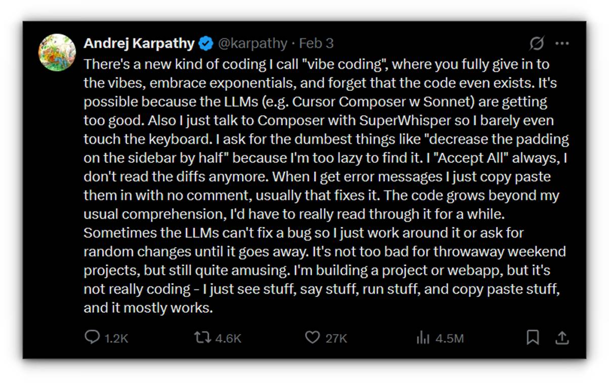
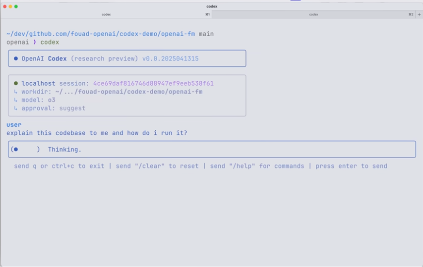

ChatGPT로 시작된 생성형 인공지능의 도입 확산은 현재 모든 산업 부문에 걸쳐 기존의 업무 방식을 혁신적으로 변화시키고 있습니다. 특히, 소프트웨어 개발에 AI 활용은 GitHub Copilot의 등장 이후 단순 코드 자동 완성을 넘어 다양한 영역으로 발전하고 있으며, 이제 AI는 전체 코드 작성해주는 것은 물론, 코드 리뷰, 리팩토링, 테스트 작성, 문서화, PR 요약 등 개발 프로세스 전반에 걸쳐 자동화와 효율성을 증대시키고 있습니다.

GitHub Copilot을 활용했을 때 개발자들의 작업 완료 속도가 55% 빨라졌고, 작업 완료율이 8% 더 높다는 [연구 결과](https://github.blog/news-insights/research/research-quantifying-github-copilots-impact-on-developer-productivity-and-happiness/)를 굳이 설명하지 않아도 이제 많은 개발자들은 AI 기반 코딩에 종속되었다고 해도 과언은 아닐 것입니다. 특히, 추리(Reasoning) 기능과 같은 LLM의 비약적인 발전으로 바이브 코딩은 실무에 적용 가능하며, Windsurf 및 Cursor와 같은 Agent 기능을 강화한 AI기반 개발 도구들이 많은 개발자들에게 높은 호응을 받고 있다는 것에도 주목할 필요가 있습니다.

## 바이브 코딩
올해 초 OpenAI의 공동설립자로 잘 알려진 안드레이 카파티(Andrej Karpathy)가 X에 포시팅해서 알려진 바이브 코딩(Vibe Coding) 용어는 AI 기반 개발의 새로운 패러다임으로 크게 주목받고 있습니다.

웹 검색처럼 이제는 ChatGPT/LLM 인터페이스가 익숙한 시대에서 프롬프트로 처음부터 코드를 작성하는 방식이 전문 개발자들은 물론 초보 개발자들 모두에게 도움을 줄 것으로 기대하고 있습니다. 즉, 개발자가 원하는 기능을 자연어로 설명하면, AI가 코드를 생성해주고, 개발자는 직접 코드를 한 줄씩 작성하기보다는 AI가 생성한 코드를 테스트하고 수정하는 역할을 하게 됩니다.

## 기존 코딩과 바이브 코딩 비교
다음 표는 기존 코딩과 바이브 코딩의 주요 비교항목에 대한 설명입니다.

| 구분             | 기존 코딩                                                                                                                                      | 바이브 코딩                                                                                                                                                                                                                   |
|------------------|-----------------------------------------------------------------------------------------------------------------------------------------------|----------------------------------------------------------------------------------------------------------------------------------------------------------------------------------------|
| 개발 흐름        | 개발자는 IDE, 프레임워크 및 API를 사용하여 한 줄씩 수동으로 코드를 작성합니다. 구현에 치중합니다.                                               | 개발자는 자연어로 기능을 설명합니다. AI는 코드 또는 UI 구성 요소를 생성합니다. 개발자는 결과를 검토하고 조정합니다.                                                                      |
| 스킬 장벽        | 프로그래밍 언어와 도구에 대한 숙달이 필요하며, 가파른 학습 곡선을 요구합니다.                                                                  | 장벽을 더욱 낮춥니다: 개발자가 아닌 사람도 "개발자와 이야기하는 것처럼" 아이디어를 설명하여 앱을 제작할 수 있습니다.                                                                     |
| 개발 속도        | 모든 라인과 테스트가 손으로 작성되기 때문에 속도가 느립니다. 코드 품질 및 성능은 수동으로 적용됩니다.                                            | 매우 빠른 프로토타이핑이 가능합니다. AI가 인증, UI 레이아웃, 기본 로직을 처리하여 개발자가 기능을 빠르게 완성할 수 있도록 합니다. 많은 일상적인 작업(예: 유효성 검사)이 자동으로 수행됩니다. |
| 유연성 및 제어   | 최대 제어: 코딩할 수 있는 모든 작업을 수행하고 최적화할 수 있습니다.                                                                           | 유연성은 높지만, 선택한 AI 도구에 따라 결과가 다소 달라집니다. 개발자는 모든 세부 사항을 직접 제어하지는 못하지만 프롬프트를 통해 코드를 제어, 구체화할 수 있습니다.                      |
| 확장성 및 복잡도 | 복잡한 대규모 시스템에 적합합니다. 확립된 관행(디자인 패턴, 아키텍처)은 확장성, 성능, 보안을 보장합니다.                                       | 아직은 중소 규모 프로젝트, 프로토타입 또는 내부 도구에 적합합니다. 매우 큰 미션 크리티컬 시스템에 대해서는 아직 검증되지 않았습니다.                                                      |

## 바이브 코딩의 이점
바이브 코딩의 이점을 짧게 정리하면 다음과 같습니다.

- 속도와 생산성: AI가 반복적인 작업을 자동화해 개발 속도를 크게 향상.
- 낮은 진입 장벽: 비전문가도 자연어 프롬프트를 통해 전문가 적인 코드 작성이 가능.
- 고급 문제 해결 집중: 개발자는 아키텍처, 비즈니스 로직 및 UX에 보다 더 집중.
- 통합 개발 워크플로우: AI 도구가 기존 IDE와 연동되어 실시간으로 개발에 도움.
- 신속한 실험과 혁신: AI 활용으로 빠른 MVP 제작과 아이디어 평가가 가능.
 
## 바이브 코딩 예
GitHub Copilot를 포함한 Agent 모드를 지원하는 개발도구들은 약간의 차이는 있으나 바이브 코딩을 지원하고 있습니다. 바이브 코딩의 가장 흥미로운 예로는 OpenAI의 Codex CLI와 같이 개발도구 없이도 커맨드 방식으로 소프트웨어를 개발 및 유지보수하는 것이 아닐까 합니다. 자세한 바이브 코딩의 방식은 아래 Codex CLI의 소개 영상을 참고하시기 바랍니다.

[OpenAI Codex CLI 소개 영상](https://www.youtube.com/watch?v=FUq9qRwrDrI)

## 바이브 코딩의 제약 및 챌린지
바이브 코딩은 발전 가능성과 이점에도 불구하고 아직은 초기라서 사용에 주의가 필요합니다.

- __기술적 복잡성__: AI 도구는 간단한 작업에는 효과적이지만, 복잡하고 특이한 문제에서는 어려움을 겪을 수 있습니다. 드물거나 고급 기술이 요구되는 경우 여전히 휴먼 개발자의 전문성이 필요합니다.
- __코드 품질 및 성능__: AI가 생성한 초기 코드는 종종 최적화가 필요하며, 주석 부족 및 비효율적인 패턴을 포함할 수 있습니다. 프로토타입 제작에는 적합하지만 실제 시스템에서는 추가 수정이 불가피합니다.
- __디버깅 어려움__: AI가 생성한 코드는 구조와 주석이 부족하여 문제의 원인을 추적하기 어려울 수 있습니다. 코드 설명 도구가 도움을 줄 수 있지만, 최종적인 디버깅은 인간의 검토가 필요합니다.
- __유지보수 및 확장성__: AI가 생성한 코드의 반복적인 수정은 기술 부채를 야기할 수 있습니다. 프로젝트가 장기적으로 유지되기 위해서는 정기적인 리팩터링과 코드 리뷰가 필수적입니다.
- __보안 및 규정 준수__: AI는 공공 데이터에서 학습했기 때문에 보안 취약점을 포함할 가능성이 있습니다. 코드 리뷰 및 표준 준수 점검이 없으면 보안 문제가 발생할 위험이 높습니다.
- __도구의 한계 및 종속성__: 각 AI 코딩 도구는 특정 언어와 프레임워크에서만 잘 작동할 수 있습니다. 특정 플랫폼에 의존하면 장기적으로 벤더 종속 문제가 발생할 수 있습니다.

## 개발자의 미래는…
최근 사티아 나델라(Satya Nadella) 회장은 메타의 라마콘 컨퍼런스에서 마크 주크버그(Mark Zuckerberg)와의 대화 중 이미 Microsoft에서 [AI가 30%의 코드를 작성](https://techcrunch.com/2025/04/29/microsoft-ceo-says-up-to-30-of-the-companys-code-was-written-by-ai/)한다고 밝혔습니다. 이전에는 CTO인 케빈 스콧(Kevin Scott)은 2030년까지 모든 코드의 95%가 AI에 의해 생성될 것으로 예측했습니다. 인공지능의 발전으로 인해 개발자들의 개발 역량과 생산성은 크게 향상되었으나, 역설적으로 이러한 변화는 Microsoft를 포함한 주요 기술 기업들이 개발자 인력 구조조정을 가속화시키고 있습니다. 소프트웨어 개발자 및 IT 산업의 미래가 위협받고 있다고 볼 수도 있지만, 오히려 더 큰 새로운 기회도 만들어질 것으로 보고 있습니다.

기술 발전이 정작 기술자에게 위협이 되지만 궁극적으로 기회로 전환되었던 영화가 하나 떠오릅니다. 나사에서 달착륙 프로젝트에서 계산원으로 근무하던 3명의 흑인여성 주인공들의 숨겨진 활약상을 이야기한 영화인 히드 피겨스를 많은 분들이 보셨을 것입니다. 3명의 주인공 중 한명인 옥타비아가 [IBM 7090](https://www.zdnet.com/article/hidden-figures-and-the-ibm-7090-computer/)이 나사에 도입되는 시점에 포트란 언어를 미리 공부하고 준비하는 아래의 장면이 매우 인상적이었습니다.

참고로 우리가 알고 있는 [Computer(컴퓨터)](https://en.wikipedia.org/wiki/Computer_%28occupation%29)라는 용어는 17세기에 이미 있었던 용어로 현재 쓰고 있는 컴퓨터 의미 이전까지는 계산원(a person performing mathematical calculations)이란 직업의 의미로 사용되었습니다. 영화에서 옥타비아는 동료들과 함께 포트란 언어를 가장 먼저 준비했으며, 그 결과로 IBM 7090이 도입되면서 나사에서 계산원의 역할이 불필요해질 위기에 처한 상황에서도 팀원들은 컴퓨터 운영자로서, 본인은 흑인이라 불가능했던 매니저로 새로운 기회를 얻게 되었습니다. 실제로 IBM 7090은 최초의 트랜지스터 기반 컴퓨터로, 계산 작업을 사람(계산원)에서 전자 기계(컴퓨터)로 전환하게 한 역사적으로 중요한 컴퓨터였다고 합니다.

계산원이 역사속으로 사라진 것처럼 개발자도 조만간 AI로 대체되는 위기를 맞을 수 있겠지만, 히든 피겨스의 옥타비아가 IBM 시대에 포트란을 준비한 것처럼 지금 AI 시대에서는 AI 다루는 스킬을 잘 준비한다면 더 좋은 기회를 얻을 수 있을 것입니다. 개발자군이 먼저 시작되었을 뿐 모든 사업분야, 직종에서 유사한 변화가 곧 시작될 것입니다. AI 스킬의 관심과 [Microsoft의 무료 AI 교육](https://learn.microsoft.com/en-us/training/browse/?roles=ai-engineer)을 잘 활용한다면 다가올 AI의 위기에 더 큰 기회를 얻을 수 있는 밑거름이 될 것입니다.