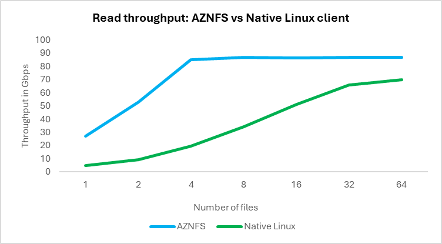
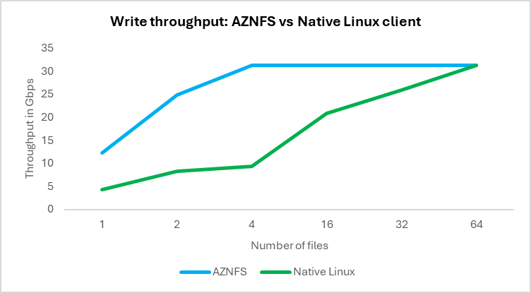

<<<<<<< HEAD
---
layout: post
title:  "📢 퍼블릭 프리뷰: FUSE 기반 BlobNFS 성능 및 확장성 향상"
author: jyseong
tag: [ azure blob storage, Azure HPC ]
category: [ Solution ]
image: assets/images/jyseong/images/2025-07-07-Accelerating BlobNFS throughput & scale with FUSE for superior performance/header.png
---

### 작성자 : [niranja1890](https://techcommunity.microsoft.com/users/niranja1890/446007)
### 원본 : [[Public Preview] Accelerating BlobNFS throughput & scale with FUSE for superior performance](https://techcommunity.microsoft.com/blog/azurestorageblog/%F0%9F%93%A2-public-preview-accelerating-blobnfs-throughput--scale-with-fuse-for-superior-/4426147)

Azure Blob Storage는 BlobFuse를 통해 로컬 파일 시스템처럼 마운트하고 접근할 수 있습니다. [BlobFuse](http://aka.ms/blobfuse)는 Blob REST API를 위한 FUSE 기반 드라이버로, AI/ML, HPC, 분석, 백업 워크로드에 적합한 [높은 처리량](https://youtu.be/Y-3KWd7ld0E?t=1159)과 로컬 캐싱, Azure Entra ID를 통한 보안 통합 등의 장점을 제공합니다.

NFS 3.0 프로토콜 지원 또는 POSIX 준수가 필요한 고객을 위해, Azure Blob Storage는 NFSv3(일명 [BlobNFS](http://aka.ms/blobnfs))를 네이티브로도 지원합니다. 이는 고객의 레거시 애플리케이션이 변경 없이 Azure Blob Storage에 접근할 수 있도록 해줍니다. BlobNFS는 Linux NFS 클라이언트와 당사의 [AZNFS](https://github.com/Azure/AZNFS-mount) 마운트 헬퍼 패키지를 결합하여 접근되며, 이는 Blob Storage의 NFS 엔드포인트에 마운트하고 안정적으로 연결하는 과정을 간소화합니다. BlobNFS는 NFS 3.0에서 Azure Entra ID 기반 인증이 아직 제공되지 않기 때문에, BlobNFS는 가상 네트워크를 통한 접근만 지원한다는 점에 유의하시기 바랍니다.

오늘 BlobNFS용 [AZNFS](https://github.com/Azure/AZNFS-mount/wiki/Instructions-to-install-and-use-latest-version-of-AZNFS)(3.0)의 새로운 업데이트가 공개되었습니다. 이제 BlobFuse를 구동하는 것과 동일한 libfuse3 라이브러리를 사용하여, 성능과 확장성 면에서 상당한 개선이 이루어졌습니다. 업데이트된 BlobNFS용 AZNFS는 훨씬 더 높은 처리량, 더 큰 파일 지원, 향상된 메타데이터 성능, 그리고 사용자 그룹 제한 제거를 제공하여, 높은 성능을 요구하는 워크로드의 성능을 향상시킵니다.

- ⚡ **가상 머신 처리량 극대화:** AZNFS는 이제 최대 **256개의 TCP 연결**(기존 네이티브 NFS 클라이언트에서는 16개)을 지원합니다 . 이를 통해 처리량이 VM NIC 대역폭(가상 머신의 네트워크 인터페이스 카드가 제공하는 최대 데이터 전송 속도) 또는 Storage account가 제공하는 최대 한도까지 도달할 수 있습니다. 이 기능은 HPC 워크로드에 유리하며, 대용량 데이터셋 작업 시 높은 처리량을 보장합니다. 또한, **소수의 병렬 파일 읽기/쓰기 작업(4개 이하)**만으로도, VM NIC 대역폭을 완전히 포화시킬 수 있으며, 이는 더 큰 VM 사이즈에서도 마찬가지입니다.
- ⚡ **향상된 읽기/쓰기 속도:** 업데이트된 AZNFS 클라이언트는 읽기 및 쓰기 시나리오에서 네이티브 NFS 클라이언트보다 더 뛰어난 성능을 발휘합니다. 예를 들어, 단일 파일 읽기/쓰기 성능은 각각 5배 및 3배 향상되었으며, 이는 백업 파일을 읽고 쓰는 데 높은 단일 파일 처리량이 요구되는 대용량 데이터베이스 백업 작업에 유용할 수 있습니다. 자세한 성능 비교는 [링크](https://github.com/Azure/AZNFS-mount/wiki/Performance-benchmarks)를 참조하세요.
- 🚫 **사용자 그룹 제한 제거:** 로컬 인증 서버를 사용하는 Linux NFS 클라이언트는 사용자의 최대 16개 그룹에 대한 접근 권한만 전달할 수 있으며, 이는 16개를 초과하는 그룹에 속한 사용자의 리소스 접근을 제한합니다. 이번 업데이트를 통해 FUSE가 권한 검사를 처리하게 되어, 16개 그룹 제한이 사라졌습니다.
- 📁 **메타데이터 쿼리 성능 향상:** READDIR은 이제 한 번의 호출로 더 많은 디렉터리 항목을 쿼리할 수 있습니다. Linux 클라이언트는 1MB의 제한이 있는 반면, 업데이트된 AZNFS는 이제 최대 3MB까지 사용할 수 있습니다. 파일이 많은 고객은 더 빠른 목록 조회 및 메타데이터 작업을 활용할 수 있으며, 지연 시간이 줄어들게 됩니다. 이는 처리 전에 많은 수의 파일에 대한 메타데이터를 읽는 작업이 필요로 하는 EDA(전자 설계 자동화) 및 HPC(고성능 컴퓨팅) 워크로드에 유용합니다.
- 🗂️ **대용량 파일 크기 지원 (최대 5TB):** 이번 릴리스를 통해 순차적 쓰기 패턴에 대해 더 큰 파일 크기를 지원할 수 있게 되었습니다. AZNFS에서 더 큰 블록 크기를 사용할 수 있게 됨에 따라, 사용자는 최대 5TB까지의 대용량 파일을 생성할 수 있습니다. Linux 클라이언트를 사용할 경우, 최적의 조건에서도 최대 파일 크기는 약 3TB로 제한되었습니다. 3TB를 초과하는 시뮬레이션 및 체크포인트 데이터 파일을 생성하는 CAD 도구는 이번 개선을 통하여 장점을 얻을 수 있습니다.

다음 차트는 업데이트된 AZNFS와 네이티브 Linux 클라이언트 간의 성능을 비교한 것입니다. 자세한 내용은 [벤치마크 결과](https://github.com/Azure/AZNFS-mount/wiki/Performance-benchmarks)를 참조하시기 바랍니다.

[테스트 파라미터]
- VM: Standard D96ds v5
- 파일 크기: 100GB
- Linux NFS는 nconnect=16 설정 사용
- Linux 커널 버전: 5.x.x
- 테스트 도구: dd 테스트 사용

**참고:** ***해당 VM은 쓰기 처리량보다 읽기 처리량이 더 높습니다.*** 업데이트된 AZNFS의 경우, 4개 이상의 병렬 파일 읽기/쓰기 작업부터는 VM NIC 대역폭에 의해 처리량이 제한되거나, 그 이상으로 확장될 수 있습니다.

## 🛠️ 시작하기
프리뷰에 등록하려면 이 [양식](https://forms.microsoft.com/r/MGBrprn6hz)을 사용하여 등록해 주세요.
최신 버전의 AZNFS를 설치하고 사용하는 방법은 [링크](https://github.com/Azure/AZNFS-mount/wiki/Instructions-to-install-and-use-latest-version-of-AZNFS)를 참고해 주세요.
문의 사항이나 피드백이 있으신 경우, aznfs@microsoft.com 으로 연락 부탁 드립니다.

**참고 문서** 

[What is BlobFuse? - BlobFuse2 - Azure Storage | Microsoft Learn](https://learn.microsoft.com/azure/storage/blobs/blobfuse2-what-is)

[Network File System (NFS) 3.0 protocol support for Azure Blob Storage](https://learn.microsoft.com/azure/storage/blobs/network-file-system-protocol-support-how-to)

[Mount Blob Storage by using the Network File System (NFS) 3.0 protocol on Linux](https://learn.microsoft.com/azure/storage/blobs/network-file-system-protocol-support-how-to)

[Instructions to install and use latest version of AZNFS · Azure/AZNFS-mount Wiki](https://github.com/Azure/AZNFS-mount/wiki/Instructions-to-install-and-use-latest-version-of-AZNFS)

----------

- 2025년 7월 3일 업데이트 됨.
=======
---
layout: post
title:  "📢 퍼블릭 프리뷰: FUSE 기반 BlobNFS 성능 및 확장성 향상"
author: jyseong
tag: [ azure blob storage, Azure HPC ]
category: [ Solution ]
image: assets/images/jyseong/images/2025-07-07 - Accelerating BlobNFS throughput & scale with FUSE for superior performance/header.png
---

### 작성자 : [niranja1890](https://techcommunity.microsoft.com/users/niranja1890/446007)
### 원본 : [[Public Preview] Accelerating BlobNFS throughput & scale with FUSE for superior performance](https://techcommunity.microsoft.com/blog/azurestorageblog/%F0%9F%93%A2-public-preview-accelerating-blobnfs-throughput--scale-with-fuse-for-superior-/4426147)

Azure Blob Storage는 BlobFuse를 통해 로컬 파일 시스템처럼 마운트하고 접근할 수 있습니다. [BlobFuse](http://aka.ms/blobfuse)는 Blob REST API를 위한 FUSE 기반 드라이버로, AI/ML, HPC, 분석, 백업 워크로드에 적합한 [높은 처리량](https://youtu.be/Y-3KWd7ld0E?t=1159)과 로컬 캐싱, Azure Entra ID를 통한 보안 통합 등의 장점을 제공합니다.

NFS 3.0 프로토콜 지원 또는 POSIX 준수가 필요한 고객을 위해, Azure Blob Storage는 NFSv3(일명 [BlobNFS](http://aka.ms/blobnfs))를 네이티브로도 지원합니다. 이는 고객의 레거시 애플리케이션이 변경 없이 Azure Blob Storage에 접근할 수 있도록 해줍니다. BlobNFS는 Linux NFS 클라이언트와 당사의 [AZNFS](https://github.com/Azure/AZNFS-mount) 마운트 헬퍼 패키지를 결합하여 접근되며, 이는 Blob Storage의 NFS 엔드포인트에 마운트하고 안정적으로 연결하는 과정을 간소화합니다. BlobNFS는 NFS 3.0에서 Azure Entra ID 기반 인증이 아직 제공되지 않기 때문에, BlobNFS는 가상 네트워크를 통한 접근만 지원한다는 점에 유의하시기 바랍니다.

오늘 BlobNFS용 [AZNFS](https://github.com/Azure/AZNFS-mount/wiki/Instructions-to-install-and-use-latest-version-of-AZNFS)(3.0)의 새로운 업데이트가 공개되었습니다. 이제 BlobFuse를 구동하는 것과 동일한 libfuse3 라이브러리를 사용하여, 성능과 확장성 면에서 상당한 개선이 이루어졌습니다. 업데이트된 BlobNFS용 AZNFS는 훨씬 더 높은 처리량, 더 큰 파일 지원, 향상된 메타데이터 성능, 그리고 사용자 그룹 제한 제거를 제공하여, 높은 성능을 요구하는 워크로드의 성능을 향상시킵니다.

- ⚡ **가상 머신 처리량 극대화:** AZNFS는 이제 최대 **256개의 TCP 연결**(기존 네이티브 NFS 클라이언트에서는 16개)을 지원합니다 . 이를 통해 처리량이 VM NIC 대역폭(가상 머신의 네트워크 인터페이스 카드가 제공하는 최대 데이터 전송 속도) 또는 Storage account가 제공하는 최대 한도까지 도달할 수 있습니다. 이 기능은 HPC 워크로드에 유리하며, 대용량 데이터셋 작업 시 높은 처리량을 보장합니다. 또한, **소수의 병렬 파일 읽기/쓰기 작업(4개 이하)**만으로도, VM NIC 대역폭을 완전히 포화시킬 수 있으며, 이는 더 큰 VM 사이즈에서도 마찬가지입니다.
- ⚡ **향상된 읽기/쓰기 속도:** 업데이트된 AZNFS 클라이언트는 읽기 및 쓰기 시나리오에서 네이티브 NFS 클라이언트보다 더 뛰어난 성능을 발휘합니다. 예를 들어, 단일 파일 읽기/쓰기 성능은 각각 5배 및 3배 향상되었으며, 이는 백업 파일을 읽고 쓰는 데 높은 단일 파일 처리량이 요구되는 대용량 데이터베이스 백업 작업에 유용할 수 있습니다. 자세한 성능 비교는 [링크](https://github.com/Azure/AZNFS-mount/wiki/Performance-benchmarks)를 참조하세요.
- 🚫 **사용자 그룹 제한 제거:** 로컬 인증 서버를 사용하는 Linux NFS 클라이언트는 사용자의 최대 16개 그룹에 대한 접근 권한만 전달할 수 있으며, 이는 16개를 초과하는 그룹에 속한 사용자의 리소스 접근을 제한합니다. 이번 업데이트를 통해 FUSE가 권한 검사를 처리하게 되어, 16개 그룹 제한이 사라졌습니다.
- 📁 **메타데이터 쿼리 성능 향상:** READDIR은 이제 한 번의 호출로 더 많은 디렉터리 항목을 쿼리할 수 있습니다. Linux 클라이언트는 1MB의 제한이 있는 반면, 업데이트된 AZNFS는 이제 최대 3MB까지 사용할 수 있습니다. 파일이 많은 고객은 더 빠른 목록 조회 및 메타데이터 작업을 활용할 수 있으며, 지연 시간이 줄어들게 됩니다. 이는 처리 전에 많은 수의 파일에 대한 메타데이터를 읽는 작업이 필요로 하는 EDA(전자 설계 자동화) 및 HPC(고성능 컴퓨팅) 워크로드에 유용합니다.
- 🗂️ **대용량 파일 크기 지원 (최대 5TB):** 이번 릴리스를 통해 순차적 쓰기 패턴에 대해 더 큰 파일 크기를 지원할 수 있게 되었습니다. AZNFS에서 더 큰 블록 크기를 사용할 수 있게 됨에 따라, 사용자는 최대 5TB까지의 대용량 파일을 생성할 수 있습니다. Linux 클라이언트를 사용할 경우, 최적의 조건에서도 최대 파일 크기는 약 3TB로 제한되었습니다. 3TB를 초과하는 시뮬레이션 및 체크포인트 데이터 파일을 생성하는 CAD 도구는 이번 개선을 통하여 장점을 얻을 수 있습니다.

다음 차트는 업데이트된 AZNFS와 네이티브 Linux 클라이언트 간의 성능을 비교한 것입니다. 자세한 내용은 [벤치마크 결과](https://github.com/Azure/AZNFS-mount/wiki/Performance-benchmarks)를 참조하시기 바랍니다.

[테스트 파라미터]
- VM: Standard D96ds v5
- 파일 크기: 100GB
- Linux NFS는 nconnect=16 설정 사용
- Linux 커널 버전: 5.x.x
- 테스트 도구: dd 테스트 사용

**참고:** ***해당 VM은 쓰기 처리량보다 읽기 처리량이 더 높습니다.*** 업데이트된 AZNFS의 경우, 4개 이상의 병렬 파일 읽기/쓰기 작업부터는 VM NIC 대역폭에 의해 처리량이 제한되거나, 그 이상으로 확장될 수 있습니다.

## 🛠️ 시작하기
프리뷰에 등록하려면 이 [양식](https://forms.microsoft.com/r/MGBrprn6hz)을 사용하여 등록해 주세요.
최신 버전의 AZNFS를 설치하고 사용하는 방법은 [링크](https://github.com/Azure/AZNFS-mount/wiki/Instructions-to-install-and-use-latest-version-of-AZNFS)를 참고해 주세요.
문의 사항이나 피드백이 있으신 경우, aznfs@microsoft.com 으로 연락 부탁 드립니다.

**참고 문서** 

[What is BlobFuse? - BlobFuse2 - Azure Storage | Microsoft Learn](https://learn.microsoft.com/azure/storage/blobs/blobfuse2-what-is)

[Network File System (NFS) 3.0 protocol support for Azure Blob Storage](https://learn.microsoft.com/azure/storage/blobs/network-file-system-protocol-support-how-to)

[Mount Blob Storage by using the Network File System (NFS) 3.0 protocol on Linux](https://learn.microsoft.com/azure/storage/blobs/network-file-system-protocol-support-how-to)

[Instructions to install and use latest version of AZNFS · Azure/AZNFS-mount Wiki](https://github.com/Azure/AZNFS-mount/wiki/Instructions-to-install-and-use-latest-version-of-AZNFS)

----------

- 2025년 7월 3일 업데이트 됨.
>>>>>>> 0cd398de5d9461796d6fa5f81cbccdf6a872687f
- 2025년 7월 4일 번역 함. (by [JYSEONG(MSFT)](https://techcommunity.microsoft.com/users/ji%20yong%20seong/219866) / [GitHub](https://github.com/jiyongseong))