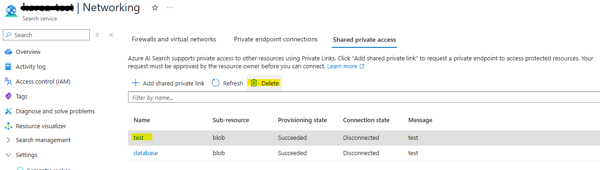

### 작성자 : [SungGun_Lee](https://techcommunity.microsoft.com/users/sunggun_lee/1551033)
### 원본 : [[AI Search] LockedSPLResourceFound error when deleting AI Search](https://techcommunity.microsoft.com/blog/azurepaasblog/ai-search-lockedsplresourcefound-error-when-deleting-ai-search/4415849)


**"LockedSPLResourceFound" 오류로 인해 AI 검색(AI Search)을 삭제할 수 없습니다.**
다음 오류로 인해 AI 검색을 삭제할 수 없으신가요?

```
LockedSPLResourceFound :Unable to verify management locks on Resource '$Resource_Path '. If you still want to delete the search service, manually delete the SPL resource first and try again. 
```
해당 오류가 발생하고 있다면, 다음의 내용을 잘 살펴봐주시기 바랍니다.


**[해결 방법 – 공유 프라이빗 링크 삭제]**
이 오류 메시지는 AI 검색(AI Search)에 공유 프라이빗 링크(Shared Private Link)가 아직 구성되어 있는 경우에 나타납니다. 공유 프라이빗 링크를 먼저 삭제하지 않으면 AI 검색 리소스를 삭제할 수 없습니다.

포털에서 공유 프라이빗 링크를 수동으로 삭제해야 합니다.
설정(Settings) > 네트워킹(Networking) > 공유 프라이빗 액세스(Shared private access) 탭으로 이동합니다.



공유 프라이빗 링크를 모두 삭제한 후, AI 검색(AI Search) 리소스를 다시 삭제해 보시기 바랍니다.

또한 공유 프라이빗 링크가 완전히 삭제되기까지 시간이 걸릴 수 있으므로, 최소 15분 정도 기다린 뒤에 삭제 시도를 하는 것이 좋습니다.

**[추가 정보 – 공유 프라이빗 링크 삭제를 시도했지만 오랫동안 대기 상태인 경우]**
경우에 따라 공유 프라이빗 링크가 아래와 같이 오랜 시간 동안 삭제 중 상태로 표시될 수 있습니다. (예: 3시간 이상 또는 그 이상)


이 경우에는, 공유 프라이빗 링크가 제대로 삭제되지 않아 AI 검색(AI Search)을 삭제할 수 없는 문제라고 Support 팀에 문의해 주세요.
Support 팀이 해당 문제를 확인하고 처리해 드리겠습니다!

----------

- 2025년 5월 21일 업데이트 됨.
- 2025년 7월 16일 번역 함. (by [JYSEONG(MSFT)](https://techcommunity.microsoft.com/users/ji%20yong%20seong/219866) / [GitHub](https://github.com/jiyongseong))