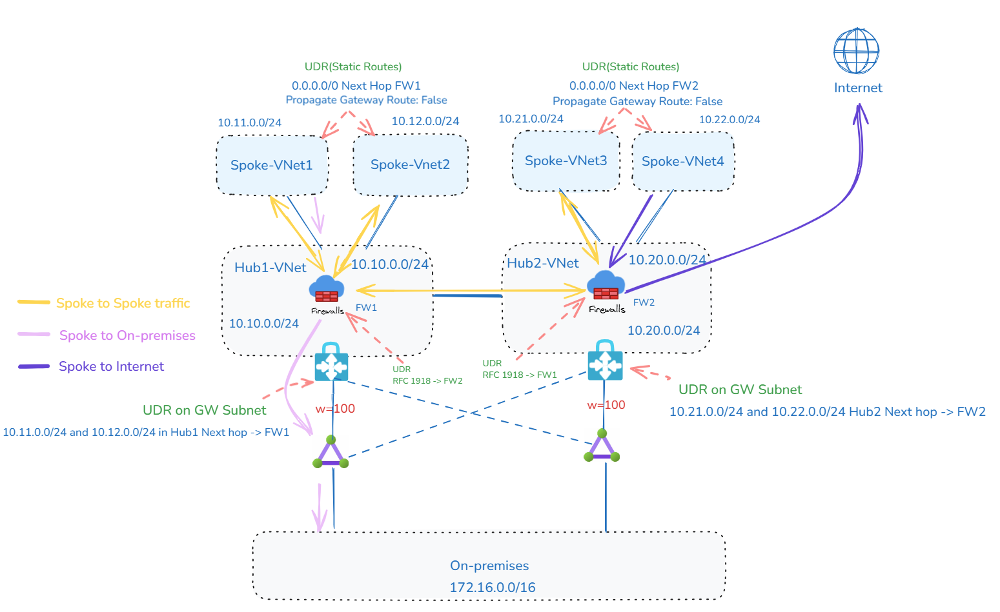
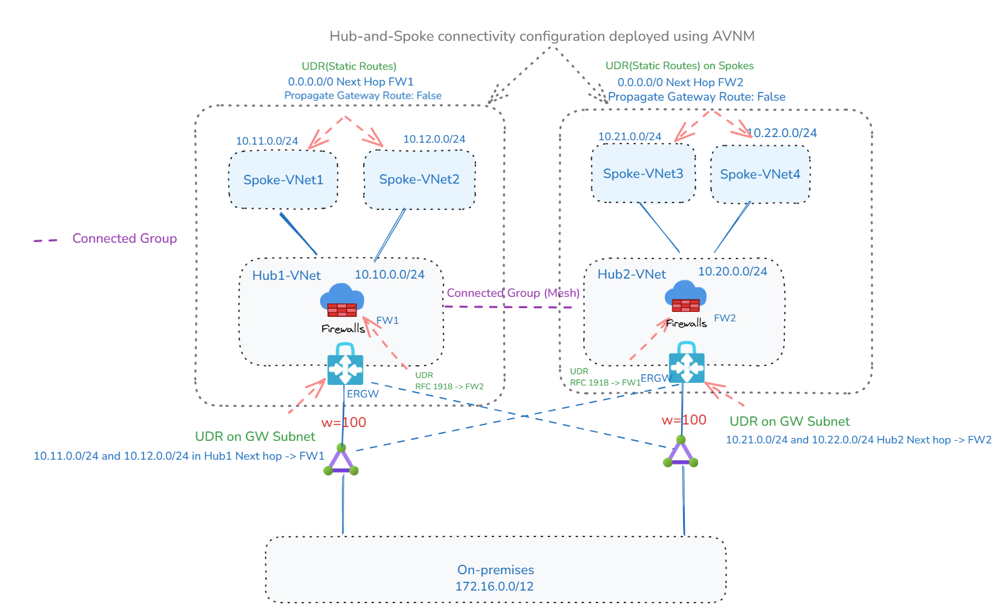
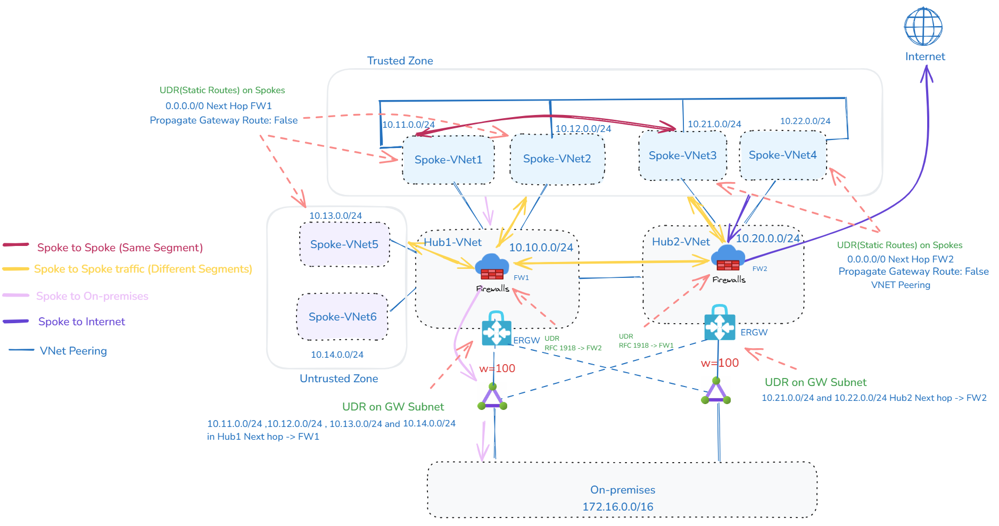
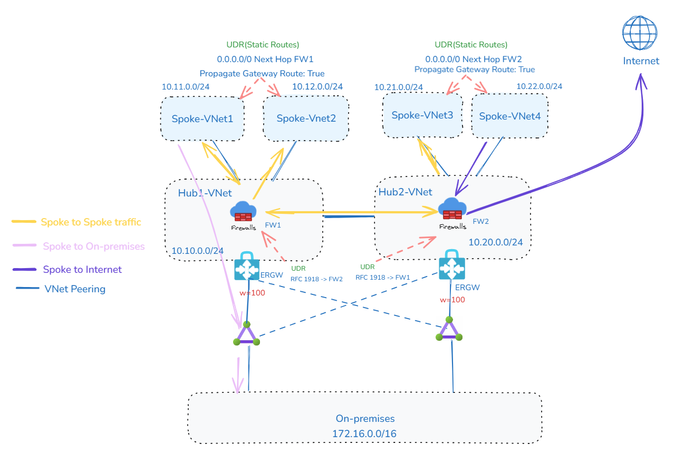
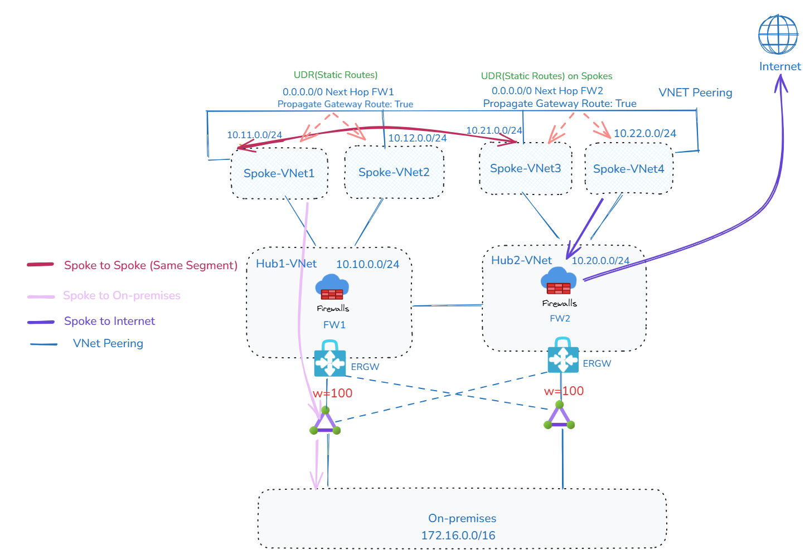
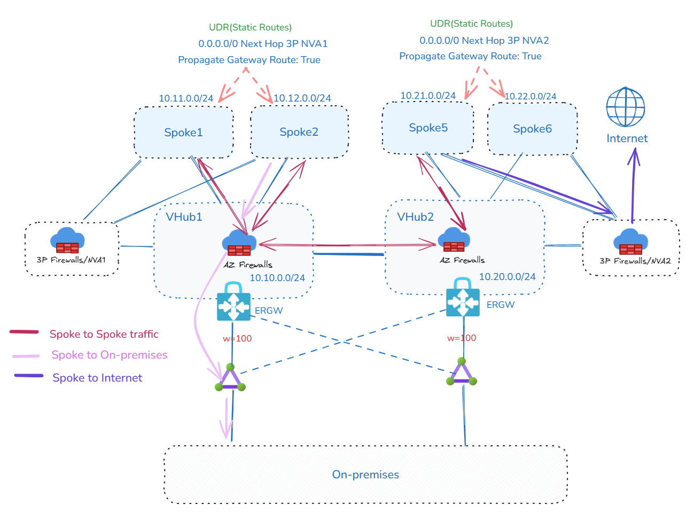
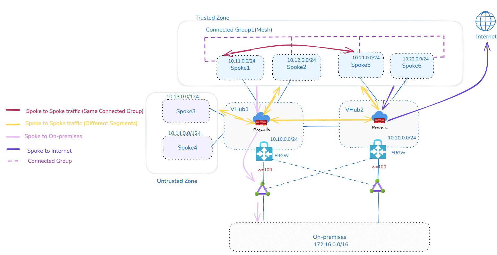
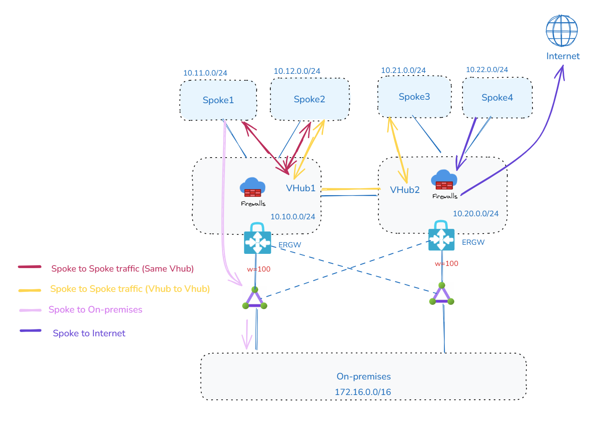

### 작성자 : [shruthi_nair](https://techcommunity.microsoft.com/users/shruthi_nair/1792088), [Mays_Algebary](https://techcommunity.microsoft.com/users/mays_algebary/2384598)
### 원본 : [Inspection Patterns in Hub-and-Spoke and vWAN Architectures](https://techcommunity.microsoft.com/blog/azurenetworkingblog/inspection-patterns-in-hub-and-spoke-and-vwan-architectures/4430491)

네트워크 아키텍처에서 검사는 매우 중요한 역할을 하며, 고객마다 고유한 검사 요구사항을 가질 수 있습니다. 이 블로그에서는 허브 앤 스포크(Hub-and-Spoke) 및 가상 WAN(Virtual WAN, 이하 vWAN) 토폴로지에서 자주 발생하는 검사 시나리오에 대해서 살펴봅니다.

두 개의 허브 또는 가상 허브(Virtual Hubs, VHubs)가 ExpressRoute를 통해 온프레미스 환경과 연결되어 있다는 가정하에 설계 접근 방식을 설명합니다. 허브 또는 VHub가 위치한 지역은 중요하지 않으며, 이 글에서 설명하는 것과 동일한 설계 원칙을 지역에 상관없이 적용할 수 있습니다.

# 시나리오 1: 허브 앤 스포크(Hub-and-Spoke) 검사 패턴

허브 앤 스포크 시나리오에서는 기본 아키텍처로 두 개의 허브 VNet이 존재하는 구성을 가정합니다. 각 허브 VNet은 해당 지역의 스포크 VNet들과 피어링되어 있으며, 다른 허브 VNet(Hub2-VNet)과도 피어링되어 있습니다. 또한, 두 허브 VNet 모두 로컬 및 원격 ExpressRoute 회선에 연결되어 있어 이중화를 보장합니다.

**참고 사항:**
허브 앤 스포크(Hub-and-Spoke) 시나리오에서는 허브 간 ExpressRoute 회선을 통한 가상 네트워크 간 연결이 의도적으로 비활성화되어 있습니다. 이는 허브 간 트래픽이 ExpressRoute 회선을 경유하는 대신, 보다 최적화된 경로를 제공하는 VNet 피어링을 사용하도록 하기 위함입니다.

시나리오 1에서는 두 가지 구현 접근 방식을 제시합니다: 전통적인 방식과 Azure Virtual Network Manager(AVNM)를 활용한 대안에 대해서 설명합니다.

## 옵션 1: 전체 트래픽 검사 (Full Inspection)

보안 및 컴플라이언스 요구사항을 충족하기 위해 동서(East-West) 및 남북(North-South) 방향의 모든 트래픽을 검사하는 설계 패턴이 널리 채택되고 있습니다. 이러한 구현은 VNet 피어링과 사용자 정의 라우트(User-Defined Routes, UDR)를 활용한 전통적인 허브 앤 스포크(Hub-and-Spoke) 토폴로지를 통해 수행할 수 있으며, 또는 Azure Virtual Network Manager(AVNM)의 연결 구성(Connectivity Configurations)과 중앙 집중식 UDR 관리를 활용한 방식으로도 구현할 수 있습니다.

전통적인 방식에서는 다음과 같은 접근이 사용됩니다:

  * 각 스포크(Spoke)는 로컬 허브(Hub)와 연결되며, 두 허브 간의 연결도 VNet 피어링을 통해 설정됩니다.

  * 사용자 정의 라우트(UDR)는 방화벽을 트래픽의 다음 홉으로 지정하여, 목적지에 도달하기 전에 반드시 검사를 거치도록 합니다.

  * 해당 UDR은 스포크 VNet, 게이트웨이 서브넷(Gateway Subnet), 그리고 방화벽 서브넷(Firewall Subnet)에 적용되며, 특히 지역 간(inter-region) 시나리오에서는 더욱 중요합니다. 도식화하면 다음과 같습니다.

 

**허브 앤 스포크(Hub and Spoke): 전체 트래픽 검사**

환경이 확장됨에 따라 개별 UDR과 VNet 피어링을 수동으로 관리하는 작업은 점점 더 복잡해질 수 있습니다. 이러한 배포 및 지속적인 관리를 간소화하기 위해 Azure Virtual Network Manager(AVNM)를 사용할 수 있습니다.

AVNM을 활용하면 다음과 같은 방식으로 구성이 가능합니다:

* 단일 허브 내 라우팅 관리를 위해 **허브 앤 스포크(Hub-and-Spoke) 연결 구성**을 사용합니다.
* 두 허브 간의 연결을 설정하기 위해 **메시(Mesh) 연결 구성**을 사용합니다.
* AVNM은 UDR의 중앙 집중식 생성, 할당 및 관리를 가능하게 하여 대규모 네트워크 구성을 간소화합니다.

 

**허브 앤 스포크(Hub and Spoke, AVNM): 전체 트래픽 검사**

### 연결 검사 시나리오

| 연결 시나리오           | 검사 여부 |
|------------------------|-----------|
| 온프레미스 ↔ Azure     | ✅ 검사됨 |
| 스포크 ↔ 스포크        | ✅ 검사됨 |
| 스포크 ↔ 인터넷        | ✅ 검사됨 |

## 옵션 2: Azure VNet 간 선택적 트래픽 검사

일부 시나리오에서는 전체 트래픽 검사가 필요하지 않거나 바람직하지 않을 수 있습니다. 예를 들어, 신뢰 영역(trust zones)을 기반으로 네트워크를 분리한 경우, 신뢰할 수 있는 VNet 간의 트래픽은 검사를 필요로 하지 않을 수 있습니다. 그 외에도 대량의 데이터 복제, 지연에 민감한 애플리케이션, 검사로 인한 오버헤드 및 비용 절감 필요 등이 이유가 될 수 있습니다.

이 설계에서는 VNet을 신뢰 영역과 비신뢰 영역으로 나눕니다. 신뢰할 수 있는 VNet은 동일한 허브 내에 존재할 수도 있고, 서로 다른 허브에 걸쳐 있을 수도 있습니다. 신뢰할 수 있는 VNet 간의 트래픽에서 검사를 우회하려면, VNet 피어링 또는 AVNM 메시(Mesh) 연결 토폴로지를 사용하여 직접 연결할 수 있습니다.

여기서도 UDR은 사용되며, 전체 트래픽 검사 모델(**옵션 1**)에서 설명한 방식대로 구성됩니다. 그러나 신뢰할 수 있는 VNet 간에 직접 연결이 이루어질 경우, VNet 피어링 또는 메시(Mesh) 연결을 통해 생성된 시스템 라우트가 사용자 정의 라우트(UDR)보다 우선 적용됩니다. 그 결과, 신뢰할 수 있는 VNet 간의 트래픽은 방화벽을 우회하여 직접 흐르게 됩니다. 반면, 비신뢰 영역과의 트래픽은 UDR을 따라 방화벽을 경유하도록 라우팅되어 검사가 수행됩니다.

 

**허브 앤 스포크(Hub and Spoke): Azure VNet 간 선택적 트래픽 검사**

  Selective Inspection between Azure VNet.png)

**허브 앤 스포크(Hub and Spoke, AVNM): Azure VNet 간 선택적 트래픽 검사**

### 연결 검사 시나리오

| 연결 시나리오                          | 검사 여부 |
|--------------------------------------|-----------|
| 온프레미스 ↔ Azure                   | ✅ 검사됨 |
| 스포크 ↔ 인터넷                      | ✅ 검사됨 |
| 스포크 ↔ 스포크 (동일 신뢰 영역)     | ❌ 미검사 |
| 스포크 ↔ 스포크 (다른 신뢰 영역 간) | ✅ 검사됨 |

## 옵션 3: 온프레미스 트래픽에 대한 검사 생략

온프레미스 또는 코로케이션(colocation) 사이트에 이미 방화벽이 배포되어 Azure에서 오는 트래픽을 검사하는 경우, 고객은 중복 검사를 피하고자 하는 경우가 많습니다. 이러한 요구를 지원하기 위해 위의 설계에서는 온프레미스로 향하는 트래픽이 Azure에 배포된 방화벽을 경유하지 않도록 구성합니다.

스포크 VNet에 적용되는 사용자 정의 라우트(UDR)에서는 "게이트웨이 라우트 전파(Propagate Gateway Routes)" 설정을 true로 지정해야 합니다. 이를 통해 트래픽이 Azure 내에서 추가적인 검사를 거치지 않고 ExpressRoute 경로를 따라 직접 전달될 수 있습니다.

**허브 앤 스포크(Hub and Spoke): 온프레미스 트래픽에 대한 검사 생략**

 No Inspection to On-premises.png)

**허브 앤 스포크(Hub and Spoke, AVNM): 온프레미스 트래픽에 대한 검사 생략**

### 연결 검사 시나리오

| 연결 시나리오           | 검사 여부 |
|------------------------|-----------|
| 온프레미스 ↔ Azure     | ❌ 미검사 |
| 스포크 ↔ 스포크        | ✅ 검사됨 |
| 스포크 ↔ 인터넷        | ✅ 검사됨 |

## 옵션 4: 인터넷 트래픽만 검사

일반적으로 권장되지는 않지만, 일부 고객은 인터넷으로 향하는 트래픽만 검사하고, 사설 네트워크 내 트래픽은 검사를 생략하는 방식을 선택하기도 합니다. 이러한 경우, 스포크 VNet 간에는 VNet 피어링 또는 AVNM 메시(Mesh) 연결을 통해 직접 연결할 수 있습니다.

온프레미스로 향하는 트래픽이 검사를 우회하도록 하려면, 스포크 VNet에 적용되는 사용자 정의 라우트(UDR)에서 "게이트웨이 라우트 전파(Propagate Gateway Routes)" 설정을 true로 지정해야 합니다. 이를 통해 트래픽은 Azure 내 방화벽을 거치지 않고 ExpressRoute 경로를 따라 직접 전달됩니다.

**허브 앤 스포크(Hub and Spoke): 인터넷 트래픽만 검사**

 Internet Inspection Only.png)

**허브 앤 스포크(Hub and Spoke, AVNM): 인터넷 트래픽만 검사**

# 시나리오 2: vWAN 검사 옵션

이제 vWAN 토폴로지를 활용한 검사 옵션을 살펴보겠습니다.

모든 시나리오에서 기본 아키텍처는 두 개의 가상 허브(Virtual Hubs, VHubs)를 가정하며, 각각은 해당 지역의 스포크 VNet들과 연결되어 있습니다. vWAN은 두 VHub 간의 기본 연결을 제공하며, 각 VHub는 로컬 및 원격 ExpressRoute 회선에도 연결되어 있어 이중화를 지원합니다.

중요한 점은 이 논의가 Routing Intent를 활용한 vWAN 내의 검사에 초점을 맞추고 있다는 것입니다. 따라서 이 모델에서는 **온프레미스로 향하는 트래픽에 대해 검사를 우회하는 방식은 지원되지 않습니다**.

## 옵션 1: 전체 트래픽 검사

앞서 언급했듯이, 동서(East-West) 및 남북(North-South) 방향의 모든 트래픽을 검사하는 것은 보안 및 컴플라이언스 요구사항을 충족하기 위한 일반적인 관행입니다. 이 설계에서는 Routing Intent를 활성화함으로써 사설 트래픽과 인터넷으로 향하는 트래픽 모두에 대해 검사를 수행할 수 있습니다.

허브 앤 스포크(Hub-and-Spoke) 토폴로지와 달리, 이 방식에서는 사용자 정의 라우트(UDR) 구성이 필요하지 않습니다.

**vWAN: 전체 트래픽 검사**

### 연결 검사 시나리오

| 연결 시나리오           | 검사 여부 |
|------------------------|-----------|
| 온프레미스 ↔ Azure     | ✅ 검사됨 |
| 스포크 ↔ 스포크        | ✅ 검사됨 |
| 스포크 ↔ 인터넷        | ✅ 검사됨 |

## 옵션 2: 다양한 방화벽 유형을 활용한 트래픽 검사

* VHub 내에서 다양한 방화벽 유형을 활용하여 트래픽을 검사하는 방식

일부 고객은 트래픽 흐름에 따라 서로 다른 방화벽을 요구합니다. 예를 들어, 동서(East-West) 트래픽에는 Azure Firewall을 사용하고, 남북(North-South) 트래픽에는 서드파티 방화벽을 사용하는 방식입니다. vWAN에서는 하나의 VHub 내에 Azure Firewall과 서드파티 네트워크 가상 어플라이언스(NVA)를 함께 배포하는 것이 가능합니다.

단, 현재 시점에서는 동일한 VHub 내에 서로 다른 두 종류의 서드파티 NVA를 동시에 배포하는 것은 지원되지 않습니다. 이 동작은 향후 변경될 수 있으므로, 최신 정보를 확인하려면 [알려진 제한 사항(Known Limitations)](https://learn.microsoft.com/ko-kr/azure/virtual-wan/how-to-routing-policies#knownlimitations) 섹션을 지속적으로 모니터링하는 것이 좋습니다.

이 설계를 통해 Routing Intent를 활용하여 동서 트래픽과 남북 트래픽을 어떤 방화벽이 처리할지 쉽게 제어할 수 있으며, 사용자 정의 라우트(UDR)를 구성할 필요가 없습니다.

**vWAN: VHub 내에서 다양한 방화벽 유형을 활용한 트래픽 검사**

* VHub의 제약이 적용될 때 Spoke VNet에 서드파티 방화벽 배포하기

VHub 내에서 사용하려는 서드파티 방화벽이 지원되지 않거나, VHub에서 제공되는 관리형 방화벽이 일반 VNet에 배포 가능한 버전에 비해 필요한 기능이 부족한 경우, VHub에는 Azure Firewall을 사용하고 서드파티 방화벽은 spoke VNet에 배포할 수 있습니다.

이 설계에서는 spoke VNet에 배포된 서드파티 방화벽이 인터넷으로 향하는 트래픽을 처리하고, VHub 내의 Azure Firewall은 East-West 트래픽을 검사합니다. 이 구성은 서드파티 방화벽이 배포된 VNet을 VHub와 피어링하고, 해당 VNet을 spoke VNet들과 직접 피어링함으로써 구현됩니다. 이러한 spoke VNet들은 VHub에도 연결되어 있으며, 아래 다이어그램에 그려진 바와 같습니다. 인터넷으로 향하는 트래픽을 서드파티 방화벽 VNet으로 전달하기 위해 spoke VNet에는 UDR이 필요합니다. 반면, East-West 트래픽 라우팅은 Routing Intent 기능을 사용하여 Azure Firewall을 통해 트래픽을 유도하며, 이 경우 UDR은 필요하지 않습니다.

**vWAN: VHub의 제약이 적용될 때 Spoke VNet에 서드파티 방화벽 배포하기**

**참고:** 트래픽 흐름을 위해 서드파티 방화벽 VNet을 VHub에 연결하는 것이 필수는 아니지만, 관리의 용이성과 온프레미스 접근성을 고려할 때 연결하는 것이 권장됩니다.

### 연결 검사 시나리오

| 연결 유형           | 검사 여부 | 사용된 방화벽 유형         |
|--------------------|-----------|----------------------------|
| 온프레미스 ↔ Azure | ✅ 검사됨 | Azure Firewall 사용        |
| 스포크 ↔ 스포크      | ✅ 검사됨 | Azure Firewall 사용        |
| 스포크 ↔ 인터넷     | ✅ 검사됨 | 서드파티 방화벽 사용       |

## 옵션 3: Azure VNet 간 선택적 트래픽 검사

Hub-and-Spoke 토폴로지와 유사하게, 모든 트래픽을 검사하는 것이 이상적이지 않은 시나리오도 존재합니다. 이는 Azure VNet이 신뢰 영역과 비신뢰 영역으로 분리되어 있어, 신뢰된 VNet 간에는 검사가 불필요한 경우일 수 있습니다. 또한 특정 VNet 간 대용량 데이터 복제나 지연에 민감한 애플리케이션으로 인해 검사 지연 및 관련 비용을 최소화해야 하는 경우도 있습니다.

이 설계에서는 신뢰된 VNet과 비신뢰된 VNet이 동일한 VHub 내에 있거나 서로 다른 VHub에 위치할 수 있습니다. Routing Intent는 신뢰된 VNet과 비신뢰된 VNet 간의 트래픽 및 인터넷으로 향하는 트래픽을 검사하기 위해 활성화된 상태로 유지됩니다. 신뢰된 VNet 간의 트래픽 검사를 우회하려면 VNet 피어링 또는 AVNM Mesh 연결을 통해 직접 연결할 수 있습니다.

Hub-and-Spoke 모델과 달리, 이 설계에서는 UDR 구성이 필요하지 않습니다. 신뢰된 VNet이 직접 연결되어 있기 때문에, VNet 피어링에서 생성된 시스템 라우트가 VHub를 통해 학습된 라우트보다 우선 적용됩니다. 비신뢰 영역으로 향하는 트래픽은 계속해서 Routing Intent를 따라가며 적절히 검사됩니다.

**vWAN: Azure VNet 간 선택적 트래픽 검사**

### 연결 검사 시나리오

| 연결 유형                         | 검사 여부 |
|----------------------------------|-----------|
| 온프레미스 ↔ Azure               | ✅        |
| 스포크 ↔ 인터넷                   | ✅        |
| 스포크 ↔ 스포크 (동일한 영역 내)   | ❌        |
| 스포크 ↔ 스포크 (다른 영역 간)     | ✅        |

## 옵션 4: 인터넷 트래픽만 검사

일반적으로 권장되지는 않지만, 일부 고객은 인터넷으로 향하는 트래픽만 검사하고 사설 트래픽은 검사를 생략하는 방식을 선택합니다. 이 설계에서는 Routing Intent 내에서 인터넷 검사 옵션만 활성화하며, 사설 트래픽은 방화벽을 완전히 우회합니다. VHub는 VHub 내 및 VHub 간 라우팅을 직접 관리합니다.

**vWAN: 인터넷 트래픽만 검사**

### 연결 검사 시나리오

| 연결 유형           | 검사 여부 |
|--------------------|-----------|
| 온프레미스 ↔ Azure | ❌        |
| 스포크 ↔ 인터넷     | ✅        |
| 스포크 ↔ 스포크      | ❌        |

----------

- 2025년 7월 11일 업데이트 됨.
- 2025년 7월 31일 번역 함. (by [JYSEONG(MSFT)](https://techcommunity.microsoft.com/users/ji%20yong%20seong/219866) / [GitHub](https://github.com/jiyongseong))