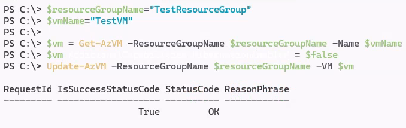
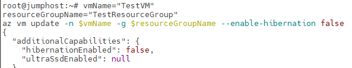
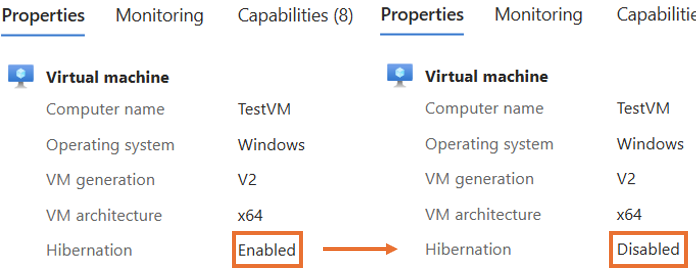
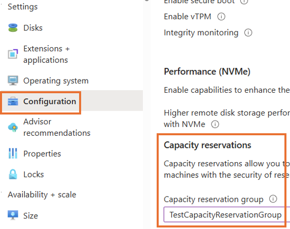

Azure의 **Capacity Reservation(주문형 용량 예약)** 기능은 특정 리전 및 가용성 영역에 VM 용량을 미리 확보해두어, 실제 VM을 배포할 때 용량 부족으로 인한 실패를 방지할 수 있는 유용한 기능입니다. 
하지만 이 기능에는 몇 가지 제한사항이 존재하며, 그 중 하나는 VM의 Hibernation 설정 상태입니다.

이번 포스팅에서는 Hibernation(최대 절전 모드)이 Enabled(활성화)된 상태의 **기존 VM의 Hibernation(최대 절전 모드)를 Disabled(비활성화)) 후 Capacity Reservation을 적용하는 방법**을 소개합니다. 
많은 분들이 해당 설정을 변경하기 위해 **VM을 재생성해야 한다고 오해**하고 계시지만, 사실은 **CLI 또는 PowerShell을 통해 속성을 직접 조정하여 재생성 없이 적용이 가능**합니다.

> **참고:** Capacity Reservation을 적용하기 위해 Hibernation을 **비활성화**하는 것은 모든 시나리오에 **적합하지 않을 수 있습니다.**
>
> Hibernation은 특정 워크로드(예: 장시간 중단 후 빠른 재시작이 필요한 환경)에서 유용하게 활용될 수 있으므로, 사용자의 실제 시나리오 및 요구 사항에 따라 기능 해제 여부를 신중하게 판단해야 합니다.

## Capacity Reservation(주문형 용량 예약)이란?

Capacity Reservation은 지정된 리전과 가용성 영역에서 특정 VM 크기(예: Standard_D2s_v3)에 대해 용량을 미리 예약하는 기능입니다.  
예약된 용량은 실제 VM 배포 없이도 확보되며, 필요 시 해당 용량을 사용하여 VM을 배포할 수 있습니다. Capacity Reservation 은 Reserved Instance와 달리 기간 약정이 필요하지 않습니다.
| 차이점               | Capacity Reservation                                      | Reserved Instance                                         |
|----------------------|--------------------------------------------------------|--------------------------------------------------------|
| **용어**             | 기간 약정이 필요하지 않으며, 고객 요구에 따라 생성 및 삭제 가능 | 1년 또는 3년의 고정 기간 약정 필요                    |
| **청구 할인**        | 기본 VM 크기에 대한 **종량제 요금**으로 청구됨        | **종량제보다 비용 절감 효과가 큼**                     |
| **용량 SLA**         | 지정된 지역/가용성 영역에서 **용량 제공을 보장**      | 용량 보장을 제공하지 않음<br>우선 순위 선택 가능(단, SLA 미적용) |
| **지역 및 가용성 영역** | 지역 또는 가용성 영역 **단위로 배포 가능**            | **지역 단위**에서만 사용 가능                         |

📚 자세히 보기: [Azure Capacity Reservation 개요](https://learn.microsoft.com/ko-kr/azure/virtual-machines/capacity-reservation-overview)

## Capacity Reservation(주문형 용량 예약) 적용 제한사항 중 일부
- **Hibernation: Enabled 상태의 VM은 Capacity Reservation 적용 대상 에 포함될 수 없습니다.**
- Hibernation: Enabled VM에 Capacity Reservation 할당 시 `OperationNotAllowed` 에러가 발생합니다.

📚 관련 제한사항 참고:[Capacity Reservation 제한사항](https://learn.microsoft.com/ko-kr/azure/virtual-machines/capacity-reservation-overview#limitations-and-restrictions)

---

## 해결 방법
### Hibernation(최대 절전 모드) 설정 변경
> **참고:** Azure Portal 에서는 해당 설정을 직접 변경할 수 없으며 Powershell 혹은 CLI 명령을 통해 변경이 가능합니다.
> 
> 기사용 중 인 VM의 Hibernation 속성 수정은 VM이 Stopped(중지됨) 상태에서만 변경이 가능합니다.
>

#### 옵션1. PowerShell을 통한 설정 변경

##### Hibernation(최대 절전 모드) **Enabled(활성화) → Disabled(비활성화)**
- `Get-AzVM` 명령 호출을 통해 가져온 $vm의 속성 중 HibernationEnabled 값을 `false`로 변경 후 `Update-AzVM` 명령을 호출하여 VM 설정을 변경합니다.
```powershell
$resourceGroupName="<리소스그룹명>"
$vmName="<VM명>"

$vm = Get-AzVM -ResourceGroupName $resourceGroupName -Name $vmName
$vm.AdditionalCapabilities.HibernationEnabled = $false
Update-AzVM -ResourceGroupName $resourceGroupName -VM $vm
```
📚 PowerShell 명령 [Get-AzVM](https://learn.microsoft.com/ko-kr/powershell/module/az.compute/get-azvm?view=azps-14.2.0) [Update-AzVM](https://learn.microsoft.com/en-us/powershell/module/az.compute/update-azvm?view=azps-14.2.0)

- 명령 호출 시 다음과 같이 적용/출력 됩니다.

#### 옵션2. Azure CLI를 통한 설정 변경

##### Hibernation(최대 절전 모드) **Enabled(활성화) → Disabled(비활성화)**
- `--enable-hibernation` 옵션 지정과 함께 `az vm update` 명령을 호출하여 VM 설정을 변경합니다. 

```bash
vmName="<VM명">
resourceGroupName="<리소스그룹명>"
az vm update -n $vmName -g $resourceGroupName --enable-hibernation false
```
📚 CLI 명령 [az vm update](https://learn.microsoft.com/ko-kr/cli/azure/vm?view=azure-cli-latest#az-vm-update)

- 명령 호출 시 다음과 같이 적용/출력 됩니다.


- PowerShell/CLI 명령 호출로 인한 **Enabled(활성화) → Disabled(비활성화)** 변경을 확인 가능합니다.


### Capacity Reservation 적용
- Azure Portal 메뉴 내 VM 선택 및 Configuration(설정) 에서 하단 Capacity reservations group 을 지정 후 Apply(적용)합니다.


---

## 요약

초기 Hibernation 상태 | 설정 변경 수행 | Capacity Reservation 적용 여부 |
|------------------- |----------------|----------------------------|
| Disabled           | 없음            | ✅ 적용 가능                 |
| Enabled            | Disabled로 변경 (PowerShell 혹은 CLI) | ✅ 적용 가능|

⚠️ **주의**: Capacity Reservation이 **이미 적용된 상태**에서는 Hibernation 설정을 변경할 수 없습니다. 설정 변경은 **사전에 수행**되어야 합니다.


## 마무리

이번 포스트에서는 Hibernation(최대 절전 모드)이 활성화된 기존 VM에서 Capacity Reservation(주문형 용량 예약)을 적용하기 위해 Hibernation 설정을 PowerShell 또는 CLI을 통해 변경하는 방법을 소개했습니다.

이제는 VM을 재생성하지 않고도, 간단한 명령어만으로 **기존 VM의 유연한 속성 조정 및 Capacity Reservation 적용**이 가능합니다.

## 참고자료

- 📘 [Capacity Reservation 개요](https://learn.microsoft.com/ko-kr/azure/virtual-machines/capacity-reservation-overview)
- 📘 [Capacity Reservation 제한사항](https://learn.microsoft.com/ko-kr/azure/virtual-machines/capacity-reservation-overview#limitations-and-restrictions)
- 📘 [기존 VM의 Hibernation 설정 변경](https://learn.microsoft.com/ko-kr/azure/virtual-machines/windows/hibernate-resume-windows?tabs=enableWithPortal%2CenableWithCLIExisting%2CPortalDoHiber%2CPortalStatCheck%2CPortalStartHiber%2CPortalImageGallery#enabling-hibernation-on-an-existing-windows-vm)
