### 작성자 : [SaikumarMandepudi](https://techcommunity.microsoft.com/users/saikumarmandepudi/2989742)
### 원본 : [Converting Page or Append Blobs to Block Blobs with ADF](https://techcommunity.microsoft.com/blog/azurepaasblog/converting-page-or-append-blobs-to-block-blobs-with-adf/4433723)

저장소 계정에 상당 수의 Page Blob들이 Hot 액세스 계층에 저장되어 있으면서, 해당 Blob들은 자주 액세스되지 않거나 단순히 백업 용도로만 보관되는 경우가 많습니다.
비용을 최적화하려면 이러한 Page Blob을 Archive 계층으로 전환하는 것이 바람직합니다.
그러나 다음 문서(https://learn.microsoft.com/en-us/azure/storage/blobs/access-tiers-overview)에 명시된 바와 같이, 액세스 계층을 설정하는 기능은 Block Blob에만 제공되며, Append Blob 또는 Page Blob에서는 지원되지 않습니다.

Azure Data Factory의 Azure Blob Storage 커넥터는 Block Blob, Append Blob, Page Blob의 데이터를 복사할 수 있으며, Block Blob으로만 데이터를 복사하는 기능을 제공합니다.
출처:https://learn.microsoft.com/en-us/azure/data-factory/connector-azure-blob-storage?tabs=data-factory#supported-capabilities

**참고**: 대상 Blob의 유형을 설정하기 위해 별도의 구성은 필요하지 않습니다. 기본적으로 Azure Data Factory의 복사 작업은 Blob을 Block Blob으로 생성합니다.

이 블로그에서는 Azure Data Factory를 활용하여 Page Blob을 Block Blob으로 복사하는 방법을 알아봅니다. 이 방법은 Append Blob에도 동일하게 적용됩니다.

**작업 단계에 대해서 살펴보도록 하겠습니다.**

## 단계 1 : Azure Data Factory 인스턴스 생성

- 다음 문서를 참고하여 Azure 포털에서 Azure Data Factory 리소스를 생성합니다:
https://learn.microsoft.com/en-us/azure/data-factory/quickstart-create-data-factory

- 생성이 완료되면, 아래와 같이 "Launch Studio" 버튼을 클릭합니다.

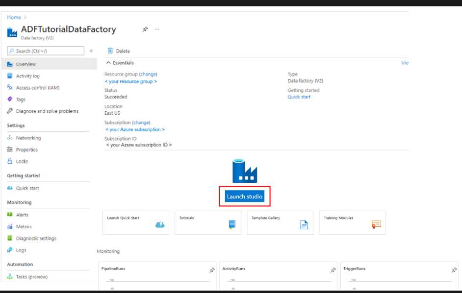

## 2단계: 데이터셋 생성
- Author → Datasets → New dataset 경로로 이동하여 두 개의 데이터셋을 생성합니다.
이 데이터셋들은 Azure Data Factory의 "복사 작업(Copy Activity)"에서 "소스(Source)"와 "싱크(Sink)"로 사용됩니다.

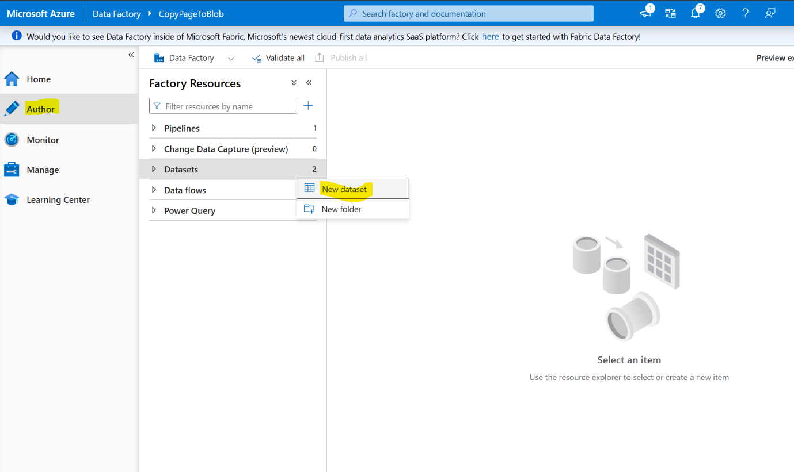

- "Azure blob storage"를 선택한 후, "계속(Continue)"을 클릭합니다.
그 다음, "Binary"를 선택하고 다시 "계속(Continue)"을 클릭합니다.

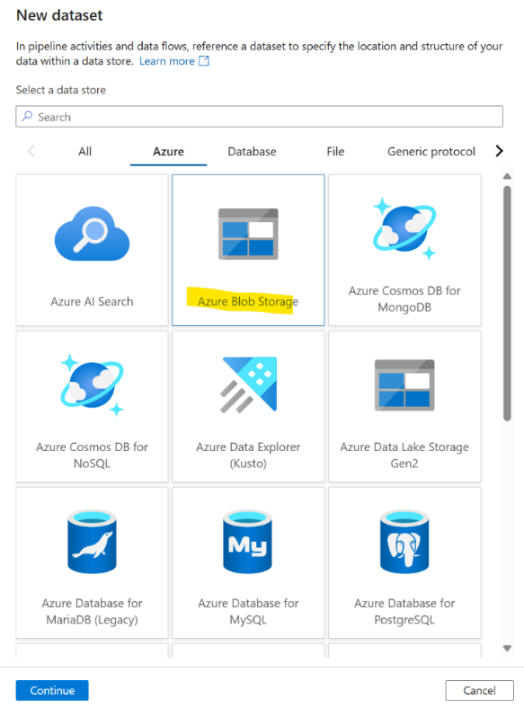
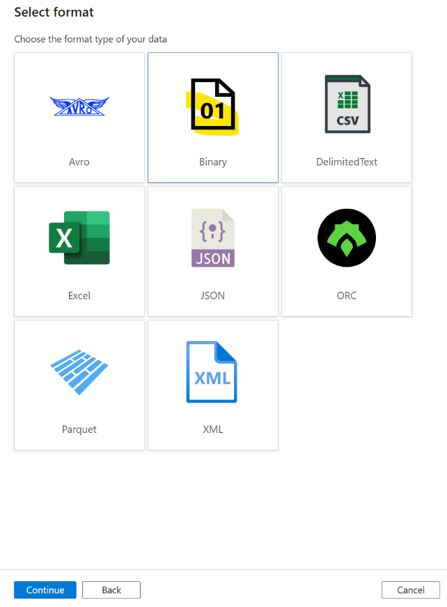

## 3단계: 연결 서비스(Linked Service) 생성
- 새로운 연결 서비스를 생성하고, Page Blob이 있는 스토리지 계정 이름을 입력합니다.

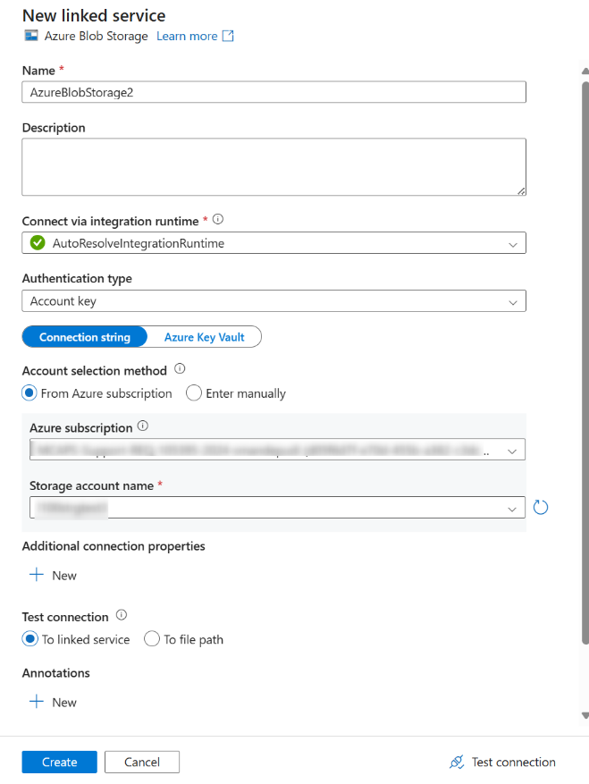

- page blob이 위치한 파일 경로를 입력합니다.

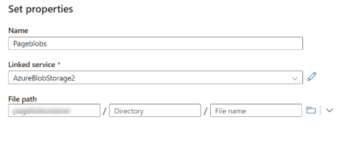

- 대상용 데이터셋도 하나 더 생성합니다. Blob을 Block Blob으로 복사하여 저장소 계정에 저장하기 위해, 3단계부터 6단계까지의 절차를 반복하여 대상 데이터셋을 생성합니다.

**참고**: 대상 데이터셋에는 동일한 스토리지 계정 또는 다른 스토리지 계정을 사용할 수 있습니다. 요청된 사항에 따라 설정합니다.

## 4단계: 데이터 복사 파이프라인 구성
- 두 개의 데이터셋을 생성한 후, 이제 새로운 파이프라인을 생성합니다. "Move and Transform" 섹션에서 "Copy data" 활동을 드래그 앤 드롭하여 추가합니다.

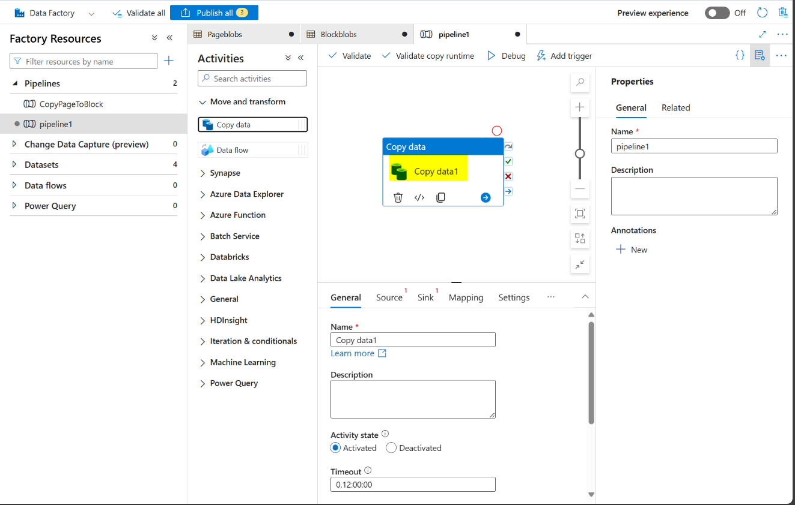

- Source 및 Sink 섹션에서 드롭다운을 통해 앞 단계에서 생성한 소스 데이터셋과 대상 데이터셋을 각각 선택합니다. 
"Recursively" 옵션을 선택한 후, 변경 사항을 "게시(Publish)"합니다.

  - __Source:__
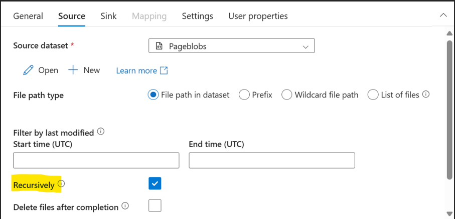

  - __Sink:__
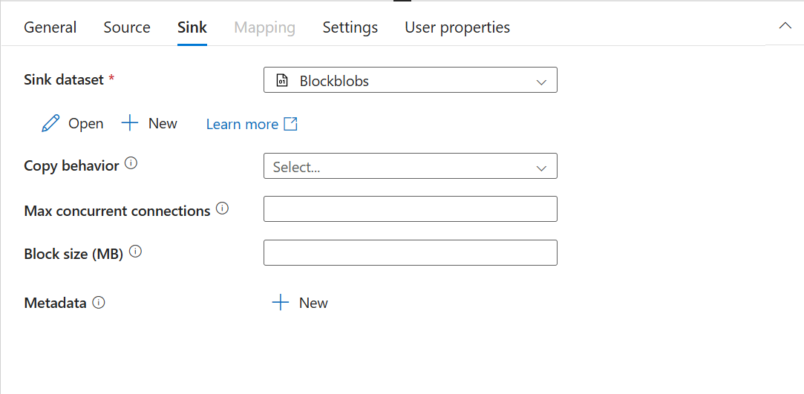

**참고**: 필터 및 복사 동작은 요구사항에 따라 구성이 가능합니다.

## 5단계: 디버깅 및 유효성 검사
- 구성이 완료되면, "Debug" 버튼을 클릭합니다.

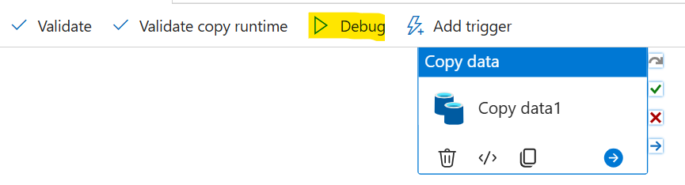

- 파이프라인 활동이 성공적으로 실행되었다면, 아래와 같이 출력(Output) 섹션에서 "Succeeded" 상태를 확인할 수 있습니다.

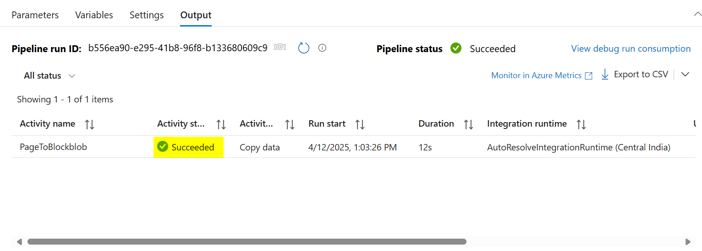

- 대상 스토리지 계정에 있는 Blob의 유형을 확인합니다.
해당 Blob은 Block Blob으로 보여져야 하며, 액세스 계층은 Hot으로 설정되어 있어야 합니다.

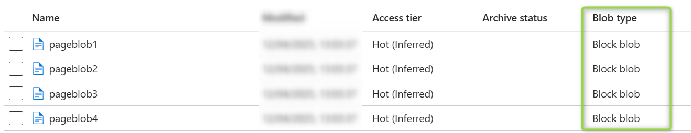

Blob을 Block Blob으로 변환한 후에는 여러 가지 방법으로 액세스 계층을 Archive로 변경할 수 있습니다.
Blob 수명 주기 관리 정책(Lifecycle Management Policy)을 구현하거나, 스토리지 작업(Storage Actions)을 활용하거나, Az CLI 또는 PowerShell 스크립트를 사용하는 방식들이 이에 해당합니다.

## 결론
Azure Data Factory를 활용하면 Page Blob 또는 Append Blob을 Block Blob으로 변환할 수 있으며, 이후에는 LCM(Lifecycle Management) 정책, 스토리지 작업(Storage Actions), 또는 Az CLI 및 PowerShell 스크립트와 같은 표준 방법을 통해 액세스 계층을 Archive로 변경할 수 있습니다.
이 전략은 사용자 지정 코드나 스크립트를 개발하는 방식보다 훨씬 간결하고 효율적인 솔루션을 제공합니다.

## 참고 자료:
- https://learn.microsoft.com/en-us/azure/storage/blobs/access-tiers-overview
- https://learn.microsoft.com/en-us/azure/data-factory/connector-azure-blob-storage?tabs=data-factory#supported-capabilities
- https://learn.microsoft.com/en-us/azure/data-factory/copy-activity-overview
- https://learn.microsoft.com/en-us/azure/storage-actions/storage-tasks/storage-task-quickstart-portal
- https://learn.microsoft.com/en-us/azure/storage/blobs/lifecycle-management-overview
- https://learn.microsoft.com/en-us/azure/storage/blobs/archive-blob?tabs=azure-powershell#bulk-archive

----------

- 2025년 7월 25일 업데이트 됨.
- 2025년 8월 13일 번역 함. (by [JYSEONG(MSFT)](https://techcommunity.microsoft.com/users/ji%20yong%20seong/219866) / [GitHub](https://github.com/jiyongseong))