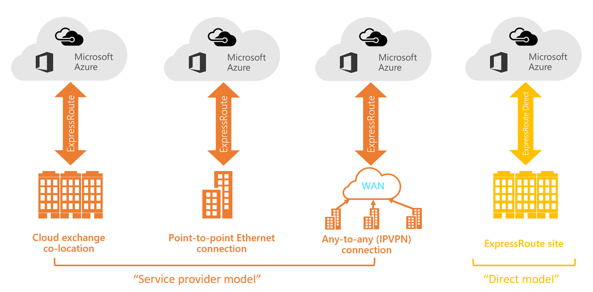
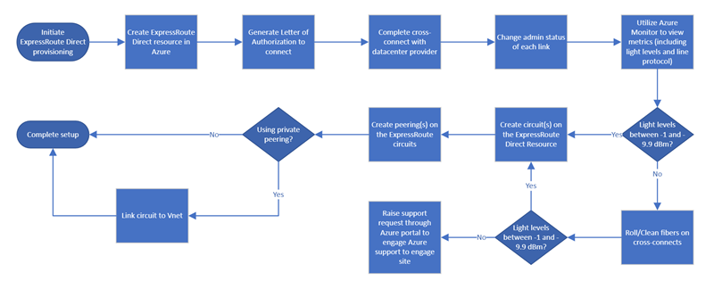
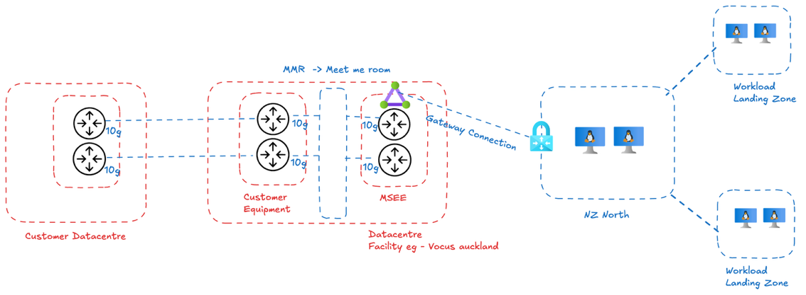

### 작성자 : [supriyas](https://techcommunity.microsoft.com/users/supriyas/1136782)
### 원본 : [Azure ExpressRoute Direct: A Comprehensive Overview](https://techcommunity.microsoft.com/blog/azurenetworkingblog/azure-expressroute-direct-a-comprehensive-overview/4431836)

**Azure ExpressRoute Direct를 활용하여 데이터 센터를 Microsoft 네트워크에 연결하는 방법에 대한 안내서. 각 단계는 명확하고 따라하기 쉬운 내용으로 세분화되어 있으며, 구현 과정 또한 상세하게 설명되어 있습니다.**

# ExpressRoute란?
Azure ExpressRoute는 연결 제공업체를 통해 구축된 사설 연결을 통해 온프레미스 네트워크를 Microsoft 클라우드로 확장할 수 있도록 지원하는 서비스입니다. ExpressRoute를 사용하면 Microsoft Azure 및 Microsoft 365와 같은 Microsoft 클라우드 서비스로 연결을 구성할 수 있습니다.

ExpressRoute는 온프레미스 네트워크와 Microsoft 클라우드 간의 연결을 다음의 네 가지 방식으로 구축할 수 있습니다:

- CloudExchange 코로케이션
- 포인트 투 포인트 이더넷 연결
- Any-to-any (IPVPN) 연결
- ExpressRoute Direct



ExpressRoute Direct는 전 세계 전략적으로 분산된 피어링 지점에서 Microsoft 글로벌 네트워크에 직접 연결할 수 있는 기능을 제공합니다. 이 서비스는 활성-활성(Active-Active) 방식의 대규모 연결을 지원하는 이중 100Gbps 또는 10Gbps의 고속 연결을 제공합니다.

# 고객이 ExpressRoute Direct를 선호하는 이유

- **ExpressRoute Direct와 ExpressRoute Local – 무료 Egress** : ExpressRoute Direct에는 ExpressRoute Local이 포함되어 있으며, 이를 통해 동일한 메트로 지역 또는 피어링 지점 내에서 Azure 서비스로의 사설 연결이 가능합니다. 이 구성은 특히 비용 효율적인 방식으로, metered 요금제든 무제한 요금제든 관계없이 egress 데이터 전송이 무료입니다.
Microsoft의 글로벌 백본 네트워크를 우회함으로써, ExpressRoute Local은 지역 내에 함께 위치한 워크로드에 대해 고속, 저지연 연결을 제공하며, 추가적인 데이터 전송 요금 없이 운영할 수 있습니다.

- **이중 포트 아키텍처:** ExpressRoute Direct와 서비스 제공업체 모델 모두 이중 포트 아키텍처를 특징으로 하며, 두 개의 물리적 광섬유 쌍이 Microsoft의 서로 다른 라우터 포트에 연결되어 있습니다. 이들은 활성-활성(Active-Active) BGP 구성으로 설정되어, 두 링크를 동시에 활용하여 트래픽을 분산함으로써 중복성과 처리량 향상을 제공합니다.
Microsoft가 차별화되는 점은, 이러한 수준의 복원력(Resiliency)을 선택 사항이 아닌 기본 표준으로 제공한다는 것입니다.
예를 들어, 시드니 지역의 선도적인 고객들은 이를 한 단계 더 발전시켜, 여러 코로케이션(colocation) 시설에 걸쳐 ExpressRoute Direct를 배포합니다. 예를 들어, Equinix SY2에 하나의 포트 쌍을, NextDC S1에 또 다른 포트 쌍을 배치함으로써, 지리적으로 분리된 두 사이트에 총 네 개의 연결을 구성합니다.
이러한 설계는 정전, 자연재해, 또는 인프라 손상과 같은 시설 수준의 장애로부터 보호하며, 중단이 허용되지 않는 조직의 비즈니스 연속성을 보장합니다.

- **지리적으로 선택할 수 있는 옵션이 제한되는 경우:**
모든 지역이 다양한 시설 옵션을 제공하는 것은 아닙니다. 예를 들어, 뉴질랜드에는 단 하나의 ExpressRoute 피어링 지점만 존재하기 때문에, 지리적 중복성을 필요로 하는 기업은 시드니에 연결해야 하며, 이로 인해 오클랜드에서 시드니까지의 링크 비용이 발생합니다. 하지만 이러한 연결을 통해 중단 사태를 완화할 수 있는 중요한 다양성을 확보할 수 있습니다.
ExpressRoute의 이중 포트 구성은 활성-활성(Active-Active) 방식의 중복성을 제공하지만, 두 포트 모두 동일한 Microsoft 엣지에 위치하므로, 진정한 재해 복구(Disaster Recovery)를 위해서는 시드니의 엣지를 활용해야 합니다.
ExpressRoute Direct는 기본적인 이중 포트 구성부터 다중 시설 배포까지 확장 가능하며, 또 하나의 장점은 동일한 지정학적 지역 내에서의 데이터 전송이 무료라는 점입니다. 트래픽이 Microsoft 네트워크에 진입한 이후에는, 뉴질랜드 고객이 Azure 서비스 간에 트랜스-태즈먼 링크를 통해 데이터를 이동하더라도 GB당 요금이 부과되지 않으며, Microsoft가 해당 비용을 부담합니다.

- **Premium SKU: 글로벌 연결(Global Reach):** 
Premium SKU가 적용된 Azure ExpressRoute Direct는 Global Reach 기능을 활성화하여, Microsoft의 글로벌 백본 네트워크를 통해 서로 다른 지리적 지역에 위치한 온프레미스 네트워크 간의 사설 연결을 가능하게 합니다. 이를 통해 다른 국가나 대륙에 위치한 ExpressRoute 회선을 연결할 수 있으며, 글로벌 오피스나 데이터 센터 간의 안전하고 고성능의 데이터 교환을 지원합니다.
Premium SKU는 ExpressRoute Direct의 기능을 확장하여 다음을 지원하며, 해당 기능은 전 세계에 분산된 인프라를 운영하는 다국적 기업에 특히 적합합니다.:
  - 지역 간 연결(Cross-region connectivity)
  - 라우팅 경로 수 증가
  - 더 많은 Azure 지역에 대한 접근

- **MACsec: 심층 방어 및 엔터프라이즈 보안**
ExpressRoute Direct는 데이터 링크 계층에서의 암호화를 지원하는 MACsec(IEEE 802.1AE)을 지원하는 유일한 서비스입니다. 이를 통해 고객의 라우터와 Microsoft의 라우터 간에 암호화된 통신을 코로케이션 시설 내에서도 직접 설정할 수 있습니다.
이 기능은 선택적으로 사용할 수 있으며, 은행이나 정부 기관처럼 규정 준수가 중요한 워크로드에 대해 추가적인 보안 계층을 제공합니다.

- **엔터프라이즈를 위한 고성능 데이터 전송**
Azure ExpressRoute Direct는 10Gbps에서 최대 100Gbps까지의 전용 대역폭을 제공함으로써, 온프레미스 인프라와 Azure 간의 초고속 및 보안 데이터 전송을 가능하게 합니다. 이러한 고속 연결은 AI 워크로드, 백업, 재해 복구와 같은 대규모 데이터 이동 시나리오에 이상적입니다.
ExpressRoute Direct는 일관된 성능, 낮은 지연 시간, 향상된 안정성을 보장하며, 빈번하거나 시간 민감적인 데이터 동기화가 필요한 하이브리드 및 멀티클라우드 환경에 매우 적합합니다.

- **FastPath 지원**
Azure ExpressRoute Direct는 이제 Private Endpoint 및 Private Link에 대한 FastPath 기능을 지원하여, 가상 네트워크 게이트웨이를 우회함으로써 낮은 지연 시간과 높은 처리량의 연결을 가능하게 합니다. 이 기능은 ExpressRoute Direct 회선(10Gbps 또는 100Gbps)에서만 사용할 수 있으며, 현재 제한적으로 사용할 수 있는(Limited General Availability) 상태입니다.
라우팅 경로 교환을 위해서는 여전히 게이트웨이가 필요하지만, FastPath가 활성화되면 트래픽은 직접 흐르게 됩니다.

# ExpressRoute Direct 구성 워크플로우



ExpressRoute Direct 리소스를 프로비저닝하기 전에 철저한 사전 계획이 반드시 준비되어야 합니다.

```
연결 구성 시 핵심 고려사항 중 하나는 고객 네트워크 경계(Customer Edge)에서 Microsoft 엔터프라이즈 엣지(MSEE)까지 ExpressRoute Direct를 통해 제공되는 두 가지 연결 패턴을 이해하는 것입니다.
```

**옵션 1**: 고객 장비의 코로케이션(Colocation)

일반적으로 사용되는 연결 방식으로, 고객이 자신의 네트워크 장비(엣지 라우터)를 Microsoft의 네트워크 장비가 위치한 동일한 서드파티 데이터 센터(예: Equinix 또는 NextDC)에 설치하는 방식입니다. 고객은 해당 시설 내 자신의 케이지(cage)에 라우터 또는 방화벽을 설치한 후, Microsoft의 케이지까지 짧은 크로스 커넥트(cross-connect)를 주문합니다.

크로스 커넥트는 단순히 시설의 패치 패널을 통해 양측을 연결하는 광케이블입니다. 이와 같은 직접적인 코로케이션 방식은 고객과 Microsoft 간에 중간 홉 없이 단일의 고효율 물리적 링크를 제공하며, 레이어 1 연결을 한 번에 완료할 수 있다는 장점이 있습니다.



**옵션 2**: 통신사 또는 익스체인지 제공업체 활용

비용이나 복잡성 등의 이유로 고객이 새로운 시설에 하드웨어를 직접 설치하는 것을 원하지 않는 경우, 이미 해당 코로케이션 시설에 입주해 있는 제공업체를 활용할 수 있습니다. 이 경우, 고객은 자신의 데이터 센터에서 제공업체의 네트워크로 연결하고, 제공업체가 Microsoft 피어링 지점까지의 연결을 확장합니다.

예를 들어, 고객은 Megaport 또는 지역 통신사와 계약하여 온프레미스 위치에서 Megaport 장비까지 트래픽을 전달하고, Megaport가 해당 시설 내에서 Microsoft와의 크로스 커넥션을 처리합니다. 실제 사례에서는 고객이 이미 자사 데이터 센터에서 Megaport와의 연결을 설정한 상태였습니다.

익스체인지 제공업체를 활용하면 제공업체가 크로스 커넥션을 대신 구성하고, 종종 고객을 대신해 LOA(Letter of Authorization)를 제공하기 때문에 물류가 간소화됩니다. 또한,고객의 위치가 Microsoft 피어링 사이트에서 멀리 떨어져 있는 경우 비용 측면에서도 더 효율적일 수 있습니다.


많은 기업들은 연결성이 우수한 코로케이션 시설에 장비를 배치하는 것이 자사 요구에 가장 적합하다고 판단합니다.
예를 들어, 은행 및 대형 조직들은 Equinix Sydney 또는 NextDC Sydney에 라우터를 설치하여 Azure와의 직접적인 광 연결을 구축하는 방식을 성공적으로 채택해왔습니다.

하지만 모든 조직이 새로운 위치에 물리적 장비를 관리하는 데 드는 자본 비용이나 복잡성을 감수하고 싶어하는 것은 아닙니다.
이러한 상황에서는 Megaport와 같은 클라우드 익스체인지를 활용하는 것이 실용적인 대안이 될 수 있습니다. 이 방식은 전용 연결을 유지하면서도 인프라 관리는 제공업체가 대신 처리해주기 때문에, 고객 입장에서는 훨씬 간편하게 운영할 수 있습니다.

연결 방식에 대한 결정이 내려지면, 다음에는 ExpressRoute Direct 포트를 프로비저닝하고 물리적 연결을 구축하게 됩니다.

## 1단계: ExpressRoute Direct 포트 프로비저닝

Azure 포털(또는 CLI)을 통해 ExpressRoute Direct 리소스를 생성합니다. 이때 고객은 Azure 라우터가 위치한 코로케이션 시설에 해당하는 적절한 피어링 위치를 선택해야 합니다. 예를 들어, 고객이 연결을 원하는 시설이 "Vocus Auckland" 또는 "Equinix Sydney SY2"라면 해당 위치를 지정합니다.

설정 과정에서 고객은 포트 대역폭(10Gbps 또는 100Gbps)과 캡슐화 방식(Dot1Q 또는 QinQ)도 선택합니다. 그 다음 Azure는 해당 위치에 있는 서로 다른 두 Microsoft 장비에 각각 포트를 할당하며, 이는 고객에게 중복성을 위한 기본(primary) 및 보조(secondary) 인터페이스를 제공하여 단일 장애 지점(SPoF)을 제거합니다.

```
이 단계에서 반드시 고려해야 할 핵심 사항

캡슐화(Encapsulation):
ExpressRoute Direct 포트를 구성할 때, 고객은 캡슐화 방식을 선택해야 합니다.
Dot1Q(802.1Q)는 회선에 단일 VLAN 태그를 사용하는 방식이며,
Q-in-Q(802.1ad)는 중첩된 VLAN 태그(외부 S-Tag와 내부 C-Tag)를 사용합니다.
Q-in-Q는 Azure가 회선마다 고유한 외부 태그를 할당하기 때문에, 고객 VLAN ID가 중복되더라도 하나의 물리적 포트에서 여러 회선을 운영할 수 있어 유연성이 뛰어납니다. 반면 Dot1Q는 포트 내 모든 회선에서 VLAN ID가 고유해야 하며, 장비가 Q-in-Q를 지원하지 않을 경우에 주로 사용됩니다.
대부분의 최신 구축 환경에서는 유연성을 고려해 Q-in-Q를 선호합니다.

용량 계획(Capacity Planning):
이 서비스는 고객이 20Gbps까지 용량을 초과 프로비저닝(overprovisioning)할 수 있도록 허용합니다. 그러나 설계 시에는 중복성을 고려하여 10Gbps 기준으로 구성해야 하며,총 20Gbps 용량을 기준으로 설계해서는 안 됩니다.
Microsoft의 월간 유지보수 기간 중에는 하나의 포트가 오프라인 상태가 될 수 있으므로,고객 네트워크는 이러한 상황에서도 원활하게 작동할 수 있도록 설계되어야 합니다.

```

## 2단계: 승인서(LOA, Letter of Authorization) 생성

ExpressRoute Direct 리소스를 생성한 후, Microsoft는 승인서(LOA)를 발급합니다. LOA는 일반적으로 PDF 형식의 문서로, 데이터 센터 운영자가 특정 Microsoft 포트를 지정된 고객 포트에 연결할 수 있도록 승인하는 문서입니다. 이 문서에는 시설 이름, 패치 패널 식별자, Microsoft 측 포트 번호 등의 세부 정보가 포함되어 있습니다.

고객이 자체 장비를 코로케이션 시설에 배치하는 경우, 해당 시설로부터 고객 포트에 대한 LOA를 별도로 발급받거나, 크로스 커넥트 주문서에 포트 정보를 직접 기재할 수 있습니다. 만약 Megaport와 같은 제공업체를 사용하는 경우, 해당 제공업체가 자신들의 포트에 대한 LOA를 생성합니다.

일반적으로 두 개의 LOA가 필요합니다:

- 하나는 Microsoft 포트용
- 다른 하나는 고객 또는 제공업체 포트용

이 두 LOA는 시설에 제출되어 크로스 커넥트를 실행하는 데 사용됩니다.

## 3단계: 데이터 센터 제공업체와의 크로스 커넥트 완료

승인서(LOA)를 활용하여, 데이터 센터의 기술자가 Meet-Me Room(MMR)에서 크로스 커넥션 작업을 수행합니다. 이 단계에서 Microsoft 라우터와 고객(또는 제공업체)의 장비 간에 물리적인 광 연결이 구축됩니다.

이 연결은 보안성과 관리 편의성을 위해 케이지 간 직접 케이블이 아닌 MMR의 패치 패널을 통해 이루어지며, 패치 작업이 완료되면 회선이 구성됩니다.
다만, 회선은 일반적으로 "관리적으로 다운(administratively down)" 상태로, 준비가 완료될 때까지 활성화되지 않습니다.


```
이 단계에서 반드시 고려해야 할 핵심 사항

포트 할당 충돌이 발생할 경우, 리소스를 다시 생성하지 말고 Microsoft 지원팀에 문의해야 합니다. Microsoft는 코로케이션 제공업체와 협력하여 충돌을 해결하거나 새로운 승인서(LOA)를 발급해 줍니다.
```

## 4단계: 각 링크의 관리자 상태(Admin State) 변경

크로스 커넥트가 물리적으로 완료되면, Azure 포털에 접속하여 각 ExpressRoute Direct 링크의 관리자 상태(Admin State)를 "사용(Enabled)"으로 전환할 수 있습니다. 이 작업을 수행하면 Microsoft 측의 광학 인터페이스가 활성화되며, 동시에 요금 측정이 시작되므로, 사전에 모든 연결이 정상적으로 작동하는지 반드시 확인해야 합니다.

Azure는 광학 전력 지표(optical power metrics)를 통해 광 연결의 상태를 시각적으로 확인할 수 있는 기능을 제공합니다. 포털에서 수신 광 레벨(receive light levels)을 직접 확인할 수 있으며, 건강한 연결은 일반적으로 -1 dBm에서 -9 dBm 사이의 전력 수치를 보여줍니다. 이는 강력한 광 신호가 전달되고 있다는 의미입니다.

만약 이 범위를 벗어난 수치가 나타나거나, 광 신호가 전혀 감지되지 않는 경우, 이는 패치 오류나 광 커넥터 불량과 같은 잠재적인 문제를 나타내는 경고 신호입니다.

실제로, 광 신호가 너무 낮게 측정되어 불량 커넥터가 발견된 사례가 있었으며, 해당 시설에서 다시 패치 작업을 수행해야 했습니다. 따라서 광학 전력 확인은 물리적 계층의 안정성을 검증하는 첫 번째 방어선이며,수치가 정상 범위에 있음을 확인하면 다음 단계로 진행할 준비가 완료된 것입니다.

```
이 단계에서 반드시 고려해야 할 핵심 사항

사전 모니터링(Proactive Monitoring):
BGP 세션 장애 및 광학 전력 임계값에 대한 경고(Alert)를 설정해야 합니다. 링크 장애는 사용자에게 즉각적인 영향을 주지 않을 수 있지만, 완전한 중복성을 유지하려면 빠른 복구가 필수적입니다.
```

이 단계를 마무리하면, 물리적 인프라 구축이 완료된 것입니다. ExpressRoute Direct 포트 페어(port pair)가 프로비저닝되었고, 광섬유 크로스 커넥트도 설치 완료되었으며, 핵심적인 광 신호 세기 또한 안정적인 수치를 보이고 있습니다. 요약하면, 여러 분의 네트워크 엣지와 Microsoft의 백본 인프라를 직접 연결하는 전용 물리적 고속도로가 구축된 것입니다.

## 5단계: ExpressRoute 회선 생성
ExpressRoute 회선은 물리적인 ExpressRoute Direct 포트를 실제 네트워크 연결로 전환하는 논리적 계층을 의미합니다. Azure 포털을 통해 조직은 ExpressRoute Direct 인프라에 연결된 회선 리소스를 생성하며, 연결 요구사항에 따라 대역폭을 지정하고 적절한 SKU(Local, Standard, Premium)를 선택합니다. 주요 장점 중 하나는 동일한 물리적 포트 페어에서 여러 회선을 프로비저닝할 수 있다는 점이며, 이때 총 대역폭이 물리적 한계를 초과하지 않아야 합니다. 예를 들어, 10Gbps ExpressRoute Direct를 사용하는 조직은 동일한 인프라에서 1Gbps 비운영 회선과 5Gbps 운영 회선을 동시에 실행할 수 있습니다. Azure는 자동 VLAN 관리를 통해 이러한 기술적 복잡성을 처리합니다.

## 6단계: 피어링(Peering) 설정
ExpressRoute 회선이 생성되고 VLAN 연결이 설정되면, 다음으로 중요한 단계는 여러 분의 네트워크와 Microsoft 인프라 간에 BGP(Border Gateway Protocol) 세션을 설정하는 것입니다. ExpressRoute는 두 가지 주요 BGP 피어링 유형을 지원합니다: Azure 가상 네트워크에 접근하기 위한 Private Peering과 Office 365 및 Azure PaaS와 같은 Microsoft SaaS 서비스에 접근하기 위한 Microsoft Peering입니다. 대부분의 기업 환경에서는 데이터 센터를 Azure 워크로드에 연결하기 위해 Private Peering이 사용 됩니다. Azure는 회선 구성에 필요한 BGP IP 주소를 제공하며, 기본(primary) 및 보조(secondary) 링크 피어링을 위한 /30 서브넷을 정의합니다. 이 서브넷은 여러 분의 엣지 라우터에 구성되어 라우팅 정보를 교환하게 됩니다. 일반적인 흐름은 온프레미스 네트워크 프리픽스를 광고(advertise)하고, Azure는 VNet 프리픽스를 BGP 세션을 통해 광고함으로써 두 환경 간의 동적 라우트 탐색을 가능하게 합니다. 중요한 점은 기본 및 보조 링크 모두 활성 BGP 세션을 유지하므로, 하나의 연결이 실패하더라도 보조 BGP 세션이 원활하게 연결을 유지하여 단일 장애 지점에 대한 네트워크 복원력을 확보할 수 있습니다.

## 7단계: 라우팅 및 테스트
BGP 세션이 설정되면 ExpressRoute 회선은 완전히 작동 상태가 되어 온프레미스 네트워크를 Azure 가상 네트워크로 원활하게 확장할 수 있습니다. ping, traceroute 및 애플리케이션 트래픽을 통한 연결 테스트를 통해 온프레미스 서버가 공용 인터넷을 완전히 우회하여 전용 ExpressRoute 경로를 통해 Azure VM과 직접 통신할 수 있음을 확인할 수 있습니다. 트래픽은 VLAN 태그를 통해 회선에 완전히 격리되어 다른 테넌트와 혼합되지 않으며, 전용 연결만이 제공할 수 있는 낮은 지연 시간과 예측 가능한 성능을 보장합니다.
이 단계가 완료되면 고객의 데이터 센터는 레이어 3에서 Azure와 전용 복원력 있는 연결로 연결됩니다. 마치 동일한 LAN 확장에 있는 것처럼 Azure 리소스에 접근할 수 있으며, 낮은 지연 시간과 높은 처리량을 제공합니다. 이제 남은 작업은 이 회선을 ExpressRoute Gateway를 통해 관련 Azure 가상 네트워크에 연결하고, 애플리케이션 트래픽의 종단 간 흐름을 검증하는 것입니다.

단계별 방법은 아래의 링크들을 참고하세요.

[Configure Azure ExpressRoute Direct using the Azure portal | Microsoft Learn](https://learn.microsoft.com/en-us/azure/expressroute/how-to-expressroute-direct-portal)

[Azure ExpressRoute: Configure ExpressRoute Direct | Microsoft Learn](https://learn.microsoft.com/en-us/azure/expressroute/expressroute-howto-erdirect)

[Azure ExpressRoute: Configure ExpressRoute Direct: CLI | Microsoft Learn ](https://learn.microsoft.com/en-us/azure/expressroute/expressroute-howto-expressroute-direct-cli)


----------

- 2025년 7월 25일 업데이트 됨.
- 2025년 8월 20일 번역 함. (by [JYSEONG(MSFT)](https://techcommunity.microsoft.com/users/ji%20yong%20seong/219866) / [GitHub](https://github.com/jiyongseong))