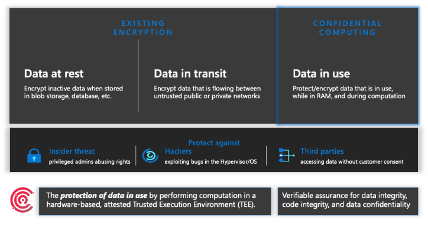
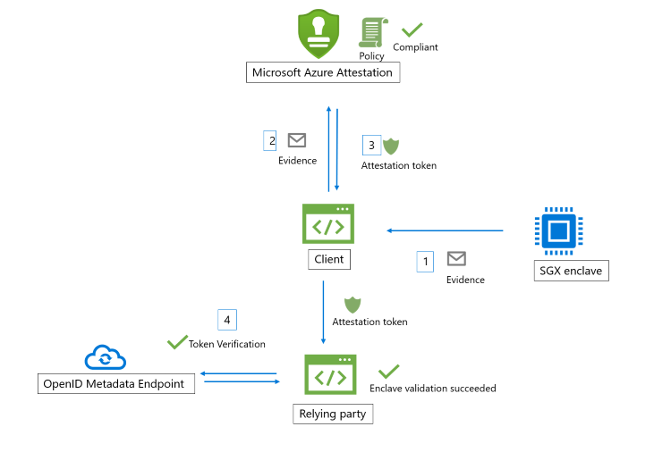
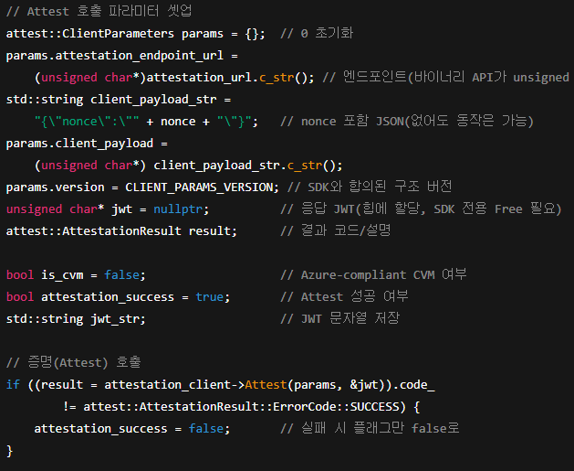
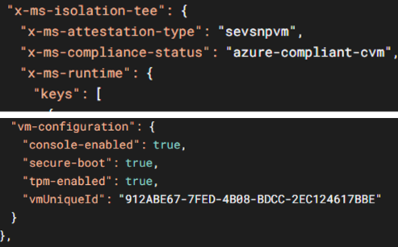

오늘날 클라우드 환경에서는 **특정 규제, 보안 및 주권 요구사항을 준수하기 위해 클라우드 이용 고객이 워크로드의 신뢰성을 직접 검증할 수 있는 기술**이 점점 중요해지고 있습니다.  
특히 금융·공공·헬스케어와 같은 규제 산업에서는 **데이터가 안전한 상태에서만 연산된다는 보증**이 필수적입니다.  
이 글에서는 이를 가능하게 하는 **Azure Confidential VM**과 **Azure Attestation**의 개념, 활용 사례, 그리고 실습 방법을 소개합니다.

---

## Azure Confidential VM 이란?

Confidential VM은 단순한 가상머신이 아니라, **데이터를 사용하는 순간까지 보호**할 수 있는 새로운 유형의 VM입니다.  
Cloud Service Provider의 운영자나 하이퍼바이저 조차 메모리 안의 데이터를 볼 수 없도록 하여, 보안성을 한 단계 높입니다.

Azure Confidential VM은 **하드웨어 수준의 보안 기능(AMD SEV-SNP, Intel TDX 등)** 을 통해 VM 내부에서 실행되는 데이터와 코드를 Cloud Service Provider 운영자조차 접근할 수 없도록 보호하는 가상머신입니다.
즉, 데이터가 사용 중(In-use)일 때도 암호화 상태로 유지되며, 클라우드 고객은 **안전한 실행 환경** 을 확보할 수 있습니다.

주요 특징:
- **암호화된 메모리**: VM 내부의 메모리 영역이 하이퍼바이저나 호스트에서 접근 불가
- **부팅 무결성 검증**: 부팅 시 로드되는 펌웨어와 OS가 변조되지 않았는지 확인
- **원격 증명(Remote Attestation)**: VM이 신뢰할 수 있는 상태임을 외부에서 검증 가능



---

## Azure Attestation 이란?

Confidential VM이 보안 기능을 제공한다면, **Azure Attestation은 이를 외부에서 확인할 수 있는 증명서 역할**을 합니다.  
즉, 단순히 "보안이 강화되어 있다"라는 말이 아니라, **암호학적으로 검증 가능한 증거**를 발급받을 수 있습니다.

Azure Attestation 은 **원격 환경의 무결성을 검증**하는 Azure 관리형 서비스입니다.  
즉, VM·컨테이너·애플리케이션이 "의도한 보안 상태로 부팅되고 실행 중인지" 를 암호학적으로 증명합니다.

- **TPM(Trusted Platform Module)** 과 **TEE(Trusted Execution Environment)** 기술 기반
- 부팅 시 측정된 보안 값(measurement)을 Azure Attestation에 제출
- **JWT(JSON Web Token)** 형태로 증명 토큰 발급 → 다른 서비스·애플리케이션이 이 토큰을 활용해 신뢰 여부 확인



---

## MAA 및 Guest Attestation의 차이

Azure Attestation은 크게 **MAA(Microsoft Azure Attestation)** 와 **Guest Attestation** 두 가지 방식으로 나뉩니다.  
두 방법은 모두 무결성을 보장하지만, 대상과 수행 시점에서 차이가 있습니다.

| 구분 | MAA (Microsoft Azure Attestation) | Guest Attestation |
|------|----------------------------------|-------------------|
| 대상 | 일반 Azure VM (Trusted Launch, vTPM 포함) | Confidential VM (AMD SEV-SNP 기반) |
| 방식 | vTPM 측정값을 주기적으로 전송 및 검증 | VM 부팅 시 펌웨어 측정값을 자동 증명 |
| 활용 | 루트킷/부팅 변조 감지, Azure Defender와 연계 | VM이 신뢰 가능한 상태임을 증명 후 앱/데이터 실행 |
| 결과 | JWT 토큰 반환, 보안 이벤트 감지 시 알림 | JWT 토큰 반환, 민감 데이터 연산 전 검증 |

---

## Use Case

Azure Attestation은 단순히 보안 기능이 아니라, **비즈니스와 규제 요건을 충족시키는 중요한 도구**로 활용됩니다.  
예를 들어 금융권은 고객 데이터를 다룰 때, VM이 안전한 상태인지 Attestation을 통해 검증 후 연산을 수행할 수 있습니다.

- **부팅 무결성 보장**  
  - Trusted Launch VM은 vTPM을 통해 주기적으로 부팅 무결성 측정값을 전송 → 루트킷 감염 시 탐지 가능
- **기밀 데이터 처리**  
  - 금융기관/공공기관이 Azure Confidential VM에서 민감 데이터를 처리하기 전 VM 상태가 신뢰 가능한지 확인
- **제로 트러스트(Zero Trust) 아키텍처**  
  - 모든 워크로드가 실행 전 반드시 Attestation을 통해 검증 후 실행

---

## Workflow

Guest Attestation의 전체 동작은 단순합니다. VM이 부팅될 때 보안 측정값이 생성되고, 이 값이 Azure Attestation 서비스로 전달되어 토큰을 발급받습니다.  
이 토큰을 통해 외부 애플리케이션이나 서비스는 해당 VM이 안전한 상태임을 신뢰할 수 있습니다.

1. Trusted Launch VM 또는 Confidential VM이 부팅됨  
2. 펌웨어 및 OS 초기화 단계에서 보안 측정값 생성  
3. 측정값을 Azure Attestation 서비스로 전송  
4. Azure Attestation은 값의 무결성을 검증하고 JWT 토큰 발급  
5. 고객 앱 또는 서비스는 JWT를 검증하여 신뢰 여부 결정  


---

## 결과값 예시

Attestation의 최종 산출물은 **JWT(JSON Web Token)** 입니다.  
JWT는 표준화된 형식이므로, 이를 검증하면 VM 상태에 대한 신뢰 여부를 프로그램적으로 판단할 수 있습니다.

```json
{
  "alg": "RS256",
  "typ": "JWT"
}
.
{
  "iss": "https://sharedeus2.eus2.attest.azure.net/",
  "sub": "confidential-vm",
  "exp": 1699999999,
  "nbf": 1699900000,
  "claims": {
    "vmType": "ConfidentialVM",
    "policyResult": "compliant",
    "measuredBoot": "passed"
  }
}
<이하 생략>
```

---

## Demo

Azure는 오픈소스 샘플을 통해 Attestation을 직접 실습할 수 있도록 제공합니다.  
아래 명령어를 실행하면 Confidential VM에서 Attestation 요청을 수행하고, JWT 토큰을 반환받을 수 있습니다.



> ⚠️ **Disclaimer**  
> 본 문서는 학습 및 실습을 위한 예제이며, 실제 프로덕션 환경에 적용하기 전 반드시 보안 및 운영 가이드라인을 검토하시기 바랍니다. 작성된 모든 코드와 예시는 _"있는 그대로(as-is)"_ 제공되며, Microsoft 또는 작성자는 이에 대한 책임을 지지 않습니다.

> 💡 **Note**  
> 실행 전 반드시 `default_attestation_url` 값을 환경에 맞게 수정해야 정상적인 JWT 결과를 받을 수 있습니다.


```bash
# 샘플 리포지토리 클론
git clone https://github.com/wonsungso/confidential-computing-cvm-guest-attestation.git
cd confidential-computing-cvm-guest-attestation/cvm-attestation-sample-app/

# 클라이언트 라이브러리 빌드 및 설치
sudo bash ClientLibBuildAndInstall.sh

# 어테스테이션 클라이언트 실행 → JWT 토큰 출력
cmake .
make
sudo ./AttestationClient -o token; echo
```


출력된 결과에는 JWT 토큰이 포함되며, 이 토큰을 애플리케이션 레벨에서 검증함으로써 VM이 정상적이고 안전한 상태에서 실행 중임을 확인할 수 있습니다.
예제에서는 단순히 토큰 문자열을 출력하지만, 실제 운영 환경에서는 이를 보안 정책과 연계하여 추가적인 접근 제어에 활용할 수 있습니다.

---

## 마무리

Confidential VM과 Azure Attestation은 클라우드 환경에서 데이터 보호와 무결성 검증을 동시에 보장하는 핵심 기술입니다.
이번 포스트의 예제와 실습을 통해 보안 아키텍처를 더욱 견고하게 구성할 수 있으며, 특히 민감한 데이터를 다루는 환경에서 큰 가치를 제공합니다.
앞으로는 이러한 기술을 활용하여 제로 트러스트(Zero Trust) 기반 클라우드 보안 전략을 더욱 강화해 나갈 수 있습니다.

---

## 참고자료

- [Azure Confidential Computing 개요](https://learn.microsoft.com/ko-kr/azure/confidential-computing/overview)  
- [Azure Attestation 개요](https://learn.microsoft.com/ko-kr/azure/attestation/overview)  
- [Confidential VM Guest Attestation Sample GitHub](https://github.com/wonsungso/confidential-computing-cvm-guest-attestation)  
- [Guest Attestation에 대한 더 많은 Sample](https://github.com/Azure/confidential-computing-cvm-guest-attestation)  

---
