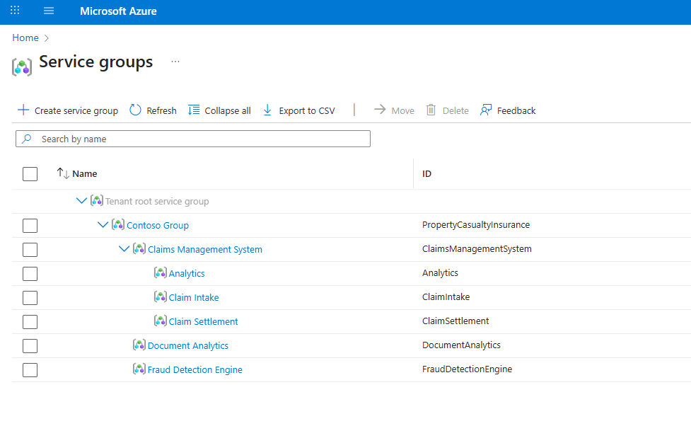

### 작성자 : [kenieva](https://techcommunity.microsoft.com/users/kenieva/852369)
### 원본 : [Announcing Public Preview for Azure Service Groups](https://techcommunity.microsoft.com/blog/azuregovernanceandmanagementblog/announcing-public-preview-for-azure-service-groups/4446572)

## 서비스 그룹(Service Groups, SGs)은 유연한 멤버십을 지원하는 새로운 Azure 그룹으로, 이제 모두가 사용할 수 있게 되었습니다.

# 서비스 그룹이란?

서비스 그룹(Service Groups)은 리소스를 담는 새로운 컨테이너로, 계층 구조나 멤버 구성이 유연해야 하는 관리 및 모니터링 시나리오에서 활용됩니다. 이 서비스 그룹은 테넌트(tenant) 단위에서 동작하므로, 테넌트 내 어디서든 멤버를 포함할 수 있습니다. 하지만 테넌트 전체에 적용되는 역할 기반 액세스 제어(RBAC, Role-Based Access Control)나 정책(Policy) 기능에는 영향을 주거나 이를 사용하지 않습니다.

# 주요 기능들

- **최소 권한 관리(Low Privilege Management):** 

    서비스 그룹은 최소한의 권한으로 동작하도록 설계되어, 사용자가 과도한 접근 권한 없이도 리소스를 관리할 수 있도록 합니다. 서비스 그룹에 대한 접근 권한은 멤버에게 역할 기반 액세스 제어(RBAC, Role-Based Access Control)나 정책 상속(Policy inheritance)을 부여하지 않습니다.

- **유연하고 다양한 계층 구조(Flexible and Varying Hierarchies):** 

    Azure 리소스와 범위는 테넌트(tenant) 내 어디에서든 하나 이상의 서비스 그룹의 멤버가 될 수 있습니다. 또한, 서비스 그룹은 중첩 구성이 가능하여 비용 센터(Cost Center), 제품(Product), 조직(Organization) 등 다양한 계층 구조를 만들 수 있습니다.

- **모니터링 기능(Monitoring Capabilities):**
    
    애플리케이션부터 인프라 상태까지, Azure Monitor 기능 — 예: 상태 모델(Health Models) — 을 활용해 서비스 그룹을 문제 해결, 조사, 모니터링할 수 있습니다.

# 사용 예

서비스 그룹은 리소스가 기존 컨테이너에 분산되어 있어 모니터링과 관리가 어려운 상황에서 활용하는 것이 좋습니다. 주로 애플리케이션 계층 구조(application hierarchy), 회사 서비스(company services), 워크로드(workloads)를 모델링해야 하는 시나리오에서 자주 사용됩니다.
단, 서비스 그룹은 배포 범위(deployment scope)로 사용할 수 없으며, 정책(Policy)이나 RBAC을 관리하는 용도로도 사용할 수 없습니다.

# 사용 방법

[REST API](https://learn.microsoft.com/azure/governance/service-groups/create-service-group-rest-api) 또는 [Azure 포털](https://portal.azure.com/#view/Microsoft_Azure_Resources/ServiceGroupsBrowse.ReactView)을 통해 서비스 그룹을 사용해 볼 수 있습니다!

서비스 그룹에 대한 자세한 내용은 [https://aka.ms/servicegroups](https://aka.ms/servicegroups)을 참고하세요.

# FAQ

***서비스 그룹이 기존 Azure 그룹을 대체하나요?***

**그렇지 않습니다.** 서비스 그룹은 기존 Azure 그룹(Azure Groups)과 병행하여 작동하도록 설계되었습니다. 기존 범위와의 비교는 시나리오 [비교 문서](https://learn.microsoft.com/azure/governance/service-groups/overview#scenario-comparison)를 참고하세요.

***누가 서비스 그룹을 만들 수 있나요?***

Microsoft Entra 디렉터리에 유효한 Azure 사용자 계정(Azure user account)을 가진 누구나 서비스 그룹을 활용할 수 있습니다!

***왜 서비스 그룹은 테넌트 수준인가요?***

서비스 그룹은 테넌트 전체에서 멤버십을 가질 수 있도록 테넌트 수준(tenant level)으로 설계되었습니다. 그러나 기존의 테넌트 수준 리소스(예: 관리 그룹(Management Groups))과 달리, 서비스 그룹은 사용자에게 테넌트 전체에 대한 접근 권한을 부여하지 않습니다.

# 피드백
azureservicegroups@microsoft.com으로 여러 분의 생각을 공유해주세요.

----------

- 2025년 8월 22 업데이트 됨.
- 2025년 9월 10일 번역 함. (by [JYSEONG(MSFT)](https://techcommunity.microsoft.com/users/ji%20yong%20seong/219866) / [GitHub](https://github.com/jiyongseong))