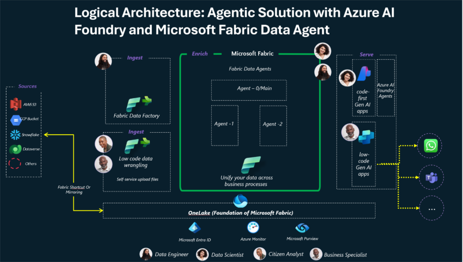
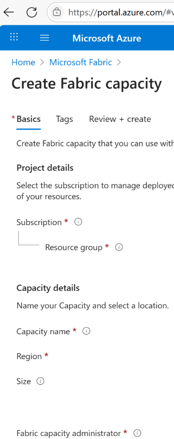
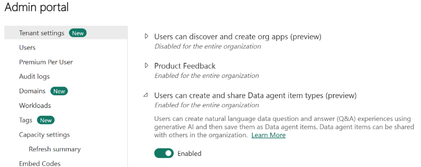
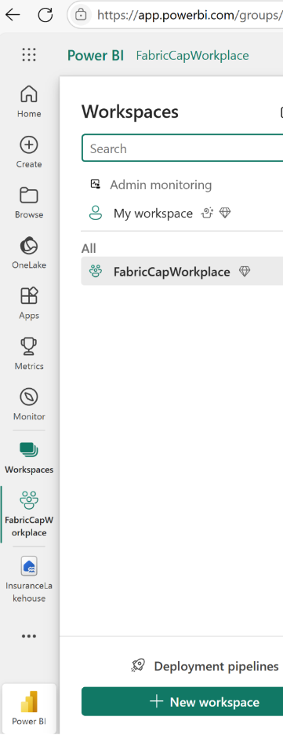
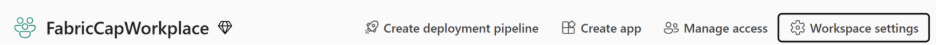
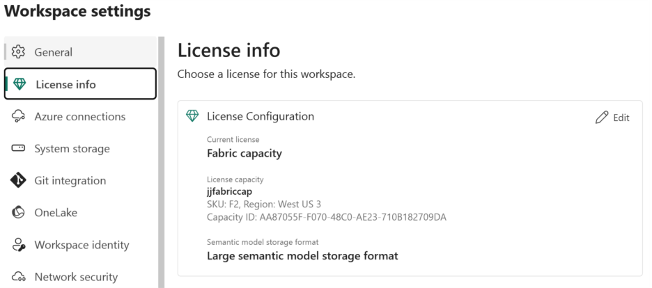
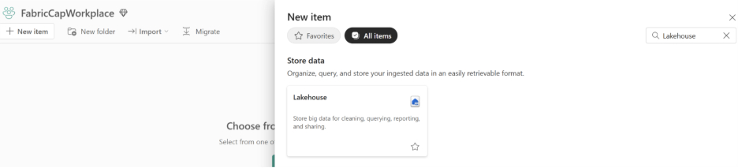
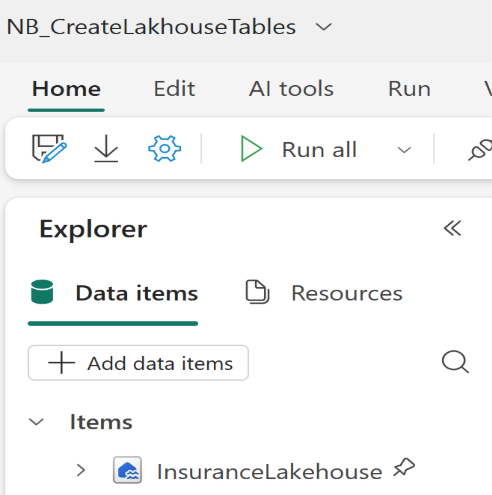

### 작성자 : [GISV-PSA-MSFT](https://techcommunity.microsoft.com/users/gisv-psa-msft/2507412)
### 원본 : [Explore Microsoft Fabric Data Agent & Azure AI Foundry for agentic solutions](https://techcommunity.microsoft.com/blog/analyticsonazure/explore-microsoft-fabric-data-agent--azure-ai-foundry-for-agentic-solutions/4453709)

이 블로그 포스트의 기여자: Jeet J & Ritaja S

## 배경 및 목표
지난 1년 동안 생성형 AI(Gen AI) 애플리케이션은 엔터프라이즈 전반에서 크게 확산되었습니다. 이제 에이전틱(agentic) AI 시대가 도래했으며, Microsoft 생태계는 이러한 에이전틱(agentic) AI 앱을 프로덕션 환경에서 엔드투엔드로 가속화할 수 있도록 지원합니다.
이 블로그에서는 로우코드(low-code) 비즈니스 분석가와 프로코드(pro-code) 개발자 모두가 Microsoft 스택을 활용해 조직에서 재사용 가능한 에이전틱(agentic) 앱을 구축하는 방법에 대해서 살펴봅니다.

Microsoft 생태계의 전문가들은 Microsoft AI Services와 Azure AI Foundry를 활용해 고급 에이전틱(agentic) 생성형 AI 솔루션을 개발하기 시작했습니다. Azure AI Foundry는 오픈소스 모델과 산업별 모델을 모두 지원합니다. 여기에 Microsoft Fabric의 발전이 더해지면서, 강력하고 산업 특화된 애플리케이션을 구현할 수 있게 되었습니다.
이번 블로그 포스트에서는 Azure AI Foundry, Copilot Studio, 그리고 Fabric을 사용해 다양한 산업에서 멀티 에이전트(multi-agent) 솔루션을 개발하는 방법을 설명합니다.

*면책 고지: 이 블로그 포스트는 교육 목적으로 작성되었으며, 최소한의 커스텀 코드로 관련 서비스를 활용하는 과정을 안내합니다. 프로덕션 배포 전에 반드시 엔지니어링 모범 사례(개발, 자동화된 배포, 테스트, 보안, 책임 있는 AI)를 준수해야 합니다.*

## 다루게 될 내용
**중점적으로 볼 내용**: 이 블로그의 목표는 특정 산업별 활용 사례를 살펴보고, 멀티 에이전트(multi-agent) 솔루션을 구축하는 개념을 이해하는데 있습니다. 이번 사례에서는 보험 및 금융 서비스를 중심으로, Fabric Notebooks를 사용해 샘플(가상의) 데이터셋을 생성하고, 클릭 기반의 간단한 워크플로우를 통해 **세 개의 에이전트(agent)** 를 빌드 및 구성합니다(각각 Fabric과 Azure AI Foundry에서). 이후 이들을 연결하고, 새로운 M365 Agents Toolkit을 활용해 Teams 또는 Microsoft Copilot을 통해 솔루션을 제공합니다.

**다루지 않는 내용**: 이 블로그 포스트에서는 Azure AI Services, Azure AI Foundry, 또는 Microsoft Fabric의 다양한 구성 요소에 대한 기본 개념은 다루지 않습니다. 또한, 에이전트를 빌드하는 다양한 방식(로우코드(low-code) 또는 프로코드(pro-code)), 에이전트 오케스트레이션을 위한 프레임워크(Semantic Kernel, LangChain, AutoGen 등), 또는 호스팅 옵션(Azure App Service – Web App, Azure Kubernetes Service, Azure Container Apps, Azure Functions)도 다루지 않습니다.

마지막에 핵심 포인트를 정리하였습니다. 미션 크리티컬(mission-critical) 생성형 AI 솔루션을 구축하고 배포하는 전체 과정을 이해하는데 도움이 될 것입니다.

Microsoft Fabric 데이터 에이전트와 Azure AI Foundry 에이전트를 활용한 멀티 에이전트(multi-agent) 솔루션의 **논리 아키텍처(Logical Architecture)**

## Fabric & Azure AI Foundry – 프로코드(pro-code) 에이전틱(agentic) 방법
### 사전 준비 사항
1. Azure 테넌트 및 구독에 대한 액세스 권한
2. Azure 테넌트 관리자와 협업하여, Azure 리소스(서비스) 프로비저닝 및 특정 지역에서 AI 모델을 배포할 수 있는 적절한 **Azure 역할(Role)** 과 **용량(Capacity)** 을 확보합니다.
3. [유료 F2 이상 Fabric 용량 리소스](https://learn.microsoft.com/en-us/fabric/fundamentals/copilot-fabric-overview#available-regions-for-azure-openai-service) - 참고: Fabric 컴퓨팅 용량은 일시 중지(Pause) 및 다시 시작(Resume)이 가능합니다. 학습이 완료되면, 일지 중지를 통하여 비용 절감을 도모하시기 바랍니다.

4. 이 설정을 활성화하려면 Fabric 관리자 포털의 [Power BI](https://app.powerbi.com/admin-portal/tenantSettings?experience=power-bi)로 이동하여, 다음의 설정들을 활성화 합니다.

- Fabric 데이터 에이전트(Fabric Data Agent) 테넌트 설정(**사용자가 데이터 에이전트 항목 형식을 만들고 공유할 수 있습니다(미리 보기)** ) 을 활성화합니다.

- Copilot 테넌트 스위치(Copilot tenant switch).
- 선택 사항: [AI에 대한 지역 간 처리](https://learn.microsoft.com/ko-kr/fabric/data-science/data-agent-tenant-settings) (해당 설정은 지역 및 데이터 주권 요건에 따라 달라집니다.)
- 선택 사항: [AI의 지리 간 저장](https://learn.microsoft.com/ko-kr/fabric/data-science/data-agent-tenant-settings) (해당 설정은 지역에 따라 달라집니다.)

5. 다음 중 하나 이상의 항목이 필요합니다:
    - Fabric Data Warehouse
    - Fabric Lakehouse
    - 하나 이상의 Power BI 시맨틱 모델(semantic model)
    - 데이터가 포함된 KQL 데이터베이스(KQL database)
    
    이번 블로그 포스트에서는 Fabric Notebooks를 사용해 예제 데이터셋을 생성하는 방법에 대해서 설명합니다.

6. Power BI 의미 체계 모델 데이터 원본을 위한 [XMLA 엔드포인트를 통해 Power BI 의미 체계 모델 통합 활성화](https://learn.microsoft.com/en-us/fabric/data-science/data-agent-tenant-settings)

자세한 내용은 [Microsoft Copilot Studio에서 패브릭 데이터 에이전트 사용(미리 보기)](https://learn.microsoft.com/ko-kr/fabric/data-science/data-agent-microsoft-copilot-studio)를 참고하시기 바랍니다.

## 단계별 안내 / 설정
1. Fabric 작업 영역 및 모든 에이전트에 대해서 1회 설정

    a) https://app.powerbi.com에 접속합니다."새 작업 영역" 버튼을 클릭해 새 작업 영역을 생성하고, 이름을 지정한 후 **프로비저닝한 Fabric 용량**에 연결되어 있는지 확인합니다.

    b) 새로 생성한 작업 영역의 "작업 영역 설정"를 클릭하세요.

    c) 라이선스 정보를 확인합니다.
    작업 영역이 새로 생성한 **Fabric 용량(Fabric Capacity)** 과 연결되어 있지 않다면, 올바르게 연결(작업 영역에 Fabric 용량을 링크)하고 5~10분 정도 대기하세요.

2. 보험 에이전트(Insurance Agent) 생성
    a) **Fabric 작업 영역**에서 새 레이크하우스(Lakehouse)를 생성하고, 이름을 InsuranceLakehouse로 변경합니다.

    

    b) 새로운 Fabric 노트북을 생성하고, 이름을 지정한 후 InsuranceLakehouse와 연결합니다.

    

    c) 다음 PySpark(Python) 코드 스니펫(code-snippet)을 노트북에 추가합니다.

        i) Fabric Notebook용 Faker 라이브러리
        ii) Fabric Notebook에서 보험 샘플 데이터셋(Insurance Sample Dataset)
        iii) 두 셀을 실행하여 샘플 보험 데이터셋을 생성합니다.

----------

- 2025년 9월 15일 업데이트 됨.
- 2025년 9월 16일 번역 함. (by [JYSEONG(MSFT)](https://techcommunity.microsoft.com/users/ji%20yong%20seong/219866) / [GitHub](https://github.com/jiyongseong))