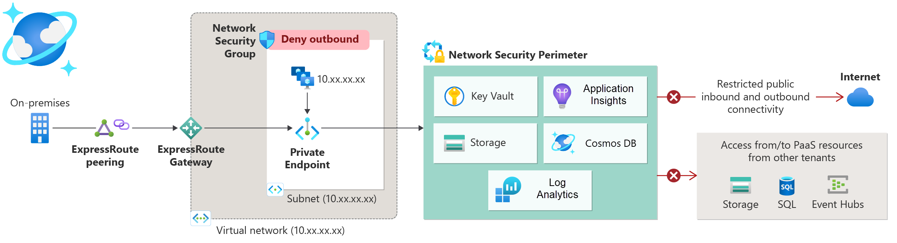

### 작성자 : [Mahesh_Sundaram](https://techcommunity.microsoft.com/users/mahesh_sundaram/1392664)
### 원본 : [General Availability of Azure Monitor Network Security Perimeter Features](https://techcommunity.microsoft.com/blog/azureobservabilityblog/general-availability-of-azure-monitor-network-security-perimeter-features/4440307)

Azure Monitor 네트워크 보안 경계(Network Security Perimeter) 기능이 이제 정식으로 지원됩니다!

이번 업데이트는 Azure Monitor 보안 측면에서 매우 중요한 진전으로, 모니터링 데이터에 대한 포괄적인 네트워크 격리(network isolation)를 제공합니다.
이번 블로그에서는 네트워크 보안 경계(Network Security Perimeter)가 무엇인지, 왜 중요한지, 그리고 Azure Monitor 사용자에게 어떤 장점이 제공되는지에 대해서 살펴봅니다.

네트워크 보안 경계는 네트워크 보안과 모니터링을 강화하기 위해 특별히 설계되었으며, 고객이 보다 안전하고 격리된 환경을 구축할 수 있도록 지원합니다.

기업의 관심이 증가함에 따라, 이 기능은 진화하는 보안 위협으로부터 Azure PaaS 리소스를 보호하는 데 핵심적인 역할을 할 것으로 보입니다.

# 네트워크 보안 경계(Network Security Perimeter)란 무엇이며, 왜 중요한가?

네트워크 보안 경계는 Azure PaaS 서비스를 위한 네트워크 격리(network isolation) 기능으로, 리소스를 둘러싼 신뢰할 수 있는 경계(trusted boundary)를 생성합니다. Azure Monitor의 핵심 구성 요소(예: Log Analytics 작업 영역(Log Analytics workspaces)과 Application Insights)는 고객 가상 네트워크 외부에서 실행되는데, 네트워크 보안 경계는 이러한 서비스가 명시적으로 정의된 경계 내에서만 통신하도록 하고, 승인되지 않은 공용 액세스는 차단합니다.

본질적으로 보안 경계는 Azure 서비스 수준에서 가상의 방화벽(virtual firewall) 역할을 합니다. 기본적으로 경계 내부 리소스에 대한 공용 네트워크 액세스를 제한하고, 사용자가 정의한 규칙을 충족하는 트래픽만 허용합니다. 이를 통해 원치 않는 네트워크 연결을 방지하고, 데이터 유출을 예방하여 민감한 모니터링 데이터가 사용자의 제어 범위 내에 유지되도록 합니다.

Azure Monitor 고객에게 네트워크 보안 경계는 혁신적인 기능입니다. 이 기능은 Azure 모니터링 플랫폼에서 "제로 트러스트(zero trust)" 네트워크 보안을 구현하려는 고객의 요건을 충족시킬 수 있습니다.

이전에는 프라이빗 링크(Private Link)를 사용해 가상 네트워크(VNet)에서 Azure Monitor로의 트래픽을 보호할 수 있었지만, Azure Monitor 자체 서비스 엔드포인트는 여전히 공용 인터넷을 통해 접근 가능했습니다. 

보안 경계는 Azure 측에서 네트워크 제어를 적용함으로써 이 격차를 해소합니다. 즉, Log Analytics 작업 영역이나 Application Insights가 특정 소스(예: 특정 IP 범위 또는 동일한 경계 내의 다른 리소스)에서만 데이터를 수신하고, 승인된 대상에게만 데이터를 전송하도록 제한할 수 있습니다. 규칙 외부에서 누군가가 모니터링 리소스에 접근하려고 하면, 네트워크 보안 경계는 이를 차단하고 감사(auditing)를 위해 시도를 기록합니다.

요약하면, 네트워크 보안 경계는 Azure Monitor에 새로운 수준의 보안을 제공합니다. 조직이 모니터링 리소스를 둘러싼 논리적 네트워크 경계(logical network boundary)를 생성할 수 있게 하며, 이는 마치 고립된 영역과 같다고 할 수 있습니다. 

특히 금융, 정부, 의료 등 규제가 엄격한 산업에서 네트워크 격리 정책을 준수해야 하는 고객에게 매우 중요합니다. 보안 경계를 사용하면, 공용 노출이 전혀 없고 네트워크 접근에 대한 철저한 감사가 요구되는 환경에서도 Azure Monitor를 안전하게 배포할 수 있습니다. 이는 Azure Monitor의 보안 태세를 강화하고, 기업의 제로 트러스트 네트워킹 원칙과 일치시킬 수 있습니다.

# 주요 장점

- 🔒 **강화된 보안 및 데이터 보호**

    경계(perimeter) 내의 Azure PaaS 리소스는 서로 자유롭게 통신할 수 있지만, 외부 접근은 기본적으로 차단됩니다. 허용할 공용 트래픽에 대해서는 명시적인 인바운드/아웃바운드 규칙을 정의할 수 있어, Log Analytics 작업 영역, Application Insights 구성 요소 또는 기타 경계 내 리소스에 대한 무단 네트워크 접근을 방지합니다. 이를 통해 데이터 유출과 모니터링 데이터에 대한 무단 접근 위험을 크게 줄일 수 있습니다.

- ⚖️ **세분화된 접근 제어**

    네트워크 보안 경계는 세밀한 규칙을 지원하여 접근을 맞춤화할 수 있습니다. 특정 IP 주소 범위나 Azure 구독 ID를 통해 인바운드 접근을 허용하고, 특정 FQDN(Fully Qualified Domain Names)으로의 아웃바운드 호출을 허용할 수 있습니다. 예를 들어, 회사의 IP 범위에서만 작업 영역으로 원격 분석 데이터를 전송하도록 하거나, 작업 영역이 오직 contoso-api.azurewebsites.net으로만 데이터를 전송하도록 설정할 수 있습니다. 이러한 제어 수준은 신뢰할 수 있는 소스와 대상만 사용되도록 보장합니다.

- 📜 **포괄적인 로깅 및 감사**

    네트워크 보안 경계에서 허용되거나 거부된 모든 연결은 로깅할 수 있습니다. Azure Monitor의 네트워크 보안 경계 통합 기능은 경계 내 모든 리소스에 대한 통합 액세스 로그를 제공합니다. 이 로그는 어떤 연결이 어디서 시도되었고 허용되었는지 또는 차단되었는지를 명확히 보여주며, 감사 및 규정 준수에 매우 유용합니다. 예를 들어, 외부 IP가 작업 영역에 접근하지 않았음을 증명하거나 예상치 못한 아웃바운드 호출을 탐지할 수 있습니다. 로그는 Log Analytics 작업 영역이나 스토리지로 전송해 보관 및 분석할 수 있습니다.

- 🔧 **Azure Monitor 서비스와의 원활한 통합**

    네트워크 보안 경계는 Azure Monitor의 서비스 및 워크플로우 전반에 기본적으로 통합되어 있습니다. Log Analytics 작업 영역과 Application Insights 구성 요소는 네트워크 보안 경계를 기본 지원하며, 데이터 수집, 쿼리, 알림 모두가 경계 규칙을 자동으로 적용합니다. Azure Monitor 알림(Azure Monitor Alerts)과 작업 그룹(Action Groups)도 네트워크 보안 경계와 연동되므로, Event Hub로 알림을 보낼 때도 경계 규칙을 준수합니다. 이러한 전체 통합은 보안 경계를 적용해도 기존 기능이 깨지지 않고, 정의된 보안 경계 내에서 모든 기능이 정상 작동함을 보장합니다.

- 🤝 **일관되고 중앙 집중화된 관리**
    
    네트워크 보안 경계는 여러 리소스의 네트워크 접근을 관리하는 표준화된 방법을 제공합니다. 서로 다른 서비스(심지어 다른 구독의 리소스)에서 리소스를 하나의 경계로 그룹화하고, 네트워크 규칙을 한 곳에서 관리할 수 있습니다. 이 "단일 창(Single Pane of Glass)" 접근 방식은 운영을 단순화하며, 네트워크 관리자가 한 번 경계를 정의하면 모든 관련 Azure Monitor 구성 요소(및 기타 지원 서비스)에 적용할 수 있습니다. 이는 각 서비스에서 개별 방화벽 설정을 유지하는 것보다 훨씬 더 확장 가능하고 일관된 방법입니다. 네트워크 보안 경계는 Azure의 표준 API와 포털 환경을 사용하므로, 경계와 규칙 설정이 간단합니다.

- 🌐 **프라이빗 링크(Private Link)와 함께하는 완전한 격리**

    네트워크 보안 경계는 기존 네트워크 보안 옵션을 보완합니다. 이미 Azure 프라이빗 링크를 사용해 인터넷을 통한 트래픽을 차단하고 있다면, 네트워크 보안 경계는 추가적인 보호 계층을 제공합니다. 프라이빗 링크는 VNet과 Azure Monitor 간의 트래픽을 보호하고, 네트워크 보안 경계는 Azure Monitor의 서비스 엔드포인트 자체를 보호합니다. 두 기능을 함께 사용하면 심층 방어(defense-in-depth)를 구현할 수 있습니다. 예를 들어, 작업 영역은 프라이빗 엔드포인트를 통해서만 접근 가능하고, 네트워크 보안 경계 규칙에 따라 특정 소스에서만 데이터를 수신하도록 설정할 수 있습니다. 이러한 계층적 접근 방식은 가장 엄격한 보안 요구 사항도 충족하는 데 도움이 됩니다.

결론적으로, Azure Monitor의 네트워크 보안 경계는 강력한 네트워크 격리, 유연한 제어, 그리고 가시성을 제공하며, 이 모든 기능이 Azure 플랫폼에 통합되어 있습니다. 이를 통해 조직은 네트워크 접근을 철저히 제한하고 규정 준수를 단순화해야 하는 시나리오에서도 Azure Monitor를 안심하고 사용할 수 있습니다.

Azure Monitor를 네트워크 보안 경계와 함께 구성하는 방법에 대한 자세한 내용은 다음 링크를 참고하세요: [Configure Azure Monitor with Network Security Perimeter](https://learn.microsoft.com/en-us/azure/azure-monitor/essentials/network-security-perimeter).

----------

- 2025년 8월 6일 업데이트 됨.
- 2025년 9월 17일 번역 함. (by [JYSEONG(MSFT)](https://techcommunity.microsoft.com/users/ji%20yong%20seong/219866) / [GitHub](https://github.com/jiyongseong))