### 작성자 : [shahparth](https://techcommunity.microsoft.com/users/shahparth/1051277)
### 원본 : [Announcing Parse & Chunk with Metadata in Logic Apps: Build Context-Aware RAG Agents](https://techcommunity.microsoft.com/blog/integrationsonazureblog/announcing-parse--chunk-with-metadata-in-logic-apps-build-context-aware-rag-agen/4458438)

새로운 **Parse document with metadata**와 **Chunk text with metadata** 기능은 Logic Apps에서 문서를 처리하는 방식을 크게 개선합니다. 기존의 파싱 및 청크 기능과 달리, 이번 업데이트는 텍스트와 함께 풍부한 메타데이터를 제공합니다:

- **pageNumber** — 청크가 추출된 페이지 번호
- **totalPages** — 문서의 전체 페이지 수
- **sentencesAreComplete** — 청크가 문장 중간에서 끊기지 않고 완전한 문장으로 끝나도록 보장

즉, 단순히 텍스트만 얻는 것이 아니라, 인용(citation), 탐색, 후속 처리에 필요한 컨텍스트도 함께 얻을 수 있습니다. 또한 이러한 메타데이터를 기반으로 청크 전략을 조정할 수도 있습니다.

문서를 파싱하고 메타데이터와 함께 청크 처리한 후에는, Azure AI Search에 문서를 임베딩하고 인덱싱할 수 있습니다. 이후 Logic Apps에서 **Agent Loop**를 사용해 **Vector Search as a Tool**을 호출하면 페이지 단위로 정확한 참조를 포함해 질문에 답변할 수 있습니다.

이번 블로그에서는 두 개의 기업 계약서(마스터 서비스 계약서와 구매 계약서)를 인덱싱하고, Agent Loop를 활용해 자연어 질문에 인용을 포함해 답변하는 시나리오에 대해서 살펴보게 됩니다.

## 사전 준비 

- Azure Blob Storage – 문서를 저장하기 위한 스토리지
- Azure AI Search – 인덱스가 설정된 상태
- Azure OpenAI 배포 – 임베딩(embeddings) + 챗 모델(chat model) 포함
- Logic App (Standard) – 새로운 AI 액션이 적용된 버전

GitHub에서 제공되는 [샘플 데모](https://github.com/Azure/logicapps/tree/shahparth-lab-patch-1/ws-vscode)를 설정해 따라 할 수 있습니다.

## 1단계: 데이터 수집(Ingestion Flow)
**목표:** 원본 PDF를 문장 단위로 나눈 청크(Chunk)로 변환하고, 메타데이터를 추가한 뒤 인덱싱합니다.

📸 *워크플로우 개요*

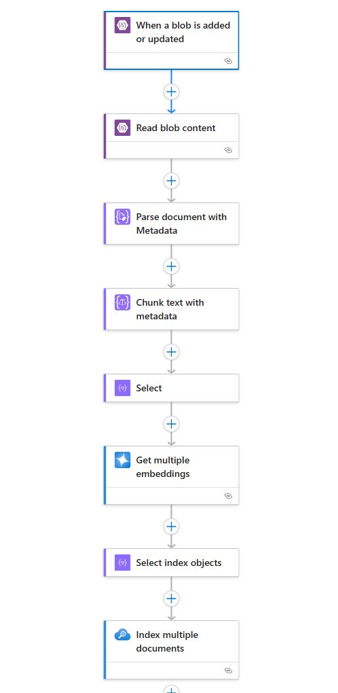

- Blob이 추가되거나 수정될 때 (계약서가 들어 있는 컨테이너에서)

    📸 *Blob 트리거(Blob Trigger)*

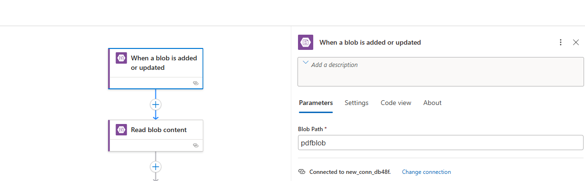

- Blob 콘텐츠 읽기

    📸 *Blob 콘텐츠 읽기 액션(Read blob content action)*

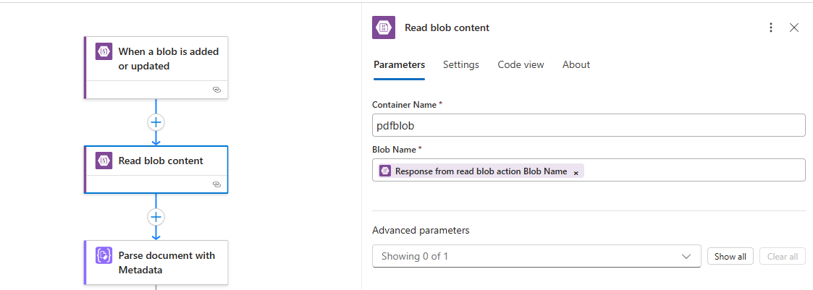

- 메타데이터와 함께 문서 파싱
    - 입력: 이전 단계에서 가져온 파일 콘텐츠
    
        📸 *메타데이터 기반 문서 파싱 액션(Parse document with metadata action)*

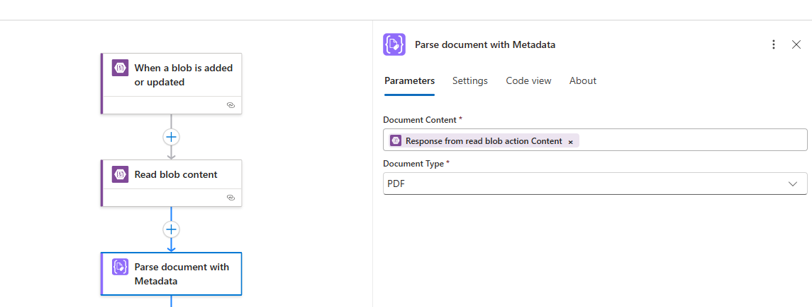

- 메타데이터와 함께 텍스트 청크 처리
    - 입력: 이전 단계에서 파싱된 전체 텍스트 항목 배열

        📸 *메타데이터 기반 텍스트 청크 액션(Chunk text with metadata action)*

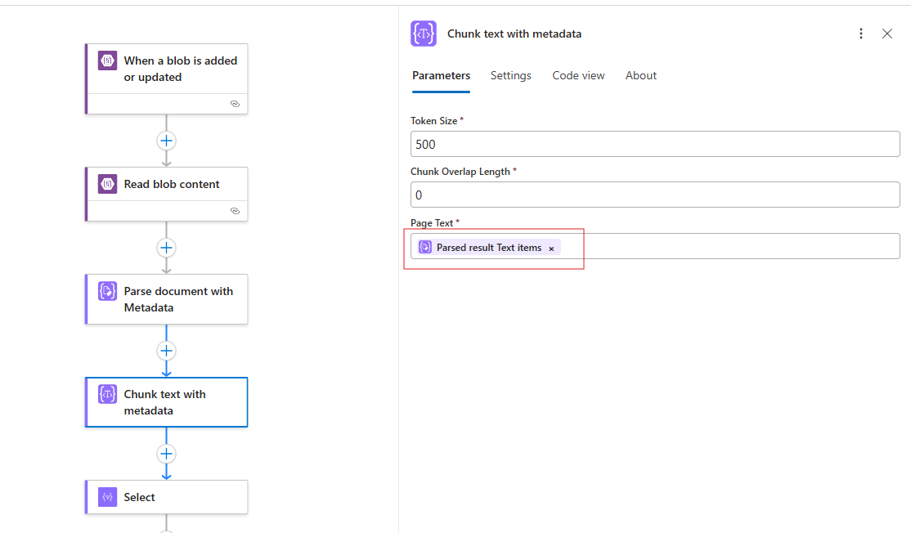

- 다중 임베딩 생성
    - 입력: 임베딩 모델과 벡터 표현을 생성할 텍스트 청크들

        📸 *다중 임베딩 생성 액션(Get multiple embeddings action)*

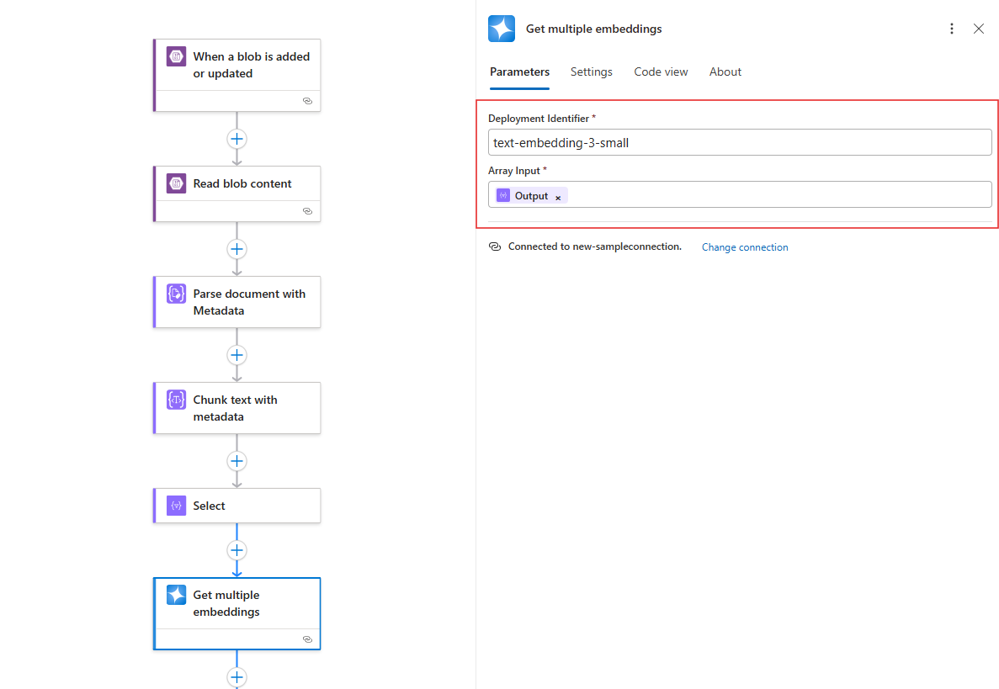

- 인덱스 객체 선택
    - 입력: 인덱스로 전달할 원시 텍스트 콘텐츠, 임베딩, 문서 이름(documentName), 고유 ID(uniqueID)

        📸 *배열 선택 액션(Select array action)*

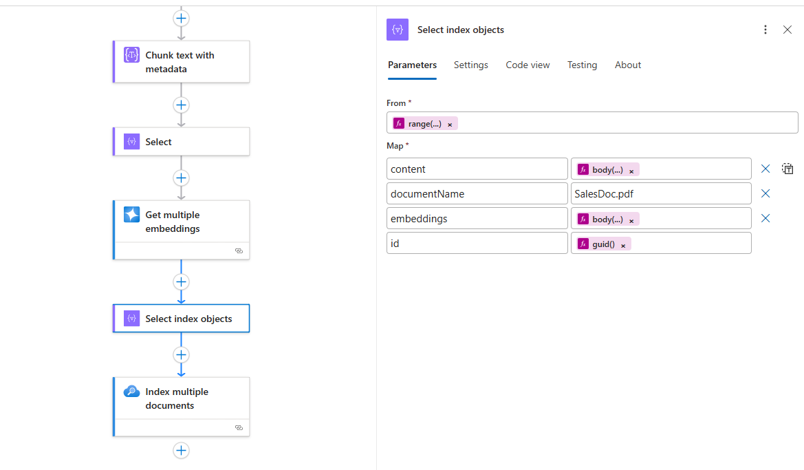

- 여러 문서 인덱싱
    - 입력: 이전 단계(Select)에서 출력된 배열 객체(Array object)

        📸 *문서 인덱싱 액션(Index documents action)*

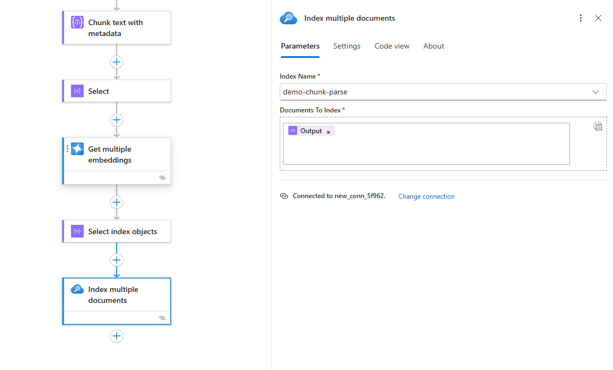

## 2단계: 벡터 검색(Vector Search)을 도구로 활용한 에이전트 플로우
**목표:** 인덱싱된 계약서를 기반으로, 에이전트가 자연어 질문에 답변할 수 있도록 합니다.

- 대화형 워크플로우 생성(Conversational workflow creation): 포털에서 새로운 대화형 워크플로우 유형을 생성합니다.
    
    📸 *대화형 플로우 생성 화면*

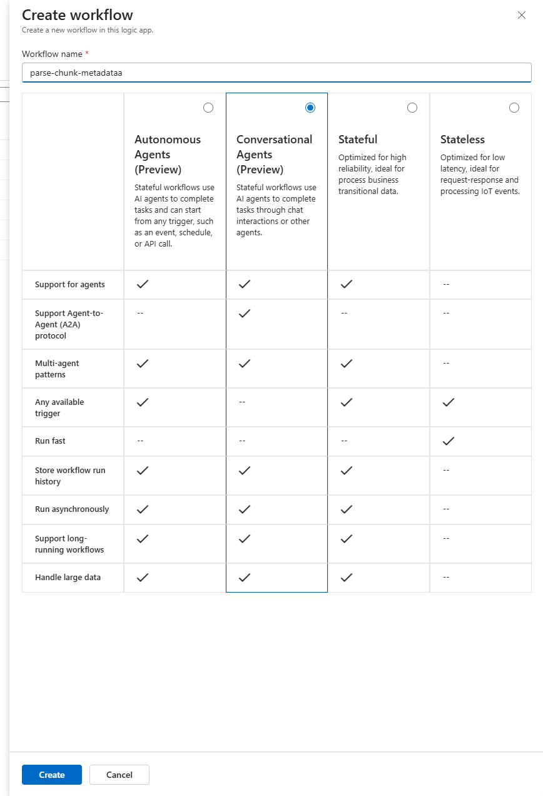

- 에이전트 액션 (Agent action)

    - 모델: gpt-4.1 (참고: gpt-4 또는 gpt-4o 대신 이 모델을 사용하세요)
    - 시스템 지침(System instructions):
```
You are a helpful assistant, answering questions about specific documents. When a question is asked, follow these steps in order: 
Use the agent parameter body prompt to pass in the user's questions to the Document search tool. Use this tool to do a vector search of the user's question, the output of the vector search tool will have the related information to answer the question. The output will be in the form of a json array. Each array object will have a "content" property, use the "content" property to generate an answer. Use only information to answer the user's question and cite the source using the page number you found it on. No other data or information should be used to answer the question.
```

💡 가장 멋진 기능 중 하나는 Agent Parameter를 생성할 수 있다는 점입니다. 이 파라미터는 채팅 입력을 자동으로 도구 호출에 전달합니다.
이 경우, body prompt 파라미터가 사용자의 질문을 그대로 도구로 전달합니다.

💡 또 다른 멋진 기능은 도구의 응답이 콘텐츠로 돌아오면, 에이전트가 이를 자동으로 추출한다는 점입니다. 추가 표현식이 필요 없습니다. 선언적이고 매우 간단합니다.


📸 *Agent action 화면*

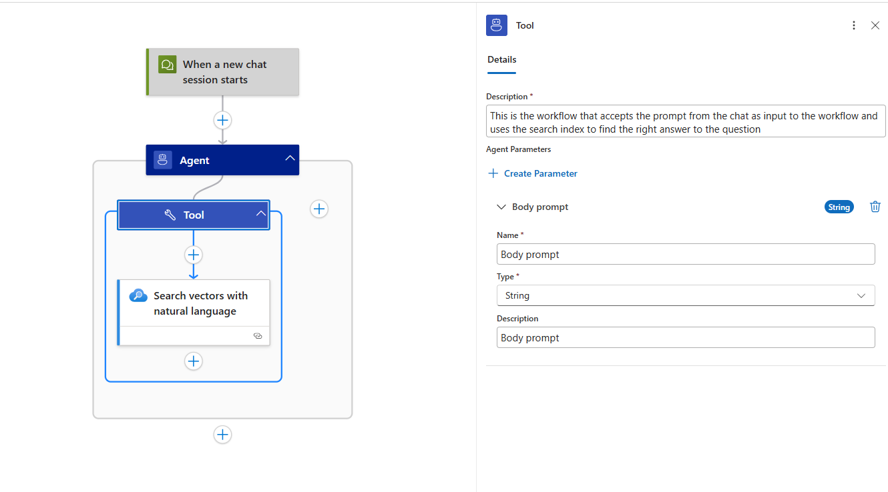

- 도구: 자연어 기반 벡터 검색

    - 입력 인덱스 이름(Input index name): AI Search 인덱스의 이름
    - 검색 텍스트(Search text): 프롬프트에서 전달된 쿼리를 포함하는 Body prompt 파라미터
    - 최근접 이웃(Nearest neighbors): 반환할 매치 개수
    
    📸 *도구: 벡터 검색 액션(Search vector action)*


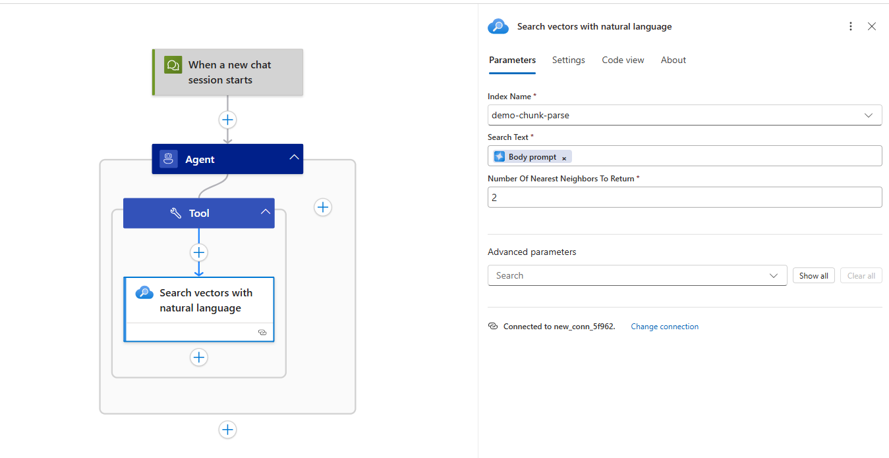

## 3단계: 직접 실행해보기 (예시: End-to-End)

**인덱싱(Indexing)**은 스토리지 컨테이너에 파일이 추가될 때마다 자동으로 수행됩니다.

**스토리지 트리거(Storage trigger)**가 실행되면, 문서를 읽히고, 파싱하고, 청크 처리되고, 임베딩된 후 AI Search에 인덱싱됩니다.

전체 과정은 Logic App의 실행 기록에서 확인할 수 있으며, Parse와 Chunk 출력에는 pageNumber, totalPages, sentencesAreComplete 값이 명확히 표시됩니다.

📸 *스크린샷: Parse/Chunk 메타데이터 출력이 포함된 인덱싱 플로우 실행 기록*

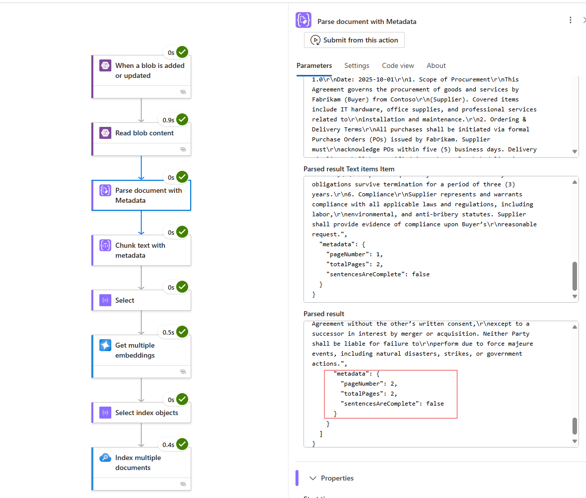

이제 **Chat** 환경을 사용하여 검색 플로우를 검증해봅시다.
예시 질문: *"표준 결제 일정(Standard payment timeline)은 무엇인가요?"*

📸 *답변*

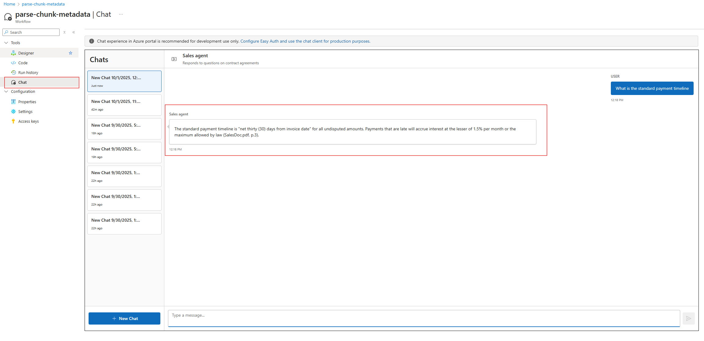

답변에는 페이지 번호 인용과 함께 상세한 정보가 포함되어 있으며, 이는 메타데이터 정보를 제공하는 새로운 액션을 활용한 결과입니다.

📸 *에이전트 실행 기록 보기*

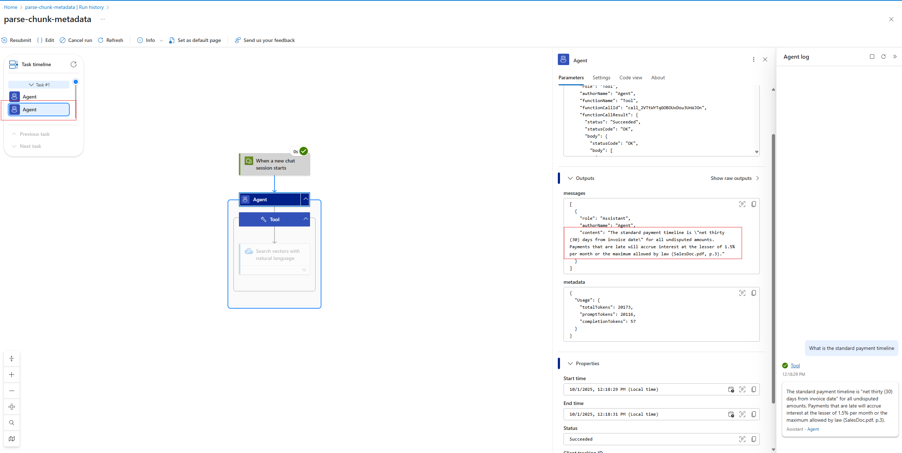

에이전트가 입력과 출력으로 어떤 경로를 따라갔는지 추적할 수도 있습니다. 이를 통해 디버깅을 간소화하고 에이전트가 안정적으로 응답하도록 보장할 수 있습니다.

## 결론
Parse & Chunk with Metadata를 사용하면 단순히 텍스트를 나누는 것에 그치지 않습니다. 페이지 번호, 전체 페이지 수, 문장 완결 여부 같은 정보를 함께 제공하여 신뢰할 수 있고 인용하기 쉬운 답변을 만들 수 있습니다.

여기에 Agent Loop + Vector Search as a Tool을 결합하면, 단 몇 단계만으로 프로덕션 수준의 계약서 Q&A를 구현할 수 있습니다.

----------

- 2025년 10월 2일 업데이트 됨.
- 2025년 10월 3일 번역 함. (by [JYSEONG(MSFT)](https://techcommunity.microsoft.com/users/ji%20yong%20seong/219866) / [GitHub](https://github.com/jiyongseong))