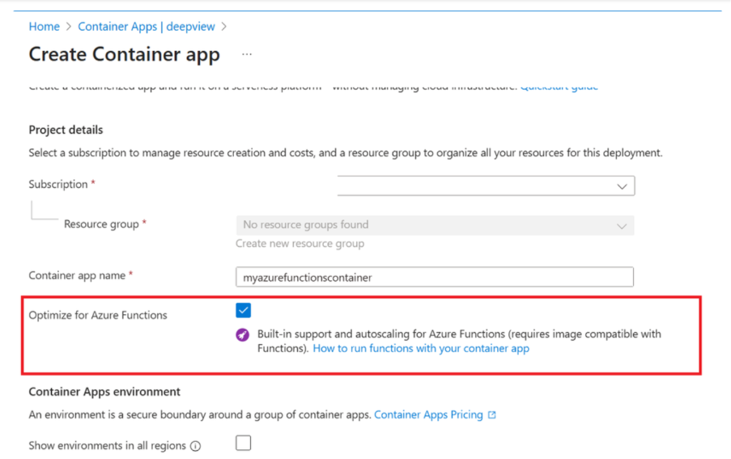
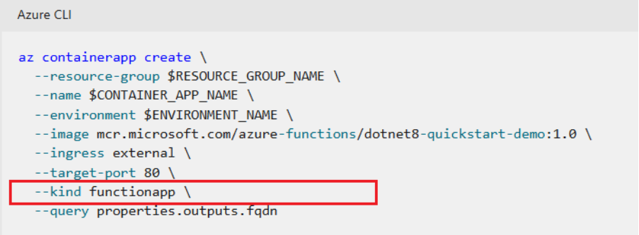

### 작성자 : [DeepGanguly](https://techcommunity.microsoft.com/users/deepganguly/3177848)
### 원본 : [Transition to Azure Functions V2 on Azure Container Apps](https://techcommunity.microsoft.com/blog/appsonazureblog/transition-to-azure-functions-v2-on-azure-container-apps/4457258)

## 개요
Azure Container Apps에서 Azure Functions를 사용하면 유연하고 확장 가능한 컨테이너 환경에서 서버리스 함수를 실행할 수 있습니다.
플랫폼이 발전함에 따라, Azure Container App으로 함수 프로그래밍 모델 이미지는 두 가지 방식으로 배포가 가능합니다:

- Functions V1 (기존 Microsoft.Web RP 모델)
- Functions V2 (새로운 Microsoft.App RP 모델)

(당연한 얘기겠지만) V2는 최신 모델이며, Azure Container Apps에서 Functions를 호스팅하는 데 권장되는 방식입니다.
이번 블로그에서는 두 접근 방식의 차이점과 V2 모델로 전환하는 방법에 대해서 살펴보게 됩니다.

## V1 제한 사항 (레거시 방식)
Function App 배포는 기능과 경험이 제한적이므로 V2로 전환하는 것이 권장됩니다. 아래는 V1의 주요 제한 사항입니다.

**기능 제한**
- 네이티브 컨테이너 앱 기능(멀티 리비전, 간편 인증, 상태 점검, 사용자 지정 도메인, 스케일 설정, 컨테이너 앱 시크릿, 사이드카 컨테이너 등)을 지원하지 않습니다.

**문제 해결 제한**

- 컨테이너 직접 접근 및 실시간 로그 보기 기능이 지원되지 않습니다.
- 콘솔 접근과 실시간 로그 출력은 시스템이 생성한 컨테이너 설정으로 인해 제한됩니다.
- low-level 진단은 Log Analytics를 통해 가능하며, 애플리케이션 수준 로그는 Application Insights에서 확인할 수 있습니다.

**DAPR 통합 문제**

- .NET 격리 함수와 DAPR 간 호환성 문제 발생 가능, 특히 빌드 과정에서 종속성 충돌로 인해 문제가 생길 수 있습니다.

## Functions V2 (개선됨 + 권장되는 방식)
--kind=functionapp를 지정해 Microsoft.App RP로 배포하면, 컨테이너 앱 기반의 Azure Functions V2 방식으로 배포됩니다.

*내부적으로 리소스 관리 간소화:* V1 모델처럼 프록시 Function App을 사용하는 대신, V2는 네이티브 Azure Container App 리소스를 직접 프로비저닝합니다.
이 변화로 프록시와 컨테이너 앱을 모두 관리해야 했던 이중 리소스 관리가 필요 없어지고, 모든 작업을 단일 독립 리소스로 통합해 운영을 단순화합니다.

*풍부한 기능과 완전한 네이티브 지원:* V2는 Azure Functions 프로그래밍 모델로 배포된 이미지에 대해 Azure Container Apps의 네이티브 기능을 제공합니다. 주요 기능은 다음과 같습니다:

- [멀티 리비전 관리](https://learn.microsoft.com/en-us/azure/container-apps/revisions-manage) 및 트래픽 분할
- [간편 인증(Easy Auth)](https://learn.microsoft.com/en-us/azure/container-apps/authentication)
- 프라이빗 엔드포인트 지원
- [메트릭](https://learn.microsoft.com/en-us/azure/container-apps/metrics) 및 [알림](https://learn.microsoft.com/en-us/azure/container-apps/alerts)
- [Azure Pipelines](https://learn.microsoft.com/en-us/azure/container-apps/azure-pipelines) 및 [GitHub Actions](https://learn.microsoft.com/en-us/azure/container-apps/github-actions)을 통한 CI/CD
- [상태 점검(Health probes)(https://learn.microsoft.com/en-us/azure/container-apps/health-probes)
- [사용자 지정 도메인 및 관리형 인증서](https://learn.microsoft.com/en-us/azure/container-apps/custom-domains-managed-certificates)
- [스케일 설정](https://learn.microsoft.com/en-us/azure/container-apps/scale-app)에서 폴링 간격과 쿨다운 간격 설정하기
- [컨테이너 앱 시크릿](https://learn.microsoft.com/en-us/azure/container-apps/manage-secrets) 사용
- [사이드카 컨테이너](https://learn.microsoft.com/en-us/azure/container-apps/containers) 사용

V2는 기능과 경험 면에서 큰 개선을 제공하므로, 기존 V1 배포에서 V2로 전환하는 것을 권장합니다.

## 레거시 직접 Function 이미지 배포 방식
일부 고객은 kind=functionapp을 지정하지 않고 Microsoft.App 리소스 공급자를 사용해 Function 이미지를 표준 컨테이너 앱으로 배포하고 있습니다.
이 방식은 네이티브 컨테이너 앱 기능에 접근할 수 있지만, 다음과 같은 주요 제한 사항이 있습니다:

- 공식적으로 지원되지 않습니다.
- 자동 스케일 규칙이 없으며, 수동 설정이 필요합니다.
- 새로운 V2 기능(예: 함수 목록, 함수 키, 호출 횟수)에 접근할 수 없습니다.

권장 사항:
경험과 기능이 크게 개선된 Functions on Container Apps V2로 전환하는 것을 권장합니다.

## Azure Container Apps에서 Functions V2로 전환하기 위한 체크리스트
전환 가이드는 다음과 같습니다.

1. 준비 단계

    - 현재 배포 상태 확인: Azure Container Apps에서 Functions V1(Web RP)을 실행 중인지 확인합니다.
    - 컨테이너 이미지 확인: V1 배포에 사용된 컨테이너 이미지에 접근할 수 있는지 확인합니다.
    - 설정 문서화: 기존 앱의 모든 환경 변수, 시크릿, 스토리지 계정 연결, 네트워크 설정을 기록합니다.
    - Azure Container Apps 환경 할당량 확인: 메모리, CPU, 인스턴스 제한을 검토하고 필요 시 할당량 증가를 요청합니다.

2. 새로운 V2 앱 생성

    - kind=functionapp으로 새 컨테이너 앱을 생성합니다.

        - Azure Portal에서 "Optimize for Functions app" 옵션을 사용
        - 또는 CLI(az functionapp create)를 사용해 기존 컨테이너 이미지를 지정
        - 자세한 가이드는 [Azure Container Apps에서 Azure Functions 사용](https://learn.microsoft.com/ko-kr/azure/container-apps/functions-usage?pivots=azure-portal) 참고

- 코드 변경은 필요 없습니다: V1에서 사용한 동일한 컨테이너 이미지를 그대로 사용할 수 있으며, Functions 코드를 수정하거나 이미지를 다시 빌드할 필요가 없습니다.
- 구성 복제: 이전 배포에서 사용한 모든 환경 변수, 시크릿, 설정을 적용하세요.

3. 검증(Validation)

- 함수 트리거 테스트: 모든 트리거(HTTP, Event Hub, Service Bus 등)가 예상대로 동작하는지 확인합니다.
- 통합 테스트: 데이터베이스, 스토리지 및 기타 Azure 서비스와의 연결을 확인합니다.

4. DNS 및 사용자 지정 도메인 업데이트(선택 사항)

    - DNS 이름 검토: 신규 V2 앱은 기존 V1 앱과 다른 기본 DNS 이름을 사용합니다.
    - 사용자 지정 도메인 업데이트:

        - 사용자 지정 도메인(예: api.yourcompany.com)을 사용하는 경우, DNS 레코드(CNAME 또는 A 레코드)를 신규 V2 앱의 엔드포인트로 업데이트합니다.
        - 필요 시 SSL/TLS 인증서를 다시 바인딩하거나 갱신합니다.

    - 사용자 및 이해관계자에게 알림: DNS 또는 엔드포인트 변경 사항을 앱에 접근하는 모든 사용자에게 알립니다.
    - 엔드포인트 테스트: 새로운 DNS 또는 사용자 지정 도메인이 V2 앱으로 트래픽을 올바르게 라우팅하는지 확인합니다.

5. 전환(Cutover)

    - 운영계 트래픽 전환: 검증이 완료되면 DNS, 엔드포인트 또는 라우팅을 업데이트해 트래픽을 신규 V2 앱으로 전환합니다.
    - 이슈 모니터링: 새 배포에서 오류, 지연, 스케일링 이상을 면밀히 모니터링합니다.
    - 이해관계자와 소통: 팀과 사용자에게 전환 및 예상되는 변경 사항을 알립니다.

6. 정리(Cleanup)

    - 기존 V1 앱 제거: 중복과 불필요한 비용을 방지하기 위해 이전 V1 배포를 삭제합니다.
    - 문서 업데이트: 새 배포의 세부 사항, 구성, 그리고 배운 점을 기록합니다.

## 피드백 및 지원
개발팀은 Functions on Container Apps V2를 지속적으로 개선하고 있으며, 여러분의 의견을 환영합니다.

- 피드백 공유: 잘 작동하는 부분과 개선이 필요한 부분을 알려주세요.
- 이슈 또는 기능 요청 제출: https://github.com/Azure/azure-container-apps
- 지원 채널:

    - 기술 지원은 [지원 포털](https://support.microsoft.com)을 이용하세요.
    - 팀과 소통하려면 https://github.com/discussions 또는 https://azure.microsoft.com/community 를 활용하세요.
    - 엔터프라이즈 관련 안내는 Microsoft 계정 팀에 문의하세요.

여러분의 피드백은 컨테이너 기반 서버리스의 미래를 만드는 데 큰 도움이 됩니다. 함께해 주셔서 감사합니다!

----------

- 2025년 10월 14일 업데이트 됨.
- 2025년 10월 15일 번역 함. (by [JYSEONG(MSFT)](https://techcommunity.microsoft.com/users/ji%20yong%20seong/219866) / [GitHub](https://github.com/jiyongseong))