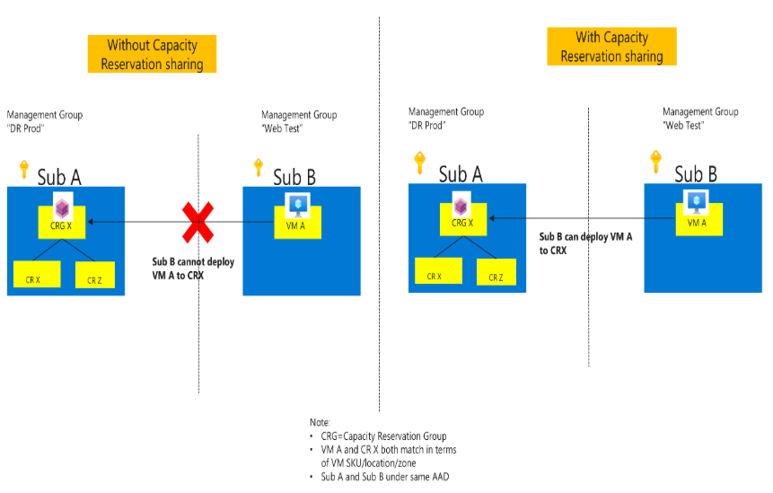
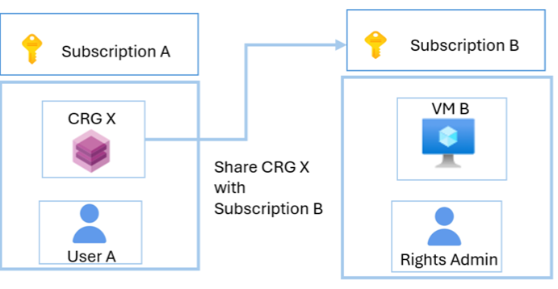
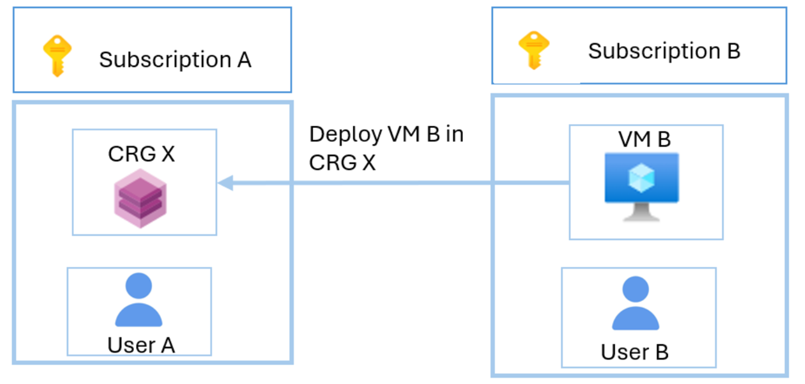

### 작성자 : [Tarannum91](https://techcommunity.microsoft.com/users/tarannum91/2386214)
### 원본 : [Public Preview for Sharing Capacity Reservation Groups - now available](https://techcommunity.microsoft.com/blog/azurecompute/public-preview-for-sharing-capacity-reservation-groups---now-available/4461834)

용량 예약 그룹(CRG)을 구독 간에 공유할 수 있는 기능이 이제 공개 프리뷰로 제공됩니다.

이전에는 고객이 동일한 구독 내에서만 용량 예약 그룹에 VM을 배포할 수 있었습니다. 이제는 **온디맨드 용량 예약 그룹(CRG)** 을 다른 구독과 공유할 수 있습니다. 이 옵션을 사용하면 리소스 재사용, 중앙 집중식 용량 관리, 비용 효율적인 확장, 보안과 용량 관리의 분리 등 일반적인 구성 요구 사항을 더 쉽게 관리할 수 있습니다.
예를 들어, 리소스 재사용 시나리오에서 고객은 현재 재해 복구(DR) 용량 예약 그룹을 다른 구독에서 개발 테스트 용도로 사용할 수 없습니다. 그러나 공유 기능을 통해 고객은 해당 용량 예약 그룹을 운영환경이 아닌 워크로드에 재활용할 수 있게 됩니다.

**사용자 경험:**

예약된 용량을 공유하려면 최소 두 개의 구독이 필요합니다:

1. 제공자 구독(Provider subscription): 용량 예약 그룹(CRG)과 해당 멤버 용량 예약을 생성하고 호스팅하는 구독
2. 소비자 구독(Consumer subscription): 예약된 용량에 대한 액세스 권한을 부여받아, SLA(서비스 수준 계약)에 따라 가상 머신(VM)을 배포할 수 있는 구독

배포되는 VM은 SKU, 위치, (해당되는 경우)가용성 영역에서 용량 예약 그룹의 예약 중 하나와 일치해야 합니다.

예를 들면,
이 예시에서 구독 A는 제공자 역할을 하고, 구독 B는 소비자 역할을 합니다.

- 1단계: CRG X 공유 설정
- 구독 B의 권한 관리자는 사용자 A에게 CRG를 공유할 수 있는 권한을 부여해야 합니다.
- 사용자 A(CRG 소유자)는 CRG X의 공유 설정을 업데이트하여 구독 B를 추가합니다. 용량 예약 그룹은 최대 100개의 소비자 구독에게 공유할 수 있습니다.

- 2단계: 사용자에게 CRG X 접근 권한 부여
- 구독 A의 권한 관리자는 사용자 B(VM 소유자)에게 CRG X에 대한 읽기 및 배포 권한을 부여해야 합니다.
- 설정이 완료되면, 사용자 B는 가상 머신(VM) 또는 가상 머신 스케일 세트(VMSS)에 capacityReservationGroup 속성을 지정하여 VM을 배포할 수 있습니다.

**미리보기(공개)의 제약 사항:**
- 포털은 지원되지 않습니다. 대신 API 및 기타 Azure 클라이언트를 사용할 수 있습니다.
- 공유된 용량 예약 그룹을 사용하는 VMSS VM은 존 장애(zone outage)가 발생했을 때 다시 배포할 수 없습니다.

시작을 위한 리소스: https://aka.ms/computereservationsharing

또한 샘플 코드를 포함한 https://aka.ms/computereservationsharing 링크를 참고하시기 바랍니다.

배경

Azure 가상 머신을 실행하는 데 필요한 컴퓨팅 용량을 배포하고 관리할 수 있도록 온디맨드 용량 예약 기능이 제공됩니다.
이 기능을 사용하면 IT 조직이 VM 크기에 맞는 컴퓨팅 용량을 예약할 수 있습니다. 예약 기간은 원하는 만큼 설정할 수 있으며, Azure의 모든 퍼블릭 리전과 가용성 영역에서 대부분의 VM 시리즈를 지원합니다.
온디맨드 용량 예약은 언제든 생성하거나 취소할 수 있으며, 사전 약정을 필요로하지 않습니다.

VM을 배포하기 전에 SLA가 보장된 컴퓨팅 용량을 확보하는 기능은 Azure에서 비즈니스 핵심 애플리케이션의 안정적인 운영에 매우 중요합니다. 또한 온디맨드 용량 예약을 Azure 예약 VM 인스턴스(RI)와 함께 사용하면 비용을 크게 절감할 수 있습니다.

자세한 내용은 [기술 커뮤니티 블로그 – 특정 SKU의 공개 미리보기](https://aka.ms/on-demand-capacity-reservations-GA-ACOM)를 참고하세요. 또한 [영상](https://www.youtube.com/watch?v=9dd65rTbbWY)을 시청하거나 [문서](https://docs.microsoft.com/en-us/azure/virtual-machines/capacity-reservation-overview)를 참고하시기 바랍니다.

----------

- 2025년 10월 16일 업데이트 됨.
- 2025년 10월 17일 번역 함. (by [JYSEONG(MSFT)](https://techcommunity.microsoft.com/users/ji%20yong%20seong/219866) / [GitHub](https://github.com/jiyongseong))