### 작성자 : [Rafia_Aqil](https://techcommunity.microsoft.com/users/rafia_aqil/3072440)
### 원본 : [Secure Delta Sharing Between Databricks Workspaces Using NCC and Private Endpoints](https://techcommunity.microsoft.com/blog/analyticsonazure/secure-delta-sharing-between-databricks-workspaces-using-ncc-and-private-endpoin/4462428)

이 블로그는 두 개의 Databricks 워크스페이스(NorthCentral과 SouthCentral) 간에 Delta 테이블을 공유하고, **서버리스 웨어하우스**를 위한 네트워크 연결 구성(NCC)을 설정하는 과정을 단계별로 살펴봅니다.
이 과정을 통해 워크로드가 안전하게 데이터를 공유하고 안정적인 네트워크 연결을 유지할 수 있습니다.

## 파트 1: 워크스페이스 간 Delta Sharing
1. Delta Shares에 접근

- NorthCentral 워크스페이스에서 Catalog로 이동합니다.
- Delta Shares Received 항목에 마우스를 올립니다.
- 아이콘이 나타나면 클릭합니다. → Delta Sharing 페이지로 이동합니다.

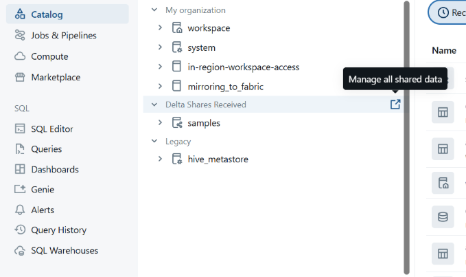

2. 신규 수신자(Recipient) 생성

- Delta Sharing 페이지에서 Shared by me를 클릭합니다.
- New Recipient를 클릭합니다.
- 다음 정보를 입력합니다:
    - Recipient Name: (수신자 이름 입력)
    - Recipient Type: Databricks 선택
    - Sharing Identifier: azure:southcentralus:3035jfje88e8-91 434a-9aca e6da87c1e882
        - Sharing Identifier는 노트북 또는 Databricks SQL 쿼리에서 확인 가능 : (SQL) SELECT CURRENT_METASTORE(); 
    - Create를 클릭합니다.

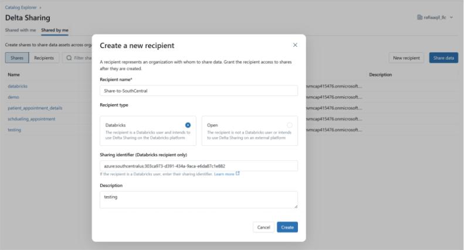

3. 데이터 공유

- "**Share Data**"를 클릭합니다.
- 공유 이름(Share Name)을 입력합니다.
- 공유할 데이터 자산(Data Assets)을 선택합니다.

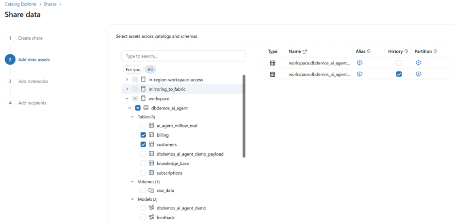

참고: 선택한 데이터 자산의 히스토리를 비활성화하는 것이 권장됩니다. 현재 데이터 스냅샷만 공유되도록 설정하면 공유가 단순해지고, 과거 버전에 대한 불필요한 접근을 방지할 수 있습니다. 또한, 필요한 경우 데이터 파티셔닝을 통해 공유를 더 간단하게 만들 수 있는지 확인하시기 바랍니다.

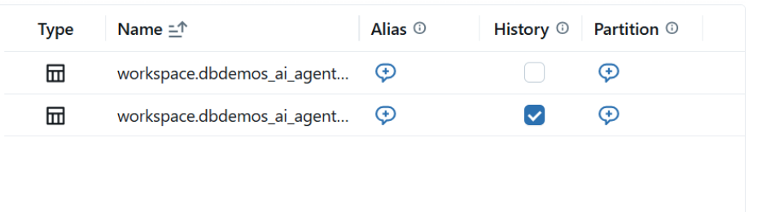

- 앞서 생성한 수신자 이름을 추가합니다.
- Share Data를 클릭합니다.

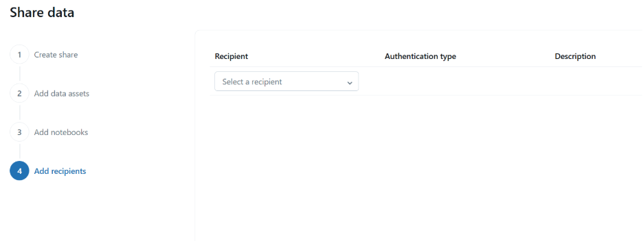

4. 수신자 추가

- 새로 생성한 공유(share)에서 Add Recipient를 클릭합니다.
- South-Central 워크스페이스의 Metastore ID를 선택합니다.


5. South-Central 워크스페이스

- South-Central 워크스페이스에서 Delta Sharing 페이지로 이동합니다.
- Shared with me 탭에서 새로 생성한 공유를 찾아 클릭합니다.
- 해당 공유를 Unity Catalog의 카탈로그에 추가합니다.

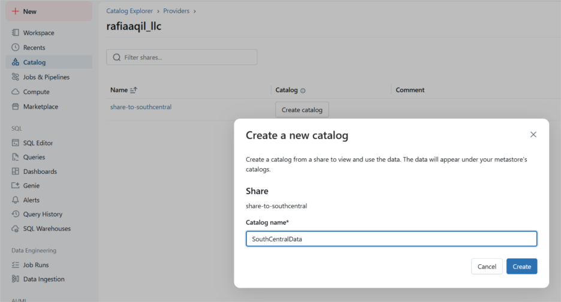

## 파트 2: 서버리스 웨어하우스를 위한 NCC 활성화

6. 네트워크 연결 구성(NCC) 추가

- Databricks 계정 콘솔로 이동: https://accounts.azuredatabricks.net/
- Cloud resources로 이동한 후, Add Network Connectivity Configuration을 클릭합니다.
- 필요한 필드를 입력하고 SouthCentral용 새 NCC를 생성합니다.

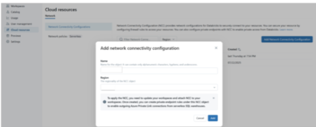

7. 워크스페이스에 NCC 연결

- Account Console에서 Workspaces로 이동합니다.

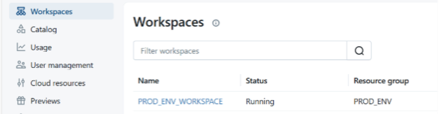
- SouthCentral 워크스페이스를 선택하고 Update Workspace를 클릭합니다.
- Network Connectivity Configuration 드롭다운에서 방금 생성한 NCC를 선택합니다.

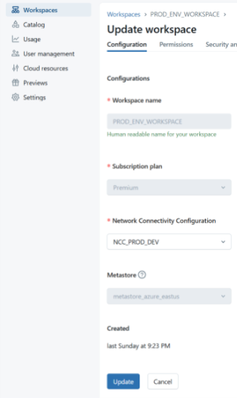

8. 프라이빗 엔드포인트 규칙 추가

- Cloud resources에서 NCC를 선택하고, Private Endpoint Rules를 선택한 후 Add Private Endpoint Rule을 클릭합니다.

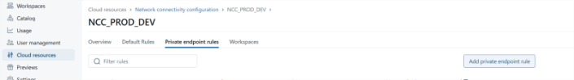

- 다음 정보를 입력합니다:
- Resource ID: NorthCentral에 있는 스토리지 계정의 Resource ID를 입력합니다.

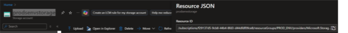

- 참고: Resource ID는 스토리지 계정(NorthCentral)에서 확인할 수 있습니다. 오른쪽 상단의 "JSON View"를 클릭하세요.
- Azure Subresource 유형: dfs 및 blob

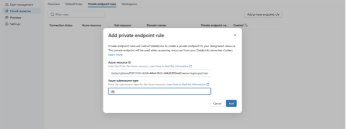

9. 보류 중인 연결 승인

- NorthCentral 스토리지 계정에서 Networking → Private Endpoints로 이동합니다.

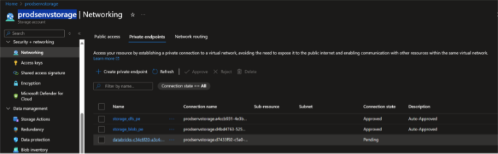

- Databricks에서 온 보류 중(Pending) 연결을 확인합니다.

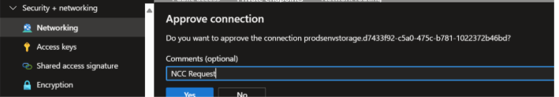

- 연결을 승인하면, Account Console에서 연결 상태가 ESTABLISHED로 표시됩니다.

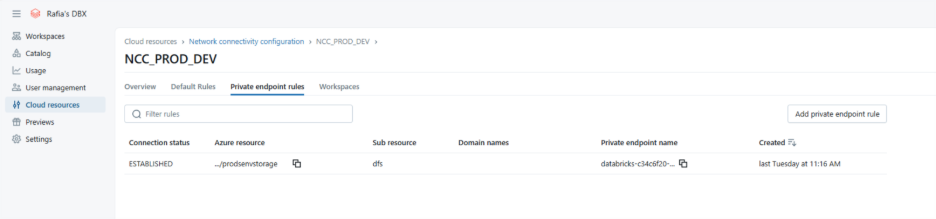

이제 “Delta Shares Received” 아래에 공유 항목이 표시됩니다.

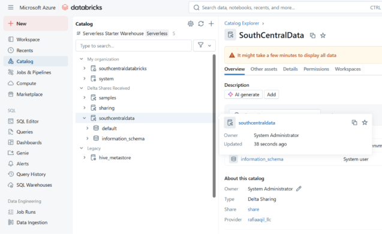

**참고**: 공유 항목이 보이지 않는 경우, 다음 SQL 명령을 실행하세요:
```sql
GRANT USE_PROVIDER ON METASTORE TO `username@xxxx.com`
```

----------

- 2025년 10월 18일 업데이트 됨.
- 2025년 10월 19일 번역 함. (by [JYSEONG(MSFT)](https://techcommunity.microsoft.com/users/ji%20yong%20seong/219866) / [GitHub](https://github.com/jiyongseong))