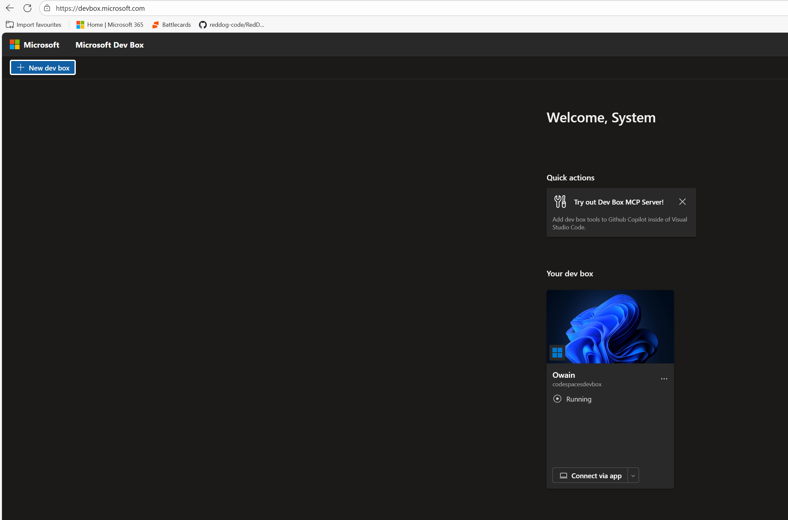
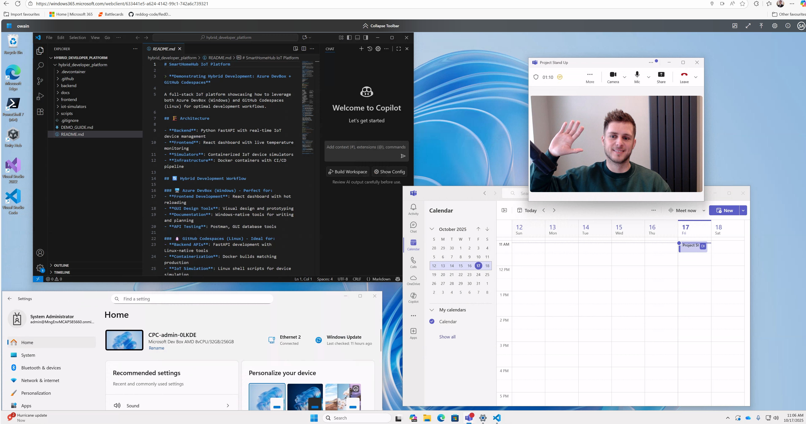
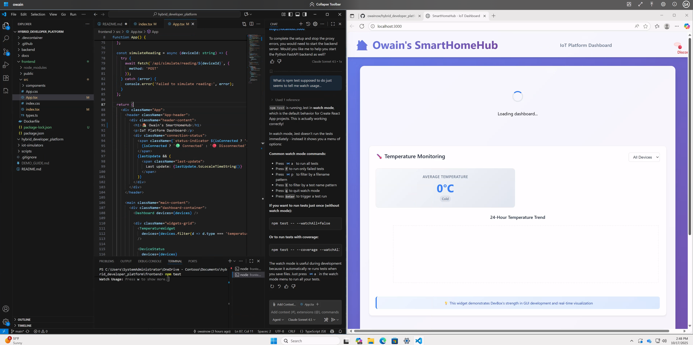
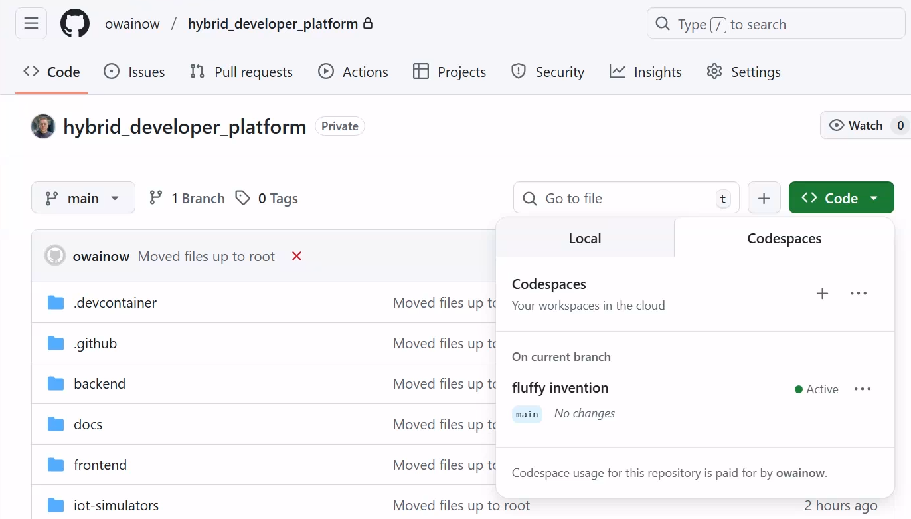
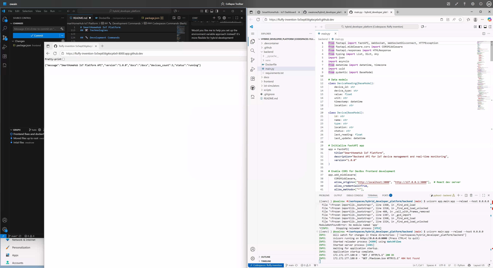
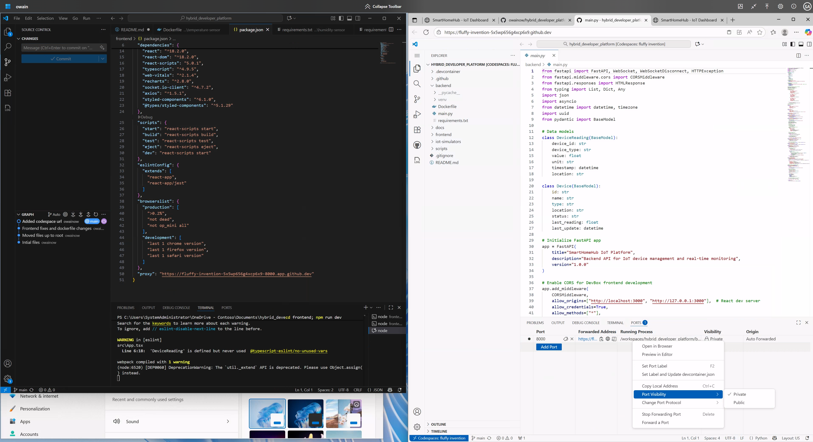
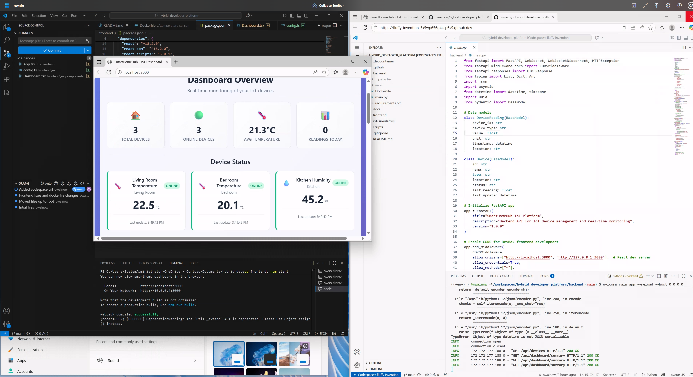

### 작성자 : [owaino](https://techcommunity.microsoft.com/users/owaino/1867036)
### 원본 : [Beyond the Desktop: The Future of Development with Microsoft Dev Box and GitHub Codespaces](https://techcommunity.microsoft.com/blog/appsonazureblog/beyond-the-desktop-the-future-of-development-with-microsoft-dev-box-and-github-c/4459483)

이제 개발자 플랫폼 전략은 선택이 아닌 필수가 되었습니다.
플랫폼 전략은 조직이 달성할 수 있는 한계를 결정합니다.
기반이 취약하다면, 아무리 반복 개선을 해도 이상적인 개발 환경(Developer Nirvana)에 도달할 수 없습니다.
훌륭한 개발자 플랫폼은 다음을 가능하게 합니다:

- TTFC(Time to First Commit) 단축
- 릴리스 속도를 가속화
- 그리고 무엇보다, 개발자 소진(Burnout)을 유발하는 일상적인 마찰을 줄여줌.

----------

현대 개발자 플랫폼은 이미 데스크톱을 넘어섰습니다.
이제는 노트북에 어떤 도구가 설치되어 있는지가 아니라, 아이디어에서 프로덕션까지 얼마나 빠르게 이동할 수 있는지가 중요합니다.
조직의 개발자 플랫폼 전략은 더 이상 선택 사항이 아닙니다.
이 전략은 조직이 달성할 수 있는 한계를 결정합니다.
기반이 취약하다면, 아무리 반복 개선을 해도 이상적인 개발 환경(Developer Nirvana)에 도달할 수 없습니다.
훌륭한 개발자 플랫폼은 다음을 가능하게 합니다:

- TTFC(Time to First Commit) 단축
- 릴리스 속도 가속화
- 그리고 무엇보다, 개발자 소진(Burnout)을 유발하는 일상적인 마찰을 줄여줌

---------------

하지만, 모든 요구를 단일 제품으로 충족하는 플랫폼은 거의 없습니다.
현대 개발은 다양한 요소를 아우릅니다:

- 로컬 개발 도구
- 클라우드 인프라
- 규정 준수 및 보안
- 크로스 플랫폼 빌드
- 협업
- 빠른 온보딩

조직은 결국 두 가지 선택지 중 하나를 마주합니다:

- 이 중 하나 이상을 포기하거나
- 생산성과 혁신을 저해하는 경직된 환경을 개발자에게 강요

-----------------
여기서 **Microsoft Dev Box**와 **GitHub Codespaces**가 등장합니다.
각각은 현대 개발자 플랫폼의 핵심 요소를 담당합니다.

- Microsoft Dev Box

    - 완전 관리형 클라우드 워크스테이션을 제공합니다.
    - Dev Box는 개발자에게 일관되고 고성능의 환경을 제공하면서, 중앙 IT가 엄격한 거버넌스와 제어를 적용할 수 있도록 합니다.
    - Microsoft 내부 분석에 따르면, Dev Box 사용은 개발자당 연간 156시간 절감 효과를 가져옵니다.
    - 또한 컨텍스트 전환 비용 감소, 빌드/테스트 주기 단축 등 주요 지표에서 큰 개선이 확인되었습니다.
    - 하지만 네이티브 Linux 지원 부족은 여전히 과제입니다. 현재 WSL2를 통해 부분 지원은 가능하지만, 완전한 경험을 제공하지는 못합니다.
    - 이 부분을 보완하는 것이 바로 GitHub Codespaces입니다.

- GitHub Codespaces

    - 즉시 실행 가능한 Linux 네이티브 개발 환경을 제공합니다.
    - 리포지토리에서 바로 실행되며, 가볍고 재현 가능하며 일시적이어서 빠른 반복, PR 테스트, 크로스 플랫폼 개발에 이상적입니다.
    - Codespaces는 Linux에서 완전하게 동작하며, 개발자에게 네이티브 도구, 스크립트, 런타임에 대한 접근을 제공합니다.
    - 온보딩 마찰을 최소화하여, 새 개발자가 몇 분 만에 코딩을 시작할 수 있습니다.
    - 다만, 지속적이고 정책 제어가 필요한 엔터프라이즈 환경에는 완전한 대안이 되지 않습니다.

위의 두가지 솔루션을 함께 사용하면, 다음과 같은 장점을 얻을 수 있습니다.

- Dev Box → 엔터프라이즈급 기반 제공
- Codespaces → 민첩하고 크로스 플랫폼 환경 제공
- 두 솔루션을 함께 사용하면 하이브리드, 민첩성, 거버넌스를 모두 갖춘 개발자 플랫폼을 구현할 수 있습니다.

## 함께할 때 더 강력해진다: Dev Box와 GitHub Codespaces의 실제 활용
Microsoft Dev Box와 GitHub Codespaces는 **일관성, 속도, 유연성**을 결합한 하이브리드 개발자 플랫폼을 제공합니다.

- 팀은 정책 준수형 Dev Box 워크스테이션을 빠르게 실행할 수 있으며, 이 환경에는 엔터프라이즈 도구, IDE, 로컬 테스트 인프라가 사전 구성되어 있습니다.
- Codespaces는 각 프로젝트에 맞춘 일시적이고 Linux 네이티브 환경을 제공합니다.

필자가 가장 좋아하는 활용 사례 중 하나는 Docker Swarm 클러스터 같은 로컬 테스트 환경을 Dev Box나 Codespaces에서 바로 실행하는 것입니다.

- 새로운 개발자는 환경 설정에 시간을 쓰지 않고도 즉시 서비스 실행이나 마이크로서비스 테스트를 시작할 수 있습니다.
- 제 경험상, 첫 커밋까지 걸리는 시간과 초기 영향도는 Dev Box나 Codespaces를 활용한 프로젝트에서 훨씬 빨랐습니다.

Dev Box와 Codespaces 간 전환도 매우 원활합니다.

- 각 환경은 자체 라이브러리, 확장, 설정을 유지하므로, 개발자는 프로젝트 간 이동 시 재구성이나 종속성 문제 없이 작업할 수 있습니다.
- 그 결과, 즉시 코딩 가능한 환경이 제공되어 생산성을 극대화하고, 마찰을 줄이며, 팀이 빌드, 테스트, 배포에 집중할 수 있습니다.

실제 예시 시나리오를 통하여 어떠한 장점을 얻을 수 있는지 살펴보도록 하겠습니다.
이 시나리오에서는 현대적인 개발자 워크플로우를 재현해 보겠습니다.
하이브리드 플랫폼에서 Python과 React를 사용해 IoT 프로젝트를 개발하는 개발자의 하루를 예로 들어보겠습니다.

- **즉시 사용 가능한 워크스테이션(Dev Box)** 실행 → Windows 개발 및 대규모 빌드 작업용
- **Linux 네이티브 Codespace** 실행 → 크로스 플랫폼 서비스, 임시 테스트, PR 작업용
- **"로컬" 테스트** 실행 → Docker Swarm 클러스터, 데이터베이스, 메시지 큐 등을 바로 사용할 수 있도록 설정
- 환경 간 원활한 전환 → 프로젝트별 설정, 라이브러리, 확장을 잃지 않고 이동 가능

### 오전 9:00 – DevBox에서 하루 시작
저는 **Microsoft DevBox**에서 하루를 시작합니다.
DevBox는 VS Code, 디자인 도구, Azure 통합 기능이 포함된 완전 구성된 Windows 환경을 제공합니다.
팀 프로젝트를 선택하면, DevBox 카탈로그를 통해 사전 구성된 환경이 바로 준비됩니다.
다행히도 제 환경은 이미 프로비저닝되어 있습니다.
필요하다면 "New DevBox" 버튼을 눌러 새 환경을 직접 생성할 수도 있습니다.
브라우저를 통해 접속하지만, 원한다면 데스크톱 앱을 사용할 수도 있습니다.

**제가 수행하는 작업은 다음과 같습니다:**

- IoT 기기 온도 모니터링용 새로운 **대시보드 위젯** 프로토타입 제작
- GUI 기반 도구를 사용해 UI를 조정하고 변경 사항을 실시간으로 미리보기
- Visio 아키텍처 검토
- 아침 스탠드업 미팅 참여
- 문서화 노트 작성 및 백엔드용 API 상호작용 계획 수립

바로 Teams 같은 최신 작업 도구에 접근할 수 있고, 이 프로젝트의 파일도 이미 사전 로드되어 있으며, 추가 설정 없이 모든 주변 장치가 정상 작동합니다.
단 한 가지 아쉬운 점은… 오늘 아침 스탠드업 미팅에 저 혼자였다는 거죠?

**왜 DevBox를 먼저 사용할까?**

- GUI 작업이 빠르고 반응성이 뛰어남
- DevBox 환경에서는 전체 데스크톱을 활용 가능
- 초기 설계, 기획, 시각 작업에 최적
- 엔터프라이즈 앱이 바로 사용 가능 (참고: 멀티 모니터 설정도 지원)

저는 DevBox를 사용해 IoT 대시보드에서 꽤 복잡한(?) 변경 작업을 합니다.
예를 들어, 제목을 "IoT Dashboard"에서 "Owain's IoT Dashboard"로 변경하고, 이 변경 사항을 브라우저에서 실시간으로 미리봅니다.
(이 정도 작업 후에는 커피 한 잔이 필요하겠죠!)
백엔드가 아직 실행되지 않아 나머지 대시보드는 아직 로드되지 않았습니다.

### 오전 10:30 – Linux Codespaces로 전환
UI 준비가 끝나면 **코드를 GitHub에 푸시**하고, 백엔드 개발을 위해 **Linux 네이티브 GitHub Codespace**를 실행합니다.

**작업 목록:**

- 새로운 IoT 기능을 지원하기 위해 FastAPI 엔드포인트 구현
- Codespace에서 서비스를 실행하고 오류를 디버깅

**왜 지금 Codespaces를 사용해야 하는가?**

- Linux 네이티브 도구로 프로덕션 서버와의 호환성을 보장
- Docker 및 컨테이너 기반 테스트를 네이티브로 실행, WSL 변환 오버헤드 제거
- 로그인하는 모든 디바이스에서 완전한 재현 가능 환경 제공

### 오후 12:30 – 중간 테스트 및 동기화
저는 DevBox와 Codespaces를 오가며 통합 테스트와 검증을 진행합니다.

DevBox의 Edge 브라우저에서 Codespace를 열어 확인합니다. (이건 두 번째 VS Code 데스크톱처럼 사용할 수도 있습니다.)
동일한 브라우저에서 프론트엔드 미리보기도 확인합니다.

프론트엔드가 DevBox에서 로컬로 실행 중이므로, 환경 변수를 업데이트하고 Codespace에서 실행 중인 API 포트로 연결합니다.
이 경우, 웹소켓 연결과 HTTPS 호출이 포트 8000에서 이루어집니다.
Codespace에서 포트 가시성 설정을 변경하면 이 포트를 외부에 공개할 수도 있습니다.

예시 URL:
- https://fluffy-invention-5x5wp656g4xcp6x9-8000.app.github.dev/api/devices
- wss://fluffy-invention-5x5wp656g4xcp6x9-8000.app.github.dev/ws

이 작업을 통해 다음이 가능해 집니다:

- DevBox에서 프론트엔드 위젯을 미리보기, Codespaces에서 실행 중인 백엔드에 연결
- DevBox에서 프론트엔드 소소한 수정을 하면서 Codespaces에서 백엔드 로그 모니터링
- 변경 사항을 GitHub에 커밋, 두 환경을 동기화하고 CI/CD를 활용해 다음 환경으로 배포

**하이브리드의 장점:**

- DevBox는 GUI 미리보기를 원활하게 처리하고, 프론트엔드 변경 사항을 실시간으로 테스트할 수 있습니다.
- Codespaces는 프로덕션 환경과 유사한 백엔드 테스트와 Linux 네이티브 도구를 제공합니다.
- DevBox에서는 모든 파일을 한 화면에서 확인할 수 있으며, 브라우저나 VS Code 데스크톱에서 여러 Codespaces를 동시에 실행할 수도 있습니다.

이 모든 플랫폼 효율성 덕분에 저는 하루 목표를 한두 시간 만에 완료했습니다.
이제 남은 시간에는 [GitHub Copilot과 MCP를 활용해 개발자에게 이너소스를 제공하는 방법](https://techcommunity.microsoft.com/blog/appsonazureblog/search-less-build-more-inner-sourcing-with-github-copilot-and-ado-mcp-server/4454560)을 학습할 수 있겠네요. (홍보 살짝!)

## 결론
개발자 플랫폼을 설계할 때는 이 글에서 다루지 않은 네트워킹, 보안 같은 추가 고려사항도 있습니다. 하지만 이는 구현 세부사항일 뿐, 핵심은 개발자 경험을 제공하는 플랫폼을 어떻게 설계하느냐입니다.
이런 플랫폼을 구축하는 것은 가치 있는 투자입니다. 실제 엔지니어링 팀에서 단일 리포지토리가 아닌 여러 리포지토리로 구성된 애플리케이션을 다룬다면, DevBox와 Codespaces의 장점은 빠른 개발 속도를 저해하지 않는다는 점입니다.

DevBox는 프로젝트나 개발팀에 맞춰 사전 구성된 환경을 제공하며, 필요한 도구와 리포지토리도 포함할 수 있습니다.
필요할 때는 Codespaces로 빠르게 전환해 격리된 환경에서 작업하고 변경 사항을 푸시할 수 있습니다.
두 경우 모두 GitHub(또는 ADO)에 푸시하고, CI/CD 파이프라인이 다음 단계를 처리합니다.
작업이 끝나면 Codespace를 삭제하고, 필요하다면 DevBox도 정리할 수 있습니다.
언제든지 다시 셀프 서비스로 새 환경을 만들 수 있다는 점도 큰 장점입니다.

현재는 Codespaces에서 가능한 작업과 Azure DevBox에서 가능한 작업 간에 일부 겹치는 부분이 있습니다.
하지만 조직은 개발자 경험을 우선시하면서도 조직 표준과 거버넌스를 유지해야 합니다.
Windows 네이티브 서비스와 Linux 네이티브 서비스 모두 제공하는 것은 필수이며, 이는 컴퓨팅 소비 기반 과금 모델에서 특히 중요합니다.
다만, 아직은 완벽하지 않습니다.

- Microsoft DevBox는 Windows 컴퓨팅만 제공
- GitHub Codespaces는 VS Code만 지원

따라서 **어느 서비스를 선택할까?** 가 아니라, 이 두 서비스를 함께 사용하는 것이 더 강력해집니다!

* DevBox 가격 정책이 변경되었습니다. W365 라이선스가 필요하며, DevBox는 Azure를 통해 관리됩니다.
자세한 내용은 [Microsoft Dev Box capabilities are coming to Windows 365 - Microsoft Dev Box | Microsoft Learn](https://learn.microsoft.com/en-us/azure/dev-box/dev-box-windows-365-announcement)를 참고하시기 바랍니다.

----------

- 2025년 10월 17일 업데이트 됨.
- 2025년 10월 20일 번역 함. (by [JYSEONG(MSFT)](https://techcommunity.microsoft.com/users/ji%20yong%20seong/219866) / [GitHub](https://github.com/jiyongseong))