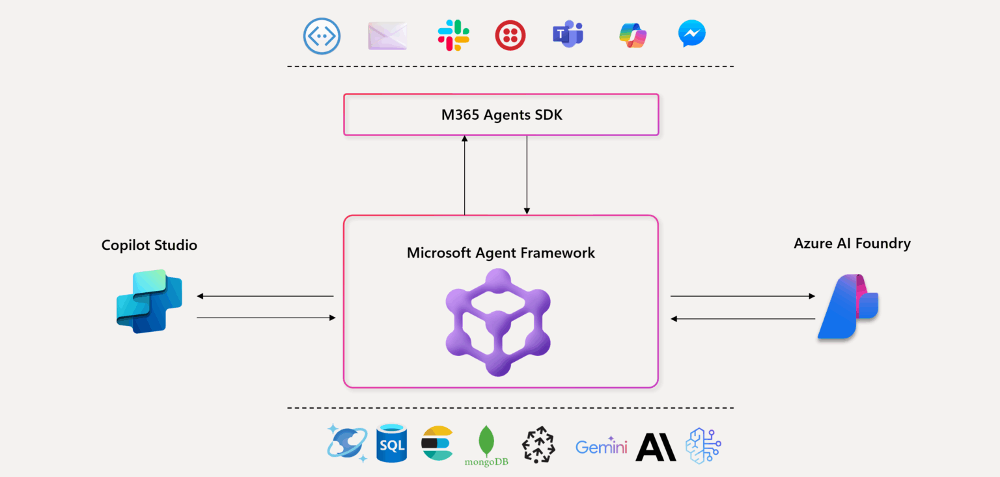
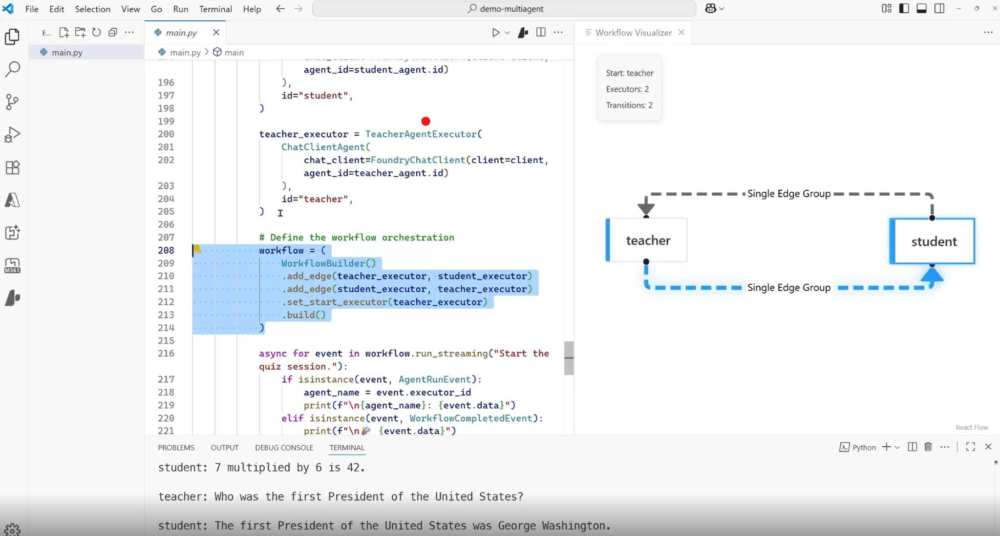
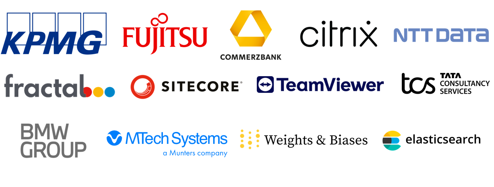

전 세계 많은 개발자들이 다음과 같이 물었습니다.
**"AutoGen의 혁신성과 Semantic Kernel의 신뢰성과 안정성을 하나의 통합 프레임워크에서 모두 갖출 수 없는 이유는 무엇일까요?"**

그리고 마침내 두 프레임워크의 장점이 통합된 [Micosoft Agent Framework](https://github.com/microsoft/agent-framework)를 발표되었습니다.

---

## 📚 References

1. 🔗 [Introducing Microsoft Agent Framework: The Open-Source Engine for Agentic AI Apps](https://devblogs.microsoft.com/foundry/introducing-microsoft-agent-framework-the-open-source-engine-for-agentic-ai-apps/)  
2. 🔗 [Announcing Microsoft Agent Framework and new Azure AI Foundry capabilities](https://azure.microsoft.com/en-us/blog/introducing-microsoft-agent-framework/)
3. 🎥 [AI Show: On Demand - New Agent Framework for Next Gen Multi Agent Solutions](https://www.youtube.com/watch?v=VBz5HMYIRI4)  
4. 🎥 [Agent Framework: Building Blocks for the Next Generation of AI Agents](https://www.youtube.com/watch?v=AAgdMhftj8w)  
5. 🎯 [Agent Innovator Lab – building AI agents on Azure, covering search optimization, agent design, evaluation, and RAG best practices. ](https://github.com/Azure/agent-innovator-lab)

---

 

2022년, 생성형 AI의 수요가 폭발하기 시작할 때부터 개발자들은 상상할 수 있는 모든 형태의 AI 에이전트를 실헝해 왔습니다. 처음에는 챗봇, Copilot, 그리고 RAG 패턴의 에이전트로 시작됐지만 지금은 목표를 추론하고 손/발형태의 도구를 호출하고 다른 에이전트와 협업하는 **자율적인 소프트웨어 구성요소**로 자리잡고 있습니다. 이러한 트랜드를 따라 컨설팅 기관인 PwC에 따르면 **10개 기업 중 8개가 이미 어떤 형태의 에이전트 기반 AI를 사용**하고 있을 정도로 도입이 확산되고 있습니다.

하지만 이러한 기대감에도 불구하고, **프로토타입에서 프로덕션으로의 전환은 아직도 많은 개발자들에게 어려운 고민**으로 남아있습니다. 많이 사용되는 오픈소스 프레임워크 중 상당수는 각각 고유한 API와 추상화 단계를 거쳐 단편화되어 있습니다. 또한, 로컬 개발이 클라우드 배포에 완벽하게 부합하는 경우는 드뭅니다. 그리고 가장 중요한 것은 기업이 준비할 시간이 부족하다는 것입니다. OSS(Open Source Software) 프레임워크는 관측 가능성, 규정 준수, 보안, 그리고 장기적인 관점의 내구성을 필수 요소로 요구합니다.

물론, Microsoft도 이 문제를 가장 먼저 경험했습니다. 그래서 **Product팀이 주축이 되어 Semantic Kernel**을 통해 개발자에게 엔터프라이즈 시스템, 콘텐츠 관리, 원격 분석에 대한 커넥터를 갖춘 안정적인 SDK를 제공했습니다. 그리고 **또 한 축인 Research팀이 주축이 되어 AutoGen**을 통해 실험적인 다중 에이전트 오케스트레이션 패턴의 문을 열었고, 이는 커뮤니티에 영감을 주었습니다. 두 솔루션 모두 열정적인 사용자를 확보했지만, 각각 부족한 점이 있었습니다.

그래서 전 세계 많은 개발자들이 다음과 같이 물었습니다.

**"AutoGen의 혁신성과 Semantic Kernel의 신뢰성과 안정성을 하나의 통합 프레임워크에서 모두 갖출 수 없는 이유는 무엇일까요?"**

그리고 마침내 두 프레임워크의 장점이 통합된 [Micosoft Agent Framework](https://github.com/microsoft/agent-framework)를 발표되었습니다.

>    
> 💡참고: 위를 클릭하면 🎥를 볼 수 있습니다.

 

## 1. Microsoft Agent Framework: 혁신과 엔터프라이즈 안정성의 통합

개발자들은 오랫동안 실험적인 **AutoGen**의 혁신적인 기능과 엔터프라이즈 환경에 필수적인 **Semantic Kernel**의 안정성 및 관측성(observability) 사이에서 선택해야 하는 딜레마를 겪었습니다. **Microsoft Agent Framework**는 이 둘의 장점을 결합하여 개발자가 실험 단계에서 프로덕션 단계로 원활하게 이동할 수 있는 단일 기반을 제공합니다.

| 항목                | Semantic Kernel                                                                                     | AutoGen                                                                                          | Microsoft Agent Framework                                                                                     |
|---------------------|---------------------------------------------------------------------------------------------------|-------------------------------------------------------------------------------------------------|--------------------------------------------------------------------------------------------------------------|
| **초점(Focus)**     | 엔터프라이즈 커넥터, 워크플로우, 관측 기능을 갖춘 안정적인 SDK                                      | 연구 기반의 실험적 멀티 에이전트 오케스트레이션                                                | 혁신과 엔터프라이즈 준비성을 결합한 통합 SDK                                                                |
| **상호운용성(Interop)** | MCP, A2A, OpenAPI 지원 플러그인 및 커넥터                                                          | 도구 통합 지원, 표준화된 크로스 런타임 프로토콜 부족                                            | 내장 커넥터, MCP + A2A + OpenAPI 지원                                                                        |
| **메모리(Memory)**  | 다양한 벡터 스토어 커넥터 및 메모리 스토어 추상화 (예: Azure SQL, Elasticsearch, MongoDB)           | 인메모리/버퍼 히스토리 + 외부 벡터 스토어 메모리 옵션 지원 (ChromaDB, Mem0 등)                 | 다양한 스토어(자사 및 타사)에서 플러그형 메모리, 검색 기반의 지속적·적응형 메모리, 하이브리드 접근 방식       |
| **오케스트레이션(Orchestration)** | 결정론적 + 동적 오케스트레이션 (Agent Framework, Process Framework)                        | 동적 LLM 오케스트레이션 (토론, 반성, 퍼실리테이터/워커, 그룹 채팅)                              | 결정론적 + 동적 오케스트레이션 (Agent Orchestration, Workflow Orchestration)                                 |
| **엔터프라이즈 준비성(Enterprise readiness)** | 텔레메트리, 관측 기능, 컴플라이언스 훅                                                              | 최소한의 지원                                                                                   | 관측 기능, 승인, CI/CD, 장기 실행 내구성, 하이드레이션                                                      |

 

## 2. 개방형 표준을 통한 상호 운용성 및 확장성

**Microsoft Agent Framework**의 핵심 강점 중 하나는 개방형 표준에 대한 통합입니다. 에이전트가 데이터, 도구, 그리고 다른 에이전트와 효과적으로 연결되도록 설계되었습니다.

1.  **Open Standards & Interoperability (개방형 표준 및 상호 운용성)**
    *   **MCP (Model Context Protocol):** 에이전트가 MCP를 통해 노출된 외부 도구나 데이터 서버를 동적으로 검색하고 호출할 수 있도록 합니다. 이를 통해 사용자 정의 코드를 작성할 필요 없이 성장하는 MCP 준수 에코시스템에 쉽게 연결할 수 있습니다.
    *   **A2A (Agent-to-Agent):** 에이전트들이 구조화되고 프로토콜 기반의 메시징을 사용하여 런타임 전반에서 협업할 수 있습니다.
    *   **OpenAPI-first design:** OpenAPI 사양을 가진 모든 REST API를 호출 가능한 도구로 즉시 가져올 수 있습니다. Microsoft Agent Framework는 스키마 구문 분석, 도구 정의 및 보안 호출을 처리하여 개발자가 수천 개의 엔터프라이즈 API를 활용할 수 있도록 합니다.
    *   **플러그형 메모리 모듈:** 개발자는 Redis, Pinecone, Elasticsearch, Postgres 등 원하는 백엔드를 대화 메모리(conversational memory)로 선택할 수 있습니다. 프레임워크는 추상화를 제공하며, 백엔드는 개발자가 결정합니다.

2.  **Pipeline for Research (연구 혁신 파이프라인)**
    이 프레임워크는 **AutoGen**에서 비롯된 혁신적인 오케스트레이션 패턴을 엔터프라이즈 환경에서 사용할 수 있도록 지원합니다. 특히 복잡하고 개방적인 문제 해결을 위해 관리자 에이전트가 동적 작업 원장을 구축하고 세분화하여 전문 에이전트를 조정하는 **Magentic orchestration**을 지원합니다.

3.  **Extensible by Design (확장 가능한 설계)**
    이 프레임워크는 **Azure AI Foundry, Microsoft Graph, Microsoft Fabric, Microsoft 365 Agents** 및 다양한 SaaS 시스템을 포함한 광범위한 엔터프라이즈 시스템에 대한 내장 커넥터를 제공합니다. 또한 YAML 또는 JSON 정의를 통해 프롬프트, 역할, 도구를 선언적으로 지정하는 **Declarative agents**를 지원합니다.

 

## 3. 외부의 다양한 도구, 에이전트를 Azure AI Foundry Agent Service, Microsoft 365 Agents 생태계로 통합

Microsoft Agent Framework는 **Microsoft 365 Agents SDK 및 Azure AI Foundry Agent Service**와의 공유 런타임 과의 통합을 포함하여 **Microsoft의 에이전트 개발 스택 전반에서 통합**을 더욱 발전시킵니다. Microsoft 365 Agents SDK는 개발자가 풀스택 다중 채널 에이전트를 빌드하고 Microsoft 365 Copilot, Teams, 웹 및 기타 채널에 게시할 수 있는 Pro-code Toolkit으로, Copilot Studio의 로우코드 커넥터 및 Microsoft 365 Copilot 사용자 지정 엔진 에이전트와의 긴밀한 상호 운용성을 제공합니다. 이 SDK를 Microsoft Agent Framework와 통합하고 Foundry Agent Service에서 사용되는 공유 런타임과 일치시키면 개발자는 에이전트를 만들고, 실행하고, 확장하고, 게시할 수 있는 **하나의 통합된 추상화 집합**을 만들고 관리할 수 있습니다. 즉, 로컬에서 프로토타입을 만들고, 원격 분석을 통해 디버깅한 다음, 에이전트를 다시 작성하지 않고도 엔터프라이즈급 관찰 가능성(observability), 규정 준수 및 보안을 갖춘 확장된 에이전트를 서비스할 수 있습니다.

 

## 4. 엔터프라이즈 시나리오: Multi-agent Workflows 적용 예시

**Microsoft Agent Framework**는 **Foundry Agent Service** 내의 **multi-agent workflows** 기능(현재 Private Preview)을 통해 복잡한 비즈니스 프로세스를 구조화된 상태 저장 워크플로우 레이어를 사용하여 오케스트레이션할 수 있게 해줍니다.

### 예시: 자동화된 IT 구매 승인 워크플로우

대규모 조직에서 새로운 소프트웨어 라이선스나 고가치 하드웨어를 구매하는 프로세스는 여러 단계의 검토와 승인을 거쳐야 합니다. MAF의 **multi-agent workflows**는 이러한 복잡한 프로세스를 자동화할 수 있습니다.

| 단계 | 에이전트 역할 | MAF 핵심 기능 |
|---|---|---|
| **1. 요청 처리** | **Request Agent** | 사용자의 자연어 요청(예: "개발팀을 위한 신규 GPU 서버 5대 구매 요청")을 받아 사양, 예산, 공급업체 정보 등 구조화된 데이터로 변환합니다. |
| **2. 규정 준수 검토** | **Compliance Agent** | 요청된 구매가 내부 보안 정책 및 예산 할당 정책을 준수하는지 검토합니다. 민감한 데이터(PII)가 포함되지 않도록 자동으로 탐지하고 관리합니다. | **PII detection**, **Task adherence** |
| **3. 승인 요청** | **Approval Agent** | 준수 검토를 통과한 요청에 대해 최종 승인자의 개입이 필요한 도구(Human-in-the-loop)를 호출합니다. | **Human in the loop** [16] |
| **4. 실행 및 추적** | **Orchestration Agent** | 승인된 후 구매 API를 호출하여 주문을 실행하고, **OpenTelemetry**를 통해 전체 워크플로우의 진행 상황과 성능을 추적합니다. | **Long-running durability**, **OpenTelemetry** |

이러한 워크플로우는 영구적인 상태와 컨텍스트 공유를 통해 장기 실행 작업을 조정하며, 내장된 오류 처리(error handling), 재시도(retries), 복구 기능을 활용하여 규모에 따른 안정성을 향상시킵니다.

 

## 4. 엔터프라이즈 준비를 위한 필수 도구

**Microsoft Agent Framework**는 PoC, MVP와 같은 실험/테스트를 넘어 규제된 산업에서도 배포할 수 있도록 설계되었습니다.

*   **관측성(Observability) 강화:** Microsoft는 에이전트 시스템을 위한 추적 및 텔레메트리 표준화를 돕기 위해 **OpenTelemetry**에 기여함으로써 다중 에이전트 관측성을 향상시키고 있습니다. 이는 디버깅, 최적화 및 규정 준수에 필수적인 에이전트 워크플로우, 도구 호출 및 협업에 대한 심층적인 가시성을 제공합니다.
*   **다양한 프레임워크 지원:** **Azure AI Foundry**는 MAF뿐만 아니라 **LangChain, LangGraph, OpenAI Agents SDK** 등 여러 프레임워크로 구축된 에이전트에 대해 **통합된 관측성**을 제공합니다.
*   **책임 있는 AI (Responsible AI):** **Azure AI Foundry**에는 곧 공개 프리뷰로 제공될 기능들이 포함되어 있습니다. 이는 **Task adherence**(에이전트가 할당된 작업에 충실하도록 돕는 기능), **Prompt shields with spotlighting**(프롬프트 인젝션을 방지하고 위험한 행동을 강조 표시하는 기능), **PII detection**(민감한 데이터를 식별하고 관리하는 기능) 등입니다.
*   **실제 고객 사례:** 이 프레임워크는 개발자들이 단편화된 도구로 인해 주당 10시간 이상 낭비하는 비효율성(업계 연구에 따르면 50%의 개발자가 경험)을 줄이고, 작업 흐름(stay in flow)을 유지하도록 돕기 위해 설계되었습니다.**KPMG**는 MAF를 기반으로 감사 테스트 및 문서화를 자동화하는 **KPMG Clara AI**를 구축하고 있으며, **Commerzbank**는 아바타 기반 고객 지원을 위해 MAF를 파일럿 운영 중입니다.

 

## 5. 지금 바로 Microsoft Agent Framework를 시작하세요

에이전트는 목표 추론, 도구 호출, 협업, 그리고 역동적인 적응을 통해 애플리케이션 로직의 차세대 계층으로 빠르게 자리 잡고 있습니다. Microsoft Agent Framework를 통해 개발자는 이제 최고의 연구 혁신을 프로덕션 환경에 적용하는 단일 오픈 소스 기반을 확보하게 되었으며, 확장에 필요한 내구성, 가시성, 그리고 엔터프라이즈급 지원 기능을 갖추게 되었습니다.

이는 Semantic Kernel과 AutoGen으로 시작된 여정의 자연스러운 진화이며, 단지 시작일 뿐입니다. Microsoft Agent Framework는 개방적인 환경에서 개발하고 개발자 커뮤니티와 공동으로 개발함으로써 차세대 멀티 에이전트 시스템의 기반으로서 계속해서 발전해 나갈 것입니다.

 
- **SDK 다운로드**: https://aka.ms/AgentFramework
- **자세한 내용은 설명서를 참고하세요**: https://aka.ms/AgentFramework/Docs
- **데모 영상**: [AI Show](https://www.youtube.com/watch?v=VBz5HMYIRI4) 및 [Open at Microsoft](https://www.youtube.com/watch?v=AAgdMhftj8w) 에서 확인하세요
- **단계 학습**: [Microsoft Learn modules for Agent Framework](https://learn.microsoft.com/en-us/training/paths/develop-ai-agents-on-azure/) and [AI Agents for Beginners](https://github.com/microsoft/ai-agents-for-beginners)
- **참여하세요**: [Azure AI Foundry Discord](https://aka.ms/foundry/discord)에 가입하여 실시간 커뮤니티를 통해 개발자 및 제품 그룹과 소통하고, AI 기술을 학습하세요.
- **참고하세요**: **많은 한국 엔터프라이즈 기업**이 학습을 위해 참고하는 리포입니다. https://github.com/Azure/agent-innovator-lab