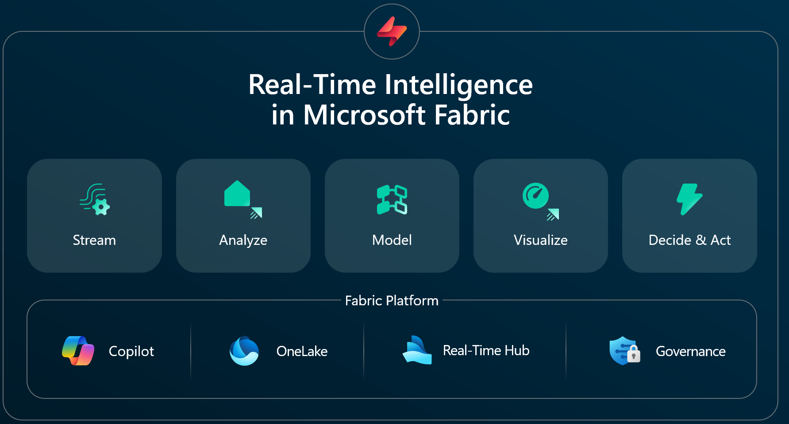
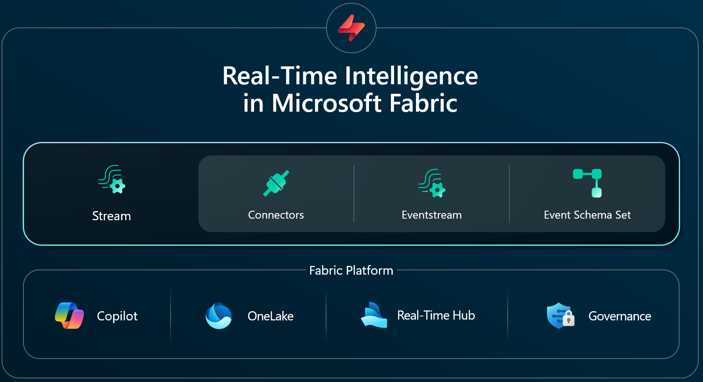
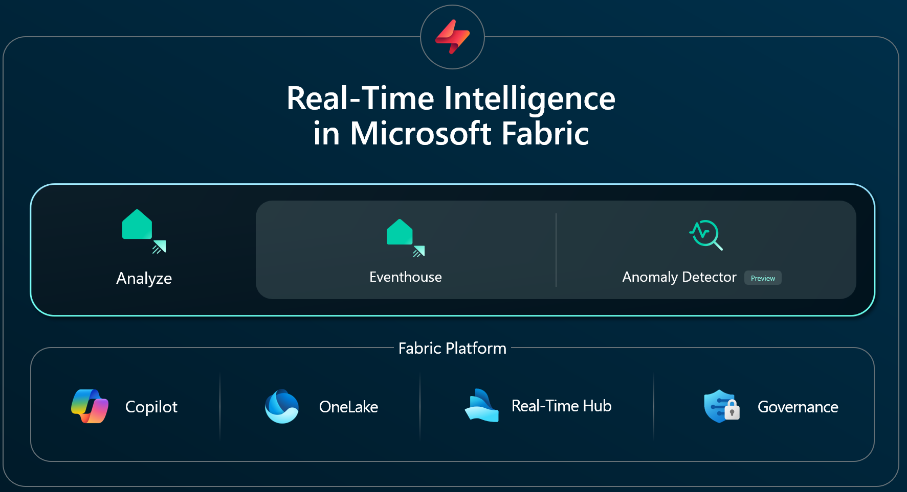
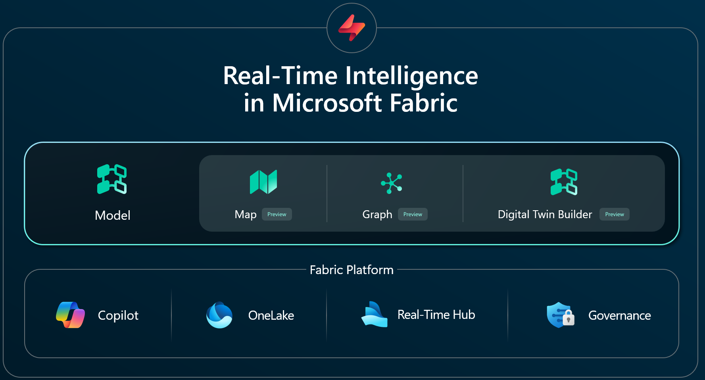
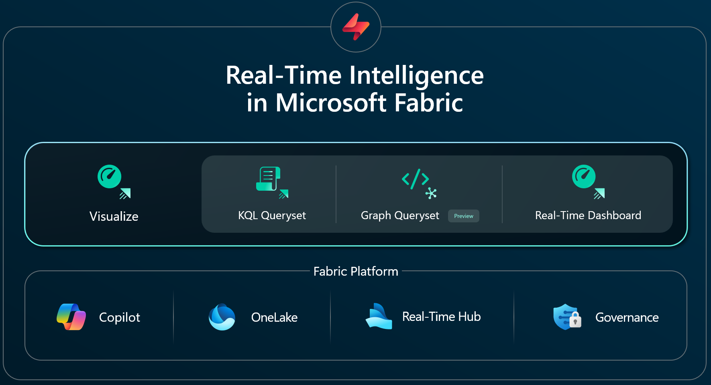
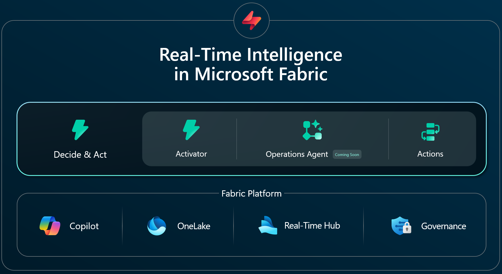

**해당 글은 [Microsoft Fabric Real-Time Intelligence(RTI)](https://github.com/jiyongseong/azure-articles/blob/main/2025-10-29-Microsoft%20Fabric%20RTI%20overview/2025-10-29-Microsoft%20Fabric%20RTI%20overview.md)에 등록된 글입니다.**

# Microsoft Fabric Real-Time Intelligence(RTI) 

## 개요
Microsoft Fabric의 Real-Time Intelligence(RTI)는 조직 내 모든 운영 신호와 이벤트 데이터를 실시간으로 수집, 분석, 시각화, 그리고 자동화된 액션까지 연결하는 통합 플랫폼입니다. 
RTI는 기존의 복잡하고 분산된 실시간 데이터 처리 환경을 하나의 단일 데이터 에스테이트로 통합하여, 데이터 엔지니어뿐 아니라 비즈니스 사용자도 쉽게 실시간 이벤트 기반 솔루션을 구축할 수 있도록 지원합니다. 
이 모든 과정은 Fabric의 Copilot, OneLake, Real-Time Hub 등과 긴밀하게 통합되어, AI 기반의 혁신적인 의사결정과 자동화를 가능하게 합니다.

실시간 솔루션을 구축하려면 몇 가지 핵심 요소가 필요합니다.
RTI의 5가지 핵심 영역은 다음과 같습니다:

1.	Streaming: 데이터 연결 및 이벤트 스트리밍.
2.	Analyze: 인사이트 도출.
3.	Model & Contextualize: 데이터 의미 부여.
4.	Visualize: 모니터링 및 대시보드.
5.	Act: 의사결정 및 자동화 실행.
이 모든 기능은 Fabric 플랫폼에 네이티브로 구축되어 있습니다.
Copilot, OneLake(단일 데이터 소스), Real-Time Hub(시간 민감 데이터 탐색 및 액션),
그리고 거버넌스 기능이 자동 통합됩니다.
따라서 RTI는 Fabric 생태계 내에서 엔드 투 엔드 실시간 솔루션을 제공합니다.

## Microsoft Fabric RTI 5대 핵심 영역 
### Streaming – 실시간 데이터 연결과 이벤트 스트리밍

데이터 접근이 없으면 솔루션을 만들 수 없습니다. 따라서 커넥터는 모든 솔루션의 핵심입니다.

- 다양한 **커넥터**와 소스 지원
  - 20개 이상의 기본 커넥터를 통해 Azure Event Hub, IoT Hub, OneLake, Google Pub/Sub, AWS Kinesis, Confluent Cloud, Apache Kafka 등 다양한 소스의 실시간 데이터를 손쉽게 연결할 수 있습니다.
  - CDC(Change Data Capture) 커넥터로 SQL, Oracle, PostgreSQL 등 주요 데이터베이스의 변경 이벤트를 실시간으로 스트리밍 가능.

- **Eventstream**의 저코드/무코드 환경
  - 복잡한 코드 작성 없이 시각적 에디터에서 데이터 흐름을 설계하고, 실시간 변환·필터링·라우팅을 구현할 수 있습니다.
  - 데이터 품질 및 스키마 일관성을 보장하는 **Event Schema Set** 기능 내장.

- 확장성과 유연성
  - 커스텀 엔드포인트 및 커스텀 커넥터를 통해 조직별 특수 시스템이나 온프레미스 환경까지 확장 가능.
  - 실시간 데이터의 대량 유입에도 안정적으로 확장되는 분산 아키텍처.

  - 활용 예시: 제조 IoT 센서, 금융 거래, 웹사이트 클릭스트림, 물류 트래킹 등 다양한 산업의 실시간 이벤트를 Fabric 환경에 통합.

### Analyze – 대용량 실시간 데이터 분석 및 인사이트 도출

데이터가 들어온 이후에는 통상 데이터를 분석하고 의미를 파악하는 작업이 이어집니다.
이때 핵심 역할을 하는 것이 Eventhouse입니다.
Eventhouse는 Azure Data Explorer 기능을 기반으로 구축되었으며,
고세분화·대용량 시간 시리즈 데이터를 저장하고 쿼리할 수 있는 엔진을 제공합니다.
즉, 페타바이트급 데이터를 초 단위로 쿼리하는 작업을 가능하게 합니다.
Microsoft 내부에서도 Eventhouse는 텔레메트리 분석에 널리 사용되고 있습니다.
Fabric은 이 강력한 기능을 저코드·무코드 사용자부터
코드 기반 전문가까지 모두 활용할 수 있도록 제공합니다.
또한 Copilot을 통해 자연어로 쿼리를 입력해도 동일한 분석 기능을 사용할 수 있습니다.

- **Eventhouse** 기반 초고속 분석
  - Azure Data Explorer(ADX) 엔진을 활용해 페타바이트급 시계열 데이터도 초 단위로 쿼리 및 분석.
  - 실시간 데이터와 과거 데이터의 통합 분석이 가능해, 트렌드 파악과 이상 징후 탐지에 최적화.

- Copilot 및 자연어 쿼리
  - Copilot을 통해 SQL이나 KQL을 몰라도 자연어로 질문하면, 자동으로 쿼리를 생성해 인사이트를 제공합니다.
  - 예: “지난 1시간 동안 오류가 급증한 장비는?”과 같은 질문도 즉시 분석 가능.

- **이상 탐지(Anomaly Detection)**
  - 내장된 이상 탐지 모델이 실시간 데이터 흐름에서 비정상 패턴을 자동 감지.
  - 이상 이벤트 발생 시 즉시 알림, 워크플로우 트리거, 자동화된 대응까지 연계.

- 스마트 기본값과 직관적 UI
  - 복잡한 파라미터 설정 없이, 기본값만으로도 고품질 분석이 가능하도록 설계.
  - 데이터 엔지니어뿐 아니라 비즈니스 사용자도 쉽게 활용 가능.

- 활용 예시: 실시간 장애 감지, 거래 이상 탐지, 생산 라인 품질 모니터링, 고객 행동 분석 등.

### Model & Contextualize – 데이터 의미 부여 및 고급 분석

분석 단계의 다음 단계는 모델링이 이어집니다.
이 영역은 RTI에서 최근 많은 개선과 업데이트가 이루어진 영역입니다.
먼저, Maps, 새로운 지리공간 분석 기능이 발표 되었고, Graph Analytics, 네트워크와 관계를 활용한 분석 기능이 추가되었습니다.
그리고 Build 2025에서 발표된 Digital Twin Builder 기능도 여기에 포함됩니다.
이 영역은 데이터를 전문화하고 의미를 부여하는 데 목적을 두고 있습니다.
데이터가 통합되면, 위치·관계·구조를 기반으로 고급 분석을 수행할 수 있습니다.

- Maps(지리공간 분석)
  - 실시간 위치 데이터와 배치 데이터를 통합하여, 지도 기반의 시각화 및 분석을 지원.
  - 다양한 지도 스타일, 다중 레이어, 히트맵, 경로 추적 등 고급 기능 제공.
  - 예: 물류 차량의 실시간 위치 추적, 매장별 방문자 흐름 분석 등.

- Graph Analytics(그래프 분석)
  - 데이터 간의 관계와 연결성을 시각적으로 탐색하고, 복잡한 네트워크 구조를 분석.
  - 비주얼 디자이너와 자연어 쿼리로 그래프 모델을 쉽게 생성·탐색.
  - 예: 사기 거래 네트워크, 소셜 네트워크 분석, 공급망 관계 분석 등.

- Digital Twin Builder(디지털 트윈)
  - 실제 자산(공장, 장비, 시스템 등)의 디지털 트윈을 생성하여, 운영 현황을 실시간으로 모니터링하고 시뮬레이션 가능.
  - 이벤트 기반 시나리오와 연계해, 예측 유지보수, 운영 최적화 등 고급 분석 지원.

- 활용 예시: 스마트 시티, 제조 설비 모니터링, 복잡한 조직 네트워크 분석 등.

### Visualize – 실시간 데이터 시각화 및 대시보드

Visualize 영역은 데이터를 해석하고 이해할 수 있도록 돕고, 조직 내에서 쉽게 공유할 수 있는 형태로 변환합니다.
Eventhouse의 심층 분석 기능을 활용해 KQL Query Set(+Graph Query Set)으로 특정 쿼리를 실행하고, 쿼리 결과를 시각화하며 협업할 수 있습니다.

또한 Real-Time Dashboard는 BI 리포트와 달리 실시간 데이터 흐름에 최적화되어 있습니다.
운영 시나리오에서 초 단위 업데이트가 필요한 경우, 해당 기능이 강력하게 동작하게 됩니다.

- Eventhouse 및 KQL Query Set
  - 실시간 데이터와 분석 결과를 다양한 차트, 그래프, 테이블로 시각화.
  - 쿼리 결과를 저장·공유하고, 협업 환경에서 실시간 피드백 가능.

- Real-Time Dashboard
  - 초 단위로 데이터가 갱신되는 실시간 대시보드 제공.
  - 운영 현장, 관제센터, 고객 서비스 등 즉각적인 의사결정이 필요한 환경에 최적화.
  - KPI, 알림, 상태 변화 등 주요 지표를 한눈에 파악 가능.

- Power BI 및 Fabric 통합
  - Power BI와의 연동으로, 실시간 데이터와 BI 리포트를 통합하여 조직 전체에 배포 가능.
  - Fabric 내 다른 워크플로우와도 자연스럽게 연결.

- 활용 예시: 생산 현장 모니터링, 실시간 매출 현황판, 고객 서비스 대시보드 등.

### Act – 실시간 의사결정 및 자동화 실행

마지막은 Decide & Act로, Activator 기능이 포함됩니다.
실시간 데이터에서 복잡한 조건과 규칙을 설정하고, Teams 메시지 전송, Fabric 워크플로우 실행, Power Automate 트리거 등의 자동 액션을 수행할 수 있습니다.

Operations Agent 기능도 Decide & Act에 포함됩니다. 이 기능은 곧 출시될 예정으로, Fabcon에서 공개되었습니다.
Operations Agent는 LLM과 에이전트 기술을 활용해 데이터를 더 깊이 이해하고, 다양한 데이터 소스를 확장적으로 처리합니다.

- Activator(액션 트리거)
  - 실시간 데이터 이벤트에 따라 Teams 메시지, 이메일, Power Automate, Fabric 워크플로우 등 다양한 액션을 자동 실행.
  - 복잡한 조건과 규칙을 시각적으로 설계 가능.
  - 예: 장애 발생 시 담당자에게 즉시 알림, 재고 부족 시 자동 발주 등.

- Operations Agent(운영 에이전트)
  - LLM 기반의 AI 에이전트가 목표와 의도를 이해하고, 데이터 해석 및 최적의 액션을 자동 결정·실행.
  - 반복 학습을 통해 점점 더 자율적이고 정교한 운영이 가능.
  - 예: 시스템 이상 감지 시 자동 복구, 고객 불만 접수 시 자동 대응 등.

- 사람과 AI의 협업
  - 초기에는 사람이 승인하거나 개입하지만, 신뢰가 쌓이면 완전 자동화로 전환 가능.
  - 운영 효율성과 대응 속도를 획기적으로 개선.

- 활용 예시: IT 운영 자동화, 고객 응대 자동화, 생산 라인 제어 등.

## 요약
Microsoft Fabric RTI는 데이터 연결, 실시간 분석, 의미 부여, 시각화, 자동화까지 모든 단계를 하나의 통합 플랫폼에서 제공합니다. 복잡한 실시간 데이터 환경을 단순화하고, 누구나 쉽게 실시간 인텔리전스와 자동화를 구현할 수 있도록 설계되었습니다.
RTI를 통해 조직은 데이터 기반의 민첩한 의사결정과 AI 기반 자동화로 경쟁력을 극대화할 수 있습니다.

----------

- 2025년 10월 29일 작성 함. (by [JYSEONG(MSFT)](https://techcommunity.microsoft.com/users/ji%20yong%20seong/219866) / [GitHub](https://github.com/jiyongseong))