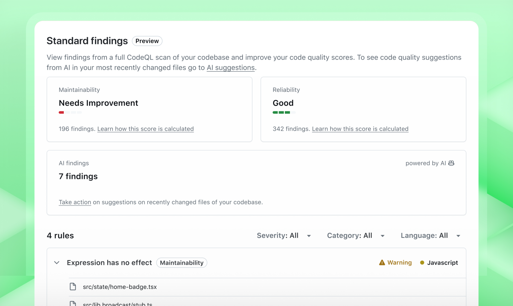
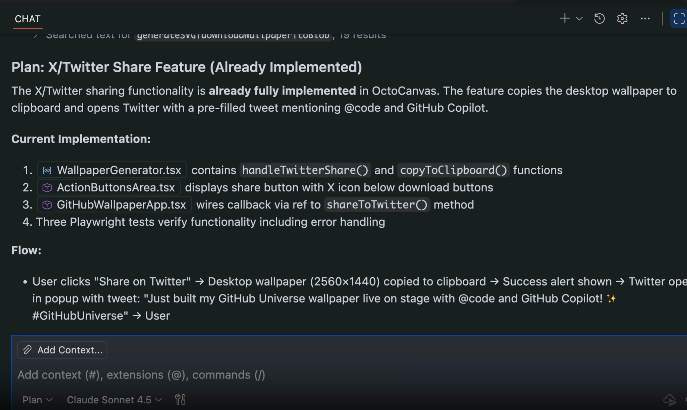
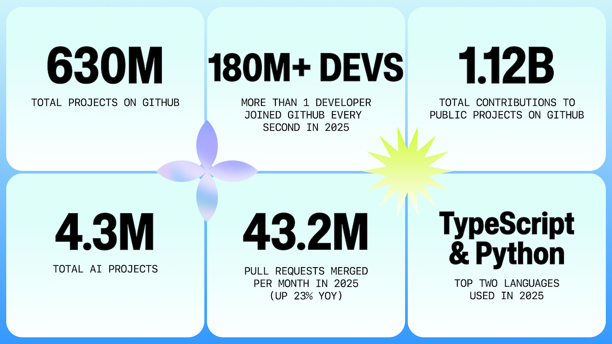

GitHub Universe 2025는 단순히 새로운 기능을 공개한 행사라기보다, **개발 방식 자체가 변화하고 있다는 선언**에 가까웠습니다.  
이제 AI는 코드를 “도와주는 단계”를 넘어, **개발 과정 전반을 수행하고 협업에 참여하는 에이전트**로 진화하고 있습니다.  

이번 포스팅에서는 GitHub Universe 2025의 주요 발표 내용을 4~6분 안에 이해하실 수 있도록 핵심만 정리해 드립니다.  

## 🧠 1. Agent HQ 공개: 여러 AI 에이전트를 한 곳에서 관리

이번 행사의 가장 큰 발표는 **Agent HQ**입니다.  
GitHub, Anthropic, OpenAI, Google, Cognition, xAI 등 다양한 AI 에이전트를 **한 화면에서 관리하고 협업시키는 관제센터 역할**을 합니다.

### 핵심 포인트

- 여러 AI 에이전트에게 동시에 작업을 할당하고 진행 상황을 실시간으로 확인
- GitHub 웹, VS Code, 모바일, CLI 어디서든 이어서 작업 가능
- Microsoft Teams, Azure Boards, Jira 뿐 아니라 Slack, Linear와 연동되어 협업 흐름 유지
- 브랜치 접근 제한 및 권한 조절 기능으로 안정성 확보

💡 **인사이트**  
이제는 **정말** “AI를 사용하는 팀”이 아니라, **“AI 에이전트와 함께 일하는 팀”** 으로 팀 구조가 바뀌기 시작했다고 보시면 됩니다.

> 클릭하면 동영상으로 이동합니다

---

## 🧩 2. 개발 프로세스의 변화: AGENTS.md와 Agentic Code Review

### 📍 AGENTS.md로 팀만의 에이전트 설정

레포지토리에 `AGENTS.md` 파일만 작성하면,  
해당 프로젝트에 맞는 **커스텀 개발 에이전트**를 만들 수 있습니다.

정의 가능한 것들:

- 에이전트가 따라야 할 팀 룰
- 사용할 수 있는 도구 범위
- 참고해야 할 문서/컨텍스트

이제 개발 가이드 문서를 공유하는 것이 아니라,  
**개발 문화를 “에이전트에게 내재화”하여 팀 전체의 개발 품질을 일정하게 유지**할 수 있습니다.

> 영상은 [여기](https://github.blog/wp-content/uploads/2025/10/DotCom_MissionControl_v2.mp4)서 참고하세요.

---

### 🔍 Agentic Code Review: 리뷰 자동화

PR에 `@copilot`을 멘션하면,  
에이전트가 코드 분석→문제 해결→수정 PR 생성까지 맡아 처리합니다.

활용 흐름:

1. 개발자가 PR 생성  
2. `@copilot` 호출  
3. CodeQL + ESLint 기반으로 리스크 진단  
4. 수정안 적용 → 새로운 PR 자동 생성  

👀 **개발자 경험 변화**  
개발자는 코드 스타일/포맷 검토에 시간을 쓰지 않고,  
**설계·구조·아키텍처 같은 본질적 부분에 집중**할 수 있게 됩니다.

---

## 🧰 3. 개발자 도구 업그레이드: VS Code, CLI, MCP

### 🧭 Plan Mode: 코드 작성 전 “계획부터”

Plan Mode는 코드 작성 전에 AI가 먼저 **구현 전략을 설계**해주는 기능입니다.

- 요구사항 분석 → 질문 → 계획 수립 → 구현
- 중간에 계획 수정도 가능
- 개발 초기에 방향성이 흔들리지 않도록 해줌

“일단 만들어보고 고치는 방식”에서 **“처음부터 제대로 설계하고 구현하는 방식”**으로 패러다임이 이동합니다.

> 영상은 [여기](https://github.blog/wp-content/uploads/2025/10/VScode_PlanMode_v2.mp4)서 참고하세요.

---

### ⌨️ Copilot CLI 출시

터미널 환경에서도 AI 에이전트 기반 개발을 사용할 수 있게 되었습니다.

가능한 작업:

- 코드 생성 및 리팩토링
- 프로젝트 구조 이해 및 설명
- 명령 실행 및 반복 작업 자동화

터미널을 선호하시는 개발자분들께 특히 강력한 변화입니다.

---

### 🔌 MCP Registry

AI 모델을 외부 시스템과 연결해주는 MCP 서버들을 설치할 수 있는 **마켓플레이스**입니다.

- DB, API, 파일 시스템, Unity, PagerDuty, Hugging Face 등 연결
- 클릭 설치 및 에이전트 권한 부여

**활용 예시**  
“AI 에이전트가 GitHub 레포만 보고 끝이 아니라, 회사 DB나 SaaS와 연결되어 실제 업무를 처리할 수 있게 된다”는 의미입니다.

---

## 🏢 4. 엔터프라이즈 기능: 거버넌스와 가시성

기업에서 AI 도입 시 가장 중요한 요소는 **보안, 통제, 감사**입니다.  
이번 업데이트는 이 부분이 크게 강화됐습니다.

- **Code Quality**: PR 코드 품질 평가 및 자동 수정 제안
- **Copilot 메트릭 대시보드**: 조직 내 AI 사용 현황 분석
- **Enterprise AI Control Plane**: 모델·에이전트 접근 제어, 정책, 로그 관리

엔터프라이즈 보안 관점에서는 매우 중요한 기능입니다.

---

## 🌍 5. Octoverse 2025 하이라이트

- GitHub 개발자 수: **1억 8천만+**
- 레포지토리 수: **6억 3천만+**
- 기여 수: **11억 2천만+**

### 주요 트렌드

- **TypeScript, Python·JS 제치고 1위 언어 등극**
- 110만+ 레포가 LLM SDK 사용
- 신규 개발자의 80%가 첫 주에 Copilot 사용
- 1년간 신규 유입 3,600만명 (인도 14% 차지)
- 월 PR 병합 4,320만건 / 5.5M 이슈 종료

---

## 🌟 마무리: 개발의 중심이 “사람”에서 “사람+에이전트 팀”으로

GitHub Universe 2025는 AI가 “개발자의 보조 도구” 역할을 넘어,  
**개발 팀의 정식 멤버**가 되는 시대로 전환된 순간이었다고 볼 수 있습니다.

핵심 변화 정리:

| 변화 영역 | 이전 | 앞으로 |
|------------|--------|-----------|
| 코드 작성 | Copilot이 도와줌 | 에이전트가 직접 구현 |
| 코드 리뷰 | 사람이 대부분 수행 | AI가 해결하고 사람은 설계 검토 |
| 개발 문화 공유 | 문서 기반 | AGENTS.md 기반 내재화 |
| 협업 흐름 | GitHub 중심 | Teams뿐 아니라 Slack, CLI 어디서나 진행 |

앞으로의 개발팀은 **“개발자 + AI 에이전트가 함께 일하는 구조”**를 어떻게 설계하느냐가 경쟁력이 될 것입니다.

## 🔗 출처

| 제목                                                                           | 포스팅일              | 작성자    | 링크                                                                                                                                                                                                                                             |
| ---------------------------------------------------------------------------- | ----------------- | ------ | ---------------------------------------------------------------------------------------------------------------------------------------------------------------------------------------------------------------------------------------------- |
| Introducing Agent HQ: Any agent, any way you work                            | 2025-10-28        | GitHub | [https://github.blog/2025-10-28-introducing-agent-hq-any-agent-any-way-you-work](https://github.blog/2025-10-28-introducing-agent-hq-any-agent-any-way-you-work)                                                                               |
| Plan Mode: A new way to develop with agents in VS Code                       | 2025-10-28        | GitHub | [https://github.blog/2025-10-28-plan-mode-a-new-way-to-develop-with-agents-in-vs-code](https://github.blog/2025-10-28-plan-mode-a-new-way-to-develop-with-agents-in-vs-code)                                                                   |
| Govern agent workflows at scale                                              | 2025-10-28        | GitHub | [https://github.blog/2025-10-28-govern-agent-workflows-at-scale](https://github.blog/2025-10-28-govern-agent-workflows-at-scale)                                                                                                               |
| GitHub Code Quality in public preview                                        | 2025-10-28        | GitHub      | [https://github.blog/changelog/2025-10-28-github-code-quality-in-public-preview](https://github.blog/changelog/2025-10-28-github-code-quality-in-public-preview)                                                                               |
| New public preview features in Copilot code review                           | 2025-10-28        | GitHub | [https://github.blog/2025-10-28-new-public-preview-features-in-copilot-code-review](https://github.blog/2025-10-28-new-public-preview-features-in-copilot-code-review)                                                                         |
| Work with the Copilot coding agent in Slack                                  | 2025-10-28        | GitHub | [https://github.blog/2025-10-28-work-with-the-copilot-coding-agent-in-slack](https://github.blog/2025-10-28-work-with-the-copilot-coding-agent-in-slack)                                                                                       |