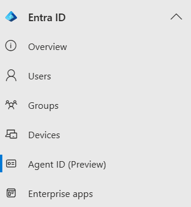
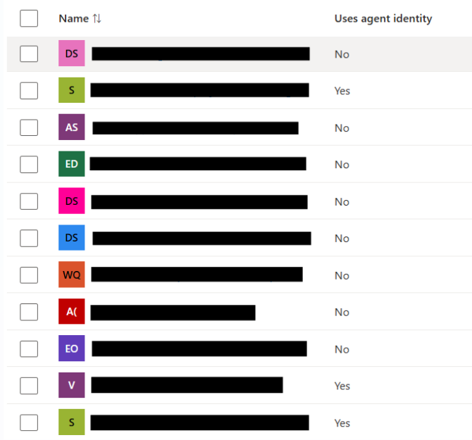
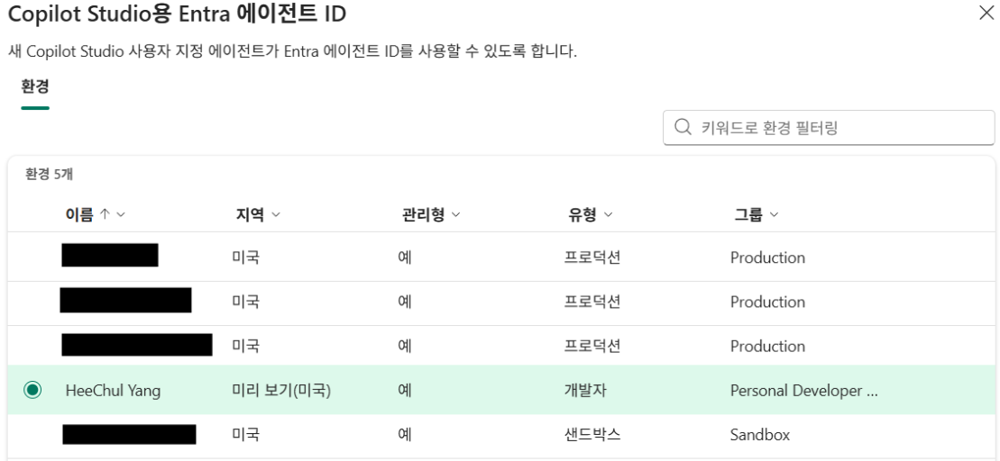

## AI Agent는 '누구'인가

지금 이 순간, 여러분의 조직에서는 몇 개의 AI Agent가 작동하고 있을까요?

Copilot Studio로 만든 고객 응대 Agent, Microsoft Foundry로 배포한 문서 요약 Agent, Power Automate로 연결한 업무 자동화 Agent. 특히 Microsoft 생태계 안에서 조직 내 AI Agent의 수는 빠르게 늘고 있습니다.

[Microsoft 텔레메트리 데이터](https://www.microsoft.com/en-us/security/blog/2026/02/10/80-of-fortune-500-use-active-ai-agents-observability-governance-and-security-shape-the-new-frontier/)에 따르면, Fortune 500 기업의 80% 이상이 이미 AI Agent를 실제 운영 중입니다.

그런데 여기서 중요한 질문이 하나 생깁니다.

**그 Agent들은 기업 시스템 입장에서 '누구'인가요?**

사람 직원이라면 입사와 동시에 Entra ID 계정이 생성되고, 역할에 따라 접근 권한이 부여되며, 퇴사 시 계정이 비활성화됩니다. 담당자가 명확히 지정되고, 모든 행위는 감사 로그에 기록됩니다.

AI Agent에게도 동일한 질문을 던져야 합니다.

- 이 Agent는 어떤 리소스에 접근할 수 있는가?
- 이 Agent의 행위에 책임지는 사람은 누구인가?
- 이 Agent가 더 이상 필요 없을 때, 어떻게 폐기되는가?
- 이 Agent가 이상한 행동을 하면, 어떻게 탐지하고 차단하는가?

기존의 방식으로는 이 질문들에 제대로 답하기 어렵습니다. **Microsoft Entra Agent ID**는 바로 이 문제를 해결하기 위해 설계된 AI Agent 전용 identity 프레임워크입니다.

이 글에서는 Entra Agent ID가 무엇인지, 왜 기존 방식과 다른지, 그리고 지금 당장 어떻게 적용할 수 있는지를 Non-Human Identity의 발전사를 통해 단계적으로 설명합니다.

## Entra Agent ID란 무엇인가

**Microsoft Entra Agent ID**는 AI Agent를 위한 first-class identity 프레임워크입니다. 공개 문서 기준으로 2025년부터 preview로 제공되고 있으며, 2026년 3월 현재도 기능과 문서가 빠르게 확장되고 있습니다.

> **"인간 직원을 Entra ID로 관리하듯, AI Agent도 동일한 수준의 identity, 거버넌스, 보안으로 관리한다."**

이를 실현하기 위해 Entra Agent ID는 기존의 Service Principal 중심 운영과는 다른 설계 방향을 채택했습니다.

Agent ID 플랫폼에는 blueprint, agent identity, agent user 등 여러 객체가 등장합니다. 이 글에서는 운영과 거버넌스 관점에서 가장 중요한 **Blueprint** 와 **Agent Identity** 를 중심으로 설명하겠습니다.

### Blueprint → Agent Identity 패턴

모든 Agent Identity는 **Blueprint(설계도)** 에서 파생됩니다.

```
Blueprint (1개)
│
│  "Sales Assistant Agent" 라는 에이전트의 종류 정의
│  ├── 이름, 게시자, 역할 정의
│  ├── Graph API 권한 정의
│  ├── Credential 보유 (Managed Identity / Certificate / Client Secret)
│  └── Conditional Access 정책 적용 단위
│
├── Agent Identity - 북미 영업팀 인스턴스
├── Agent Identity - 남미 영업팀 인스턴스
├── Agent Identity - 기업영업팀 인스턴스
└── ... (여러 인스턴스)
```

이 패턴의 핵심은 두 가지입니다.

첫째, **Agent Identity는 자체 credential을 직접 들고 다니지 않습니다.** 호스팅 서비스는 Blueprint의 OAuth credential을 사용해 Entra ID에서 토큰을 요청하고, 그 토큰으로 Agent Identity의 생성 및 런타임 인증을 수행합니다. 즉, credential 관리 지점이 Blueprint 쪽으로 집중됩니다.

둘째, **Blueprint에 연결된 거버넌스와 정책을 인스턴스 단위로 일관되게 적용할 수 있습니다.** Conditional Access, 권한 설계, 비활성화 같은 운영 작업을 개별 에이전트마다 반복하지 않아도 됩니다.

### Sponsor

Entra Agent ID의 설계에서 가장 주목할 점 중 하나는 **Sponsor를 필수**로 지정한다는 것입니다.

Sponsor는 에이전트의 라이프사이클과 접근 결정에 책임지는 인간(또는 그룹)입니다. Agent가 이상 행동을 보이거나 보안 인시던트가 발생했을 때 연락할 수 있는 당사자입니다. Blueprint와 Agent Identity 모두 생성 시 Sponsor 지정이 요구됩니다.

### Agent Registry

Entra Agent ID는 조직 내 Agent를 한 곳에서 볼 수 있는 **Agent Registry**를 제공합니다. Copilot Studio, Microsoft Foundry, 그리고 다른 생성 채널에서 만들어진 Agent를 포함해 전체 목록과 상태를 확인할 수 있습니다.


## 왜 기존 방식으로는 부족했나

Entra Agent ID가 왜 등장했는지를 이해하려면, Non-Human Identity가 어떻게 발전해 왔는지를 살펴볼 필요가 있습니다. 각 세대는 이전 세대의 문제를 해결하면서 등장했고, 동시에 새로운 한계를 남겼습니다.

### 0. 서비스 계정 — 사람처럼 생긴 계정으로 서비스 인증
 
클라우드 이전 시대에는 서비스가 다른 서버에 접근할 때 `svc_batch_user` 같은 전용 계정을 사람처럼 만들어 쓰는 방식이 일반적이었습니다. 비밀번호는 설정 파일에 그대로 기록되었습니다.
 
이 방식의 문제는 **credential이 사람에게 묶여 있다**는 데 있었습니다. 비밀번호가 만료되면 서비스가 중단되고, 담당자가 퇴사하면 소유자가 불명확해졌습니다. 수백 개의 orphaned 서비스 계정이 감사도 없이 시스템 어딘가에 남아있는 상황이 흔했습니다.

### 1. App Registration + Service Principal

Azure AD(현 Entra ID)의 등장과 함께 **앱에게 독립적인 identity**를 부여하는 개념이 도입되었습니다. App Registration을 하면 Application Object(전역 정의)와 Service Principal(테넌트 내 인스턴스)이 분리되어 생성됩니다.

인증은 OAuth 2.0 Client Credentials Flow로 표준화되었습니다.

```python
# Service Principal 기반 인증
credential = ClientSecretCredential(
    tenant_id="...",
    client_id="...",
    client_secret="..."  # ← secret을 코드/설정에서 직접 관리
)
```

사람 계정 비밀번호 대신 앱 전용 credential을 쓰게 되었지만, **secret의 만료 관리와 유출 위험은 여전히 개발자의 몫**이었습니다.


### 2. Enterprise Application

Service Principal 위에 **외부 앱이 내 테넌트 리소스에 접근하는 표준 동의 방식**이 생겼습니다. Admin 또는 User가 동의(Consent)를 완료하면 내 테넌트에 Enterprise Application(즉, 해당 앱의 테넌트 내 Service Principal) 객체가 자동 생성됩니다.

바로 이 구조에서 중요한 포인트가 생깁니다. **Copilot Studio에서 Entra Agent Identity 기능을 켜지 않은 환경이라면, 에이전트는 여전히 이 패턴에 가깝게 보일 수 있습니다.** Entra ID 관점에서는 에이전트별로 Enterprise Application 또는 Service Principal 중심의 개체가 늘어나는 형태입니다.

이 글에서는 설명 편의를 위해 이 패턴을 **Classic Agent**라고 부르겠습니다. 반대로 Blueprint + Agent Identity 기반 패턴은 **Modern Agent**라고 부르겠습니다. 공식 제품명이 아니라, 두 운영 모델을 구분하기 위한 shorthand입니다.

Classic Agent 패턴에서는 에이전트가 100개면 그에 따라 관리 대상 객체도 빠르게 늘어납니다. 그 결과 권한 검토, 책임자 확인, 수명 주기 관리가 에이전트별로 분산되기 쉽습니다.


### 3. Managed Identity

**"Azure 인프라가 identity를 직접 보증한다"** 는 발상의 전환입니다. VM, App Service, Container Apps 같은 Azure 리소스에 Managed Identity를 할당하면, 코드에 credential이 전혀 없어도 다른 Azure 서비스에 인증할 수 있습니다.

```python
# Managed Identity - 코드에 secret이 단 한 글자도 없음
from azure.identity import DefaultAzureCredential

credential = DefaultAzureCredential()  # 환경에서 자동 감지
client = SecretClient(vault_url="...", credential=credential)
```

| 유형 | 특징 | 적합한 시나리오 |
|---|---|---|
| **System-assigned** | 리소스와 수명 공유. 삭제 시 함께 삭제 | 단일 리소스, 단순한 시나리오 |
| **User-assigned** | 독립 리소스. N개 서비스에 할당 가능 | 여러 서비스가 동일 identity 공유 |

단, **Azure 외부 환경(GitHub Actions, GKE, 온프레미스 등)은 적용 불가**라는 한계가 있었습니다.


### 4. Workload Identity Federation

GitHub Actions에서 Azure 리소스를 배포할 때 Service Principal의 secret을 GitHub Secrets에 저장해둔 경험이 있으신가요? **Workload Identity Federation(FIC)** 은 이 문제를 OIDC 기반 토큰 교환으로 해결합니다.

```
GitHub Actions 실행
    → GitHub OIDC Provider가 단기 JWT 발급 (수 분 유효)
    → Entra ID에 제출 + Federated Credential 설정 검증
    → Azure access token 발급 → 리소스 접근
```

```yaml
# GitHub Actions - secret 없이 Azure 배포
permissions:
  id-token: write

steps:
  - uses: azure/login@v2
    with:
      client-id: ${{ vars.AZURE_CLIENT_ID }}       # Secret이 아닌 일반 변수
      tenant-id: ${{ vars.AZURE_TENANT_ID }}
      subscription-id: ${{ vars.AZURE_SUBSCRIPTION_ID }}
      # client-secret: 필요 없음 ✓
```

Azure 내부와 외부를 막론하고 secretless 인증이 가능해졌습니다. 하지만 이 시점까지도 **AI Agent의 동적 특성** - 수천 개의 동적 생성, 삭제, 자율적 행동, 책임 소재 불명확 - 은 기존 identity 모델로는 다룰 수 없는 영역이었습니다.


### 5. Entra Agent ID

지금까지의 발전사를 보면, 매 세대 전환의 공통 동인은 두 가지였습니다. **"credential을 누가 어떻게 관리하느냐"**, 그리고 **"새로운 워크로드 패턴이 기존 모델을 깨뜨리는 것"**.

AI Agent는 기존 모델을 가장 근본적으로 흔드는 워크로드입니다.

- 하루에 수천 번 생성, 삭제될 수 있음
- 사용자의 직접 개입 없이 자율적으로 행동함
- 조직 전체에 동일한 종류의 에이전트가 수백 개 배포될 수 있음
- 어떤 인스턴스가 어떤 행동을 했는지 추적이 어려움

이 현실에 맞게 처음부터 설계된 것이 **Microsoft Entra Agent ID**입니다.


## Entra Agent ID vs 기존 방식

### Classic Agent(Enterprise App)와의 비교

| 비교 항목 | Classic Agent (Enterprise App) | Modern Agent (Entra Agent ID) |
|---|---|---|
| **생성 단위** | 에이전트 1개 = App 1개 | Blueprint 1개 → N개 인스턴스 |
| **Credential 위치** | 각 App마다 개별 보유 | Blueprint에만 집중 |
| **권한 관리** | 개별 Admin consent 반복 | Blueprint 동의 → 전체 상속 |
| **책임 소재** | Owner (선택사항) | **Sponsor (필수)** |
| **감사 로그** | App 단위 | Agent Identity 단위 + Blueprint 관계 명시 |
| **라이프사이클** | 수동 관리 | Entitlement Management, Access Package와 통합 가능 |
| **위험 탐지** | Workload Identity CA 중심 | Identity Protection, Conditional Access 등 전용 제어와 결합 가능 |
| **중앙 관리** | Enterprise Applications 블레이드 혼재 | Agent Registry (전용 포털) |

### API 레벨에서의 차이

Classic Agent 생성 (Enterprise App):

```http
POST https://graph.microsoft.com/v1.0/applications
Content-Type: application/json

{
  "displayName": "My-Agent"
}
```

Preview 시점의 공식 Graph 예제 기준으로, Modern Agent Blueprint 생성은 `/beta/applications` 엔드포인트에서 `@odata.type` 과 `OData-Version: 4.0` 헤더를 함께 사용합니다.

Modern Agent Blueprint 생성 (Entra Agent ID):

```http
POST https://graph.microsoft.com/beta/applications/
OData-Version: 4.0
Content-Type: application/json

{
  "@odata.type": "Microsoft.Graph.AgentIdentityBlueprint",
  "displayName": "My-Agent-Blueprint",
  "sponsors@odata.bind": ["https://graph.microsoft.com/v1.0/users/{sponsor-id}"],
  "owners@odata.bind":   ["https://graph.microsoft.com/v1.0/users/{owner-id}"]
}
```

핵심은 "application을 하나 더 만든다"가 아니라, **preview 문서가 요구하는 방식으로 Blueprint 객체를 생성한다**는 점입니다. 문서 기준으로 Blueprint 생성에는 `OData-Version: 4.0`, `@odata.type`, 그리고 sponsor 지정(필수)과 owner 지정(권장)이 함께 사용됩니다. 이 요소 중 일부가 빠지면 의도한 Blueprint 객체가 생성되지 않거나 일반 application 생성 흐름으로 처리될 수 있으므로, preview 문서를 그대로 따르는 편이 안전합니다.

Blueprint가 생성되면, 이후 호스팅 서비스는 Blueprint credential로 먼저 Graph 토큰을 얻고, 그 토큰으로 각 Agent Identity 인스턴스를 프로비저닝합니다.

```http
POST https://graph.microsoft.com/beta/serviceprincipals/Microsoft.Graph.AgentIdentity
  OData-Version: 4.0
Content-Type: application/json
Authorization: Bearer {blueprint-token}

{
  "displayName": "My-Agent - Instance A",
  "agentIdentityBlueprintId": "{blueprint-id}",
  "sponsors@odata.bind": ["https://graph.microsoft.com/v1.0/users/{sponsor-id}"]
}
```

## 지금 내 테넌트는?

현재(2026년 3월 기준) 플랫폼별 Agent ID 적용 현황입니다.

| 플랫폼 | 현재 상태 | 비고 |
|---|---|---|
| **Microsoft Foundry** | ✅ Agent ID가 기본 통합됨 | 첫 에이전트 생성 시 프로젝트용 identity가 만들어지고, publish 후에는 distinct identity가 생성될 수 있음 |
| **Copilot Studio** | ⚠️ 환경별 opt-in 필요 | Power Platform 관리 센터에서 Entra Agent Identity for Copilot Studio 설정 필요 |
| **기존 Classic 에이전트** | ❌ Enterprise App SP 그대로 | 마이그레이션 도구 미출시, 수동 재생성 권장 |

특히 Microsoft Foundry는 unpublished 상태에서는 프로젝트 단위의 shared identity를 사용하고, publish 이후에는 에이전트별 distinct identity를 사용할 수 있습니다. 즉, 배포 단계가 바뀌면 RBAC 재할당이 필요할 수 있다는 점까지 함께 봐야 합니다.

### Step 1. 내 테넌트 현황 파악

1. [Microsoft Entra 관리 센터](https://entra.microsoft.com/)에 접속합니다.
2. 좌측 메뉴에서 **Entra ID** → **Agent ID (Preview)** 로 이동합니다.



3. **모든 에이전트 ID** 목록에서 **Has Agent ID** 컬럼을 확인합니다.
   - ✅ `Yes` → Modern Agent (Blueprint 기반)
   - ❌ `No` → Classic Agent (Enterprise Application SP)

  

### Step 2. Copilot Studio Modern Agent 활성화

Copilot Studio에서 새로 만드는 에이전트에 Agent ID를 적용하려면 환경 수준 설정을 변경해야 합니다.

1. [Power Platform 관리 센터](https://admin.powerplatform.microsoft.com/)에 접속합니다.
2. 좌측의 **Copilot** 탭에서 **Settings** 로 이동합니다.
3. **Copilot Studio** 섹션의 **Entra Agent Identity for Copilot Studio** 를 선택합니다.
4. 대상 환경을 선택한 뒤 **Edit setting** 에서 옵션을 **On**으로 전환하고 저장합니다.



5. 이후 해당 환경에서 새로 생성되는 에이전트는 Entra Agent ID와 연결됩니다.

> 설정을 켠 뒤 첫 에이전트가 생성되면, 테넌트에 `Microsoft Copilot Studio agent identity blueprint` 와 관련 blueprint principal이 자동으로 추가됩니다.

생성이 정상적으로 되었는지는 Copilot Studio의 **Settings → Advanced → Metadata** 에서 **Entra Agent ID** GUID를 확인한 뒤, Entra 관리 센터에서 같은 ID를 조회해 확인할 수 있습니다.

또한 이 기능이 켜진 상태에서 Copilot Studio 에이전트를 삭제하면, 연결된 agent identity도 함께 제거됩니다.

### Step 3. 기존 Classic Agent 처리

기존 Classic Agent를 Modern Agent로 전환하는 공식 마이그레이션 도구는 아직 출시되지 않았습니다. Microsoft는 향후 전환 도구를 제공할 예정이며, 현재 권장 방법은 다음과 같습니다.

1. Modern Agent 설정을 활성화한 환경에서 에이전트를 재생성합니다.
2. 새로 만든 Modern Agent가 정상 동작하는지 확인합니다.
3. 기존 Classic Agent를 삭제합니다.


## Agent Sprawl

Entra Agent ID를 이해하는 데 가장 유용한 관점 중 하나는, 이 문제가 완전히 새로운 것이 아니라는 점입니다.

| 서비스 계정 | Classic Agent |
|---|---|
| 누가 만들었는지 불명확한 `svc_*` 계정 | 누가 만들었는지 불명확한 Enterprise App SP |
| 담당자 퇴사 후 orphaned 서비스 계정 | 책임자 정보가 약하거나 수명 주기가 끊긴 orphaned Agent |
| 비밀번호 만료로 하루아침에 서비스 중단 | Secret 만료로 에이전트 인증 실패 |
| 감사 불가 | 어떤 인스턴스가 무엇을 했는지 추적 어려움 |

Copilot Studio로 에이전트를 자유롭게 만들기 시작하면, 책임자와 수명 주기가 명확하지 않은 Classic Agent 개체들이 테넌트에 누적될 수 있습니다. 이것이 **Agent Sprawl**입니다.

Entra Agent ID는 단순한 기술적 편의 개선이 아닙니다. **AI Agent 시대에 15년 전 서비스 계정 문제에서 배운 교훈을 처음부터 적용하는 것**입니다. Sponsor 필수화, Blueprint 기반 일괄 정책, Agent Registry를 통한 전체 가시성이 모두 그 교훈에서 나왔습니다.

Zero Trust 관점에서 정리하면 이렇습니다.

- **명시적 검증(Verify Explicitly):** 모든 Agent가 Blueprint에서 파생된 검증된 identity를 가짐
- **최소 권한(Least Privilege):** Blueprint 단위의 세밀한 권한 제어, 시간 제한 Access Package
- **침해 가정(Assume Breach):** Identity Protection, Conditional Access 같은 제어와 결합해 이상 행동을 더 빠르게 탐지하고 대응


## 마무리

AI Agent는 이제 기업의 디지털 직원입니다. 사람 직원처럼 입사(생성)부터 퇴사(폐기)까지 identity와 접근 권한을 체계적으로 관리해야 합니다.

기존의 Enterprise Application 방식은 **"앱을 등록하듯 에이전트를 등록하는"** 접근이었습니다. Entra Agent ID는 **"직원을 온보딩하듯 에이전트에게 신원을 부여하는"** 접근입니다.

Agent ID 플랫폼은 현재 Preview 단계이며, Microsoft 365 Copilot 라이선스와 Frontier 프로그램이 필요합니다. 또한 일부 생성/관리 시나리오는 Microsoft Graph `/beta` 엔드포인트와 preview 포털 UX에 의존합니다. 빠르게 진화하는 기능인 만큼, 공식 문서를 통해 최신 상태를 함께 확인해보시기 바랍니다.


## 참고 자료

- [Microsoft Entra Agent ID 공식 문서](https://learn.microsoft.com/en-us/entra/agent-id/)
- [Agent identity blueprint 생성하기](https://learn.microsoft.com/en-us/entra/agent-id/identity-platform/create-blueprint)
- [Agent Identity 거버넌스 개요](https://learn.microsoft.com/en-us/entra/id-governance/agent-id-governance-overview)
- [Copilot Studio에서 Entra agent identity 자동 생성 (Preview)](https://learn.microsoft.com/en-us/microsoft-copilot-studio/admin-use-entra-agent-identities)
- [Microsoft Foundry에서 Agent Identity 관리](https://learn.microsoft.com/en-us/azure/foundry/agents/concepts/agent-identity)
- [Workload Identity Federation 개요](https://learn.microsoft.com/en-us/entra/workload-id/workload-identity-federation)
- [Managed Identity 개요](https://learn.microsoft.com/en-us/entra/identity/managed-identities-azure-resources/overview)
- [What's new: Microsoft Entra Ignite 2025](https://learn.microsoft.com/en-us/entra/fundamentals/whats-new-ignite-2025)