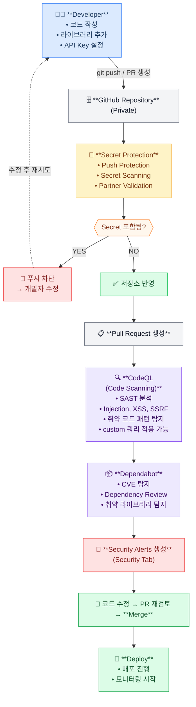

## 🔐 GHAS(GitHub Advanced Security)란?

**GitHub Advanced Security(GHAS)** 는 GitHub이 제공하는 엔터프라이즈급 보안 플랫폼으로, 소프트웨어 개발 생명주기(SDLC) 전반에 걸쳐 보안 취약점을 사전에 탐지하고 차단하는 것을 목적으로 합니다.

개발자가 코드를 작성하는 순간부터 PR 리뷰, CI/CD 파이프라인, 배포에 이르기까지 각 단계에서 보안 위협을 자동으로 감지하여 **"Shift Left Security"** — 즉, 보안을 개발 초기 단계로 앞당기는 전략을 실현합니다.

### GHAS의 주요 구성과 목적

- **Code Scanning(CodeQL)**: 개발자가 작성한 코드에서 SQL Injection, XSS 등 논리적 취약점을 정적 분석(SAST)으로 탐지
- **Dependabot**: 프로젝트가 사용하는 오픈소스 라이브러리의 알려진 CVE 취약점을 탐지하고 자동 업데이트 PR 생성 (SCA)
- **Secret Scanning / Push Protection**: 코드에 실수로 포함된 비밀 키·자격증명을 커밋 또는 Push 시점에 차단

> GHAS는 GitHub Enterprise Cloud/Server 구독에서 활성화할 수 있으며, GitHub.com의 퍼블릭 리포지토리는 무료로 일부 기능을 사용할 수 있습니다.

본 문서는 실제 고객의 질문들을 바탕으로 GHAS의 기능과 활용 방법을 설명하기 위해 작성되었습니다. 다만, 고객사의 신원을 보호하기 위해 질문은 일부 수정 및 일반화되었습니다. 

## ❓ 고객 질문 리스트

| # | 질문 |
|---|------|
| Q1 | GitHub Code Security와 GitHub Secret Protection은 어떤 차이가 있나요? 각각 어떤 기능을 포함하나요? |
| Q2 | CodeQL이 정확히 무엇인가요? 어떤 방식으로 취약점을 탐지하나요? |
| Q3 | CodeQL이 지원하는 프로그래밍 언어는 어떤 것들이 있나요? |
| Q4 | CodeQL을 GitHub Actions에 어떻게 설정하나요? PR 생성 시 자동으로 실행되게 할 수 있나요? |
| Q5 | CodeQL 분석 결과는 어디서 확인할 수 있나요? 취약점이 발견되면 어떻게 알 수 있나요? |
| Q6 | CodeQL에서 취약점이 발견되었을 때, PR 병합을 자동으로 차단할 수 있나요? 어떻게 설정하나요? |
| Q7 | 새로운 CVE나 CWE가 발생했을 때 CodeQL이 자동으로 대응할 수 있나요? 쿼리 업데이트는 어떻게 이루어지나요? |
| Q8 | CodeQL은 CVE를 탐지하나요, CWE를 탐지하나요? 둘의 차이가 무엇인가요? |
| Q9 | Dependabot은 어떤 역할을 하나요? CodeQL과 어떻게 다른가요? |
| Q10 | Dependabot이 취약한 라이브러리를 발견하면 배포(Merge)를 자동으로 막을 수 있나요? |
| Q11 | Dependabot으로 모든 취약점에 대해 병합을 차단하는 것이 맞나요? 예외를 두는 기준이 있나요? |
| Q12 | 실무에서 GHAS를 CI/CD 파이프라인에 통합하면 전체 흐름이 어떻게 되나요? |

---

## 📑 Agenda

1. [GHAS 기능별 역할과 설명](#1-ghas-기능별-역할과-설명)
2. [Code Scanning (CodeQL)](#2-code-scanning-codeql)
   - GitHub Actions 워크플로우 예시
   - 새로운 CWE / CVE 발생 시 CodeQL의 대응 방식
   - Branch Protection + Required Status Check 설정
3. [Dependabot이 하는 일](#3-dependabot이-하는-일)
   - 취약점 발견 시 병합(Merge) 방지 전략
   - CI에서 Dependency Review Action 활용
4. [실무에서 가장 많이 쓰는 구조](#4-실무에서-가장-많이-쓰는-구조)
   - 전체 보안 파이프라인 플로우차트

---

## 1. GHAS 기능별 역할과 설명
---
|제품명|포함 기능|설명|
|---|---|---|
|**GitHub Code Security**|Code Scanning (CodeQL), Copilot Autofix, Security Campaigns, Premium Dependabot 기능, Dependency Review | 취약점 탐지·수정 중심 (SAST + SCA)
|GitHub Secret Protection|Secret Scanning, Push Protection, AI 기반 비밀 탐지, Custom Patterns 등 |코드 안의 비밀(토큰/키) 누출 탐지·방지 중심|
---

이 문서에서는 **GitHub Code Security** 영역을 다루며, 특히 **Code Scanning (CodeQL)** 과 **Dependabot** 기능에 집중하여 설명합니다. Secret Protection 관련 내용은 다음에 포스팅할, 별도의 문서에서 다루도록 하겠습니다.

## 2.🔎 Code Scanning (CodeQL)

CodeQL은 정적 분석(SAST) 도구입니다. 소스코드를 분석해서 SQL Injection, XSS, 취약한 API 사용, 권한 검증 누락 같은 코드 자체의 취약점을 찾아냅니다. 👉 즉, 개발자가 작성한 코드의 논리적/구현상 취약점을 탐지합니다.
GitHub Actions에서 codeql-analysis 워크플로우로 실행됩니다.

기본 실행 시점:  
- PR 생성 시
- main 브랜치에 push 시
- 스케줄 실행 등

codeql이 지원하는 프로그래밍 언어는 다음 링크를 참고합니다.  
📢 [CodeQL 지원 언어](https://codeql.github.com/docs/codeql-overview/supported-languages-and-frameworks/?utm_source=chatgpt.com)

```yaml
# CodeQL 분석을 위한 GitHub Actions 워크플로우 예시
name: "CodeQL"

on:
  push:
    branches: [ "main" ]
  pull_request:
    branches: [ "main" ]
  schedule:
    - cron: '30 2 * * 1' # 매주 월요일 02:30 UTC에 실행

jobs:
  analyze:
    name: Analyze
    runs-on: ubuntu-latest
    permissions:
      actions: read
      contents: read
      security-events: write

    strategy:
      fail-fast: false
      matrix:
        language: [ 'go', 'python', 'javascript' ]
        # CodeQL은 다음 언어들을 지원합니다:
        # 'csharp', 'cpp', 'go', 'java', 'javascript', 'python', 'ruby'
        # 분석하려는 프로젝트의 언어에 맞게 수정하세요.

    steps:
    - name: Checkout repository
      uses: actions/checkout@v3

    # CodeQL Action을 초기화합니다.
    # 이 액션은 분석할 쿼리들을 체크아웃하고, CodeQL CLI를 PATH에 추가하며,
    # 나중에 생성될 CodeQL 데이터베이스의 위치를 지정합니다.
    - name: Initialize CodeQL
      uses: github/codeql-action/init@v2
      with:
        languages: ${{ matrix.language }}
        # 고급 설정을 위해 codeql-config.yml 파일을 사용할 수 있습니다.
        # config-file: ./.github/codeql/codeql-config.yml

    # Autobuild가 지원되는 언어(C#, C++, Go, Java, JavaScript, Python)의 경우,
    # 별도의 빌드 과정 없이 바로 분석할 수 있습니다.
    # 만약 특정 빌드 과정이 필요하다면, 여기에 빌드 스텝을 추가하세요.
    # 예:
    # - run: |
    #     echo "Run build steps here"

    - name: Perform CodeQL Analysis
      uses: github/codeql-action/analyze@v2
      with:
        category: "/language:${{matrix.language}}"
```

codeql 분석 결과는 GitHub의 Security 탭에서 확인할 수 있습니다. 또한, codeql 분석에서 취약점이 발견되면 PR에 자동으로 댓글이 달리고, 상태 검사(Status Check)가 실패로 표시됩니다. 또한 Merge를 차단하도록 브랜치 보호 규칙을 설정하여 Main 브랜치에 취약점이 포함된 코드를 병합하는 것을 방지할 수 있습니다. 

### 🔄 새로운 CWE / CVE 발생 시 CodeQL의 대응 방식

#### 1. GitHub Security Lab의 쿼리 연구·개발

GitHub 내부 보안 연구팀(**GitHub Security Lab**)이 새로운 CWE/CVE를 분석하고 탐지 쿼리를 작성합니다.

```
새로운 취약점 발생
    │
    ▼
GitHub Security Lab 분석
    │
    ▼
CodeQL 쿼리(.ql) 작성
    │
    ▼
codeql/codeql 공개 레포지터리에 PR 머지
    │
    ▼
쿼리팩(qlpack) 버전 릴리스
    │
    ▼
GitHub Actions에서 자동 반영
```

- 쿼리 소스: [`github/codeql`](https://github.com/github/codeql) 공개 레포지터리에서 모든 쿼리 관리
- 각 쿼리에는 대응 CWE 태그가 명시됨 (`@tags security/cwe/cwe-089` 등)

#### 2. 쿼리팩 자동 업데이트 메커니즘

**`codeql-action`의 버전 설정**이 핵심입니다.

```yaml
# codeql.yml - 버전을 latest로 두면 자동으로 최신 쿼리팩 사용
- uses: github/codeql-action/analyze@v3
  with:
    queries: security-extended  # 릴리스마다 쿼리 자동 추가
```

| 설정 방식 | 동작 | 특징 |
|---|---|---|
| `@v3` (권장) | 최신 마이너 버전 자동 수신 | 새 쿼리 자동 반영 |
| `@v3.x.y` (고정) | 해당 버전 고정 | 안정성 우선, 수동 업데이트 필요 |
| `queries: security-extended` | 확장 쿼리팩 사용 | 기본보다 더 많은 CWE 커버 |
| `queries: security-and-quality` | 보안+품질 통합 | 가장 광범위한 탐지 |

#### 3. CVE 대응 vs CWE 대응의 차이

CodeQL은 **CVE(특정 제품 취약점)** 가 아닌 **CWE(취약점 패턴)** 를 탐지합니다.

```
CVE-2024-XXXX (Log4j 특정 버전 취약점)
    │
    ▼
CWE-502 (신뢰할 수 없는 데이터 역직렬화) ← CodeQL이 탐지하는 단위
    │
    ▼
CodeQL 쿼리: 역직렬화 taint flow 탐지
    → 특정 CVE가 없어도 동일 패턴의 신규 취약점 선제 탐지 가능
```

- CVE 자체는 **Dependabot**이 담당 (NVD/GitHub Advisory DB 기반)
- CodeQL은 **코드 내 취약한 패턴** 탐지 → CVE보다 선제적

#### 4. 쿼리 업데이트 주기 및 알림

| 채널 | 내용 |
|---|---|
| [`github/codeql` Releases](https://github.com/github/codeql/releases) | 새 쿼리팩 릴리스 노트 (CWE 태그 포함) |
| GitHub Advisory Database | CVE ↔ 쿼리 매핑 정보 |
| Dependabot (`codeql-action` 업데이트) | `codeql-action` 신버전 PR 자동 생성 |
| GitHub Security Lab Blog | 주요 신규 쿼리 상세 설명 |

> **Dependabot이 `codeql-action` 버전 업데이트 PR을 자동 생성**하므로, 이를 머지하는 것만으로도 최신 쿼리팩이 적용됩니다.

#### 요약

| 대응 방식 | 담당 | 특징 |
|---|---|---|
| 공식 쿼리 릴리스 | GitHub Security Lab | 새 CWE → 쿼리 작성 → codeql-action 자동 반영 |
| CVE 대응 | Dependabot | Advisory DB 기반, 라이브러리 취약점 탐지 |
| 패턴 선제 탐지 | CodeQL (CWE 기반) | 특정 CVE 없이도 동일 패턴 신규 취약점 탐지 |
| 업데이트 자동화 | Dependabot | `codeql-action` 버전 업 PR 자동 생성 |

### 설정 방법: Branch Protection + Required Status Check

브랜치 규칙(Branch Rules)을 설정하여 codeql 분석에서 특정 심각도 이상의 취약점이 발견되면 PR 병합을 차단할 수 있습니다. 이는 GitHub 저장소의 **Settings > Branches** 에서 설정할 수 있습니다.

**[Require code scanning results]** 옵션을 체크하고, **[Required tools and alert thresholds]** 영역에 CodeQL을 도구로서 추가합니다. 또한, 병합을 차단할 심각도(Critical, High 등)를 지정합니다. 
이렇게 설정하면, codeql 분석에서 새로 추가된 코드에 대해 설정한 심각도 이상의 취약점이 발견되면 PR 병합이 자동으로 차단됩니다. 개발자는 PR에서 직접 취약점 내용을 확인하고 코드를 수정한 뒤 다시 푸시하여 상태 검사를 통과시켜야만 병합할 수 있습니다.

핵심은 취약점 코드가 Main 브랜치로 병합되는 것을 막는 것입니다.

## 3.📦 Dependabot이 하는 일

Dependabot은 의존성(라이브러리) 취약점 검사 도구입니다.

의존성 파일(package.json, pom.xml, requirements.txt 등)을 대상으로  

- 사용하는 라이브러리 버전을 확인
- GitHub Advisory DB와 비교하여 취약한 버전이면 경고를 발생
- 필요하면 자동으로 보안 업데이트 PR도 생성합니다.

👉 즉, 외부 라이브러리 취약점(CVE 기반) 을 탐지합니다.

### Dependabot 취약점 발견 시 병합(Merge) 방지?

병합을 막는 것이 유리하지만, 항상 그래야 하는 것은 아니며, 이건 운영 정책의 문제입니다.

**병합을 막는 것이 적절한 경우**  
: **High/Critical** 취약점이면 배포 차단이 일반적임. 특히 다음과 같은 경우에는 병합을 막는 것이 권장됩니다.
- 금융/핀테크
- 공공기관
- 의료
- 보안등급이 높은 SaaS
- ISO / ISMS-P / SOC2 대상 서비스

**병합을 막지 않는 것이 나은경우**  
: 무조건 차단하면 운영이 어려울 수 있음. 예외적으로 허용할 수 있는 경우는 다음과 같습니다.  
- 내부 시스템
- 낮은 severity
- 개발/테스트 환경
- 영향도 분석이 필요한 경우  


### 🚀 배포를 막는 방법들

#### 1️⃣ : Branch Protection + Required Status Check

PR에 대해 Dependabot Alert가 해결되지 않으면 merge 불가 설정. 이 설정은 codeql과 같은 보안 스캔이 상태 검사(Status Check)를 실패로 보고할 때 유용합니다.

⚠ 다만, Dependabot alert 자체는 기본적으로 status check가 아닙니다.  

#### 2️⃣ : CI에서 dependency review action 사용 (권장, ✅ 가장 현실적인 방법)

```yaml
- uses: actions/dependency-review-action@v4
```

이 액션은 PR에 추가된 dependency 중 취약점 severity가 설정값 이상이면 job을 실패시킴

예:
```yaml
- uses: actions/dependency-review-action@v4
  with:
    fail-on-severity: high
```

- High 이상이면 CI 실패
 -merge 불가
- 배포 불가


## 4.🔥 실무에서 가장 많이 쓰는 구조

보통 이렇게 구성합니다:




